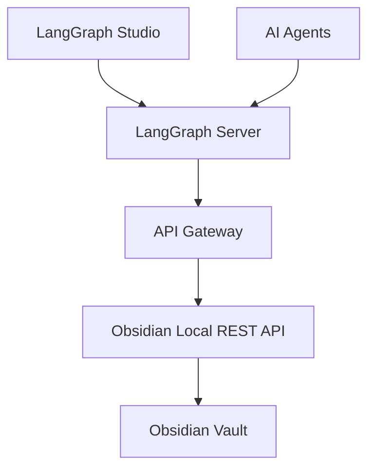

# LangGraph + Obsidian Vault Integration via MCP and REST API

## 1. Overview

This document outlines the architecture and implementation plan for a LangGraph-based system that enables AI agents to interact with an Obsidian vault through Model Context Protocol (MCP) tools and the Obsidian Local REST API. The system provides a unified backend for agentic automations that can read, write, and manipulate Markdown notes in a local Obsidian vault while maintaining safety through checkpointing, human-in-the-loop approvals, and rollback capabilities.

The integration focuses on enabling AI agents to perform complex workflows on Obsidian vault data through direct API calls and MCP tool abstractions, with emphasis on:

1. **Direct Data Access**: LangGraph agents can query the Obsidian vault through both REST API endpoints and MCP tools
2. **Stateful Operations**: Multi-step workflows with checkpointing and time-travel capabilities
3. **Safety Mechanisms**: Dry-run operations, conflict detection, and human-in-the-loop approvals
4. **Performance Optimization**: Caching, pagination, and efficient data retrieval strategies
5. **Observability**: Comprehensive tracing, logging, and monitoring of agent behaviors

## 2. System Architecture

### 2.1 High-Level Architecture

The system consists of multiple interconnected components:



### 2.2 Component Descriptions

1. **LangGraph Studio & Server**: Core agentic workflow engine for multi-agent systems with checkpointing and time-travel capabilities
2. **API Gateway**: FastAPI service that wraps Obsidian REST endpoints and exposes MCP tools
3. **Obsidian Local REST API**: RESTful interface for interacting with Obsidian vaults
4. **Obsidian Vault**: Local Markdown-based knowledge base
5. **AI Agents**: LLM-powered agents for intelligent note processing and automation

## 3. Infrastructure Layer

### 3.1 Containerization Strategy

The solution uses Docker for orchestrating all services in a single container environment:

```yaml
version: '3.9'
services:
  langgraph-obsidian:
    build: 
      context: .
      dockerfile: Dockerfile
    ports:
      - "8000:8000"   # API Gateway
      - "2024:2024"   # LangGraph Server
      - "2025:2025"   # LangGraph Studio
    environment:
      - OBSIDIAN_API_BASE=http://host.docker.internal:27123
      - OBSIDIAN_API_KEY=${OBSIDIAN_API_KEY}
      - LANGCHAIN_TRACING_V2=true
      - LANGCHAIN_API_KEY=${LANGCHAIN_API_KEY}
    volumes:
      - ${OBSIDIAN_VAULT_PATH}:/vault:rw
```

### 3.2 Vault Mounting Strategy

For WSL2 environments, proper volume mounting is crucial for file permissions and access:

```bash
# WSL2 volume mounting with proper permissions
/mnt/c/path/to/vault  # Windows C: drive path
# Enable metadata in /etc/wsl.conf:
# [automount]
# enabled = true
# options = "metadata,umask=022,fmask=011"
```

### 3.3 Networking Configuration

To ensure proper communication between containerized services and the host Obsidian REST API:

1. Use `host.docker.internal` to reach the host-bound Obsidian plugin
2. Configure port forwarding on Windows if needed:
   ```bash
   netsh interface portproxy add v4tov4 listenport=27123 connectaddress=127.0.0.1 connectport=27123
   ```

## 4. Data Layer

### 4.1 Obsidian Local REST API Endpoints

The Obsidian Local REST API provides direct access to the vault contents:

| Endpoint | Method | Description | Parameters |
|----------|--------|-------------|------------|
| `/vaults` | GET | List all vaults | None |
| `/vault/{vaultName}/files` | GET | List files in vault | `recursive` (bool), `filter` (string) |
| `/vault/{vaultName}/file/{path}` | GET | Read note content | None |
| `/vault/{vaultName}/file/{path}` | PUT | Create/update note | Body: Markdown content |
| `/vault/{vaultName}/file/{path}` | PATCH | Append/insert into note | Body: { "content": "text", "position": "end" } |
| `/vault/{vaultName}/file/{path}` | DELETE | Delete note | None |
| `/periodic/daily/{vaultName}` | GET | Get/create daily note | `date` (YYYY-MM-DD) |
| `/search/simple` | POST | Search notes | Body: { "query": "search term" } |

### 4.2 Data Models

#### 4.2.1 Note Model
```json
{
  "path": "string",
  "content": "string",
  "frontmatter": "object",
  "backlinks": ["string"],
  "_hash": "string"
}
```

#### 4.2.2 Chunk Model
```json
{
  "id": "string",
  "content": "string",
  "heading": "string",
  "hash": "string"
}
```

### 4.3 Safe Write Semantics

The API Gateway implements safe write operations with the following features:

1. **Dry-run by default**: All write operations default to `dry_run=true`
2. **Conflict detection**: Uses SHA256 hashing for ETag-like conflict detection
3. **Preflight validation**: Validates file state before writes

```python
class UpsertRequest(BaseModel):
    path: str
    content: str
    dry_run: bool = True
    if_match: Optional[str] = None
    mode: str = "upsert"
```

## 5. Indexing & Retrieval Layer

### 5.1 Indexer Architecture

The indexing system processes vault content for retrieval:

1. **Markdown Parsing**: Extracts frontmatter, headings, tags, and backlinks
2. **Chunking Strategy**: Splits content by headings or ~1000 tokens with overlap
3. **Embedding Generation**: Computes embeddings for each chunk
4. **Storage**: Stores embeddings in vector DB and links in graph DB

### 5.2 Vector Database Integration

Using Chroma as the vector database:

```python
import chromadb
from chromadb.config import Settings
import hashlib

client = chromadb.Client(Settings(
    chroma_db_impl="duckdb+parquet",
    persist_directory="/data/vector"
))

collection = client.get_or_create_collection("obsidian_notes")

class VaultIndexer:
    def __init__(self, chroma_client, vault_path):
        self.client = chroma_client
        self.collection = self.client.get_or_create_collection("obsidian_notes")
        self.vault_path = vault_path
    
    def chunk_markdown(self, content, path):
        """Chunk markdown content by headings"""
        chunks = []
        lines = content.split('\n')
        current_chunk = []
        current_heading = "Untitled"
        
        for line in lines:
            if line.startswith('#'):
                # Save previous chunk if it exists
                if current_chunk:
                    chunk_content = '\n'.join(current_chunk)
                    chunk_id = f"{path}::{current_heading}"
                    chunks.append({
                        "id": chunk_id,
                        "content": chunk_content,
                        "path": path,
                        "heading": current_heading
                    })
                # Start new chunk with heading
                current_heading = line.lstrip('#').strip()
                current_chunk = [line]
            else:
                current_chunk.append(line)
        
        # Add final chunk
        if current_chunk:
            chunk_content = '\n'.join(current_chunk)
            chunk_id = f"{path}::{current_heading}"
            chunks.append({
                "id": chunk_id,
                "content": chunk_content,
                "path": path,
                "heading": current_heading
            })
        
        return chunks
    
    def compute_embedding(self, text):
        """Compute embedding for text (simplified)"""
        # In a real implementation, this would use an actual embedding model
        # For example, OpenAI embeddings or a local model like SentenceTransformers
        import hashlib
        # Simplified hash-based "embedding" for demonstration
        return [ord(c) % 100 for c in hashlib.md5(text.encode()).hexdigest()][:128]
    
    def index_vault(self):
        """Index all markdown files in the vault"""
        import os
        import glob
        
        # Find all markdown files
        md_files = glob.glob(os.path.join(self.vault_path, "**/*.md"), recursive=True)
        
        documents = []
        embeddings = []
        metadatas = []
        ids = []
        
        for file_path in md_files:
            try:
                with open(file_path, 'r', encoding='utf-8') as f:
                    content = f.read()
                
                # Get relative path
                rel_path = os.path.relpath(file_path, self.vault_path)
                
                # Chunk the content
                chunks = self.chunk_markdown(content, rel_path)
                
                # Process each chunk
                for chunk in chunks:
                    # Compute embedding
                    embedding = self.compute_embedding(chunk["content"])
                    
                    # Add to collections
                    documents.append(chunk["content"])
                    embeddings.append(embedding)
                    metadatas.append({
                        "path": chunk["path"],
                        "heading": chunk["heading"]
                    })
                    ids.append(chunk["id"])
            except Exception as e:
                print(f"Error processing {file_path}: {e}")
        
        # Add to Chroma collection
        if documents:
            self.collection.add(
                documents=documents,
                embeddings=embeddings,
                metadatas=metadatas,
                ids=ids
            )
        
        return len(documents)

# Usage
# indexer = VaultIndexer(client, "/vault")
# indexed_count = indexer.index_vault()
```

### 5.3 Graph Database Schema

SQLite schema for link relationships:

```sql
CREATE TABLE nodes(
    id TEXT PRIMARY KEY,
    path TEXT,
    heading TEXT,
    hash TEXT,
    last_modified TIMESTAMP
);

CREATE TABLE edges(
    id TEXT PRIMARY KEY,
    src TEXT,
    dst TEXT,
    type TEXT,
    FOREIGN KEY(src) REFERENCES nodes(id),
    FOREIGN KEY(dst) REFERENCES nodes(id)
);

CREATE TABLE node_metadata(
    node_id TEXT,
    key TEXT,
    value TEXT,
    FOREIGN KEY(node_id) REFERENCES nodes(id)
);
```

### 5.4 Hybrid Retrieval

The search system combines multiple retrieval methods:

1. **Vector Search**: Semantic similarity using embeddings
2. **Keyword Filtering**: Metadata-based filtering
3. **Graph Expansion**: Boost results based on link relationships

```python
class HybridRetriever:
    def __init__(self, chroma_collection, graph_db_path):
        self.collection = chroma_collection
        self.graph_db_path = graph_db_path
    
    def search(self, query, k=10, filters=None):
        """Perform hybrid search combining vector and graph-based retrieval"""
        # 1. Vector search
        vector_results = self.collection.query(
            query_texts=[query],
            n_results=k*2,  # Get more results for reranking
            where=filters
        )
        
        # 2. Extract node IDs for graph expansion
        node_ids = vector_results['ids'][0]
        
        # 3. Graph expansion (simplified)
        import sqlite3
        conn = sqlite3.connect(self.graph_db_path)
        cursor = conn.cursor()
        
        expanded_node_ids = set(node_ids)
        
        # Find connected nodes
        for node_id in node_ids:
            cursor.execute("""
                SELECT dst FROM edges WHERE src = ?
                UNION
                SELECT src FROM edges WHERE dst = ?
            """, (node_id, node_id))
            
            connected = cursor.fetchall()
            for row in connected:
                expanded_node_ids.add(row[0])
        
        conn.close()
        
        # 4. Rerank based on graph connections
        # In a real implementation, this would use a more sophisticated ranking algorithm
        
        # 5. Return top k results
        # For simplicity, we'll just return the vector results
        return vector_results
    
    def get_related_notes(self, path, max_results=10):
        """Find notes related to a specific note"""
        # Find the node ID for the given path
        import sqlite3
        conn = sqlite3.connect(self.graph_db_path)
        cursor = conn.cursor()
        
        cursor.execute("SELECT id FROM nodes WHERE path = ?", (path,))
        result = cursor.fetchone()
        
        if not result:
            conn.close()
            return []
        
        node_id = result[0]
        
        # Find connected nodes
        cursor.execute("""
            SELECT n.path, n.heading FROM edges e
            JOIN nodes n ON (e.dst = n.id OR e.src = n.id)
            WHERE (e.src = ? OR e.dst = ?) AND n.id != ?
            LIMIT ?
        """, (node_id, node_id, node_id, max_results))
        
        related = cursor.fetchall()
        conn.close()
        
        return [{"path": row[0], "heading": row[1]} for row in related]
```

## 6. LangGraph MCP Tooling Layer

### 6.1 MCP Integration Principles

Each Obsidian API endpoint is mapped to an MCP tool with the following principles:

1. **JSON I/O**: All tools accept and return structured JSON
2. **Error Handling**: Consistent error responses with retry logic
3. **Schema Validation**: Pydantic models for request/response validation
4. **Idempotency**: Tools should be idempotent when possible
5. **Observability**: All tool calls are traced and logged

### 6.2 Core MCP Tools

#### 6.2.1 obsidian_list_files
```yaml
name: obsidian_list_files
description: List files in an Obsidian vault
parameters:
  type: object
  properties:
    vault:
      type: string
      description: Name of the vault
    cursor:
      type: string
      description: Pagination cursor
    limit:
      type: integer
      description: Maximum number of files to return
      default: 100
    filter:
      type: string
      description: Filter files by path or pattern
  required:
    - vault
```

#### 6.2.2 obsidian_read_note
```yaml
name: obsidian_read_note
description: Read content of a note from Obsidian vault
parameters:
  type: object
  properties:
    vault:
      type: string
      description: Name of the vault
    path:
      type: string
      description: Path to the note
  required:
    - vault
    - path
returns:
  type: object
  properties:
    path:
      type: string
      description: Path to the note
    content:
      type: string
      description: Content of the note
    _hash:
      type: string
      description: SHA256 hash of the content for conflict detection
```

#### 6.2.3 obsidian_put_file
```yaml
name: obsidian_put_file
description: Create or update a file in Obsidian vault
parameters:
  type: object
  properties:
    vault:
      type: string
      description: Name of the vault
    path:
      type: string
      description: Path to the file
    content:
      type: string
      description: Content to write
    dry_run:
      type: boolean
      description: Whether to perform a dry run
      default: true
    if_match:
      type: string
      description: Hash for conflict detection
    mode:
      type: string
      description: Write mode (upsert, create, update)
      default: upsert
  required:
    - vault
    - path
    - content
```

#### 6.2.4 obsidian_patch_file
```yaml
name: obsidian_patch_file
description: Patch content in an Obsidian file
parameters:
  type: object
  properties:
    vault:
      type: string
      description: Name of the vault
    path:
      type: string
      description: Path to the file
    patch_ops:
      type: array
      items:
        type: object
        properties:
          op:
            type: string
            enum: ["append", "insert", "replace"]
          content:
            type: string
          position:
            type: string
            description: Position for insert operations
          heading:
            type: string
            description: Heading for append operations
    dry_run:
      type: boolean
      description: Whether to perform a dry run
      default: true
  required:
    - vault
    - path
    - patch_ops
```

#### 6.2.5 obsidian_delete_file
```yaml
name: obsidian_delete_file
description: Delete a file from Obsidian vault
parameters:
  type: object
  properties:
    vault:
      type: string
      description: Name of the vault
    path:
      type: string
      description: Path to the file
    confirm:
      type: boolean
      description: Confirmation flag
      default: false
  required:
    - vault
    - path
```

#### 6.2.6 obsidian_get_daily
```yaml
name: obsidian_get_daily
description: Get or create a daily note
parameters:
  type: object
  properties:
    vault:
      type: string
      description: Name of the vault
    date:
      type: string
      format: date
      description: Date for the daily note (YYYY-MM-DD)
      default: today
  required:
    - vault
```

#### 6.2.7 obsidian_search_notes
```yaml
name: obsidian_search_notes
description: Search notes in the Obsidian vault
parameters:
  type: object
  properties:
    vault:
      type: string
      description: Name of the vault
    query:
      type: string
      description: Search query
    limit:
      type: integer
      description: Maximum number of results
      default: 20
    filters:
      type: object
      description: Additional filters for search
      properties:
        tags:
          type: array
          items:
            type: string
        path_prefix:
          type: string
        modified_after:
          type: string
          format: date-time
  required:
    - vault
    - query
```

### 6.3 Advanced MCP Tools

#### 6.3.1 obsidian_analyze_structure
```yaml
name: obsidian_analyze_structure
description: Analyze the structure of the Obsidian vault
parameters:
  type: object
  properties:
    vault:
      type: string
      description: Name of the vault
    include_stats:
      type: boolean
      description: Include detailed statistics
      default: false
  required:
    - vault
```

#### 6.3.2 obsidian_find_related_notes
```yaml
name: obsidian_find_related_notes
description: Find notes related to a specific note based on content and links
parameters:
  type: object
  properties:
    vault:
      type: string
      description: Name of the vault
    path:
      type: string
      description: Path to the reference note
    max_results:
      type: integer
      description: Maximum number of related notes to return
      default: 10
    method:
      type: string
      description: Method for finding related notes (content, links, tags)
      default: content
  required:
    - vault
    - path
```

#### 6.3.3 obsidian_generate_summary
```yaml
name: obsidian_generate_summary
description: Generate a summary of a note or set of notes
parameters:
  type: object
  properties:
    vault:
      type: string
      description: Name of the vault
    paths:
      type: array
      items:
        type: string
      description: Paths to notes to summarize
    style:
      type: string
      description: Summary style (bullet, paragraph, outline)
      default: bullet
    length:
      type: string
      description: Desired length (short, medium, long)
      default: medium
  required:
    - vault
```

## 7. LangGraph Workflows Layer

### 7.1 Graph Design Principles

LangGraph workflows follow these principles:

1. **Modular Nodes**: Each node represents a specific function (LLM call or tool)
2. **Conditional Edges**: Flow control based on node outputs
3. **State Management**: Persistent state through checkpointing
4. **Human-in-the-loop**: Approval steps for critical operations

### 7.2 Core Agent Nodes

#### 7.2.1 Router Node
Classifies user requests into categories:
- READ: Information retrieval
- WRITE: Content creation/modification
- SEARCH: Complex queries
- ORGANIZE: Structure management

#### 7.2.2 Reader Node
Executes `obsidian_read_note` tool calls to fetch note content.

#### 7.2.3 Writer Node
Handles note creation and updates with safety features:
- Defaults to dry-run mode
- Requires human approval for actual writes
- Implements conflict detection

#### 7.2.4 Search Node
Performs hybrid retrieval using `obsidian_search_notes` tool.

#### 7.2.5 Summarizer Node
Processes note content to generate summaries using LLMs.

#### 7.2.6 Supervisor Node
Enforces human-in-the-loop policies and approval workflows.

### 7.3 ByteHover Decomposition

All agent workflows use ByteHover-style micro-tasking:

```json
{
  "steps": [
    {
      "id": 1,
      "tool": "obsidian_list_files",
      "inputs": {
        "vault": "Main",
        "filter": "inbox/"
      }
    },
    {
      "id": 2,
      "tool": "obsidian_read_note",
      "inputs": {
        "vault": "Main",
        "path": "inbox/task1.md"
      }
    }
  ]
}
```

### 7.4 Checkpointing and State Management

LangGraph provides built-in checkpointing for stateful operations:

```python
from langgraph.checkpoint.sqlite import SqliteSaver

memory = SqliteSaver.from_conn_string(":memory:")
app = workflow.compile(checkpointer=memory)

config = {"configurable": {"thread_id": "1"}}
result = app.invoke({
    "messages": ["Hello"], 
    "vault_data": {"last_query": "/vault/main/files", "last_result": []}
}, config)
```

### 7.5 Human-in-the-Loop Workflow

The HITL workflow ensures safe operations:

1. Agent prepares write operation in dry-run mode
2. System presents diff for review
3. Human approves via `/approve/{tool_call_id}`
4. System executes actual write

```python
from pydantic import BaseModel
from typing import Optional, Dict, Any
import uuid
from datetime import datetime

class PendingOperation(BaseModel):
    tool_call_id: str
    operation_type: str
    vault: str
    path: str
    content: str
    dry_run_result: Dict[Any, Any]
    created_at: datetime
    created_by: str
    approved_by: Optional[str] = None
    approved_at: Optional[datetime] = None

# In-memory storage for pending operations (in production, use a database)
pending_operations = {}

@app.post("/approve/{tool_call_id}")
async def approve_tool_call(tool_call_id: str, approved_by: str):
    """Approve a pending operation"""
    if tool_call_id not in pending_operations:
        raise HTTPException(status_code=404, detail="Operation not found")
    
    operation = pending_operations[tool_call_id]
    if operation.approved_by:
        raise HTTPException(status_code=400, detail="Operation already approved")
    
    # Update operation status
    operation.approved_by = approved_by
    operation.approved_at = datetime.utcnow()
    
    # Execute the actual operation
    try:
        result = await execute_vault_operation(
            operation.operation_type,
            operation.vault,
            operation.path,
            operation.content,
            dry_run=False
        )
        
        # Log the approval
        await log_audit_event(
            session_id="unknown",  # In practice, extract from context
            tool_call_id=tool_call_id,
            action="approve",
            path=f"{operation.vault}/{operation.path}",
            details={
                "approved_by": approved_by,
                "operation_type": operation.operation_type
            }
        )
        
        # Remove from pending operations
        del pending_operations[tool_call_id]
        
        return {
            "status": "approved",
            "result": result,
            "approved_by": approved_by,
            "approved_at": operation.approved_at.isoformat() + "Z"
        }
    except Exception as e:
        raise HTTPException(status_code=500, detail=f"Failed to execute operation: {str(e)}")

@app.get("/pending_operations")
async def list_pending_operations():
    """List all pending operations requiring approval"""
    return [
        {
            "tool_call_id": op.tool_call_id,
            "operation_type": op.operation_type,
            "vault": op.vault,
            "path": op.path,
            "created_at": op.created_at.isoformat() + "Z",
            "created_by": op.created_by
        }
        for op in pending_operations.values()
        if not op.approved_by
    ]

@app.get("/pending_operations/{tool_call_id}")
async def get_pending_operation(tool_call_id: str):
    """Get details of a specific pending operation"""
    if tool_call_id not in pending_operations:
        raise HTTPException(status_code=404, detail="Operation not found")
    
    op = pending_operations[tool_call_id]
    return {
        "tool_call_id": op.tool_call_id,
        "operation_type": op.operation_type,
        "vault": op.vault,
        "path": op.path,
        "dry_run_result": op.dry_run_result,
        "created_at": op.created_at.isoformat() + "Z",
        "created_by": op.created_by,
        "approved_by": op.approved_by,
        "approved_at": op.approved_at.isoformat() + "Z" if op.approved_at else None
    }

# Integration with the write operation
@app.put("/vault/{vault}/file/{path:path}")
async def upsert_file(vault: str, path: str, req: UpsertRequest):
    """Create or update a file in the vault with HITL support"""
    # Generate a unique tool call ID
    tool_call_id = str(uuid.uuid4())
    
    # Conflict detection
    if req.if_match:
        try:
            current_file = await read_file(vault, path)
            current_hash = current_file.get("_hash")
            if current_hash != req.if_match:
                raise HTTPException(status_code=409, detail="File has been modified by another process")
        except HTTPException:
            raise
        except Exception:
            # File might not exist yet
            pass
    
    # Dry run mode
    if req.dry_run:
        dry_run_result = {
            "proposed_content": req.content[:200] + "..." if len(req.content) > 200 else req.content,
            "content_length": len(req.content)
        }
        
        # Store pending operation if it requires approval
        pending_op = PendingOperation(
            tool_call_id=tool_call_id,
            operation_type="upsert",
            vault=vault,
            path=path,
            content=req.content,
            dry_run_result=dry_run_result,
            created_at=datetime.utcnow(),
            created_by="system"  # In practice, extract from auth context
        )
        
        pending_operations[tool_call_id] = pending_op
        
        return {
            "dry_run": True,
            "tool_call_id": tool_call_id,
            "result": dry_run_result,
            "approval_required": True,
            "approval_endpoint": f"/approve/{tool_call_id}"
        }
    
    # Actual write (when not in dry-run mode)
    async with httpx.AsyncClient() as client:
        try:
            headers = await get_obsidian_headers()
            payload = {"content": req.content}
            response = await client.put(f"{BASE_URL}/vault/{vault}/file/{path}", 
                                      headers=headers, json=payload)
            response.raise_for_status()
            return response.json()
        except httpx.HTTPError as e:
            raise HTTPException(status_code=502, detail=f"Obsidian API error: {str(e)}")
```

## 8. Testing Strategy

### 8.1 Unit Testing

Unit tests focus on individual components:

```python
import pytest
from api_gateway.app.main import app
from fastapi.testclient import TestClient
from unittest.mock import AsyncMock, patch

client = TestClient(app)

@patch('api_gateway.app.main.httpx.AsyncClient')
def test_list_vaults(mock_http_client):
    # Mock the HTTP response
    mock_response = AsyncMock()
    mock_response.status_code = 200
    mock_response.json.return_value = {"vaults": ["Main", "Test"]}
    mock_response.raise_for_status.return_value = None
    
    mock_client_instance = AsyncMock()
    mock_client_instance.get.return_value = mock_response
    mock_http_client.return_value.__aenter__.return_value = mock_client_instance
    
    response = client.get("/vaults")
    assert response.status_code == 200
    assert "vaults" in response.json()
    assert response.json()["vaults"] == ["Main", "Test"]

@patch('api_gateway.app.main.httpx.AsyncClient')
def test_read_note(mock_http_client):
    # Mock the HTTP response
    mock_response = AsyncMock()
    mock_response.status_code = 200
    mock_response.json.return_value = {
        "path": "test/file/note.md",
        "content": "# Test Note\nThis is a test note."
    }
    mock_response.raise_for_status.return_value = None
    
    mock_client_instance = AsyncMock()
    mock_client_instance.get.return_value = mock_response
    mock_http_client.return_value.__aenter__.return_value = mock_client_instance
    
    response = client.get("/vault/test/file/note.md")
    assert response.status_code == 200
    assert "content" in response.json()
    assert "_hash" in response.json()

def test_upsert_request_validation():
    """Test validation of UpsertRequest model"""
    from api_gateway.app.main import UpsertRequest
    
    # Valid request
    req = UpsertRequest(
        path="test/file.md",
        content="Test content"
    )
    assert req.path == "test/file.md"
    assert req.content == "Test content"
    assert req.dry_run == True  # Default value
    
    # Request with all fields
    req = UpsertRequest(
        path="test/file.md",
        content="Test content",
        dry_run=False,
        if_match="abc123",
        mode="create"
    )
    assert req.dry_run == False
    assert req.if_match == "abc123"
    assert req.mode == "create"
```

### 8.2 Integration Testing

Integration tests use a fixture vault:

```python
import pytest
import tempfile
import os
import shutil
from fastapi.testclient import TestClient

@pytest.fixture
def fixture_vault():
    """Create a temporary fixture vault for testing"""
    # Create temporary directory
    vault_dir = tempfile.mkdtemp()
    
    # Create test files
    os.makedirs(os.path.join(vault_dir, "inbox"), exist_ok=True)
    os.makedirs(os.path.join(vault_dir, "projects"), exist_ok=True)
    
    # Create test notes
    with open(os.path.join(vault_dir, "inbox", "task1.md"), "w") as f:
        f.write("# Task 1\nThis is the first task.")
    
    with open(os.path.join(vault_dir, "projects", "project1.md"), "w") as f:
        f.write("# Project 1\nThis is the first project.")
    
    yield vault_dir
    
    # Cleanup
    shutil.rmtree(vault_dir)

@pytest.fixture
def test_client(fixture_vault):
    """Create test client with fixture vault"""
    # Set environment variables for testing
    os.environ["OBSIDIAN_VAULT_PATH"] = fixture_vault
    os.environ["OBSIDIAN_API_BASE"] = "http://mock-api:27123"
    
    # Import and return the app
    from api_gateway.app.main import app
    return TestClient(app)

@pytest.mark.asyncio
async def test_write_conflict(test_client):
    """Test write conflict detection"""
    # First, read a file to get its hash
    response1 = test_client.get("/vault/test/file/test.md")
    
    # If file doesn't exist, create it first
    if response1.status_code == 404:
        response_create = test_client.put("/vault/test/file/test.md", 
                                        json={"content": "initial"})
        assert response_create.status_code == 200
        
        # Now read it to get hash
        response1 = test_client.get("/vault/test/file/test.md")
    
    assert response1.status_code == 200
    file_hash = response1.json().get("_hash")
    
    # Try to overwrite with wrong hash
    response2 = test_client.put("/vault/test/file/test.md", 
                              json={
                                  "content": "conflict",
                                  "if_match": "wrong_hash"
                              })
    
    assert response2.status_code == 409  # Conflict
    
    # Try to overwrite with correct hash
    response3 = test_client.put("/vault/test/file/test.md", 
                              json={
                                  "content": "updated",
                                  "if_match": file_hash
                              })
    
    # This should succeed (in a real test with a mock API)
    # assert response3.status_code == 200

@pytest.mark.asyncio
async def test_dry_run_write(test_client):
    """Test dry-run write operation"""
    response = test_client.put("/vault/test/file/new.md", 
                             json={
                                 "content": "New file content",
                                 "dry_run": True
                             })
    
    assert response.status_code == 200
    result = response.json()
    assert result["dry_run"] == True
    assert "tool_call_id" in result
    assert "approval_required" in result
    assert result["approval_required"] == True
```

### 8.3 End-to-End Testing

E2E tests validate complete workflows:

```python
import pytest
from langgraph.checkpoint.sqlite import SqliteSaver

@pytest.mark.asyncio
async def test_daily_note_summary_workflow():
    """Test the complete daily note summary workflow"""
    # This test would:
    # 1. Create a test daily note
    # 2. Trigger the LangGraph workflow
    # 3. Validate the sequence of tool calls
    # 4. Check the final state of the vault
    
    # For this example, we'll test the workflow structure
    from api_gateway.app.langgraph_impl import workflow
    
    # Compile the workflow with checkpointing
    memory = SqliteSaver.from_conn_string(":memory:")
    app = workflow.compile(checkpointer=memory)
    
    # Test initial state
    config = {"configurable": {"thread_id": "test_workflow_1"}}
    result = await app.ainvoke({
        "messages": ["Summarize today's daily note"],
        "vault_data": {}
    }, config)
    
    # Validate the result structure
    assert "messages" in result
    assert "vault_data" in result
    assert "tool_calls" in result
    
    # Check that the workflow progressed as expected
    # (This would depend on your specific workflow implementation)

@pytest.mark.asyncio
async def test_inbox_organization_workflow():
    """Test the inbox organization workflow"""
    # This test would:
    # 1. Create test files in the inbox
    # 2. Trigger the organization workflow
    # 3. Validate that files are moved to correct locations
    # 4. Check that HITL approvals are requested
    
    # Test the workflow structure
    from api_gateway.app.langgraph_impl import workflow
    
    memory = SqliteSaver.from_conn_string(":memory:")
    app = workflow.compile(checkpointer=memory)
    
    config = {"configurable": {"thread_id": "test_workflow_2"}}
    result = await app.ainvoke({
        "messages": ["Organize inbox files"],
        "vault_data": {}
    }, config)
    
    # Validate result structure
    assert "messages" in result
    assert "current_task" in result
    
    # Check that the workflow classified the task correctly
    # (This would depend on your specific implementation)

@pytest.mark.asyncio
async def test_hitr_approval_workflow():
    """Test the human-in-the-loop approval workflow"""
    # This test would:
    # 1. Trigger a workflow that requires approval
    # 2. Verify that a pending operation is created
    # 3. Approve the operation
    # 4. Verify that the operation is executed
    
    # Test the approval endpoints
    from fastapi.testclient import TestClient
    from api_gateway.app.main import app
    
    client = TestClient(app)
    
    # First, create a dry-run operation
    response = client.put("/vault/test/file/approval_test.md", 
                         json={
                             "content": "Content requiring approval",
                             "dry_run": True
                         })
    
    assert response.status_code == 200
    result = response.json()
    assert result["dry_run"] == True
    assert "tool_call_id" in result
    
    tool_call_id = result["tool_call_id"]
    
    # Check that the operation is in the pending list
    pending_response = client.get("/pending_operations")
    assert pending_response.status_code == 200
    pending_ops = pending_response.json()
    assert len(pending_ops) > 0
    assert any(op["tool_call_id"] == tool_call_id for op in pending_ops)
    
    # Get details of the specific operation
    op_details_response = client.get(f"/pending_operations/{tool_call_id}")
    assert op_details_response.status_code == 200
```

### 8.4 Performance Testing

Performance tests validate system behavior under load:

```python
import pytest
import asyncio
import time
from fastapi.testclient import TestClient

@pytest.mark.performance
def test_concurrent_file_reads(test_client):
    """Test concurrent file read performance"""
    # Create multiple concurrent requests
    start_time = time.time()
    
    async def read_file(path):
        return test_client.get(f"/vault/test/file/{path}")
    
    # Simulate 10 concurrent reads
    tasks = [read_file(f"file_{i}.md") for i in range(10)]
    responses = asyncio.gather(*tasks)
    
    # Check that all requests completed successfully
    for response in responses:
        assert response.status_code == 200
    
    end_time = time.time()
    total_time = end_time - start_time
    
    # Assert that the total time is reasonable (adjust threshold as needed)
    assert total_time < 5.0  # Should complete within 5 seconds

@pytest.mark.performance
def test_large_file_handling(test_client):
    """Test handling of large files"""
    # Create a large content string
    large_content = "A" * 100000  # 100KB of content
    
    # Test writing a large file
    response = test_client.put("/vault/test/file/large.md", 
                             json={
                                 "content": large_content,
                                 "dry_run": True
                             })
    
    assert response.status_code == 200
    result = response.json()
    assert "dry_run" in result
    
    # Test reading the large file (would require mocking in real tests)
    # response = test_client.get("/vault/test/file/large.md")
    # assert response.status_code == 200
```

### 8.5 Contract Testing

Contract tests validate API compliance:

```python
import schemathesis
from api_gateway.app.main import app

# Generate tests from OpenAPI schema
schema = schemathesis.from_asgi("/openapi.json", app)

@schema.parametrize()
def test_api_schema(case):
    """Test API compliance with OpenAPI schema"""
    # This will automatically generate tests for all API endpoints
    # based on the OpenAPI specification
    response = case.call_asgi()
    case.validate_response(response)
```

## 9. Observability Layer

### 9.1 LangSmith Tracing

Enable LangChain tracing for detailed observability:

```python
import os
os.environ["LANGCHAIN_TRACING_V2"] = "true"
os.environ["LANGCHAIN_API_KEY"] = "your-key"
os.environ["LANGCHAIN_PROJECT"] = "obsidian-agents"

# In your LangGraph nodes, add tracing context
from langchain.callbacks import tracing_v2_enabled

async def traced_node(state: AgentState):
    with tracing_v2_enabled() as cb:
        # Add metadata to traces
        cb.on_chain_start(
            serialized={},
            inputs=state,
            metadata={
                "vault_path": state.get("vault_path", ""),
                "tool_call_id": state.get("current_tool_call", ""),
                "session_id": state.get("session_id", "")
            }
        )
        
        # Your node logic here
        result = await process_vault_data(state)
        
        cb.on_chain_end(outputs=result)
        return result
```

### 9.2 OpenTelemetry Integration

Instrument FastAPI with OpenTelemetry:

```python
from opentelemetry import trace
from opentelemetry.instrumentation.fastapi import FastAPIInstrumentor
from opentelemetry.sdk.trace import TracerProvider
from opentelemetry.sdk.trace.export import BatchSpanProcessor
from opentelemetry.exporter.otlp.proto.grpc.trace_exporter import OTLPSpanExporter

# Set up tracing
trace.set_tracer_provider(TracerProvider())
tracer = trace.get_tracer(__name__)

# Export to OTLP collector (e.g., Jaeger, Zipkin)
otlp_exporter = OTLPSpanExporter(endpoint="http://otel-collector:4317", insecure=True)
span_processor = BatchSpanProcessor(otlp_exporter)
trace.get_tracer_provider().add_span_processor(span_processor)

# Instrument FastAPI
FastAPIInstrumentor.instrument_app(app)

# Add custom spans in your endpoints
@app.get("/vault/{vault}/file/{path:path}")
async def read_file(vault: str, path: str):
    with tracer.start_as_current_span("read_file") as span:
        span.set_attribute("vault", vault)
        span.set_attribute("path", path)
        
        # Your logic here
        result = await fetch_file_content(vault, path)
        
        span.set_attribute("file_size", len(result.get("content", "")))
        return result
```

### 9.3 Prometheus Metrics

Export key metrics for monitoring:

```python
from prometheus_client import Counter, Histogram, Gauge

# Define metrics
REQUEST_COUNT = Counter(
    "gateway_requests_total", 
    "HTTP requests", 
    ["method", "endpoint", "status"]
)

REQUEST_LATENCY = Histogram(
    "gateway_request_latency_seconds", 
    "Request latency", 
    ["endpoint"]
)

ACTIVE_SESSIONS = Gauge(
    "gateway_active_sessions",
    "Number of active agent sessions"
)

VAULT_FILE_COUNT = Gauge(
    "vault_file_count",
    "Total number of files in the vault",
    ["vault"]
)

TOOL_CALL_COUNT = Counter(
    "tool_calls_total",
    "Number of tool calls made",
    ["tool_name", "success"]
)

# Instrument your endpoints
import time

@app.get("/vault/{vault}/files")
async def list_files(vault: str, cursor: str = None, limit: int = 100):
    start_time = time.time()
    
    try:
        result = await fetch_file_list(vault, cursor, limit)
        REQUEST_COUNT.labels(method="GET", endpoint="/vault/{vault}/files", status="200").inc()
        return result
    except Exception as e:
        REQUEST_COUNT.labels(method="GET", endpoint="/vault/{vault}/files", status="500").inc()
        raise e
    finally:
        REQUEST_LATENCY.labels(endpoint="/vault/{vault}/files").observe(time.time() - start_time)
```

### 9.4 Audit Logging

All operations are logged for audit purposes:

```python
import json
import logging
from datetime import datetime
from typing import Dict, Any

# Set up audit logger
audit_logger = logging.getLogger("audit")
audit_logger.setLevel(logging.INFO)

# Add file handler for audit logs
handler = logging.FileHandler("/var/log/obsidian-agents/audit.log")
formatter = logging.Formatter('%(asctime)s - %(message)s')
handler.setFormatter(formatter)
audit_logger.addHandler(handler)

async def log_audit_event(
    session_id: str,
    tool_call_id: str,
    action: str,
    path: str,
    before_hash: str = None,
    after_hash: str = None,
    details: Dict[Any, Any] = None
):
    """Log an audit event for vault operations"""
    audit_event = {
        "timestamp": datetime.utcnow().isoformat() + "Z",
        "session_id": session_id,
        "tool_call_id": tool_call_id,
        "action": action,
        "path": path,
        "before_hash": before_hash,
        "after_hash": after_hash,
        "details": details or {}
    }
    
    audit_logger.info(json.dumps(audit_event))

# Usage in your endpoints
@app.put("/vault/{vault}/file/{path:path}")
async def upsert_file(vault: str, path: str, req: UpsertRequest):
    # Log the audit event
    await log_audit_event(
        session_id=req.session_id if hasattr(req, 'session_id') else "unknown",
        tool_call_id=req.tool_call_id if hasattr(req, 'tool_call_id') else "unknown",
        action="write",
        path=f"{vault}/{path}",
        before_hash=req.if_match,
        details={
            "dry_run": req.dry_run,
            "content_length": len(req.content)
        }
    )
    
    # Your existing logic
    return await perform_upsert(vault, path, req)
```

### 9.5 Structured Logging

Implement structured logging for better debugging:

```python
import structlog
import logging

# Configure structured logging
structlog.configure(
    processors=[
        structlog.stdlib.filter_by_level,
        structlog.stdlib.add_logger_name,
        structlog.stdlib.add_log_level,
        structlog.stdlib.PositionalArgumentsFormatter(),
        structlog.processors.TimeStamper(fmt="iso"),
        structlog.processors.StackInfoRenderer(),
        structlog.processors.format_exc_info,
        structlog.processors.UnicodeDecoder(),
        structlog.processors.JSONRenderer()
    ],
    context_class=dict,
    logger_factory=structlog.stdlib.LoggerFactory(),
    wrapper_class=structlog.stdlib.BoundLogger,
    cache_logger_on_first_use=True,
)

logger = structlog.get_logger()

# Usage in your code
async def process_vault_operation(operation_type: str, vault_path: str, **kwargs):
    logger.info(
        "vault_operation_started",
        operation_type=operation_type,
        vault_path=vault_path,
        parameters=kwargs
    )
    
    try:
        result = await perform_operation(operation_type, vault_path, **kwargs)
        logger.info(
            "vault_operation_completed",
            operation_type=operation_type,
            vault_path=vault_path,
            result_size=len(str(result)) if result else 0
        )
        return result
    except Exception as e:
        logger.error(
            "vault_operation_failed",
            operation_type=operation_type,
            vault_path=vault_path,
            error=str(e),
            error_type=type(e).__name__
        )
        raise
```

## 10. Performance Optimization

### 10.1 Caching Strategy

Implement multi-level caching:

```python
from functools import lru_cache

@lru_cache(maxsize=128)
def cached_read_note(path: str):
    # Implementation with cache TTL
    pass
```

### 10.2 Pagination Optimization

Efficiently handle large file listings:

```python
@app.get("/vault/{vault}/files")
async def list_files(vault: str, cursor: str = None, limit: int = 100):
    # Server-side pagination
    pass
```

### 10.3 Embedding Caching

Cache embeddings by content hash:

```python
def get_embedding(content: str):
    content_hash = hashlib.sha256(content.encode()).hexdigest()
    # Check cache first, compute if missing
    pass
```

## 11. Security Considerations

### 11.1 API Key Management

Securely manage API keys:

```python
import os
OBSIDIAN_API_KEY = os.getenv("OBSIDIAN_API_KEY")
```

### 11.2 Write Protection

Implement directory whitelisting:

```python
ALLOWED_WRITE_PATHS = ["/inbox/", "/drafts/", "/agents/"]

def is_allowed_path(path: str) -> bool:
    return any(path.startswith(allowed) for allowed in ALLOWED_WRITE_PATHS)
```

### 11.3 Network Security

Restrict network access:
- Bind Obsidian REST API to localhost
- Use `host.docker.internal` for container-to-host communication
- Implement firewall rules as needed

## 12. Deployment Considerations

### 12.1 Production Deployment

For production environments:

1. **Container Orchestration**: Use Kubernetes for scaling
2. **Load Balancing**: Implement load balancers for high availability
3. **Persistent Storage**: Use volumes for vector DB and checkpoints
4. **Secrets Management**: Use Kubernetes secrets or similar

### 12.2 Backup and Recovery

Implement regular backup procedures:

1. **Vault Backups**: Regular snapshots of Obsidian vault
2. **Database Backups**: Backup vector and graph databases
3. **Configuration Backups**: Store configuration in version control

## 13. Example Workflows

### 13.1 Daily Note Summary Workflow

1. Router classifies task as "READ + SUMMARIZE + WRITE"
2. Reader calls `obsidian_read_note` for today's daily note
3. Summarizer generates summary with LLM
4. Writer prepares append operation under "## Summary" heading
5. Supervisor pauses for HITL approval
6. Upon approval, writer executes actual append

### 13.2 Inbox Organization Workflow

1. Router identifies task as "ORGANIZE"
2. Reader lists files in `/inbox/` using `obsidian_list_files`
3. Classifier categorizes each note
4. Organizer moves files to appropriate directories
5. Each move requires HITL approval

## 14. API Gateway Implementation

### 14.1 Core Endpoints

```python
from fastapi import FastAPI, HTTPException
from pydantic import BaseModel
import httpx
import hashlib
import os

class UpsertRequest(BaseModel):
    path: str
    content: str
    dry_run: bool = True
    if_match: str = None
    mode: str = "upsert"

class ListFilesRequest(BaseModel):
    vault: str
    cursor: str = None
    limit: int = 100
    filter: str = None

class ReadNoteRequest(BaseModel):
    vault: str
    path: str

app = FastAPI(title="Obsidian Agents Gateway")
BASE_URL = os.getenv("OBSIDIAN_API_BASE", "http://host.docker.internal:27123")
API_KEY = os.getenv("OBSIDIAN_API_KEY", "")

async def get_obsidian_headers():
    return {"Authorization": f"Bearer {API_KEY}"} if API_KEY else {}

@app.get("/health")
async def health():
    return {"status": "ok"}

@app.get("/vaults")
async def list_vaults():
    async with httpx.AsyncClient() as client:
        try:
            headers = await get_obsidian_headers()
            response = await client.get(f"{BASE_URL}/vaults", headers=headers)
            response.raise_for_status()
            return response.json()
        except httpx.HTTPError as e:
            raise HTTPException(status_code=502, detail=f"Obsidian API error: {str(e)}")

@app.get("/vault/{vault}/files")
async def list_files(vault: str, cursor: str = None, limit: int = 100):
    async with httpx.AsyncClient() as client:
        try:
            headers = await get_obsidian_headers()
            params = {"limit": limit}
            if cursor:
                params["cursor"] = cursor
            response = await client.get(f"{BASE_URL}/vault/{vault}/files", 
                                      headers=headers, params=params)
            response.raise_for_status()
            files_data = response.json()
            
            # Add hash for conflict detection
            for file in files_data.get("files", []):
                content_hash = hashlib.sha256(file.get("content", "").encode()).hexdigest()
                file["_hash"] = content_hash
            
            return files_data
        except httpx.HTTPError as e:
            raise HTTPException(status_code=502, detail=f"Obsidian API error: {str(e)}")

@app.get("/vault/{vault}/file/{path:path}")
async def read_file(vault: str, path: str):
    async with httpx.AsyncClient() as client:
        try:
            headers = await get_obsidian_headers()
            response = await client.get(f"{BASE_URL}/vault/{vault}/file/{path}", 
                                      headers=headers)
            response.raise_for_status()
            file_data = response.json()
            
            # Add hash for conflict detection
            content_hash = hashlib.sha256(file_data.get("content", "").encode()).hexdigest()
            file_data["_hash"] = content_hash
            
            return file_data
        except httpx.HTTPError as e:
            raise HTTPException(status_code=502, detail=f"Obsidian API error: {str(e)}")

@app.put("/vault/{vault}/file/{path:path}")
async def upsert_file(vault: str, path: str, req: UpsertRequest):
    # Conflict detection
    if req.if_match:
        current_file = await read_file(vault, path)
        current_hash = current_file.get("_hash")
        if current_hash != req.if_match:
            raise HTTPException(status_code=409, detail="File has been modified by another process")
    
    # Dry run mode
    if req.dry_run:
        return {"dry_run": True, "proposed_content": req.content[:200] + "..." if len(req.content) > 200 else req.content}
    
    # Actual write
    async with httpx.AsyncClient() as client:
        try:
            headers = await get_obsidian_headers()
            payload = {"content": req.content}
            response = await client.put(f"{BASE_URL}/vault/{vault}/file/{path}", 
                                      headers=headers, json=payload)
            response.raise_for_status()
            return response.json()
        except httpx.HTTPError as e:
            raise HTTPException(status_code=502, detail=f"Obsidian API error: {str(e)}")
```

### 14.2 MCP Tool Endpoints

```python
@app.post("/mcp/obsidian_list_files")
async def mcp_list_files(req: ListFilesRequest):
    """MCP tool for listing files in an Obsidian vault"""
    return await list_files(req.vault, req.cursor, req.limit)

@app.post("/mcp/obsidian_read_note")
async def mcp_read_note(req: ReadNoteRequest):
    """MCP tool for reading a note from an Obsidian vault"""
    return await read_file(req.vault, req.path)

@app.post("/mcp/obsidian_put_file")
async def mcp_put_file(vault: str, path: str, req: UpsertRequest):
    """MCP tool for creating or updating a file in an Obsidian vault"""
    return await upsert_file(vault, path, req)

@app.post("/mcp/obsidian_search_notes")
async def mcp_search_notes(vault: str, query: str, limit: int = 20):
    """MCP tool for searching notes in an Obsidian vault"""
    async with httpx.AsyncClient() as client:
        try:
            headers = await get_obsidian_headers()
            payload = {"query": query, "limit": limit}
            response = await client.post(f"{BASE_URL}/search/simple", 
                                       headers=headers, json=payload)
            response.raise_for_status()
            return response.json()
        except httpx.HTTPError as e:
            raise HTTPException(status_code=502, detail=f"Obsidian API error: {str(e)}")
```

## 15. LangGraph Implementation

### 15.1 Graph Definition with Python Implementation

```python
from langgraph.graph import StateGraph, END
from typing import Annotated, Sequence, TypedDict, Dict, Any
import operator
from pydantic import BaseModel

# State definition
class AgentState(TypedDict):
    messages: Annotated[Sequence[str], operator.add]
    next: str
    context: str
    vault_data: Dict[str, Any]
    tool_calls: Sequence[Dict[str, Any]]
    current_task: str

# Node implementations
async def classify_node(state: AgentState):
    """Classify the user task into categories"""
    # In a real implementation, this would use an LLM to classify the task
    task_type = "READ"  # Simplified for example
    return {"current_task": task_type, "next": "reader"}

async def reader_node(state: AgentState):
    """Read note content from Obsidian vault"""
    # Call MCP tool to read note
    # This would typically use the LangGraph tool calling mechanism
    note_content = "Sample note content"  # Simplified for example
    return {"vault_data": {"content": note_content}, "next": "writer"}

async def writer_node(state: AgentState):
    """Write or update note in Obsidian vault"""
    # Prepare write operation (dry-run by default)
    write_operation = {
        "path": "output/summary.md",
        "content": f"Summary of note: {state['vault_data']['content'][:100]}...",
        "dry_run": True
    }
    return {"vault_data": {"pending_write": write_operation}, "next": "supervisor"}

async def supervisor_node(state: AgentState):
    """Supervise operations requiring human approval"""
    # In a real implementation, this would pause for human approval
    # For this example, we'll auto-approve
    return {"next": "execute_write"}

async def execute_write_node(state: AgentState):
    """Execute the approved write operation"""
    # Execute the write operation
    # This would call the MCP tool with dry_run=False
    return {"messages": ["Write operation completed successfully"]}

# Build the graph
workflow = StateGraph(AgentState)
workflow.add_node("classifier", classify_node)
workflow.add_node("reader", reader_node)
workflow.add_node("writer", writer_node)
workflow.add_node("supervisor", supervisor_node)
workflow.add_node("execute_write", execute_write_node)

# Define edges
workflow.add_conditional_edges(
    "classifier",
    lambda x: x["next"],
    {
        "reader": "reader",
        "end": END,
    },
)

workflow.add_edge("reader", "writer")
workflow.add_edge("writer", "supervisor")
workflow.add_conditional_edges(
    "supervisor",
    lambda x: x["next"],
    {
        "execute_write": "execute_write",
        "end": END,
    },
)

workflow.add_edge("execute_write", END)

# Compile with checkpointing
from langgraph.checkpoint.sqlite import SqliteSaver
memory = SqliteSaver.from_conn_string(":memory:")
app = workflow.compile(checkpointer=memory)
```

### 15.2 MCP Tool Registration

```python
# Define MCP tools for LangGraph
from langchain.tools import tool
import httpx
import os

class ObsidianTools:
    def __init__(self):
        self.base_url = os.getenv("GATEWAY_URL", "http://localhost:8000")
        self.client = httpx.AsyncClient()
    
    @tool("obsidian_read_note")
    async def read_note(self, vault: str, path: str) -> dict:
        """Read content of a note from Obsidian vault"""
        try:
            response = await self.client.get(f"{self.base_url}/mcp/obsidian_read_note", 
                                           params={"vault": vault, "path": path})
            response.raise_for_status()
            return response.json()
        except Exception as e:
            return {"error": str(e)}
    
    @tool("obsidian_list_files")
    async def list_files(self, vault: str, cursor: str = None, limit: int = 100) -> dict:
        """List files in an Obsidian vault"""
        try:
            params = {"vault": vault, "limit": limit}
            if cursor:
                params["cursor"] = cursor
            response = await self.client.get(f"{self.base_url}/mcp/obsidian_list_files", 
                                           params=params)
            response.raise_for_status()
            return response.json()
        except Exception as e:
            return {"error": str(e)}
    
    @tool("obsidian_put_file")
    async def put_file(self, vault: str, path: str, content: str, 
                      dry_run: bool = True, if_match: str = None) -> dict:
        """Create or update a file in Obsidian vault"""
        try:
            payload = {
                "path": path,
                "content": content,
                "dry_run": dry_run
            }
            if if_match:
                payload["if_match"] = if_match
                
            response = await self.client.put(f"{self.base_url}/mcp/obsidian_put_file", 
                                           params={"vault": vault}, 
                                           json=payload)
            response.raise_for_status()
            return response.json()
        except Exception as e:
            return {"error": str(e)}
    
    @tool("obsidian_search_notes")
    async def search_notes(self, vault: str, query: str, limit: int = 20) -> dict:
        """Search notes in the Obsidian vault"""
        try:
            payload = {"query": query, "limit": limit}
            response = await self.client.post(f"{self.base_url}/mcp/obsidian_search_notes", 
                                            params={"vault": vault}, 
                                            json=payload)
            response.raise_for_status()
            return response.json()
        except Exception as e:
            return {"error": str(e)}

# Initialize tools
obsidian_tools = ObsidianTools()

# Register tools with LangGraph
tools = [
    obsidian_tools.read_note,
    obsidian_tools.list_files,
    obsidian_tools.put_file,
    obsidian_tools.search_notes
]
```

### 15.3 Launch Commands

```bash
# Start LangGraph server
lg dev --host 0.0.0.0 --port 2024

# Start LangGraph Studio
lg studio --host 0.0.0.0 --port 2025

# Run a specific graph
lg run --graph router_graph.yaml --input '{"messages": ["Summarize daily note"]}'
```

This design provides a comprehensive foundation for a LangGraph-based system that enables AI agents to interact with Obsidian vaults through MCP tools and REST API endpoints, with safety features, observability, and scalability.