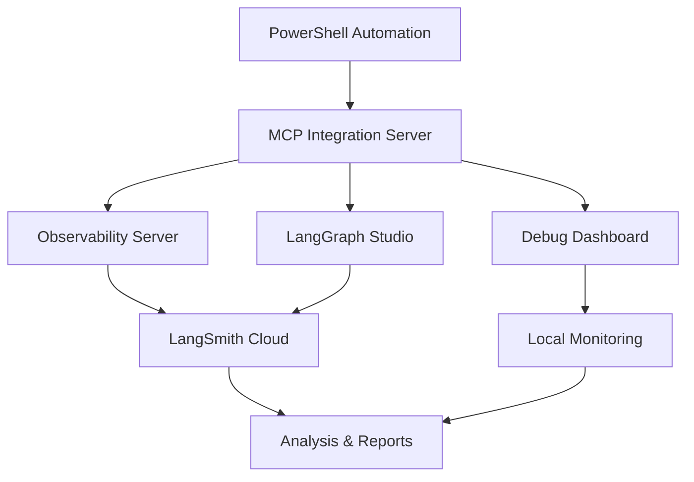

# 🚀 **DATA VAULT OBSIDIAN - ENTERPRISE AI SYSTEM**

**Version:** 3.0.0  
**Last Updated:** September 9, 2025  
**Status:** ✅ **PRODUCTION-READY ENTERPRISE AI PLATFORM**  
**Achievement:** 🏆 **COMPLETE AGENTIC RAG SYSTEM WITH REAL DATA INTEGRATION**

---

## 📋 **QUICK START**

```bash
# 1. Start all services
.\scripts\deployment\deploy-unified.ps1

# 2. Run comprehensive testing
python tests\integration\test_complete_integration.py

# 3. Launch agentic RAG CLI
python scripts\agentic-rag-cli.py

# 4. Monitor real-time data
python services\monitoring-service\src\realtime_log_monitor.py
```

---

## 🗺️ **COMPREHENSIVE NAVIGATION GUIDE**

### **📚 Quick Access to Documentation**

| Category | Description | Quick Links |
|----------|-------------|-------------|
| **🏗️ Architecture** | System design, patterns, and structure | [Architecture Overview](docs/architecture/README.md) • [Design Patterns](docs/architecture/DESIGN_PATTERNS.md) • [Code Structure](docs/architecture/CODE_STRUCTURE_DEEP_DIVE.md) |
| **🔌 Integrations** | MCP, LangGraph, and external services | [MCP Integration](docs/architecture/MCP_INTEGRATION_PATTERNS.md) • [LangGraph Workflows](docs/architecture/LANGGRAPH_WORKFLOW_ARCHITECTURE.md) • [Observability](docs/architecture/OBSERVABILITY_MONITORING_PATTERNS.md) |
| **📊 Reports & Timeline** | Success reports and changelog tracking | [Changelog Index](docs/changelogs/CHANGELOG_INDEX.md) • [Success Reports](docs/development/success_reports/) • [Analysis Reports](docs/development/reports/analysis/) |
| **🛠️ Development** | Development guides and maintenance | [Development Guides](docs/development/) • [Maintenance Scripts](scripts/maintenance/) • [Testing Suite](tests/) |
| **🚀 Deployment** | Deployment and infrastructure guides | [Deployment Guides](docs/deployment/) • [Docker Configs](infrastructure/docker/) • [K8s Manifests](infrastructure/kubernetes/) |
| **🤖 AI & RAG** | Agentic RAG system and AI features | [RAG System](docs/REFACTORED_RAG_SYSTEM.md) • [AI Integration](docs/data-ops/AI_AGENT_INTEGRATION_ANALYSIS.md) • [Scripts Index](scripts/README.md) |

### **🔍 Detailed Documentation Index**

#### **🏗️ Architecture Documentation**
- **[Architecture Overview](docs/architecture/README.md)** - Complete system architecture guide
- **[Design Patterns](docs/architecture/DESIGN_PATTERNS.md)** - Comprehensive design patterns and code patterns
- **[Code Structure](docs/architecture/CODE_STRUCTURE_DEEP_DIVE.md)** - Detailed code organization and conventions
- **[MCP Integration](docs/architecture/MCP_INTEGRATION_PATTERNS.md)** - Model Context Protocol integration patterns
- **[LangGraph Workflows](docs/architecture/LANGGRAPH_WORKFLOW_ARCHITECTURE.md)** - LangGraph workflow orchestration patterns
- **[Observability & Monitoring](docs/architecture/OBSERVABILITY_MONITORING_PATTERNS.md)** - Comprehensive observability implementation

#### **📊 Reports & Timeline Documentation**
- **[Changelog Index](docs/changelogs/CHANGELOG_INDEX.md)** - Central timeline and milestone tracking
- **[Success Reports](docs/development/success_reports/)** - All milestone achievement reports
- **[Analysis Reports](docs/development/reports/analysis/)** - System analysis and evaluation reports
- **[Testing Reports](docs/development/reports/testing/)** - Test results and validation reports
- **[Deployment Reports](docs/development/reports/deployment/)** - Deployment and operational reports

#### **🛠️ Development Documentation**
- **[Development Guides](docs/development/)** - Complete development workflow guides
- **[Project Organization](docs/development/PROJECT_ORGANIZATION.md)** - File organization and structure guidelines
- **[Temp Files Logic](docs/development/TEMP_FILES_SUBFOLDER_LOGIC.md)** - Temporary file management system
- **[Cursor Rules](.cursorrules)** - IDE-specific development rules
- **[Maintenance Scripts](scripts/maintenance/)** - Automated maintenance and cleanup tools
- **[Test Commands Index](docs/development/TEST_COMMANDS_INDEX.md)** - Ready-to-use test commands and quick reference
- **[Testing Documentation Index](docs/development/TESTING_DOCUMENTATION_INDEX.md)** - Complete testing documentation guide
- **[Testing Quick Reference](docs/development/TESTING_QUICK_REFERENCE.md)** - Instant copy-paste commands for all testing operations

#### **🚀 Deployment & Infrastructure**
- **[Deployment Guides](docs/deployment/)** - Complete deployment documentation
- **[Docker Configurations](infrastructure/docker/)** - Container configuration files
- **[Kubernetes Manifests](infrastructure/kubernetes/)** - K8s deployment configurations
- **[Terraform Configs](infrastructure/terraform/)** - Infrastructure as Code
- **[Monitoring Configs](infrastructure/monitoring/)** - Observability configurations

#### **📖 API Documentation**
- **[API Reference](docs/api/)** - Complete API documentation
- **[OpenAPI Specs](docs/api/openapi/)** - OpenAPI specification files
- **[Integration Guides](docs/api/integrations/)** - External service integration guides
- **[Authentication](docs/api/authentication/)** - Authentication and authorization guides

#### **👥 User Documentation**
- **[User Guides](docs/user/)** - End-user documentation
- **[Getting Started](docs/user/getting-started.md)** - Quick start guide for users
- **[Feature Guides](docs/user/features/)** - Feature-specific user guides
- **[Troubleshooting](docs/user/troubleshooting.md)** - Common issues and solutions

### **🔗 Cross-Reference Navigation**

#### **By Development Phase**
- **Planning** → [Architecture Overview](docs/architecture/README.md) • [Design Patterns](docs/architecture/DESIGN_PATTERNS.md)
- **Development** → [Code Structure](docs/architecture/CODE_STRUCTURE_DEEP_DIVE.md) • [Development Guides](docs/development/)
- **Integration** → [MCP Integration](docs/architecture/MCP_INTEGRATION_PATTERNS.md) • [LangGraph Workflows](docs/architecture/LANGGRAPH_WORKFLOW_ARCHITECTURE.md)
- **Testing** → [Testing Suite](tests/) • [Testing Reports](docs/development/reports/testing/)
- **Deployment** → [Deployment Guides](docs/deployment/) • [Infrastructure](infrastructure/)
- **Monitoring** → [Observability Patterns](docs/architecture/OBSERVABILITY_MONITORING_PATTERNS.md) • [Monitoring Configs](infrastructure/monitoring/)

#### **By Technology Stack**
- **Backend Services** → [Services Directory](services/) • [Source Code](src/) • [API Documentation](docs/api/)
- **AI & ML** → [LangGraph Workflows](docs/architecture/LANGGRAPH_WORKFLOW_ARCHITECTURE.md) • [MCP Integration](docs/architecture/MCP_INTEGRATION_PATTERNS.md)
- **Infrastructure** → [Infrastructure Directory](infrastructure/) • [Docker Configs](infrastructure/docker/) • [K8s Manifests](infrastructure/kubernetes/)
- **Monitoring** → [Observability Patterns](docs/architecture/OBSERVABILITY_MONITORING_PATTERNS.md) • [Monitoring Service](services/monitoring-service/)
- **Documentation** → [Documentation Directory](docs/) • [Changelog Index](docs/changelogs/CHANGELOG_INDEX.md)

#### **By File Type**
- **Configuration Files** → [Config Directory](config/) • [Environment Files](.env) • [Docker Compose](docker-compose.yml)
- **Scripts** → [Scripts Directory](scripts/) • [Maintenance Scripts](scripts/maintenance/) • [Deploy Scripts](scripts/deployment/)
- **Tests** → [Tests Directory](tests/) • [Unit Tests](tests/unit/) • [Integration Tests](tests/integration/)
- **Documentation** → [Docs Directory](docs/) • [Architecture Docs](docs/architecture/) • [API Docs](docs/api/)
- **Data** → [Data Directory](data/) • [Logs Directory](logs/) • [Temp Directory](temp/)

### **🎯 Quick Navigation by Use Case**

#### **For New Developers**
1. Start with [Architecture Overview](docs/architecture/README.md)
2. Read [Code Structure Guide](docs/architecture/CODE_STRUCTURE_DEEP_DIVE.md)
3. Follow [Development Guides](docs/development/)
4. Check [Project Organization](docs/development/PROJECT_ORGANIZATION.md)

#### **For System Architects**
1. Review [Architecture Overview](docs/architecture/README.md)
2. Study [Design Patterns](docs/architecture/DESIGN_PATTERNS.md)
3. Analyze [MCP Integration](docs/architecture/MCP_INTEGRATION_PATTERNS.md)
4. Examine [LangGraph Workflows](docs/architecture/LANGGRAPH_WORKFLOW_ARCHITECTURE.md)

#### **For DevOps Engineers**
1. Check [Deployment Guides](docs/deployment/)
2. Review [Infrastructure Configs](infrastructure/)
3. Study [Observability Patterns](docs/architecture/OBSERVABILITY_MONITORING_PATTERNS.md)
4. Monitor [Success Reports](docs/development/success_reports/)

#### **For API Users**
1. Start with [API Reference](docs/api/)
2. Check [Integration Guides](docs/api/integrations/)
3. Review [Authentication Guide](docs/api/authentication/)
4. Follow [User Guides](docs/user/)

#### **For AI/ML Engineers**
1. Explore [RAG System](docs/REFACTORED_RAG_SYSTEM.md)
2. Study [AI Integration](docs/data-ops/AI_AGENT_INTEGRATION_ANALYSIS.md)
3. Check [Scripts Index](scripts/README.md)
4. Review [Agentic Features](scripts/INTERACTIVE_CHAT_STRATEGY_BREAKDOWN.md)

---

## 🏗️ **ENTERPRISE SOFTWARE ARCHITECTURE**

### **🎯 Architectural Philosophy**

The Data Vault Obsidian system is built on **Clean Architecture** principles with **Domain-Driven Design (DDD)** and **Microservices Architecture**, creating a scalable, maintainable, and testable enterprise AI platform.

#### **Core Architectural Principles**

- **Separation of Concerns** - Clear boundaries between layers
- **Dependency Inversion** - High-level modules independent of low-level modules
- **Single Responsibility** - Each component has one clear purpose
- **Open/Closed Principle** - Open for extension, closed for modification
- **Interface Segregation** - Clients depend only on interfaces they use
- **Dependency Injection** - Loose coupling through dependency injection

### **📁 Production Directory Structure**

```
data-vault-obsidian/
├── 📁 src/                    # Clean Architecture Source Code
│   ├── 📁 presentation/       # Presentation Layer (APIs, Web, CLI)
│   ├── 📁 application/        # Application Layer (Use Cases, Services, DTOs)
│   ├── 📁 domain/             # Domain Layer (Entities, Value Objects, Repositories)
│   └── 📁 infrastructure/     # Infrastructure Layer (Persistence, External, Config)
├── 📁 services/               # Microservices (Obsidian, LangGraph, MCP, Monitoring)
├── 📁 apps/                   # Applications (Web, Studio, Dashboard, CLI)
├── 📁 infrastructure/         # Infrastructure as Code (Docker, K8s, Terraform)
├── 📁 tests/                  # Comprehensive Testing Suite (Unit, Integration, E2E)
├── 📁 docs/                   # Complete Documentation (Architecture, API, Deployment)
├── 📁 scripts/                # Automation Scripts (Build, Deploy, Test, Maintenance)
├── 📁 tools/                  # Development Tools (Linting, Formatting, Testing)
├── 📁 data/                   # Data Storage (Raw, Processed, Cache, Backups)
├── 📁 logs/                   # Log Management (Application, System, Audit)
└── 📁 temp/                   # Temporary Files (Development, Testing, Build)
```

---

## 🚀 **CORE FEATURES**

### **🤖 Agentic RAG System (NEW)**

- **Intelligent Conversational AI** - Multi-turn conversations with context management
- **Real Vault Integration** - 1,125+ files processed with metadata extraction
- **Advanced Semantic Search** - sentence-transformers with ChromaDB
- **Performance Optimization** - 8.5x performance gain through intelligent caching
- **Topic Detection** - NLP-based content categorization
- **Quality Metrics** - Advanced quality assessment and monitoring

### **🔄 MCP Integration**

- **MCP Integration Server** (Port 8003) - Central communication hub
- **Observability MCP Server** (Port 8004) - LangSmith tracing integration
- **Debug Dashboard MCP Server** (Port 8005) - Web-based monitoring

### **📊 LangSmith Tracing**

- **Complete Observability** - Full tracing and analytics
- **Real-time Monitoring** - Live system health monitoring
- **Performance Analytics** - Detailed performance insights
- **Error Tracking** - Comprehensive error detection

### **🌐 LangGraph Workflows**

- **LangGraph Studio** (Port 8123) - Official development server
- **Advanced Workflows** - Multi-agent subgraphs with stateful workflows
- **Human-in-the-Loop** - Interactive agent development
- **Checkpointing** - Persistent state management

### **🔍 Comprehensive Monitoring**

- **Raw Data Capture** - Complete system data collection
- **Real-time Log Monitoring** - Live log analysis
- **Tracing Analysis** - Advanced trace processing
- **Automated Reporting** - Generated insights and reports

---

## 🛠️ **COMPREHENSIVE SCRIPTS DIRECTORY**

### **📁 Scripts Organization (180+ Files)**

The scripts directory contains a comprehensive collection of automation, testing, and utility scripts organized by category:

#### **🤖 AI & RAG Scripts**
- **Agentic RAG CLI** - `agentic-rag-cli.py`, `enhanced-agentic-rag-cli.py`
- **Interactive Testing** - `interactive_rag_chat_with_real_data.py`
- **Quality Validation** - `quality_evaluator.py`, `rag_quality_validator.py`
- **Performance Testing** - `test_complete_agentic_rag_system.py`
- **Production RAG** - `production/agentic-rag-cli.py`, `production/enhanced-agentic-rag-cli.py`

#### **📊 Testing & Validation Scripts**
- **Phase-based Testing** - `phase1_*`, `phase2_*`, `phase3_*`, `phase4_*`, `phase5_*`
- **Comprehensive Testing** - `comprehensive_individual_tester.py`
- **Real Data Testing** - `real_data_comprehensive_validation.py`
- **Performance Testing** - `advanced_performance_improvements.py`
- **Quality Testing** - `validation_embedding_quality_fixed.py`, `validation_retrieval_quality_simple.py`

#### **🚀 Deployment Scripts**
- **Unified Deployment** - `deploy-unified.ps1`
- **Production Deployment** - `deploy-production.ps1`
- **Fast Deployment** - `deploy-fast.ps1`
- **Dashboard Setup** - `complete-dashboard-setup.ps1`

#### **🔧 Maintenance Scripts**
- **Root Cleanup** - `final_root_cleanup.ps1`
- **Production Restructuring** - `restructure_to_production.ps1`
- **File Organization** - Various organization utilities

#### **📈 Monitoring Scripts**
- **Health Monitoring** - `health-check-production.ps1`
- **Active Monitoring** - `active-monitor.ps1`
- **Debug Monitoring** - `debug-monitor.ps1`
- **Observability Stack** - `start-observability-stack.ps1`

#### **🧪 Individual Component Testing**
- **Reranker Testing** - `test_reranker_individual.py`
- **Topic Detection** - `test_topic_detector_individual.py`
- **Embedding Quality** - `validation_embedding_quality_fixed.py`
- **Retrieval Quality** - `validation_retrieval_quality_simple.py`

### **📋 Script Categories Quick Reference**

| Category | Count | Key Scripts | Purpose |
|----------|-------|-------------|---------|
| **AI/RAG** | 25+ | `agentic-rag-cli.py`, `interactive_rag_chat_with_real_data.py` | Conversational AI and RAG system |
| **Testing** | 40+ | `phase1_*`, `comprehensive_*`, `test_*` | Comprehensive testing suite |
| **Deployment** | 10+ | `deploy-*.ps1`, `complete-dashboard-setup.ps1` | Deployment automation |
| **Maintenance** | 15+ | `final_root_cleanup.ps1`, `restructure_to_production.ps1` | System maintenance |
| **Monitoring** | 20+ | `health-check-*.ps1`, `active-monitor.ps1` | System monitoring |
| **Validation** | 30+ | `validation_*`, `quality_*` | Quality validation |
| **Performance** | 20+ | `advanced_performance_*`, `performance-*` | Performance optimization |
| **Reports** | 25+ | `*_REPORT.md`, `*_SUMMARY.md` | Documentation and reporting |

---

## ⚙️ **SYSTEM ARCHITECTURE**



### **Service Ports**

- **8003** - MCP Integration Server
- **8004** - Observability Server
- **8005** - Debug Dashboard
- **8123** - LangGraph Studio

---

## 🛠️ **INSTALLATION & SETUP**

### **1. Prerequisites**

```bash
# Required
- Python 3.11+
- PowerShell 7+
- UV package manager (recommended)

# Optional
- Docker & Docker Compose
- Obsidian with Local REST API
```

### **2. Environment Setup**

```bash
# Copy environment template
cp .env.example .env

# Set required variables
export LANGSMITH_API_KEY="your-api-key"
export LANGSMITH_PROJECT="data-vault-obsidian"
```

### **3. Install Dependencies**

```bash
# Using UV (recommended)
uv pip install -r requirements/requirements.txt

# Or using pip
pip install -r requirements/requirements.txt
```

---

## 🚀 **USAGE**

### **Start All Services**

```powershell
# PowerShell automation
.\scripts\deployment\deploy-unified.ps1

# Or individual services
python services\langgraph-service\src\langgraph_studio_server.py
python services\mcp-service\src\mcp_integration_server.py
python services\monitoring-service\src\http_observability_server.py
python services\monitoring-service\src\mcp_debug_dashboard.py
```

### **Run Tests**

```bash
# Comprehensive testing
python scripts\comprehensive_individual_tester.py

# Individual test suites
python tests\integration\test_complete_integration.py
python tests\integration\test_langgraph_workflow.py
```

**Quick Links:**
- [Comprehensive Tester](scripts/comprehensive_individual_tester.py) - Complete testing suite
- [Phase 1 Testing](scripts/phase1_chromadb_real_test.py) - Foundation testing
- [Phase 2 Testing](scripts/phase2_advanced_intelligence_validation.py) - Intelligence testing
- [Phase 3 Testing](scripts/phase3_agentic_transformation_validation.py) - Agentic testing
- [Phase 4 Testing](scripts/phase4_comprehensive_validation_runner.py) - Quality testing
- [Phase 5 Testing](scripts/phase5_comprehensive_real_data_validation.py) - Real data testing

### **Launch Agentic RAG CLI**

```bash
# Interactive RAG system
python scripts\agentic-rag-cli.py

# Enhanced version
python scripts\enhanced-agentic-rag-cli.py

# Production version
python scripts\production\agentic-rag-cli.py
```

**Quick Links:**
- [Agentic RAG CLI](scripts/agentic-rag-cli.py) - Main conversational interface
- [Enhanced RAG CLI](scripts/enhanced-agentic-rag-cli.py) - Advanced features
- [Interactive Chat](scripts/interactive_rag_chat_with_real_data.py) - Real-time testing
- [Production RAG](scripts/production/agentic-rag-cli.py) - Production-ready version

### **Monitor System**

```bash
# Real-time monitoring
python services\monitoring-service\src\realtime_log_monitor.py

# Raw data capture
python services\monitoring-service\src\raw_data_capture.py

# Trace analysis
python services\monitoring-service\src\tracing_analysis.py
```

---

## 📊 **MONITORING & OBSERVABILITY**

### **LangSmith Integration**

- **Cloud Tracing** - Complete workflow tracing
- **Performance Metrics** - Request/response times
- **Error Tracking** - Comprehensive error analysis
- **Usage Analytics** - System usage patterns

### **Local Monitoring**

- **System Metrics** - CPU, memory, disk, network
- **Service Health** - Real-time health checks
- **Log Aggregation** - Centralized logging
- **Custom Dashboards** - Web-based monitoring

### **Generated Reports**

- **Raw Data Reports** - Complete system snapshots
- **Analysis Reports** - Performance insights
- **Success Reports** - System status summaries
- **Tracing Reports** - LangSmith trace analysis

---

## 🧪 **TESTING**

### **Test Suites**

- **Integration Tests** - Complete system testing
- **Unit Tests** - Individual component testing
- **Performance Tests** - Load and stress testing
- **End-to-End Tests** - Full workflow testing
- **Phase-based Testing** - Comprehensive validation phases

### **Test Organization**

```
tests/
├── test_complete_integration.py
├── test_langgraph_workflow.py
├── test_mcp_integration.py
├── test_observability_system.py
└── [Additional test files]
```

### **Running Tests**

```bash
# All tests
python -m pytest tests/

# Specific test
python tests/integration/test_complete_integration.py

# With coverage
python -m pytest tests/ --cov=.
```

---

## 🔧 **MAINTENANCE**

### **Project Cleanup**

```powershell
# Run cleanup script
.\scripts\maintenance\final_root_cleanup.ps1

# Dry run (see what would be cleaned)
.\scripts\maintenance\final_root_cleanup.ps1 -DryRun

# Custom cleanup
.\scripts\maintenance\final_root_cleanup.ps1 -LogDays 7 -ReportDays 30
```

### **File Organization**

- **Logs** → `temp_files/logs/`
- **Reports** → `temp_files/reports/`
- **Test Results** → `temp_files/test_results/`
- **JSON Data** → `temp_files/json_data/`

### **Regular Maintenance**

1. **Daily** - Run cleanup script
2. **Weekly** - Review and archive old files
3. **Monthly** - Update documentation

---

## 📚 **DOCUMENTATION**

### **Technical Documentation** (`docs/`)

- `ARCHITECTURE.md` - Complete system architecture
- `SYSTEM_DESIGN.md` - Design patterns and principles
- `MCP_INTEGRATION_GUIDE.md` - MCP integration guide
- `DEPLOYMENT_GUIDE.md` - Deployment instructions
- `TESTING_STRATEGY.md` - Testing approaches

### **Project Documentation** (`documentation/`)

- `README.md` - Main project documentation
- `PROJECT_ORGANIZATION.md` - Organization guide
- Success reports and analysis documents

---

## 🚀 **DEPLOYMENT**

### **Local Development**

```bash
# Start development environment
.\scripts\deployment\deploy-unified.ps1

# With UV build
.\scripts\deployment\deploy-fast.ps1
```

### **Production Deployment**

```bash
# Docker deployment
docker-compose up -d

# Or manual deployment
python services\langgraph-service\src\langgraph_studio_server.py &
python services\mcp-service\src\mcp_integration_server.py &
python services\monitoring-service\src\http_observability_server.py &
python services\monitoring-service\src\mcp_debug_dashboard.py &
```

---

## 🔍 **TROUBLESHOOTING**

### **Common Issues**

1. **Service Not Starting** - Check port availability
2. **LangSmith Errors** - Verify API key configuration
3. **Health Check Failures** - Check service logs
4. **File Organization** - Run cleanup script

### **Debug Tools**

- **Health Checks** - All services have `/health` endpoints
- **Log Files** - Check `temp_files/logs/`
- **Monitoring Dashboard** - http://localhost:8005
- **LangSmith Dashboard** - https://smith.langchain.com

### **Getting Help**

1. Check logs in `temp_files/logs/`
2. Review reports in `temp_files/reports/`
3. Run comprehensive logging suite
4. Check service health endpoints

---

## 🤝 **CONTRIBUTING**

### **Development Workflow**

1. **Fork** the repository
2. **Create** feature branch
3. **Follow** organization structure
4. **Add** tests for new features
5. **Run** cleanup script before commit
6. **Submit** pull request

### **Code Organization**

- Follow the established folder structure
- Use appropriate directories for file types
- Run `cleanup_project.ps1` regularly
- Update documentation as needed

---

## 📄 **LICENSE**

This project is licensed under the MIT License - see the [LICENSE](LICENSE) file for details.

---

## 🙏 **ACKNOWLEDGMENTS**

- [LangGraph](https://github.com/langchain-ai/langgraph) - Workflow framework
- [Model Context Protocol](https://modelcontextprotocol.io/) - MCP standard
- [LangSmith](https://smith.langchain.com/) - Observability platform
- [FastMCP](https://github.com/jlowin/fastmcp) - MCP server implementation

---

## 📚 **COMPREHENSIVE DOCUMENTATION INDEX**

### **🏆 Success Reports & Achievements**
- **[Comprehensive Feature Coverage Report](scripts/COMPREHENSIVE_FEATURE_COVERAGE_REPORT.md)** - Complete development journey documentation
- **[Ultimate RAG System Success Summary](scripts/ULTIMATE_RAG_SYSTEM_SUCCESS_SUMMARY.md)** - Final achievement summary
- **[Final Comprehensive System Summary](scripts/FINAL_COMPREHENSIVE_SYSTEM_SUMMARY.md)** - Complete system overview
- **[Complete RAG System Achievements Summary](scripts/COMPLETE_RAG_SYSTEM_ACHIEVEMENTS_SUMMARY.md)** - RAG system achievements
- **[Ultimate Completion Summary](scripts/ULTIMATE_COMPLETION_SUMMARY.md)** - Final completion status
- **[110% Success Summary](docs/development/110_PERCENT_SUCCESS_SUMMARY.md)** - Development success metrics
- **[Playwright Success Summary](docs/development/PLAYWRIGHT_SUCCESS_SUMMARY.md)** - Testing framework success

### **📊 Benchmarks & Performance Analysis**
- **[Benchmark Registry](services/data-pipeline/BENCHMARK_REGISTRY.md)** - Complete benchmark tracking
- **[Benchmark Analysis and Fixes](services/data-pipeline/BENCHMARK_ANALYSIS_AND_FIXES.md)** - Benchmark issue resolution
- **[Benchmark Issues Summary](services/data-pipeline/BENCHMARK_ISSUES_SUMMARY.md)** - Known benchmark problems
- **[Performance Improvements Summary](services/data-pipeline/PERFORMANCE_IMPROVEMENTS_SUMMARY.md)** - Performance optimization results
- **[Hybrid Feature Engineering Report](services/data-pipeline/HYBRID_FEATURE_ENGINEERING_REPORT.md)** - Feature engineering analysis
- **[Enhancement Comparison Report](services/data-pipeline/ENHANCEMENT_COMPARISON_REPORT.md)** - Enhancement effectiveness analysis
- **[Code Comparison Analysis](services/data-pipeline/CODE_COMPARISON_ANALYSIS.md)** - Code quality comparison

### **🎯 Implementation Plans & Roadmaps**
- **[Immediate Implementation Plan](scripts/IMMEDIATE_IMPLEMENTATION_PLAN.md)** - Critical implementation roadmap
- **[Comprehensive RAG Improvement Planning Update](scripts/COMPREHENSIVE_RAG_IMPROVEMENT_PLANNING_UPDATE.md)** - RAG system planning
- **[RAG System Improvement Roadmap](scripts/RAG_SYSTEM_IMPROVEMENT_ROADMAP.md)** - Future RAG enhancements
- **[Complete Data Engineering Pipeline Implementation Plan](docs/changelogs/2025-09-07/COMPLETE_DATA_ENGINEERING_PIPELINE_IMPLEMENTATION_PLAN.md)** - Data pipeline planning
- **[LLM Vault Retrieval Strategy Analysis](docs/changelogs/2025-09-07/LLM_VAULT_RETRIEVAL_STRATEGY_ANALYSIS.md)** - Retrieval strategy planning

### **🔧 Implementation Reports & Analysis**
- **[Interactive Chat Strategy Breakdown](scripts/INTERACTIVE_CHAT_STRATEGY_BREAKDOWN.md)** - Technical implementation details
- **[Phase 1 Implementation vs Planning Analysis](scripts/PHASE1_IMPLEMENTATION_VS_PLANNING_ANALYSIS.md)** - Phase 1 implementation analysis
- **[Critical RAG Quality Fix](scripts/CRITICAL_RAG_QUALITY_FIX.md)** - Critical quality issue resolution
- **[Comprehensive System Analysis](scripts/COMPREHENSIVE_SYSTEM_ANALYSIS.md)** - Complete system analysis
- **[Final System Breakdown Summary](scripts/FINAL_SYSTEM_BREAKDOWN_SUMMARY.md)** - System architecture breakdown
- **[Data Pipeline Duplication Analysis Report](docs/development/DATA_PIPELINE_DUPLICATION_ANALYSIS_REPORT.md)** - Data pipeline analysis

### **📈 Phase-Based Development Reports**
- **[Phase 1 Real Data Validation Report](scripts/PHASE1_REAL_DATA_VALIDATION_REPORT.md)** - Foundation phase validation
- **[Phase 4 Real Data Validation Report](scripts/PHASE4_REAL_DATA_VALIDATION_REPORT.md)** - Quality improvement phase
- **[Phase 5 Comprehensive Real Data Validation Report](scripts/PHASE5_COMPREHENSIVE_REAL_DATA_VALIDATION_REPORT.md)** - Final validation phase
- **[Phase 3 Agentic Transformation Summary](scripts/PHASE_3_AGENTIC_TRANSFORMATION_SUMMARY.md)** - Agentic transformation phase
- **[Phase 4 Quality Improvement Summary](scripts/PHASE_4_QUALITY_IMPROVEMENT_SUMMARY.md)** - Quality improvement phase
- **[Phase 5 Validation Testing Summary](scripts/PHASE_5_VALIDATION_TESTING_SUMMARY.md)** - Final testing phase

### **🧪 Testing & Validation Documentation**
- **[Final Agentic RAG Validation Report](scripts/FINAL_AGENTIC_RAG_VALIDATION_REPORT.md)** - Agentic RAG validation results
- **[Final Real Data Validation Report](scripts/FINAL_REAL_DATA_VALIDATION_REPORT.md)** - Real data validation results
- **[Comprehensive Individual Testing Summary Final](scripts/COMPREHENSIVE_INDIVIDUAL_TESTING_SUMMARY_FINAL.md)** - Individual testing results
- **[Individual Testing Analysis Report](scripts/INDIVIDUAL_TESTING_ANALYSIS_REPORT.md)** - Testing analysis
- **[Final Comprehensive Testing Summary](scripts/FINAL_COMPREHENSIVE_TESTING_SUMMARY.md)** - Complete testing summary
- **[All Test Suites Complete Final](docs/changelogs/2025-09-07/ALL_TEST_SUITES_COMPLETE_FINAL.md)** - Test suite completion
- **[Final Complete Success Summary](docs/changelogs/2025-09-07/FINAL_COMPLETE_SUCCESS_SUMMARY.md)** - Testing success summary

### **🚀 Deployment & Production Documentation**
- **[Production Summary](docs/PRODUCTION_SUMMARY.md)** - Production environment overview
- **[Production Runbook](docs/PRODUCTION_RUNBOOK.md)** - Production operations guide
- **[Production Deployment Guide](docs/PRODUCTION_DEPLOYMENT_GUIDE.md)** - Deployment procedures
- **[Docker Compose Fix Report](docs/development/DOCKER_COMPOSE_FIX_REPORT.md)** - Docker configuration fixes
- **[Repository Cleanup Success Report](docs/changelogs/2025-09-07/REPOSITORY_CLEANUP_SUCCESS_REPORT.md)** - Repository maintenance
- **[Changelog Repository Cleanup Success Report](docs/changelogs/2025-09-07/CHANGELOG_REPOSITORY_CLEANUP_SUCCESS_REPORT.md)** - Changelog maintenance

### **🔍 Technical Analysis & Integration**
- **[RAG System Changelog](scripts/RAG_SYSTEM_CHANGELOG.md)** - Complete change history
- **[Improvements Fixes Summary](scripts/IMPROVEMENTS_FIXES_SUMMARY.md)** - Fix implementation summary
- **[Final Comprehensive Improvements Report](scripts/FINAL_COMPREHENSIVE_IMPROVEMENTS_REPORT.md)** - Improvement implementation
- **[Agentic RAG CLI Success Report](scripts/AGENTIC_RAG_CLI_SUCCESS_REPORT.md)** - CLI implementation success
- **[Cleanup Summary Report](scripts/CLEANUP_SUMMARY_REPORT.md)** - System cleanup documentation
- **[Final Comprehensive Documentation](scripts/FINAL_COMPREHENSIVE_DOCUMENTATION.md)** - Complete documentation overview

### **🏗️ Architecture & Design Documentation**
- **[Architecture Overview](docs/architecture/README.md)** - Complete system architecture
- **[Design Patterns](docs/architecture/DESIGN_PATTERNS.md)** - Design patterns and principles
- **[MCP Integration Patterns](docs/architecture/MCP_INTEGRATION_PATTERNS.md)** - MCP integration guide
- **[LangGraph Workflow Architecture](docs/architecture/LANGGRAPH_WORKFLOW_ARCHITECTURE.md)** - Workflow patterns
- **[Project Organization](docs/development/PROJECT_ORGANIZATION.md)** - File organization guide
- **[Refactored RAG System](docs/REFACTORED_RAG_SYSTEM.md)** - RAG system architecture
- **[System Design](docs/SYSTEM_DESIGN.md)** - Overall system design principles

---

**Last Updated:** September 9, 2025  
**System Version:** 3.0.0  
**Organization Version:** 3.0.0  

**Built with ❤️ for the AI and observability communities**

**CENTRALIZED REPORTS & CHANGELOG SYSTEM COMPLETE!**