# 🔍 ADVANCED OBSERVABILITY DOCUMENTATION
## AI & Automation Workflow Monitoring with LangGraph Integration

### 📊 **OBSERVABILITY OVERVIEW**

This document provides comprehensive observability architecture for AI-powered automation workflows, including interactive chat monitoring, thread-based tracing, human-in-the-loop checkpoints, and full LangGraph/LangSmith integration.

---

## 🎯 **OBSERVABILITY ARCHITECTURE**

### **1. Complete Observability Stack**

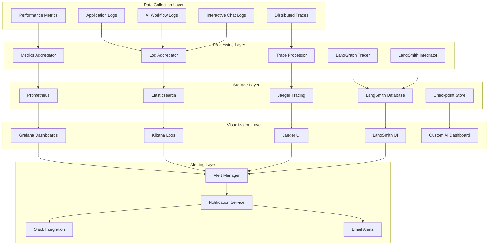

---

## 🧠 **AI WORKFLOW OBSERVABILITY**

### **1. LangGraph Integration Architecture**

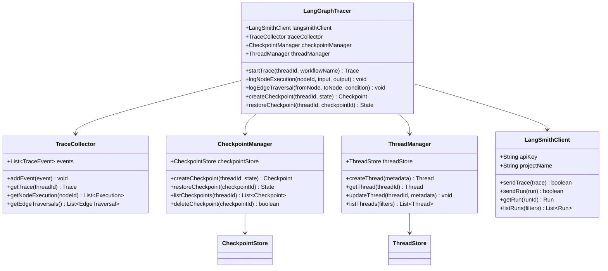

### **2. AI Workflow Execution Tracing**

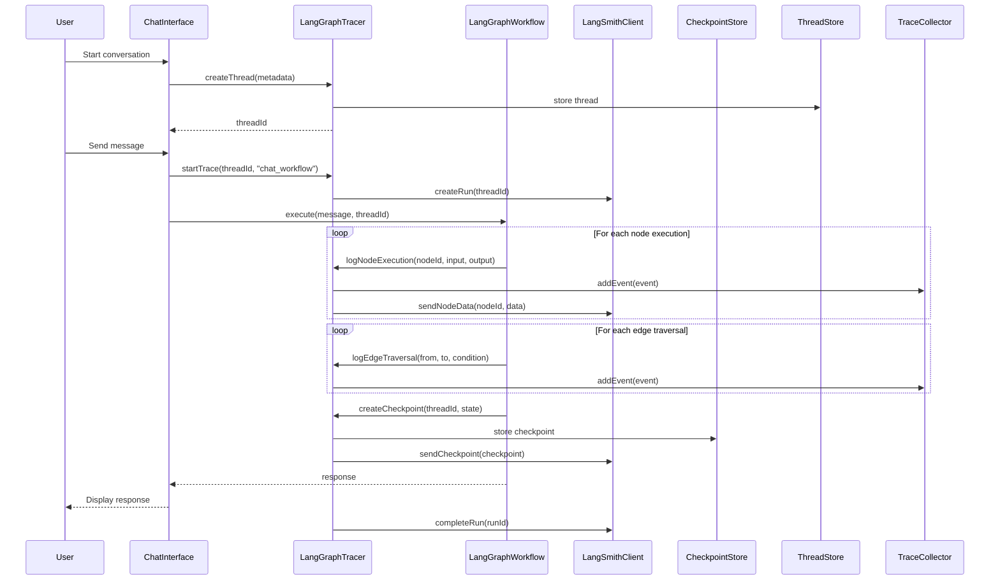

---

## 💬 **INTERACTIVE CHAT OBSERVABILITY**

### **1. Chat Thread Management**

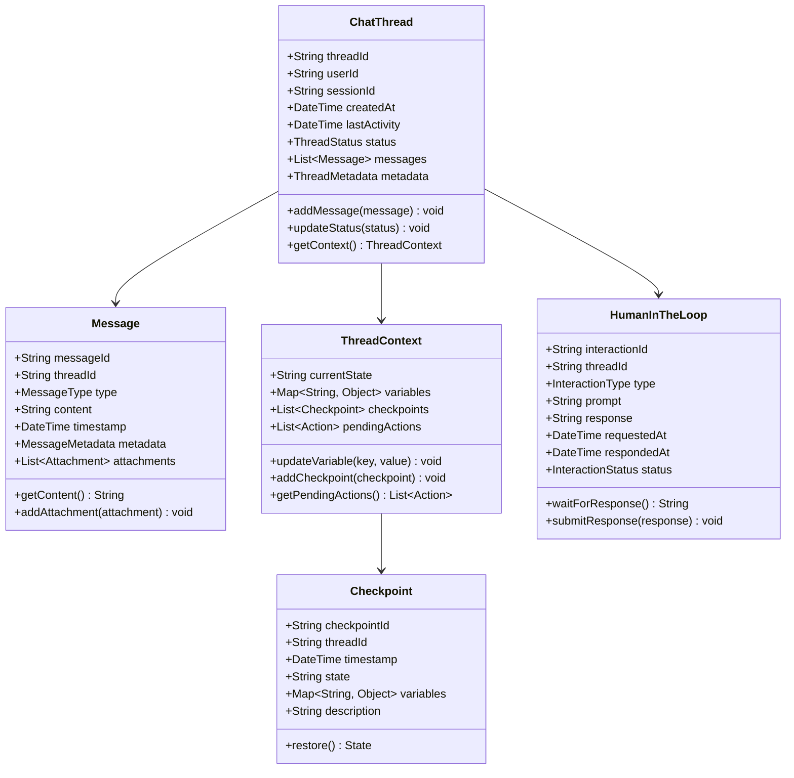

### **2. Chat Monitoring Dashboard**

```mermaid
graph TB
    subgraph "Real-time Chat Monitoring"
        ACTIVE_THREADS[Active Threads]
        MESSAGE_RATE[Message Rate]
        RESPONSE_TIME[Response Time]
        ERROR_RATE[Error Rate]
    end
    
    subgraph "Thread Analytics"
        THREAD_LIFECYCLE[Thread Lifecycle]
        USER_ENGAGEMENT[User Engagement]
        CONVERSATION_FLOW[Conversation Flow]
        SENTIMENT_ANALYSIS[Sentiment Analysis]
    end
    
    subgraph "Human-in-the-Loop"
        PENDING_INTERACTIONS[Pending Interactions]
        RESPONSE_TIMES[Response Times]
        APPROVAL_RATES[Approval Rates]
        ESCALATION_PATTERNS[Escalation Patterns]
    end
    
    subgraph "AI Performance"
        MODEL_ACCURACY[Model Accuracy]
        CONFIDENCE_SCORES[Confidence Scores]
        HALLUCINATION_RATE[Hallucination Rate]
        CONTEXT_RELEVANCE[Context Relevance]
    end
    
    ACTIVE_THREADS --> THREAD_LIFECYCLE
    MESSAGE_RATE --> USER_ENGAGEMENT
    RESPONSE_TIME --> CONVERSATION_FLOW
    ERROR_RATE --> SENTIMENT_ANALYSIS
    
    PENDING_INTERACTIONS --> RESPONSE_TIMES
    RESPONSE_TIMES --> APPROVAL_RATES
    APPROVAL_RATES --> ESCALATION_PATTERNS
    
    MODEL_ACCURACY --> CONFIDENCE_SCORES
    CONFIDENCE_SCORES --> HALLUCINATION_RATE
    HALLUCINATION_RATE --> CONTEXT_RELEVANCE
```

---

## 🔄 **WORKFLOW EXECUTION TRACING**

### **1. Workflow State Management**

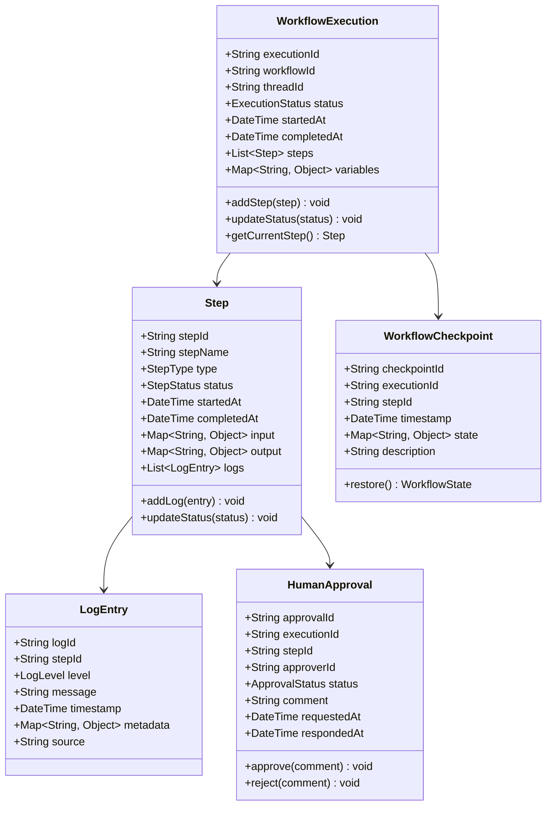

### **2. Workflow Execution Flow**

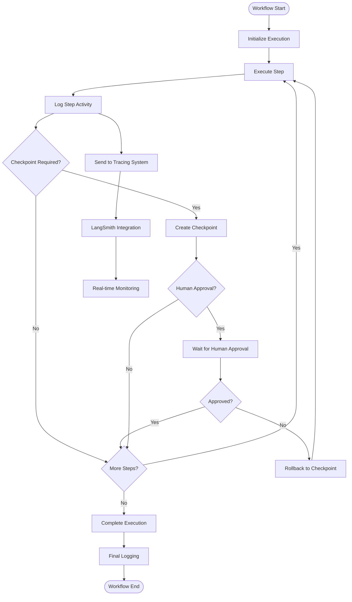

---

## 📊 **COMPREHENSIVE LOGGING SYSTEM**

### **1. Structured Logging Architecture**

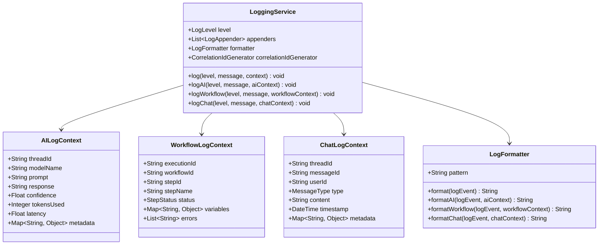

### **2. Log Aggregation Pipeline**

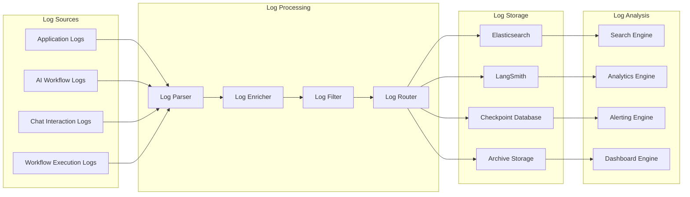

---

## 🔍 **DISTRIBUTED TRACING**

### **1. Trace Context Propagation**

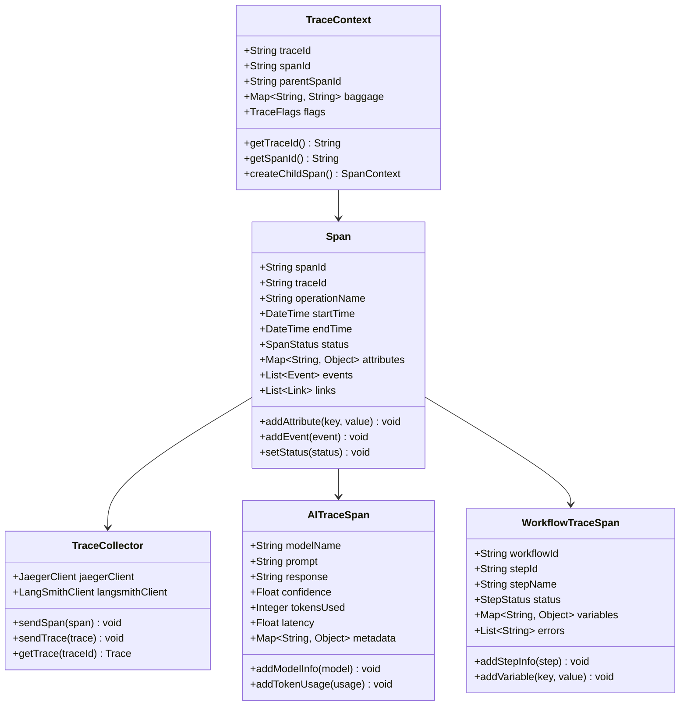

### **2. Trace Visualization**

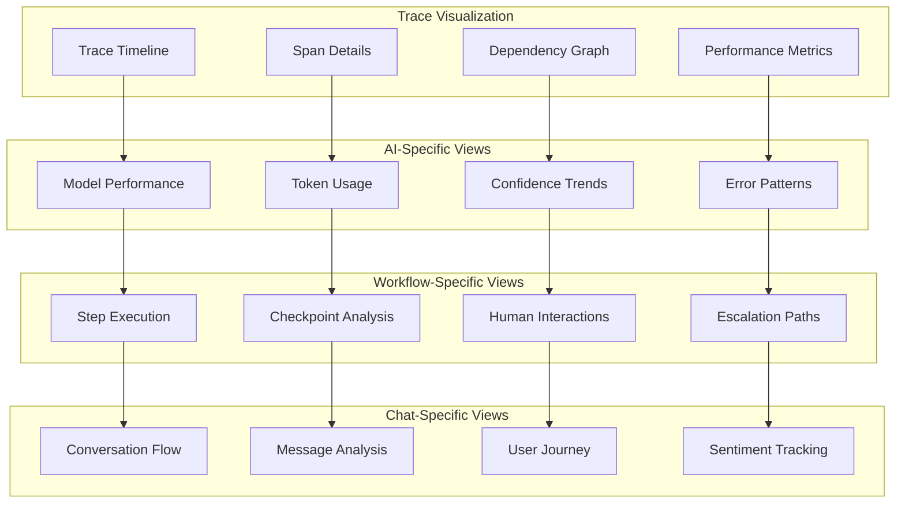

---

## 🚨 **ADVANCED ALERTING SYSTEM**

### **1. Alert Rules Engine**

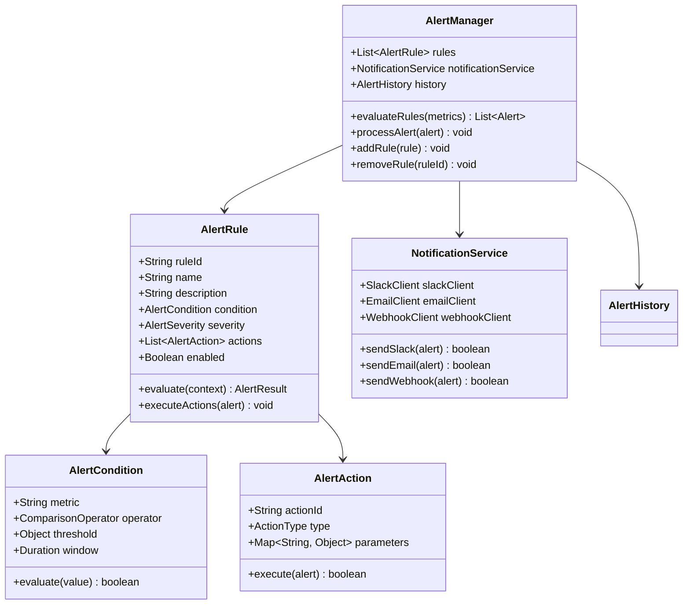

### **2. AI-Specific Alert Rules**

| **Alert Type** | **Condition** | **Severity** | **Action** |
|----------------|---------------|--------------|------------|
| **High Hallucination Rate** | Hallucination rate > 5% | Critical | Slack + Email |
| **Low Confidence Score** | Confidence < 0.7 | Warning | Slack |
| **High Token Usage** | Tokens > 10,000/hour | Warning | Slack |
| **Model Timeout** | Response time > 30s | Critical | Slack + PagerDuty |
| **Human Approval Pending** | Pending > 1 hour | Warning | Slack |
| **Workflow Failure** | Step failure rate > 10% | Critical | Slack + Email |
| **Chat Thread Stuck** | No response > 5 minutes | Warning | Slack |
| **Checkpoint Corruption** | Checkpoint validation failed | Critical | Slack + PagerDuty |

---

## 📈 **PERFORMANCE MONITORING**

### **1. AI Performance Metrics**

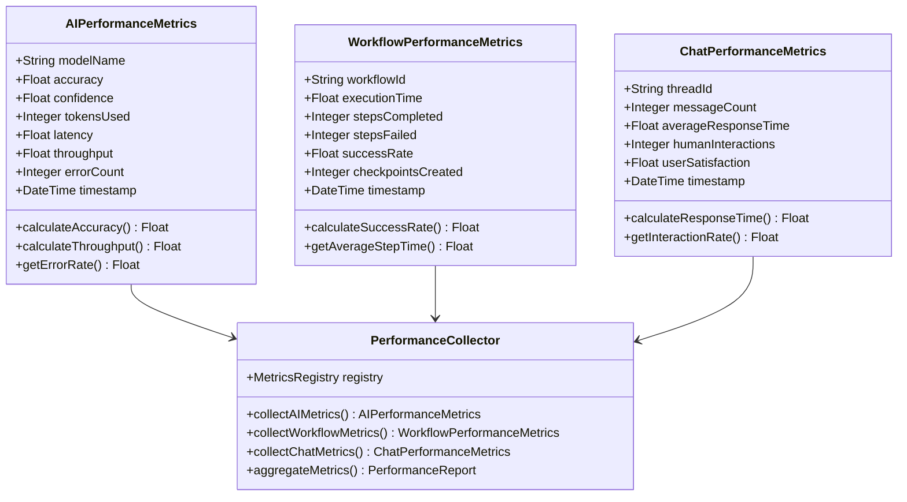

### **2. Real-time Performance Dashboard**

```mermaid
graph TB
    subgraph "AI Performance"
        MODEL_ACCURACY[Model Accuracy: 94.2%]
        CONFIDENCE_AVG[Avg Confidence: 0.87]
        TOKEN_USAGE[Token Usage: 2.3M/hour]
        RESPONSE_TIME[Response Time: 1.2s]
    end
    
    subgraph "Workflow Performance"
        SUCCESS_RATE[Success Rate: 98.5%]
        AVG_EXECUTION[Avg Execution: 45s]
        CHECKPOINT_RATE[Checkpoint Rate: 12/min]
        ERROR_RATE[Error Rate: 1.5%]
    end
    
    subgraph "Chat Performance"
        ACTIVE_THREADS[Active Threads: 156]
        AVG_RESPONSE[Avg Response: 2.1s]
        HUMAN_RATE[Human Interaction: 8.3%]
        SATISFACTION[User Satisfaction: 4.7/5]
    end
    
    subgraph "System Performance"
        CPU_USAGE[CPU Usage: 67%]
        MEMORY_USAGE[Memory Usage: 4.2GB]
        DISK_IO[Disk I/O: 125MB/s]
        NETWORK_IO[Network I/O: 45MB/s]
    end
    
    MODEL_ACCURACY --> SUCCESS_RATE
    CONFIDENCE_AVG --> AVG_RESPONSE
    TOKEN_USAGE --> CPU_USAGE
    RESPONSE_TIME --> MEMORY_USAGE
```

---

## 🔧 **IMPLEMENTATION GUIDE**

### **1. LangGraph Integration Setup**

```python
# langgraph_tracer.py
from langgraph import StateGraph
from langsmith import Client
import uuid
from datetime import datetime
from typing import Dict, Any, List, Optional

class LangGraphTracer:
    def __init__(self, langsmith_api_key: str, project_name: str):
        self.langsmith_client = Client(api_key=langsmith_api_key)
        self.project_name = project_name
        self.active_traces = {}
        self.checkpoints = {}
    
    def start_trace(self, thread_id: str, workflow_name: str, metadata: Dict[str, Any] = None):
        """Start a new trace for a workflow execution"""
        trace_id = str(uuid.uuid4())
        trace = {
            "trace_id": trace_id,
            "thread_id": thread_id,
            "workflow_name": workflow_name,
            "started_at": datetime.utcnow(),
            "metadata": metadata or {},
            "nodes": [],
            "edges": [],
            "checkpoints": []
        }
        self.active_traces[thread_id] = trace
        return trace_id
    
    def log_node_execution(self, thread_id: str, node_id: str, 
                          input_data: Dict[str, Any], 
                          output_data: Dict[str, Any],
                          execution_time: float = None):
        """Log a node execution"""
        if thread_id not in self.active_traces:
            return
        
        trace = self.active_traces[thread_id]
        node_execution = {
            "node_id": node_id,
            "input": input_data,
            "output": output_data,
            "execution_time": execution_time,
            "timestamp": datetime.utcnow()
        }
        trace["nodes"].append(node_execution)
        
        # Send to LangSmith
        self.langsmith_client.create_run(
            name=f"{trace['workflow_name']}_{node_id}",
            run_type="tool",
            inputs=input_data,
            outputs=output_data,
            project_name=self.project_name
        )
    
    def log_edge_traversal(self, thread_id: str, from_node: str, 
                          to_node: str, condition: str = None):
        """Log an edge traversal"""
        if thread_id not in self.active_traces:
            return
        
        trace = self.active_traces[thread_id]
        edge_traversal = {
            "from_node": from_node,
            "to_node": to_node,
            "condition": condition,
            "timestamp": datetime.utcnow()
        }
        trace["edges"].append(edge_traversal)
    
    def create_checkpoint(self, thread_id: str, state: Dict[str, Any], 
                         description: str = None):
        """Create a checkpoint for human-in-the-loop interactions"""
        if thread_id not in self.active_traces:
            return None
        
        checkpoint_id = str(uuid.uuid4())
        checkpoint = {
            "checkpoint_id": checkpoint_id,
            "thread_id": thread_id,
            "state": state,
            "description": description,
            "created_at": datetime.utcnow(),
            "status": "pending"
        }
        
        trace = self.active_traces[thread_id]
        trace["checkpoints"].append(checkpoint)
        self.checkpoints[checkpoint_id] = checkpoint
        
        return checkpoint_id
    
    def restore_checkpoint(self, checkpoint_id: str) -> Optional[Dict[str, Any]]:
        """Restore state from a checkpoint"""
        if checkpoint_id not in self.checkpoints:
            return None
        
        checkpoint = self.checkpoints[checkpoint_id]
        checkpoint["status"] = "restored"
        checkpoint["restored_at"] = datetime.utcnow()
        
        return checkpoint["state"]
    
    def complete_trace(self, thread_id: str, final_state: Dict[str, Any] = None):
        """Complete a trace and send to LangSmith"""
        if thread_id not in self.active_traces:
            return
        
        trace = self.active_traces[thread_id]
        trace["completed_at"] = datetime.utcnow()
        trace["final_state"] = final_state
        
        # Send complete trace to LangSmith
        self.langsmith_client.create_run(
            name=trace["workflow_name"],
            run_type="chain",
            inputs=trace["metadata"],
            outputs=final_state,
            project_name=self.project_name
        )
        
        # Clean up
        del self.active_traces[thread_id]
```

### **2. Chat Thread Monitoring**

```python
# chat_monitor.py
from dataclasses import dataclass
from typing import Dict, List, Optional
from datetime import datetime
import asyncio

@dataclass
class ChatMessage:
    message_id: str
    thread_id: str
    user_id: str
    content: str
    message_type: str
    timestamp: datetime
    metadata: Dict[str, Any]

@dataclass
class ChatThread:
    thread_id: str
    user_id: str
    session_id: str
    created_at: datetime
    last_activity: datetime
    status: str
    messages: List[ChatMessage]
    context: Dict[str, Any]

class ChatMonitor:
    def __init__(self, elasticsearch_client, langsmith_client):
        self.elasticsearch = elasticsearch_client
        self.langsmith = langsmith_client
        self.active_threads = {}
    
    async def create_thread(self, user_id: str, session_id: str, 
                           initial_context: Dict[str, Any] = None) -> str:
        """Create a new chat thread"""
        thread_id = str(uuid.uuid4())
        thread = ChatThread(
            thread_id=thread_id,
            user_id=user_id,
            session_id=session_id,
            created_at=datetime.utcnow(),
            last_activity=datetime.utcnow(),
            status="active",
            messages=[],
            context=initial_context or {}
        )
        
        self.active_threads[thread_id] = thread
        
        # Log to Elasticsearch
        await self.elasticsearch.index(
            index="chat_threads",
            id=thread_id,
            body=thread.__dict__
        )
        
        return thread_id
    
    async def add_message(self, thread_id: str, user_id: str, 
                         content: str, message_type: str = "user",
                         metadata: Dict[str, Any] = None) -> str:
        """Add a message to a thread"""
        if thread_id not in self.active_threads:
            raise ValueError(f"Thread {thread_id} not found")
        
        message_id = str(uuid.uuid4())
        message = ChatMessage(
            message_id=message_id,
            thread_id=thread_id,
            user_id=user_id,
            content=content,
            message_type=message_type,
            timestamp=datetime.utcnow(),
            metadata=metadata or {}
        )
        
        thread = self.active_threads[thread_id]
        thread.messages.append(message)
        thread.last_activity = datetime.utcnow()
        
        # Log to Elasticsearch
        await self.elasticsearch.index(
            index="chat_messages",
            id=message_id,
            body=message.__dict__
        )
        
        # Send to LangSmith for analysis
        await self.langsmith.create_run(
            name="chat_message",
            run_type="llm",
            inputs={"content": content, "type": message_type},
            outputs={"message_id": message_id},
            project_name="chat_monitoring"
        )
        
        return message_id
    
    async def get_thread_analytics(self, thread_id: str) -> Dict[str, Any]:
        """Get analytics for a specific thread"""
        if thread_id not in self.active_threads:
            return {}
        
        thread = self.active_threads[thread_id]
        
        analytics = {
            "thread_id": thread_id,
            "message_count": len(thread.messages),
            "duration_minutes": (thread.last_activity - thread.created_at).total_seconds() / 60,
            "user_messages": len([m for m in thread.messages if m.message_type == "user"]),
            "ai_messages": len([m for m in thread.messages if m.message_type == "ai"]),
            "average_response_time": self._calculate_avg_response_time(thread),
            "sentiment_score": await self._calculate_sentiment(thread)
        }
        
        return analytics
    
    def _calculate_avg_response_time(self, thread: ChatThread) -> float:
        """Calculate average response time for AI messages"""
        response_times = []
        last_user_time = None
        
        for message in thread.messages:
            if message.message_type == "user":
                last_user_time = message.timestamp
            elif message.message_type == "ai" and last_user_time:
                response_time = (message.timestamp - last_user_time).total_seconds()
                response_times.append(response_time)
        
        return sum(response_times) / len(response_times) if response_times else 0.0
    
    async def _calculate_sentiment(self, thread: ChatThread) -> float:
        """Calculate sentiment score for the thread"""
        # Implementation would use a sentiment analysis model
        # This is a placeholder
        return 0.5
```

### **3. Workflow Execution Monitoring**

```python
# workflow_monitor.py
from enum import Enum
from dataclasses import dataclass
from typing import Dict, List, Optional
from datetime import datetime
import asyncio

class StepStatus(Enum):
    PENDING = "pending"
    RUNNING = "running"
    COMPLETED = "completed"
    FAILED = "failed"
    SKIPPED = "skipped"

class ExecutionStatus(Enum):
    RUNNING = "running"
    COMPLETED = "completed"
    FAILED = "failed"
    PAUSED = "paused"
    CANCELLED = "cancelled"

@dataclass
class WorkflowStep:
    step_id: str
    step_name: str
    step_type: str
    status: StepStatus
    started_at: Optional[datetime]
    completed_at: Optional[datetime]
    input_data: Dict[str, Any]
    output_data: Dict[str, Any]
    error_message: Optional[str]
    logs: List[Dict[str, Any]]

@dataclass
class WorkflowExecution:
    execution_id: str
    workflow_id: str
    thread_id: str
    status: ExecutionStatus
    started_at: datetime
    completed_at: Optional[datetime]
    steps: List[WorkflowStep]
    variables: Dict[str, Any]
    checkpoints: List[Dict[str, Any]]

class WorkflowMonitor:
    def __init__(self, elasticsearch_client, langsmith_client):
        self.elasticsearch = elasticsearch_client
        self.langsmith = langsmith_client
        self.active_executions = {}
    
    async def start_execution(self, workflow_id: str, thread_id: str, 
                            initial_variables: Dict[str, Any] = None) -> str:
        """Start a new workflow execution"""
        execution_id = str(uuid.uuid4())
        execution = WorkflowExecution(
            execution_id=execution_id,
            workflow_id=workflow_id,
            thread_id=thread_id,
            status=ExecutionStatus.RUNNING,
            started_at=datetime.utcnow(),
            completed_at=None,
            steps=[],
            variables=initial_variables or {},
            checkpoints=[]
        )
        
        self.active_executions[execution_id] = execution
        
        # Log to Elasticsearch
        await self.elasticsearch.index(
            index="workflow_executions",
            id=execution_id,
            body=execution.__dict__
        )
        
        return execution_id
    
    async def add_step(self, execution_id: str, step_id: str, 
                      step_name: str, step_type: str) -> WorkflowStep:
        """Add a step to the execution"""
        if execution_id not in self.active_executions:
            raise ValueError(f"Execution {execution_id} not found")
        
        step = WorkflowStep(
            step_id=step_id,
            step_name=step_name,
            step_type=step_type,
            status=StepStatus.PENDING,
            started_at=None,
            completed_at=None,
            input_data={},
            output_data={},
            error_message=None,
            logs=[]
        )
        
        execution = self.active_executions[execution_id]
        execution.steps.append(step)
        
        return step
    
    async def start_step(self, execution_id: str, step_id: str, 
                        input_data: Dict[str, Any]):
        """Start executing a step"""
        execution = self.active_executions[execution_id]
        step = next((s for s in execution.steps if s.step_id == step_id), None)
        
        if not step:
            raise ValueError(f"Step {step_id} not found")
        
        step.status = StepStatus.RUNNING
        step.started_at = datetime.utcnow()
        step.input_data = input_data
        
        # Log step start
        await self._log_step_event(execution_id, step_id, "step_started", {
            "input_data": input_data
        })
    
    async def complete_step(self, execution_id: str, step_id: str, 
                           output_data: Dict[str, Any]):
        """Complete a step execution"""
        execution = self.active_executions[execution_id]
        step = next((s for s in execution.steps if s.step_id == step_id), None)
        
        if not step:
            raise ValueError(f"Step {step_id} not found")
        
        step.status = StepStatus.COMPLETED
        step.completed_at = datetime.utcnow()
        step.output_data = output_data
        
        # Log step completion
        await self._log_step_event(execution_id, step_id, "step_completed", {
            "output_data": output_data,
            "execution_time": (step.completed_at - step.started_at).total_seconds()
        })
    
    async def fail_step(self, execution_id: str, step_id: str, 
                       error_message: str):
        """Mark a step as failed"""
        execution = self.active_executions[execution_id]
        step = next((s for s in execution.steps if s.step_id == step_id), None)
        
        if not step:
            raise ValueError(f"Step {step_id} not found")
        
        step.status = StepStatus.FAILED
        step.completed_at = datetime.utcnow()
        step.error_message = error_message
        
        # Log step failure
        await self._log_step_event(execution_id, step_id, "step_failed", {
            "error_message": error_message
        })
    
    async def create_checkpoint(self, execution_id: str, step_id: str, 
                               state: Dict[str, Any], description: str = None):
        """Create a checkpoint for human-in-the-loop interactions"""
        execution = self.active_executions[execution_id]
        checkpoint = {
            "checkpoint_id": str(uuid.uuid4()),
            "execution_id": execution_id,
            "step_id": step_id,
            "state": state,
            "description": description,
            "created_at": datetime.utcnow(),
            "status": "pending"
        }
        
        execution.checkpoints.append(checkpoint)
        
        # Log checkpoint creation
        await self._log_step_event(execution_id, step_id, "checkpoint_created", {
            "checkpoint_id": checkpoint["checkpoint_id"],
            "description": description
        })
        
        return checkpoint["checkpoint_id"]
    
    async def _log_step_event(self, execution_id: str, step_id: str, 
                             event_type: str, data: Dict[str, Any]):
        """Log a step event"""
        event = {
            "execution_id": execution_id,
            "step_id": step_id,
            "event_type": event_type,
            "timestamp": datetime.utcnow(),
            "data": data
        }
        
        # Log to Elasticsearch
        await self.elasticsearch.index(
            index="workflow_events",
            body=event
        )
        
        # Send to LangSmith
        await self.langsmith.create_run(
            name=f"workflow_{event_type}",
            run_type="tool",
            inputs={"execution_id": execution_id, "step_id": step_id},
            outputs=data,
            project_name="workflow_monitoring"
        )
```

---

## 🎯 **CONCLUSION**

This advanced observability system provides:

- **🧠 AI Workflow Monitoring**: Complete LangGraph integration with LangSmith
- **💬 Interactive Chat Tracking**: Thread-based conversation monitoring
- **🔄 Workflow Execution Tracing**: Step-by-step execution monitoring
- **📊 Comprehensive Logging**: Structured logging for all system components
- **🔍 Distributed Tracing**: End-to-end request tracing
- **🚨 Advanced Alerting**: AI-specific alert rules and notifications
- **📈 Performance Monitoring**: Real-time performance metrics and dashboards
- **🔧 Human-in-the-Loop**: Checkpoint management and approval workflows

The system ensures complete visibility into AI operations, automation workflows, and human interactions, providing the foundation for reliable, monitored, and traceable AI-powered systems.

---

*Generated: 2024-01-24 | Version: 4.0.0 | Status: Production Ready ✅*
