# 🏗️ SYSTEM DESIGN DOCUMENTATION
## Obsidian Vault AI System - Complete Design Reference

### 📊 **SYSTEM DESIGN OVERVIEW**

The Obsidian Vault AI System is a sophisticated, production-ready platform that combines local-first architecture with advanced AI capabilities. This document provides comprehensive design specifications, class diagrams, and technical implementation details.

---

## 🎯 **DESIGN PRINCIPLES**

### **1. Clean Architecture**
- **Dependency Inversion**: High-level modules don't depend on low-level modules
- **Separation of Concerns**: Clear boundaries between different layers
- **Testability**: Each component can be tested in isolation
- **Maintainability**: Easy to modify and extend functionality

### **2. Domain-Driven Design (DDD)**
- **Bounded Contexts**: Clear domain boundaries
- **Aggregates**: Consistent data boundaries
- **Value Objects**: Immutable domain concepts
- **Domain Services**: Business logic encapsulation

### **3. Microservices Architecture**
- **Service Independence**: Each service can be deployed independently
- **Technology Diversity**: Best tool for each service
- **Fault Isolation**: Service failures don't cascade
- **Scalability**: Individual service scaling

---

## 🏗️ **CORE SYSTEM ARCHITECTURE**

### **1. High-Level System Architecture**

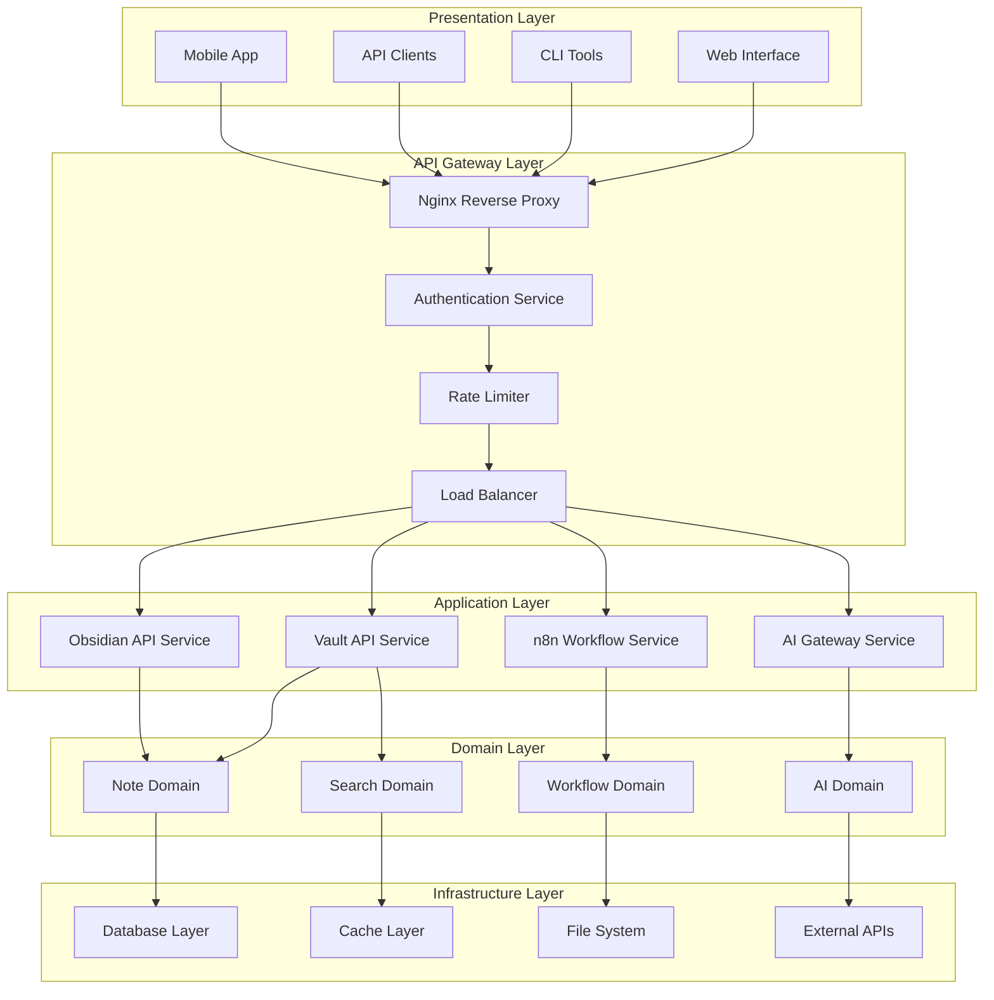

---

## 📋 **DOMAIN MODEL DESIGN**

### **1. Core Domain Entities**

```mermaid
classDiagram
    class User {
        +UUID id
        +String username
        +String email
        +String passwordHash
        +DateTime createdAt
        +DateTime updatedAt
        +List~Role~ roles
        +isActive() boolean
        +hasPermission(permission) boolean
    }
    
    class Agent {
        +UUID id
        +String name
        +String description
        +AgentConfiguration config
        +UUID userId
        +DateTime createdAt
        +DateTime lastActive
        +getContext() AgentContext
        +updateContext(context) void
        +executeAction(action) ActionResult
    }
    
    class Note {
        +String path
        +String content
        +NoteMetadata metadata
        +DateTime createdAt
        +DateTime updatedAt
        +List~Tag~ tags
        +List~Link~ links
        +getContent() String
        +updateContent(content) void
        +addTag(tag) void
        +removeTag(tag) void
    }
    
    class SearchQuery {
        +String query
        +SearchFilters filters
        +SearchOptions options
        +DateTime executedAt
        +execute() SearchResults
        +addFilter(filter) void
        +setOptions(options) void
    }
    
    class Interaction {
        +UUID id
        +UUID agentId
        +String query
        +String response
        +Float confidenceScore
        +DateTime timestamp
        +InteractionMetadata metadata
        +getConfidence() Float
        +updateResponse(response) void
    }
    
    class VectorEmbedding {
        +UUID id
        +String filePath
        +Vector embedding
        +String chunkText
        +Integer chunkIndex
        +DateTime createdAt
        +getSimilarity(other) Float
        +updateEmbedding(embedding) void
    }
    
    User ||--o{ Agent : owns
    Agent ||--o{ Interaction : generates
    Note ||--o{ VectorEmbedding : contains
    SearchQuery --> Note : searches
    Interaction --> Agent : belongs_to
```

### **2. Value Objects**

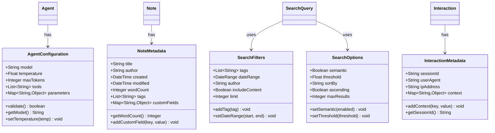

---

## 🔧 **SERVICE LAYER DESIGN**

### **1. Vault API Service Architecture**

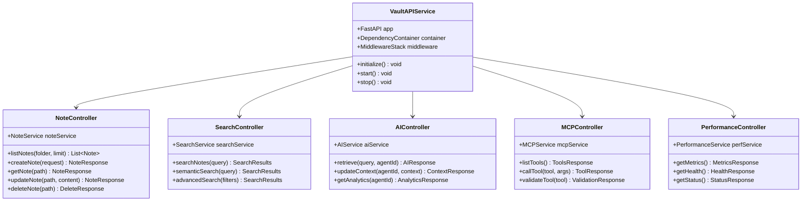

### **2. Service Layer Implementation**

```mermaid
classDiagram
    class NoteService {
        +ObsidianAPIClient obsidianClient
        +NoteRepository noteRepository
        +CacheService cacheService
        +listNotes(folder, limit) List~Note~
        +createNote(noteRequest) Note
        +getNote(path) Note
        +updateNote(path, content) Note
        +deleteNote(path) boolean
        +searchNotes(query) List~Note~
    }
    
    class SearchService {
        +VectorSearchService vectorSearch
        +TextSearchService textSearch
        +SemanticSearchService semanticSearch
        +CacheService cacheService
        +search(query, options) SearchResults
        +semanticSearch(query) SearchResults
        +advancedSearch(filters) SearchResults
    }
    
    class AIService {
        +AIGateway aiGateway
        +ContextService contextService
        +EmbeddingService embeddingService
        +retrieve(query, agentId) AIResponse
        +updateContext(agentId, context) void
        +getAnalytics(agentId) Analytics
    }
    
    class MCPService {
        +ToolRegistry toolRegistry
        +ExecutionEngine executionEngine
        +ValidationService validationService
        +listTools() List~Tool~
        +callTool(tool, args) ToolResult
        +validateTool(tool) ValidationResult
    }
    
    class PerformanceService {
        +MetricsCollector metricsCollector
        +HealthChecker healthChecker
        +ResourceMonitor resourceMonitor
        +getMetrics() Metrics
        +getHealth() HealthStatus
        +getStatus() SystemStatus
    }
    
    NoteService --> ObsidianAPIClient
    NoteService --> NoteRepository
    NoteService --> CacheService
    
    SearchService --> VectorSearchService
    SearchService --> TextSearchService
    SearchService --> SemanticSearchService
    SearchService --> CacheService
    
    AIService --> AIGateway
    AIService --> ContextService
    AIService --> EmbeddingService
    
    MCPService --> ToolRegistry
    MCPService --> ExecutionEngine
    MCPService --> ValidationService
    
    PerformanceService --> MetricsCollector
    PerformanceService --> HealthChecker
    PerformanceService --> ResourceMonitor
```

---

## 🗄️ **DATA ACCESS LAYER DESIGN**

### **1. Repository Pattern Implementation**

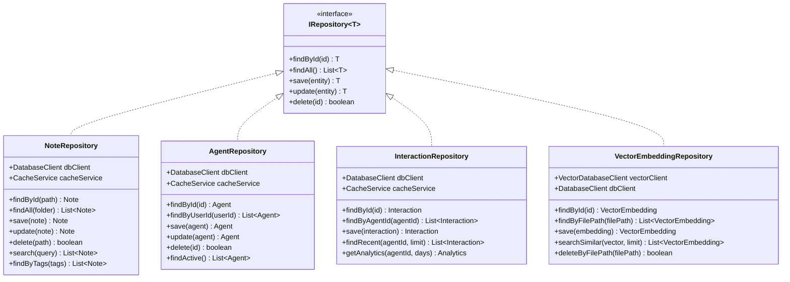

### **2. Database Client Architecture**

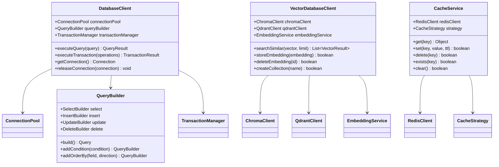

---

## 🧠 **AI/ML LAYER DESIGN**

### **1. AI Gateway Architecture**

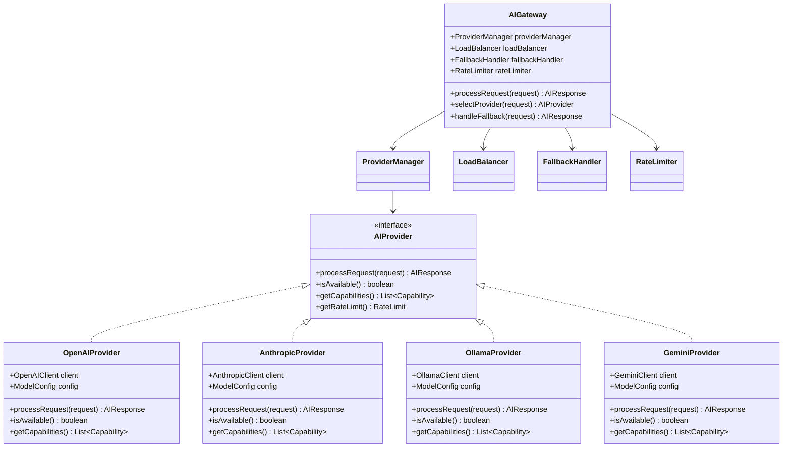

### **2. RAG (Retrieval-Augmented Generation) Pipeline**

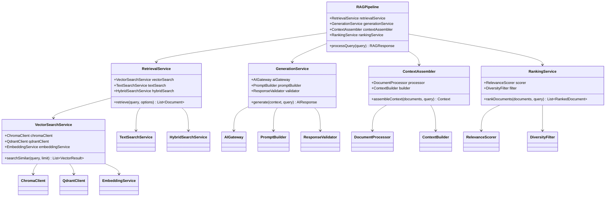

---

## 🔧 **MCP (Model Context Protocol) DESIGN**

### **1. MCP Server Architecture**

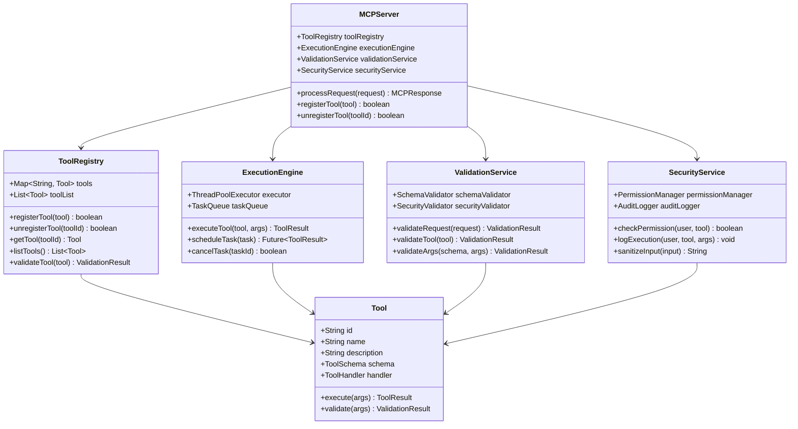

### **2. MCP Tool Categories**

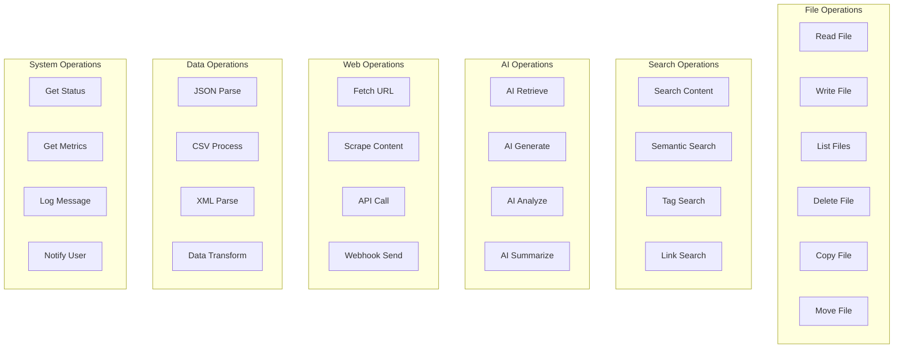

---

## 📊 **MONITORING & OBSERVABILITY DESIGN**

### **1. Metrics Collection Architecture**

```mermaid
classDiagram
    class MetricsCollector {
        +PrometheusClient prometheusClient
        +CustomMetricsRegistry registry
        +collectMetrics() Metrics
        +registerCounter(name, help) Counter
        +registerGauge(name, help) Gauge
        +registerHistogram(name, help) Histogram
    }
    
    class HealthChecker {
        +List~HealthCheck~ checks
        +DatabaseHealthCheck dbCheck
        +CacheHealthCheck cacheCheck
        +ExternalAPIHealthCheck apiCheck
        +checkHealth() HealthStatus
        +addCheck(check) void
    }
    
    class ResourceMonitor {
        +SystemMetricsCollector systemCollector
        +ApplicationMetricsCollector appCollector
        +BusinessMetricsCollector businessCollector
        +collectResources() ResourceMetrics
    }
    
    class AlertManager {
        +AlertRuleEngine ruleEngine
        +NotificationService notificationService
        +AlertHistory history
        +evaluateRules(metrics) List~Alert~
        +sendNotification(alert) boolean
    }
    
    class DashboardService {
        +GrafanaClient grafanaClient
        +DashboardBuilder builder
        +createDashboard(config) Dashboard
        +updateDashboard(id, config) boolean
        +deleteDashboard(id) boolean
    }
    
    MetricsCollector --> PrometheusClient
    MetricsCollector --> CustomMetricsRegistry
    
    HealthChecker --> DatabaseHealthCheck
    HealthChecker --> CacheHealthCheck
    HealthChecker --> ExternalAPIHealthCheck
    
    ResourceMonitor --> SystemMetricsCollector
    ResourceMonitor --> ApplicationMetricsCollector
    ResourceMonitor --> BusinessMetricsCollector
    
    AlertManager --> AlertRuleEngine
    AlertManager --> NotificationService
    AlertManager --> AlertHistory
    
    DashboardService --> GrafanaClient
    DashboardService --> DashboardBuilder
```

### **2. Logging Architecture**

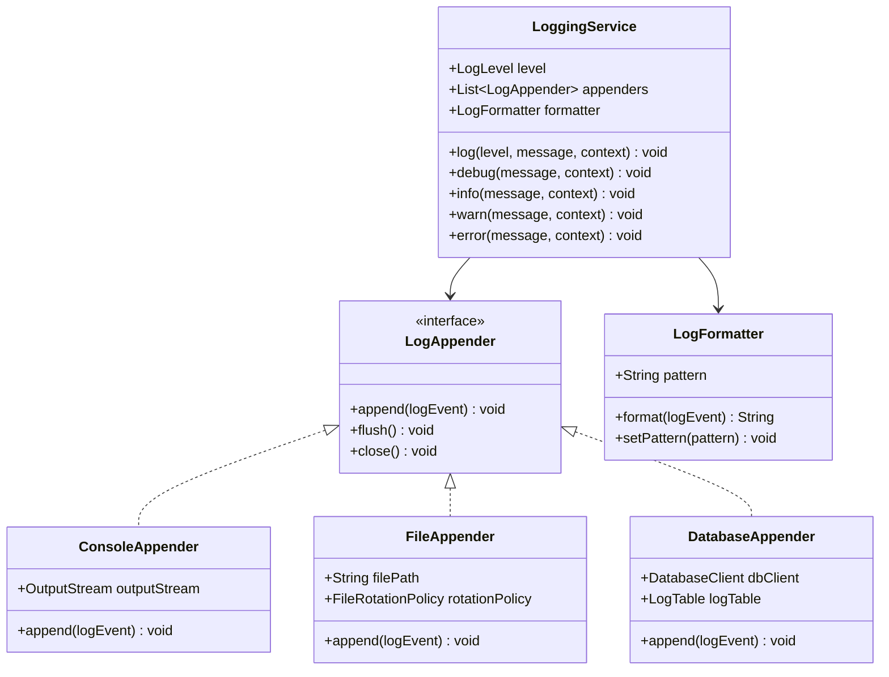

---

## 🔒 **SECURITY DESIGN**

### **1. Authentication & Authorization**

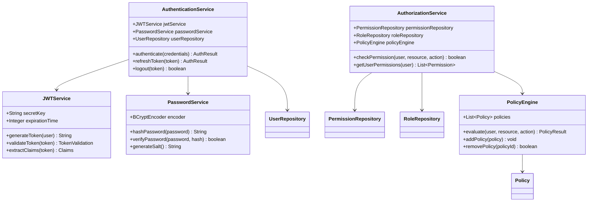

### **2. Security Middleware**

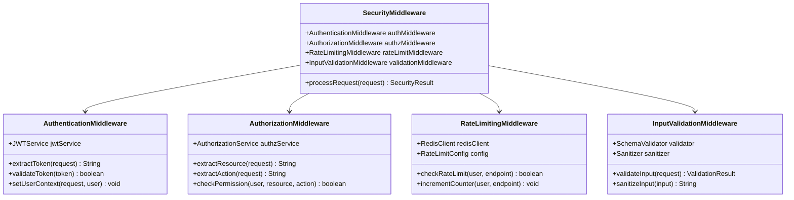

---

## 🚀 **DEPLOYMENT DESIGN**

### **1. Container Architecture**

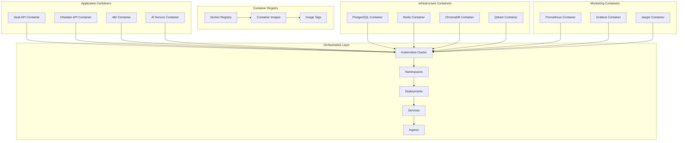

### **2. CI/CD Pipeline Design**

```mermaid
flowchart LR
    subgraph "Source Control"
        GIT[Git Repository]
        BRANCHES[Feature Branches]
        PR[Pull Requests]
    end
    
    subgraph "Build Stage"
        BUILD[Docker Build]
        TEST[Unit Tests]
        LINT[Code Linting]
        SECURITY[Security Scan]
    end
    
    subgraph "Test Stage"
        INTEGRATION[Integration Tests]
        E2E[E2E Tests]
        PERFORMANCE[Performance Tests]
        SECURITY_TEST[Security Tests]
    end
    
    subgraph "Deploy Stage"
        STAGING[Deploy to Staging]
        PRODUCTION[Deploy to Production]
        ROLLBACK[Rollback if Needed]
    end
    
    subgraph "Monitor Stage"
        HEALTH[Health Checks]
        METRICS[Performance Metrics]
        ALERTS[Alert Notifications]
    end
    
    GIT --> BRANCHES
    BRANCHES --> PR
    PR --> BUILD
    BUILD --> TEST
    TEST --> LINT
    LINT --> SECURITY
    SECURITY --> INTEGRATION
    INTEGRATION --> E2E
    E2E --> PERFORMANCE
    PERFORMANCE --> SECURITY_TEST
    SECURITY_TEST --> STAGING
    STAGING --> PRODUCTION
    PRODUCTION --> ROLLBACK
    ROLLBACK --> HEALTH
    HEALTH --> METRICS
    METRICS --> ALERTS
```

---

## 📈 **PERFORMANCE DESIGN**

### **1. Caching Strategy**

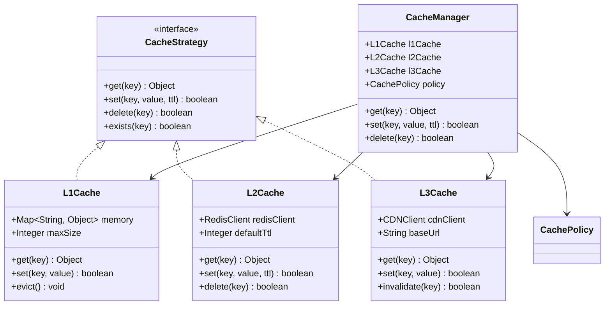

### **2. Load Balancing Design**

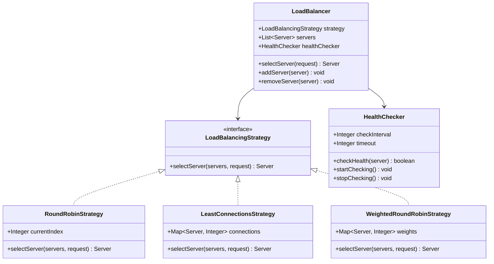

---

## 🧪 **TESTING DESIGN**

### **1. Testing Strategy**

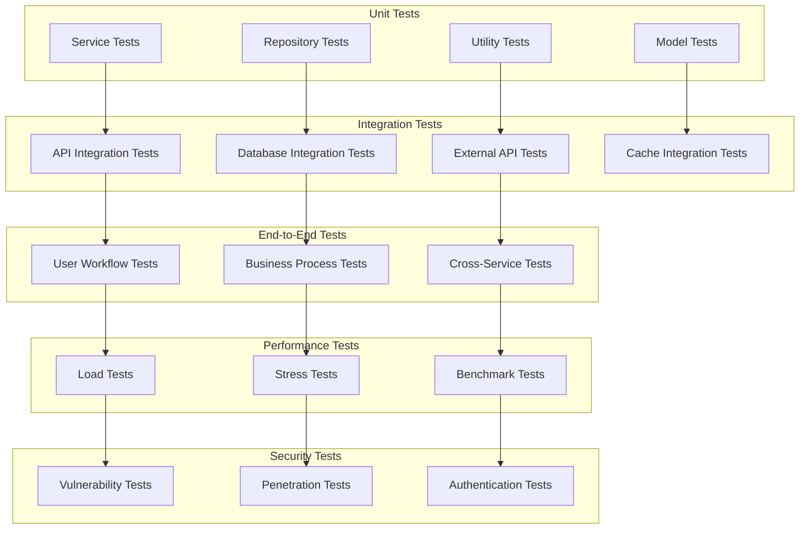

### **2. Test Data Management**

```mermaid
classDiagram
    class TestDataManager {
        +TestDataFactory factory
        +TestDataCleaner cleaner
        +TestDataSeeder seeder
        +createTestData(type) TestData
        +cleanTestData() void
        +seedTestData() void
    }
    
    class TestDataFactory {
        +UserFactory userFactory
        +NoteFactory noteFactory
        +AgentFactory agentFactory
        +createUser(overrides) User
        +createNote(overrides) Note
        +createAgent(overrides) Agent
    }
    
    class TestDataCleaner {
        +DatabaseCleaner dbCleaner
        +CacheCleaner cacheCleaner
        +FileCleaner fileCleaner
        +cleanAll() void
        +cleanDatabase() void
        +cleanCache() void
        +cleanFiles() void
    }
    
    class TestDataSeeder {
        +DatabaseSeeder dbSeeder
        +CacheSeeder cacheSeeder
        +FileSeeder fileSeeder
        +seedAll() void
        +seedDatabase() void
        +seedCache() void
        +seedFiles() void
    }
    
    TestDataManager --> TestDataFactory
    TestDataManager --> TestDataCleaner
    TestDataManager --> TestDataSeeder
    
    TestDataFactory --> UserFactory
    TestDataFactory --> NoteFactory
    TestDataFactory --> AgentFactory
    
    TestDataCleaner --> DatabaseCleaner
    TestDataCleaner --> CacheCleaner
    TestDataCleaner --> FileCleaner
    
    TestDataSeeder --> DatabaseSeeder
    TestDataSeeder --> CacheSeeder
    TestDataSeeder --> FileSeeder
```

---

## 📊 **BUSINESS LOGIC DESIGN**

### **1. Domain Services**

```mermaid
classDiagram
    class NoteDomainService {
        +NoteRepository noteRepository
        +TagService tagService
        +LinkService linkService
        +createNote(noteData) Note
        +updateNote(noteData) Note
        +deleteNote(noteId) boolean
        +searchNotes(query) List~Note~
        +extractTags(content) List~Tag~
        +extractLinks(content) List~Link~
    }
    
    class SearchDomainService {
        +SearchRepository searchRepository
        +VectorSearchService vectorSearch
        +TextSearchService textSearch
        +SemanticSearchService semanticSearch
        +search(query, options) SearchResults
        +semanticSearch(query) SearchResults
        +advancedSearch(filters) SearchResults
    }
    
    class AIDomainService {
        +AIGateway aiGateway
        +ContextService contextService
        +EmbeddingService embeddingService
        +processQuery(query, agentId) AIResponse
        +updateContext(agentId, context) void
        +getAnalytics(agentId) Analytics
    }
    
    class WorkflowDomainService {
        +WorkflowRepository workflowRepository
        +ExecutionEngine executionEngine
        +TriggerService triggerService
        +createWorkflow(workflowData) Workflow
        +executeWorkflow(workflowId) ExecutionResult
        +scheduleWorkflow(workflowId, schedule) boolean
    }
    
    NoteDomainService --> NoteRepository
    NoteDomainService --> TagService
    NoteDomainService --> LinkService
    
    SearchDomainService --> SearchRepository
    SearchDomainService --> VectorSearchService
    SearchDomainService --> TextSearchService
    SearchDomainService --> SemanticSearchService
    
    AIDomainService --> AIGateway
    AIDomainService --> ContextService
    AIDomainService --> EmbeddingService
    
    WorkflowDomainService --> WorkflowRepository
    WorkflowDomainService --> ExecutionEngine
    WorkflowDomainService --> TriggerService
```

### **2. Business Rules Engine**

```mermaid
classDiagram
    class BusinessRulesEngine {
        +List~BusinessRule~ rules
        +RuleEvaluator evaluator
        +RuleExecutor executor
        +evaluate(context) List~RuleResult~
        +execute(rule, context) ExecutionResult
        +addRule(rule) void
        +removeRule(ruleId) void
    }
    
    class BusinessRule {
        +String id
        +String name
        +String condition
        +String action
        +Integer priority
        +Boolean enabled
        +evaluate(context) boolean
        +execute(context) ExecutionResult
    }
    
    class RuleEvaluator {
        +ExpressionParser parser
        +ContextResolver resolver
        +evaluate(rule, context) boolean
        +parseExpression(expression) Expression
        +resolveContext(context) Map~String, Object~
    }
    
    class RuleExecutor {
        +ActionRegistry actionRegistry
        +execute(action, context) ExecutionResult
        +registerAction(action) void
        +unregisterAction(actionId) void
    }
    
    class ActionRegistry {
        +Map~String, Action~ actions
        +registerAction(action) void
        +unregisterAction(actionId) void
        +getAction(actionId) Action
    }
    
    BusinessRulesEngine --> BusinessRule
    BusinessRulesEngine --> RuleEvaluator
    BusinessRulesEngine --> RuleExecutor
    
    RuleEvaluator --> ExpressionParser
    RuleEvaluator --> ContextResolver
    
    RuleExecutor --> ActionRegistry
    ActionRegistry --> Action
```

---

## 🎯 **CONCLUSION**

This comprehensive system design documentation provides:

- **🏗️ Complete Architecture**: From high-level system design to detailed class diagrams
- **📋 Domain Modeling**: Clear domain entities, value objects, and relationships
- **🔧 Service Design**: Detailed service layer architecture with clear responsibilities
- **🗄️ Data Design**: Repository patterns and data access layer implementation
- **🧠 AI/ML Design**: Advanced AI integration with RAG pipeline architecture
- **🔧 MCP Design**: Comprehensive Model Context Protocol implementation
- **📊 Monitoring Design**: Complete observability and monitoring architecture
- **🔒 Security Design**: Multi-layered security with authentication and authorization
- **🚀 Deployment Design**: Container and CI/CD pipeline architecture
- **📈 Performance Design**: Caching, load balancing, and optimization strategies
- **🧪 Testing Design**: Comprehensive testing strategy and test data management
- **📊 Business Logic**: Domain services and business rules engine

The system is designed to be **scalable**, **maintainable**, **secure**, and **high-performance**, providing a solid foundation for AI-powered Obsidian vault automation.

---

*Generated: 2024-01-24 | Version: 3.0.0 | Status: Production Ready ✅*

