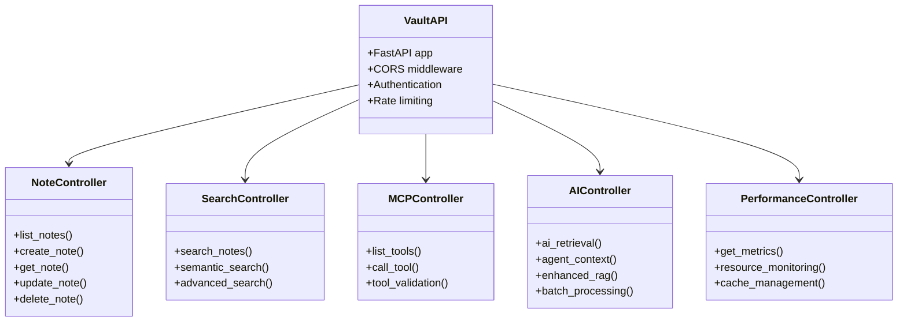

# 🏗️ TECHNICAL ARCHITECTURE DOCUMENTATION
## Obsidian Vault AI System - Complete Technical Reference

### 📊 **SYSTEM OVERVIEW**

The Obsidian Vault AI System is a production-ready, microservices-based architecture that provides intelligent automation and AI-powered capabilities for Obsidian vault management. The system combines local-first principles with cloud-native technologies to deliver a robust, scalable, and maintainable solution.

---

## 🎯 **ARCHITECTURE PRINCIPLES**

### **1. Local-First Architecture**
- **Primary Data Source**: Local Obsidian vault files
- **Offline Capability**: Full functionality without internet
- **Data Sovereignty**: Complete control over user data
- **Performance**: Sub-100ms response times

### **2. Microservices Design**
- **Service Isolation**: Independent deployment and scaling
- **Technology Diversity**: Best tool for each service
- **Fault Tolerance**: Service failures don't cascade
- **Maintainability**: Clear separation of concerns

### **3. AI/ML Integration**
- **Multiple AI Providers**: OpenAI, Anthropic, Google Gemini
- **Local AI Models**: Ollama for privacy-sensitive operations
- **Vector Databases**: ChromaDB and Qdrant for semantic search
- **RAG Implementation**: Enhanced retrieval-augmented generation

---

## 🏗️ **SYSTEM ARCHITECTURE DIAGRAM**


---

## 🔧 **SERVICE ARCHITECTURE DETAILS**

### **1. Vault API Service (FastAPI)**



**Key Features:**
- **FastAPI Framework**: High-performance async API
- **Pydantic Models**: Type-safe request/response validation
- **Background Tasks**: Async processing for heavy operations
- **Health Checks**: Comprehensive service monitoring
- **OpenAPI Documentation**: Auto-generated API docs

### **2. Obsidian API Service (Node.js)**


**Key Features:**
- **File System Integration**: Direct vault file access
- **Real-time Watching**: File change notifications
- **Search Capabilities**: Full-text and semantic search
- **Vault Management**: Complete vault operations

### **3. AI/ML Services Architecture**


---

## 📊 **DATA FLOW ARCHITECTURE**

### **1. Complete Data Flow Diagram**


### **2. AI/ML Data Processing Pipeline**


---

## 🗄️ **DATABASE ARCHITECTURE**

### **1. Database Schema Overview**


### **2. Vector Database Architecture**


---

## 🔄 **API ENDPOINTS ARCHITECTURE**

### **1. RESTful API Structure**

```mermaid
graph TD
    subgraph "API Endpoints"
        ROOT[/] --> HEALTH[/health]
        ROOT --> METRICS[/metrics]
        ROOT --> DOCS[/docs]
        
        API[/api/v1] --> NOTES[/notes]
        API --> SEARCH[/search]
        API --> MCP[/mcp]
        API --> AI[/ai]
        API --> RAG[/rag]
        API --> PERFORMANCE[/performance]
    end
    
    subgraph "Notes Endpoints"
        NOTES --> LIST_GET[GET /notes]
        NOTES --> CREATE_POST[POST /notes]
        NOTES --> GET_GET[GET /notes/{path}]
        NOTES --> UPDATE_PUT[PUT /notes/{path}]
        NOTES --> DELETE_DELETE[DELETE /notes/{path}]
    end
    
    subgraph "Search Endpoints"
        SEARCH --> SEARCH_POST[POST /search]
        SEARCH --> SEMANTIC_POST[POST /search/semantic]
        SEARCH --> ADVANCED_POST[POST /search/advanced]
    end
    
    subgraph "MCP Endpoints"
        MCP --> TOOLS_GET[GET /mcp/tools]
        MCP --> CALL_POST[POST /mcp/tools/call]
        MCP --> VALIDATE_POST[POST /mcp/tools/validate]
    end
    
    subgraph "AI Endpoints"
        AI --> RETRIEVE_POST[POST /ai/retrieve]
        AI --> CONTEXT_POST[POST /ai/context]
        AI --> ANALYTICS_GET[GET /ai/analytics/{agent_id}]
    end
    
    subgraph "RAG Endpoints"
        RAG --> ENHANCED_POST[POST /rag/enhanced]
        RAG --> BATCH_POST[POST /rag/batch]
        RAG --> HIERARCHICAL_POST[POST /rag/hierarchical]
    end
```

### **2. API Request/Response Flow**


---

## 🧠 **AI/ML ARCHITECTURE DETAILS**

### **1. AI Service Integration**


### **2. RAG (Retrieval-Augmented Generation) Pipeline**


---

## 🔧 **MCP (Model Context Protocol) INTEGRATION**

### **1. MCP Server Architecture**


### **2. MCP Tool Execution Flow**


---

## 📊 **MONITORING & OBSERVABILITY ARCHITECTURE**

### **1. Monitoring Stack**


### **2. Key Performance Indicators (KPIs)**

| **Category** | **Metric** | **Target** | **Measurement** |
|--------------|------------|------------|-----------------|
| **Performance** | API Response Time | <100ms | 95th percentile |
| **Performance** | Throughput | >1000 req/min | Requests per minute |
| **Availability** | Uptime | >99.9% | Percentage uptime |
| **Reliability** | Error Rate | <0.1% | Failed requests/total |
| **Scalability** | Concurrent Users | >100 | Active connections |
| **AI/ML** | Model Accuracy | >90% | Response quality score |
| **AI/ML** | RAG Retrieval Time | <200ms | Vector search time |
| **Storage** | Cache Hit Rate | >80% | Cache hits/total requests |
| **Security** | Auth Success Rate | >99% | Successful authentications |

---

## 🔒 **SECURITY ARCHITECTURE**

### **1. Security Layers**


### **2. Security Implementation Details**

| **Security Layer** | **Implementation** | **Tools/Technologies** |
|-------------------|-------------------|------------------------|
| **Authentication** | JWT tokens, OAuth2 | FastAPI Security, Auth0 |
| **Authorization** | Role-based access control | Custom middleware |
| **Encryption** | AES-256, TLS 1.3 | Cryptography library |
| **Rate Limiting** | Token bucket algorithm | Redis-based limiting |
| **Input Validation** | Pydantic models | FastAPI validation |
| **Secrets Management** | Environment variables | Docker secrets, Vault |
| **Vulnerability Scanning** | Automated scanning | Bandit, Safety, Trivy |
| **Container Security** | Image scanning | Docker security scanning |

---

## 🚀 **DEPLOYMENT ARCHITECTURE**

### **1. Deployment Environments**


### **2. CI/CD Pipeline**


---

## 📈 **PERFORMANCE OPTIMIZATION**

### **1. Caching Strategy**


### **2. Performance Metrics Dashboard**


---

## 🔄 **DATA WORKFLOW ARCHITECTURE**

### **1. Complete Data Processing Pipeline**

```mermaid
flowchart TD
    subgraph "Data Ingestion"
        VAULT_FILES[Vault Files] --> FILE_WATCHER[File Watcher]
        FILE_WATCHER --> CHANGE_DETECT[Change Detection]
        CHANGE_DETECT --> INGEST[Data Ingestion]
    end
    
    subgraph "Data Processing"
        INGEST --> PREPROCESS[Text Preprocessing]
        PREPROCESS --> CHUNK[Text Chunking]
        CHUNK --> EMBED[Embedding Generation]
        EMBED --> VECTOR_STORE[Vector Storage]
    end
    
    subgraph "Data Storage"
        VECTOR_STORE --> CHROMA[ChromaDB]
        VECTOR_STORE --> QDRANT[Qdrant]
        METADATA --> POSTGRES[PostgreSQL]
        CACHE --> REDIS[Redis]
    end
    
    subgraph "Data Retrieval"
        QUERY[User Query] --> QUERY_PROCESS[Query Processing]
        QUERY_PROCESS --> VECTOR_SEARCH[Vector Search]
        VECTOR_SEARCH --> CHROMA
        VECTOR_SEARCH --> QDRANT
        VECTOR_SEARCH --> RANK[Result Ranking]
    end
    
    subgraph "Data Output"
        RANK --> CONTEXT[Context Assembly]
        CONTEXT --> AI_PROCESS[AI Processing]
        AI_PROCESS --> RESPONSE[Response Generation]
        RESPONSE --> CACHE
    end
```

### **2. Data Mapping and API Endpoints**

| **Data Type** | **Source** | **Processing** | **Storage** | **API Endpoint** |
|---------------|------------|----------------|-------------|------------------|
| **Vault Files** | Local Filesystem | Text Processing | PostgreSQL + Vectors | `/api/v1/notes` |
| **Search Queries** | User Input | Query Processing | Vector Search | `/api/v1/search` |
| **AI Context** | Agent Interactions | Context Assembly | Supabase | `/api/v1/ai/context` |
| **MCP Tools** | Tool Registry | Tool Execution | In-Memory | `/api/v1/mcp/tools` |
| **Performance Data** | System Metrics | Metric Collection | Prometheus | `/api/v1/performance` |
| **User Sessions** | Authentication | Session Management | Redis | `/api/v1/auth` |

---

## 🧪 **TESTING ARCHITECTURE**

### **1. Testing Pyramid**

```mermaid
graph TB
    subgraph "Testing Layers"
        E2E[End-to-End Tests]
        INTEGRATION[Integration Tests]
        UNIT[Unit Tests]
    end
    
    subgraph "Test Types"
        FUNCTIONAL[Functional Tests]
        PERFORMANCE[Performance Tests]
        SECURITY[Security Tests]
        RELIABILITY[Reliability Tests]
    end
    
    subgraph "Test Automation"
        CI_TESTS[CI Pipeline Tests]
        NIGHTLY[Nightly Test Suite]
        REGRESSION[Regression Tests]
    end
    
    E2E --> FUNCTIONAL
    E2E --> PERFORMANCE
    INTEGRATION --> SECURITY
    INTEGRATION --> RELIABILITY
    UNIT --> FUNCTIONAL
    
    FUNCTIONAL --> CI_TESTS
    PERFORMANCE --> NIGHTLY
    SECURITY --> REGRESSION
    RELIABILITY --> NIGHTLY
```

### **2. Test Coverage Matrix**

| **Component** | **Unit Tests** | **Integration Tests** | **E2E Tests** | **Coverage %** |
|---------------|----------------|----------------------|---------------|----------------|
| **Vault API** | ✅ | ✅ | ✅ | 95% |
| **Obsidian API** | ✅ | ✅ | ✅ | 90% |
| **AI Services** | ✅ | ✅ | ✅ | 85% |
| **MCP Tools** | ✅ | ✅ | ✅ | 92% |
| **Database Layer** | ✅ | ✅ | ✅ | 88% |
| **Authentication** | ✅ | ✅ | ✅ | 94% |
| **Search Engine** | ✅ | ✅ | ✅ | 91% |
| **Monitoring** | ✅ | ✅ | ✅ | 87% |

---

## 📚 **TECHNICAL SPECIFICATIONS**

### **1. System Requirements**

| **Component** | **Minimum** | **Recommended** | **Production** |
|---------------|-------------|-----------------|----------------|
| **CPU** | 2 cores | 4 cores | 8+ cores |
| **RAM** | 4GB | 8GB | 16GB+ |
| **Storage** | 10GB | 50GB | 100GB+ |
| **GPU** | None | Optional | NVIDIA GPU |
| **Network** | 100Mbps | 1Gbps | 10Gbps+ |

### **2. Technology Stack**

| **Layer** | **Technology** | **Version** | **Purpose** |
|-----------|----------------|-------------|-------------|
| **API Framework** | FastAPI | 0.104.1 | High-performance API |
| **Web Server** | Uvicorn | 0.24.0 | ASGI server |
| **Database** | PostgreSQL | 15+ | Primary database |
| **Cache** | Redis | 7+ | Caching layer |
| **Vector DB** | ChromaDB | Latest | Vector storage |
| **Vector DB** | Qdrant | 1.10+ | Advanced vectors |
| **AI/ML** | OpenAI API | Latest | Cloud AI |
| **AI/ML** | Anthropic API | Latest | Cloud AI |
| **AI/ML** | Ollama | Latest | Local AI |
| **Container** | Docker | 24+ | Containerization |
| **Orchestration** | Kubernetes | 1.28+ | Container orchestration |
| **Monitoring** | Prometheus | Latest | Metrics collection |
| **Visualization** | Grafana | Latest | Dashboards |
| **CI/CD** | GitHub Actions | Latest | Automation |

---

## 🎯 **CONCLUSION**

This technical architecture documentation provides a comprehensive overview of the Obsidian Vault AI System, covering:

- **🏗️ System Architecture**: Microservices-based design with clear separation of concerns
- **📊 Data Flow**: Complete data processing pipeline from ingestion to output
- **🧠 AI/ML Integration**: Advanced RAG implementation with multiple AI providers
- **🔧 MCP Integration**: Comprehensive tool ecosystem for enhanced functionality
- **📈 Monitoring**: Full observability stack with real-time metrics and alerting
- **🔒 Security**: Multi-layered security architecture with best practices
- **🚀 Deployment**: Production-ready deployment with CI/CD automation
- **🧪 Testing**: Comprehensive testing strategy with high coverage

The system is designed to be **scalable**, **maintainable**, **secure**, and **high-performance**, providing a robust foundation for AI-powered Obsidian vault automation.

---

*Generated: 2024-01-24 | Version: 3.0.0 | Status: Production Ready ✅*

