# Architecture Overview

The Obsidian Vault AI Automation System is built on a modern, scalable architecture that combines microservices, AI agents, and real-time processing capabilities.

## 🏗️ High-Level Architecture

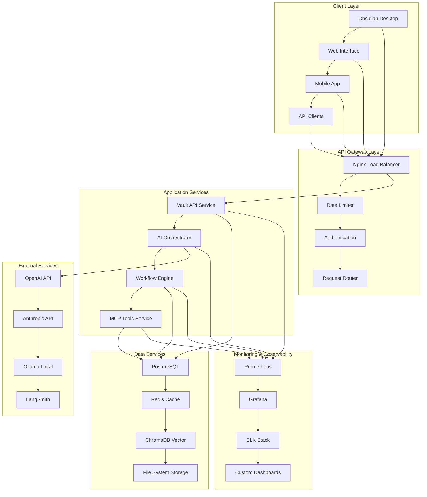

## 🧩 Core Components

### 1. API Gateway Layer
**Purpose**: Entry point for all client requests with security and routing

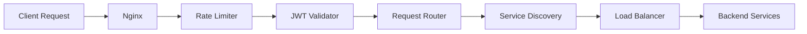

**Components**:
- **Nginx**: Reverse proxy and load balancer
- **Rate Limiter**: Prevents API abuse
- **Authentication**: JWT token validation
- **Request Router**: Routes requests to appropriate services

### 2. Application Services Layer
**Purpose**: Core business logic and service orchestration

```mermaid
graph TB
    subgraph "Vault API Service"
        A[File Operations] --> B[Content Processing]
        B --> C[Search Engine]
        C --> D[Metadata Management]
    end
    
    subgraph "AI Orchestrator"
        E[Agent Manager] --> F[Model Router]
        F --> G[Prompt Engineering]
        G --> H[Response Processing]
    end
    
    subgraph "Workflow Engine"
        I[Workflow Executor] --> J[Task Scheduler]
        J --> K[Event Handler]
        K --> L[State Manager]
    end
    
    subgraph "MCP Tools Service"
        M[Tool Registry] --> N[Tool Executor]
        N --> O[Result Processor]
        O --> P[Tool Monitor]
    end
```

### 3. Data Layer
**Purpose**: Data persistence, caching, and vector operations

```mermaid
graph TB
    subgraph "Relational Data"
        A[PostgreSQL] --> B[User Data]
        B --> C[Workflow State]
        C --> D[System Config]
    end
    
    subgraph "Caching Layer"
        E[Redis] --> F[Session Cache]
        F --> G[API Cache]
        G --> H[Query Cache]
    end
    
    subgraph "Vector Database"
        I[ChromaDB] --> J[Document Embeddings]
        J --> K[Semantic Index]
        K --> L[Similarity Search]
    end
    
    subgraph "File Storage"
        M[Local FS] --> N[Vault Files]
        N --> O[Media Assets]
        O --> P[Backup Storage]
    end
```

## 🔄 Data Flow Architecture

### Content Processing Pipeline
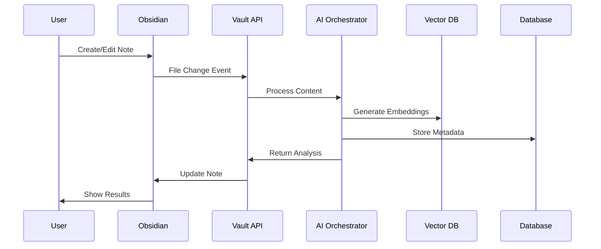

### AI Agent Workflow
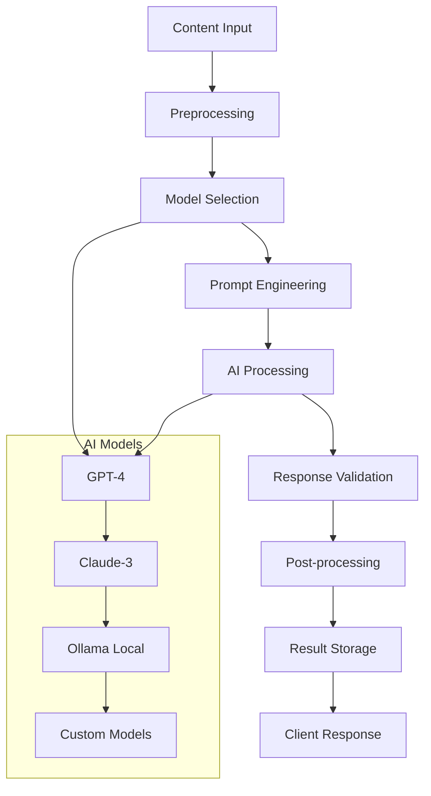

## 🏛️ Design Patterns

### 1. Clean Architecture
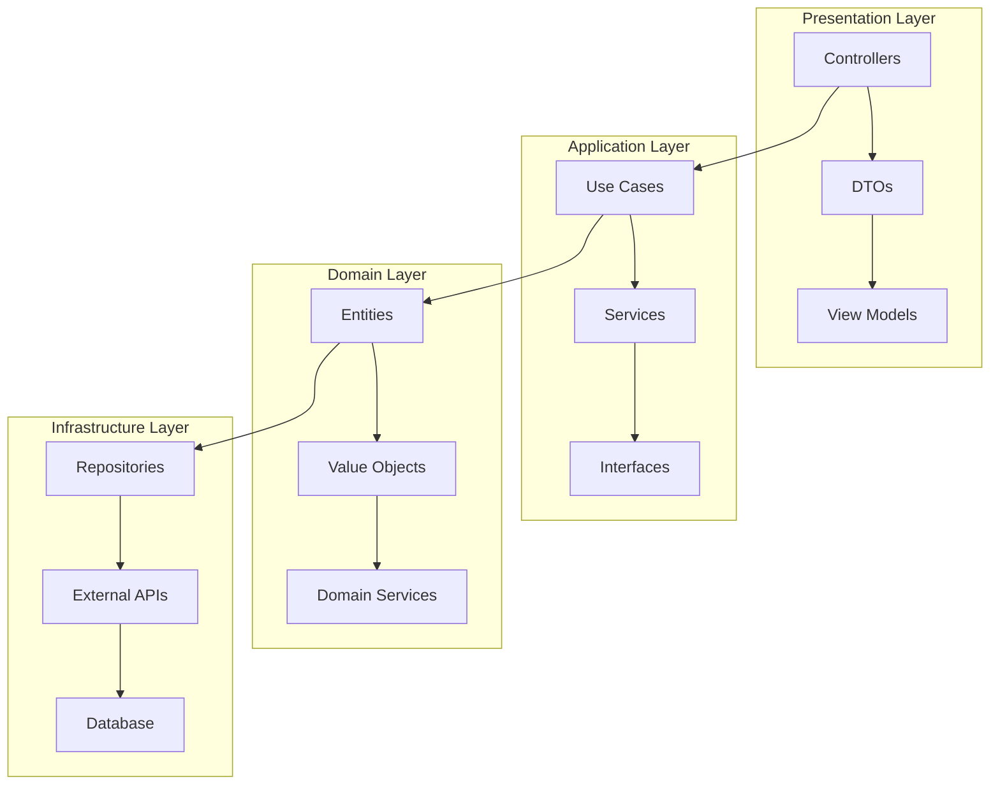

### 2. Microservices Architecture
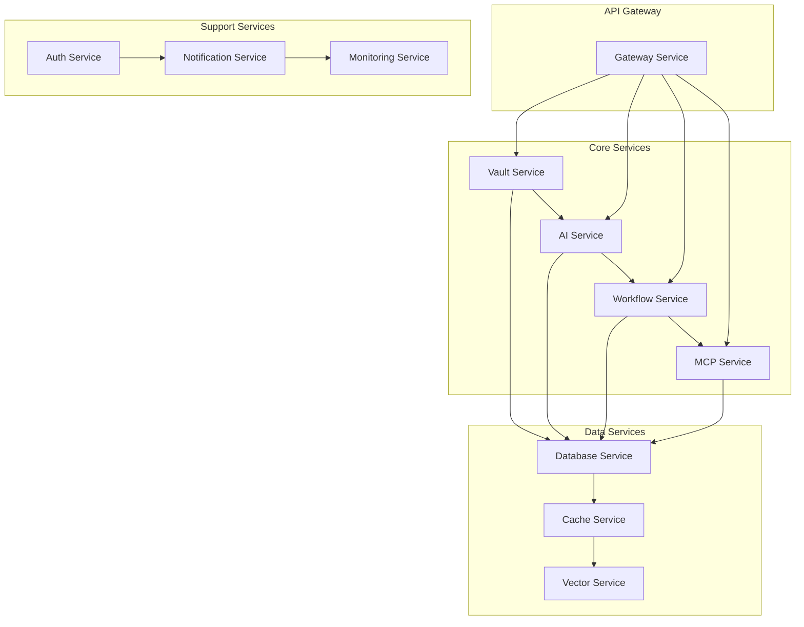

### 3. Event-Driven Architecture
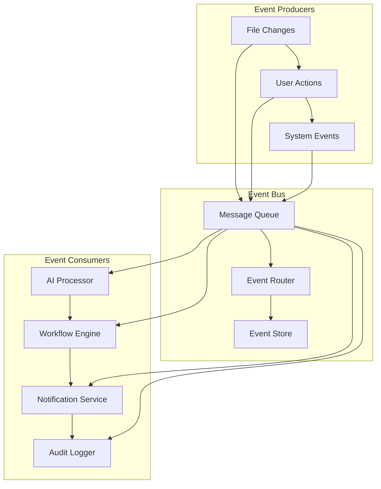

## 🔒 Security Architecture

### Multi-Layer Security
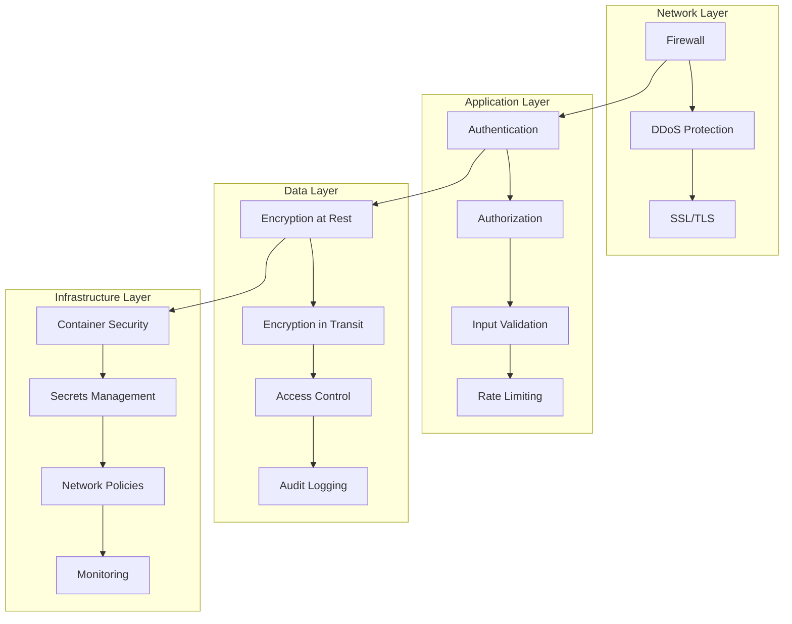

## 📊 Monitoring & Observability

### Observability Stack
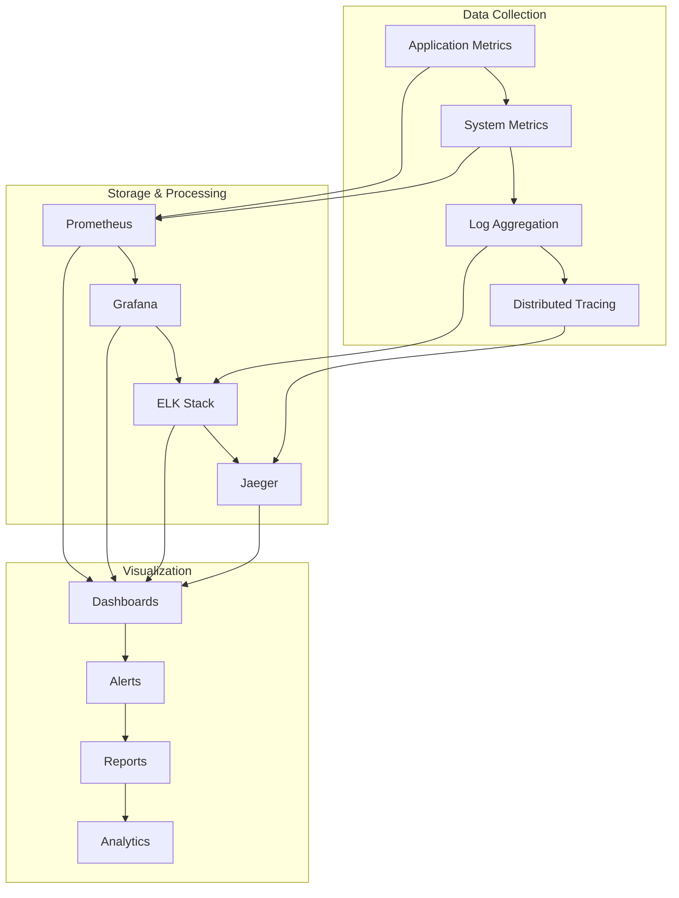

## 🚀 Scalability Architecture

### Horizontal Scaling
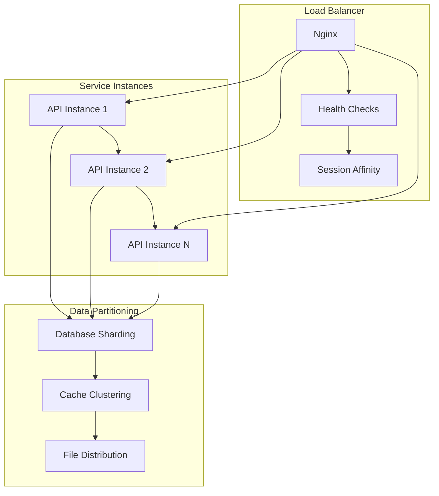

### Vertical Scaling
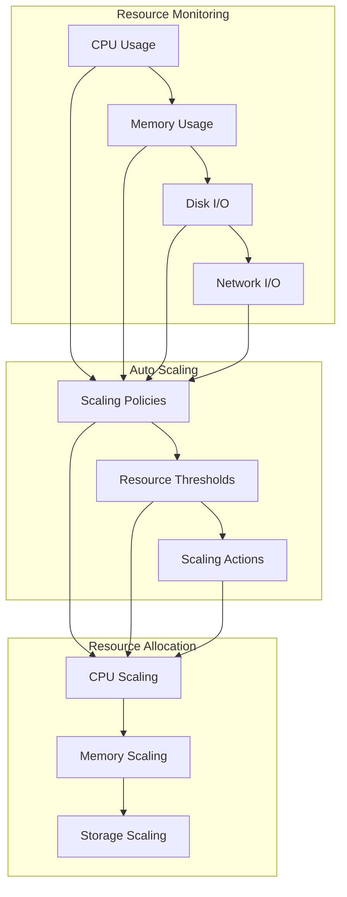

## 🔧 Technology Stack

### Backend Technologies
| Component | Technology | Purpose |
|-----------|------------|---------|
| **API Framework** | FastAPI | High-performance Python API |
| **Workflow Engine** | n8n | Visual workflow automation |
| **AI Framework** | LangChain | AI agent orchestration |
| **Database** | PostgreSQL | Relational data storage |
| **Cache** | Redis | High-performance caching |
| **Vector DB** | ChromaDB | Semantic search and embeddings |

### Infrastructure Technologies
| Component | Technology | Purpose |
|-----------|------------|---------|
| **Containerization** | Docker | Application packaging |
| **Orchestration** | Docker Compose | Local development |
| **Reverse Proxy** | Nginx | Load balancing and SSL |
| **Monitoring** | Prometheus + Grafana | Metrics and dashboards |
| **Logging** | ELK Stack | Centralized logging |
| **CI/CD** | GitHub Actions | Automated deployment |

## 📈 Performance Characteristics

### Response Time Targets
- **API Health Check**: < 50ms
- **Note Operations**: < 200ms
- **Search Operations**: < 500ms
- **AI Processing**: < 2000ms
- **File Operations**: < 100ms

### Throughput Targets
- **Concurrent Users**: 1000+
- **API Requests**: 10,000/minute
- **File Operations**: 5,000/minute
- **AI Operations**: 1,000/minute

### Scalability Targets
- **Horizontal Scaling**: 10+ instances
- **Data Volume**: 1M+ notes
- **Storage**: 100GB+ vault size
- **Uptime**: 99.9% availability

## 🎯 Architecture Principles

### 1. **Local-First**
- Data sovereignty and privacy
- Offline capabilities
- Hybrid cloud options

### 2. **AI-Native**
- Built for AI workflows
- Intelligent automation
- Human-in-the-loop design

### 3. **Extensible**
- Plugin architecture
- Custom tool development
- Flexible workflow creation

### 4. **Observable**
- Comprehensive monitoring
- Real-time insights
- Proactive alerting

### 5. **Secure**
- Multi-layer security
- Privacy by design
- Audit compliance

## 🔄 Evolution & Roadmap

### Current Architecture (v2.0)
- Microservices-based design
- AI agent integration
- Real-time processing
- Comprehensive monitoring

### Future Architecture (v3.0)
- Edge computing support
- Advanced AI models
- Multi-tenant architecture
- Global distribution

---

This architecture provides a solid foundation for building scalable, maintainable, and intelligent automation systems while maintaining the flexibility to evolve with changing requirements.
