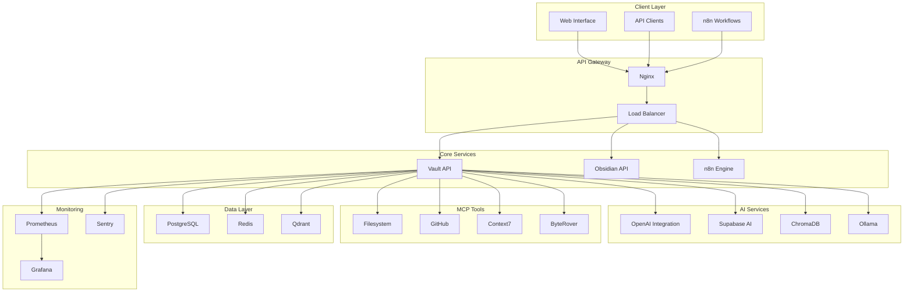
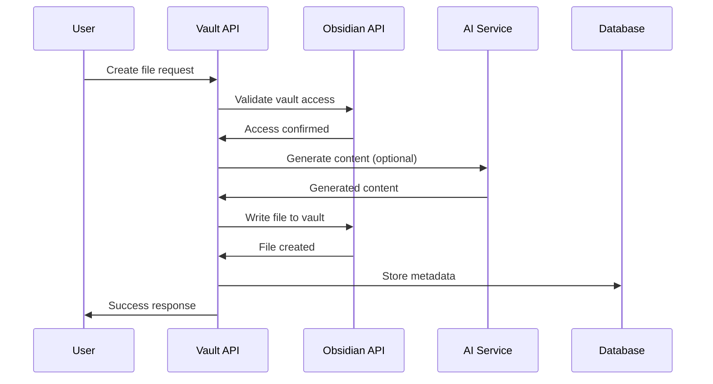
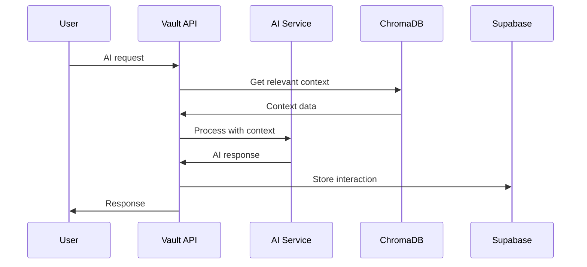
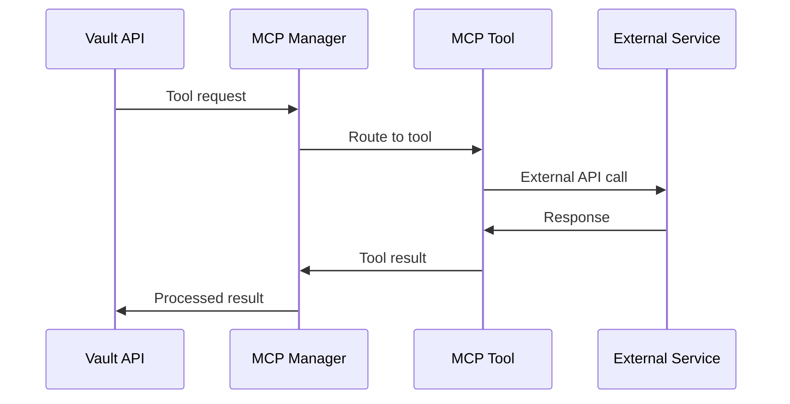

# Concepts Overview

Understanding the core concepts and architecture of the Obsidian Vault AI System.

## System Architecture

The Obsidian Vault AI System is built on a microservices architecture with the following key components:

## Core Concepts

### 1. Vault Operations

The system provides comprehensive operations for managing Obsidian vaults:

- **File Management**: Create, read, update, delete files
- **Search**: Full-text search with advanced filters
- **Metadata**: Extract and manage file metadata
- **Synchronization**: Real-time sync with Obsidian

### 2. AI Integration

Advanced AI capabilities powered by multiple providers:

- **Content Generation**: Create new content based on prompts
- **Analysis**: Analyze existing content for insights
- **RAG (Retrieval Augmented Generation)**: Context-aware responses
- **Embeddings**: Vector representations for semantic search

### 3. MCP (Model Context Protocol)

Integration with external tools and services:

- **Filesystem**: Direct file system operations
- **GitHub**: Repository management and issue tracking
- **Context7**: Advanced context management
- **ByteRover**: Memory and knowledge storage
- **Playwright**: Web automation capabilities

### 4. Workflow Automation

Powerful automation through n8n:

- **Triggers**: Schedule-based and event-driven triggers
- **Actions**: Automated responses to vault changes
- **Integrations**: Connect with external services
- **Monitoring**: Track workflow execution and performance

## Data Flow

### 1. Content Creation Flow

### 2. AI Processing Flow

### 3. MCP Tool Flow

## Key Features

### 1. Real-time Synchronization

- **WebSocket Support**: Real-time updates via WebSocket connections
- **File Watching**: Automatic detection of vault changes
- **Event Streaming**: Stream events to connected clients
- **Conflict Resolution**: Handle concurrent modifications

### 2. Advanced Search

- **Full-text Search**: Search across all vault content
- **Semantic Search**: AI-powered semantic search
- **Filtering**: Advanced filtering by metadata, tags, dates
- **Fuzzy Matching**: Handle typos and variations

### 3. Content Analysis

- **Entity Extraction**: Identify people, places, organizations
- **Topic Modeling**: Discover topics and themes
- **Sentiment Analysis**: Analyze emotional tone
- **Summarization**: Generate content summaries

### 4. Workflow Automation

- **Event Triggers**: Respond to file changes, time events
- **Conditional Logic**: Complex decision trees
- **External Integrations**: Connect with third-party services
- **Error Handling**: Robust error handling and retry logic

## Security Model

### 1. Authentication

- **JWT Tokens**: Secure token-based authentication
- **API Keys**: Alternative authentication method
- **OAuth2**: Support for OAuth2 providers
- **Multi-factor**: Optional MFA support

### 2. Authorization

- **Role-based Access**: Different permission levels
- **Resource Permissions**: Fine-grained access control
- **API Rate Limiting**: Prevent abuse and overload
- **Audit Logging**: Track all access and changes

### 3. Data Protection

- **Encryption at Rest**: Encrypt stored data
- **Encryption in Transit**: HTTPS/TLS for all communication
- **Secure Storage**: Secure credential storage
- **Data Anonymization**: Anonymize sensitive data

## Performance Characteristics

### 1. Scalability

- **Horizontal Scaling**: Scale services independently
- **Load Balancing**: Distribute load across instances
- **Caching**: Multi-level caching for performance
- **Database Optimization**: Optimized queries and indexing

### 2. Reliability

- **Health Checks**: Continuous health monitoring
- **Circuit Breakers**: Prevent cascade failures
- **Retry Logic**: Automatic retry for transient failures
- **Graceful Degradation**: Maintain service during partial failures

### 3. Monitoring

- **Metrics Collection**: Comprehensive metrics via Prometheus
- **Logging**: Structured logging for debugging
- **Tracing**: Distributed tracing for request flow
- **Alerting**: Proactive alerting for issues

## Integration Patterns

### 1. API-First Design

- **RESTful APIs**: Standard HTTP-based APIs
- **OpenAPI Specification**: Complete API documentation
- **SDK Support**: Multiple language SDKs
- **Webhook Support**: Event-driven integrations

### 2. Event-Driven Architecture

- **Event Sourcing**: Store events as the source of truth
- **Event Streaming**: Real-time event processing
- **Event Handlers**: Process events asynchronously
- **Event Replay**: Replay events for debugging

### 3. Microservices Communication

- **Service Discovery**: Automatic service discovery
- **Load Balancing**: Intelligent load distribution
- **Circuit Breakers**: Prevent cascade failures
- **Retry Policies**: Configurable retry strategies

## Development Patterns

### 1. Clean Architecture

- **Separation of Concerns**: Clear layer separation
- **Dependency Injection**: Loose coupling between components
- **Interface Segregation**: Small, focused interfaces
- **Dependency Inversion**: Depend on abstractions

### 2. Test-Driven Development

- **Unit Tests**: Comprehensive unit test coverage
- **Integration Tests**: End-to-end integration testing
- **Performance Tests**: Load and stress testing
- **Security Tests**: Security vulnerability testing

### 3. DevOps Practices

- **Infrastructure as Code**: Declarative infrastructure
- **Continuous Integration**: Automated testing and building
- **Continuous Deployment**: Automated deployment
- **Monitoring**: Comprehensive observability

## Best Practices

### 1. API Design

- **Consistent Naming**: Use consistent naming conventions
- **Versioning**: Proper API versioning strategy
- **Documentation**: Comprehensive API documentation
- **Error Handling**: Consistent error responses

### 2. Data Management

- **Data Validation**: Validate all input data
- **Data Sanitization**: Sanitize data before storage
- **Data Backup**: Regular data backups
- **Data Retention**: Proper data retention policies

### 3. Security

- **Input Validation**: Validate all inputs
- **Output Encoding**: Encode outputs properly
- **Authentication**: Strong authentication mechanisms
- **Authorization**: Principle of least privilege

## Future Roadmap

### 1. Planned Features

- **Multi-vault Support**: Support for multiple vaults
- **Collaborative Editing**: Real-time collaborative editing
- **Advanced Analytics**: Deeper insights and analytics
- **Mobile Support**: Mobile app development

### 2. Performance Improvements

- **Edge Computing**: Deploy to edge locations
- **CDN Integration**: Content delivery network
- **Database Sharding**: Horizontal database scaling
- **Caching Optimization**: Advanced caching strategies

### 3. Integration Expansion

- **More MCP Tools**: Additional MCP tool integrations
- **Cloud Providers**: Native cloud provider integrations
- **Enterprise Features**: Enterprise-grade features
- **Third-party APIs**: More third-party API integrations
