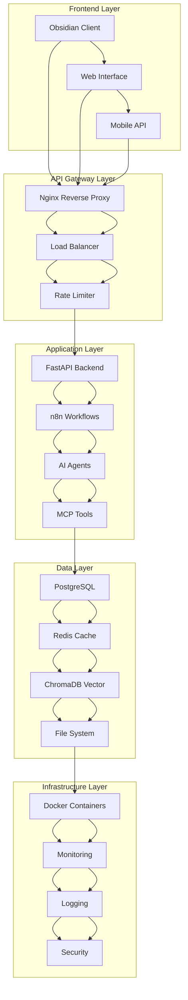
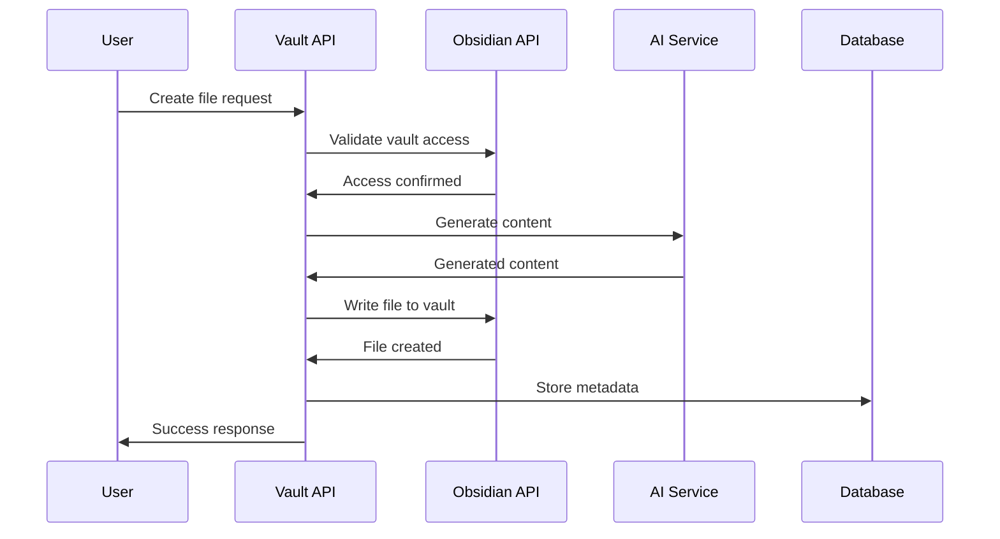
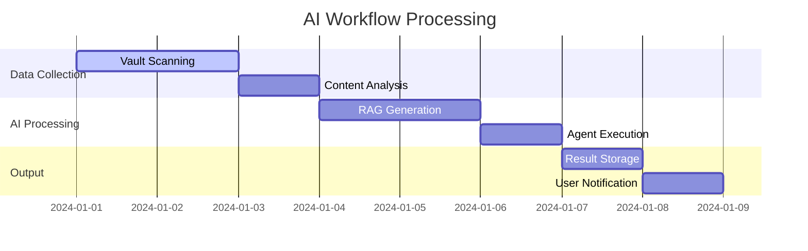

# Enhanced Mermaid Diagrams

This page showcases high-contrast, dark-themed Mermaid diagrams with enhanced visual rendering.

## System Architecture



## Data Flow Sequence



## Workflow Timeline



## Visual Components

### Enhanced Cards
<div class="visual-card">
  <h3>System Status</h3>
  <p>All services are running optimally with enhanced monitoring.</p>
  <div class="visual-status success">✓ Healthy</div>
</div>

### Enhanced Buttons
<button class="visual-button">Enhanced Action</button>

### Enhanced Code Blocks
<div class="visual-code">
```python
def enhanced_function():
    return "High contrast visual rendering"
```
</div>

### Enhanced Tables
<table class="visual-table">
  <thead>
    <tr>
      <th>Service</th>
      <th>Status</th>
      <th>Performance</th>
    </tr>
  </thead>
  <tbody>
    <tr>
      <td>Vault API</td>
      <td><div class="visual-status success">✓ Running</div></td>
      <td><div class="visual-progress"><div class="visual-progress-bar" style="width: 95%"></div></div></td>
    </tr>
    <tr>
      <td>Obsidian API</td>
      <td><div class="visual-status success">✓ Running</div></td>
      <td><div class="visual-progress"><div class="visual-progress-bar" style="width: 88%"></div></div></td>
    </tr>
    <tr>
      <td>n8n Workflows</td>
      <td><div class="visual-status warning">⚠ Processing</div></td>
      <td><div class="visual-progress"><div class="visual-progress-bar" style="width: 72%"></div></div></td>
    </tr>
  </tbody>
</table>
