# Welcome to Obsidian Vault AI Automation System

<div className="hero-banner">
  <div className="hero-content">
    <h1>🚀 Complete Backend Engineering Solution</h1>
    <p className="hero-subtitle">
      AI-Powered Obsidian Vault Automation with Advanced Workflow Orchestration
    </p>
  </div>
</div>

## 🎯 What is This System?

The **Obsidian Vault AI Automation System** is a comprehensive backend engineering solution that seamlessly integrates artificial intelligence agents with your local Obsidian vault, enabling intelligent automation, content processing, and hybrid cloud operations.

### 🌟 Key Features

<div className="feature-grid">
  <div className="feature-card">
    <h3>🤖 AI-Powered Agents</h3>
    <p>Intelligent content curation, knowledge synthesis, and task automation using advanced AI models</p>
  </div>
  <div className="feature-card">
    <h3>🔄 Workflow Orchestration</h3>
    <p>n8n-based automation workflows with human-in-the-loop checkpoints and real-time monitoring</p>
  </div>
  <div className="feature-card">
    <h3>🔍 Semantic Search</h3>
    <p>Vector-based search capabilities powered by ChromaDB for intelligent content discovery</p>
  </div>
  <div className="feature-card">
    <h3>📊 Real-time Monitoring</h3>
    <p>Comprehensive observability with Prometheus, Grafana, and custom AI workflow tracing</p>
  </div>
  <div className="feature-card">
    <h3>🔒 Enterprise Security</h3>
    <p>Multi-layer security framework with JWT authentication, rate limiting, and audit logging</p>
  </div>
  <div className="feature-card">
    <h3>☁️ Hybrid Cloud</h3>
    <p>Local-first architecture with optional cloud synchronization and scaling capabilities</p>
  </div>
</div>

## 🏗️ System Architecture



```mermaid
graph TB
    subgraph "Frontend Layer"
        A[Obsidian Client] --> B[Web Interface]
        B --> C[Mobile API]
    end
    
    subgraph "API Gateway Layer"
        D[Nginx Reverse Proxy] --> E[Load Balancer]
        E --> F[Rate Limiter]
    end
    
    subgraph "Application Layer"
        G[FastAPI Backend] --> H[n8n Workflows]
        H --> I[AI Agents]
        I --> J[MCP Tools]
    end
    
    subgraph "Data Layer"
        K[PostgreSQL] --> L[Redis Cache]
        L --> M[ChromaDB Vector]
        M --> N[File System]
    end
    
    subgraph "Infrastructure Layer"
        O[Docker Containers] --> P[Monitoring]
        P --> Q[Logging]
        Q --> R[Security]
    end
```

## 🚀 Quick Start

Get up and running in minutes:

```bash
# Clone the repository
git clone https://github.com/your-org/obsidian-vault-ai-system.git
cd obsidian-vault-ai-system

# Start the system
./scripts/quick-start.ps1

# Access the API
curl http://localhost:8080/health
```

## 📚 Documentation Structure

Our comprehensive documentation is organized into several key sections:

### 📖 [Getting Started](getting-started/installation)
- Installation and setup guides
- Quick start tutorials
- Configuration options
- First workflow creation

### 🧠 [Core Concepts](concepts/overview)
- AI agents and their capabilities
- Workflow orchestration patterns
- Data flow and processing
- Security and authentication

### 🔧 [API Reference](api/overview)
- Complete REST API documentation
- WebSocket real-time APIs
- MCP (Model Context Protocol) tools
- SDKs for multiple languages

### 🏛️ [Architecture](architecture/overview)
- System design patterns
- Component architecture
- Data flow diagrams
- Integration patterns

### 🚀 [Deployment](deployment/overview)
- Local development setup
- Production deployment guides
- CI/CD pipeline configuration
- Monitoring and observability

## 🎯 Use Cases

### 📝 Content Management
- **Automated Note Organization**: AI agents automatically categorize and tag your notes
- **Content Curation**: Intelligent content discovery and recommendation
- **Knowledge Synthesis**: Extract insights from your vault content

### 🔄 Workflow Automation
- **Daily Note Processing**: Automated daily note creation and analysis
- **Content Pipeline**: End-to-end content processing workflows
- **Integration Workflows**: Connect with external services and APIs

### 🤖 AI-Powered Features
- **Semantic Search**: Find content by meaning, not just keywords
- **Content Generation**: AI-assisted note creation and editing
- **Intelligent Linking**: Automatic suggestion of note connections

### 📊 Monitoring & Analytics
- **Real-time Dashboards**: Monitor system health and performance
- **Usage Analytics**: Track content creation and workflow execution
- **AI Performance Metrics**: Monitor AI agent effectiveness

## 🛠️ Technology Stack

<div className="tech-stack">
  <div className="tech-category">
    <h4>Backend</h4>
    <ul>
      <li>Python 3.11+ (FastAPI, Pydantic, SQLAlchemy)</li>
      <li>Node.js 18+ (Express.js, n8n workflows)</li>
      <li>TypeScript (Type safety for JavaScript)</li>
    </ul>
  </div>
  
  <div className="tech-category">
    <h4>Databases</h4>
    <ul>
      <li>PostgreSQL 15 (Relational data)</li>
      <li>Redis 7 (Cache and sessions)</li>
      <li>ChromaDB (Vector database)</li>
      <li>SQLite (Local storage)</li>
    </ul>
  </div>
  
  <div className="tech-category">
    <h4>AI/ML</h4>
    <ul>
      <li>OpenAI GPT-4 (Language processing)</li>
      <li>Anthropic Claude (Advanced analysis)</li>
      <li>Ollama (Local models)</li>
      <li>LangChain (AI framework)</li>
    </ul>
  </div>
  
  <div className="tech-category">
    <h4>Infrastructure</h4>
    <ul>
      <li>Docker (Containerization)</li>
      <li>Nginx (Reverse proxy)</li>
      <li>Prometheus (Metrics)</li>
      <li>Grafana (Dashboards)</li>
    </ul>
  </div>
</div>

## 🌟 Why Choose This System?

### ✅ **Production Ready**
- Comprehensive testing suite
- CI/CD pipeline integration
- Performance optimization
- Security best practices

### ✅ **Extensible Architecture**
- Plugin-based system
- Custom AI agent development
- Flexible workflow creation
- API-first design

### ✅ **Local-First Approach**
- Data sovereignty
- Privacy protection
- Offline capabilities
- Hybrid cloud options

### ✅ **Enterprise Features**
- Multi-user support
- Role-based access control
- Audit logging
- Monitoring and alerting

## 🤝 Contributing

We welcome contributions! Please see our [Contributing Guide](development/contributing) for details on how to:

- Report bugs and request features
- Submit code changes
- Improve documentation
- Join our community

## 📞 Support

- **GitHub Issues**: [Report bugs and request features](https://github.com/your-org/obsidian-vault-ai-system/issues)
- **Discord**: [Join our community](https://discord.gg/your-discord)
- **Documentation**: [Browse our guides](intro)
- **Email**: [Contact support](mailto:support@your-domain.com)

## 📄 License

This project is licensed under the MIT License - see the [LICENSE](https://github.com/your-org/obsidian-vault-ai-system/blob/main/LICENSE) file for details.

---

<div className="cta-section">
  <h2>Ready to Get Started?</h2>
  <p>Jump into our documentation and start building amazing AI-powered workflows!</p>
  <div className="cta-buttons">
    <a className="button button--primary button--lg" href="getting-started/installation">
      🚀 Installation Guide
    </a>
    <a className="button button--secondary button--lg" href="api/overview">
      📚 API Reference
    </a>
  </div>
</div>