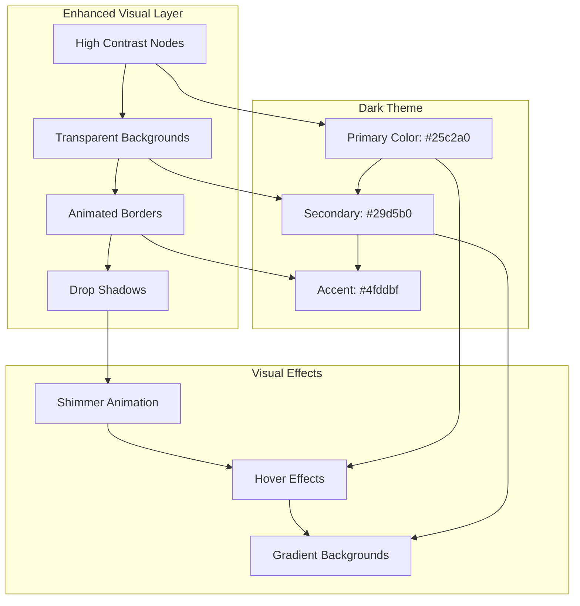

# Visual Enhancement Test

## Mermaid Diagram Test

## Visual Components Test

### Enhanced Cards

  <h3>🎨 Visual Enhancement Test</h3>
  
Testing high contrast dark theme with transparent rendering.

  
✓ Enhanced Rendering Active

### Enhanced Buttons
<button class="visual-button">Test Visual Button</button>

### Enhanced Progress

  

### Enhanced Table
<table class="visual-table">
  <thead>
    <tr>
      <th>Component</th>
      <th>Status</th>
      <th>Performance</th>
    </tr>
  </thead>
  <tbody>
    <tr>
      <td>Mermaid Diagrams</td>
      <td>
✓ Enhanced
</td>
      <td>

</td>
    </tr>
    <tr>
      <td>Dark Theme</td>
      <td>
✓ Active
</td>
      <td>

</td>
    </tr>
    <tr>
      <td>High Contrast</td>
      <td>
✓ Optimized
</td>
      <td>

</td>
    </tr>
    <tr>
      <td>Transparency</td>
      <td>
⚠ Testing
</td>
      <td>

</td>
    </tr>
  </tbody>
</table>

## Color Palette Test

  

    <strong>Primary</strong> #25c2a0
  

  

    <strong>Secondary</strong> #29d5b0
  

  

    <strong>Accent</strong> #4fddbf
  

  

    <strong>Background</strong> #1a1a1a
  

## Animation Test

  

  Loading enhanced visual components...

## Responsive Test

  

    <h4>Mobile</h4>
    
Responsive design optimized for mobile devices.

  

  

    <h4>Tablet</h4>
    
Enhanced layout for tablet viewing experience.

  

  

    <h4>Desktop</h4>
    
Full-featured desktop experience with all enhancements.

  

