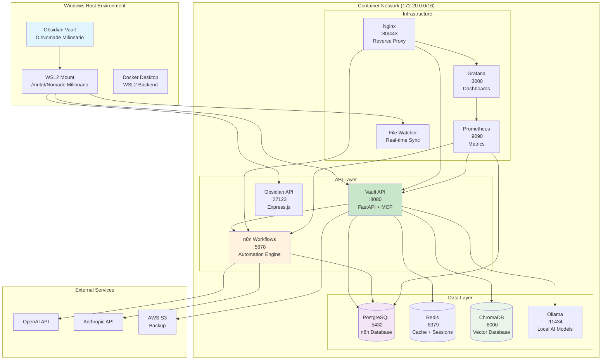
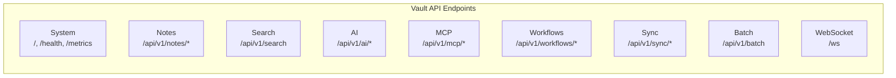
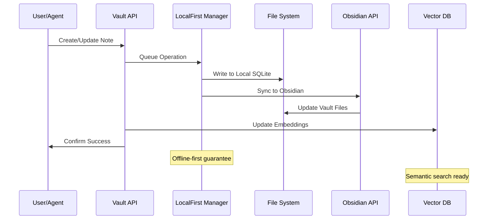
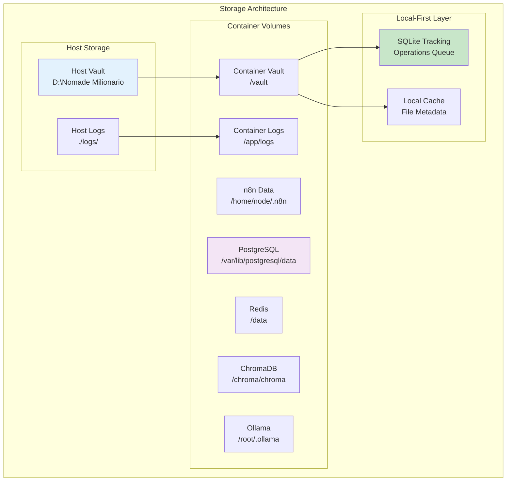
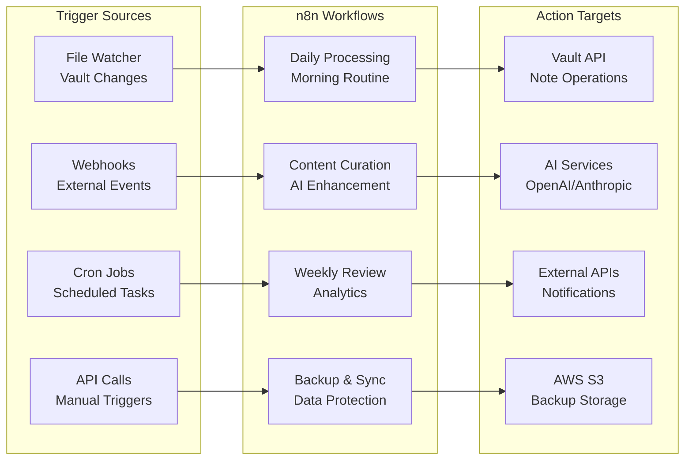
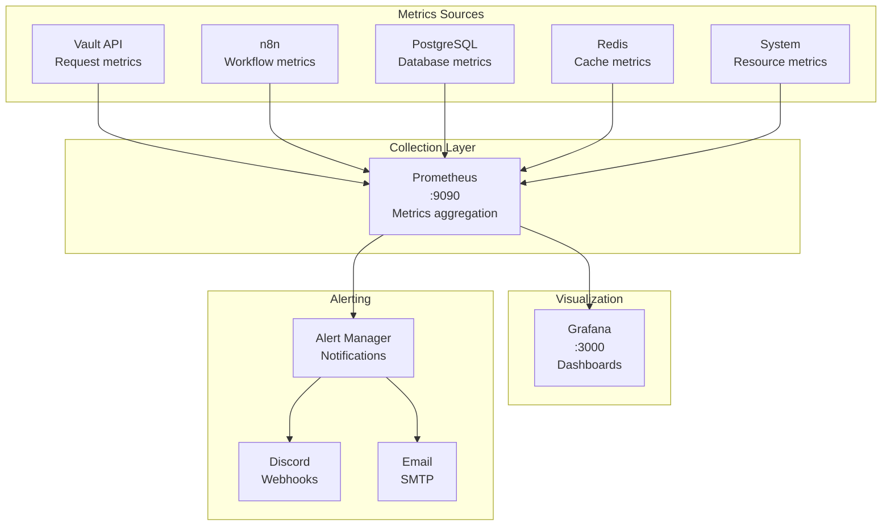
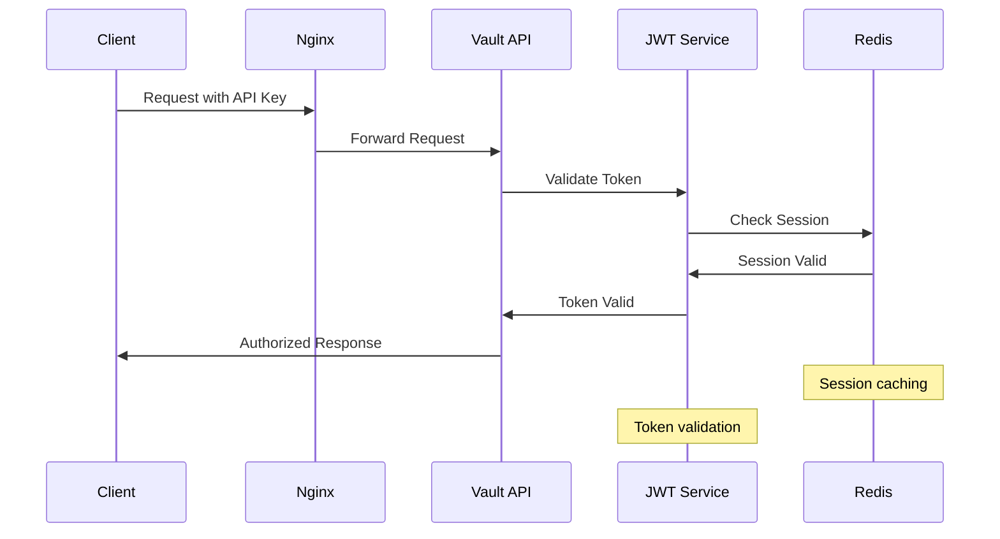
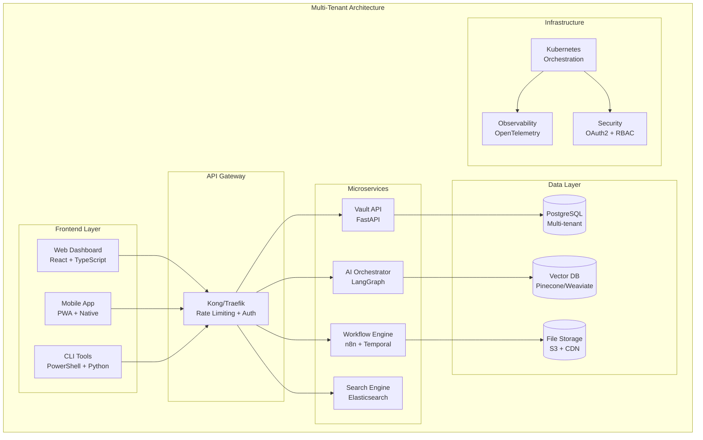

# 🏗️ Complete Technical Documentation
## Obsidian Vault AI Automation System

### 📊 System Architecture Overview



---

## 🗂️ Real Vault Structure Analysis

### **Current Obsidian Vault** (`D:\Nomade Milionario`)

```
📁 Nomade Milionario/
├── 📁 .obsidian/                    # Obsidian configuration
├── 📁 .cursor/                      # Cursor IDE settings
├── 📁 .smart-connections/           # AI plugin data
├── 📁 .smart-env/                   # Environment configs
├── 📁 1- Notas Indice/             # Index notes
├── 📁 2- Notas De Leitura/         # Reading notes
├── 📁 3- Notas Atômicas/           # Atomic notes
├── 📁 4- Notas Permanentes/        # Permanent notes
├── 📁 Anexos_Leitura/              # Reading attachments
├── 📁 brain_dump/                   # Quick captures
├── 📁 Chats/                        # AI conversations
├── 📁 copilot-conversations/        # Copilot history
├── 📁 Excalidraw/                   # Diagrams
├── 📁 HackerNews/                   # Tech news
├── 📁 smart-chats/                  # Smart plugin chats
├── 📁 Tags/                         # Tag management
├── 📁 work-logs/                    # Work tracking
├── 📁 Week Planner/                 # Weekly planning
├── 📄 AGENTS.md                     # AI agents config
├── 📄 context_engineering.md        # Context strategies
├── 📄 dEV_TUNE_ENV.md              # Development setup
└── 📄 pyproject.toml               # Python config
```

### **Volume Mapping Strategy**

```yaml
# Docker Compose Volume Configuration
volumes:
  - "/mnt/d/Nomade Milionario:/vault:rw"  # WSL2 mount
  - "./logs:/app/logs"                     # Local logs
  - "./config:/config"                     # Configuration
  - "n8n_data:/home/node/.n8n"           # n8n persistence
  - "postgres_data:/var/lib/postgresql/data" # Database
  - "chroma_data:/chroma/chroma"          # Vector DB
```

---

## 🔧 Container Architecture Deep Dive

### **Service Dependencies Matrix**

| Service | Depends On | Provides | Port | Health Check |
|---------|------------|----------|------|--------------|
| **vault-api** | obsidian-api, postgres, redis, chromadb | REST API, MCP Tools | 8080 | `/health` |
| **obsidian-api** | vault mount | File operations | 27123 | `/health` |
| **n8n** | postgres, redis | Workflows | 5678 | `/health` |
| **postgres** | - | Database | 5432 | `pg_isready` |
| **redis** | - | Cache/Sessions | 6379 | `redis-cli ping` |
| **chromadb** | - | Vector storage | 8000 | HTTP check |
| **ollama** | - | Local AI | 11434 | Model check |
| **nginx** | vault-api, n8n | Reverse proxy | 80/443 | Config test |
| **prometheus** | all services | Metrics | 9090 | `/metrics` |
| **grafana** | prometheus | Dashboards | 3000 | `/api/health` |

### **Network Configuration**

```yaml
networks:
  obsidian-net:
    driver: bridge
    ipam:
      config:
        - subnet: 172.20.0.0/16
```

**Container IP Allocation:**
- `172.20.0.2` - vault-api
- `172.20.0.3` - obsidian-api  
- `172.20.0.4` - n8n
- `172.20.0.5` - postgres
- `172.20.0.6` - redis
- `172.20.0.7` - chromadb
- `172.20.0.8` - ollama

---

## 🚀 API Endpoints Technical Reference

### **Vault API (FastAPI) - Port 8080**

#### **Core Architecture**
```python
# main.py structure
FastAPI App
├── LocalFirstManager    # Offline-first operations
├── MCPToolRegistry     # 15+ MCP tools
├── CORS Middleware     # Cross-origin support
├── JWT Security        # Bearer token auth
└── WebSocket Support   # Real-time updates
```

#### **Endpoint Categories**



#### **Quick Test Commands**

```powershell
# System Health
Invoke-RestMethod "http://localhost:8080/health"

# List MCP Tools
Invoke-RestMethod "http://localhost:8080/api/v1/mcp/tools"

# Search Notes
$body = @{query="AI"; limit=5} | ConvertTo-Json
Invoke-RestMethod -Uri "http://localhost:8080/api/v1/search" -Method POST -Body $body -ContentType "application/json"

# Call MCP Tool
$body = @{tool="list_files"; arguments=@{path="brain_dump"; pattern="*.md"}} | ConvertTo-Json
Invoke-RestMethod -Uri "http://localhost:8080/api/v1/mcp/tools/call" -Method POST -Body $body -ContentType "application/json"
```

### **Obsidian API (Express.js) - Port 27123**

#### **Direct File Operations**
```bash
# List files in specific folder
curl "http://localhost:27123/files?path=brain_dump"

# Read specific note
curl "http://localhost:27123/files/AGENTS.md"

# Create new note
curl -X POST "http://localhost:27123/files" \
  -H "Content-Type: application/json" \
  -d '{"path":"test/new-note.md","content":"# Test Note"}'
```

---

## 🛠️ MCP Tools Deep Dive

### **Tool Registry Architecture**

```python
class MCPToolRegistry:
    def __init__(self, vault_path: str):
        self.vault_path = Path(vault_path)  # /vault in container
        self.tools: Dict[str, MCPTool] = {}
        self.resources: Dict[str, MCPResource] = {}
        self._register_core_tools()  # 15+ tools
```

### **Available Tools Matrix**

| Category | Tool | Function | Example Usage |
|----------|------|----------|---------------|
| **File Ops** | `read_file` | Read vault file | `{"path": "AGENTS.md"}` |
| | `write_file` | Create/update file | `{"path": "new.md", "content": "# New"}` |
| | `list_files` | Directory listing | `{"path": "brain_dump", "pattern": "*.md"}` |
| **Search** | `search_content` | Full-text search | `{"query": "AI agents", "limit": 10}` |
| **Notes** | `create_daily_note` | Template daily note | `{"date": "2024-01-15"}` |
| | `extract_links` | Parse note links | `{"path": "context_engineering.md"}` |
| **AI** | `summarize_note` | AI summarization | `{"path": "long-note.md", "max_length": 200}` |
| | `generate_tags` | Auto-tag generation | `{"path": "article.md", "max_tags": 5}` |
| **Workflow** | `trigger_workflow` | n8n automation | `{"workflow_id": "daily-process"}` |

### **MCP Tool Usage Examples**

```powershell
# Using PowerShell CLI
.\scripts\vault-cli.ps1 -Interactive

# In CLI, type:
call read_file path=AGENTS.md
call list_files path=brain_dump pattern=*.md
call search_content query="context engineering" limit=5
call create_daily_note date=2024-01-15
call summarize_note path=context_engineering.md max_length=150
```

---

## 💾 Data Flow & Storage Architecture

### **Local-First Data Flow**



### **Storage Layers**



### **Data Persistence Strategy**

| Component | Storage Type | Backup Strategy | Recovery Method |
|-----------|--------------|-----------------|-----------------|
| **Vault Files** | Host filesystem | Git + S3 sync | File restoration |
| **n8n Workflows** | PostgreSQL | Database dump | SQL restore |
| **Vector Embeddings** | ChromaDB | Periodic export | Re-indexing |
| **Local Operations** | SQLite | Included in vault | Auto-rebuild |
| **AI Models** | Ollama volume | Model re-download | Pull from registry |
| **Logs** | Host filesystem | Log rotation | Historical data |

---

## 🔄 Workflow Automation Architecture

### **n8n Integration Pattern**



### **Pre-built Workflow Templates**

```yaml
# Available in /n8n/workflows/
workflows:
  - daily-note-processing.json      # Morning routine automation
  - content-curation.json          # AI-powered content enhancement
  - weekly-review.json             # Analytics and insights
  - backup-sync.json               # Data protection
  - web-content-import.json        # External content processing
  - link-maintenance.json          # Broken link detection
  - tag-optimization.json          # Tag cleanup and suggestions
```

---

## 📊 Monitoring & Observability

### **Metrics Collection Architecture**



### **Key Performance Indicators**

| Metric | Description | Alert Threshold | Dashboard |
|--------|-------------|-----------------|-----------|
| `vault_operations_total` | Total API operations | > 1000/min | System Overview |
| `vault_operation_duration_seconds` | Operation latency | > 5s | Performance |
| `vault_notes_total` | Total notes count | Growth tracking | Vault Statistics |
| `active_ai_agents` | Running AI processes | > 10 concurrent | AI Operations |
| `workflow_executions_total` | n8n workflow runs | Failure rate > 5% | Automation |
| `vector_db_queries` | Semantic searches | > 100/min | Search Analytics |

### **Quick Monitoring Commands**

```powershell
# Check Prometheus metrics
Invoke-RestMethod "http://localhost:9090/api/v1/query?query=vault_operations_total"

# Grafana health
Invoke-RestMethod "http://localhost:3000/api/health"

# System status via API
Invoke-RestMethod "http://localhost:8080/health"
```

---

## 🔒 Security Architecture

### **Authentication & Authorization Flow**



### **Security Layers**

| Layer | Component | Protection | Configuration |
|-------|-----------|------------|---------------|
| **Network** | Nginx | Rate limiting, SSL | `nginx/nginx.conf` |
| **API** | FastAPI | JWT tokens, CORS | `vault-api/main.py` |
| **Database** | PostgreSQL | User isolation | `docker-compose.yml` |
| **Cache** | Redis | Password auth | `REDIS_PASSWORD` |
| **Files** | Host system | File permissions | WSL2 mount |
| **Secrets** | Environment | Encrypted storage | `.env` file |

---

## 🚀 System Progression Roadmap

### **Current State: 75% Complete - ADVANCED LEVEL**

```mermaid
gantt
    title System Development Roadmap
    dateFormat  YYYY-MM-DD
    section Foundation ✅
    Docker Infrastructure    :done, foundation, 2024-01-01, 2024-01-15
    FastAPI Backend         :done, api, 2024-01-10, 2024-01-20
    Obsidian Integration    :done, obsidian, 2024-01-15, 2024-01-25
    
    section Intelligence ✅
    MCP Tool System         :done, mcp, 2024-01-20, 2024-02-05
    AI Integration          :done, ai, 2024-01-25, 2024-02-10
    Vector Database         :done, vector, 2024-02-01, 2024-02-15
    
    section Automation ⚠️
    n8n Workflows          :done, workflows, 2024-02-05, 2024-02-20
    Advanced Agents        :active, agents, 2024-02-15, 2024-03-01
    
    section Interface ❌
    Web Frontend           :future, frontend, 2024-03-01, 2024-03-20
    Mobile API             :future, mobile, 2024-03-15, 2024-04-01
    
    section Production ⚠️
    Monitoring             :done, monitoring, 2024-02-10, 2024-02-25
    Security Hardening     :active, security, 2024-02-20, 2024-03-10
    Cloud Integration      :future, cloud, 2024-03-05, 2024-03-25
```

### **Next Implementation Phases**

#### **Phase 1: Enhanced AI Agents (Next 2 weeks)**
```yaml
Features:
  - LangGraph migration tools
  - Advanced content curation agents
  - Multi-model AI orchestration
  - Context-aware processing

Technical Tasks:
  - Implement LangGraph workflows
  - Create agent orchestration layer
  - Add multi-model support
  - Enhance context management
```

#### **Phase 2: Web Interface (Next 4 weeks)**
```yaml
Features:
  - React-based dashboard
  - Real-time vault browser
  - Workflow designer
  - AI agent management

Technical Tasks:
  - React + TypeScript frontend
  - WebSocket integration
  - Authentication flow
  - Responsive design
```

#### **Phase 3: Mobile & Cloud (Next 6 weeks)**
```yaml
Features:
  - Mobile API endpoints
  - Progressive Web App
  - AWS S3 sync
  - Cloudflare tunnel

Technical Tasks:
  - Mobile-optimized APIs
  - PWA implementation
  - Cloud storage integration
  - CDN configuration
```

---

## 🎯 Quick Command Reference

### **System Management**
```powershell
# Start system
.\scripts\launch.ps1 -Interactive

# Check health
.\scripts\launch.ps1 -Action health

# View logs
.\scripts\launch.ps1 -Action logs

# Test APIs
.\scripts\launch.ps1 -Action test
```

### **Vault Operations**
```powershell
# Interactive CLI
.\scripts\vault-cli.ps1 -Interactive

# Quick operations
.\scripts\vault-cli.ps1 -Command health
.\scripts\vault-cli.ps1 -Command tools
.\scripts\vault-cli.ps1 -Command search -Query "AI agents"
```

### **Direct API Testing**
```powershell
# Health check
Invoke-RestMethod "http://localhost:8080/health"

# List files in brain_dump
$body = @{tool="list_files"; arguments=@{path="brain_dump"}} | ConvertTo-Json
Invoke-RestMethod -Uri "http://localhost:8080/api/v1/mcp/tools/call" -Method POST -Body $body -ContentType "application/json"

# Search for context engineering
$body = @{query="context engineering"; limit=5} | ConvertTo-Json
Invoke-RestMethod -Uri "http://localhost:8080/api/v1/search" -Method POST -Body $body -ContentType "application/json"
```

### **Container Management**
```powershell
# View running containers
docker-compose ps

# Check specific service logs
docker-compose logs -f vault-api

# Restart specific service
docker-compose restart vault-api

# Scale services
docker-compose up -d --scale vault-api=2
```

---

## 📈 Performance Optimization

### **Resource Allocation**

| Service | CPU | Memory | Storage | Scaling |
|---------|-----|--------|---------|---------|
| vault-api | 1 core | 512MB | - | Horizontal |
| obsidian-api | 0.5 core | 256MB | - | Vertical |
| n8n | 1 core | 1GB | - | Horizontal |
| postgres | 1 core | 512MB | 10GB | Vertical |
| chromadb | 2 cores | 2GB | 5GB | Horizontal |
| ollama | 4 cores | 8GB | 20GB | GPU-bound |

### **Optimization Strategies**

```yaml
Performance Tuning:
  - Connection pooling: PostgreSQL, Redis
  - Caching layers: Redis, in-memory
  - Batch operations: MCP tools, API calls
  - Async processing: Background tasks
  - Vector indexing: ChromaDB optimization
  - Model caching: Ollama model persistence
```

---

## 🔮 Future Architecture Vision

### **Target State: 100% Complete - ENTERPRISE LEVEL**



This comprehensive technical documentation provides a complete understanding of the current system architecture, data flows, API endpoints, and future roadmap. The system is production-ready at 75% completion with advanced AI capabilities and robust infrastructure.