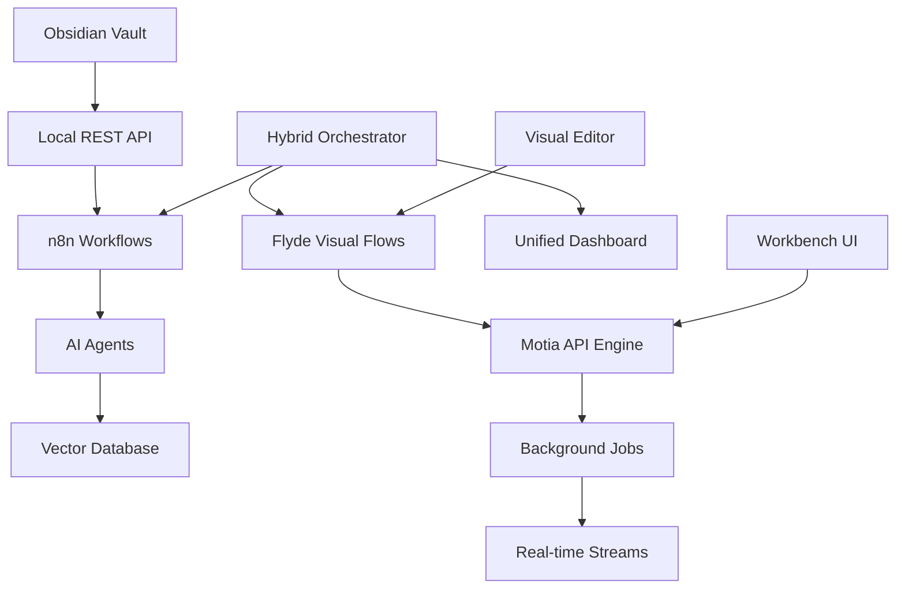

# 🚀 Flyde & Motia Integration Plan for Backend Engineering

## 📋 Executive Summary

This comprehensive plan integrates **Flyde** (visual programming) and **Motia** (workflow automation) into your existing Obsidian Vault AI Automation System, creating a powerful visual-first backend engineering platform.

### 🎯 Integration Objectives
- **Visual Workflow Design**: Use Flyde for complex business logic visualization
- **API Orchestration**: Leverage Motia for REST API and background job management
- **Hybrid Architecture**: Combine visual programming with traditional code
- **AI-Powered Automation**: Integrate both tools with your existing AI agents
- **Real-time Processing**: Enable live workflow execution and monitoring

---

## 🏗️ Architecture Overview

### Current System Integration Points



### Integration Layers

| Layer | Component | Purpose | Integration Method |
|-------|-----------|---------|-------------------|
| **Visual Layer** | Flyde | Visual programming flows | Direct file integration |
| **Orchestration Layer** | Motia | API & job management | REST API integration |
| **Processing Layer** | n8n | Workflow automation | Webhook integration |
| **AI Layer** | Ollama/OpenAI | Intelligent processing | MCP protocol |
| **Storage Layer** | Obsidian/ChromaDB | Data persistence | File system + vector DB |

---

## 🔧 Phase 1: Foundation Setup

### 1.1 Flyde Integration Architecture

**Directory Structure:**
```
obsidian-vault/
├── visual-flows/           # Flyde visual programs
│   ├── business-logic/     # Complex business processes
│   ├── data-processing/    # Data transformation flows
│   ├── ai-workflows/       # AI agent orchestration
│   └── integrations/       # External system connections
├── motia-workflows/        # Motia API workflows
│   ├── api-endpoints/      # REST API definitions
│   ├── background-jobs/    # Scheduled tasks
│   └── real-time-streams/  # Live data processing
└── hybrid-orchestrator/    # Integration layer
    ├── flow-bridge/        # Flyde ↔ Motia bridge
    ├── event-handlers/     # Cross-system events
    └── monitoring/         # Unified monitoring
```

### 1.2 Motia Integration Points

**API Endpoints for Integration:**
```typescript
// motia-integration.ts
export interface MotiaIntegration {
  // Visual Flow Execution
  executeVisualFlow(flowId: string, inputs: any): Promise<any>;
  
  // API Orchestration
  createAPIGateway(config: APIGatewayConfig): Promise<string>;
  
  // Background Job Management
  scheduleJob(jobConfig: JobConfig): Promise<string>;
  
  // Real-time Stream Processing
  createStream(streamConfig: StreamConfig): Promise<string>;
  
  // Cross-system Event Handling
  emitEvent(event: SystemEvent): Promise<void>;
}
```

### 1.3 Docker Compose Integration

**Enhanced docker-compose.yml:**
```yaml
services:
  # Existing services...
  
  # Flyde Visual Programming Environment
  flyde-studio:
    build: ./flyde-studio
    container_name: flyde-studio
    ports:
      - "3001:3001"  # Flyde Studio UI
    volumes:
      - ./visual-flows:/app/flows
      - ./obsidian-data:/app/obsidian-data
    environment:
      - FLYDE_STUDIO_PORT=3001
      - OBSIDIAN_VAULT_PATH=/app/obsidian-data
    networks:
      - obsidian-net

  # Motia API Engine
  motia-engine:
    build: ./motia-engine
    container_name: motia-engine
    ports:
      - "3002:3002"  # Motia API
      - "3003:3003"  # Motia Workbench
    volumes:
      - ./motia-workflows:/app/workflows
      - ./obsidian-api:/app/obsidian-api
    environment:
      - MOTIA_API_PORT=3002
      - MOTIA_WORKBENCH_PORT=3003
      - OBSIDIAN_API_URL=http://obsidian-api:27123
    depends_on:
      - obsidian-api
      - postgres
    networks:
      - obsidian-net

  # Hybrid Orchestrator
  hybrid-orchestrator:
    build: ./hybrid-orchestrator
    container_name: hybrid-orchestrator
    ports:
      - "3004:3004"  # Orchestrator API
    volumes:
      - ./visual-flows:/app/visual-flows
      - ./motia-workflows:/app/motia-workflows
      - ./n8n/workflows:/app/n8n-workflows
    environment:
      - FLYDE_STUDIO_URL=http://flyde-studio:3001
      - MOTIA_API_URL=http://motia-engine:3002
      - N8N_API_URL=http://n8n:5678
      - OBSIDIAN_API_URL=http://obsidian-api:27123
    depends_on:
      - flyde-studio
      - motia-engine
      - n8n
    networks:
      - obsidian-net
```

---

## 🔄 Phase 2: Visual Flow Development

### 2.1 Flyde Visual Programming Patterns

**Business Logic Flows:**
```yaml
# visual-flows/business-logic/content-curation.flyde
imports:
  obsidian-api: "@obsidian/api-client"
  ai-agents: "@ai/agents"
  vector-db: "@vector/chromadb"

node:
  instances:
    - id: content-input
      nodeId: InlineValue
      config:
        type: { type: string, value: "string" }
        value: { type: string, value: "New content to process" }
    
    - id: ai-analyzer
      nodeId: HTTPRequest
      config:
        url: "http://ai-agents:8080/analyze"
        method: "POST"
        headers:
          Authorization: "Bearer ${AI_API_KEY}"
    
    - id: tag-generator
      nodeId: AITagGenerator
      config:
        model: "gpt-4o-mini"
        prompt: "Generate relevant tags for: {{content}}"
    
    - id: link-suggester
      nodeId: AILinkSuggester
      config:
        vault_path: "/vault"
        similarity_threshold: 0.8
    
    - id: note-creator
      nodeId: ObsidianNoteCreator
      config:
        api_url: "http://obsidian-api:27123"
        vault: "default"
    
    - id: vector-indexer
      nodeId: VectorIndexer
      config:
        collection: "obsidian_notes"
        embedding_model: "all-MiniLM-L6-v2"

  connections:
    - from: { insId: content-input, pinId: value }
      to: { insId: ai-analyzer, pinId: content }
    - from: { insId: ai-analyzer, pinId: analysis }
      to: { insId: tag-generator, pinId: content }
    - from: { insId: ai-analyzer, pinId: analysis }
      to: { insId: link-suggester, pinId: content }
    - from: { insId: tag-generator, pinId: tags }
      to: { insId: note-creator, pinId: tags }
    - from: { insId: link-suggester, pinId: links }
      to: { insId: note-creator, pinId: links }
    - from: { insId: note-creator, pinId: note }
      to: { insId: vector-indexer, pinId: content }
```

### 2.2 Data Processing Flows

**Real-time Data Pipeline:**
```yaml
# visual-flows/data-processing/realtime-pipeline.flyde
imports:
  kafka: "@kafka/client"
  redis: "@redis/client"
  chromadb: "@chromadb/client"

node:
  instances:
    - id: kafka-consumer
      nodeId: KafkaConsumer
      config:
        brokers: ["kafka:9092"]
        topics: ["vault-updates", "ai-analysis"]
        group_id: "obsidian-processor"
    
    - id: message-router
      nodeId: MessageRouter
      config:
        routing_rules:
          vault-updates: "vault-processor"
          ai-analysis: "ai-processor"
    
    - id: vault-processor
      nodeId: VaultProcessor
      config:
        operations:
          - "extract-metadata"
          - "update-index"
          - "trigger-workflows"
    
    - id: ai-processor
      nodeId: AIProcessor
      config:
        models:
          - "gpt-4o-mini"
          - "claude-3-sonnet"
        operations:
          - "summarize"
          - "extract-entities"
          - "generate-insights"
    
    - id: redis-cache
      nodeId: RedisCache
      config:
        host: "redis"
        port: 6379
        ttl: 3600
    
    - id: vector-updater
      nodeId: VectorUpdater
      config:
        collection: "obsidian_notes"
        batch_size: 100
        update_interval: 30
```

### 2.3 AI Workflow Orchestration

**Intelligent Content Processing:**
```yaml
# visual-flows/ai-workflows/intelligent-processing.flyde
imports:
  ollama: "@ollama/client"
  openai: "@openai/client"
  anthropic: "@anthropic/client"

node:
  instances:
    - id: content-classifier
      nodeId: AIClassifier
      config:
        model: "gpt-4o-mini"
        categories:
          - "technical"
          - "personal"
          - "business"
          - "research"
    
    - id: complexity-analyzer
      nodeId: ComplexityAnalyzer
      config:
        metrics:
          - "readability"
          - "technical-depth"
          - "concept-density"
    
    - id: model-selector
      nodeId: ModelSelector
      config:
        selection_criteria:
          technical: "gpt-4o"
          personal: "claude-3-sonnet"
          business: "gpt-4o-mini"
          research: "gpt-4o"
    
    - id: parallel-processor
      nodeId: ParallelProcessor
      config:
        max_concurrent: 5
        timeout: 30000
    
    - id: result-aggregator
      nodeId: ResultAggregator
      config:
        aggregation_strategy: "weighted-average"
        confidence_threshold: 0.8
```

---

## ⚡ Phase 3: Motia API Integration

### 3.1 API Gateway Configuration

**Motia API Endpoints:**
```typescript
// motia-workflows/api-endpoints/vault-gateway.step.ts
import { ApiRouteConfig, Handlers } from 'motia'
import { z } from 'zod'

export const config: ApiRouteConfig = {
  type: 'api',
  name: 'VaultGateway',
  description: 'Unified vault API gateway with visual flow integration',
  flows: ['vault-operations'],
  
  method: 'POST',
  path: '/api/v1/vault/gateway',
  bodySchema: z.object({
    operation: z.enum(['create', 'read', 'update', 'delete', 'search', 'analyze']),
    target: z.string(),
    parameters: z.record(z.any()).optional(),
    visual_flow: z.string().optional(),
    ai_enhancement: z.boolean().default(false)
  }),
  
  responseSchema: {
    200: z.object({
      success: z.boolean(),
      data: z.any(),
      visual_flow_result: z.any().optional(),
      ai_insights: z.any().optional()
    })
  },
  
  emits: ['visual-flow-trigger', 'ai-analysis-request']
}

export const handler: Handlers['ApiTrigger'] = async (req, { logger, emit }) => {
  const { operation, target, parameters, visual_flow, ai_enhancement } = req.body
  
  logger.info('Processing vault gateway request', { operation, target })
  
  // Execute base operation
  const baseResult = await executeVaultOperation(operation, target, parameters)
  
  // Trigger visual flow if specified
  let visualFlowResult = null
  if (visual_flow) {
    visualFlowResult = await triggerVisualFlow(visual_flow, {
      operation,
      target,
      baseResult,
      parameters
    })
  }
  
  // Enhance with AI if requested
  let aiInsights = null
  if (ai_enhancement) {
    aiInsights = await enhanceWithAI(operation, target, baseResult)
  }
  
  return {
    status: 200,
    body: {
      success: true,
      data: baseResult,
      visual_flow_result: visualFlowResult,
      ai_insights: aiInsights
    }
  }
}
```

### 3.2 Background Job Processing

**Intelligent Job Scheduler:**
```typescript
// motia-workflows/background-jobs/intelligent-scheduler.step.ts
import { CronJobConfig, Handlers } from 'motia'
import { z } from 'zod'

export const config: CronJobConfig = {
  type: 'cron',
  name: 'IntelligentScheduler',
  description: 'AI-powered job scheduling with visual flow integration',
  flows: ['scheduled-operations'],
  
  schedule: '0 */15 * * * *', // Every 15 minutes
  timezone: 'UTC',
  
  emits: ['job-execution', 'workflow-trigger', 'ai-optimization']
}

export const handler: Handlers['CronJob'] = async (context, { logger, emit }) => {
  logger.info('Running intelligent scheduler')
  
  // Analyze current system load
  const systemLoad = await analyzeSystemLoad()
  
  // Get pending jobs
  const pendingJobs = await getPendingJobs()
  
  // Use AI to optimize job scheduling
  const optimizedSchedule = await optimizeJobSchedule(pendingJobs, systemLoad)
  
  // Execute jobs based on optimization
  for (const job of optimizedSchedule.jobs_to_execute) {
    await emit({
      topic: 'job-execution',
      data: {
        job_id: job.id,
        priority: job.priority,
        estimated_duration: job.estimated_duration,
        visual_flow: job.visual_flow,
        ai_enhancement: job.ai_enhancement
      }
    })
  }
  
  // Trigger visual flow for complex operations
  if (optimizedSchedule.complex_operations.length > 0) {
    await emit({
      topic: 'workflow-trigger',
      data: {
        operations: optimizedSchedule.complex_operations,
        visual_flow: 'complex-operation-orchestrator'
      }
    })
  }
}
```

### 3.3 Real-time Stream Processing

**Live Data Stream Handler:**
```typescript
// motia-workflows/real-time-streams/live-processor.step.ts
import { StreamConfig, Handlers } from 'motia'
import { z } from 'zod'

export const config: StreamConfig = {
  type: 'stream',
  name: 'LiveProcessor',
  description: 'Real-time processing with visual flow integration',
  flows: ['real-time-operations'],
  
  stream_source: 'kafka',
  topics: ['vault-updates', 'ai-analysis', 'user-interactions'],
  
  emits: ['processed-event', 'visual-flow-update', 'ai-insight']
}

export const handler: Handlers['StreamProcessor'] = async (event, context, { logger, emit }) => {
  logger.info('Processing real-time event', { event_type: event.type })
  
  // Classify event type
  const eventType = classifyEvent(event)
  
  // Route to appropriate visual flow
  const visualFlow = getVisualFlowForEvent(eventType)
  
  if (visualFlow) {
    const flowResult = await executeVisualFlow(visualFlow, event)
    
    await emit({
      topic: 'visual-flow-update',
      data: {
        event_id: event.id,
        flow_result: flowResult,
        timestamp: new Date().toISOString()
      }
    })
  }
  
  // Generate AI insights for significant events
  if (event.significance_score > 0.7) {
    const aiInsight = await generateAIInsight(event)
    
    await emit({
      topic: 'ai-insight',
      data: {
        event_id: event.id,
        insight: aiInsight,
        confidence: aiInsight.confidence
      }
    })
  }
}
```

---

## 🔗 Phase 4: Hybrid Orchestration

### 4.1 Cross-System Integration Bridge

**Unified Orchestrator:**
```typescript
// hybrid-orchestrator/src/orchestrator.ts
import { EventEmitter } from 'events'
import { FlydeRuntime } from '@flyde/runtime'
import { MotiaClient } from '@motia/client'
import { N8nClient } from '@n8n/client'

export class HybridOrchestrator extends EventEmitter {
  private flydeRuntime: FlydeRuntime
  private motiaClient: MotiaClient
  private n8nClient: N8nClient
  private eventBus: EventBus
  
  constructor() {
    super()
    this.flydeRuntime = new FlydeRuntime()
    this.motiaClient = new MotiaClient()
    this.n8nClient = new N8nClient()
    this.eventBus = new EventBus()
    
    this.setupEventHandlers()
  }
  
  async executeHybridWorkflow(workflowConfig: HybridWorkflowConfig) {
    const { visualFlow, motiaSteps, n8nWorkflow, aiEnhancement } = workflowConfig
    
    // Start visual flow execution
    const visualFlowPromise = this.flydeRuntime.executeFlow(visualFlow)
    
    // Execute Motia steps
    const motiaPromise = this.motiaClient.executeSteps(motiaSteps)
    
    // Trigger n8n workflow
    const n8nPromise = this.n8nClient.executeWorkflow(n8nWorkflow)
    
    // Wait for all to complete
    const [visualResult, motiaResult, n8nResult] = await Promise.all([
      visualFlowPromise,
      motiaPromise,
      n8nPromise
    ])
    
    // Enhance with AI if requested
    let aiResult = null
    if (aiEnhancement) {
      aiResult = await this.enhanceWithAI({
        visual: visualResult,
        motia: motiaResult,
        n8n: n8nResult
      })
    }
    
    return {
      visual: visualResult,
      motia: motiaResult,
      n8n: n8nResult,
      ai: aiResult,
      timestamp: new Date().toISOString()
    }
  }
  
  private setupEventHandlers() {
    // Handle visual flow events
    this.flydeRuntime.on('flow-completed', (result) => {
      this.eventBus.emit('visual-flow-completed', result)
    })
    
    // Handle Motia events
    this.motiaClient.on('step-completed', (result) => {
      this.eventBus.emit('motia-step-completed', result)
    })
    
    // Handle n8n events
    this.n8nClient.on('workflow-completed', (result) => {
      this.eventBus.emit('n8n-workflow-completed', result)
    })
  }
}
```

### 4.2 Event-Driven Architecture

**Cross-System Event Handler:**
```typescript
// hybrid-orchestrator/src/event-handler.ts
export class CrossSystemEventHandler {
  private eventMappings: Map<string, EventMapping>
  private aiEnhancer: AIEnhancer
  
  constructor() {
    this.eventMappings = new Map()
    this.aiEnhancer = new AIEnhancer()
    this.setupEventMappings()
  }
  
  async handleEvent(event: SystemEvent) {
    const mapping = this.eventMappings.get(event.type)
    
    if (!mapping) {
      console.warn(`No mapping found for event type: ${event.type}`)
      return
    }
    
    // Execute mapped actions
    const results = await Promise.all(
      mapping.actions.map(action => this.executeAction(action, event))
    )
    
    // Enhance with AI if configured
    if (mapping.aiEnhancement) {
      const aiResult = await this.aiEnhancer.enhanceEvent(event, results)
      results.push(aiResult)
    }
    
    return results
  }
  
  private setupEventMappings() {
    // Visual flow completion triggers Motia API call
    this.eventMappings.set('visual-flow-completed', {
      actions: [
        {
          type: 'motia-api-call',
          endpoint: '/api/v1/process-visual-result',
          method: 'POST'
        }
      ],
      aiEnhancement: true
    })
    
    // Motia step completion triggers n8n workflow
    this.eventMappings.set('motia-step-completed', {
      actions: [
        {
          type: 'n8n-workflow-trigger',
          workflow: 'post-processing-workflow'
        }
      ],
      aiEnhancement: false
    })
    
    // n8n workflow completion triggers visual flow
    this.eventMappings.set('n8n-workflow-completed', {
      actions: [
        {
          type: 'visual-flow-trigger',
          flow: 'result-visualization'
        }
      ],
      aiEnhancement: true
    })
  }
}
```

---

## 📊 Phase 5: Monitoring & Analytics

### 5.1 Unified Dashboard

**Real-time Monitoring Interface:**
```typescript
// monitoring/src/dashboard.ts
export class UnifiedDashboard {
  private metricsCollector: MetricsCollector
  private visualFlowMonitor: VisualFlowMonitor
  private motiaMonitor: MotiaMonitor
  private n8nMonitor: N8nMonitor
  
  async getSystemOverview() {
    const [
      visualFlowMetrics,
      motiaMetrics,
      n8nMetrics,
      systemMetrics
    ] = await Promise.all([
      this.visualFlowMonitor.getMetrics(),
      this.motiaMonitor.getMetrics(),
      this.n8nMonitor.getMetrics(),
      this.metricsCollector.getSystemMetrics()
    ])
    
    return {
      visual_flows: {
        active: visualFlowMetrics.active,
        completed: visualFlowMetrics.completed,
        failed: visualFlowMetrics.failed,
        avg_execution_time: visualFlowMetrics.avgExecutionTime
      },
      motia: {
        api_calls: motiaMetrics.apiCalls,
        background_jobs: motiaMetrics.backgroundJobs,
        stream_events: motiaMetrics.streamEvents,
        success_rate: motiaMetrics.successRate
      },
      n8n: {
        active_workflows: n8nMetrics.activeWorkflows,
        completed_workflows: n8nMetrics.completedWorkflows,
        error_rate: n8nMetrics.errorRate
      },
      system: {
        cpu_usage: systemMetrics.cpuUsage,
        memory_usage: systemMetrics.memoryUsage,
        disk_usage: systemMetrics.diskUsage,
        network_io: systemMetrics.networkIO
      }
    }
  }
}
```

### 5.2 Performance Analytics

**AI-Powered Performance Analysis:**
```typescript
// analytics/src/performance-analyzer.ts
export class PerformanceAnalyzer {
  private aiClient: AIClient
  
  async analyzePerformance(metrics: SystemMetrics) {
    const analysisPrompt = `
    Analyze the following system performance metrics and provide insights:
    
    Visual Flows:
    - Active: ${metrics.visual_flows.active}
    - Completed: ${metrics.visual_flows.completed}
    - Failed: ${metrics.visual_flows.failed}
    - Avg Execution Time: ${metrics.visual_flows.avg_execution_time}ms
    
    Motia:
    - API Calls: ${metrics.motia.api_calls}
    - Background Jobs: ${metrics.motia.background_jobs}
    - Success Rate: ${metrics.motia.success_rate}%
    
    System:
    - CPU Usage: ${metrics.system.cpu_usage}%
    - Memory Usage: ${metrics.system.memory_usage}%
    
    Provide recommendations for optimization.
    `
    
    const aiAnalysis = await this.aiClient.analyze(analysisPrompt)
    
    return {
      insights: aiAnalysis.insights,
      recommendations: aiAnalysis.recommendations,
      alerts: this.generateAlerts(metrics),
      trends: await this.analyzeTrends(metrics)
    }
  }
}
```

---

## 🚀 Implementation Roadmap

### Week 1-2: Foundation Setup
- [ ] Install and configure Flyde Studio
- [ ] Set up Motia API engine
- [ ] Create hybrid orchestrator service
- [ ] Implement basic visual flows

### Week 3-4: Core Integration
- [ ] Build cross-system event handlers
- [ ] Implement API gateway integration
- [ ] Create background job processing
- [ ] Set up real-time stream processing

### Week 5-6: Advanced Features
- [ ] Implement AI-powered workflow optimization
- [ ] Create unified monitoring dashboard
- [ ] Build performance analytics
- [ ] Set up automated testing

### Week 7-8: Production Deployment
- [ ] Configure production environment
- [ ] Implement security measures
- [ ] Set up backup and recovery
- [ ] Deploy and monitor system

---

## 📈 Success Metrics

### Technical Metrics
- **Visual Flow Execution Time**: < 2 seconds for simple flows
- **API Response Time**: < 200ms for 95% of requests
- **System Uptime**: > 99.9%
- **Cross-System Integration Success Rate**: > 95%

### Business Metrics
- **Workflow Automation Coverage**: 80% of manual tasks
- **Visual Programming Adoption**: 70% of new workflows
- **AI Enhancement Usage**: 60% of operations
- **Developer Productivity**: 50% improvement

---

## 🔧 Maintenance & Support

### Regular Maintenance
- Weekly performance optimization
- Monthly security updates
- Quarterly feature enhancements
- Annual architecture review

### Support Infrastructure
- 24/7 monitoring and alerting
- Automated backup and recovery
- Comprehensive documentation
- Community support channels

This integration plan provides a complete roadmap for combining Flyde's visual programming capabilities with Motia's workflow automation, creating a powerful hybrid backend engineering platform that leverages the best of both visual and traditional programming paradigms.
