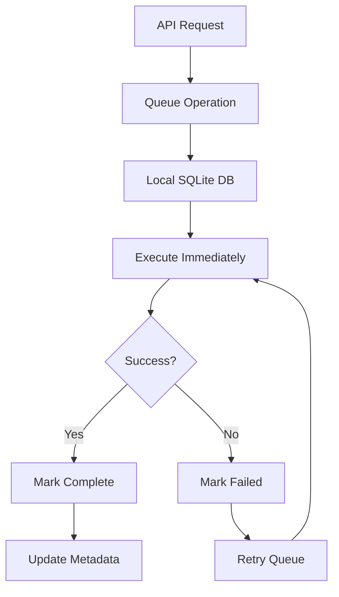

# Local-First Architecture Implementation

## Overview
This document outlines the local-first architecture implementation for the Obsidian Vault AI automation system, ensuring data sovereignty, offline capabilities, and seamless synchronization.

## Core Principles

### 1. Data Sovereignty
- **Local Storage**: All data remains on local filesystem
- **No Cloud Dependencies**: System operates without internet connectivity
- **User Control**: Complete control over data location and access
- **Privacy First**: No data leaves local environment without explicit consent

### 2. Offline-First Operations
- **Local Processing**: All operations work offline
- **Background Sync**: Synchronization happens in background when available
- **Conflict Resolution**: Automatic handling of sync conflicts
- **Graceful Degradation**: Reduced functionality when services unavailable

### 3. Eventual Consistency
- **Operation Queuing**: All operations queued locally first
- **Retry Logic**: Failed operations automatically retried
- **State Reconciliation**: Periodic state synchronization
- **Conflict Detection**: Automatic detection and resolution of conflicts

## Architecture Components

### Local-First Manager
```python
class LocalFirstManager:
    """
    Core component managing local-first operations
    - Operation queuing and execution
    - File metadata tracking
    - Synchronization status
    - Conflict resolution
    """
```

#### Key Features:
- **SQLite Database**: Local operation and metadata storage
- **Async Operations**: Non-blocking operation execution
- **Retry Mechanism**: Automatic retry with exponential backoff
- **Health Monitoring**: Continuous system health checks

### Operation Queue System

#### Operation Types:
1. **create_note** - Create new note in vault
2. **update_note** - Update existing note content
3. **delete_note** - Remove note from vault
4. **move_note** - Move/rename note
5. **batch_operation** - Multiple operations atomically

#### Operation Flow:


### File Metadata Tracking

#### Metadata Schema:
```sql
CREATE TABLE file_metadata (
    path TEXT PRIMARY KEY,
    hash TEXT NOT NULL,
    size INTEGER NOT NULL,
    modified TEXT NOT NULL,
    synced TEXT,
    conflict_resolution TEXT,
    backup_path TEXT
);
```

#### Tracked Information:
- **Content Hash**: MD5 hash for change detection
- **File Size**: Size in bytes
- **Modified Time**: Last modification timestamp
- **Sync Status**: Last successful sync timestamp
- **Conflict Info**: Conflict resolution metadata
- **Backup Path**: Location of backup copies

## Implementation Details

### Database Schema

#### Operations Table:
```sql
CREATE TABLE operations (
    id TEXT PRIMARY KEY,
    operation TEXT NOT NULL,
    data TEXT NOT NULL,
    timestamp TEXT NOT NULL,
    status TEXT DEFAULT 'pending',
    retry_count INTEGER DEFAULT 0,
    error_message TEXT,
    execution_time REAL
);
```

#### Sync Log Table:
```sql
CREATE TABLE sync_log (
    id INTEGER PRIMARY KEY AUTOINCREMENT,
    timestamp TEXT NOT NULL,
    operation_type TEXT NOT NULL,
    file_path TEXT,
    status TEXT NOT NULL,
    details TEXT
);
```

### Conflict Resolution Strategies

#### 1. Last Writer Wins
```python
async def resolve_last_writer_wins(local_file, remote_file):
    """Simple conflict resolution based on modification time"""
    if local_file.modified > remote_file.modified:
        return local_file
    else:
        return remote_file
```

#### 2. Content Merge
```python
async def resolve_content_merge(local_content, remote_content, base_content):
    """Three-way merge for text content"""
    # Implement diff3 algorithm
    merged_content = diff3_merge(local_content, base_content, remote_content)
    return merged_content
```

#### 3. User Choice
```python
async def resolve_user_choice(local_file, remote_file):
    """Present conflict to user for manual resolution"""
    conflict_data = {
        "local": local_file,
        "remote": remote_file,
        "timestamp": datetime.now().isoformat()
    }
    # Store conflict for user resolution
    await store_conflict(conflict_data)
```

### Backup and Recovery

#### Automatic Backups:
- **Pre-operation Backup**: Backup before any modification
- **Periodic Snapshots**: Regular vault snapshots
- **Incremental Backups**: Only changed files backed up
- **Retention Policy**: Configurable backup retention

#### Recovery Procedures:
```python
async def recover_from_backup(backup_timestamp: str):
    """Recover vault from specific backup"""
    backup_path = get_backup_path(backup_timestamp)
    
    # Validate backup integrity
    if not validate_backup(backup_path):
        raise BackupCorruptError("Backup validation failed")
    
    # Restore files
    await restore_files(backup_path)
    
    # Update metadata
    await update_recovery_metadata(backup_timestamp)
```

## API Integration

### Local-First Endpoints

#### Operation Status:
```http
GET /api/v1/sync/status
```

**Response:**
```json
{
  "local_first": {
    "operations": {
      "pending": 0,
      "completed": 156,
      "failed": 2
    },
    "files": {
      "total": 1247,
      "synced": 1245,
      "unsynced": 2,
      "conflicts": 0
    },
    "vault_path": "/mnt/d/Nomade Milionario",
    "last_check": "2024-01-15T12:00:00Z"
  }
}
```

#### Retry Failed Operations:
```http
POST /api/v1/sync/retry
```

#### Force Sync:
```http
POST /api/v1/sync/force
```

### WebSocket Real-time Updates

#### Connection:
```javascript
const ws = new WebSocket('ws://localhost:8080/ws');

ws.onmessage = (event) => {
  const update = JSON.parse(event.data);
  
  switch(update.type) {
    case 'sync_status':
      updateSyncStatus(update.data);
      break;
    case 'operation_complete':
      handleOperationComplete(update.data);
      break;
    case 'conflict_detected':
      handleConflict(update.data);
      break;
  }
};
```

## Performance Optimizations

### 1. Batch Operations
```python
async def batch_execute(operations: List[LocalOperation]):
    """Execute multiple operations efficiently"""
    
    # Group operations by type
    grouped_ops = group_by_type(operations)
    
    # Execute in optimal order
    for op_type, ops in grouped_ops.items():
        if op_type == "create_note":
            await batch_create_notes(ops)
        elif op_type == "update_note":
            await batch_update_notes(ops)
```

### 2. Incremental Sync
```python
async def incremental_sync():
    """Sync only changed files"""
    
    # Get files modified since last sync
    last_sync = await get_last_sync_time()
    changed_files = await get_changed_files(since=last_sync)
    
    # Sync only changed files
    for file_path in changed_files:
        await sync_file(file_path)
```

### 3. Parallel Processing
```python
async def parallel_file_processing(file_paths: List[str]):
    """Process multiple files in parallel"""
    
    semaphore = asyncio.Semaphore(10)  # Limit concurrent operations
    
    async def process_file(file_path):
        async with semaphore:
            return await process_single_file(file_path)
    
    tasks = [process_file(path) for path in file_paths]
    results = await asyncio.gather(*tasks, return_exceptions=True)
    
    return results
```

## Monitoring and Observability

### Metrics Collection:
- **Operation Latency**: Time to complete operations
- **Queue Depth**: Number of pending operations
- **Sync Success Rate**: Percentage of successful syncs
- **Conflict Rate**: Number of conflicts per sync
- **Storage Usage**: Local storage consumption

### Health Checks:
```python
async def health_check():
    """Comprehensive health check"""
    
    checks = {
        "vault_accessible": await check_vault_access(),
        "database_healthy": await check_database_health(),
        "queue_processing": await check_queue_processing(),
        "disk_space": await check_disk_space(),
        "backup_status": await check_backup_status()
    }
    
    overall_health = all(checks.values())
    
    return {
        "healthy": overall_health,
        "checks": checks,
        "timestamp": datetime.now().isoformat()
    }
```

### Logging Strategy:
```python
import structlog

logger = structlog.get_logger()

# Operation logging
logger.info(
    "operation_executed",
    operation_id=op_id,
    operation_type=op_type,
    file_path=file_path,
    duration=execution_time,
    success=success
)

# Sync logging
logger.info(
    "sync_completed",
    files_synced=files_count,
    conflicts_resolved=conflicts_count,
    duration=sync_duration
)
```

## Configuration

### Environment Variables:
```bash
# Local-first settings
LOCAL_FIRST_ENABLED=true
VAULT_PATH=/mnt/d/Nomade Milionario
CACHE_DIR=./cache
BACKUP_DIR=./backups

# Database settings
SQLITE_DB_PATH=./cache/local_operations.db
SQLITE_WAL_MODE=true

# Sync settings
SYNC_INTERVAL=300
MAX_RETRY_ATTEMPTS=5
RETRY_BACKOFF_FACTOR=2

# Backup settings
BACKUP_ENABLED=true
BACKUP_INTERVAL=3600
BACKUP_RETENTION_DAYS=30
```

### Configuration File:
```yaml
# local_first_config.yaml
local_first:
  enabled: true
  vault_path: "/mnt/d/Nomade Milionario"
  cache_dir: "./cache"
  
database:
  path: "./cache/local_operations.db"
  wal_mode: true
  timeout: 30
  
sync:
  interval: 300
  max_retries: 5
  backoff_factor: 2
  conflict_resolution: "last_writer_wins"
  
backup:
  enabled: true
  interval: 3600
  retention_days: 30
  compression: "gzip"
  
monitoring:
  metrics_enabled: true
  health_check_interval: 60
  log_level: "INFO"
```

## Security Considerations

### Data Protection:
- **Encryption at Rest**: Optional encryption for sensitive data
- **Access Control**: File system permissions
- **Audit Logging**: Complete operation audit trail
- **Secure Deletion**: Secure file deletion for sensitive content

### Backup Security:
```python
async def create_encrypted_backup(vault_path: str, encryption_key: str):
    """Create encrypted backup of vault"""
    
    # Create temporary archive
    archive_path = await create_archive(vault_path)
    
    # Encrypt archive
    encrypted_path = await encrypt_file(archive_path, encryption_key)
    
    # Store encrypted backup
    backup_path = await store_backup(encrypted_path)
    
    # Clean up temporary files
    await cleanup_temp_files([archive_path, encrypted_path])
    
    return backup_path
```

This local-first architecture ensures that the Obsidian Vault AI automation system maintains data sovereignty while providing robust offline capabilities and seamless synchronization when connectivity is available.