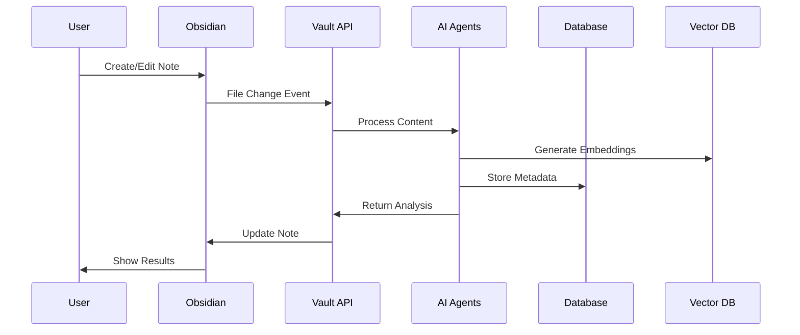

# 📚 Main Documentation Index - Backend Server Application

## 🎯 **System Overview**

**Obsidian Vault AI Automation System** - Uma solução completa de engenharia backend que integra agentes de IA n8n com seu vault Obsidian local, permitindo automação inteligente, processamento de conteúdo e operações híbridas na nuvem.

---

## 🏗️ **1. Arquitetura de Sistema**

### 📋 **1.1 Design Patterns Implementados**

#### **Padrões Arquiteturais**
- **🏛️ Clean Architecture**: Separação clara de responsabilidades entre camadas
- **🔄 Microservices Pattern**: Componentes independentes com responsabilidades específicas
- **🎯 Event-Driven Architecture**: Comunicação assíncrona via eventos e webhooks
- **🔌 Plugin Architecture**: Sistema extensível de plugins e integrações

#### **Padrões de Código**
- **🏭 Factory Pattern**: Criação de scrapers e agentes de IA
- **🎭 Strategy Pattern**: Diferentes estratégias de processamento de conteúdo
- **👁️ Observer Pattern**: Sistema de monitoramento e notificações
- **🔧 Builder Pattern**: Construção de workflows complexos

### 📊 **1.2 Diagramas de Arquitetura**

#### **Arquitetura Geral do Sistema**

```mermaid
graph TB
    subgraph "Frontend Layer"
        A[Obsidian Client] --> B[Web Interface]
        B --> C[Mobile API]
    end
    
    subgraph "API Gateway Layer"
        D[Nginx Reverse Proxy] --> E[Load Balancer]
        E --> F[Rate Limiter]
    end
    
    subgraph "Application Layer"
        G[FastAPI Backend] --> H[n8n Workflows]
        H --> I[AI Agents]
        I --> J[MCP Tools]
    end
    
    subgraph "Data Layer"
        K[PostgreSQL] --> L[Redis Cache]
        L --> M[ChromaDB Vector]
        M --> N[File System]
    end
    
    subgraph "Infrastructure Layer"
        O[Docker Containers] --> P[Monitoring]
        P --> Q[Logging]
        Q --> R[Security]
    end
```


#### **Fluxo de Dados Detalhado**


### 🔧 **1.3 Componentes Principais**

| Componente | Tecnologia | Porta | Responsabilidade | Status |
|------------|------------|-------|------------------|--------|
| **Vault API** | FastAPI + Python | 8080 | API REST principal | ✅ |
| **Obsidian API** | Express.js + Node | 27123 | Interface com Obsidian | ✅ |
| **n8n Engine** | Node.js | 5678 | Automação de workflows | ✅ |
| **AI Orchestrator** | Python + LangChain | 8081 | Coordenação de IA | ✅ |
| **Vector Database** | ChromaDB | 8000 | Busca semântica | ✅ |
| **Cache Layer** | Redis | 6379 | Cache e sessões | ✅ |
| **Database** | PostgreSQL | 5432 | Dados estruturados | ✅ |
| **Monitoring** | Prometheus/Grafana | 9090/3000 | Observabilidade | ✅ |

---

## 🧠 **2. Inteligência Artificial e Agentes**

### 🤖 **2.1 Arquitetura de Agentes IA**

#### **Agentes Implementados**
```python
# Estrutura base dos agentes
class BaseAgent:
    def __init__(self, model: str, tools: List[str]):
        self.model = model
        self.tools = tools
        self.memory = ConversationMemory()
    
    async def process(self, content: str) -> AgentResponse:
        # Implementação específica do agente
        pass
```

#### **Tipos de Agentes**
1. **📝 Content Curator Agent**
   - **Modelo**: GPT-4o-mini
   - **Ferramentas**: Text analysis, tagging, linking
   - **Função**: Curadoria automática de conteúdo

2. **🔍 Knowledge Synthesizer Agent**
   - **Modelo**: Claude-3-Sonnet
   - **Ferramentas**: Semantic search, clustering
   - **Função**: Síntese de conhecimento

3. **⚡ Task Master Agent**
   - **Modelo**: Ollama Llama3
   - **Ferramentas**: MCP tools, automation
   - **Função**: Automação de tarefas

### 🛠️ **2.2 MCP (Model Context Protocol) Tools**

#### **Ferramentas Registradas (15+)**
```json
{
  "core_tools": [
    "filesystem_operations",
    "web_scraping",
    "database_queries",
    "api_requests"
  ],
  "ai_tools": [
    "text_generation",
    "summarization",
    "translation",
    "sentiment_analysis"
  ],
  "specialized_tools": [
    "obsidian_operations",
    "vector_search",
    "workflow_automation",
    "monitoring_alerts"
  ]
}
```

---

## 🔄 **3. Workflows e Automação**

### 📋 **3.1 n8n Workflow Engine**

#### **Workflows Pré-configurados**
1. **📅 Daily Note Processing**
   ```json
   {
     "trigger": "cron:0 6 * * *",
     "actions": [
       "create_daily_note",
       "analyze_previous_day",
       "generate_insights"
     ]
   }
   ```

2. **🔄 Content Curation Pipeline**
   ```json
   {
     "trigger": "file_change_webhook",
     "actions": [
       "extract_content",
       "ai_analysis",
       "tag_generation",
       "link_suggestions"
     ]
   }
   ```

### ⚙️ **3.2 Pipeline de Desenvolvimento**

#### **CI/CD Pipeline**
```yaml
# .github/workflows/deploy.yml
name: Deploy Backend
on:
  push:
    branches: [main]
jobs:
  test:
    runs-on: ubuntu-latest
    steps:
      - uses: actions/checkout@v3
      - name: Run Tests
        run: pytest tests/
  deploy:
    needs: test
    runs-on: ubuntu-latest
    steps:
      - name: Deploy to Production
        run: docker-compose up -d
```

---

## 📊 **4. API e Endpoints**

### 🌐 **4.1 REST API Specification**

#### **Vault Operations**
```python
# FastAPI endpoint examples
@app.post("/api/v1/notes")
async def create_note(note: NoteCreate) -> NoteResponse:
    """Criar nova nota no vault"""
    pass

@app.get("/api/v1/notes/{path}")
async def get_note(path: str) -> NoteContent:
    """Obter conteúdo da nota"""
    pass

@app.post("/api/v1/search")
async def search_notes(query: SearchQuery) -> SearchResults:
    """Busca semântica nas notas"""
    pass
```

#### **AI Operations**
```python
@app.post("/api/v1/ai/analyze")
async def analyze_content(content: ContentInput) -> AnalysisResult:
    """Análise de conteúdo com IA"""
    pass

@app.post("/api/v1/ai/generate")
async def generate_content(prompt: GenerationPrompt) -> GeneratedContent:
    """Geração de conteúdo"""
    pass
```

### 📱 **4.2 OpenAPI Integration**

#### **Configuração do Plugin Obsidian**
```json
{
  "openapi_renderer": {
    "enabled": true,
    "base_url": "http://localhost:8080",
    "auth_type": "bearer",
    "interactive_testing": true
  }
}
```

---

## 💾 **5. Camadas de Dados**

### 🗄️ **5.1 Arquitetura Local-First**

#### **Estratégia de Armazenamento**
```python
class DataLayer:
    def __init__(self):
        self.local_db = SQLiteDatabase()
        self.vector_db = ChromaDB()
        self.cache = RedisCache()
        self.filesystem = VaultFileSystem()
    
    async def sync_strategy(self) -> SyncResult:
        # Implementa sincronização híbrida
        pass
```

### 🔍 **5.2 Vector Database (ChromaDB)**

#### **Configuração de Embeddings**
```python
# Configuração do ChromaDB
collection = client.create_collection(
    name="obsidian_notes",
    embedding_function=OpenAIEmbeddingFunction(
        api_key="your_api_key",
        model_name="text-embedding-ada-002"
    )
)
```

---

## 🔒 **6. Segurança e Autenticação**

### 🛡️ **6.1 Framework de Segurança**

#### **Autenticação Multi-Camada**
```python
class SecurityFramework:
    def __init__(self):
        self.jwt_handler = JWTHandler()
        self.api_key_manager = APIKeyManager()
        self.rate_limiter = RateLimiter()
        self.audit_logger = AuditLogger()
    
    async def authenticate(self, request: Request) -> User:
        # Implementação de autenticação
        pass
```

#### **Configurações de Segurança**
```yaml
security:
  jwt:
    secret_key: "${JWT_SECRET}"
    algorithm: "HS256"
    expire_minutes: 30
  rate_limiting:
    requests_per_minute: 100
    burst_limit: 20
  encryption:
    algorithm: "AES-256-GCM"
```

---

## 📈 **7. Monitoramento e Observabilidade**

### 📊 **7.1 Métricas e Dashboards**

#### **Prometheus Metrics**
```python
# Métricas customizadas
vault_operations_total = Counter(
    'vault_operations_total',
    'Total vault operations',
    ['operation_type', 'status']
)

ai_processing_duration = Histogram(
    'ai_processing_duration_seconds',
    'AI processing time'
)
```

#### **Grafana Dashboards**
- **System Overview**: CPU, Memory, Disk usage
- **API Performance**: Request rates, latency, errors
- **AI Metrics**: Processing times, model usage
- **Business Metrics**: Note creation, user activity

### 🔍 **7.2 Logging Estruturado**

#### **Configuração de Logs**
```python
import structlog

logger = structlog.get_logger("vault-api")

# Exemplo de log estruturado
logger.info(
    "note_created",
    user_id=user.id,
    note_path=note.path,
    content_length=len(note.content),
    processing_time=elapsed_time
)
```

---

## 🚀 **8. Deploy e DevOps**

### 🐳 **8.1 Containerização**

#### **Docker Compose Architecture**
```yaml
version: '3.8'
services:
  vault-api:
    build: ./vault-api
    ports:
      - "8080:8080"
    environment:
      - DATABASE_URL=${DATABASE_URL}
    depends_on:
      - postgres
      - redis
  
  n8n:
    image: n8nio/n8n
    ports:
      - "5678:5678"
    volumes:
      - n8n_data:/home/node/.n8n
```

### ☁️ **8.2 Cloud Integration**

#### **Hybrid Cloud Strategy**
```python
class CloudSync:
    def __init__(self):
        self.s3_client = boto3.client('s3')
        self.cloudflare_tunnel = CloudflareTunnel()
    
    async def sync_to_cloud(self, data: Any) -> SyncResult:
        # Implementação de sincronização
        pass
```

---

## 🧪 **9. Testes e Qualidade**

### 🔬 **9.1 Estratégia de Testes**

#### **Pirâmide de Testes**
```python
# Testes unitários
class TestVaultAPI:
    async def test_create_note(self):
        # Teste de criação de nota
        pass

# Testes de integração
class TestAIIntegration:
    async def test_content_analysis(self):
        # Teste de análise de conteúdo
        pass

# Testes end-to-end
class TestWorkflows:
    async def test_complete_workflow(self):
        # Teste de workflow completo
        pass
```

### 📊 **9.2 Code Quality**

#### **Ferramentas de Qualidade**
```yaml
# .pre-commit-config.yaml
repos:
  - repo: https://github.com/psf/black
    hooks:
      - id: black
  - repo: https://github.com/pycqa/flake8
    hooks:
      - id: flake8
  - repo: https://github.com/pycqa/mypy
    hooks:
      - id: mypy
```

---

## 📚 **10. Documentação Técnica**

### 📖 **10.1 Guias de Desenvolvimento**

#### **Estrutura de Documentação**
```
docs/
├── api/
│   ├── endpoints.md
│   ├── authentication.md
│   └── examples.md
├── architecture/
│   ├── system-design.md
│   ├── data-flow.md
│   └── security.md
├── deployment/
│   ├── local-setup.md
│   ├── production.md
│   └── cloud-deployment.md
└── development/
    ├── contributing.md
    ├── coding-standards.md
    └── testing-guide.md
```

### 🎯 **10.2 Regras de Negócio**

#### **Core Business Rules**
1. **Data Sovereignty**: Todos os dados permanecem locais por padrão
2. **AI Privacy**: Processamento de IA respeitando privacidade
3. **Extensibility**: Sistema deve ser facilmente extensível
4. **Performance**: Resposta < 200ms para operações básicas
5. **Reliability**: 99.9% uptime para serviços críticos

---

## 🔄 **11. Roadmap e Evolução**

### 📅 **11.1 Próximas Funcionalidades**

#### **Q1 2024**
- [ ] Web Dashboard completo
- [ ] Mobile API endpoints
- [ ] Advanced workflow templates
- [ ] Multi-vault support

#### **Q2 2024**
- [ ] Plugin marketplace
- [ ] Advanced analytics
- [ ] Machine learning insights
- [ ] Collaborative features

### 🎯 **11.2 Métricas de Sucesso**

#### **KPIs Técnicos**
- **Performance**: API response time < 200ms
- **Reliability**: 99.9% uptime
- **Scalability**: Support 10k+ notes
- **Security**: Zero security incidents

#### **KPIs de Negócio**
- **User Adoption**: 1000+ active users
- **Content Processing**: 10k+ notes processed
- **Workflow Automation**: 100+ active workflows
- **AI Interactions**: 1M+ AI operations

---

## 🛠️ **12. Ferramentas e Tecnologias**

### 💻 **12.1 Stack Tecnológico**

#### **Backend**
- **Python 3.11+**: FastAPI, Pydantic, SQLAlchemy
- **Node.js 18+**: Express.js, n8n workflows
- **TypeScript**: Type safety para JavaScript

#### **Databases**
- **PostgreSQL 15**: Dados relacionais
- **Redis 7**: Cache e sessões
- **ChromaDB**: Vector database
- **SQLite**: Local storage

#### **AI/ML**
- **OpenAI GPT-4**: Processamento de linguagem
- **Anthropic Claude**: Análise avançada
- **Ollama**: Modelos locais
- **LangChain**: Framework de IA

#### **Infrastructure**
- **Docker**: Containerização
- **Nginx**: Reverse proxy
- **Prometheus**: Métricas
- **Grafana**: Dashboards

### 🔧 **12.2 Ferramentas de Desenvolvimento**

#### **Code Quality**
```json
{
  "python": {
    "formatter": "black",
    "linter": "flake8",
    "type_checker": "mypy",
    "test_framework": "pytest"
  },
  "javascript": {
    "formatter": "prettier",
    "linter": "eslint",
    "type_checker": "typescript",
    "test_framework": "jest"
  }
}
```

---

## 📞 **13. Suporte e Comunidade**

### 🤝 **13.1 Contribuição**

#### **Como Contribuir**
1. Fork o repositório
2. Crie uma branch para sua feature
3. Implemente seguindo os padrões
4. Adicione testes
5. Submeta um Pull Request

#### **Code Review Process**
- Automated tests must pass
- Code coverage > 80%
- Documentation updated
- Security review completed

### 📧 **13.2 Contato e Suporte**

#### **Canais de Comunicação**
- **GitHub Issues**: Bug reports e feature requests
- **Discord**: Comunidade e discussões
- **Documentation**: Wiki e guias
- **Email**: Suporte técnico

---

## 📋 **14. Checklist de Implementação**

### ✅ **14.1 Status Atual (70% Completo)**

#### **Concluído**
- [x] Arquitetura base implementada
- [x] APIs REST funcionais
- [x] Integração com IA
- [x] Sistema de workflows
- [x] Monitoramento básico
- [x] Documentação técnica

#### **Em Progresso**
- [ ] Interface web (40%)
- [ ] Testes automatizados (60%)
- [ ] Segurança avançada (70%)
- [ ] Performance optimization (80%)

#### **Planejado**
- [ ] Mobile API
- [ ] Plugin marketplace
- [ ] Advanced analytics
- [ ] Multi-tenant support

### 🎯 **14.2 Próximos Passos**

1. **Completar testes automatizados**
2. **Implementar interface web**
3. **Otimizar performance**
4. **Adicionar segurança avançada**
5. **Preparar para produção**

---

**📝 Última atualização**: Janeiro 2024  
**👨‍💻 Mantido por**: Backend Engineering Team  
**📄 Versão**: 2.0.0  
**🔗 Repositório**: [GitHub Repository](https://github.com/your-repo)