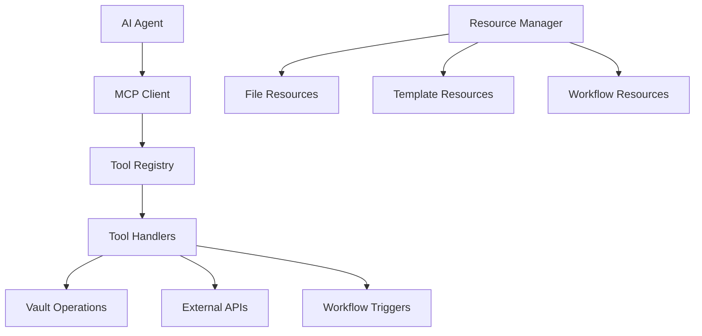

# MCP Tool Calling Complete Guide

## Overview
Model Context Protocol (MCP) provides a standardized interface for AI agents to interact with tools and resources. This guide covers complete implementation, usage patterns, and advanced tool calling strategies for the Obsidian Vault system.

## MCP Architecture

### Core Components


### Tool Categories
1. **File Operations** - Direct vault file manipulation
2. **Search & Discovery** - Content search and exploration
3. **AI Processing** - Content analysis and generation
4. **Workflow Integration** - n8n workflow triggers
5. **System Operations** - Health checks and monitoring

## Tool Registry Implementation

### Core Tool Structure
```python
@dataclass
class MCPTool:
    name: str
    description: str
    parameters: Dict[str, Any]  # JSON Schema
    handler: Callable
    category: str
    permissions: List[str]
    rate_limit: Optional[int] = None
```

### Tool Registration
```python
# Register a new tool
mcp_registry.register_tool(
    name="advanced_search",
    description="Perform advanced semantic search with filters",
    parameters={
        "type": "object",
        "properties": {
            "query": {"type": "string", "description": "Search query"},
            "filters": {
                "type": "object",
                "properties": {
                    "tags": {"type": "array", "items": {"type": "string"}},
                    "date_range": {
                        "type": "object",
                        "properties": {
                            "start": {"type": "string", "format": "date"},
                            "end": {"type": "string", "format": "date"}
                        }
                    },
                    "file_types": {"type": "array", "items": {"type": "string"}}
                }
            },
            "semantic": {"type": "boolean", "default": True},
            "limit": {"type": "integer", "default": 10, "maximum": 100}
        },
        "required": ["query"]
    },
    handler=advanced_search_handler,
    category="search",
    permissions=["read"],
    rate_limit=30  # calls per minute
)
```

## Available Tools Reference

### 1. File Operations

#### read_file
```json
{
  "tool": "read_file",
  "arguments": {
    "path": "projects/current-project.md",
    "encoding": "utf-8"
  }
}
```

**Response:**
```json
{
  "success": true,
  "result": {
    "content": "# Current Project\n\nProject details...",
    "metadata": {
      "size": 1024,
      "modified": "2024-01-15T10:30:00Z",
      "encoding": "utf-8"
    }
  }
}
```

#### write_file
```json
{
  "tool": "write_file",
  "arguments": {
    "path": "notes/new-note.md",
    "content": "# New Note\n\nContent here...",
    "create_dirs": true,
    "backup": true
  }
}
```

#### list_files
```json
{
  "tool": "list_files",
  "arguments": {
    "path": "research/",
    "pattern": "*.md",
    "recursive": true,
    "include_metadata": true,
    "sort_by": "modified",
    "sort_order": "desc"
  }
}
```

**Response:**
```json
{
  "success": true,
  "result": {
    "files": [
      {
        "path": "research/ai-paper.md",
        "size": 2048,
        "modified": "2024-01-15T09:30:00Z",
        "tags": ["ai", "research"]
      }
    ],
    "total": 25,
    "directory": "research/"
  }
}
```

#### move_file
```json
{
  "tool": "move_file",
  "arguments": {
    "source": "inbox/article.md",
    "destination": "research/processed-article.md",
    "create_dirs": true
  }
}
```

#### copy_file
```json
{
  "tool": "copy_file",
  "arguments": {
    "source": "templates/daily-template.md",
    "destination": "daily/2024-01-15.md",
    "replace_variables": {
      "{{date}}": "2024-01-15",
      "{{day_of_week}}": "Monday"
    }
  }
}
```

### 2. Search & Discovery

#### search_content
```json
{
  "tool": "search_content",
  "arguments": {
    "query": "machine learning applications",
    "semantic": true,
    "filters": {
      "tags": ["ai", "research"],
      "date_range": {
        "start": "2024-01-01",
        "end": "2024-01-31"
      },
      "paths": ["research/", "projects/"]
    },
    "limit": 10,
    "include_snippets": true,
    "snippet_length": 200
  }
}
```

**Response:**
```json
{
  "success": true,
  "result": {
    "results": [
      {
        "path": "research/ml-applications.md",
        "title": "Machine Learning Applications",
        "score": 0.89,
        "snippet": "Machine learning has numerous applications in healthcare...",
        "metadata": {
          "tags": ["ai", "healthcare", "research"],
          "modified": "2024-01-15T09:15:00Z"
        },
        "matches": [
          {
            "line": 15,
            "text": "Machine learning algorithms are transforming healthcare",
            "context": "...previous line\nMachine learning algorithms are transforming healthcare\nnext line..."
          }
        ]
      }
    ],
    "query_time": 0.045,
    "total_results": 12
  }
}
```

#### find_related_notes
```json
{
  "tool": "find_related_notes",
  "arguments": {
    "path": "concepts/neural-networks.md",
    "method": "semantic",
    "limit": 5,
    "min_similarity": 0.6,
    "exclude_paths": ["archive/"]
  }
}
```

#### explore_graph
```json
{
  "tool": "explore_graph",
  "arguments": {
    "start_node": "concepts/machine-learning.md",
    "depth": 2,
    "direction": "both",
    "include_orphans": false
  }
}
```

### 3. AI Processing

#### summarize_note
```json
{
  "tool": "summarize_note",
  "arguments": {
    "path": "research/long-paper.md",
    "style": "bullet_points",
    "max_length": 300,
    "focus_areas": ["methodology", "results", "conclusions"],
    "language": "en"
  }
}
```

**Response:**
```json
{
  "success": true,
  "result": {
    "summary": "• Research focuses on neural network optimization\n• Novel approach improves accuracy by 15%\n• Results validated on multiple datasets",
    "key_points": [
      "Neural network optimization",
      "15% accuracy improvement",
      "Multi-dataset validation"
    ],
    "word_count": 45,
    "original_length": 2500
  }
}
```

#### generate_tags
```json
{
  "tool": "generate_tags",
  "arguments": {
    "path": "articles/tech-trends.md",
    "max_tags": 8,
    "existing_tags": ["technology", "trends"],
    "tag_categories": ["topic", "industry", "technology"],
    "confidence_threshold": 0.7
  }
}
```

#### extract_entities
```json
{
  "tool": "extract_entities",
  "arguments": {
    "path": "meetings/project-meeting.md",
    "entity_types": ["person", "organization", "date", "project"],
    "include_confidence": true
  }
}
```

#### generate_outline
```json
{
  "tool": "generate_outline",
  "arguments": {
    "topic": "Introduction to Machine Learning",
    "depth": 3,
    "style": "academic",
    "target_audience": "beginners"
  }
}
```

### 4. Note Operations

#### create_daily_note
```json
{
  "tool": "create_daily_note",
  "arguments": {
    "date": "2024-01-15",
    "template": "daily-review",
    "variables": {
      "weather": "sunny",
      "mood": "productive"
    },
    "auto_populate": {
      "tasks": true,
      "calendar_events": true,
      "previous_day_review": true
    }
  }
}
```

#### create_meeting_note
```json
{
  "tool": "create_meeting_note",
  "arguments": {
    "title": "Project Kickoff Meeting",
    "date": "2024-01-15T14:00:00Z",
    "attendees": ["Alice", "Bob", "Charlie"],
    "agenda": ["Project overview", "Timeline", "Resources"],
    "template": "meeting-template"
  }
}
```

#### extract_links
```json
{
  "tool": "extract_links",
  "arguments": {
    "path": "research/comprehensive-study.md",
    "link_types": ["wikilink", "markdown", "url"],
    "validate_targets": true,
    "include_context": true
  }
}
```

**Response:**
```json
{
  "success": true,
  "result": {
    "links": [
      {
        "type": "wikilink",
        "target": "related-concept",
        "text": "related concept",
        "line": 25,
        "context": "This connects to the [[related-concept]] we discussed",
        "valid": true,
        "target_exists": true
      },
      {
        "type": "markdown",
        "target": "https://example.com/research",
        "text": "External Research",
        "line": 45,
        "context": "See [External Research](https://example.com/research) for details",
        "valid": true,
        "status_code": 200
      }
    ],
    "summary": {
      "total_links": 15,
      "wikilinks": 8,
      "markdown_links": 5,
      "urls": 2,
      "broken_links": 1
    }
  }
}
```

#### validate_links
```json
{
  "tool": "validate_links",
  "arguments": {
    "path": "research/",
    "recursive": true,
    "fix_broken": true,
    "suggest_alternatives": true
  }
}
```

### 5. Workflow Integration

#### trigger_workflow
```json
{
  "tool": "trigger_workflow",
  "arguments": {
    "workflow_id": "content-processing",
    "data": {
      "note_path": "inbox/new-article.md",
      "processing_type": "full",
      "notify_completion": true
    },
    "async": true,
    "timeout": 300
  }
}
```

#### list_workflows
```json
{
  "tool": "list_workflows",
  "arguments": {
    "status": "active",
    "category": "content-processing"
  }
}
```

#### get_workflow_status
```json
{
  "tool": "get_workflow_status",
  "arguments": {
    "execution_id": "exec_123456",
    "include_logs": true
  }
}
```

### 6. System Operations

#### vault_stats
```json
{
  "tool": "vault_stats",
  "arguments": {
    "include_breakdown": true,
    "date_range": {
      "start": "2024-01-01",
      "end": "2024-01-31"
    }
  }
}
```

**Response:**
```json
{
  "success": true,
  "result": {
    "total_notes": 1247,
    "total_size": "45.2 MB",
    "breakdown": {
      "by_folder": {
        "daily/": 365,
        "projects/": 89,
        "research/": 156
      },
      "by_type": {
        ".md": 1200,
        ".txt": 35,
        ".pdf": 12
      }
    },
    "growth": {
      "notes_added": 45,
      "notes_modified": 123,
      "notes_deleted": 3
    },
    "last_updated": "2024-01-15T12:00:00Z"
  }
}
```

#### backup_vault
```json
{
  "tool": "backup_vault",
  "arguments": {
    "destination": "backups/vault-backup-2024-01-15",
    "compression": "gzip",
    "include_metadata": true,
    "exclude_patterns": ["*.tmp", ".obsidian/workspace*"]
  }
}
```

#### sync_status
```json
{
  "tool": "sync_status",
  "arguments": {
    "detailed": true
  }
}
```

## Advanced Tool Calling Patterns

### 1. Chained Tool Calls
```python
async def process_new_article(article_path: str):
    """Example of chaining multiple tool calls"""
    
    # 1. Read the article
    content_result = await mcp_registry.call_tool("read_file", {
        "path": article_path
    })
    
    # 2. Generate tags
    tags_result = await mcp_registry.call_tool("generate_tags", {
        "path": article_path,
        "max_tags": 5
    })
    
    # 3. Find related notes
    related_result = await mcp_registry.call_tool("find_related_notes", {
        "path": article_path,
        "limit": 3
    })
    
    # 4. Create summary
    summary_result = await mcp_registry.call_tool("summarize_note", {
        "path": article_path,
        "max_length": 200
    })
    
    # 5. Update note with metadata
    updated_content = f"""---
tags: {tags_result['result']}
related: {[note['path'] for note in related_result['result']]}
summary: {summary_result['result']['summary']}
---

{content_result['result']['content']}
"""
    
    await mcp_registry.call_tool("write_file", {
        "path": article_path,
        "content": updated_content
    })
```

### 2. Conditional Tool Execution
```python
async def smart_note_processing(note_path: str):
    """Conditional processing based on note content"""
    
    # Check if note exists
    file_result = await mcp_registry.call_tool("read_file", {
        "path": note_path
    })
    
    if not file_result["success"]:
        return {"error": "Note not found"}
    
    content = file_result["result"]["content"]
    
    # Conditional processing based on content
    if "meeting" in content.lower():
        # Process as meeting note
        await mcp_registry.call_tool("extract_entities", {
            "path": note_path,
            "entity_types": ["person", "date", "action_item"]
        })
    elif "research" in content.lower():
        # Process as research note
        await mcp_registry.call_tool("find_related_notes", {
            "path": note_path,
            "method": "semantic"
        })
    else:
        # General processing
        await mcp_registry.call_tool("generate_tags", {
            "path": note_path
        })
```

### 3. Batch Tool Operations
```python
async def batch_process_notes(note_paths: List[str]):
    """Process multiple notes in batch"""
    
    tasks = []
    for path in note_paths:
        # Create async tasks for parallel processing
        task = asyncio.create_task(
            process_single_note(path)
        )
        tasks.append(task)
    
    # Wait for all tasks to complete
    results = await asyncio.gather(*tasks, return_exceptions=True)
    
    return {
        "processed": len([r for r in results if not isinstance(r, Exception)]),
        "failed": len([r for r in results if isinstance(r, Exception)]),
        "results": results
    }
```

## Error Handling and Retry Logic

### Tool Call Error Handling
```python
async def robust_tool_call(tool_name: str, arguments: Dict[str, Any], max_retries: int = 3):
    """Tool call with retry logic and error handling"""
    
    for attempt in range(max_retries):
        try:
            result = await mcp_registry.call_tool(tool_name, arguments)
            
            if result["success"]:
                return result
            else:
                # Handle specific error types
                error = result.get("error", "Unknown error")
                
                if "rate_limit" in error.lower():
                    # Wait and retry for rate limits
                    await asyncio.sleep(2 ** attempt)
                    continue
                elif "not_found" in error.lower():
                    # Don't retry for not found errors
                    return result
                else:
                    # Retry for other errors
                    await asyncio.sleep(1)
                    continue
                    
        except Exception as e:
            if attempt == max_retries - 1:
                return {"success": False, "error": str(e)}
            await asyncio.sleep(1)
    
    return {"success": False, "error": "Max retries exceeded"}
```

## Performance Optimization

### Tool Call Caching
```python
from functools import lru_cache
import hashlib

class CachedMCPRegistry(MCPToolRegistry):
    def __init__(self, *args, **kwargs):
        super().__init__(*args, **kwargs)
        self._cache = {}
        self._cache_ttl = {}
    
    async def call_tool_cached(self, tool_name: str, arguments: Dict[str, Any], ttl: int = 300):
        """Call tool with caching support"""
        
        # Create cache key
        cache_key = hashlib.md5(
            f"{tool_name}:{json.dumps(arguments, sort_keys=True)}".encode()
        ).hexdigest()
        
        # Check cache
        if cache_key in self._cache:
            if time.time() - self._cache_ttl[cache_key] < ttl:
                return self._cache[cache_key]
        
        # Call tool
        result = await self.call_tool(tool_name, arguments)
        
        # Cache successful results
        if result.get("success"):
            self._cache[cache_key] = result
            self._cache_ttl[cache_key] = time.time()
        
        return result
```

### Parallel Tool Execution
```python
async def parallel_tool_calls(tool_calls: List[Dict[str, Any]]):
    """Execute multiple tool calls in parallel"""
    
    async def execute_call(call_info):
        return await mcp_registry.call_tool(
            call_info["tool"],
            call_info["arguments"]
        )
    
    # Create tasks for parallel execution
    tasks = [execute_call(call) for call in tool_calls]
    
    # Execute all tasks concurrently
    results = await asyncio.gather(*tasks, return_exceptions=True)
    
    return [
        result if not isinstance(result, Exception) 
        else {"success": False, "error": str(result)}
        for result in results
    ]
```

## Integration with AI Agents

### Agent Tool Selection
```python
class SmartToolSelector:
    def __init__(self, mcp_registry: MCPToolRegistry):
        self.registry = mcp_registry
        self.tool_usage_stats = {}
    
    def select_tools_for_task(self, task_description: str) -> List[str]:
        """Select appropriate tools based on task description"""
        
        task_lower = task_description.lower()
        selected_tools = []
        
        # File operations
        if any(word in task_lower for word in ["read", "write", "create", "file"]):
            selected_tools.extend(["read_file", "write_file", "list_files"])
        
        # Search operations
        if any(word in task_lower for word in ["search", "find", "discover"]):
            selected_tools.extend(["search_content", "find_related_notes"])
        
        # AI processing
        if any(word in task_lower for word in ["summarize", "analyze", "generate"]):
            selected_tools.extend(["summarize_note", "generate_tags", "extract_entities"])
        
        # Workflow operations
        if any(word in task_lower for word in ["workflow", "automate", "process"]):
            selected_tools.extend(["trigger_workflow", "list_workflows"])
        
        return selected_tools
    
    def get_tool_recommendations(self, context: Dict[str, Any]) -> List[Dict[str, Any]]:
        """Get tool recommendations based on context"""
        
        recommendations = []
        
        # Analyze context
        if "file_path" in context:
            recommendations.append({
                "tool": "read_file",
                "confidence": 0.9,
                "reason": "File path provided in context"
            })
        
        if "search_query" in context:
            recommendations.append({
                "tool": "search_content",
                "confidence": 0.8,
                "reason": "Search query detected"
            })
        
        return recommendations
```

This comprehensive MCP tool calling guide provides everything needed to implement and use the Model Context Protocol effectively with the Obsidian Vault AI automation system.