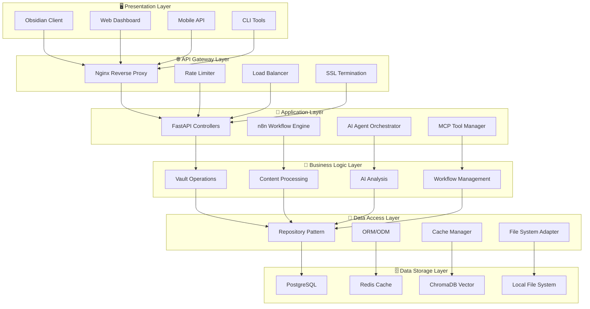
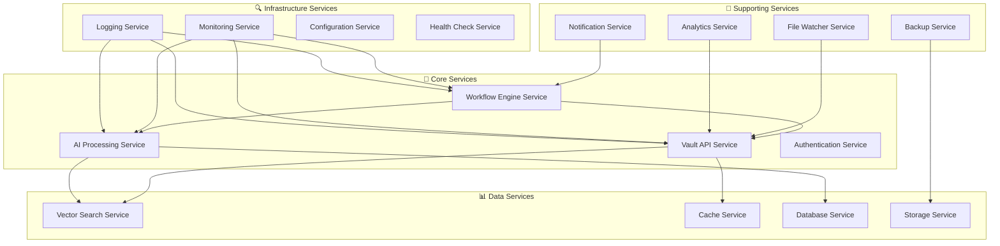
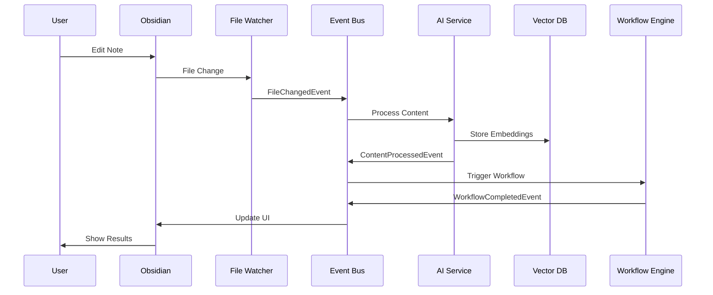
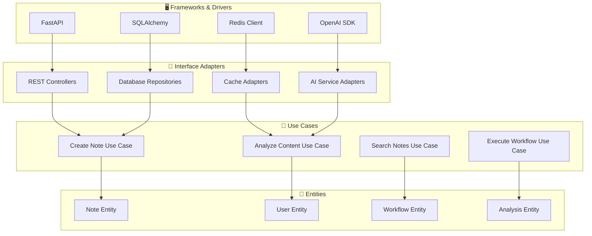
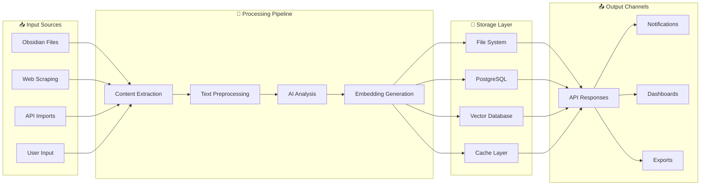
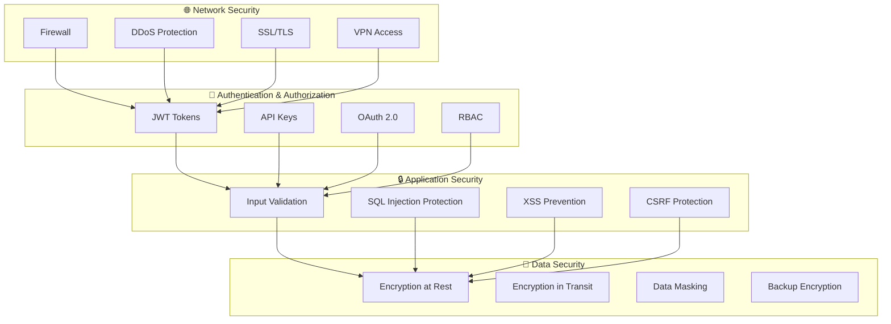
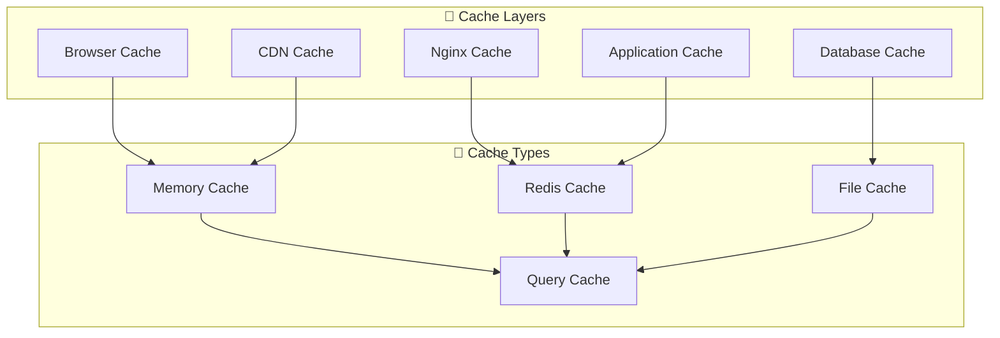
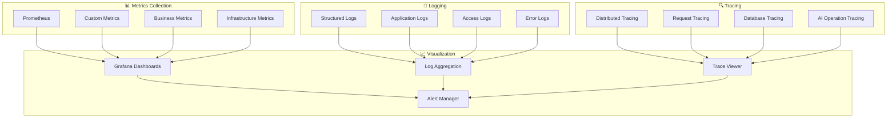
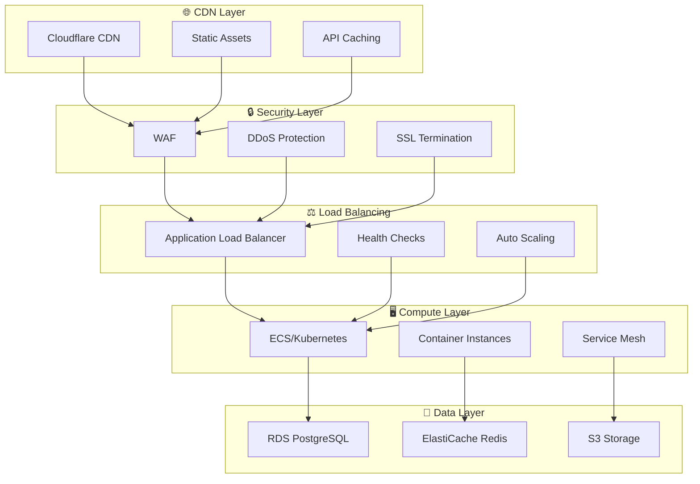

# 🏗️ System Architecture & Design Patterns

## 📋 **Visão Geral da Arquitetura**

Este documento detalha a arquitetura técnica do **Obsidian Vault AI Automation System**, seguindo princípios de **Clean Architecture**, **Domain-Driven Design** e **Microservices Pattern**.

---

## 🎯 **1. Arquitetura em Camadas (Layered Architecture)**

### 📊 **Diagrama de Camadas**



### 🔄 **Separação de Responsabilidades**

#### **Presentation Layer (Camada de Apresentação)**
```typescript
// Exemplo: Obsidian Plugin Interface
interface ObsidianVaultAPI {
  createNote(path: string, content: string): Promise<Note>;
  updateNote(path: string, content: string): Promise<Note>;
  deleteNote(path: string): Promise<boolean>;
  searchNotes(query: SearchQuery): Promise<Note[]>;
}
```

#### **Application Layer (Camada de Aplicação)**
```python
# Exemplo: FastAPI Controller
class VaultController:
    def __init__(self, vault_service: VaultService):
        self.vault_service = vault_service
    
    async def create_note(self, request: CreateNoteRequest) -> NoteResponse:
        # Orquestra a criação de nota
        return await self.vault_service.create_note(request)
```

#### **Business Logic Layer (Camada de Negócio)**
```python
# Exemplo: Serviço de Negócio
class VaultService:
    def __init__(self, note_repository: NoteRepository, ai_service: AIService):
        self.note_repository = note_repository
        self.ai_service = ai_service
    
    async def create_note(self, request: CreateNoteRequest) -> Note:
        # Regras de negócio para criação de nota
        note = Note.create(request.path, request.content)
        
        # Análise de IA
        analysis = await self.ai_service.analyze_content(note.content)
        note.add_metadata(analysis)
        
        # Persistência
        return await self.note_repository.save(note)
```

---

## 🔄 **2. Microservices Architecture**

### 🏢 **Decomposição de Serviços**



### 🔌 **Service Communication Patterns**

#### **Synchronous Communication (REST API)**
```python
# Exemplo: Comunicação síncrona entre serviços
class AIServiceClient:
    def __init__(self, base_url: str):
        self.client = httpx.AsyncClient(base_url=base_url)
    
    async def analyze_content(self, content: str) -> AnalysisResult:
        response = await self.client.post(
            "/analyze",
            json={"content": content}
        )
        return AnalysisResult.parse_obj(response.json())
```

#### **Asynchronous Communication (Event-Driven)**
```python
# Exemplo: Comunicação assíncrona via eventos
class EventBus:
    def __init__(self):
        self.subscribers = defaultdict(list)
    
    def subscribe(self, event_type: str, handler: Callable):
        self.subscribers[event_type].append(handler)
    
    async def publish(self, event: Event):
        handlers = self.subscribers[event.type]
        await asyncio.gather(*[handler(event) for handler in handlers])

# Uso
event_bus = EventBus()
event_bus.subscribe("note_created", ai_analysis_handler)
event_bus.subscribe("note_created", indexing_handler)
```

---

## 🎯 **3. Design Patterns Implementados**

### 🏭 **3.1 Creational Patterns**

#### **Factory Pattern - AI Agent Factory**
```python
class AIAgentFactory:
    @staticmethod
    def create_agent(agent_type: str, config: AgentConfig) -> BaseAgent:
        if agent_type == "content_curator":
            return ContentCuratorAgent(config)
        elif agent_type == "knowledge_synthesizer":
            return KnowledgeSynthesizerAgent(config)
        elif agent_type == "task_master":
            return TaskMasterAgent(config)
        else:
            raise ValueError(f"Unknown agent type: {agent_type}")

# Uso
agent = AIAgentFactory.create_agent("content_curator", config)
```

#### **Builder Pattern - Workflow Builder**
```python
class WorkflowBuilder:
    def __init__(self):
        self.workflow = Workflow()
    
    def add_trigger(self, trigger: Trigger) -> 'WorkflowBuilder':
        self.workflow.trigger = trigger
        return self
    
    def add_step(self, step: WorkflowStep) -> 'WorkflowBuilder':
        self.workflow.steps.append(step)
        return self
    
    def build(self) -> Workflow:
        return self.workflow

# Uso
workflow = (WorkflowBuilder()
    .add_trigger(FileChangeTrigger())
    .add_step(AIAnalysisStep())
    .add_step(TaggingStep())
    .build())
```

### 🔧 **3.2 Structural Patterns**

#### **Adapter Pattern - External API Integration**
```python
class OpenAIAdapter:
    def __init__(self, api_key: str):
        self.client = OpenAI(api_key=api_key)
    
    async def analyze_content(self, content: str) -> AnalysisResult:
        # Adapta a interface do OpenAI para nossa interface interna
        response = await self.client.chat.completions.create(
            model="gpt-4",
            messages=[{"role": "user", "content": content}]
        )
        return AnalysisResult(
            summary=response.choices[0].message.content,
            confidence=0.95
        )

class AnthropicAdapter:
    def __init__(self, api_key: str):
        self.client = Anthropic(api_key=api_key)
    
    async def analyze_content(self, content: str) -> AnalysisResult:
        # Adapta a interface do Anthropic para nossa interface interna
        response = await self.client.messages.create(
            model="claude-3-sonnet-20240229",
            messages=[{"role": "user", "content": content}]
        )
        return AnalysisResult(
            summary=response.content[0].text,
            confidence=0.93
        )
```

#### **Facade Pattern - Unified API Interface**
```python
class VaultFacade:
    def __init__(self):
        self.note_service = NoteService()
        self.ai_service = AIService()
        self.search_service = SearchService()
        self.workflow_service = WorkflowService()
    
    async def create_intelligent_note(self, content: str, path: str) -> Note:
        # Simplifica operações complexas em uma interface única
        note = await self.note_service.create(path, content)
        analysis = await self.ai_service.analyze(content)
        await self.search_service.index(note)
        await self.workflow_service.trigger("note_created", note)
        return note
```

### 👁️ **3.3 Behavioral Patterns**

#### **Observer Pattern - Event System**
```python
class Observable:
    def __init__(self):
        self._observers = []
    
    def attach(self, observer: Observer):
        self._observers.append(observer)
    
    def notify(self, event: Event):
        for observer in self._observers:
            observer.update(event)

class NoteService(Observable):
    async def create_note(self, path: str, content: str) -> Note:
        note = Note(path, content)
        await self.repository.save(note)
        
        # Notifica observadores
        self.notify(NoteCreatedEvent(note))
        return note

# Observadores
class AIAnalysisObserver:
    async def update(self, event: NoteCreatedEvent):
        await self.ai_service.analyze(event.note)

class IndexingObserver:
    async def update(self, event: NoteCreatedEvent):
        await self.search_service.index(event.note)
```

#### **Strategy Pattern - Content Processing**
```python
class ContentProcessor:
    def __init__(self, strategy: ProcessingStrategy):
        self.strategy = strategy
    
    async def process(self, content: str) -> ProcessedContent:
        return await self.strategy.process(content)

class MarkdownProcessingStrategy:
    async def process(self, content: str) -> ProcessedContent:
        # Processamento específico para Markdown
        pass

class PlainTextProcessingStrategy:
    async def process(self, content: str) -> ProcessedContent:
        # Processamento específico para texto plano
        pass

# Uso
processor = ContentProcessor(MarkdownProcessingStrategy())
result = await processor.process(content)
```

#### **Command Pattern - Workflow Actions**
```python
class Command:
    async def execute(self) -> CommandResult:
        raise NotImplementedError

class CreateNoteCommand(Command):
    def __init__(self, path: str, content: str):
        self.path = path
        self.content = content
    
    async def execute(self) -> CommandResult:
        # Executa criação de nota
        pass

class WorkflowExecutor:
    def __init__(self):
        self.commands = []
    
    def add_command(self, command: Command):
        self.commands.append(command)
    
    async def execute_all(self) -> List[CommandResult]:
        results = []
        for command in self.commands:
            result = await command.execute()
            results.append(result)
        return results
```

---

## 🔄 **4. Event-Driven Architecture**

### 📡 **Event Flow Diagram**



### 🎯 **Event Types**

```python
# Definição de eventos do sistema
@dataclass
class Event:
    id: str
    timestamp: datetime
    type: str
    source: str
    data: Dict[str, Any]

@dataclass
class NoteCreatedEvent(Event):
    note_path: str
    content_length: int
    author: str

@dataclass
class AIAnalysisCompletedEvent(Event):
    note_path: str
    analysis_result: AnalysisResult
    processing_time: float

@dataclass
class WorkflowTriggeredEvent(Event):
    workflow_id: str
    trigger_type: str
    context: Dict[str, Any]
```

---

## 🏛️ **5. Clean Architecture Implementation**

### 🎯 **Dependency Inversion**



### 📋 **Domain Entities**

```python
# Entidades do domínio (independentes de frameworks)
class Note:
    def __init__(self, path: str, content: str, author: str):
        self.path = path
        self.content = content
        self.author = author
        self.created_at = datetime.now()
        self.updated_at = datetime.now()
        self.metadata = {}
    
    def update_content(self, new_content: str):
        self.content = new_content
        self.updated_at = datetime.now()
    
    def add_metadata(self, key: str, value: Any):
        self.metadata[key] = value
    
    def validate(self) -> bool:
        # Regras de validação do domínio
        return len(self.content) > 0 and self.path.endswith('.md')

class Workflow:
    def __init__(self, name: str, trigger: Trigger):
        self.name = name
        self.trigger = trigger
        self.steps = []
        self.is_active = True
    
    def add_step(self, step: WorkflowStep):
        self.steps.append(step)
    
    def can_execute(self, context: Dict[str, Any]) -> bool:
        return self.is_active and self.trigger.matches(context)
```

### 🔧 **Use Cases**

```python
# Casos de uso (regras de negócio da aplicação)
class CreateNoteUseCase:
    def __init__(self, 
                 note_repository: NoteRepository,
                 ai_service: AIService,
                 event_bus: EventBus):
        self.note_repository = note_repository
        self.ai_service = ai_service
        self.event_bus = event_bus
    
    async def execute(self, request: CreateNoteRequest) -> CreateNoteResponse:
        # Validação
        if not request.is_valid():
            raise ValidationError("Invalid note data")
        
        # Criação da entidade
        note = Note(request.path, request.content, request.author)
        
        # Análise de IA (se solicitada)
        if request.analyze_with_ai:
            analysis = await self.ai_service.analyze(note.content)
            note.add_metadata("ai_analysis", analysis)
        
        # Persistência
        saved_note = await self.note_repository.save(note)
        
        # Evento
        await self.event_bus.publish(NoteCreatedEvent(
            note_path=saved_note.path,
            content_length=len(saved_note.content),
            author=saved_note.author
        ))
        
        return CreateNoteResponse(note=saved_note)
```

---

## 🔍 **6. Data Flow Architecture**

### 📊 **Data Pipeline**



### 🔄 **Stream Processing**

```python
# Exemplo: Pipeline de processamento de dados
class DataPipeline:
    def __init__(self):
        self.stages = []
    
    def add_stage(self, stage: ProcessingStage):
        self.stages.append(stage)
    
    async def process(self, data: Any) -> Any:
        result = data
        for stage in self.stages:
            result = await stage.process(result)
        return result

# Estágios do pipeline
class ContentExtractionStage(ProcessingStage):
    async def process(self, file_path: str) -> str:
        # Extrai conteúdo do arquivo
        pass

class TextPreprocessingStage(ProcessingStage):
    async def process(self, content: str) -> str:
        # Limpa e normaliza o texto
        pass

class AIAnalysisStage(ProcessingStage):
    async def process(self, content: str) -> AnalysisResult:
        # Análise com IA
        pass

class EmbeddingGenerationStage(ProcessingStage):
    async def process(self, analysis: AnalysisResult) -> Embedding:
        # Gera embeddings vetoriais
        pass

# Configuração do pipeline
pipeline = DataPipeline()
pipeline.add_stage(ContentExtractionStage())
pipeline.add_stage(TextPreprocessingStage())
pipeline.add_stage(AIAnalysisStage())
pipeline.add_stage(EmbeddingGenerationStage())
```

---

## 🔒 **7. Security Architecture**

### 🛡️ **Security Layers**



### 🔐 **Authentication Flow**

```python
# Sistema de autenticação multi-camada
class SecurityManager:
    def __init__(self):
        self.jwt_handler = JWTHandler()
        self.api_key_manager = APIKeyManager()
        self.rate_limiter = RateLimiter()
        self.audit_logger = AuditLogger()
    
    async def authenticate(self, request: Request) -> AuthResult:
        # 1. Rate limiting
        if not await self.rate_limiter.allow(request.client.host):
            raise RateLimitExceeded()
        
        # 2. Token validation
        token = self.extract_token(request)
        if not token:
            raise AuthenticationRequired()
        
        # 3. JWT validation
        if token.startswith('Bearer '):
            user = await self.jwt_handler.validate(token)
        else:
            user = await self.api_key_manager.validate(token)
        
        # 4. Audit logging
        await self.audit_logger.log_access(user, request)
        
        return AuthResult(user=user, permissions=user.permissions)
```

---

## 📊 **8. Performance Architecture**

### ⚡ **Caching Strategy**



### 🚀 **Performance Optimization**

```python
# Sistema de cache multi-camada
class CacheManager:
    def __init__(self):
        self.memory_cache = MemoryCache(max_size=1000)
        self.redis_cache = RedisCache()
        self.file_cache = FileCache()
    
    async def get(self, key: str) -> Optional[Any]:
        # L1: Memory cache
        value = self.memory_cache.get(key)
        if value is not None:
            return value
        
        # L2: Redis cache
        value = await self.redis_cache.get(key)
        if value is not None:
            self.memory_cache.set(key, value)
            return value
        
        # L3: File cache
        value = await self.file_cache.get(key)
        if value is not None:
            await self.redis_cache.set(key, value)
            self.memory_cache.set(key, value)
            return value
        
        return None
    
    async def set(self, key: str, value: Any, ttl: int = 300):
        # Armazena em todas as camadas
        self.memory_cache.set(key, value, ttl)
        await self.redis_cache.set(key, value, ttl)
        await self.file_cache.set(key, value, ttl)
```

---

## 📈 **9. Monitoring & Observability**

### 📊 **Observability Stack**



### 📊 **Custom Metrics**

```python
# Sistema de métricas customizadas
from prometheus_client import Counter, Histogram, Gauge

# Métricas de negócio
notes_created_total = Counter(
    'notes_created_total',
    'Total number of notes created',
    ['user_type', 'content_type']
)

ai_processing_duration = Histogram(
    'ai_processing_duration_seconds',
    'Time spent processing content with AI',
    ['model_type', 'operation']
)

active_workflows = Gauge(
    'active_workflows_total',
    'Number of currently active workflows'
)

# Instrumentação
class MetricsCollector:
    @staticmethod
    def record_note_creation(user_type: str, content_type: str):
        notes_created_total.labels(
            user_type=user_type,
            content_type=content_type
        ).inc()
    
    @staticmethod
    def record_ai_processing(model_type: str, operation: str, duration: float):
        ai_processing_duration.labels(
            model_type=model_type,
            operation=operation
        ).observe(duration)
```

---

## 🔄 **10. Deployment Architecture**

### 🐳 **Container Orchestration**

```yaml
# docker-compose.production.yml
version: '3.8'

services:
  # API Gateway
  nginx:
    image: nginx:alpine
    ports:
      - "80:80"
      - "443:443"
    volumes:
      - ./nginx/nginx.conf:/etc/nginx/nginx.conf
      - ./ssl:/etc/ssl/certs
    depends_on:
      - vault-api
      - n8n

  # Core Services
  vault-api:
    build: ./vault-api
    deploy:
      replicas: 3
      resources:
        limits:
          cpus: '1.0'
          memory: 1G
    environment:
      - DATABASE_URL=${DATABASE_URL}
      - REDIS_URL=${REDIS_URL}
    depends_on:
      - postgres
      - redis

  # AI Services
  ai-processor:
    build: ./ai-processor
    deploy:
      replicas: 2
      resources:
        limits:
          cpus: '2.0'
          memory: 4G
    environment:
      - OPENAI_API_KEY=${OPENAI_API_KEY}
      - ANTHROPIC_API_KEY=${ANTHROPIC_API_KEY}

  # Databases
  postgres:
    image: postgres:15
    environment:
      - POSTGRES_DB=${DB_NAME}
      - POSTGRES_USER=${DB_USER}
      - POSTGRES_PASSWORD=${DB_PASSWORD}
    volumes:
      - postgres_data:/var/lib/postgresql/data

  redis:
    image: redis:7-alpine
    command: redis-server --appendonly yes
    volumes:
      - redis_data:/data

  # Monitoring
  prometheus:
    image: prom/prometheus
    ports:
      - "9090:9090"
    volumes:
      - ./monitoring/prometheus.yml:/etc/prometheus/prometheus.yml

  grafana:
    image: grafana/grafana
    ports:
      - "3000:3000"
    environment:
      - GF_SECURITY_ADMIN_PASSWORD=${GRAFANA_PASSWORD}
    volumes:
      - grafana_data:/var/lib/grafana

volumes:
  postgres_data:
  redis_data:
  grafana_data:
```

### ☁️ **Cloud Deployment Strategy**



---

## 📋 **Conclusão**

Esta arquitetura implementa:

### ✅ **Princípios Seguidos**
- **Separation of Concerns**: Cada camada tem responsabilidade específica
- **Dependency Inversion**: Dependências apontam para abstrações
- **Single Responsibility**: Cada componente tem uma função clara
- **Open/Closed Principle**: Extensível sem modificação
- **Interface Segregation**: Interfaces específicas e focadas

### 🎯 **Benefícios Alcançados**
- **Maintainability**: Código organizado e modular
- **Scalability**: Arquitetura preparada para crescimento
- **Testability**: Componentes isolados e testáveis
- **Flexibility**: Fácil adição de novas funcionalidades
- **Reliability**: Sistema robusto e tolerante a falhas

### 🚀 **Próximos Passos**
1. Implementar service mesh para comunicação entre serviços
2. Adicionar circuit breakers para resiliência
3. Implementar blue-green deployment
4. Adicionar chaos engineering para testes de resiliência
5. Otimizar performance com profiling contínuo

---

**📝 Documento mantido por**: Architecture Team  
**🔄 Última atualização**: Janeiro 2024  
**📊 Versão**: 2.0.0