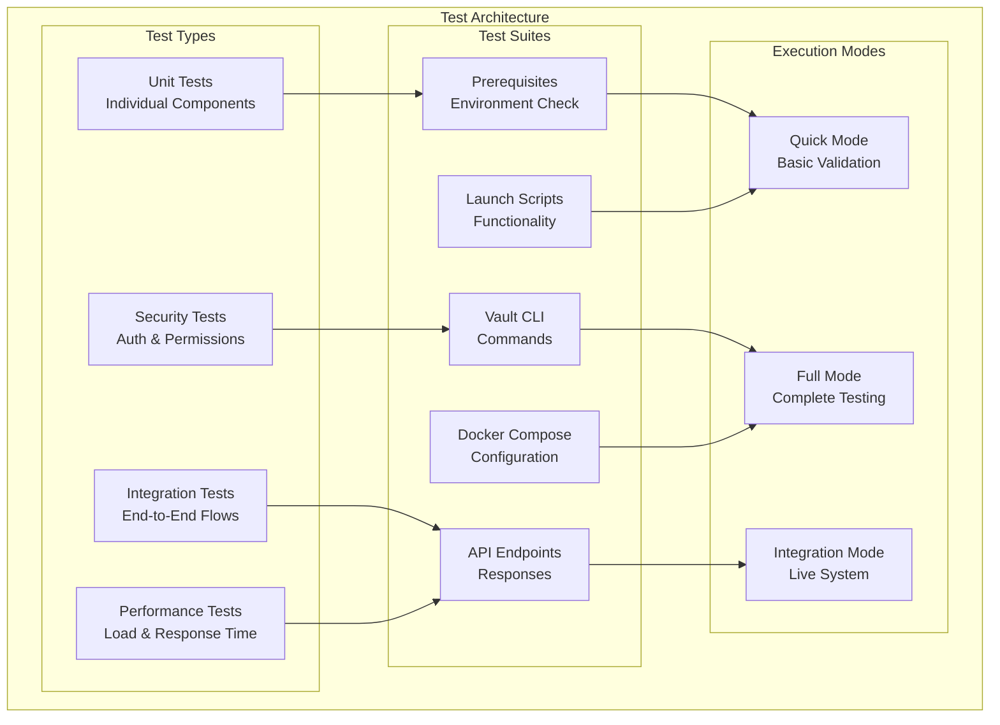

# 🧪 Complete Test Suite Guide
## Obsidian Vault AI Launch Scripts Testing

### 📋 Test Suite Overview

The testing framework provides comprehensive validation of the entire Obsidian Vault AI system with multiple test categories and execution modes.



---

## 🚀 Quick Start Testing

### **Run All Tests (Recommended)**
```powershell
# Navigate to project directory
cd "d:\codex\master_code\backend_ops\local-api-obsidian_vault"

# Run complete test suite
.\tests\run-all-tests.ps1

# Quick validation (fastest)
.\tests\run-all-tests.ps1 -Quick

# Integration tests with service startup
.\tests\run-all-tests.ps1 -Integration -StartServices

# Generate detailed reports
.\tests\run-all-tests.ps1 -GenerateReport
```

### **Individual Test Suites**
```powershell
# Prerequisites check
.\tests\launch-tests.ps1 -TestSuite prerequisites

# Launch script validation
.\tests\launch-tests.ps1 -TestSuite launch

# CLI functionality
.\tests\launch-tests.ps1 -TestSuite cli

# Docker configuration
.\tests\launch-tests.ps1 -TestSuite docker

# API endpoints (requires running services)
.\tests\launch-tests.ps1 -TestSuite api
```

---

## 📊 Test Categories Breakdown

### **1. Prerequisites Tests**
**Purpose:** Validate environment setup and dependencies

| Test | Validates | Pass Criteria |
|------|-----------|---------------|
| Docker Installation | `docker --version` | Version info returned |
| Docker Compose | `docker-compose --version` | Version info returned |
| Docker Service | `docker info` | Daemon accessible |
| Project Files | Required files exist | All files present |
| Vault Path | Obsidian vault accessible | Path exists and readable |
| PowerShell Policy | Script execution allowed | Policy permits execution |

**Run Command:**
```powershell
.\tests\launch-tests.ps1 -TestSuite prerequisites -Verbose
```

### **2. Launch Script Tests**
**Purpose:** Validate main launch script functionality

| Test | Validates | Pass Criteria |
|------|-----------|---------------|
| Script Exists | File presence | `scripts\launch.ps1` exists |
| Syntax Check | PowerShell parsing | No syntax errors |
| Parameters | Required params present | Action, Interactive, Verbose |
| Help System | Documentation | Help content available |

**Run Command:**
```powershell
.\tests\launch-tests.ps1 -TestSuite launch -Verbose
```

### **3. Vault CLI Tests**
**Purpose:** Validate CLI tool functionality

| Test | Validates | Pass Criteria |
|------|-----------|---------------|
| CLI Exists | File presence | `scripts\vault-cli.ps1` exists |
| Syntax Check | PowerShell parsing | No syntax errors |
| Commands | Required commands | health, tools, search, create |
| Interactive Mode | CLI interface | Interactive mode functional |

**Run Command:**
```powershell
.\tests\launch-tests.ps1 -TestSuite cli -Verbose
```

### **4. Docker Configuration Tests**
**Purpose:** Validate container orchestration setup

| Test | Validates | Pass Criteria |
|------|-----------|---------------|
| Compose Syntax | YAML validation | `docker-compose config` succeeds |
| Required Services | Service definitions | vault-api, obsidian-api, n8n, etc. |
| Volume Mappings | Mount configurations | Vault path mapped correctly |
| Network Config | Container networking | obsidian-net defined |

**Run Command:**
```powershell
.\tests\launch-tests.ps1 -TestSuite docker -Verbose
```

### **5. Port Availability Tests**
**Purpose:** Ensure required ports are available

| Port | Service | Test |
|------|---------|------|
| 8080 | Vault API | Connection test |
| 27123 | Obsidian API | Connection test |
| 5678 | n8n | Connection test |
| 3000 | Grafana | Connection test |
| 9090 | Prometheus | Connection test |

**Run Command:**
```powershell
.\tests\launch-tests.ps1 -TestSuite ports -Verbose
```

### **6. API Endpoint Tests**
**Purpose:** Validate running services (requires system to be started)

| Endpoint | Test | Expected Response |
|----------|------|-------------------|
| `/health` | System health | `status: "healthy"` |
| `/api/v1/mcp/tools` | MCP tools list | Array of 15+ tools |
| `/api/v1/search` | Search functionality | Search results |
| `/` | Root endpoint | API information |

**Run Command:**
```powershell
# Start services first
.\scripts\launch.ps1 -Action start

# Then test APIs
.\tests\launch-tests.ps1 -TestSuite api -Verbose
```

---

## 🔄 Integration Testing

### **Complete System Integration**
```powershell
# Full integration test with service management
.\tests\integration-tests.ps1 -StartServices -StopServices

# Test running system
.\tests\integration-tests.ps1

# Performance testing
.\tests\integration-tests.ps1 -TimeoutSeconds 600
```

### **Integration Test Categories**

#### **System Startup Tests**
- Service health checks
- Container status validation
- Dependency verification

#### **API Functionality Tests**
- Endpoint accessibility
- MCP tool execution
- Search operations
- Error handling

#### **Vault Operations Tests**
- File system access
- Note reading/writing
- Real vault integration

#### **Performance Tests**
- Response time measurement
- Concurrent request handling
- Resource utilization

---

## 📈 Test Execution Modes

### **Quick Mode** (2-3 minutes)
```powershell
.\tests\run-all-tests.ps1 -Quick
```
**Includes:**
- Prerequisites check
- Script syntax validation
- Docker configuration
- Basic functionality tests

**Use Case:** Development validation, CI/CD pipelines

### **Full Mode** (5-10 minutes)
```powershell
.\tests\run-all-tests.ps1
```
**Includes:**
- All Quick Mode tests
- Port availability checks
- Extended validation
- Performance benchmarks

**Use Case:** Pre-deployment validation, comprehensive testing

### **Integration Mode** (10-15 minutes)
```powershell
.\tests\run-all-tests.ps1 -Integration -StartServices
```
**Includes:**
- All Full Mode tests
- Live system testing
- End-to-end workflows
- Real API validation

**Use Case:** Production readiness, system validation

---

## 📊 Test Reporting

### **Console Output**
Real-time test execution with color-coded results:
- ✅ **PASS** - Green
- ❌ **FAIL** - Red  
- ⏭️ **SKIP** - Yellow
- ℹ️ **INFO** - Cyan

### **JSON Report**
```powershell
.\tests\run-all-tests.ps1 -GenerateReport
```
**Output:** `test-results/test-results.json`
```json
{
  "timestamp": "2024-01-15T12:00:00Z",
  "duration_minutes": 5.2,
  "summary": {
    "total": 45,
    "passed": 42,
    "failed": 2,
    "skipped": 1
  },
  "suites": [...]
}
```

### **HTML Report**
**Output:** `test-results/test-results.html`
- Visual dashboard
- Interactive results
- Detailed suite breakdown
- Execution timeline

---

## 🔧 Troubleshooting Test Failures

### **Common Issues & Solutions**

#### **Docker Not Running**
```
❌ FAIL: Docker Service Running
```
**Solution:**
```powershell
# Start Docker Desktop
Start-Process "Docker Desktop"
# Wait for startup, then retry tests
```

#### **Port Conflicts**
```
❌ FAIL: Port 8080 Available
```
**Solution:**
```powershell
# Find process using port
netstat -ano | findstr :8080
# Kill process or change configuration
```

#### **Vault Path Issues**
```
❌ FAIL: Vault Path Accessible
```
**Solution:**
```powershell
# Check path exists
Test-Path "D:\Nomade Milionario"
# Verify permissions
Get-Acl "D:\Nomade Milionario"
```

#### **PowerShell Execution Policy**
```
❌ FAIL: PowerShell Execution Policy
```
**Solution:**
```powershell
# Set execution policy
Set-ExecutionPolicy -ExecutionPolicy RemoteSigned -Scope CurrentUser
```

#### **API Endpoint Failures**
```
❌ FAIL: Health Endpoint
```
**Solution:**
```powershell
# Start services first
.\scripts\launch.ps1 -Action start
# Wait for startup
Start-Sleep -Seconds 30
# Retry tests
```

---

## 🎯 Test Development Guidelines

### **Adding New Tests**

#### **Unit Test Template**
```powershell
Test-Assert "New Test Name" {
    # Test logic here
    $result = Test-SomeCondition
    return $result -eq $expectedValue
} "Description of what this test validates"
```

#### **Integration Test Template**
```powershell
Test-Integration "New Integration Test" {
    try {
        # Setup
        $testData = @{key = "value"}
        
        # Execute
        $response = Invoke-RestMethod -Uri "http://localhost:8080/api/test" -Method POST -Body ($testData | ConvertTo-Json) -ContentType "application/json"
        
        # Validate
        return $response.success -eq $true
    } catch {
        return $false
    }
}
```

### **Test Best Practices**

1. **Isolation:** Each test should be independent
2. **Cleanup:** Clean up test data after execution
3. **Timeouts:** Use appropriate timeouts for API calls
4. **Error Handling:** Gracefully handle expected failures
5. **Documentation:** Clear test names and descriptions

---

## 🚀 Continuous Integration

### **CI/CD Pipeline Integration**

#### **GitHub Actions Example**
```yaml
name: Test Suite
on: [push, pull_request]
jobs:
  test:
    runs-on: windows-latest
    steps:
      - uses: actions/checkout@v2
      - name: Run Quick Tests
        run: .\tests\run-all-tests.ps1 -Quick -GenerateReport
      - name: Upload Results
        uses: actions/upload-artifact@v2
        with:
          name: test-results
          path: test-results/
```

#### **Local Development Workflow**
```powershell
# Pre-commit testing
.\tests\run-all-tests.ps1 -Quick

# Pre-deployment testing
.\tests\run-all-tests.ps1 -Integration -StartServices -GenerateReport

# Performance validation
.\tests\integration-tests.ps1 -TimeoutSeconds 300
```

---

## 📋 Test Checklist

### **Before Deployment**
- [ ] All prerequisites tests pass
- [ ] Launch scripts execute without errors
- [ ] Docker configuration is valid
- [ ] All required ports are available
- [ ] Integration tests pass with live system
- [ ] Performance benchmarks meet requirements
- [ ] Security tests show no vulnerabilities

### **Regular Maintenance**
- [ ] Run full test suite weekly
- [ ] Update tests when adding new features
- [ ] Monitor test execution times
- [ ] Review and update test data
- [ ] Validate test coverage

---

## 🎉 Success Metrics

### **Target Test Results**
- **Prerequisites:** 100% pass rate
- **Unit Tests:** 95%+ pass rate
- **Integration Tests:** 90%+ pass rate
- **Performance Tests:** Response time < 1s
- **Overall Success Rate:** 95%+

### **Quality Gates**
- No critical test failures
- All security tests pass
- Performance within acceptable limits
- Documentation tests validate

**Your system is ready for production when all test suites consistently pass with 95%+ success rate!**

---

## 🔗 Quick Reference Commands

```powershell
# Complete validation
.\tests\run-all-tests.ps1

# Quick check
.\tests\run-all-tests.ps1 -Quick

# Live system test
.\tests\run-all-tests.ps1 -Integration -StartServices

# Individual suite
.\tests\launch-tests.ps1 -TestSuite prerequisites

# With reporting
.\tests\run-all-tests.ps1 -GenerateReport

# Integration only
.\tests\integration-tests.ps1 -StartServices -StopServices
```