# Data Operations & Architecture Guide: [System Name]

**Last Updated:** YYYY-MM-DD
**Primary Contact:** [@github_username](mailto:email@example.com)
**Technical Stewards:** [@steward1](mailto:steward1@example.com), [@steward2](mailto:steward2@example.com)

---

## 1. System Overview

<!-- 
Start with the "why." Provide a concise, high-level summary.
-->

### 1.1. Business Context & Purpose

* **Problem:** What business problem does this system solve? (e.g., "Manual tracking of customer orders is slow and error-prone.")
* **Solution:** What is this system's primary function? (e.g., "This system provides a unified platform for real-time order processing, inventory management, and fulfillment tracking.")
* **Scope:** What are the boundaries of this system? What does it *not* do? (e.g., "It does not handle payment processing, which is delegated to the Stripe service.")

### 1.2. Key Architectural Principles

* **Data Quality:** All incoming data must be validated against a defined schema.
* **Scalability:** Services should scale horizontally and independently.
* **Decoupling:** Asynchronous communication is preferred for non-critical workflows to improve resilience.
* **Security:** All PII data must be encrypted at rest and in transit.

---

## 2. System Architecture (C4 Model)

<!--
The C4 model is a great way to visualize software architecture at different levels of detail.
Level 1 (Context) -> Level 2 (Containers) -> Level 3 (Components).
-->

### 2.1. Level 1: System Context Diagram

<!-- A System Context diagram shows how your system fits into the world around it. -->

```mermaid
%%{init: {'theme': 'base', 'themeVariables': { 'primaryColor': '#B0D236', 'lineColor': '#6F6C4B', 'textColor': '#1E1E1E'}}}%%
graph TD
    subgraph "Our Domain"
        style "Our Domain" fill:#f4f4f5,stroke:#e4e4e7
        System("==[Order Management System]\n\nHandles all order processing and fulfillment.")
    end

    User(fa:fa-user User)
    WebApp[Web Application]
    MobileApp[Mobile Application]
    Stripe[Stripe Payment Gateway]
    Analytics[Analytics Platform]

    User -- "Places orders via" --> WebApp
    User -- "Places orders via" --> MobileApp
    WebApp -- "Sends API requests to" --> System
    MobileApp -- "Sends API requests to" --> System
    System -- "Processes payments using" --> Stripe
    System -- "Publishes analytics events to" --> Analytics
```

### 2.2. Level 2: Container Diagram

<!-- A Container diagram zooms into your system, showing the high-level services or applications that make it up. -->

```mermaid
%%{init: {'theme': 'base', 'themeVariables': { 'primaryColor': '#B0D236', 'lineColor': '#6F6C4B', 'textColor': '#1E1E1E'}}}%%
graph TD
    subgraph "Order Management System"
        style "Order Management System" fill:#f4f4f5,stroke:#e4e4e7
        APIGateway("==[API Gateway]\n\n[NGINX]\nExposes the public API.")
        OrderService("==[Order Service]\n\n[NestJS]\nHandles order creation and state management.")
        InventoryService("==[Inventory Service]\n\n[Go]\nManages stock levels.")
        DB[(fa:fa-database Orders DB)]
        Queue[fa:fa-exchange Message Queue]
    end

    Client[Client App]

    Client --> APIGateway
    APIGateway --> OrderService
    APIGateway --> InventoryService
    OrderService -- "Reads/Writes to" --> DB
    OrderService -- "Publishes/Consumes events on" --> Queue
    InventoryService -- "Consumes/Publishes events on" --> Queue
```

### 2.3. Technology Stack

- **Language/Framework:** Node.js (TypeScript) with NestJS, Go
- **Databases:** PostgreSQL 14 (OLTP), Redis (Cache), BigQuery (OLAP)
- **Infrastructure:** Docker, Kubernetes on GCP
- **Messaging:** RabbitMQ

---

## 3. Data Models & Schema

### 3.1. Entity-Relationship Diagram (ERD)

<!-- An ERD is crucial for understanding the core data entities and their relationships. -->


### 3.2. State Transition Diagram (Example: Order Status)

<!-- A State Diagram is excellent for showing how an entity's status changes over its lifecycle. -->


### 3.3. Data Dictionary

A detailed data dictionary for all database tables and columns is maintained in [**Metabase**](link-to-metabase-or-other-tool) and is the single source of truth for column descriptions, data types, and constraints.

---

## 4. Communication Patterns

### 4.1. Synchronous (API Endpoints)

- **Style:** RESTful principles, JSON format, snake_case for keys.
- **Authentication:** Requires a JWT `Bearer` token.
- **Key Endpoint:** `POST /orders`
  - **Description:** Creates a new order.
  - **Request Body:** `{ "user_id": "uuid", "items": [{ "product_id": "uuid", "quantity": 1 }] }`
  - **Success Response (201):** `{ "id": "uuid", "status": "PENDING" }`

### 4.2. Asynchronous (Events & Messaging)

- **Broker:** RabbitMQ
- **Event Schema:** CloudEvents v1.0
- **Key Events:**
  - `com.example.order.created`
    - **Trigger:** A new order is successfully created.
    - **Payload:** `{ "orderId": "uuid", "userId": "uuid", "amount": 19.99 }`
    - **Consumers:** Inventory Service (to reserve stock), Analytics Platform.
  - `com.example.inventory.updated`
    - **Trigger:** Stock level for a product changes.
    - **Payload:** `{ "productId": "uuid", "newStockLevel": 100 }`
    - **Consumers:** Order Service (to enable/disable product purchases).

---

## 5. Data Processing Pipelines

### 5.1. Nightly Analytics ETL Pipeline

<!-- A flowchart is great for visualizing the steps in a data pipeline. -->


- **Orchestration:** Managed by an Apache Airflow DAG named `daily_sales_etl`.
- **Data Lineage:** Tracked via [**DataHub**](link-to-datahub).
- **Error Handling:** On failure, the DAG sends an alert to the `#data-alerts` Slack channel.

### 5.2. Pipeline Scheduling (Gantt Chart)

```mermaid
gantt
    title Batch Job Schedule
    dateFormat  HH:mm
    axisFormat %H:%M
    section Data Ingestion
    Customer Sync   :00:00, 60m
    Product Sync    :00:30, 30m
    section ETL
    Sales ETL       :02:00, 45m
    Inventory ETL   :02:45, 30m
    section Reporting
    Daily Report    :04:00, 20m
```

<!-- A Gantt chart helps visualize when different batch jobs run and their dependencies. -->



---

## 6. Data Storage & Lifecycle

### 6.1. Storage Tiers

- **OLTP Database (PostgreSQL):** Source of truth for all transactional data. High availability, point-in-time recovery enabled.
- **Cache (Redis):** Stores user sessions and frequently accessed data to reduce latency.
- **Data Warehouse (BigQuery):** Stores historical, aggregated data for analytics. Optimized for large-scale queries.
- **Data Lake (GCS):** Stores raw, unstructured event data and backups in Parquet format.

### 6.2. Data Lifecycle Management

- **Hot Data (Postgres):** Data from the last 12 months is kept in the primary DB.
- **Warm Data (BigQuery):** Data older than 12 months is archived to BigQuery.
- **Cold Data (GCS):** Raw logs and backups older than 3 years are moved to Google Cloud Storage Coldline.

### 6.3. Backup and Recovery

- **RPO (Recovery Point Objective):** 5 minutes. Achieved via continuous WAL archiving in Postgres.
- **RTO (Recovery Time Objective):** 1 hour. Automated failover to a hot standby replica.

---

## 7. Data Governance & Security

### 7.1. Access Control

Role-Based Access Control (RBAC) is enforced at both the API Gateway and database levels. Roles are defined in the `auth` service.

### 7.2. Data Classification & PII Handling

- **Classification:** Data is classified as `Public`, `Internal`, or `Confidential (PII)`.
- **PII:** All PII (e.g., `users.email`, `users.address`) is encrypted at the application layer before being stored in the database. PII data is not exported to the data warehouse; it is anonymized during the ETL process.

### 7.3. Compliance

This system is designed to be compliant with **LGPD**. All user data requests (export/deletion) are handled by a dedicated script documented in the Runbooks section.

---

## 8. Observability & Data Quality

### 8.1. System Monitoring

- **Metrics:** Prometheus for time-series metrics. Key dashboards in [**Grafana**](link-to-grafana).
- **Logging:** Structured JSON logs shipped to Datadog.
- **Tracing:** OpenTelemetry for distributed tracing across services.

### 8.2. Data Quality Monitoring

- **dbt tests:** Data quality tests (e.g., `not_null`, `unique`, `accepted_values`) run as part of every dbt model build.
- **Key Metrics:**
  - **Freshness:** Data in BigQuery is no more than 26 hours old.
  - **Completeness:** `orders.user_id` must be > 99.9% complete.
  - **Validity:** `orders.status` must be one of the accepted enum values.

---

## 9. Deployment & Operations

### 9.1. CI/CD Pipeline

Deployments are handled via GitHub Actions. A new release is deployed to production upon a merge to the `main` branch, after all tests pass.

### 9.2. Schema Migrations

Database schema changes are managed using **Flyway**. Migrations are reviewed as part of the PR process and are applied automatically during deployment before the new application version is live.

### 9.3. Infrastructure as Code (IaC)

All cloud infrastructure is defined and managed using **Terraform**.

---

## 10. Runbooks & SOPs

- [**How to handle a user data deletion request**](link-to-runbook)
- [**How to manually trigger the daily ETL pipeline**](link-to-runbook)

---

## 11. Glossary

- **PII:** Personally Identifiable Information.
- **ETL:** Extract, Transform, Load.
- **RBAC:** Role-Based Access Control.
- **OLTP:** Online Transaction Processing.
- **OLAP:** Online Analytical Processing.

<style>#mermaid-1757188854513{font-family:sans-serif;font-size:16px;fill:#333;}#mermaid-1757188854513 .error-icon{fill:#552222;}#mermaid-1757188854513 .error-text{fill:#552222;stroke:#552222;}#mermaid-1757188854513 .edge-thickness-normal{stroke-width:2px;}#mermaid-1757188854513 .edge-thickness-thick{stroke-width:3.5px;}#mermaid-1757188854513 .edge-pattern-solid{stroke-dasharray:0;}#mermaid-1757188854513 .edge-pattern-dashed{stroke-dasharray:3;}#mermaid-1757188854513 .edge-pattern-dotted{stroke-dasharray:2;}#mermaid-1757188854513 .marker{fill:#333333;}#mermaid-1757188854513 .marker.cross{stroke:#333333;}#mermaid-1757188854513 svg{font-family:sans-serif;font-size:16px;}#mermaid-1757188854513 .label{font-family:sans-serif;color:#333;}#mermaid-1757188854513 .label text{fill:#333;}#mermaid-1757188854513 .node rect,#mermaid-1757188854513 .node circle,#mermaid-1757188854513 .node ellipse,#mermaid-1757188854513 .node polygon,#mermaid-1757188854513 .node path{fill:#ECECFF;stroke:#9370DB;stroke-width:1px;}#mermaid-1757188854513 .node .label{text-align:center;}#mermaid-1757188854513 .node.clickable{cursor:pointer;}#mermaid-1757188854513 .arrowheadPath{fill:#333333;}#mermaid-1757188854513 .edgePath .path{stroke:#333333;stroke-width:1.5px;}#mermaid-1757188854513 .flowchart-link{stroke:#333333;fill:none;}#mermaid-1757188854513 .edgeLabel{background-color:#e8e8e8;text-align:center;}#mermaid-1757188854513 .edgeLabel rect{opacity:0.5;background-color:#e8e8e8;fill:#e8e8e8;}#mermaid-1757188854513 .cluster rect{fill:#ffffde;stroke:#aaaa33;stroke-width:1px;}#mermaid-1757188854513 .cluster text{fill:#333;}#mermaid-1757188854513 div.mermaidTooltip{position:absolute;text-align:center;max-width:200px;padding:2px;font-family:sans-serif;font-size:12px;background:hsl(80,100%,96.2745098039%);border:1px solid #aaaa33;border-radius:2px;pointer-events:none;z-index:100;}#mermaid-1757188854513:root{--mermaid-font-family:sans-serif;}#mermaid-1757188854513:root{--mermaid-alt-font-family:sans-serif;}#mermaid-1757188854513 flowchart{fill:apa;}</style>

<style>#mermaid-1757188854504{font-family:sans-serif;font-size:16px;fill:#333;}#mermaid-1757188854504 .error-icon{fill:#552222;}#mermaid-1757188854504 .error-text{fill:#552222;stroke:#552222;}#mermaid-1757188854504 .edge-thickness-normal{stroke-width:2px;}#mermaid-1757188854504 .edge-thickness-thick{stroke-width:3.5px;}#mermaid-1757188854504 .edge-pattern-solid{stroke-dasharray:0;}#mermaid-1757188854504 .edge-pattern-dashed{stroke-dasharray:3;}#mermaid-1757188854504 .edge-pattern-dotted{stroke-dasharray:2;}#mermaid-1757188854504 .marker{fill:#333333;}#mermaid-1757188854504 .marker.cross{stroke:#333333;}#mermaid-1757188854504 svg{font-family:sans-serif;font-size:16px;}#mermaid-1757188854504 .label{font-family:sans-serif;color:#333;}#mermaid-1757188854504 .label text{fill:#333;}#mermaid-1757188854504 .node rect,#mermaid-1757188854504 .node circle,#mermaid-1757188854504 .node ellipse,#mermaid-1757188854504 .node polygon,#mermaid-1757188854504 .node path{fill:#ECECFF;stroke:#9370DB;stroke-width:1px;}#mermaid-1757188854504 .node .label{text-align:center;}#mermaid-1757188854504 .node.clickable{cursor:pointer;}#mermaid-1757188854504 .arrowheadPath{fill:#333333;}#mermaid-1757188854504 .edgePath .path{stroke:#333333;stroke-width:1.5px;}#mermaid-1757188854504 .flowchart-link{stroke:#333333;fill:none;}#mermaid-1757188854504 .edgeLabel{background-color:#e8e8e8;text-align:center;}#mermaid-1757188854504 .edgeLabel rect{opacity:0.5;background-color:#e8e8e8;fill:#e8e8e8;}#mermaid-1757188854504 .cluster rect{fill:#ffffde;stroke:#aaaa33;stroke-width:1px;}#mermaid-1757188854504 .cluster text{fill:#333;}#mermaid-1757188854504 div.mermaidTooltip{position:absolute;text-align:center;max-width:200px;padding:2px;font-family:sans-serif;font-size:12px;background:hsl(80,100%,96.2745098039%);border:1px solid #aaaa33;border-radius:2px;pointer-events:none;z-index:100;}#mermaid-1757188854504:root{--mermaid-font-family:sans-serif;}#mermaid-1757188854504:root{--mermaid-alt-font-family:sans-serif;}#mermaid-1757188854504 flowchart{fill:apa;}</style>
