# System Architecture Document

## Overview

This document describes the comprehensive architecture of the LangGraph + Obsidian Vault Integration System, a hybrid backend that combines AI pipelines, agentic automations, and local file-based workflows.

## Table of Contents

1. [System Design](#system-design)
2. [Architecture Layers](#architecture-layers)
3. [Component Interactions](#component-interactions)
4. [Data Flow](#data-flow)
5. [Security Architecture](#security-architecture)
6. [Deployment Architecture](#deployment-architecture)
7. [Monitoring and Observability](#monitoring-and-observability)
8. [Future Cloud Migration](#future-cloud-migration)

## System Design

### High-Level Architecture

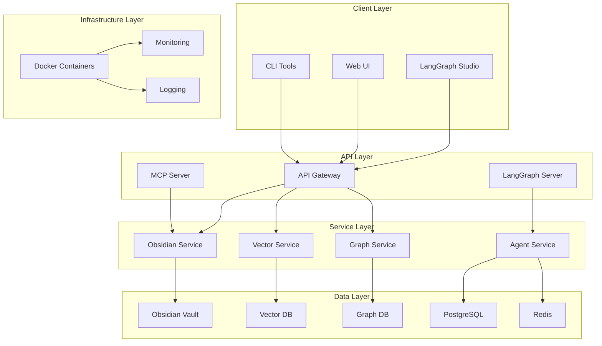

### Design Principles

1. **Local-First**: All operations prioritize local development and fast iteration
2. **Modularity**: Clear separation of concerns with well-defined interfaces
3. **Scalability**: Designed for future cloud migration and horizontal scaling
4. **Observability**: Comprehensive monitoring and tracing throughout
5. **Safety**: Human-in-the-loop approvals and conflict detection
6. **Performance**: Optimized for real-time agent interactions

## Architecture Layers

### 1. Client Layer

**Purpose**: User interfaces and development tools

**Components**:
- **LangGraph Studio**: Visual workflow development and debugging
- **Web UI**: Custom web interface for vault management
- **CLI Tools**: Command-line utilities for automation

**Key Features**:
- Real-time workflow visualization
- Interactive debugging capabilities
- Batch operation support
- Custom dashboard creation

### 2. API Layer

**Purpose**: API endpoints and protocol handling

**Components**:
- **API Gateway**: RESTful API for Obsidian operations
- **MCP Server**: Model Context Protocol implementation
- **LangGraph Server**: Workflow execution engine

**Key Features**:
- RESTful API design
- MCP protocol compliance
- Request/response validation
- Rate limiting and throttling
- Authentication and authorization

### 3. Service Layer

**Purpose**: Business logic and service orchestration

**Components**:
- **Obsidian Service**: Vault operations and file management
- **Vector Service**: Semantic search and retrieval
- **Graph Service**: Relationship mapping and traversal
- **Agent Service**: AI agent coordination and execution

**Key Features**:
- Service discovery and registration
- Load balancing and failover
- Caching and optimization
- Error handling and retry logic

### 4. Data Layer

**Purpose**: Data storage and persistence

**Components**:
- **Obsidian Vault**: Primary file storage
- **Vector DB**: Semantic embeddings and search
- **Graph DB**: Knowledge relationships
- **PostgreSQL**: Structured data and metadata
- **Redis**: Caching and session storage

**Key Features**:
- Data consistency and integrity
- Backup and recovery
- Data migration and versioning
- Performance optimization

### 5. Infrastructure Layer

**Purpose**: System infrastructure and operations

**Components**:
- **Docker Containers**: Containerized services
- **Monitoring**: Metrics and alerting
- **Logging**: Centralized log management

**Key Features**:
- Container orchestration
- Health checks and auto-recovery
- Resource management
- Security hardening

## Component Interactions

### API Gateway Interactions

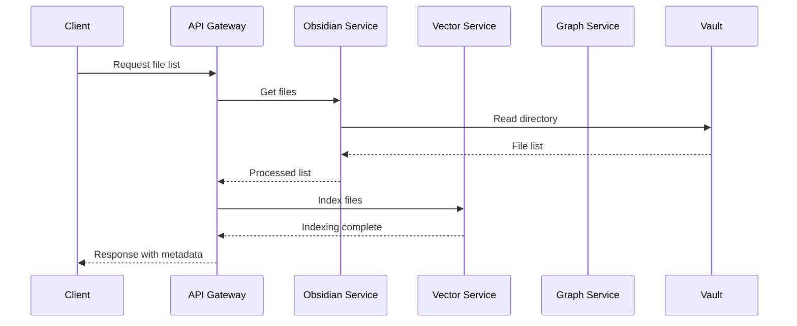

### MCP Tool Interactions

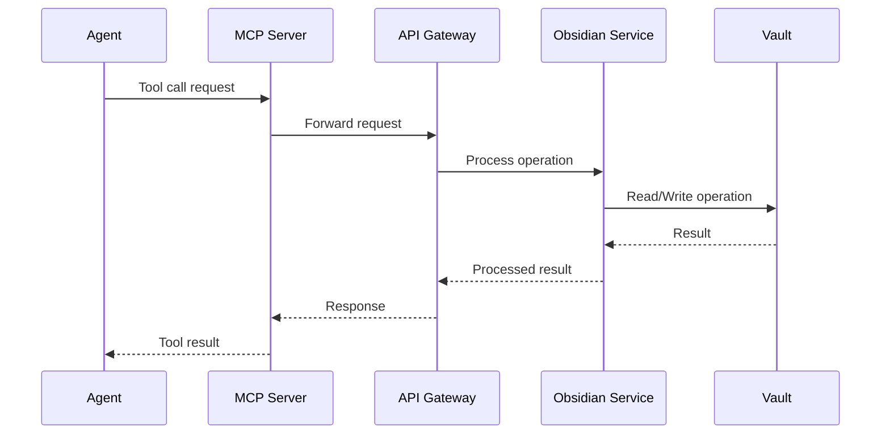

### LangGraph Workflow Interactions

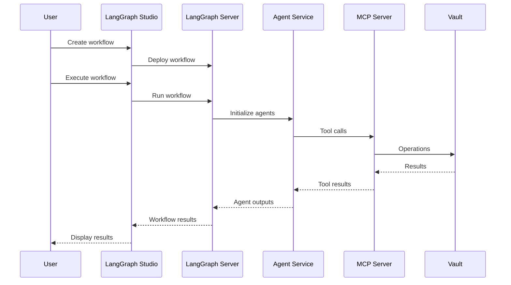

## Data Flow

### 1. File Ingestion Flow

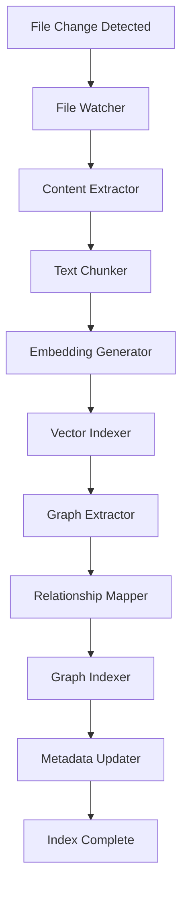

### 2. Search and Retrieval Flow

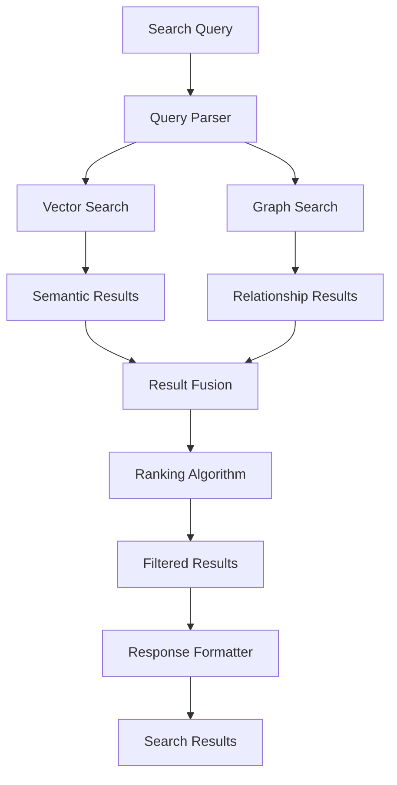

### 3. Agent Workflow Flow

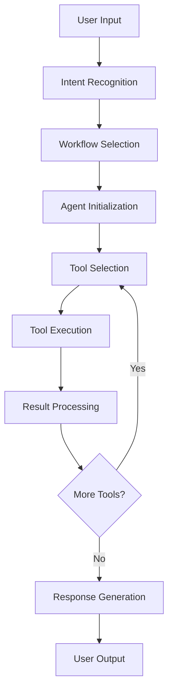

## Security Architecture

### Authentication and Authorization

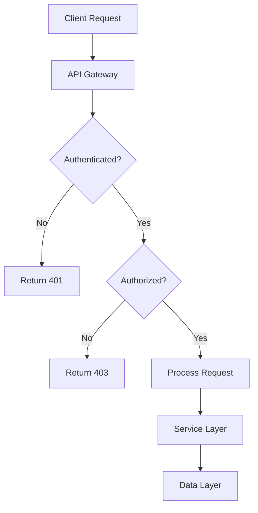

### Security Layers

1. **Network Security**:
   - Localhost binding for sensitive services
   - Container network isolation
   - Firewall configuration

2. **API Security**:
   - API key authentication
   - Rate limiting and throttling
   - Input validation and sanitization

3. **Data Security**:
   - Encryption at rest
   - Secure key management
   - Access control lists

4. **Application Security**:
   - Dry-run by default
   - Human-in-the-loop approvals
   - Conflict detection and resolution

## Deployment Architecture

### Local Development

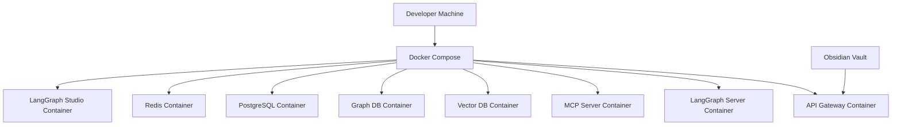

### Production Deployment

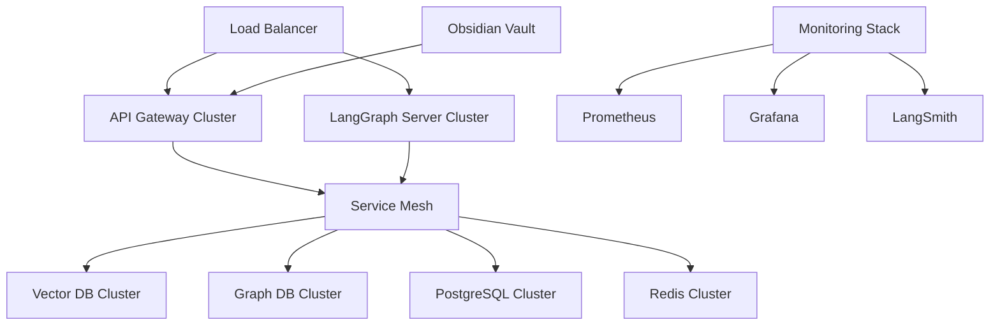

## Monitoring and Observability

### Metrics Collection

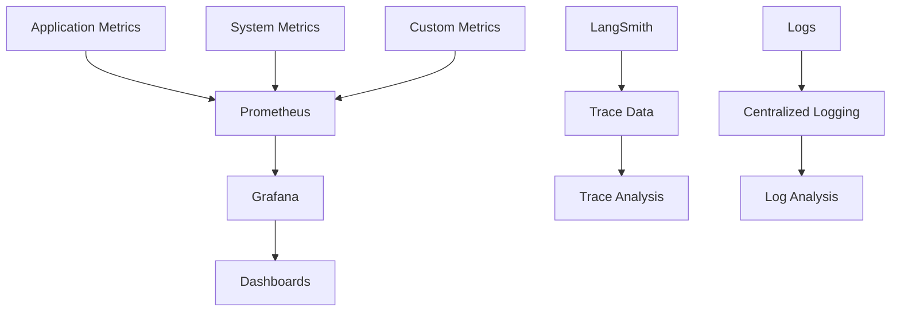

### Key Metrics

1. **Performance Metrics**:
   - Request latency and throughput
   - Tool call success rates
   - Agent execution times
   - Vault operation statistics

2. **Business Metrics**:
   - User activity and engagement
   - Workflow completion rates
   - Search effectiveness
   - Content creation patterns

3. **System Metrics**:
   - Resource utilization
   - Error rates and types
   - Service health status
   - Database performance

## Future Cloud Migration

### Migration Strategy

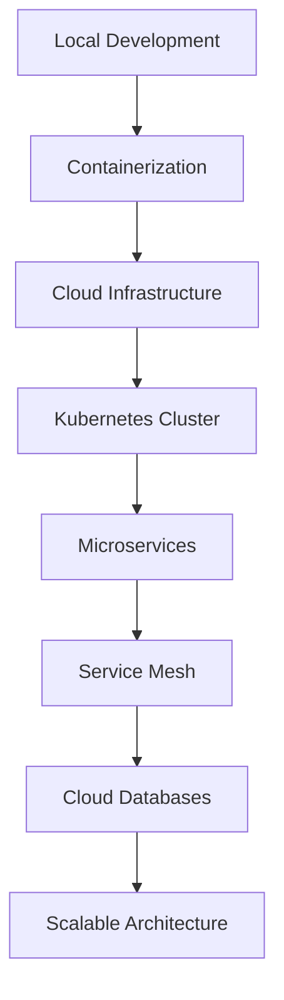

### Migration Phases

1. **Phase 1: Containerization**
   - Docker container optimization
   - Multi-stage builds
   - Resource optimization

2. **Phase 2: Cloud Infrastructure**
   - Kubernetes deployment
   - Service mesh integration
   - Load balancing configuration

3. **Phase 3: Database Migration**
   - Cloud database services
   - Data migration strategies
   - Backup and recovery

4. **Phase 4: Advanced Features**
   - Auto-scaling configuration
   - Multi-region deployment
   - Advanced monitoring

### Cloud Services Mapping

| Component | Local | Cloud |
|-----------|-------|-------|
| API Gateway | FastAPI | AWS API Gateway / Azure API Management |
| LangGraph Server | Docker | Kubernetes / AWS EKS |
| Vector DB | ChromaDB | Pinecone / Weaviate |
| Graph DB | NetworkX | Neo4j AuraDB / Amazon Neptune |
| PostgreSQL | Docker | AWS RDS / Azure Database |
| Redis | Docker | AWS ElastiCache / Azure Cache |
| Monitoring | Prometheus/Grafana | AWS CloudWatch / Azure Monitor |

## Performance Considerations

### Optimization Strategies

1. **Caching**:
   - Redis for session data
   - Application-level caching
   - CDN for static content

2. **Database Optimization**:
   - Indexing strategies
   - Query optimization
   - Connection pooling

3. **API Optimization**:
   - Response compression
   - Pagination
   - Async processing

4. **Agent Optimization**:
   - Tool call batching
   - Parallel execution
   - Context optimization

### Scalability Patterns

1. **Horizontal Scaling**:
   - Stateless services
   - Load balancing
   - Auto-scaling groups

2. **Vertical Scaling**:
   - Resource optimization
   - Performance tuning
   - Memory management

3. **Data Partitioning**:
   - Sharding strategies
   - Read replicas
   - Data distribution

## Conclusion

This architecture provides a robust foundation for the LangGraph + Obsidian Vault Integration System, balancing local development needs with future cloud scalability. The modular design ensures maintainability while the comprehensive monitoring and observability features provide operational excellence.

The system is designed to evolve from a local development environment to a production-ready cloud deployment, with clear migration paths and optimization strategies throughout the journey.
