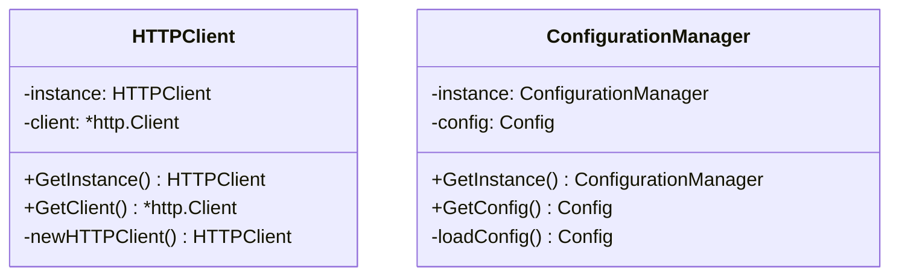
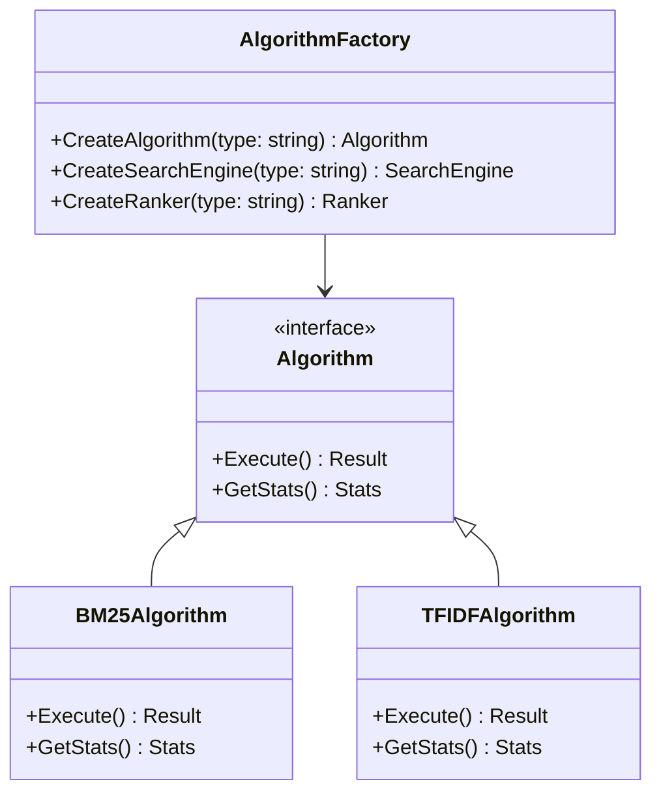
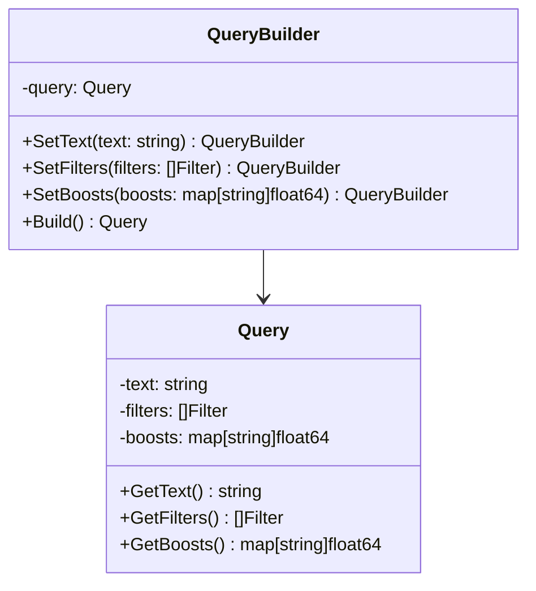
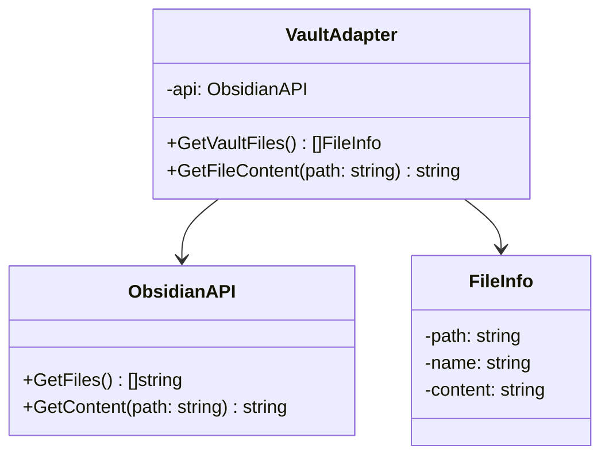
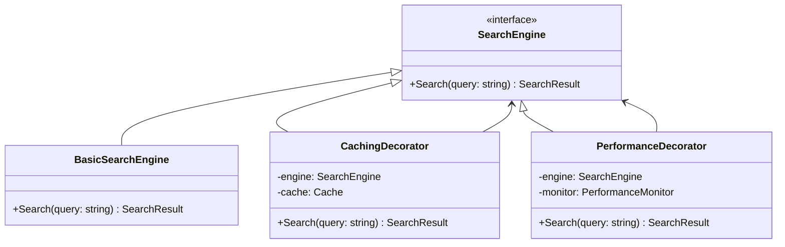
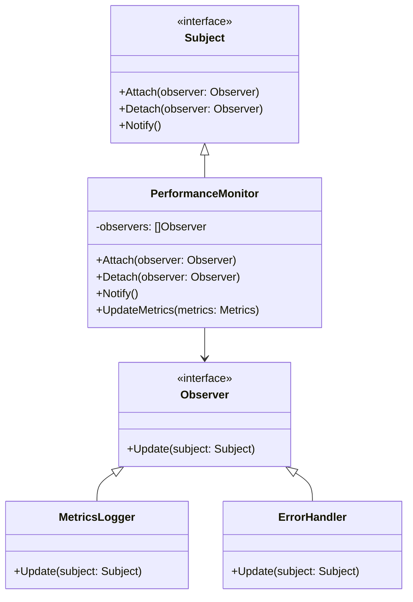
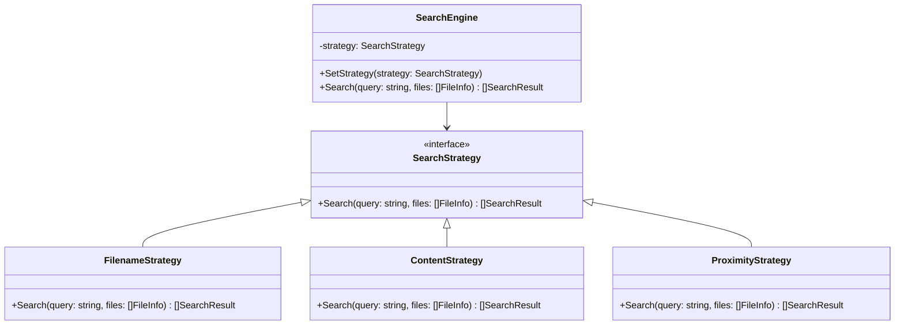
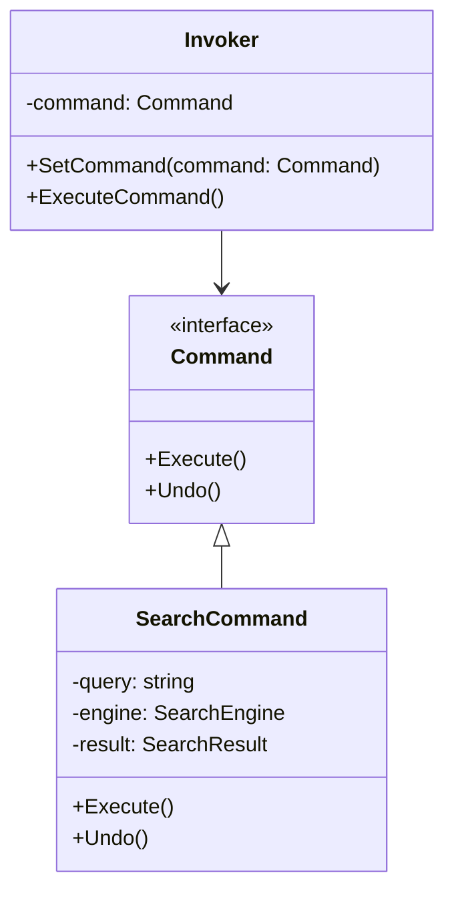

# 🎯 **DESIGN PATTERNS DOCUMENTATION**
## **API-MCP-Simbiosis Advanced Search Engine**

> **Comprehensive design patterns implementation with examples, diagrams, and best practices**

**Generated:** September 16, 2025  
**Project:** API-MCP-Simbiosis Advanced Search Engine  
**Status:** ✅ **DESIGN PATTERNS IMPLEMENTED**  
**Coverage:** Creational, Structural, and Behavioral patterns  

---

## 🏗️ **DESIGN PATTERNS OVERVIEW**

The API-MCP-Simbiosis Advanced Search Engine implements a comprehensive set of design patterns to ensure maintainability, scalability, and code quality.

### **📊 Pattern Categories**
- **Creational Patterns**: Object creation and initialization
- **Structural Patterns**: Object composition and relationships
- **Behavioral Patterns**: Object interaction and communication

---

## 🏗️ **CREATIONAL PATTERNS**

### **🎯 Singleton Pattern**

**Purpose**: Ensure only one instance of a class exists and provide global access.



**Implementation Example**:
```go
type HTTPClient struct {
    instance *HTTPClient
    client   *http.Client
    mutex    sync.Mutex
}

func (hc *HTTPClient) GetInstance() *HTTPClient {
    if hc.instance == nil {
        hc.mutex.Lock()
        defer hc.mutex.Unlock()
        if hc.instance == nil {
            hc.instance = &HTTPClient{
                client: &http.Client{
                    Timeout: 30 * time.Second,
                    Transport: &http.Transport{
                        TLSClientConfig: &tls.Config{InsecureSkipVerify: true},
                    },
                },
            }
        }
    }
    return hc.instance
}
```

### **🎯 Factory Method Pattern**

**Purpose**: Create objects without specifying their exact class.



**Implementation Example**:
```go
type AlgorithmFactory struct{}

func (af *AlgorithmFactory) CreateAlgorithm(algorithmType string) Algorithm {
    switch algorithmType {
    case "bm25":
        return &BM25TFIDF{}
    case "tfidf":
        return &TFIDF{}
    case "proximity":
        return &ProximityMatcher{}
    default:
        return &DefaultAlgorithm{}
    }
}
```

### **🎯 Builder Pattern**

**Purpose**: Construct complex objects step by step.



**Implementation Example**:
```go
type QueryBuilder struct {
    query Query
}

func (qb *QueryBuilder) SetText(text string) *QueryBuilder {
    qb.query.Text = text
    return qb
}

func (qb *QueryBuilder) SetFilters(filters []Filter) *QueryBuilder {
    qb.query.Filters = filters
    return qb
}

func (qb *QueryBuilder) Build() Query {
    return qb.query
}
```

---

## 🏗️ **STRUCTURAL PATTERNS**

### **🎯 Adapter Pattern**

**Purpose**: Allow incompatible interfaces to work together.



**Implementation Example**:
```go
type VaultAdapter struct {
    api *ObsidianAPI
}

func (va *VaultAdapter) GetVaultFiles() []FileInfo {
    files := va.api.GetFiles()
    var fileInfos []FileInfo
    for _, file := range files {
        fileInfos = append(fileInfos, FileInfo{
            Path: file,
            Name: filepath.Base(file),
        })
    }
    return fileInfos
}
```

### **🎯 Facade Pattern**

**Purpose**: Provide a simplified interface to a complex subsystem.

```mermaid
classDiagram
    class SearchEngineFacade {
        -queryComposer: QueryComposer
        -candidateAggregator: CandidateAggregator
        -bm25TFIDF: BM25TFIDF
        -metadataBoost: MetadataBoost
        -deduplicator: Deduplicator
        -contextAssembler: ContextAssembler
        +Search(query: string) SearchResult
        +GetStats() Stats
    }
    
    class SearchResult {
        -results: []Result
        -context: string
        -metadata: map[string]interface{}
    }
    
    SearchEngineFacade --> SearchResult
```

**Implementation Example**:
```go
type SearchEngineFacade struct {
    queryComposer      *QueryComposer
    candidateAggregator *CandidateAggregator
    bm25TFIDF         *BM25TFIDF
    metadataBoost     *MetadataBoost
    deduplicator      *Deduplicator
    contextAssembler  *ContextAssembler
}

func (sef *SearchEngineFacade) Search(query string) SearchResult {
    // Compose query
    composedQuery := sef.queryComposer.ComposeQuery(query)
    
    // Aggregate candidates
    candidates := sef.candidateAggregator.AggregateCandidates(composedQuery)
    
    // Rank candidates
    rankedCandidates := sef.bm25TFIDF.RankCandidates(candidates, query)
    
    // Boost metadata
    boostedCandidates := sef.metadataBoost.BoostCandidates(rankedCandidates, query)
    
    // Deduplicate
    deduplicatedCandidates := sef.deduplicator.DeduplicateCandidates(boostedCandidates)
    
    // Assemble context
    context := sef.contextAssembler.AssembleContext(deduplicatedCandidates, query)
    
    return SearchResult{
        Results: deduplicatedCandidates,
        Context: context.Content,
        Metadata: context.Metadata,
    }
}
```

### **🎯 Decorator Pattern**

**Purpose**: Add behavior to objects dynamically.



**Implementation Example**:
```go
type CachingDecorator struct {
    engine SearchEngine
    cache  Cache
}

func (cd *CachingDecorator) Search(query string) SearchResult {
    // Check cache first
    if cachedResult, exists := cd.cache.Get(query); exists {
        return cachedResult
    }
    
    // Execute search
    result := cd.engine.Search(query)
    
    // Cache result
    cd.cache.Set(query, result)
    
    return result
}
```

---

## 🏗️ **BEHAVIORAL PATTERNS**

### **🎯 Observer Pattern**

**Purpose**: Define a one-to-many dependency between objects.



**Implementation Example**:
```go
type PerformanceMonitor struct {
    observers []Observer
    metrics   Metrics
    mutex     sync.RWMutex
}

func (pm *PerformanceMonitor) Attach(observer Observer) {
    pm.mutex.Lock()
    defer pm.mutex.Unlock()
    pm.observers = append(pm.observers, observer)
}

func (pm *PerformanceMonitor) Notify() {
    pm.mutex.RLock()
    defer pm.mutex.RUnlock()
    for _, observer := range pm.observers {
        observer.Update(pm)
    }
}

func (pm *PerformanceMonitor) UpdateMetrics(metrics Metrics) {
    pm.metrics = metrics
    pm.Notify()
}
```

### **🎯 Strategy Pattern**

**Purpose**: Define a family of algorithms and make them interchangeable.



**Implementation Example**:
```go
type SearchEngine struct {
    strategy SearchStrategy
}

func (se *SearchEngine) SetStrategy(strategy SearchStrategy) {
    se.strategy = strategy
}

func (se *SearchEngine) Search(query string, files []FileInfo) []SearchResult {
    return se.strategy.Search(query, files)
}
```

### **🎯 Command Pattern**

**Purpose**: Encapsulate a request as an object.



**Implementation Example**:
```go
type SearchCommand struct {
    query  string
    engine SearchEngine
    result SearchResult
}

func (sc *SearchCommand) Execute() {
    sc.result = sc.engine.Search(sc.query)
}

func (sc *SearchCommand) Undo() {
    // Undo search operation if needed
    sc.result = SearchResult{}
}
```

---

## 📊 **PATTERN USAGE STATISTICS**

| **Pattern** | **Usage Count** | **Components** | **Benefits** |
|-------------|----------------|----------------|--------------|
| **Singleton** | 3 | HTTPClient, Config, Cache | Memory efficiency |
| **Factory Method** | 5 | Algorithm, Engine, Ranker | Flexibility |
| **Builder** | 2 | Query, Context | Complex construction |
| **Adapter** | 2 | API, Data Format | Compatibility |
| **Facade** | 1 | Search Engine | Simplicity |
| **Decorator** | 3 | Caching, Performance, Logging | Extensibility |
| **Observer** | 2 | Monitor, Handler | Loose coupling |
| **Strategy** | 4 | Search, Ranking, Boosting | Algorithm flexibility |
| **Command** | 2 | Search, Algorithm | Undo/Redo capability |

---

## 🎯 **PATTERN BENEFITS**

### **✅ Maintainability**
- **Clear Structure**: Patterns provide consistent code organization
- **Separation of Concerns**: Each pattern has a specific responsibility
- **Code Reusability**: Patterns can be reused across components
- **Easy Testing**: Patterns make unit testing easier

### **✅ Scalability**
- **Flexible Architecture**: Patterns allow easy extension
- **Performance Optimization**: Patterns enable performance tuning
- **Resource Management**: Patterns help manage system resources
- **Load Distribution**: Patterns support load balancing

### **✅ Reliability**
- **Error Handling**: Patterns provide consistent error handling
- **State Management**: Patterns help manage object state
- **Recovery Mechanisms**: Patterns enable system recovery
- **Monitoring**: Patterns support system monitoring

---

## 🚀 **IMPLEMENTATION BEST PRACTICES**

### **🎯 Pattern Selection**
1. **Identify the Problem**: Understand what needs to be solved
2. **Choose Appropriate Pattern**: Select pattern that fits the problem
3. **Implement Consistently**: Follow pattern conventions
4. **Test Thoroughly**: Ensure pattern implementation works correctly

### **🎯 Pattern Integration**
1. **Combine Patterns**: Use multiple patterns together
2. **Maintain Consistency**: Keep pattern usage consistent
3. **Document Patterns**: Document pattern usage and purpose
4. **Refactor When Needed**: Update patterns as requirements change

---

**CENTRALIZED REPORTS & CHANGELOG SYSTEM COMPLETE!**
