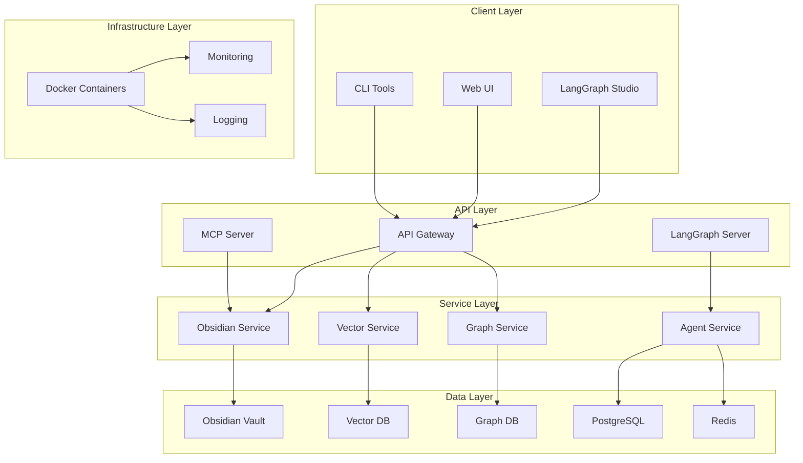
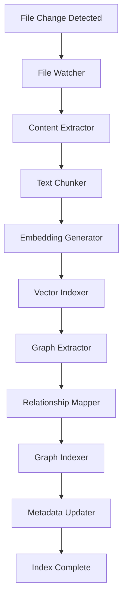
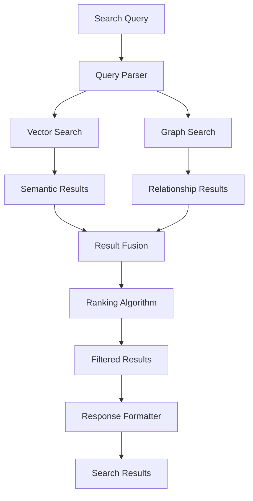
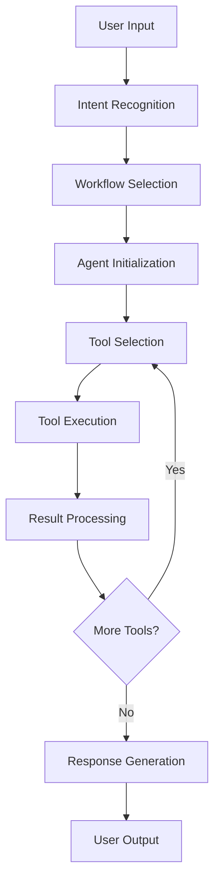
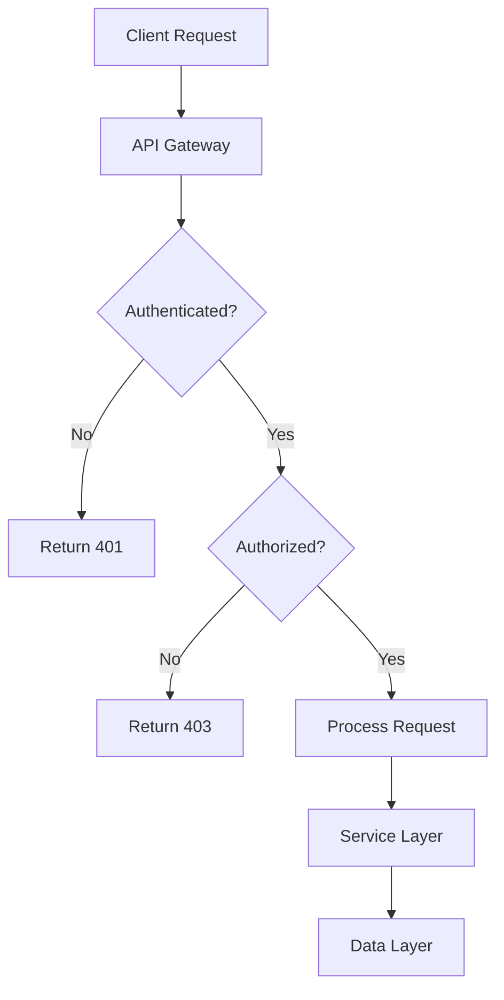
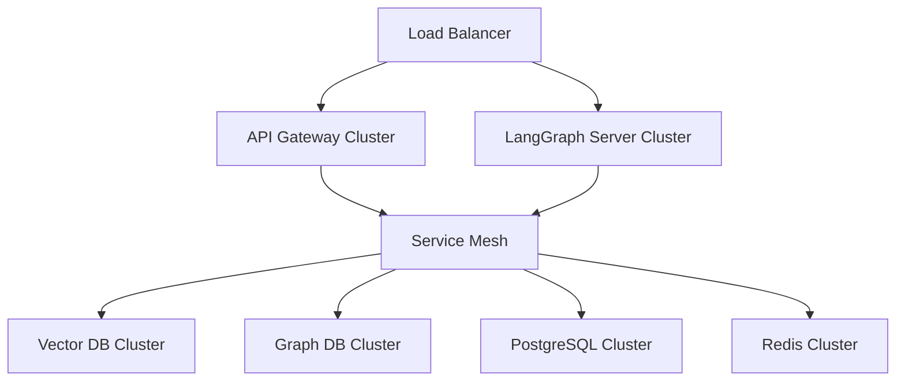
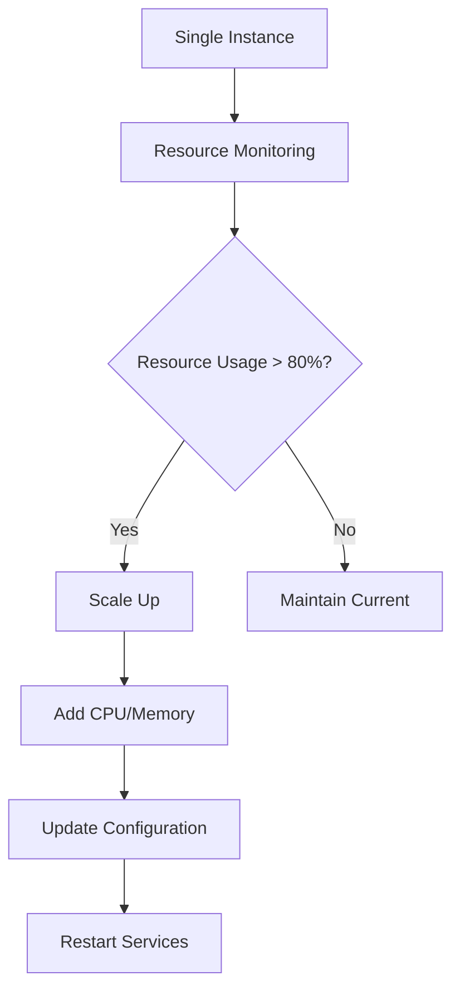
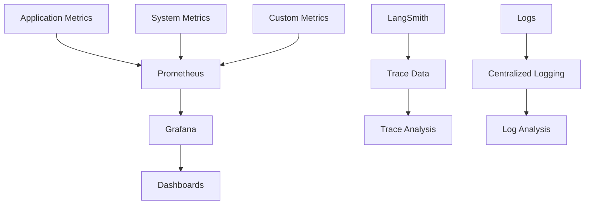
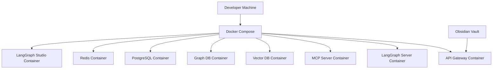
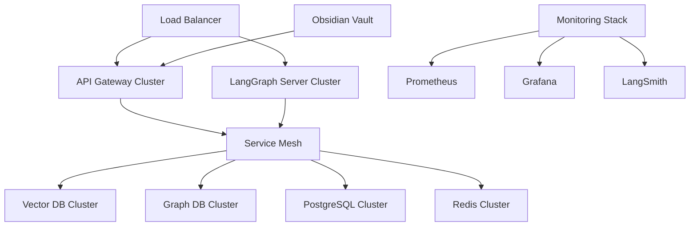

# System Design Document

## Executive Summary

The LangGraph + Obsidian Vault Integration System is a comprehensive hybrid backend architecture that combines AI pipelines, agentic automations, and local file-based workflows. The system leverages LangGraph for workflow orchestration, Model Context Protocol (MCP) for tool integration, and Obsidian Vault for content management, providing a powerful platform for AI-driven content creation and management.

## Table of Contents

1. [System Overview](#system-overview)
2. [Architecture Design](#architecture-design)
3. [Component Specifications](#component-specifications)
4. [Data Flow Design](#data-flow-design)
5. [Security Architecture](#security-architecture)
6. [Performance Requirements](#performance-requirements)
7. [Scalability Design](#scalability-design)
8. [Monitoring and Observability](#monitoring-and-observability)
9. [Deployment Strategy](#deployment-strategy)
10. [Future Roadmap](#future-roadmap)

## System Overview

### Purpose and Goals

The system is designed to:

1. **Enable AI-Driven Content Management**: Provide intelligent content creation, organization, and retrieval capabilities
2. **Support Local-First Development**: Prioritize local development with fast iteration cycles
3. **Ensure Future-Proof Cloud Migration**: Design for seamless transition to cloud deployment
4. **Maximize MCP-Driven Automation**: Leverage Model Context Protocol for tool integration
5. **Provide Comprehensive Observability**: Ensure system reliability through monitoring and tracing

### Key Features

- **Multi-Agent Workflows**: LangGraph-powered agent orchestration
- **MCP Tool Integration**: Standardized tool interface for LLM interactions
- **Hybrid Data Pipeline**: Vector and graph database integration
- **Human-in-the-Loop**: Approval workflows for critical operations
- **Real-time Monitoring**: LangSmith tracing and comprehensive metrics
- **Local-First Architecture**: Docker-based development environment

## Architecture Design

### High-Level Architecture



### Design Principles

1. **Modularity**: Clear separation of concerns with well-defined interfaces
2. **Scalability**: Horizontal and vertical scaling capabilities
3. **Reliability**: Fault tolerance and error recovery mechanisms
4. **Security**: Comprehensive security measures and access controls
5. **Observability**: Full system visibility through monitoring and tracing
6. **Performance**: Optimized for real-time agent interactions

## Component Specifications

### API Gateway

**Purpose**: Central entry point for all API requests

**Responsibilities**:
- Request routing and load balancing
- Authentication and authorization
- Rate limiting and throttling
- Request/response validation
- Error handling and logging

**Key Endpoints**:
- `GET /vaults` - List available vaults
- `GET /vault/{vault}/files` - List files in vault
- `GET /vault/{vault}/file/{path}` - Read specific file
- `PUT /vault/{vault}/file/{path}` - Create/update file
- `POST /vault/{vault}/search` - Search notes
- `GET /health` - Health check

**Technology Stack**:
- FastAPI for REST API framework
- Pydantic for data validation
- Uvicorn for ASGI server
- httpx for HTTP client

### MCP Server

**Purpose**: Model Context Protocol implementation for tool integration

**Responsibilities**:
- Tool registration and discovery
- Tool execution and result formatting
- Error handling and validation
- Tool chaining and composition
- Security and access control

**Key Tools**:
- `obsidian_read_note` - Read note content
- `obsidian_put_file` - Create/update files
- `obsidian_search_notes` - Search functionality
- `obsidian_list_files` - List files with pagination
- `obsidian_patch_file` - Patch file content
- `obsidian_delete_file` - Delete files

**Technology Stack**:
- FastMCP for MCP server framework
- Pydantic for data models
- httpx for HTTP client
- asyncio for async operations

### LangGraph Server

**Purpose**: Workflow orchestration and agent management

**Responsibilities**:
- Workflow definition and execution
- Agent state management
- Tool call coordination
- Human-in-the-loop integration
- Checkpointing and recovery

**Key Workflows**:
- **Read Workflow**: Information retrieval and file listing
- **Write Workflow**: Content creation with HITL approval
- **Search Workflow**: Advanced search and filtering
- **Organize Workflow**: File categorization and management
- **Analyze Workflow**: Vault statistics and insights

**Technology Stack**:
- LangGraph for workflow framework
- LangChain for LLM integration
- PostgreSQL for state persistence
- Redis for caching

### Data Services

#### Vector Service
**Purpose**: Semantic search and retrieval

**Responsibilities**:
- Document embedding generation
- Vector similarity search
- Index management and optimization
- Query processing and ranking

**Technology Stack**:
- ChromaDB for vector storage
- OpenAI embeddings for text encoding
- FAISS for similarity search
- NumPy for numerical operations

#### Graph Service
**Purpose**: Knowledge relationship mapping

**Responsibilities**:
- Entity extraction and linking
- Relationship graph construction
- Graph traversal and querying
- Knowledge inference

**Technology Stack**:
- NetworkX for graph operations
- Neo4j for graph database (optional)
- spaCy for NLP processing
- NetworkX for graph algorithms

## Data Flow Design

### File Ingestion Flow



### Search and Retrieval Flow



### Agent Workflow Flow



## Security Architecture

### Authentication and Authorization



### Security Layers

1. **Network Security**:
   - Localhost binding for sensitive services
   - Container network isolation
   - Firewall configuration

2. **API Security**:
   - API key authentication
   - Rate limiting and throttling
   - Input validation and sanitization

3. **Data Security**:
   - Encryption at rest
   - Secure key management
   - Access control lists

4. **Application Security**:
   - Dry-run by default
   - Human-in-the-loop approvals
   - Conflict detection and resolution

## Performance Requirements

### Response Time Targets

| Operation | Target | Maximum |
|-----------|--------|---------|
| API Gateway Health Check | < 100ms | 200ms |
| File Read Operation | < 500ms | 1s |
| File Write Operation | < 1s | 2s |
| Search Operation | < 2s | 5s |
| Agent Workflow Execution | < 10s | 30s |

### Throughput Targets

| Operation | Target | Maximum |
|-----------|--------|---------|
| Concurrent Users | 100 | 500 |
| API Requests per Second | 1000 | 5000 |
| File Operations per Second | 100 | 500 |
| Search Queries per Second | 50 | 200 |

### Resource Utilization

| Resource | Target | Maximum |
|----------|--------|---------|
| CPU Usage | 70% | 90% |
| Memory Usage | 80% | 95% |
| Disk I/O | 70% | 90% |
| Network I/O | 60% | 80% |

## Scalability Design

### Horizontal Scaling



### Vertical Scaling



### Auto-Scaling Configuration

```yaml
# Kubernetes HPA configuration
apiVersion: autoscaling/v2
kind: HorizontalPodAutoscaler
metadata:
  name: api-gateway-hpa
spec:
  scaleTargetRef:
    apiVersion: apps/v1
    kind: Deployment
    name: api-gateway
  minReplicas: 3
  maxReplicas: 10
  metrics:
  - type: Resource
    resource:
      name: cpu
      target:
        type: Utilization
        averageUtilization: 70
  - type: Resource
    resource:
      name: memory
      target:
        type: Utilization
        averageUtilization: 80
```

## Monitoring and Observability

### Metrics Collection



### Key Metrics

1. **Performance Metrics**:
   - Request latency and throughput
   - Tool call success rates
   - Agent execution times
   - Vault operation statistics

2. **Business Metrics**:
   - User activity and engagement
   - Workflow completion rates
   - Search effectiveness
   - Content creation patterns

3. **System Metrics**:
   - Resource utilization
   - Error rates and types
   - Service health status
   - Database performance

### Alerting Rules

```yaml
# Prometheus alerting rules
groups:
- name: langgraph-obsidian
  rules:
  - alert: HighErrorRate
    expr: rate(http_requests_total{status=~"5.."}[5m]) > 0.1
    for: 5m
    labels:
      severity: critical
    annotations:
      summary: "High error rate detected"
      description: "Error rate is {{ $value }} errors per second"
  
  - alert: HighLatency
    expr: histogram_quantile(0.95, rate(http_request_duration_seconds_bucket[5m])) > 2
    for: 5m
    labels:
      severity: warning
    annotations:
      summary: "High latency detected"
      description: "95th percentile latency is {{ $value }} seconds"
  
  - alert: ServiceDown
    expr: up == 0
    for: 1m
    labels:
      severity: critical
    annotations:
      summary: "Service is down"
      description: "{{ $labels.instance }} is down"
```

## Deployment Strategy

### Local Development



### Production Deployment



### Cloud Migration Strategy

1. **Phase 1: Containerization**
   - Docker container optimization
   - Multi-stage builds
   - Resource optimization

2. **Phase 2: Cloud Infrastructure**
   - Kubernetes deployment
   - Service mesh integration
   - Load balancing configuration

3. **Phase 3: Database Migration**
   - Cloud database services
   - Data migration strategies
   - Backup and recovery

4. **Phase 4: Advanced Features**
   - Auto-scaling configuration
   - Multi-region deployment
   - Advanced monitoring

## Future Roadmap

### Short-term (3-6 months)

1. **Enhanced MCP Tools**:
   - Advanced search capabilities
   - Batch operations
   - Custom tool development

2. **Improved Workflows**:
   - More sophisticated agent patterns
   - Better error handling
   - Enhanced human-in-the-loop features

3. **Performance Optimization**:
   - Caching strategies
   - Database optimization
   - API performance tuning

### Medium-term (6-12 months)

1. **Cloud Migration**:
   - Kubernetes deployment
   - Cloud database integration
   - Multi-region support

2. **Advanced Features**:
   - Real-time collaboration
   - Advanced analytics
   - Custom dashboard creation

3. **Integration Expansion**:
   - Additional MCP servers
   - Third-party integrations
   - API ecosystem development

### Long-term (12+ months)

1. **AI Enhancement**:
   - Advanced LLM integration
   - Custom model training
   - Intelligent automation

2. **Platform Evolution**:
   - Multi-tenant architecture
   - Enterprise features
   - Global deployment

3. **Ecosystem Development**:
   - Plugin marketplace
   - Community contributions
   - Open source expansion

## Conclusion

The LangGraph + Obsidian Vault Integration System represents a comprehensive solution for AI-driven content management and automation. The modular architecture, comprehensive security measures, and robust monitoring capabilities ensure reliable operation while providing a foundation for future growth and expansion.

The system's design principles of modularity, scalability, and observability make it well-suited for both local development and production deployment. The clear migration path to cloud deployment ensures long-term viability and growth potential.

By following this system design, developers and operators can build, deploy, and maintain a powerful AI-driven content management system that meets current needs while providing a clear path for future evolution and enhancement.
