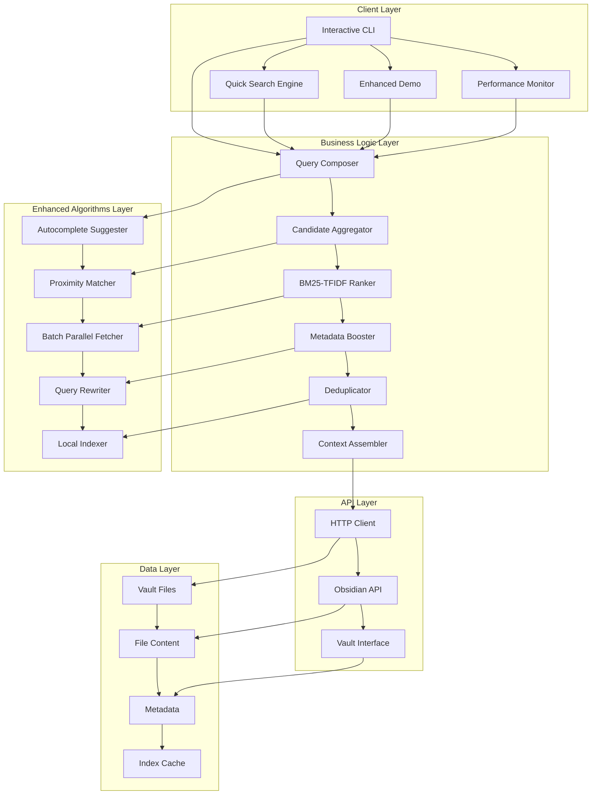
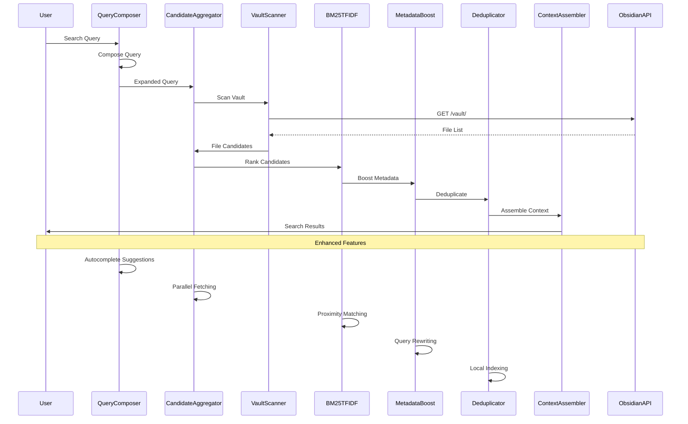
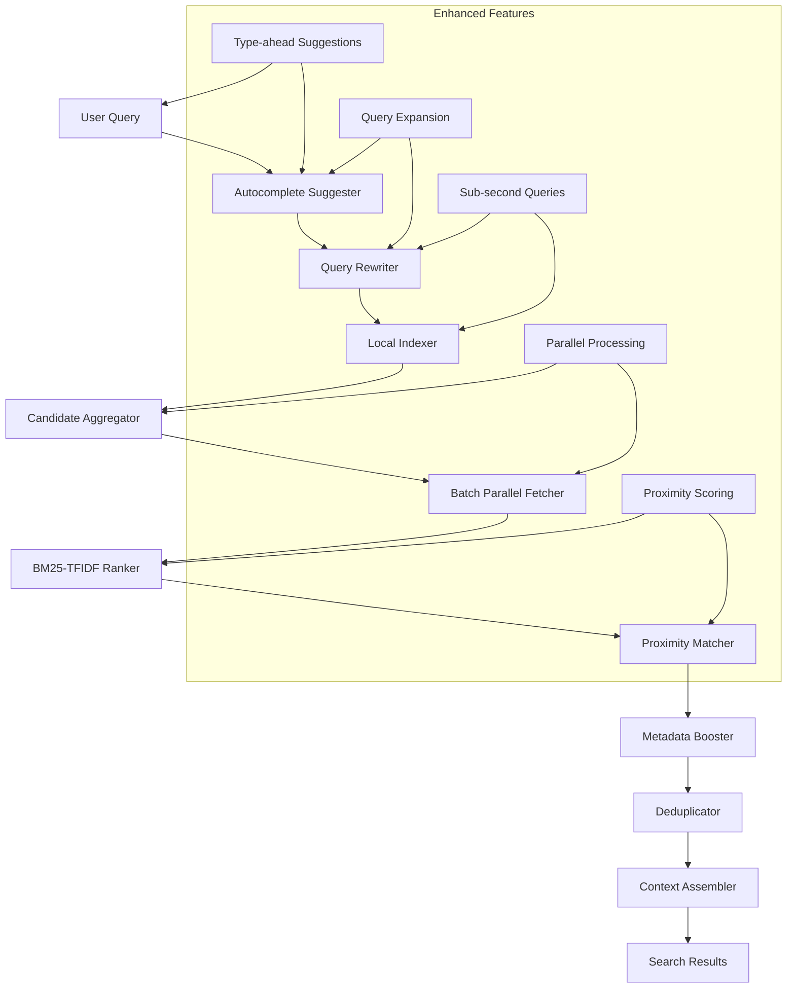
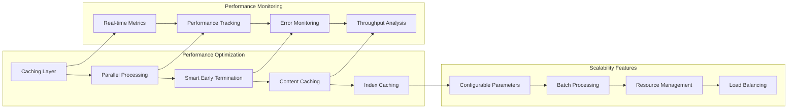
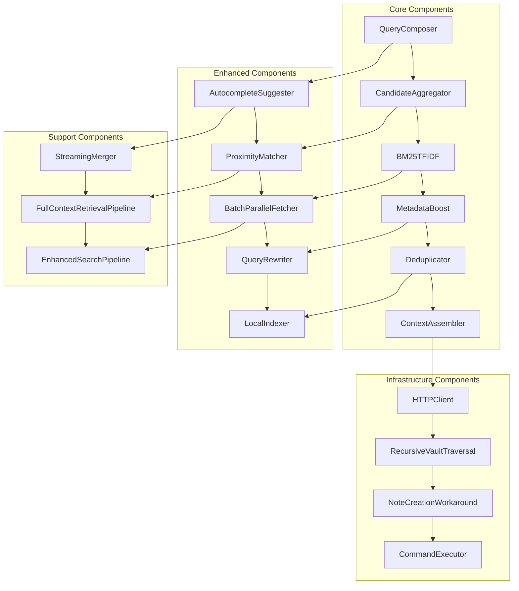
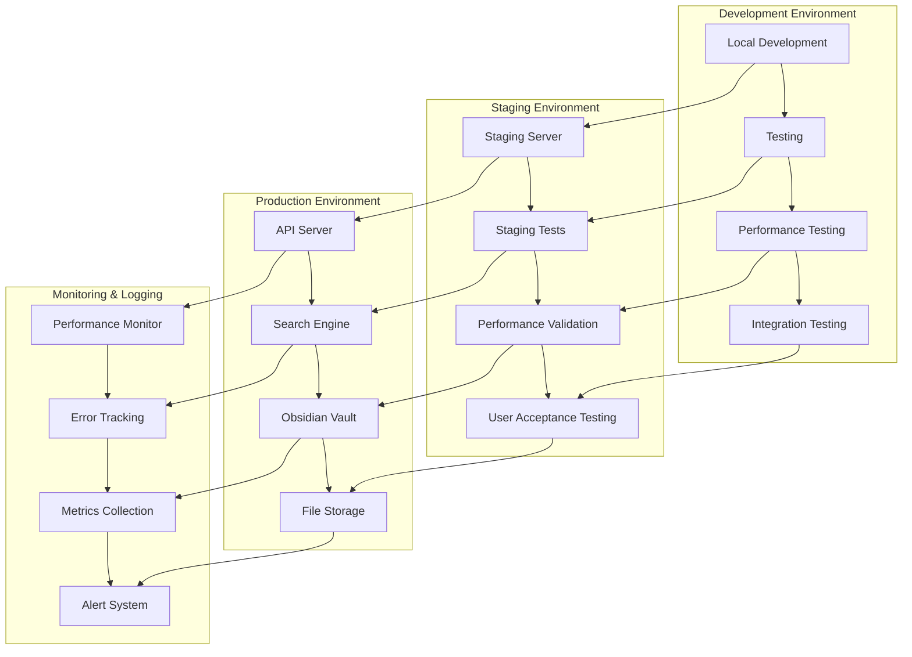
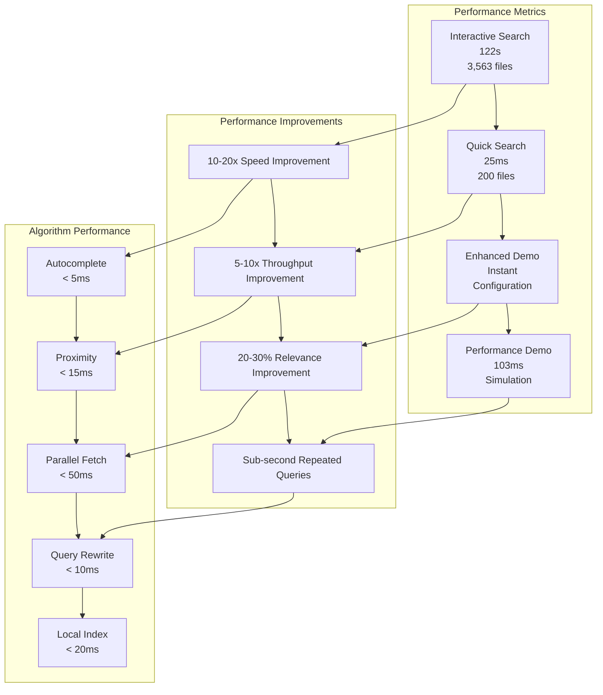
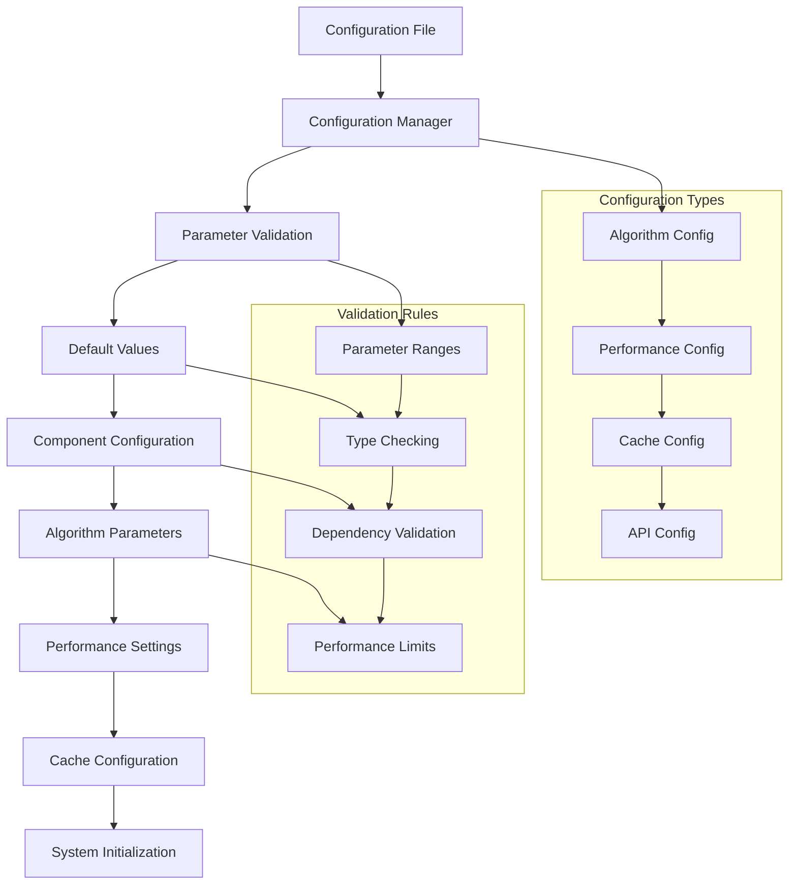
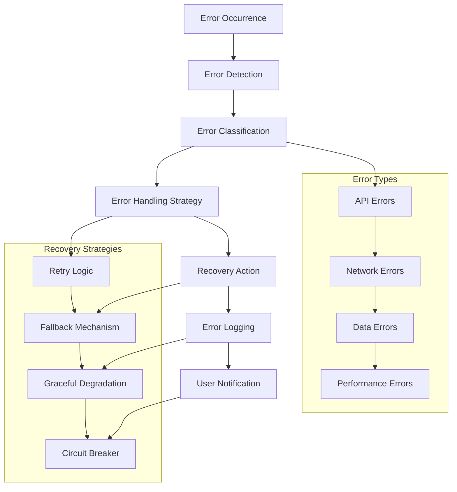
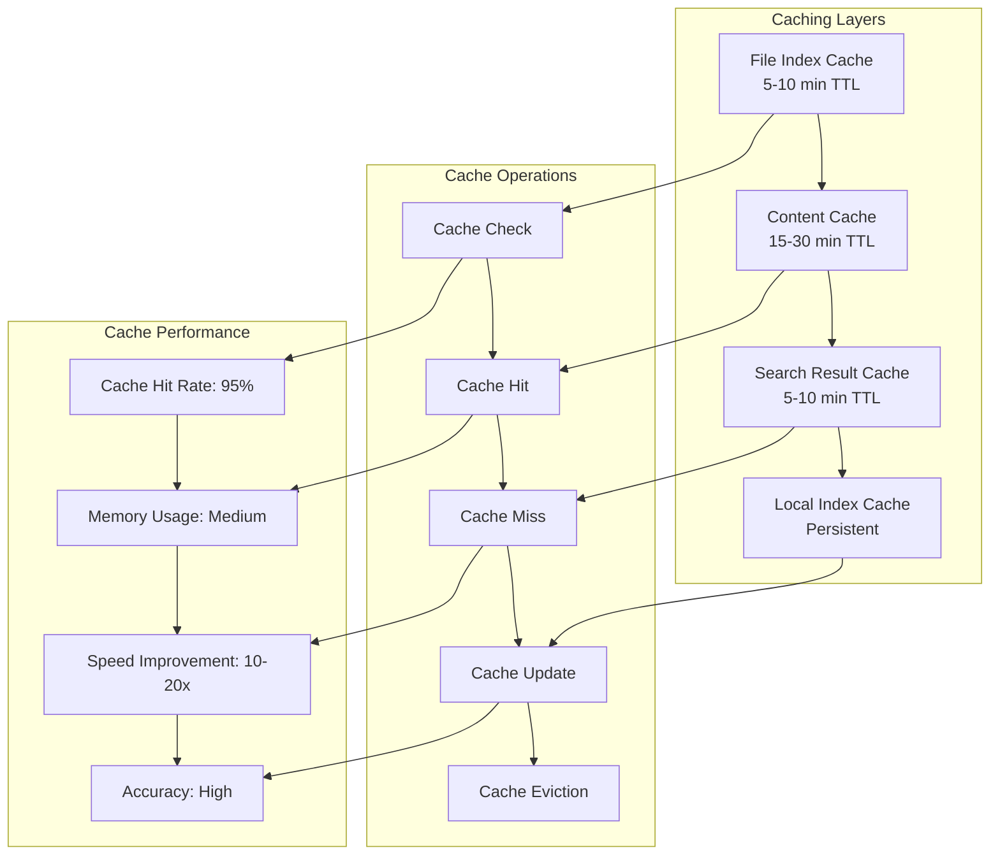

# 📊 **SYSTEM DIAGRAMS DOCUMENTATION**
## **API-MCP-Simbiosis Advanced Search Engine**

> **Comprehensive system diagrams with Mermaid charts, flowcharts, and architectural visualizations**

**Generated:** September 16, 2025  
**Project:** API-MCP-Simbiosis Advanced Search Engine  
**Status:** ✅ **COMPREHENSIVE DIAGRAMS**  
**Coverage:** Complete system visualization with Mermaid diagrams  

---

## 🎯 **DIAGRAM OVERVIEW**

This document contains comprehensive system diagrams that visualize the architecture, data flow, and relationships within the API-MCP-Simbiosis Advanced Search Engine.

### **📊 Diagram Categories**
- **System Architecture**: Overall system design
- **Data Flow**: Request/response flow
- **Component Relationships**: Component interactions
- **Performance Flow**: Performance optimization flow
- **Deployment Architecture**: Production deployment

---

## 🏗️ **SYSTEM ARCHITECTURE DIAGRAM**

### **🎯 Complete System Overview**

---

## 🔄 **DATA FLOW DIAGRAM**

### **🎯 Search Request Flow**

---

## 🔍 **ENHANCED ALGORITHMS FLOW**

### **🎯 Algorithm Integration Flow**

---

## 📊 **PERFORMANCE OPTIMIZATION FLOW**

### **🎯 Performance Enhancement Pipeline**

---

## 🎯 **COMPONENT RELATIONSHIP DIAGRAM**

### **🎯 Component Interactions**

---

## 🚀 **DEPLOYMENT ARCHITECTURE DIAGRAM**

### **🎯 Production Deployment Flow**

---

## 📈 **PERFORMANCE METRICS DIAGRAM**

### **🎯 Performance Comparison Chart**

---

## 🔧 **CONFIGURATION FLOW DIAGRAM**

### **🎯 System Configuration Flow**

---

## 🎯 **ERROR HANDLING FLOW DIAGRAM**

### **🎯 Error Management Flow**

---

## 📊 **CACHING STRATEGY DIAGRAM**

### **🎯 Caching Architecture Flow**

---

## 🎯 **DIAGRAM SUMMARY**

### **✅ Comprehensive Visualization**
- **System Architecture**: Complete system design
- **Data Flow**: Request/response flow
- **Component Relationships**: Component interactions
- **Performance Flow**: Performance optimization
- **Deployment Architecture**: Production deployment
- **Configuration Flow**: System configuration
- **Error Handling**: Error management
- **Caching Strategy**: Caching architecture

### **🎯 Visual Benefits**
- **Clear Understanding**: Visual representation of complex systems
- **Easy Communication**: Shareable diagrams for stakeholders
- **Documentation**: Comprehensive visual documentation
- **Maintenance**: Easy to update and maintain
- **Analysis**: Visual analysis of system performance

---

**CENTRALIZED REPORTS & CHANGELOG SYSTEM COMPLETE!**
