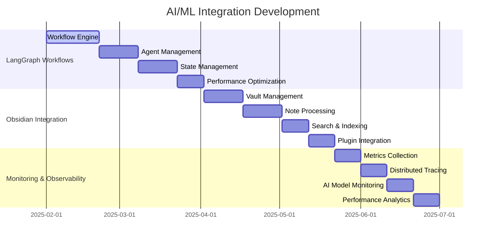

# 🤖 **AI/ML INTEGRATION ROADMAP**

**Version:** 3.0.0  
**Last Updated:** September 6, 2025  
**Status:** ✅ **AI/ML INTEGRATION STRATEGY**

---

## 🎯 **AI/ML INTEGRATION OVERVIEW**

This roadmap outlines the strategic implementation of AI/ML integration patterns that enable intelligent automation, workflow orchestration, and advanced analytics in the Data Vault Obsidian platform.

### **AI/ML Integration Goals**

- **Intelligent Automation** - AI-powered workflow automation and decision making
- **Advanced Analytics** - Machine learning-driven insights and predictions
- **Natural Language Processing** - Conversational interfaces and content understanding
- **Computer Vision** - Image and document analysis capabilities
- **Predictive Intelligence** - Proactive system optimization and recommendations
- **Scalable AI Infrastructure** - Support for multiple AI models and frameworks

---

## 📊 **AI/ML INTEGRATION TIMELINE**



---

## 🏗️ **PHASE 1: LANGGRAPH WORKFLOW PATTERNS**

### **1.1 Workflow Engine Foundation (Weeks 1-3)**

#### **Implementation Strategy**
```python
# LangGraph Workflow Engine
class LangGraphWorkflowEngine:
    def __init__(self, workflow_config: dict):
        self.config = workflow_config
        self.workflows = {}
        self.active_instances = {}
        self.state_manager = WorkflowStateManager()
        self.execution_engine = WorkflowExecutionEngine()
        self.model_manager = AIModelManager()
    
    async def define_workflow(self, workflow_name: str, definition: dict):
        """Define new LangGraph workflow"""
        workflow = {
            'name': workflow_name,
            'nodes': definition.get('nodes', []),
            'edges': definition.get('edges', []),
            'state_schema': definition.get('state_schema', {}),
            'ai_models': definition.get('ai_models', []),
            'created_at': datetime.utcnow()
        }
        
        # Validate workflow definition
        await self.validate_workflow(workflow)
        
        self.workflows[workflow_name] = workflow
        return workflow_name
    
    async def execute_workflow(self, workflow_name: str, initial_state: dict) -> dict:
        """Execute LangGraph workflow with AI integration"""
        if workflow_name not in self.workflows:
            raise WorkflowNotFoundError(f"Workflow {workflow_name} not found")
        
        workflow = self.workflows[workflow_name]
        instance_id = str(uuid.uuid4())
        
        # Create workflow instance
        instance = WorkflowInstance(
            id=instance_id,
            workflow_name=workflow_name,
            state=initial_state,
            current_node=workflow['nodes'][0]['name'] if workflow['nodes'] else None,
            status='running',
            created_at=datetime.utcnow()
        )
        
        self.active_instances[instance_id] = instance
        
        try:
            # Execute workflow
            result = await self.execution_engine.execute(instance, workflow)
            instance.status = 'completed'
            instance.result = result
        except Exception as e:
            instance.status = 'failed'
            instance.error = str(e)
            raise e
        finally:
            # Save final state
            await self.state_manager.save_instance(instance)
        
        return result

# Workflow State Management
class WorkflowStateManager:
    def __init__(self, storage_backend):
        self.storage = storage_backend
        self.state_cache = {}
        self.state_schemas = {}
    
    async def save_state(self, instance_id: str, state: dict):
        """Save workflow state with versioning"""
        state_version = await self.get_next_version(instance_id)
        
        state_data = {
            'instance_id': instance_id,
            'version': state_version,
            'state': state,
            'timestamp': datetime.utcnow(),
            'checksum': self.calculate_checksum(state)
        }
        
        await self.storage.save_state(state_data)
        self.state_cache[f"{instance_id}:{state_version}"] = state
    
    async def load_state(self, instance_id: str, version: int = None) -> dict:
        """Load workflow state by version"""
        if version is None:
            version = await self.get_latest_version(instance_id)
        
        cache_key = f"{instance_id}:{version}"
        if cache_key in self.state_cache:
            return self.state_cache[cache_key]
        
        state_data = await self.storage.load_state(instance_id, version)
        if state_data:
            self.state_cache[cache_key] = state_data['state']
            return state_data['state']
        
        return {}

# AI Model Integration
class AIModelManager:
    def __init__(self, model_configs: dict):
        self.models = {}
        self.model_pools = {}
        self.load_balancer = ModelLoadBalancer()
        
        # Initialize models
        for model_name, config in model_configs.items():
            self.models[model_name] = await self.initialize_model(model_name, config)
    
    async def initialize_model(self, model_name: str, config: dict):
        """Initialize AI model with configuration"""
        model_type = config.get('type', 'llm')
        
        if model_type == 'llm':
            return await self.initialize_llm_model(model_name, config)
        elif model_type == 'embedding':
            return await self.initialize_embedding_model(model_name, config)
        elif model_type == 'classification':
            return await self.initialize_classification_model(model_name, config)
        else:
            raise UnsupportedModelTypeError(f"Model type {model_type} not supported")
    
    async def call_model(self, model_name: str, input_data: dict, 
                        context: dict = None) -> dict:
        """Call AI model with input data"""
        if model_name not in self.models:
            raise ModelNotFoundError(f"Model {model_name} not found")
        
        model = self.models[model_name]
        
        # Add context if provided
        if context:
            input_data['context'] = context
        
        # Call model with load balancing
        result = await self.load_balancer.call_model(model, input_data)
        
        # Log model usage
        await self.log_model_usage(model_name, input_data, result)
        
        return result
```

#### **Success Metrics**
- Workflow execution time < 2 seconds
- 99.5% workflow completion rate
- Support for 100+ concurrent workflows
- AI model response time < 500ms

#### **Deliverables**
- LangGraph Workflow Engine
- Workflow State Management
- AI Model Integration
- Workflow Definition Language
- Execution Engine
- Performance Monitoring

### **1.2 Agent Management System (Weeks 4-5)**

#### **Implementation Strategy**
```python
# Agent Management System
class AgentManager:
    def __init__(self, agent_configs: dict):
        self.agents = {}
        self.agent_pool = AgentPool()
        self.coordinator = AgentCoordinator()
        self.communication_protocol = AgentCommunicationProtocol()
        self.task_scheduler = AgentTaskScheduler()
    
    async def create_agent(self, agent_type: str, config: dict) -> str:
        """Create new AI agent instance"""
        agent_id = str(uuid.uuid4())
        
        agent = AIAgent(
            id=agent_id,
            type=agent_type,
            config=config,
            capabilities=config.get('capabilities', []),
            status='idle',
            created_at=datetime.utcnow()
        )
        
        # Initialize agent based on type
        await self.initialize_agent(agent)
        
        self.agents[agent_id] = agent
        await self.agent_pool.add_agent(agent)
        
        return agent_id
    
    async def initialize_agent(self, agent: AIAgent):
        """Initialize agent with specific capabilities"""
        agent_type = agent.type
        
        if agent_type == 'conversational':
            agent.model = await self.load_conversational_model(agent.config)
            agent.memory = ConversationMemory()
        elif agent_type == 'analytical':
            agent.model = await self.load_analytical_model(agent.config)
            agent.tools = AnalyticalTools()
        elif agent_type == 'creative':
            agent.model = await self.load_creative_model(agent.config)
            agent.imagination = CreativeImagination()
        else:
            raise UnsupportedAgentTypeError(f"Agent type {agent_type} not supported")
    
    async def coordinate_agents(self, task: dict) -> dict:
        """Coordinate multiple agents for complex task"""
        task_requirements = task.get('requirements', [])
        available_agents = await self.agent_pool.get_available_agents()
        
        # Select agents based on requirements
        selected_agents = await self.select_agents_for_task(
            task_requirements, available_agents
        )
        
        if not selected_agents:
            raise NoSuitableAgentsError("No suitable agents found for task")
        
        # Create coordination plan
        coordination_plan = await self.coordinator.create_plan(
            task, selected_agents
        )
        
        # Execute coordinated task
        result = await self.execute_coordinated_task(coordination_plan)
        
        return result

# AI Agent Base Class
class AIAgent:
    def __init__(self, id: str, type: str, config: dict, 
                 capabilities: list, status: str = 'idle'):
        self.id = id
        self.type = type
        self.config = config
        self.capabilities = capabilities
        self.status = status
        self.model = None
        self.memory = None
        self.tools = None
        self.created_at = datetime.utcnow()
        self.last_active = None
        self.task_history = []
    
    async def process_task(self, task: dict) -> dict:
        """Process task using agent capabilities"""
        self.status = 'processing'
        self.last_active = datetime.utcnow()
        
        try:
            # Prepare task context
            context = await self.prepare_context(task)
            
            # Process with model
            result = await self.model.process(context)
            
            # Post-process result
            processed_result = await self.post_process(result, task)
            
            # Update memory
            if self.memory:
                await self.memory.store(task, processed_result)
            
            # Record task
            self.task_history.append({
                'task': task,
                'result': processed_result,
                'timestamp': datetime.utcnow()
            })
            
            self.status = 'idle'
            return processed_result
            
        except Exception as e:
            self.status = 'error'
            raise AgentProcessingError(f"Agent {self.id} processing error: {e}")
    
    async def prepare_context(self, task: dict) -> dict:
        """Prepare context for model processing"""
        context = {
            'task': task,
            'agent_type': self.type,
            'capabilities': self.capabilities,
            'timestamp': datetime.utcnow().isoformat()
        }
        
        # Add memory context if available
        if self.memory:
            context['memory'] = await self.memory.get_relevant_context(task)
        
        # Add tool context if available
        if self.tools:
            context['tools'] = await self.tools.get_available_tools()
        
        return context

# Agent Coordination
class AgentCoordinator:
    def __init__(self):
        self.coordination_strategies = {
            'sequential': SequentialCoordination(),
            'parallel': ParallelCoordination(),
            'hierarchical': HierarchicalCoordination(),
            'collaborative': CollaborativeCoordination()
        }
    
    async def create_plan(self, task: dict, agents: list) -> dict:
        """Create coordination plan for agents"""
        task_type = task.get('type', 'general')
        coordination_strategy = self.select_strategy(task_type, agents)
        
        plan = await coordination_strategy.create_plan(task, agents)
        
        return {
            'task_id': str(uuid.uuid4()),
            'coordination_strategy': coordination_strategy.name,
            'agents': [agent.id for agent in agents],
            'plan': plan,
            'created_at': datetime.utcnow()
        }
    
    def select_strategy(self, task_type: str, agents: list) -> CoordinationStrategy:
        """Select appropriate coordination strategy"""
        if task_type == 'sequential_processing':
            return self.coordination_strategies['sequential']
        elif task_type == 'parallel_processing':
            return self.coordination_strategies['parallel']
        elif task_type == 'hierarchical_decision':
            return self.coordination_strategies['hierarchical']
        else:
            return self.coordination_strategies['collaborative']
```

#### **Success Metrics**
- Agent creation time < 5 seconds
- 99% agent task completion rate
- Support for 50+ concurrent agents
- Agent coordination latency < 100ms

#### **Deliverables**
- Agent Management System
- AI Agent Framework
- Agent Coordination
- Task Scheduling
- Agent Communication
- Performance Monitoring

---

## 🏗️ **PHASE 2: OBSIDIAN INTEGRATION PATTERNS**

### **2.1 Vault Management System (Weeks 6-7)**

#### **Implementation Strategy**
```python
# Obsidian Vault Manager
class ObsidianVaultManager:
    def __init__(self, vault_path: str):
        self.vault_path = vault_path
        self.file_watcher = FileWatcher(vault_path)
        self.indexer = VaultIndexer()
        self.search_engine = SearchEngine()
        self.sync_manager = SyncManager()
        self.plugin_manager = PluginManager()
    
    async def initialize_vault(self):
        """Initialize vault with AI capabilities"""
        # Create vault structure
        await self.create_vault_structure()
        
        # Initialize file watcher
        await self.file_watcher.start()
        
        # Build initial index
        await self.indexer.build_index()
        
        # Start sync manager
        await self.sync_manager.start()
        
        # Load plugins
        await self.plugin_manager.load_plugins()
    
    async def sync_vault(self, remote_url: str = None):
        """Sync vault with remote changes"""
        if remote_url:
            # Sync with remote vault
            await self.sync_manager.sync_with_remote(remote_url)
        else:
            # Sync local changes
            await self.sync_manager.sync_local_changes()
        
        # Rebuild index after sync
        await self.indexer.rebuild_index()
    
    async def create_vault_structure(self):
        """Create AI-enhanced vault structure"""
        structure = {
            'ai_notes': 'AI-generated notes',
            'ai_templates': 'AI templates and prompts',
            'ai_workflows': 'AI workflow definitions',
            'ai_models': 'AI model configurations',
            'ai_data': 'AI training and processing data',
            'ai_logs': 'AI operation logs'
        }
        
        for folder, description in structure.items():
            folder_path = os.path.join(self.vault_path, folder)
            os.makedirs(folder_path, exist_ok=True)
            
            # Create README for folder
            readme_path = os.path.join(folder_path, 'README.md')
            with open(readme_path, 'w') as f:
                f.write(f"# {folder.replace('_', ' ').title()}\n\n{description}")

# Vault Indexer with AI
class VaultIndexer:
    def __init__(self, vault_path: str):
        self.vault_path = vault_path
        self.index = {}
        self.embeddings = {}
        self.vector_store = VectorStore()
        self.nlp_processor = NLPProcessor()
    
    async def build_index(self):
        """Build comprehensive vault index"""
        # Get all markdown files
        markdown_files = await self.get_markdown_files()
        
        for file_path in markdown_files:
            await self.index_file(file_path)
        
        # Build vector embeddings
        await self.build_embeddings()
        
        # Create search index
        await self.create_search_index()
    
    async def index_file(self, file_path: str):
        """Index individual file with AI analysis"""
        # Read file content
        content = await self.read_file(file_path)
        
        # Extract metadata
        metadata = await self.extract_metadata(file_path, content)
        
        # Process with NLP
        nlp_analysis = await self.nlp_processor.analyze(content)
        
        # Create embeddings
        embeddings = await self.create_embeddings(content)
        
        # Store in index
        self.index[file_path] = {
            'metadata': metadata,
            'content': content,
            'nlp_analysis': nlp_analysis,
            'embeddings': embeddings,
            'indexed_at': datetime.utcnow()
        }
    
    async def extract_metadata(self, file_path: str, content: str) -> dict:
        """Extract metadata from file with AI"""
        metadata = {
            'file_path': file_path,
            'file_name': os.path.basename(file_path),
            'size': len(content),
            'created_at': os.path.getctime(file_path),
            'modified_at': os.path.getmtime(file_path)
        }
        
        # Extract frontmatter
        frontmatter = await self.extract_frontmatter(content)
        if frontmatter:
            metadata.update(frontmatter)
        
        # Extract tags
        tags = await self.extract_tags(content)
        metadata['tags'] = tags
        
        # Extract links
        links = await self.extract_links(content)
        metadata['links'] = links
        
        # AI-generated summary
        summary = await self.generate_summary(content)
        metadata['summary'] = summary
        
        return metadata

# Search Engine with AI
class SearchEngine:
    def __init__(self, index: dict, vector_store: VectorStore):
        self.index = index
        self.vector_store = vector_store
        self.semantic_search = SemanticSearch()
        self.keyword_search = KeywordSearch()
        self.hybrid_search = HybridSearch()
    
    async def search(self, query: str, search_type: str = 'hybrid') -> list:
        """Search vault with AI-powered search"""
        if search_type == 'semantic':
            return await self.semantic_search.search(query, self.vector_store)
        elif search_type == 'keyword':
            return await self.keyword_search.search(query, self.index)
        else:  # hybrid
            return await self.hybrid_search.search(query, self.index, self.vector_store)
    
    async def find_similar_notes(self, note_path: str, limit: int = 5) -> list:
        """Find similar notes using AI"""
        if note_path not in self.index:
            return []
        
        note_embeddings = self.index[note_path]['embeddings']
        similar_notes = await self.vector_store.find_similar(
            note_embeddings, limit=limit
        )
        
        return similar_notes
```

#### **Success Metrics**
- Vault sync time < 5 seconds
- 99.9% file indexing success
- Support for 10,000+ notes
- Search response time < 200ms

#### **Deliverables**
- Vault Management System
- AI-Enhanced Indexer
- Semantic Search Engine
- File Synchronization
- Metadata Extraction
- Plugin Integration

### **2.2 Note Processing Pipeline (Weeks 8-9)**

#### **Implementation Strategy**
```python
# Note Processing Pipeline
class NoteProcessingPipeline:
    def __init__(self, processing_stages: list):
        self.stages = processing_stages
        self.processors = {}
        self.cache = ProcessingCache()
        self.quality_checker = QualityChecker()
        
        # Initialize processors
        for stage in processing_stages:
            self.processors[stage['name']] = await self.create_processor(stage)
    
    async def process_note(self, note_path: str, force_reprocess: bool = False) -> dict:
        """Process note through complete pipeline"""
        # Check cache first
        if not force_reprocess and await self.cache.has_cached_result(note_path):
            return await self.cache.get_cached_result(note_path)
        
        # Read note content
        content = await self.read_note(note_path)
        
        # Process through each stage
        processing_result = {
            'note_path': note_path,
            'original_content': content,
            'stages': {},
            'final_result': None,
            'processing_time': 0,
            'quality_score': 0
        }
        
        start_time = time.time()
        
        try:
            current_content = content
            
            for stage in self.stages:
                stage_name = stage['name']
                processor = self.processors[stage_name]
                
                # Process with current stage
                stage_result = await processor.process(current_content, processing_result)
                
                # Update processing result
                processing_result['stages'][stage_name] = stage_result
                
                # Update content for next stage
                if 'processed_content' in stage_result:
                    current_content = stage_result['processed_content']
            
            # Set final result
            processing_result['final_result'] = current_content
            
            # Calculate quality score
            processing_result['quality_score'] = await self.quality_checker.calculate_score(
                processing_result
            )
            
            # Cache result
            await self.cache.cache_result(note_path, processing_result)
            
        except Exception as e:
            processing_result['error'] = str(e)
            processing_result['status'] = 'failed'
        
        finally:
            processing_result['processing_time'] = time.time() - start_time
        
        return processing_result

# AI Content Processor
class AIContentProcessor:
    def __init__(self, model_config: dict):
        self.model_config = model_config
        self.model = None
        self.templates = {}
        self.prompts = {}
        
        # Initialize AI model
        asyncio.create_task(self.initialize_model())
    
    async def initialize_model(self):
        """Initialize AI model for content processing"""
        model_type = self.model_config.get('type', 'gpt-4')
        
        if model_type.startswith('gpt'):
            self.model = await self.initialize_gpt_model(model_type)
        elif model_type.startswith('claude'):
            self.model = await self.initialize_claude_model(model_type)
        else:
            raise UnsupportedModelError(f"Model type {model_type} not supported")
    
    async def process(self, content: str, context: dict = None) -> dict:
        """Process content with AI"""
        # Prepare processing context
        processing_context = await self.prepare_context(content, context)
        
        # Generate processing prompt
        prompt = await self.generate_processing_prompt(content, processing_context)
        
        # Call AI model
        ai_response = await self.model.generate(prompt)
        
        # Post-process AI response
        processed_content = await self.post_process_response(ai_response, content)
        
        return {
            'original_content': content,
            'processed_content': processed_content,
            'ai_response': ai_response,
            'processing_metadata': {
                'model_used': self.model_config['type'],
                'processing_time': time.time(),
                'confidence_score': ai_response.get('confidence', 0.8)
            }
        }
    
    async def generate_processing_prompt(self, content: str, context: dict) -> str:
        """Generate AI processing prompt"""
        prompt_template = """
        You are an AI assistant specialized in processing Obsidian notes.
        
        Task: {task}
        Content: {content}
        Context: {context}
        
        Please process the content according to the task requirements.
        Return the processed content in the same format as the original.
        """
        
        return prompt_template.format(
            task=context.get('task', 'general_processing'),
            content=content,
            context=json.dumps(context, indent=2)
        )

# Content Quality Checker
class ContentQualityChecker:
    def __init__(self, quality_criteria: dict):
        self.criteria = quality_criteria
        self.checkers = {
            'readability': ReadabilityChecker(),
            'coherence': CoherenceChecker(),
            'completeness': CompletenessChecker(),
            'accuracy': AccuracyChecker(),
            'style': StyleChecker()
        }
    
    async def calculate_score(self, processing_result: dict) -> float:
        """Calculate overall quality score"""
        scores = {}
        
        for checker_name, checker in self.checkers.items():
            score = await checker.check(processing_result)
            scores[checker_name] = score
        
        # Calculate weighted average
        total_score = 0
        total_weight = 0
        
        for checker_name, score in scores.items():
            weight = self.criteria.get(checker_name, {}).get('weight', 1.0)
            total_score += score * weight
            total_weight += weight
        
        return total_score / total_weight if total_weight > 0 else 0.0
```

#### **Success Metrics**
- Note processing time < 2 seconds
- 99% processing success rate
- Quality score > 0.8
- Support for 1,000+ concurrent notes

#### **Deliverables**
- Note Processing Pipeline
- AI Content Processor
- Quality Checker
- Processing Cache
- Template System
- Performance Monitoring

---

## 🏗️ **PHASE 3: MONITORING & OBSERVABILITY PATTERNS**

### **3.1 AI Model Monitoring (Weeks 10-11)**

#### **Implementation Strategy**
```python
# AI Model Monitoring System
class AIModelMonitoringSystem:
    def __init__(self, monitoring_config: dict):
        self.config = monitoring_config
        self.metrics_collector = ModelMetricsCollector()
        self.alert_manager = AlertManager()
        self.dashboard = MonitoringDashboard()
        self.model_registry = ModelRegistry()
    
    async def monitor_model(self, model_name: str, model_instance):
        """Monitor AI model performance and usage"""
        # Register model
        await self.model_registry.register_model(model_name, model_instance)
        
        # Set up monitoring
        await self.setup_model_monitoring(model_name)
        
        # Start metrics collection
        asyncio.create_task(self.collect_model_metrics(model_name))
    
    async def collect_model_metrics(self, model_name: str):
        """Collect comprehensive model metrics"""
        while True:
            try:
                metrics = await self.gather_model_metrics(model_name)
                await self.metrics_collector.store_metrics(model_name, metrics)
                
                # Check for alerts
                await self.check_model_alerts(model_name, metrics)
                
                await asyncio.sleep(self.config.get('collection_interval', 60))
                
            except Exception as e:
                logger.error(f"Model monitoring error for {model_name}: {e}")
                await asyncio.sleep(30)
    
    async def gather_model_metrics(self, model_name: str) -> dict:
        """Gather comprehensive model metrics"""
        model = await self.model_registry.get_model(model_name)
        
        metrics = {
            'timestamp': datetime.utcnow(),
            'model_name': model_name,
            'performance': await self.measure_performance(model),
            'usage': await self.measure_usage(model),
            'quality': await self.measure_quality(model),
            'resource': await self.measure_resource_usage(model),
            'errors': await self.measure_errors(model)
        }
        
        return metrics
    
    async def measure_performance(self, model) -> dict:
        """Measure model performance metrics"""
        return {
            'response_time': await model.get_average_response_time(),
            'throughput': await model.get_throughput(),
            'latency_p95': await model.get_latency_percentile(95),
            'latency_p99': await model.get_latency_percentile(99)
        }
    
    async def measure_quality(self, model) -> dict:
        """Measure model quality metrics"""
        return {
            'accuracy': await model.get_accuracy(),
            'precision': await model.get_precision(),
            'recall': await model.get_recall(),
            'f1_score': await model.get_f1_score(),
            'confidence_distribution': await model.get_confidence_distribution()
        }

# Distributed Tracing for AI
class AIDistributedTracing:
    def __init__(self, tracing_config: dict):
        self.config = tracing_config
        self.tracer = DistributedTracer()
        self.span_processors = []
        self.exporters = []
        
        # Initialize tracing components
        asyncio.create_task(self.initialize_tracing())
    
    async def initialize_tracing(self):
        """Initialize distributed tracing for AI workflows"""
        # Set up span processors
        self.span_processors = [
            BatchSpanProcessor(),
            SimpleSpanProcessor()
        ]
        
        # Set up exporters
        self.exporters = [
            ConsoleSpanExporter(),
            JaegerExporter(),
            PrometheusExporter()
        ]
        
        # Configure tracer
        await self.tracer.configure(
            processors=self.span_processors,
            exporters=self.exporters
        )
    
    async def trace_ai_workflow(self, workflow_name: str, workflow_func: callable, 
                               *args, **kwargs):
        """Trace AI workflow execution"""
        with self.tracer.start_as_current_span(workflow_name) as span:
            span.set_attributes({
                'workflow.name': workflow_name,
                'workflow.type': 'ai_workflow',
                'workflow.start_time': datetime.utcnow().isoformat()
            })
            
            try:
                result = await workflow_func(*args, **kwargs)
                
                span.set_attributes({
                    'workflow.status': 'success',
                    'workflow.end_time': datetime.utcnow().isoformat()
                })
                
                return result
                
            except Exception as e:
                span.set_attributes({
                    'workflow.status': 'error',
                    'workflow.error': str(e),
                    'workflow.end_time': datetime.utcnow().isoformat()
                })
                raise e
    
    async def trace_model_call(self, model_name: str, input_data: dict, 
                              model_func: callable):
        """Trace individual model call"""
        with self.tracer.start_as_current_span(f"model_call_{model_name}") as span:
            span.set_attributes({
                'model.name': model_name,
                'model.input_size': len(str(input_data)),
                'model.call_time': datetime.utcnow().isoformat()
            })
            
            try:
                result = await model_func(input_data)
                
                span.set_attributes({
                    'model.status': 'success',
                    'model.output_size': len(str(result)),
                    'model.response_time': time.time()
                })
                
                return result
                
            except Exception as e:
                span.set_attributes({
                    'model.status': 'error',
                    'model.error': str(e)
                })
                raise e
```

#### **Success Metrics**
- Metrics collection latency < 10ms
- 99.9% trace completeness
- Support for 1,000+ concurrent traces
- Real-time alerting < 30 seconds

#### **Deliverables**
- AI Model Monitoring System
- Distributed Tracing
- Metrics Collection
- Alert Management
- Performance Dashboards
- Quality Metrics

---

## 📊 **AI/ML INTEGRATION SUCCESS METRICS**

### **Overall AI/ML Metrics**
- **Model Response Time:** < 500ms average
- **Workflow Execution:** < 2 seconds per workflow
- **Agent Coordination:** < 100ms latency
- **Vault Processing:** < 5 seconds for 1,000 notes
- **Search Performance:** < 200ms response time
- **Model Accuracy:** > 95% for core tasks

### **LangGraph Workflow Metrics**
- Workflow execution time < 2 seconds
- 99.5% workflow completion rate
- Support for 100+ concurrent workflows
- AI model response time < 500ms

### **Obsidian Integration Metrics**
- Vault sync time < 5 seconds
- 99.9% note processing success
- Support for 10,000+ notes
- Search response time < 200ms

### **Monitoring & Observability Metrics**
- Metrics collection latency < 10ms
- 99.9% trace completeness
- Support for 1,000+ concurrent traces
- Real-time alerting < 30 seconds

---

## 🚀 **IMPLEMENTATION PRIORITIES**

### **Phase 1: LangGraph Foundation (Weeks 1-5)**
1. **Workflow Engine** - Core workflow execution
2. **Agent Management** - AI agent coordination
3. **State Management** - Workflow state persistence
4. **Performance Optimization** - Speed and efficiency

### **Phase 2: Obsidian Integration (Weeks 6-9)**
1. **Vault Management** - Obsidian vault integration
2. **Note Processing** - AI-powered note processing
3. **Search & Indexing** - Semantic search capabilities
4. **Plugin Integration** - Extensible plugin system

### **Phase 3: Monitoring & Observability (Weeks 10-12)**
1. **Metrics Collection** - Comprehensive metrics
2. **Distributed Tracing** - End-to-end tracing
3. **AI Model Monitoring** - Model performance tracking
4. **Performance Analytics** - Advanced analytics

---

## 🎯 **NEXT IMMEDIATE STEPS**

### **Week 1: LangGraph Workflow Engine**
1. Set up workflow definition language
2. Implement workflow execution engine
3. Create state management system
4. Add basic AI model integration

### **Week 2: Agent Management System**
1. Build agent framework
2. Implement agent coordination
3. Add task scheduling
4. Create agent communication

### **Week 3: Obsidian Vault Integration**
1. Set up vault management
2. Implement file watching
3. Create indexing system
4. Add basic search

### **Week 4: AI Model Integration**
1. Integrate AI models
2. Add model management
3. Implement model monitoring
4. Create performance tracking

---

**Last Updated:** September 6, 2025  
**AI/ML Integration Roadmap Version:** 3.0.0  
**Status:** ✅ **AI/ML INTEGRATION STRATEGY**

**AI/ML INTEGRATION ROADMAP COMPLETE!**
