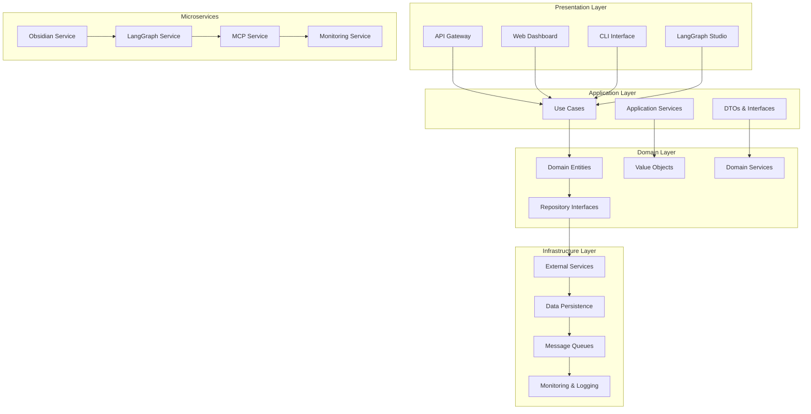
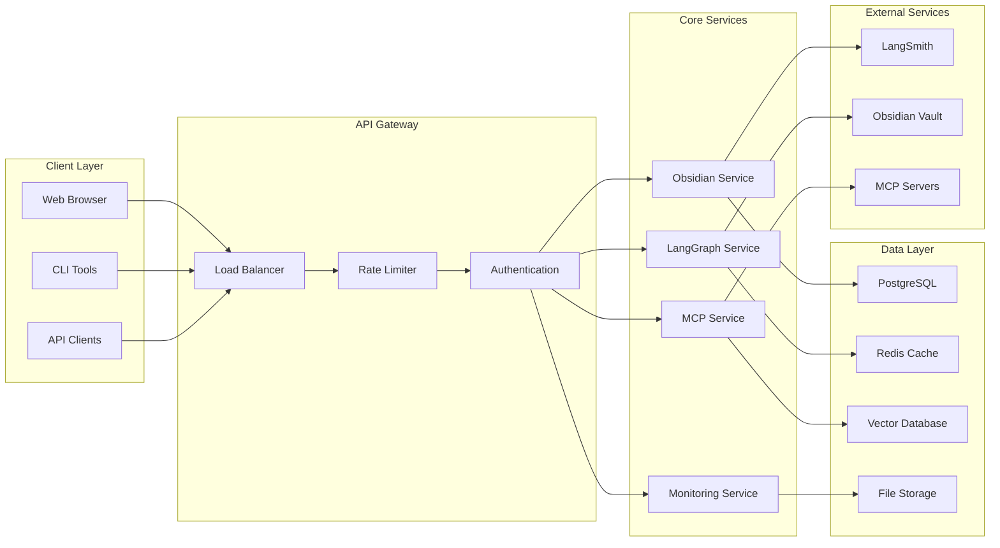

# 🏗️ **DATA VAULT OBSIDIAN - ARCHITECTURE OVERVIEW**

**Version:** 3.0.0  
**Last Updated:** September 6, 2025  
**Status:** ✅ **PRODUCTION-READY ENTERPRISE ARCHITECTURE**

---

## 🎯 **ARCHITECTURAL PHILOSOPHY**

The Data Vault Obsidian system is built on **Clean Architecture** principles with **Domain-Driven Design (DDD)** and **Microservices Architecture**, creating a scalable, maintainable, and testable enterprise AI platform.

### **Core Architectural Principles**

- **Separation of Concerns** - Clear boundaries between layers
- **Dependency Inversion** - High-level modules independent of low-level modules
- **Single Responsibility** - Each component has one clear purpose
- **Open/Closed Principle** - Open for extension, closed for modification
- **Interface Segregation** - Clients depend only on interfaces they use
- **Dependency Injection** - Loose coupling through dependency injection

---

## 🏛️ **SYSTEM ARCHITECTURE**

### **High-Level Architecture**

### **Service Architecture**

---

## 📐 **CLEAN ARCHITECTURE LAYERS**

### **1. Presentation Layer**
- **Purpose:** Handles user interactions and external communication
- **Components:** REST APIs, Web interfaces, CLI tools, WebSocket connections
- **Responsibilities:** Request/response handling, input validation, output formatting
- **Dependencies:** Depends on Application Layer interfaces only

### **2. Application Layer**
- **Purpose:** Orchestrates business workflows and coordinates domain operations
- **Components:** Use cases, application services, DTOs, service interfaces
- **Responsibilities:** Business workflow orchestration, transaction management, external service coordination
- **Dependencies:** Depends on Domain Layer interfaces only

### **3. Domain Layer**
- **Purpose:** Contains core business logic and domain rules
- **Components:** Entities, value objects, domain services, repository interfaces
- **Responsibilities:** Business rules enforcement, domain logic, entity management
- **Dependencies:** No external dependencies (pure business logic)

### **4. Infrastructure Layer**
- **Purpose:** Provides technical implementations and external integrations
- **Components:** Repository implementations, external service clients, data persistence, messaging
- **Responsibilities:** Data persistence, external service integration, technical concerns
- **Dependencies:** Can depend on all other layers

---

## 🔄 **MICROSERVICES ARCHITECTURE**

### **Service Decomposition**

#### **Obsidian Service**
- **Purpose:** Manages Obsidian vault operations and note management
- **Responsibilities:** File CRUD operations, note indexing, search functionality
- **Technology:** FastAPI, SQLAlchemy, Obsidian Local REST API
- **Port:** 8001

#### **LangGraph Service**
- **Purpose:** Orchestrates AI workflows and agent management
- **Responsibilities:** Workflow execution, state management, agent coordination
- **Technology:** LangGraph, LangChain, FastAPI
- **Port:** 8002

#### **MCP Service**
- **Purpose:** Manages Model Context Protocol integrations
- **Responsibilities:** Tool discovery, MCP server communication, context management
- **Technology:** FastMCP, FastAPI, WebSocket
- **Port:** 8003

#### **Monitoring Service**
- **Purpose:** Provides observability and system monitoring
- **Responsibilities:** Metrics collection, log aggregation, health monitoring
- **Technology:** FastAPI, Prometheus, Grafana, LangSmith
- **Port:** 8004

#### **API Gateway**
- **Purpose:** Central entry point for all client requests
- **Responsibilities:** Request routing, load balancing, authentication, rate limiting
- **Technology:** FastAPI, Redis, JWT
- **Port:** 8000

---

## 🎨 **DESIGN PATTERNS**

### **Architectural Patterns**

#### **Clean Architecture Pattern**
- **Implementation:** Layered architecture with dependency inversion
- **Benefits:** Testability, maintainability, independence from frameworks
- **Usage:** All core business logic isolated in domain layer

#### **Microservices Pattern**
- **Implementation:** Independent, loosely coupled services
- **Benefits:** Scalability, technology diversity, fault isolation
- **Usage:** Each service handles specific business capability

#### **API Gateway Pattern**
- **Implementation:** Single entry point for all client requests
- **Benefits:** Centralized cross-cutting concerns, simplified client communication
- **Usage:** Request routing, authentication, rate limiting

### **Design Patterns**

#### **Repository Pattern**
- **Implementation:** Abstract data access layer
- **Benefits:** Decouples business logic from data access
- **Usage:** All data persistence operations

#### **Service Layer Pattern**
- **Implementation:** Business logic encapsulation
- **Benefits:** Reusable business operations, transaction management
- **Usage:** Application and domain services

#### **Factory Pattern**
- **Implementation:** Object creation abstraction
- **Benefits:** Flexible object instantiation, dependency injection
- **Usage:** Service and entity creation

#### **Observer Pattern**
- **Implementation:** Event-driven communication
- **Benefits:** Loose coupling, extensibility
- **Usage:** Domain events, monitoring events

#### **Strategy Pattern**
- **Implementation:** Algorithm selection at runtime
- **Benefits:** Flexible algorithm implementation
- **Usage:** Different processing strategies for different data types

---

## 🔧 **TECHNOLOGY STACK**

### **Backend Technologies**
- **Python 3.11+** - Primary programming language
- **FastAPI** - Web framework for APIs
- **SQLAlchemy** - ORM for database operations
- **Pydantic** - Data validation and serialization
- **LangGraph** - AI workflow orchestration
- **LangChain** - AI application framework

### **Data Technologies**
- **PostgreSQL** - Primary database
- **Redis** - Caching and session storage
- **Vector Database** - Semantic search and embeddings
- **File System** - Document and media storage

### **Infrastructure Technologies**
- **Docker** - Containerization
- **Docker Compose** - Local development orchestration
- **Kubernetes** - Production orchestration (planned)
- **Terraform** - Infrastructure as Code (planned)

### **Monitoring & Observability**
- **LangSmith** - AI observability platform
- **Prometheus** - Metrics collection
- **Grafana** - Visualization and dashboards
- **Custom Dashboards** - Real-time monitoring

---

## 📊 **DATA FLOW ARCHITECTURE**

### **Request Flow**
1. **Client Request** → API Gateway
2. **Authentication** → JWT validation
3. **Rate Limiting** → Request throttling
4. **Routing** → Appropriate microservice
5. **Business Logic** → Application layer processing
6. **Data Access** → Repository pattern implementation
7. **Response** → Formatted response to client

### **Event Flow**
1. **Domain Event** → Event publisher
2. **Message Queue** → Event distribution
3. **Event Handlers** → Service-specific processing
4. **Side Effects** → Database updates, notifications
5. **Monitoring** → Event tracking and analytics

---

## 🔒 **SECURITY ARCHITECTURE**

### **Authentication & Authorization**
- **JWT Tokens** - Stateless authentication
- **Role-Based Access Control (RBAC)** - Permission management
- **API Key Management** - Service-to-service authentication
- **OAuth 2.0** - External service integration

### **Data Security**
- **Encryption at Rest** - Database and file encryption
- **Encryption in Transit** - HTTPS/TLS for all communications
- **Secrets Management** - Secure credential storage
- **Input Validation** - Comprehensive input sanitization

### **Network Security**
- **API Gateway** - Centralized security enforcement
- **Rate Limiting** - DDoS protection
- **CORS Configuration** - Cross-origin request control
- **Firewall Rules** - Network access control

---

## 📈 **SCALABILITY ARCHITECTURE**

### **Horizontal Scaling**
- **Stateless Services** - Easy horizontal scaling
- **Load Balancing** - Request distribution
- **Database Sharding** - Data partitioning (planned)
- **Caching Strategy** - Performance optimization

### **Vertical Scaling**
- **Resource Monitoring** - CPU, memory, disk usage
- **Auto-scaling** - Dynamic resource allocation (planned)
- **Performance Optimization** - Code and query optimization
- **Resource Limits** - Container resource constraints

---

## 🧪 **TESTING ARCHITECTURE**

### **Testing Pyramid**
- **Unit Tests** - Individual component testing
- **Integration Tests** - Service integration testing
- **End-to-End Tests** - Full workflow testing
- **Performance Tests** - Load and stress testing

### **Testing Strategies**
- **Test-Driven Development (TDD)** - Write tests first
- **Behavior-Driven Development (BDD)** - Business-focused testing
- **Contract Testing** - Service interface testing
- **Chaos Engineering** - Fault tolerance testing

---

## 📚 **DOCUMENTATION ARCHITECTURE**

### **Documentation Structure**
- **Architecture Documentation** - System design and patterns
- **API Documentation** - OpenAPI specifications
- **Deployment Documentation** - Infrastructure and deployment guides
- **Development Documentation** - Setup and development workflows
- **User Documentation** - End-user guides and tutorials

### **Comprehensive Pattern Library**
- **Core Infrastructure Patterns** - API Design, Database, Caching, Async
- **Communication Patterns** - Event-Driven, Communication, Coordination, Orchestration
- **AI/ML Integration Patterns** - LangGraph Workflow, Obsidian Integration, Monitoring
- **Collective Intelligence Patterns** - Collaboration, Cooperation, Collective Intelligence
- **Advanced Integration Patterns** - Agent Workflows, Integration Orchestration
- **Meta-Patterns** - Error Handling, Security, Performance, Testing, Deployment
- **Quality Attribute Patterns** - Quality Attributes, Architecture Decision Records
- **Integration Patterns** - Data Pipeline, Vector Database, Graph Database, API Gateway

### **Pattern Documentation Index**
- **📚 [Architecture Patterns Index](ARCHITECTURE_PATTERNS_INDEX.md)** - Complete pattern library overview
- **🌐 [API Design Patterns](API_DESIGN_PATTERNS.md)** - RESTful APIs, authentication, rate limiting
- **🗄️ [Database Patterns](DATABASE_PATTERNS.md)** - Data persistence, transactions, migrations
- **🚀 [Caching Patterns](CACHING_PATTERNS.md)** - Multi-level caching, invalidation strategies
- **⚡ [Async Patterns](ASYNC_PATTERNS.md)** - Asynchronous programming, concurrency
- **📊 [Logging Patterns](LOGGING_PATTERNS.md)** - Structured logging, centralized aggregation
- **⚙️ [Configuration Patterns](CONFIGURATION_PATTERNS.md)** - Environment management, secrets, dynamic config
- **✅ [Validation Patterns](VALIDATION_PATTERNS.md)** - Data validation, schema validation, business rules
- **🔄 [Event-Driven Patterns](EVENT_DRIVEN_PATTERNS.md)** - Event sourcing, CQRS, event streaming, choreography
- **📡 [Communication Patterns](COMMUNICATION_PATTERNS.md)** - Request-response, pub-sub, message queues, API gateway
- **🤝 [Coordination Patterns](COORDINATION_PATTERNS.md)** - Saga, two-phase commit, choreography, orchestration
- **🎭 [Orchestration Patterns](ORCHESTRATION_PATTERNS.md)** - Workflow orchestration, state machines, pipelines
- **🕸️ [LangGraph Workflow Patterns](LANGGRAPH_WORKFLOW_PATTERNS.md)** - AI workflow orchestration, agent management, state handling
- **🔗 [Obsidian Integration Patterns](OBSIDIAN_INTEGRATION_PATTERNS.md)** - Knowledge management, content automation, plugin integration
- **📊 [Monitoring Observability Patterns](MONITORING_OBSERVABILITY_PATTERNS.md)** - Metrics collection, logging, tracing, alerting
- **🧠 [Collective Intelligence Patterns](COLLECTIVE_INTELLIGENCE_PATTERNS.md)** - Multi-agent collaboration, swarm intelligence, collective decision making
- **🚀 [Advanced Workflow Patterns](ADVANCED_WORKFLOW_PATTERNS.md)** - Collective agent workflows, integration orchestration, coordination collaboration
- **🧩 [Meta-Patterns](META_PATTERNS.md)** - Error handling, security, performance, testing, deployment, scalability, maintenance
- **🎯 [Quality Attribute Patterns](QUALITY_ATTRIBUTE_PATTERNS.md)** - Performance, reliability, maintainability, scalability quality patterns
- **🔗 [Integration Patterns](INTEGRATION_PATTERNS.md)** - Data pipeline, vector database, graph database, API gateway integration
- **🔌 [MCP Documentation Hub](../mcp/README.md)** - Complete MCP documentation and integration guides
- **🗄️ [Data Operations Hub](../data-ops/README.md)** - Comprehensive data operations analysis and documentation

### **Documentation Tools**
- **Markdown** - Primary documentation format
- **OpenAPI/Swagger** - API documentation
- **Mermaid Diagrams** - Architecture visualization
- **Code Comments** - Inline documentation

---

**Last Updated:** September 6, 2025  
**Architecture Version:** 3.0.0  
**Status:** ✅ **PRODUCTION-READY**

**CENTRALIZED REPORTS & CHANGELOG SYSTEM COMPLETE!**
