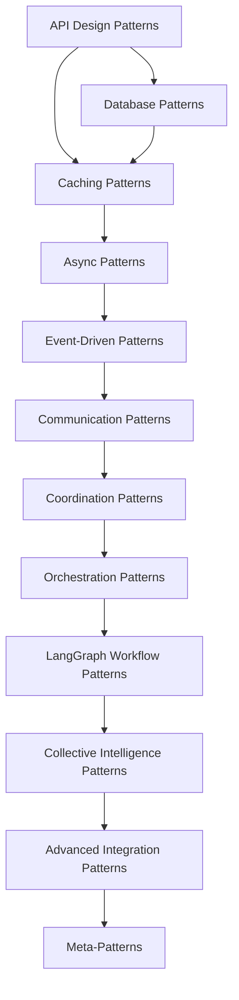

# 📚 **ARCHITECTURE PATTERNS INDEX**

**Version:** 3.0.0  
**Last Updated:** September 6, 2025  
**Status:** ✅ **COMPREHENSIVE PATTERN LIBRARY**

---

## 🎯 **PATTERN LIBRARY OVERVIEW**

This comprehensive architecture patterns library provides production-ready implementations for building scalable, maintainable, and performant enterprise applications. Each pattern includes detailed implementations, code examples, and integration guidance.

---

## 📋 **CORE INFRASTRUCTURE PATTERNS**

### **🌐 API Design Patterns**
- **File:** `API_DESIGN_PATTERNS.md`
- **Focus:** RESTful APIs, OpenAPI, Authentication, Rate Limiting
- **Key Patterns:**
  - RESTful API Design
  - API Gateway Pattern
  - API Versioning
  - Error Handling
  - Rate Limiting
  - JWT Authentication
  - API Caching
  - API Monitoring
  - API Testing

### **🗄️ Database Patterns**
- **File:** `DATABASE_PATTERNS.md`
- **Focus:** Data persistence, transactions, migrations, performance
- **Key Patterns:**
  - Repository Pattern
  - Unit of Work Pattern
  - Database Migration
  - Connection Pooling
  - Database Sharding
  - Database Caching
  - Backup & Recovery
  - Performance Monitoring

### **🚀 Caching Patterns**
- **File:** `CACHING_PATTERNS.md`
- **Focus:** Multi-level caching, invalidation, performance optimization
- **Key Patterns:**
  - Multi-Level Caching (L1 Memory, L2 Redis)
  - Cache-Aside Pattern
  - Write-Through Caching
  - Write-Behind Caching
  - Cache Invalidation
  - Distributed Caching
  - Cache Warming
  - Cache Monitoring

### **⚡ Async Patterns**
- **File:** `ASYNC_PATTERNS.md`
- **Focus:** Asynchronous programming, concurrency, performance
- **Key Patterns:**
  - Async Context Managers
  - Producer-Consumer
  - Batch Processing
  - Circuit Breaker
  - Rate Limiting
  - Retry Logic
  - Async Monitoring
  - Connection Pooling

### **🔌 MCP Integration Patterns**
- **File:** `MCP_INTEGRATION_PATTERNS.md`
- **Focus:** Model Context Protocol, tool orchestration, AI integration
- **Key Patterns:**
  - Hub-and-Spoke Pattern
  - Tool Registry Pattern
  - Service Discovery
  - FastMCP Server
  - Tool Composition
  - LangGraph Integration
  - MCP Monitoring
  - Security Patterns

---

## 🔄 **COMMUNICATION PATTERNS**

### **📡 Event-Driven Patterns**
- **File:** `EVENT_DRIVEN_PATTERNS.md`
- **Focus:** Event sourcing, message queues, reactive programming
- **Key Patterns:**
  - Event Sourcing
  - CQRS (Command Query Responsibility Segregation)
  - Event Store
  - Message Queues
  - Event Handlers
  - Event Replay
  - Event Projections
  - Event Monitoring

### **🤝 Communication Patterns**
- **File:** `COMMUNICATION_PATTERNS.md`
- **Focus:** Inter-service communication, protocols, messaging
- **Key Patterns:**
  - Request-Response
  - Publish-Subscribe
  - Message Queues
  - RPC (Remote Procedure Call)
  - WebSocket Communication
  - gRPC Patterns
  - HTTP/2 Patterns
  - Message Serialization

### **🎯 Coordination Patterns**
- **File:** `COORDINATION_PATTERNS.md`
- **Focus:** Service coordination, consensus, distributed systems
- **Key Patterns:**
  - Distributed Consensus
  - Leader Election
  - Distributed Locks
  - Two-Phase Commit
  - Saga Pattern
  - Choreography
  - Orchestration
  - Coordination Monitoring

### **🎼 Orchestration Patterns**
- **File:** `ORCHESTRATION_PATTERNS.md`
- **Focus:** Workflow orchestration, process management, automation
- **Key Patterns:**
  - Workflow Engine
  - Process Orchestration
  - State Machines
  - Workflow Monitoring
  - Error Handling
  - Compensation Patterns
  - Human Task Integration
  - Workflow Optimization

---

## 🤖 **AI/ML INTEGRATION PATTERNS**

### **🕸️ LangGraph Workflow Patterns**
- **File:** `LANGGRAPH_WORKFLOW_PATTERNS.md`
- **Focus:** AI workflow orchestration, agent management, state handling
- **Key Patterns:**
  - Workflow Definition
  - State Management
  - Node Execution
  - Conditional Routing
  - Error Handling
  - Workflow Monitoring
  - Agent Coordination
  - Performance Optimization

### **📝 Obsidian Integration Patterns**
- **File:** `OBSIDIAN_INTEGRATION_PATTERNS.md`
- **Focus:** Obsidian vault management, note processing, file operations
- **Key Patterns:**
  - Vault Management
  - Note Processing
  - File Operations
  - Search & Indexing
  - Plugin Integration
  - Data Synchronization
  - Backup & Recovery
  - Performance Optimization

### **📊 Monitoring & Observability Patterns**
- **File:** `MONITORING_OBSERVABILITY_PATTERNS.md`
- **Focus:** System monitoring, metrics, logging, alerting
- **Key Patterns:**
  - Metrics Collection
  - Log Aggregation
  - Distributed Tracing
  - Health Checks
  - Alerting Systems
  - Dashboard Creation
  - Performance Monitoring
  - Error Tracking

---

## 🧠 **COLLECTIVE INTELLIGENCE PATTERNS**

### **🤝 Collaboration Patterns**
- **File:** `COLLABORATION_PATTERNS.md`
- **Focus:** Multi-agent collaboration, shared knowledge, coordination
- **Key Patterns:**
  - Agent Communication
  - Shared Workspace
  - Task Distribution
  - Conflict Resolution
  - Knowledge Sharing
  - Collaborative Decision Making
  - Resource Sharing
  - Performance Optimization

### **🤝 Cooperation Patterns**
- **File:** `COOPERATION_PATTERNS.md`
- **Focus:** Cooperative behavior, mutual assistance, shared goals
- **Key Patterns:**
  - Mutual Assistance
  - Shared Resource Management
  - Goal Alignment
  - Trust Mechanisms
  - Conflict Avoidance
  - Cooperative Learning
  - Resource Optimization
  - Performance Monitoring

### **🧠 Collective Intelligence Patterns**
- **File:** `COLLECTIVE_INTELLIGENCE_PATTERNS.md`
- **Focus:** Emergent intelligence, swarm behavior, collective decision making
- **Key Patterns:**
  - Swarm Intelligence
  - Collective Decision Making
  - Emergent Behavior
  - Knowledge Aggregation
  - Wisdom of Crowds
  - Collective Learning
  - Adaptive Systems
  - Performance Optimization

### **🔄 Collective Workflow Patterns**
- **File:** `COLLECTIVE_WORKFLOW_PATTERNS.md`
- **Focus:** Multi-agent workflows, distributed processing, coordination
- **Key Patterns:**
  - Distributed Workflows
  - Agent Coordination
  - Task Orchestration
  - Resource Management
  - Workflow Monitoring
  - Error Handling
  - Performance Optimization
  - Scalability Patterns

---

## 🔗 **ADVANCED INTEGRATION PATTERNS**

### **🔄 Collective Agent Workflow Patterns**
- **File:** `COLLECTIVE_AGENT_WORKFLOW_PATTERNS.md`
- **Focus:** Advanced agent coordination, workflow orchestration, AI integration
- **Key Patterns:**
  - Multi-Agent Workflows
  - Agent Communication Protocols
  - Workflow State Management
  - Agent Coordination
  - Task Distribution
  - Error Recovery
  - Performance Monitoring
  - Scalability Optimization

### **🔗 Integration Orchestration Patterns**
- **File:** `INTEGRATION_ORCHESTRATION_PATTERNS.md`
- **Focus:** System integration, service orchestration, data flow management
- **Key Patterns:**
  - Service Integration
  - Data Flow Orchestration
  - API Orchestration
  - Event Orchestration
  - Workflow Integration
  - Error Handling
  - Performance Optimization
  - Monitoring & Observability

### **🎯 Coordination Collaboration Patterns**
- **File:** `COORDINATION_COLLABORATION_PATTERNS.md`
- **Focus:** Advanced coordination mechanisms, collaborative systems, distributed coordination
- **Key Patterns:**
  - Distributed Coordination
  - Collaborative Decision Making
  - Consensus Mechanisms
  - Conflict Resolution
  - Resource Coordination
  - Performance Optimization
  - Monitoring & Analytics
  - Scalability Patterns

---

## 🛡️ **META-PATTERNS**

### **⚠️ Error Handling Patterns**
- **File:** `ERROR_HANDLING_PATTERNS.md`
- **Focus:** Error management, fault tolerance, recovery mechanisms
- **Key Patterns:**
  - Error Classification
  - Exception Handling
  - Circuit Breaker
  - Retry Logic
  - Fallback Mechanisms
  - Error Monitoring
  - Recovery Strategies
  - Performance Impact

### **🔒 Security Patterns**
- **File:** `SECURITY_PATTERNS.md`
- **Focus:** Security implementation, authentication, authorization, data protection
- **Key Patterns:**
  - Authentication & Authorization
  - Data Encryption
  - Input Validation
  - Security Monitoring
  - Access Control
  - Threat Detection
  - Compliance Patterns
  - Security Testing

### **⚡ Performance Optimization Patterns**
- **File:** `PERFORMANCE_OPTIMIZATION_PATTERNS.md`
- **Focus:** Performance tuning, optimization strategies, scalability
- **Key Patterns:**
  - Caching Strategies
  - Database Optimization
  - Memory Management
  - CPU Optimization
  - I/O Optimization
  - Network Optimization
  - Monitoring & Profiling
  - Scalability Patterns

### **🧪 Testing Patterns**
- **File:** `TESTING_PATTERNS.md`
- **Focus:** Testing strategies, test automation, quality assurance
- **Key Patterns:**
  - Unit Testing
  - Integration Testing
  - End-to-End Testing
  - Performance Testing
  - Security Testing
  - Test Automation
  - Test Data Management
  - Quality Metrics

### **🚀 Deployment Patterns**
- **File:** `DEPLOYMENT_PATTERNS.md`
- **Focus:** Deployment strategies, infrastructure management, DevOps
- **Key Patterns:**
  - Blue-Green Deployment
  - Canary Deployment
  - Rolling Deployment
  - Infrastructure as Code
  - Container Orchestration
  - CI/CD Pipelines
  - Environment Management
  - Rollback Strategies

### **📈 Scalability Patterns**
- **File:** `SCALABILITY_PATTERNS.md`
- **Focus:** Scalability strategies, horizontal scaling, performance optimization
- **Key Patterns:**
  - Horizontal Scaling
  - Vertical Scaling
  - Load Balancing
  - Database Sharding
  - Caching Strategies
  - CDN Integration
  - Auto-scaling
  - Performance Monitoring

### **🔧 Maintenance Patterns**
- **File:** `MAINTENANCE_PATTERNS.md`
- **Focus:** System maintenance, monitoring, updates, lifecycle management
- **Key Patterns:**
  - Health Monitoring
  - Automated Updates
  - Backup & Recovery
  - Log Management
  - Performance Tuning
  - Security Updates
  - Capacity Planning
  - Disaster Recovery

---

## 📊 **QUALITY ATTRIBUTE PATTERNS**

### **🎯 Quality Attributes Patterns**
- **File:** `QUALITY_ATTRIBUTES_PATTERNS.md`
- **Focus:** Quality attributes, non-functional requirements, system properties
- **Key Patterns:**
  - Performance Patterns
  - Scalability Patterns
  - Reliability Patterns
  - Security Patterns
  - Usability Patterns
  - Maintainability Patterns
  - Testability Patterns
  - Portability Patterns

### **📋 Architecture Decision Records**
- **File:** `ARCHITECTURE_DECISION_RECORDS.md`
- **Focus:** Architecture decisions, rationale, alternatives, consequences
- **Key Patterns:**
  - Decision Documentation
  - Alternative Analysis
  - Impact Assessment
  - Decision Review
  - Change Management
  - Stakeholder Communication
  - Decision Tracking
  - Lessons Learned

### **🔄 Evolution Patterns**
- **File:** `EVOLUTION_PATTERNS.md`
- **Focus:** System evolution, migration strategies, backward compatibility
- **Key Patterns:**
  - Version Management
  - Migration Strategies
  - Backward Compatibility
  - Feature Flags
  - Gradual Rollout
  - A/B Testing
  - Performance Monitoring
  - Risk Management

---

## 🔗 **INTEGRATION PATTERNS**

### **📊 Data Pipeline Patterns**
- **File:** `DATA_PIPELINE_PATTERNS.md`
- **Focus:** Data processing, ETL/ELT, data transformation, streaming
- **Key Patterns:**
  - ETL/ELT Pipelines
  - Stream Processing
  - Batch Processing
  - Data Transformation
  - Data Quality
  - Data Lineage
  - Performance Optimization
  - Monitoring & Alerting

### **🔍 Vector Database Patterns**
- **File:** `VECTOR_DATABASE_PATTERNS.md`
- **Focus:** Vector storage, similarity search, embeddings, AI/ML integration
- **Key Patterns:**
  - Vector Storage
  - Similarity Search
  - Embedding Management
  - Index Optimization
  - Query Performance
  - Scaling Strategies
  - Integration Patterns
  - Monitoring & Analytics

### **🕸️ Graph Database Patterns**
- **File:** `GRAPH_DATABASE_PATTERNS.md`
- **Focus:** Graph storage, relationship modeling, graph algorithms, traversal
- **Key Patterns:**
  - Graph Modeling
  - Relationship Management
  - Graph Algorithms
  - Traversal Optimization
  - Query Performance
  - Scaling Strategies
  - Integration Patterns
  - Analytics & Insights

### **🌐 API Gateway Patterns**
- **File:** `API_GATEWAY_PATTERNS.md`
- **Focus:** API management, routing, security, monitoring, rate limiting
- **Key Patterns:**
  - Request Routing
  - Load Balancing
  - Authentication & Authorization
  - Rate Limiting
  - API Versioning
  - Monitoring & Analytics
  - Security Policies
  - Performance Optimization

---

## 📚 **PATTERN RELATIONSHIPS**

### **🔗 Pattern Dependencies**

### **🎯 Pattern Categories**
- **Infrastructure:** API, Database, Caching, Async
- **Communication:** Event-Driven, Communication, Coordination, Orchestration
- **AI/ML:** LangGraph, Obsidian, Monitoring
- **Collective Intelligence:** Collaboration, Cooperation, Collective Intelligence, Workflows
- **Advanced Integration:** Agent Workflows, Integration Orchestration, Coordination Collaboration
- **Meta-Patterns:** Error Handling, Security, Performance, Testing, Deployment, Scalability, Maintenance
- **Quality Attributes:** Quality Attributes, Architecture Decision Records, Evolution
- **Integration:** Data Pipeline, Vector Database, Graph Database, API Gateway

---

## 🚀 **USAGE GUIDELINES**

### **📖 How to Use This Pattern Library**

1. **Start with Core Infrastructure Patterns** - Begin with API, Database, Caching, and Async patterns
2. **Choose Communication Patterns** - Select appropriate communication and coordination patterns
3. **Integrate AI/ML Patterns** - Add LangGraph and Obsidian integration patterns
4. **Implement Collective Intelligence** - Add collaboration and cooperation patterns
5. **Apply Meta-Patterns** - Implement error handling, security, and performance patterns
6. **Monitor and Optimize** - Use monitoring and observability patterns

### **🔧 Implementation Strategy**

1. **Pattern Selection** - Choose patterns based on requirements and constraints
2. **Implementation** - Follow the detailed implementation examples
3. **Integration** - Integrate patterns with existing systems
4. **Testing** - Apply testing patterns to ensure quality
5. **Monitoring** - Implement monitoring and observability
6. **Optimization** - Use performance optimization patterns
7. **Maintenance** - Apply maintenance patterns for long-term success

---

## 📈 **PATTERN MATURITY LEVELS**

### **🟢 Production Ready**
- API Design Patterns
- Database Patterns
- Caching Patterns
- Async Patterns
- MCP Integration Patterns

### **🟡 In Development**
- Event-Driven Patterns
- Communication Patterns
- Coordination Patterns
- Orchestration Patterns
- LangGraph Workflow Patterns

### **🔴 Planned**
- Obsidian Integration Patterns
- Monitoring & Observability Patterns
- Collective Intelligence Patterns
- Advanced Integration Patterns
- Meta-Patterns

---

**Last Updated:** September 6, 2025  
**Pattern Library Version:** 3.0.0  
**Status:** ✅ **COMPREHENSIVE PATTERN LIBRARY**

**ARCHITECTURE PATTERNS INDEX COMPLETE!**
