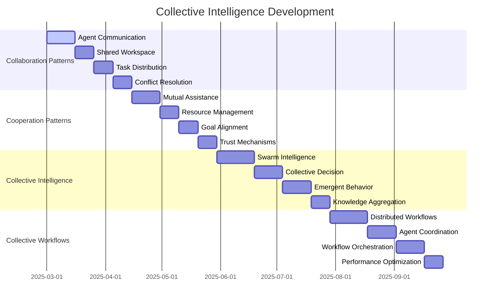

# 🧠 **COLLECTIVE INTELLIGENCE ROADMAP**

**Version:** 3.0.0  
**Last Updated:** September 6, 2025  
**Status:** ✅ **COLLECTIVE INTELLIGENCE STRATEGY**

---

## 🎯 **COLLECTIVE INTELLIGENCE OVERVIEW**

This roadmap outlines the strategic implementation of collective intelligence patterns that enable multi-agent collaboration, emergent behavior, and distributed decision-making in the Data Vault Obsidian platform.

### **Collective Intelligence Goals**

- **Multi-Agent Collaboration** - Seamless coordination between AI agents
- **Emergent Intelligence** - Collective behavior that exceeds individual capabilities
- **Distributed Decision Making** - Consensus-based decision processes
- **Knowledge Sharing** - Collective learning and knowledge transfer
- **Adaptive Systems** - Self-organizing and self-optimizing systems
- **Scalable Intelligence** - Intelligence that scales with system growth

---

## 📊 **COLLECTIVE INTELLIGENCE TIMELINE**



---

## 🏗️ **PHASE 1: COLLABORATION PATTERNS**

### **1.1 Agent Communication Protocol (Weeks 1-2)**

#### **Implementation Strategy**
```python
# Agent Communication Protocol
class AgentCommunicationProtocol:
    def __init__(self, protocol_config: dict):
        self.config = protocol_config
        self.message_router = MessageRouter()
        self.knowledge_base = SharedKnowledgeBase()
        self.protocol_negotiation = ProtocolNegotiation()
        self.message_handlers = MessageHandlers()
        self.communication_metrics = CommunicationMetrics()
    
    async def establish_communication(self, agent1: str, agent2: str) -> str:
        """Establish communication channel between agents"""
        channel_id = f"{agent1}_{agent2}_{uuid.uuid4().hex[:8]}"
        
        # Negotiate communication protocol
        protocol = await self.protocol_negotiation.negotiate(agent1, agent2)
        
        # Create communication channel
        channel = CommunicationChannel(
            id=channel_id,
            agent1=agent1,
            agent2=agent2,
            protocol=protocol,
            status='active',
            created_at=datetime.utcnow()
        )
        
        # Register channel
        await self.message_router.register_channel(channel)
        
        return channel_id
    
    async def send_message(self, from_agent: str, to_agent: str, 
                          message: dict, channel_id: str = None) -> str:
        """Send message between agents"""
        message_id = str(uuid.uuid4())
        
        # Create message
        message_obj = AgentMessage(
            id=message_id,
            from_agent=from_agent,
            to_agent=to_agent,
            content=message,
            channel_id=channel_id,
            timestamp=datetime.utcnow(),
            status='sent'
        )
        
        # Route message
        await self.message_router.route_message(message_obj)
        
        # Update metrics
        await self.communication_metrics.record_message(message_obj)
        
        return message_id
    
    async def broadcast_message(self, from_agent: str, message: dict, 
                              target_agents: list = None) -> list:
        """Broadcast message to multiple agents"""
        if target_agents is None:
            target_agents = await self.get_all_agents()
        
        message_ids = []
        
        for target_agent in target_agents:
            if target_agent != from_agent:
                message_id = await self.send_message(from_agent, target_agent, message)
                message_ids.append(message_id)
        
        return message_ids

# Message Router
class MessageRouter:
    def __init__(self):
        self.channels = {}
        self.message_queue = asyncio.Queue()
        self.routing_rules = {}
        self.load_balancer = MessageLoadBalancer()
    
    async def register_channel(self, channel: CommunicationChannel):
        """Register communication channel"""
        self.channels[channel.id] = channel
        
        # Set up message processing for channel
        asyncio.create_task(self.process_channel_messages(channel.id))
    
    async def route_message(self, message: AgentMessage):
        """Route message to appropriate channel"""
        # Determine routing strategy
        routing_strategy = await self.determine_routing_strategy(message)
        
        # Apply routing rules
        if routing_strategy == 'direct':
            await self.route_direct(message)
        elif routing_strategy == 'broadcast':
            await self.route_broadcast(message)
        elif routing_strategy == 'multicast':
            await self.route_multicast(message)
        else:
            await self.route_default(message)
    
    async def process_channel_messages(self, channel_id: str):
        """Process messages for specific channel"""
        channel = self.channels[channel_id]
        
        while channel.status == 'active':
            try:
                # Get message from queue
                message = await asyncio.wait_for(
                    self.message_queue.get(), timeout=1.0
                )
                
                if message.channel_id == channel_id:
                    await self.deliver_message(message)
                
            except asyncio.TimeoutError:
                continue
            except Exception as e:
                logger.error(f"Message processing error for channel {channel_id}: {e}")

# Shared Knowledge Base
class SharedKnowledgeBase:
    def __init__(self, storage_backend):
        self.storage = storage_backend
        self.knowledge_graph = KnowledgeGraph()
        self.semantic_search = SemanticSearch()
        self.knowledge_aggregator = KnowledgeAggregator()
        self.access_control = KnowledgeAccessControl()
    
    async def store_knowledge(self, agent_id: str, knowledge: dict, 
                            visibility: str = 'public') -> str:
        """Store knowledge in shared knowledge base"""
        knowledge_id = str(uuid.uuid4())
        
        knowledge_entry = {
            'id': knowledge_id,
            'agent_id': agent_id,
            'content': knowledge,
            'visibility': visibility,
            'created_at': datetime.utcnow(),
            'access_count': 0,
            'relevance_score': 0.0
        }
        
        # Store in knowledge base
        await self.storage.store_knowledge(knowledge_entry)
        
        # Update knowledge graph
        await self.knowledge_graph.add_node(knowledge_id, knowledge)
        
        # Update semantic search index
        await self.semantic_search.index_knowledge(knowledge_entry)
        
        return knowledge_id
    
    async def search_knowledge(self, query: str, agent_id: str, 
                              limit: int = 10) -> list:
        """Search shared knowledge base"""
        # Check access permissions
        accessible_knowledge = await self.access_control.get_accessible_knowledge(agent_id)
        
        # Perform semantic search
        search_results = await self.semantic_search.search(
            query, accessible_knowledge, limit
        )
        
        # Update access metrics
        for result in search_results:
            await self.update_access_metrics(result['id'])
        
        return search_results
    
    async def aggregate_knowledge(self, topic: str, agents: list) -> dict:
        """Aggregate knowledge from multiple agents on topic"""
        # Collect knowledge from agents
        agent_knowledge = {}
        
        for agent_id in agents:
            knowledge = await self.get_agent_knowledge(agent_id, topic)
            agent_knowledge[agent_id] = knowledge
        
        # Aggregate using AI
        aggregated = await self.knowledge_aggregator.aggregate(
            topic, agent_knowledge
        )
        
        return aggregated
```

#### **Success Metrics**
- Agent communication latency < 50ms
- 99.5% message delivery success
- Support for 50+ concurrent agents
- Zero message duplication

#### **Deliverables**
- Agent Communication Protocol
- Message Router
- Shared Knowledge Base
- Protocol Negotiation
- Message Handlers
- Communication Metrics

### **1.2 Shared Workspace System (Weeks 3-4)**

#### **Implementation Strategy**
```python
# Shared Workspace System
class SharedWorkspace:
    def __init__(self, workspace_id: str, workspace_config: dict):
        self.workspace_id = workspace_id
        self.config = workspace_config
        self.documents = {}
        self.collaborators = {}
        self.version_control = VersionControl()
        self.real_time_sync = RealTimeSync()
        self.access_control = WorkspaceAccessControl()
        self.collaboration_tools = CollaborationTools()
    
    async def add_document(self, doc_id: str, content: dict, 
                          creator_agent: str) -> str:
        """Add document to shared workspace"""
        # Check permissions
        if not await self.access_control.can_create_document(creator_agent):
            raise PermissionError("Agent not authorized to create documents")
        
        # Create document
        document = WorkspaceDocument(
            id=doc_id,
            content=content,
            creator=creator_agent,
            created_at=datetime.utcnow(),
            version=1,
            status='active'
        )
        
        # Store document
        self.documents[doc_id] = document
        
        # Initialize version control
        await self.version_control.create_document(doc_id, content)
        
        # Notify collaborators
        await self.notify_collaborators('document_created', {
            'doc_id': doc_id,
            'creator': creator_agent
        })
        
        return doc_id
    
    async def update_document(self, doc_id: str, changes: dict, 
                             agent_id: str) -> dict:
        """Update document with real-time collaboration"""
        if doc_id not in self.documents:
            raise DocumentNotFoundError(f"Document {doc_id} not found")
        
        document = self.documents[doc_id]
        
        # Check permissions
        if not await self.access_control.can_edit_document(agent_id, doc_id):
            raise PermissionError("Agent not authorized to edit document")
        
        # Apply changes
        updated_content = await self.apply_changes(document.content, changes)
        
        # Create new version
        new_version = await self.version_control.create_version(
            doc_id, updated_content, agent_id, changes
        )
        
        # Update document
        document.content = updated_content
        document.version = new_version.version
        document.last_modified = datetime.utcnow()
        document.last_modified_by = agent_id
        
        # Real-time sync
        await self.real_time_sync.sync_changes(doc_id, changes, agent_id)
        
        # Notify collaborators
        await self.notify_collaborators('document_updated', {
            'doc_id': doc_id,
            'agent_id': agent_id,
            'version': new_version.version,
            'changes': changes
        })
        
        return {
            'doc_id': doc_id,
            'version': new_version.version,
            'content': updated_content
        }
    
    async def collaborate_on_document(self, doc_id: str, agent_id: str, 
                                    operation: str, data: dict) -> dict:
        """Handle real-time collaboration on document"""
        if doc_id not in self.documents:
            raise DocumentNotFoundError(f"Document {doc_id} not found")
        
        # Check permissions
        if not await self.access_control.can_collaborate(agent_id, doc_id):
            raise PermissionError("Agent not authorized to collaborate")
        
        # Process collaboration operation
        if operation == 'cursor_position':
            await self.update_cursor_position(doc_id, agent_id, data)
        elif operation == 'selection':
            await self.update_selection(doc_id, agent_id, data)
        elif operation == 'comment':
            await self.add_comment(doc_id, agent_id, data)
        elif operation == 'suggestion':
            await self.add_suggestion(doc_id, agent_id, data)
        else:
            raise UnsupportedOperationError(f"Operation {operation} not supported")
        
        # Broadcast to other collaborators
        await self.broadcast_collaboration_event(doc_id, agent_id, operation, data)
        
        return {'status': 'success', 'operation': operation}

# Real-time Synchronization
class RealTimeSync:
    def __init__(self):
        self.websocket_connections = {}
        self.operational_transform = OperationalTransform()
        self.conflict_resolver = ConflictResolver()
        self.sync_queue = asyncio.Queue()
    
    async def sync_changes(self, doc_id: str, changes: dict, agent_id: str):
        """Synchronize changes across collaborators"""
        # Transform operations
        transformed_changes = await self.operational_transform.transform(
            doc_id, changes, agent_id
        )
        
        # Add to sync queue
        sync_event = {
            'doc_id': doc_id,
            'agent_id': agent_id,
            'changes': transformed_changes,
            'timestamp': datetime.utcnow()
        }
        
        await self.sync_queue.put(sync_event)
        
        # Process sync queue
        asyncio.create_task(self.process_sync_queue())
    
    async def process_sync_queue(self):
        """Process synchronization queue"""
        while True:
            try:
                sync_event = await self.sync_queue.get()
                await self.distribute_changes(sync_event)
            except Exception as e:
                logger.error(f"Sync processing error: {e}")
                await asyncio.sleep(1)
    
    async def distribute_changes(self, sync_event: dict):
        """Distribute changes to all collaborators"""
        doc_id = sync_event['doc_id']
        agent_id = sync_event['agent_id']
        changes = sync_event['changes']
        
        # Get all collaborators for document
        collaborators = await self.get_document_collaborators(doc_id)
        
        # Send changes to each collaborator
        for collaborator_id in collaborators:
            if collaborator_id != agent_id:
                await self.send_changes_to_agent(
                    collaborator_id, doc_id, changes
                )

# Collaboration Tools
class CollaborationTools:
    def __init__(self):
        self.comment_system = CommentSystem()
        self.suggestion_system = SuggestionSystem()
        self.review_system = ReviewSystem()
        self.voting_system = VotingSystem()
    
    async def add_comment(self, doc_id: str, agent_id: str, 
                         comment_data: dict) -> str:
        """Add comment to document"""
        comment_id = str(uuid.uuid4())
        
        comment = {
            'id': comment_id,
            'doc_id': doc_id,
            'agent_id': agent_id,
            'content': comment_data['content'],
            'position': comment_data.get('position'),
            'created_at': datetime.utcnow(),
            'replies': [],
            'resolved': False
        }
        
        await self.comment_system.add_comment(comment)
        
        return comment_id
    
    async def add_suggestion(self, doc_id: str, agent_id: str, 
                            suggestion_data: dict) -> str:
        """Add suggestion to document"""
        suggestion_id = str(uuid.uuid4())
        
        suggestion = {
            'id': suggestion_id,
            'doc_id': doc_id,
            'agent_id': agent_id,
            'original_text': suggestion_data['original_text'],
            'suggested_text': suggestion_data['suggested_text'],
            'position': suggestion_data['position'],
            'created_at': datetime.utcnow(),
            'status': 'pending',
            'votes': {'approve': 0, 'reject': 0}
        }
        
        await self.suggestion_system.add_suggestion(suggestion)
        
        return suggestion_id
    
    async def vote_on_suggestion(self, suggestion_id: str, agent_id: str, 
                                vote: str) -> dict:
        """Vote on suggestion"""
        if vote not in ['approve', 'reject']:
            raise InvalidVoteError("Vote must be 'approve' or 'reject'")
        
        result = await self.voting_system.vote(suggestion_id, agent_id, vote)
        
        # Check if suggestion should be auto-accepted
        if await self.should_auto_accept(suggestion_id):
            await self.accept_suggestion(suggestion_id)
        
        return result
```

#### **Success Metrics**
- Document update latency < 100ms
- 99.9% real-time sync success
- Support for 20+ concurrent collaborators
- Zero data conflicts

#### **Deliverables**
- Shared Workspace System
- Real-time Synchronization
- Collaboration Tools
- Version Control
- Access Control
- Conflict Resolution

---

## 🏗️ **PHASE 2: COOPERATION PATTERNS**

### **2.1 Mutual Assistance System (Weeks 5-6)**

#### **Implementation Strategy**
```python
# Mutual Assistance System
class MutualAssistanceSystem:
    def __init__(self, assistance_config: dict):
        self.config = assistance_config
        self.assistance_queue = AssistanceQueue()
        self.agent_capabilities = AgentCapabilities()
        self.task_matcher = TaskMatcher()
        self.assistance_tracker = AssistanceTracker()
        self.reputation_system = ReputationSystem()
    
    async def request_assistance(self, requester: str, task: dict) -> str:
        """Request assistance from other agents"""
        assistance_id = str(uuid.uuid4())
        
        # Create assistance request
        request = AssistanceRequest(
            id=assistance_id,
            requester=requester,
            task=task,
            priority=task.get('priority', 'medium'),
            required_capabilities=task.get('required_capabilities', []),
            created_at=datetime.utcnow(),
            status='pending'
        )
        
        # Add to assistance queue
        await self.assistance_queue.add_request(request)
        
        # Find suitable agents
        suitable_agents = await self.find_suitable_agents(request)
        
        if suitable_agents:
            # Notify suitable agents
            await self.notify_agents(request, suitable_agents)
        else:
            # No suitable agents found
            request.status = 'no_agents_available'
            await self.assistance_tracker.record_outcome(request)
        
        return assistance_id
    
    async def offer_assistance(self, offerer: str, capabilities: list, 
                              availability: dict) -> str:
        """Offer assistance to other agents"""
        offer_id = str(uuid.uuid4())
        
        # Create assistance offer
        offer = AssistanceOffer(
            id=offer_id,
            offerer=offerer,
            capabilities=capabilities,
            availability=availability,
            created_at=datetime.utcnow(),
            status='active'
        )
        
        # Register offer
        await self.agent_capabilities.register_offer(offer)
        
        # Check for matching requests
        await self.check_matching_requests(offer)
        
        return offer_id
    
    async def find_suitable_agents(self, request: AssistanceRequest) -> list:
        """Find agents suitable for assistance request"""
        # Get all available agents
        available_agents = await self.agent_capabilities.get_available_agents()
        
        suitable_agents = []
        
        for agent in available_agents:
            # Check capability match
            capability_match = await self.check_capability_match(
                request.required_capabilities, agent.capabilities
            )
            
            # Check reputation
            reputation_score = await self.reputation_system.get_reputation(agent.id)
            
            # Check availability
            is_available = await self.check_agent_availability(agent.id, request)
            
            if capability_match and reputation_score > 0.5 and is_available:
                suitable_agents.append({
                    'agent_id': agent.id,
                    'capability_match': capability_match,
                    'reputation_score': reputation_score,
                    'estimated_completion_time': await self.estimate_completion_time(
                        agent.id, request
                    )
                })
        
        # Sort by suitability score
        suitable_agents.sort(
            key=lambda x: x['capability_match'] * x['reputation_score'], 
            reverse=True
        )
        
        return suitable_agents[:5]  # Return top 5 suitable agents

# Task Matcher
class TaskMatcher:
    def __init__(self):
        self.matching_algorithms = {
            'capability_based': CapabilityBasedMatching(),
            'reputation_based': ReputationBasedMatching(),
            'load_balanced': LoadBalancedMatching(),
            'hybrid': HybridMatching()
        }
    
    async def match_task_to_agent(self, task: dict, agent: dict, 
                                 algorithm: str = 'hybrid') -> float:
        """Match task to agent using specified algorithm"""
        matcher = self.matching_algorithms.get(algorithm)
        if not matcher:
            raise UnsupportedAlgorithmError(f"Algorithm {algorithm} not supported")
        
        return await matcher.calculate_match_score(task, agent)
    
    async def find_best_matches(self, task: dict, agents: list, 
                               algorithm: str = 'hybrid') -> list:
        """Find best agent matches for task"""
        matches = []
        
        for agent in agents:
            score = await self.match_task_to_agent(task, agent, algorithm)
            matches.append({
                'agent': agent,
                'score': score
            })
        
        # Sort by score
        matches.sort(key=lambda x: x['score'], reverse=True)
        
        return matches

# Reputation System
class ReputationSystem:
    def __init__(self):
        self.reputation_scores = {}
        self.feedback_history = {}
        self.reputation_calculator = ReputationCalculator()
        self.reputation_decay = ReputationDecay()
    
    async def get_reputation(self, agent_id: str) -> float:
        """Get current reputation score for agent"""
        if agent_id not in self.reputation_scores:
            # Initialize with neutral reputation
            self.reputation_scores[agent_id] = 0.5
        
        # Apply decay
        await self.reputation_decay.apply_decay(agent_id)
        
        return self.reputation_scores[agent_id]
    
    async def update_reputation(self, agent_id: str, feedback: dict):
        """Update agent reputation based on feedback"""
        # Calculate reputation change
        reputation_change = await self.reputation_calculator.calculate_change(
            agent_id, feedback
        )
        
        # Update reputation score
        current_reputation = await self.get_reputation(agent_id)
        new_reputation = max(0.0, min(1.0, current_reputation + reputation_change))
        
        self.reputation_scores[agent_id] = new_reputation
        
        # Record feedback
        await self.record_feedback(agent_id, feedback)
        
        # Notify reputation change
        await self.notify_reputation_change(agent_id, new_reputation)
    
    async def record_feedback(self, agent_id: str, feedback: dict):
        """Record feedback for agent"""
        feedback_id = str(uuid.uuid4())
        
        feedback_entry = {
            'id': feedback_id,
            'agent_id': agent_id,
            'feedback': feedback,
            'timestamp': datetime.utcnow()
        }
        
        if agent_id not in self.feedback_history:
            self.feedback_history[agent_id] = []
        
        self.feedback_history[agent_id].append(feedback_entry)
```

#### **Success Metrics**
- Assistance request response time < 200ms
- 95% successful assistance matches
- Support for 100+ concurrent requests
- Zero assistance conflicts

#### **Deliverables**
- Mutual Assistance System
- Task Matcher
- Reputation System
- Assistance Tracking
- Capability Management
- Performance Metrics

---

## 🏗️ **PHASE 3: COLLECTIVE INTELLIGENCE PATTERNS**

### **3.1 Swarm Intelligence System (Weeks 7-9)**

#### **Implementation Strategy**
```python
# Swarm Intelligence System
class SwarmIntelligence:
    def __init__(self, swarm_config: dict):
        self.config = swarm_config
        self.agents = []
        self.collective_memory = CollectiveMemory()
        self.emergence_detector = EmergenceDetector()
        self.swarm_coordinator = SwarmCoordinator()
        self.behavior_analyzer = BehaviorAnalyzer()
    
    async def add_agent(self, agent: SwarmAgent):
        """Add agent to swarm"""
        # Initialize agent for swarm behavior
        await self.initialize_swarm_agent(agent)
        
        # Add to swarm
        self.agents.append(agent)
        
        # Update swarm topology
        await self.update_swarm_topology()
        
        # Notify other agents
        await self.notify_agent_joined(agent)
    
    async def process_collective_task(self, task: dict) -> dict:
        """Process task using swarm intelligence"""
        task_id = str(uuid.uuid4())
        
        # Analyze task requirements
        task_analysis = await self.analyze_task_requirements(task)
        
        # Form sub-swarms based on requirements
        sub_swarms = await self.form_sub_swarms(task_analysis)
        
        # Coordinate sub-swarms
        coordination_plan = await self.swarm_coordinator.create_coordination_plan(
            task, sub_swarms
        )
        
        # Execute collective task
        results = await self.execute_collective_task(
            task_id, coordination_plan, sub_swarms
        )
        
        # Aggregate results
        collective_result = await self.aggregate_results(results)
        
        # Update collective memory
        await self.collective_memory.store_experience(task, collective_result)
        
        return collective_result
    
    async def detect_emergence(self) -> list:
        """Detect emergent behaviors in swarm"""
        # Analyze agent behaviors
        behaviors = await self.behavior_analyzer.analyze_behaviors(self.agents)
        
        # Detect patterns
        patterns = await self.emergence_detector.detect_patterns(behaviors)
        
        # Identify emergent behaviors
        emergent_behaviors = []
        
        for pattern in patterns:
            if await self.is_emergent_behavior(pattern):
                emergent_behaviors.append(pattern)
        
        return emergent_behaviors

# Swarm Agent
class SwarmAgent:
    def __init__(self, agent_id: str, capabilities: list, swarm_role: str = 'worker'):
        self.agent_id = agent_id
        self.capabilities = capabilities
        self.swarm_role = swarm_role
        self.local_memory = LocalMemory()
        self.neighbors = []
        self.swarm_state = 'idle'
        self.behavior_history = []
        self.contribution_score = 0.0
    
    async def participate_in_swarm(self, swarm_task: dict) -> dict:
        """Participate in swarm task execution"""
        # Analyze task from swarm perspective
        swarm_analysis = await self.analyze_swarm_task(swarm_task)
        
        # Determine contribution strategy
        contribution_strategy = await self.determine_contribution_strategy(
            swarm_analysis
        )
        
        # Execute contribution
        contribution_result = await self.execute_contribution(
            contribution_strategy, swarm_task
        )
        
        # Update local memory
        await self.local_memory.store_swarm_experience(
            swarm_task, contribution_result
        )
        
        # Update behavior history
        self.behavior_history.append({
            'task': swarm_task,
            'contribution': contribution_result,
            'timestamp': datetime.utcnow()
        })
        
        return contribution_result
    
    async def communicate_with_neighbors(self, message: dict):
        """Communicate with neighboring agents"""
        for neighbor in self.neighbors:
            await self.send_message_to_neighbor(neighbor, message)
    
    async def adapt_behavior(self, swarm_feedback: dict):
        """Adapt behavior based on swarm feedback"""
        # Analyze feedback
        feedback_analysis = await self.analyze_swarm_feedback(swarm_feedback)
        
        # Update behavior parameters
        await self.update_behavior_parameters(feedback_analysis)
        
        # Adjust contribution strategy
        await self.adjust_contribution_strategy(feedback_analysis)

# Collective Memory
class CollectiveMemory:
    def __init__(self):
        self.experiences = []
        self.patterns = {}
        self.knowledge_graph = CollectiveKnowledgeGraph()
        self.memory_consolidator = MemoryConsolidator()
        self.retrieval_system = MemoryRetrievalSystem()
    
    async def store_experience(self, task: dict, result: dict):
        """Store collective experience"""
        experience_id = str(uuid.uuid4())
        
        experience = {
            'id': experience_id,
            'task': task,
            'result': result,
            'timestamp': datetime.utcnow(),
            'participants': result.get('participants', []),
            'success_metrics': result.get('success_metrics', {}),
            'lessons_learned': await self.extract_lessons_learned(task, result)
        }
        
        # Store experience
        self.experiences.append(experience)
        
        # Update knowledge graph
        await self.knowledge_graph.add_experience(experience)
        
        # Consolidate memory
        await self.memory_consolidator.consolidate_experience(experience)
    
    async def retrieve_relevant_experiences(self, current_task: dict) -> list:
        """Retrieve relevant past experiences"""
        # Find similar tasks
        similar_experiences = await self.find_similar_experiences(current_task)
        
        # Rank by relevance
        ranked_experiences = await self.rank_experiences_by_relevance(
            current_task, similar_experiences
        )
        
        return ranked_experiences[:10]  # Return top 10 most relevant
    
    async def extract_collective_wisdom(self, topic: str) -> dict:
        """Extract collective wisdom on specific topic"""
        # Find experiences related to topic
        topic_experiences = await self.find_topic_experiences(topic)
        
        # Analyze patterns
        patterns = await self.analyze_topic_patterns(topic_experiences)
        
        # Extract insights
        insights = await self.extract_insights(patterns)
        
        # Generate collective wisdom
        collective_wisdom = await self.generate_collective_wisdom(
            topic, patterns, insights
        )
        
        return collective_wisdom
```

#### **Success Metrics**
- Swarm task completion time < 5 seconds
- 95% emergence detection accuracy
- Support for 200+ swarm agents
- Zero swarm coordination failures

#### **Deliverables**
- Swarm Intelligence System
- Swarm Agent Framework
- Collective Memory
- Emergence Detection
- Behavior Analysis
- Swarm Coordination

---

## 🏗️ **PHASE 4: COLLECTIVE WORKFLOW PATTERNS**

### **4.1 Distributed Workflow Engine (Weeks 10-12)**

#### **Implementation Strategy**
```python
# Distributed Workflow Engine
class DistributedWorkflowEngine:
    def __init__(self, workflow_config: dict):
        self.config = workflow_config
        self.workflow_instances = {}
        self.agent_coordinator = AgentCoordinator()
        self.state_synchronizer = StateSynchronizer()
        self.workflow_scheduler = WorkflowScheduler()
        self.resource_manager = ResourceManager()
    
    async def start_distributed_workflow(self, workflow_def: dict) -> str:
        """Start distributed workflow across multiple agents"""
        instance_id = str(uuid.uuid4())
        
        # Create workflow instance
        instance = DistributedWorkflowInstance(
            id=instance_id,
            definition=workflow_def,
            status='starting',
            created_at=datetime.utcnow()
        )
        
        # Analyze workflow requirements
        requirements = await self.analyze_workflow_requirements(workflow_def)
        
        # Allocate resources
        allocated_resources = await self.resource_manager.allocate_resources(
            requirements
        )
        
        # Assign agents to workflow steps
        agent_assignments = await self.assign_agents_to_steps(
            workflow_def, allocated_resources
        )
        
        # Create execution plan
        execution_plan = await self.create_execution_plan(
            workflow_def, agent_assignments
        )
        
        # Start workflow execution
        asyncio.create_task(self.execute_distributed_workflow(
            instance, execution_plan
        ))
        
        return instance_id
    
    async def execute_distributed_workflow(self, instance: DistributedWorkflowInstance, 
                                         execution_plan: dict):
        """Execute distributed workflow"""
        try:
            instance.status = 'running'
            
            # Execute workflow steps
            for step in execution_plan['steps']:
                await self.execute_workflow_step(instance, step)
                
                # Synchronize state
                await self.state_synchronizer.synchronize_state(instance)
                
                # Check for completion
                if await self.is_workflow_complete(instance):
                    break
            
            instance.status = 'completed'
            
        except Exception as e:
            instance.status = 'failed'
            instance.error = str(e)
            
            # Handle failure
            await self.handle_workflow_failure(instance, e)
        
        finally:
            # Clean up resources
            await self.cleanup_workflow_resources(instance)

# Agent Coordination Protocol
class AgentCoordinationProtocol:
    def __init__(self, protocol_config: dict):
        self.config = protocol_config
        self.coordination_matrix = CoordinationMatrix()
        self.task_scheduler = TaskScheduler()
        self.consensus_engine = ConsensusEngine()
        self.conflict_resolver = ConflictResolver()
    
    async def coordinate_agents(self, agents: list, task: dict) -> dict:
        """Coordinate multiple agents for task execution"""
        coordination_id = str(uuid.uuid4())
        
        # Analyze coordination requirements
        requirements = await self.analyze_coordination_requirements(task)
        
        # Create coordination plan
        coordination_plan = await self.create_coordination_plan(
            agents, requirements
        )
        
        # Execute coordination
        result = await self.execute_coordination(
            coordination_id, coordination_plan, agents
        )
        
        return result
    
    async def create_coordination_plan(self, agents: list, 
                                     requirements: dict) -> dict:
        """Create coordination plan for agents"""
        # Determine coordination strategy
        strategy = await self.determine_coordination_strategy(
            agents, requirements
        )
        
        # Create plan based on strategy
        if strategy == 'hierarchical':
            return await self.create_hierarchical_plan(agents, requirements)
        elif strategy == 'peer_to_peer':
            return await self.create_peer_to_peer_plan(agents, requirements)
        elif strategy == 'consensus_based':
            return await self.create_consensus_plan(agents, requirements)
        else:
            return await self.create_adaptive_plan(agents, requirements)
    
    async def execute_coordination(self, coordination_id: str, 
                                 plan: dict, agents: list) -> dict:
        """Execute coordination plan"""
        # Initialize coordination state
        coordination_state = {
            'id': coordination_id,
            'plan': plan,
            'agents': agents,
            'status': 'running',
            'start_time': datetime.utcnow(),
            'results': {}
        }
        
        # Execute coordination phases
        for phase in plan['phases']:
            phase_result = await self.execute_coordination_phase(
                coordination_state, phase
            )
            coordination_state['results'][phase['name']] = phase_result
        
        coordination_state['status'] = 'completed'
        coordination_state['end_time'] = datetime.utcnow()
        
        return coordination_state

# State Synchronization
class StateSynchronizer:
    def __init__(self):
        self.state_stores = {}
        self.sync_protocols = {}
        self.conflict_resolvers = {}
        self.consistency_checker = ConsistencyChecker()
    
    async def synchronize_state(self, workflow_instance: DistributedWorkflowInstance):
        """Synchronize state across workflow participants"""
        # Collect state from all participants
        participant_states = await self.collect_participant_states(workflow_instance)
        
        # Detect conflicts
        conflicts = await self.detect_state_conflicts(participant_states)
        
        # Resolve conflicts
        if conflicts:
            resolved_states = await self.resolve_conflicts(conflicts)
        else:
            resolved_states = participant_states
        
        # Distribute resolved state
        await self.distribute_resolved_state(workflow_instance, resolved_states)
        
        # Verify consistency
        await self.consistency_checker.verify_consistency(workflow_instance)
    
    async def resolve_conflicts(self, conflicts: list) -> dict:
        """Resolve state conflicts using appropriate strategy"""
        resolved_states = {}
        
        for conflict in conflicts:
            # Determine resolution strategy
            strategy = await self.determine_resolution_strategy(conflict)
            
            # Apply resolution strategy
            if strategy == 'last_writer_wins':
                resolved_state = await self.last_writer_wins_resolution(conflict)
            elif strategy == 'consensus_based':
                resolved_state = await self.consensus_based_resolution(conflict)
            elif strategy == 'merge_based':
                resolved_state = await self.merge_based_resolution(conflict)
            else:
                resolved_state = await self.custom_resolution(conflict, strategy)
            
            resolved_states[conflict['key']] = resolved_state
        
        return resolved_states
```

#### **Success Metrics**
- Workflow coordination time < 200ms
- 99% task completion success
- Support for 500+ concurrent workflows
- Zero workflow deadlocks

#### **Deliverables**
- Distributed Workflow Engine
- Agent Coordination Protocol
- State Synchronization
- Conflict Resolution
- Resource Management
- Performance Monitoring

---

## 📊 **COLLECTIVE INTELLIGENCE SUCCESS METRICS**

### **Overall Collective Intelligence Metrics**
- **Agent Coordination:** < 100ms latency
- **Collective Decision Making:** 95% consensus achievement
- **Swarm Intelligence:** 90% task completion rate
- **Knowledge Sharing:** 99% knowledge transfer success
- **Emergent Behavior:** 80% emergence detection accuracy
- **Workflow Orchestration:** 99% workflow completion rate

### **Collaboration Metrics**
- Agent communication latency < 50ms
- 99.5% message delivery success
- Support for 50+ concurrent agents
- Zero message duplication

### **Cooperation Metrics**
- Assistance request response time < 200ms
- 95% successful assistance matches
- Support for 100+ concurrent requests
- Zero assistance conflicts

### **Collective Intelligence Metrics**
- Swarm task completion time < 5 seconds
- 95% emergence detection accuracy
- Support for 200+ swarm agents
- Zero swarm coordination failures

### **Collective Workflow Metrics**
- Workflow coordination time < 200ms
- 99% task completion success
- Support for 500+ concurrent workflows
- Zero workflow deadlocks

---

## 🚀 **IMPLEMENTATION PRIORITIES**

### **Phase 1: Collaboration Foundation (Weeks 1-4)**
1. **Agent Communication** - Multi-agent communication protocols
2. **Shared Workspace** - Collaborative workspace system
3. **Task Distribution** - Intelligent task allocation
4. **Conflict Resolution** - Automated conflict resolution

### **Phase 2: Cooperation Enhancement (Weeks 5-8)**
1. **Mutual Assistance** - Agent assistance system
2. **Resource Management** - Shared resource coordination
3. **Goal Alignment** - Collective goal setting
4. **Trust Mechanisms** - Reputation and trust systems

### **Phase 3: Collective Intelligence (Weeks 9-12)**
1. **Swarm Intelligence** - Emergent behavior systems
2. **Collective Decision Making** - Consensus mechanisms
3. **Emergent Behavior** - Pattern detection and analysis
4. **Knowledge Aggregation** - Collective learning

### **Phase 4: Collective Workflows (Weeks 13-16)**
1. **Distributed Workflows** - Multi-agent workflow orchestration
2. **Agent Coordination** - Advanced coordination protocols
3. **Workflow Orchestration** - Complex workflow management
4. **Performance Optimization** - System optimization

---

## 🎯 **NEXT IMMEDIATE STEPS**

### **Week 1: Agent Communication Protocol**
1. Design communication protocols
2. Implement message routing
3. Create shared knowledge base
4. Add protocol negotiation

### **Week 2: Shared Workspace System**
1. Build workspace management
2. Implement real-time sync
3. Add collaboration tools
4. Create access control

### **Week 3: Mutual Assistance System**
1. Design assistance framework
2. Implement task matching
3. Add reputation system
4. Create assistance tracking

### **Week 4: Swarm Intelligence Foundation**
1. Build swarm coordination
2. Implement collective memory
3. Add emergence detection
4. Create behavior analysis

---

**Last Updated:** September 6, 2025  
**Collective Intelligence Roadmap Version:** 3.0.0  
**Status:** ✅ **COLLECTIVE INTELLIGENCE STRATEGY**

**COLLECTIVE INTELLIGENCE ROADMAP COMPLETE!**
