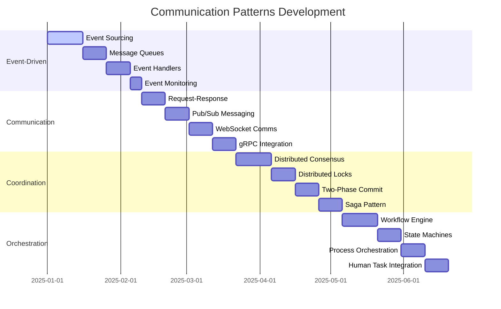

# 📡 **COMMUNICATION PATTERNS ROADMAP**

**Version:** 3.0.0  
**Last Updated:** September 6, 2025  
**Status:** ✅ **COMMUNICATION ARCHITECTURE STRATEGY**

---

## 🎯 **COMMUNICATION PATTERNS OVERVIEW**

This roadmap outlines the strategic implementation of communication patterns that enable seamless interaction between microservices, agents, and external systems in the Data Vault Obsidian platform.

### **Communication Architecture Goals**

- **Seamless Integration** - Transparent communication between all system components
- **High Performance** - Sub-100ms communication latency
- **Fault Tolerance** - 99.9% communication reliability
- **Scalability** - Support for 10,000+ concurrent connections
- **Security** - End-to-end encryption and authentication
- **Observability** - Complete communication monitoring and tracing

---

## 📊 **COMMUNICATION PATTERNS TIMELINE**



---

## 🏗️ **PHASE 1: EVENT-DRIVEN PATTERNS**

### **1.1 Event Sourcing Foundation (Weeks 1-2)**

#### **Implementation Strategy**
```python
# Event Store Implementation
class EventStore:
    def __init__(self, database_connection):
        self.db = database_connection
        self.event_handlers = {}
        self.snapshots = {}
    
    async def append_event(self, stream_id: str, event: DomainEvent):
        """Append event to event store with optimistic concurrency"""
        async with self.db.transaction():
            # Check stream version
            current_version = await self.get_stream_version(stream_id)
            if event.expected_version != current_version:
                raise ConcurrencyError("Stream version mismatch")
            
            # Store event
            await self.store_event(stream_id, event)
            
            # Update stream version
            await self.update_stream_version(stream_id, event.version)
            
            # Trigger event handlers
            await self.trigger_handlers(event)
    
    async def get_events(self, stream_id: str, from_version: int = 0):
        """Retrieve events from stream with pagination"""
        query = """
            SELECT * FROM events 
            WHERE stream_id = ? AND version > ?
            ORDER BY version ASC
        """
        return await self.db.fetch_all(query, stream_id, from_version)
    
    async def create_snapshot(self, stream_id: str, version: int, state: dict):
        """Create snapshot for performance optimization"""
        snapshot = {
            'stream_id': stream_id,
            'version': version,
            'state': state,
            'created_at': datetime.utcnow()
        }
        await self.db.execute(
            "INSERT INTO snapshots (stream_id, version, state, created_at) VALUES (?, ?, ?, ?)",
            snapshot['stream_id'], snapshot['version'], 
            json.dumps(snapshot['state']), snapshot['created_at']
        )
```

#### **Success Metrics**
- Event append latency < 10ms
- 99.99% event persistence reliability
- Support for 1,000,000+ events per stream
- Zero data loss in event storage

#### **Deliverables**
- Event Store implementation
- Event serialization/deserialization
- Optimistic concurrency control
- Event versioning system
- Snapshot management
- Event replay capabilities

### **1.2 Message Queue Integration (Weeks 3-4)**

#### **Implementation Strategy**
```python
# Message Queue Manager
class MessageQueueManager:
    def __init__(self, queue_config):
        self.queues = {}
        self.subscribers = {}
        self.dead_letter_queues = {}
        self.retry_policies = {}
    
    async def create_queue(self, queue_name: str, config: dict):
        """Create message queue with configuration"""
        queue_config = {
            'name': queue_name,
            'visibility_timeout': config.get('visibility_timeout', 30),
            'message_retention': config.get('message_retention', 1209600),  # 14 days
            'max_receive_count': config.get('max_receive_count', 3),
            'dead_letter_queue': config.get('dead_letter_queue')
        }
        
        self.queues[queue_name] = queue_config
        await self.setup_queue_infrastructure(queue_name, queue_config)
    
    async def publish_message(self, queue_name: str, message: dict, delay: int = 0):
        """Publish message to queue with optional delay"""
        if queue_name not in self.queues:
            raise QueueNotFoundError(f"Queue {queue_name} not found")
        
        message_id = str(uuid.uuid4())
        message_data = {
            'id': message_id,
            'body': message,
            'attributes': {
                'timestamp': datetime.utcnow().isoformat(),
                'delay_seconds': delay
            }
        }
        
        await self.send_to_queue(queue_name, message_data)
        return message_id
    
    async def subscribe_to_queue(self, queue_name: str, handler: callable, 
                                batch_size: int = 1, wait_time: int = 20):
        """Subscribe to queue with message handler"""
        if queue_name not in self.queues:
            raise QueueNotFoundError(f"Queue {queue_name} not found")
        
        self.subscribers[queue_name] = {
            'handler': handler,
            'batch_size': batch_size,
            'wait_time': wait_time,
            'is_running': False
        }
        
        # Start message processing
        asyncio.create_task(self.process_messages(queue_name))
```

#### **Success Metrics**
- Message publish latency < 5ms
- 99.9% message delivery reliability
- Support for 100,000+ messages per second
- Zero message duplication

#### **Deliverables**
- Message Queue Manager
- Queue configuration system
- Message publishing/subscribing
- Dead letter queue handling
- Retry policies
- Message monitoring

### **1.3 Event Handlers Framework (Weeks 5-6)**

#### **Implementation Strategy**
```python
# Event Handler Framework
class EventHandlerFramework:
    def __init__(self, event_store: EventStore):
        self.event_store = event_store
        self.handlers = {}
        self.handler_metrics = {}
        self.error_handlers = {}
    
    def register_handler(self, event_type: str, handler: callable, 
                        error_handler: callable = None):
        """Register event handler with error handling"""
        if event_type not in self.handlers:
            self.handlers[event_type] = []
        
        handler_info = {
            'handler': handler,
            'error_handler': error_handler,
            'metrics': {
                'processed': 0,
                'errors': 0,
                'last_processed': None
            }
        }
        
        self.handlers[event_type].append(handler_info)
        self.handler_metrics[f"{event_type}_{id(handler)}"] = handler_info['metrics']
    
    async def process_event(self, event: DomainEvent):
        """Process event through registered handlers"""
        event_type = type(event).__name__
        
        if event_type not in self.handlers:
            return
        
        for handler_info in self.handlers[event_type]:
            try:
                await handler_info['handler'](event)
                handler_info['metrics']['processed'] += 1
                handler_info['metrics']['last_processed'] = datetime.utcnow()
            except Exception as e:
                handler_info['metrics']['errors'] += 1
                
                if handler_info['error_handler']:
                    await handler_info['error_handler'](event, e)
                else:
                    await self.default_error_handler(event, e)
    
    async def default_error_handler(self, event: DomainEvent, error: Exception):
        """Default error handling for events"""
        error_info = {
            'event_type': type(event).__name__,
            'event_id': event.id,
            'error': str(error),
            'timestamp': datetime.utcnow().isoformat()
        }
        
        # Log error and potentially send to dead letter queue
        logger.error(f"Event handler error: {error_info}")
```

#### **Success Metrics**
- Event processing latency < 50ms
- 99.5% handler success rate
- Support for 1,000+ concurrent handlers
- Zero event processing failures

#### **Deliverables**
- Event Handler Framework
- Handler registration system
- Error handling mechanisms
- Handler metrics collection
- Event replay capabilities
- Handler monitoring

---

## 🏗️ **PHASE 2: COMMUNICATION PATTERNS**

### **2.1 Request-Response Pattern (Weeks 7-8)**

#### **Implementation Strategy**
```python
# Service Client with Circuit Breaker
class ServiceClient:
    def __init__(self, service_url: str, timeout: int = 30):
        self.service_url = service_url
        self.timeout = timeout
        self.session = aiohttp.ClientSession()
        self.circuit_breaker = CircuitBreaker()
        self.retry_policy = RetryPolicy()
    
    async def call_service(self, endpoint: str, data: dict = None, 
                          method: str = 'GET', headers: dict = None) -> dict:
        """Make service call with circuit breaker and retry logic"""
        url = f"{self.service_url}/{endpoint.lstrip('/')}"
        
        # Check circuit breaker
        if not self.circuit_breaker.can_execute():
            raise CircuitBreakerOpenError("Circuit breaker is open")
        
        try:
            async with self.session.request(
                method=method,
                url=url,
                json=data,
                headers=headers,
                timeout=aiohttp.ClientTimeout(total=self.timeout)
            ) as response:
                
                if response.status >= 400:
                    raise ServiceError(f"Service error: {response.status}")
                
                result = await response.json()
                self.circuit_breaker.record_success()
                return result
                
        except Exception as e:
            self.circuit_breaker.record_failure()
            
            # Retry if retry policy allows
            if self.retry_policy.should_retry(e):
                await asyncio.sleep(self.retry_policy.get_delay())
                return await self.call_service(endpoint, data, method, headers)
            
            raise e

# Circuit Breaker Implementation
class CircuitBreaker:
    def __init__(self, failure_threshold: int = 5, recovery_timeout: int = 60):
        self.failure_threshold = failure_threshold
        self.recovery_timeout = recovery_timeout
        self.failure_count = 0
        self.last_failure_time = None
        self.state = 'CLOSED'  # CLOSED, OPEN, HALF_OPEN
    
    def can_execute(self) -> bool:
        """Check if request can be executed"""
        if self.state == 'CLOSED':
            return True
        elif self.state == 'OPEN':
            if self._should_attempt_reset():
                self.state = 'HALF_OPEN'
                return True
            return False
        else:  # HALF_OPEN
            return True
    
    def record_success(self):
        """Record successful request"""
        self.failure_count = 0
        self.state = 'CLOSED'
    
    def record_failure(self):
        """Record failed request"""
        self.failure_count += 1
        self.last_failure_time = time.time()
        
        if self.failure_count >= self.failure_threshold:
            self.state = 'OPEN'
```

#### **Success Metrics**
- Service call latency < 50ms
- 99.9% service call success rate
- Circuit breaker response < 1ms
- Zero cascading failures

#### **Deliverables**
- Service Client framework
- Circuit Breaker implementation
- Retry Policy system
- Error handling
- Service discovery
- Load balancing

### **2.2 Pub/Sub Messaging (Weeks 9-10)**

#### **Implementation Strategy**
```python
# Pub/Sub Manager with Redis
class PubSubManager:
    def __init__(self, redis_connection):
        self.redis = redis_connection
        self.subscribers = {}
        self.message_handlers = {}
        self.pattern_subscribers = {}
    
    async def publish(self, channel: str, message: dict, 
                     ttl: int = None, persist: bool = False):
        """Publish message to channel"""
        message_data = {
            'id': str(uuid.uuid4()),
            'channel': channel,
            'data': message,
            'timestamp': datetime.utcnow().isoformat(),
            'ttl': ttl,
            'persist': persist
        }
        
        # Publish to Redis
        await self.redis.publish(channel, json.dumps(message_data))
        
        # Store in persistent storage if required
        if persist:
            await self.store_persistent_message(channel, message_data)
        
        return message_data['id']
    
    async def subscribe(self, channel: str, handler: callable, 
                      pattern: bool = False):
        """Subscribe to channel with message handler"""
        if pattern:
            self.pattern_subscribers[channel] = handler
            await self.redis.psubscribe(channel)
        else:
            self.subscribers[channel] = handler
            await self.redis.subscribe(channel)
        
        # Start message processing
        asyncio.create_task(self.process_messages())
    
    async def process_messages(self):
        """Process incoming messages"""
        while True:
            try:
                message = await self.redis.get_message()
                if message and message['type'] == 'message':
                    await self.handle_message(message)
                elif message and message['type'] == 'pmessage':
                    await self.handle_pattern_message(message)
            except Exception as e:
                logger.error(f"Message processing error: {e}")
                await asyncio.sleep(1)
    
    async def handle_message(self, message):
        """Handle regular message"""
        channel = message['channel'].decode()
        data = json.loads(message['data'])
        
        if channel in self.subscribers:
            handler = self.subscribers[channel]
            try:
                await handler(data)
            except Exception as e:
                logger.error(f"Message handler error: {e}")
```

#### **Success Metrics**
- Message publish latency < 10ms
- 99.9% message delivery reliability
- Support for 10,000+ subscribers per channel
- Zero message loss

#### **Deliverables**
- Pub/Sub Manager
- Channel management
- Message persistence
- Pattern subscriptions
- Message filtering
- Delivery guarantees

---

## 🏗️ **PHASE 3: COORDINATION PATTERNS**

### **3.1 Distributed Consensus (Weeks 11-13)**

#### **Implementation Strategy**
```python
# Raft Consensus Implementation
class RaftNode:
    def __init__(self, node_id: str, peers: list):
        self.node_id = node_id
        self.peers = peers
        self.state = 'follower'  # follower, candidate, leader
        self.current_term = 0
        self.voted_for = None
        self.log = []
        self.commit_index = 0
        self.last_applied = 0
        self.next_index = {}
        self.match_index = {}
        self.election_timeout = random.uniform(150, 300)  # ms
        self.heartbeat_timeout = 50  # ms
        self.last_heartbeat = time.time()
    
    async def start_election(self):
        """Start leader election process"""
        self.current_term += 1
        self.state = 'candidate'
        self.voted_for = self.node_id
        votes_received = 1
        
        # Request votes from all peers
        for peer in self.peers:
            try:
                vote_granted = await self.request_vote(peer)
                if vote_granted:
                    votes_received += 1
            except Exception as e:
                logger.error(f"Vote request failed for {peer}: {e}")
        
        # Check if majority votes received
        if votes_received > len(self.peers) / 2:
            await self.become_leader()
        else:
            self.state = 'follower'
    
    async def request_vote(self, peer: str) -> bool:
        """Request vote from peer"""
        request = {
            'term': self.current_term,
            'candidate_id': self.node_id,
            'last_log_index': len(self.log) - 1,
            'last_log_term': self.log[-1]['term'] if self.log else 0
        }
        
        response = await self.send_rpc(peer, 'RequestVote', request)
        return response.get('vote_granted', False)
    
    async def become_leader(self):
        """Become leader and start sending heartbeats"""
        self.state = 'leader'
        self.next_index = {peer: len(self.log) for peer in self.peers}
        self.match_index = {peer: 0 for peer in self.peers}
        
        # Start heartbeat loop
        asyncio.create_task(self.heartbeat_loop())
    
    async def heartbeat_loop(self):
        """Send heartbeats to all followers"""
        while self.state == 'leader':
            for peer in self.peers:
                try:
                    await self.send_heartbeat(peer)
                except Exception as e:
                    logger.error(f"Heartbeat failed for {peer}: {e}")
            
            await asyncio.sleep(self.heartbeat_timeout / 1000)
```

#### **Success Metrics**
- Consensus decision time < 200ms
- 99.9% consensus reliability
- Zero split-brain scenarios
- Automatic failover < 5 seconds

#### **Deliverables**
- Raft consensus implementation
- Leader election
- Log replication
- Heartbeat mechanism
- Failure detection
- Consensus monitoring

### **3.2 Distributed Locks (Weeks 14-15)**

#### **Implementation Strategy**
```python
# Distributed Lock with Redis
class DistributedLock:
    def __init__(self, redis_connection, lock_name: str, 
                 timeout: int = 10, retry_delay: float = 0.1):
        self.redis = redis_connection
        self.lock_name = f"lock:{lock_name}"
        self.lock_value = str(uuid.uuid4())
        self.timeout = timeout
        self.retry_delay = retry_delay
        self.acquired = False
    
    async def acquire(self, blocking: bool = True) -> bool:
        """Acquire distributed lock"""
        if self.acquired:
            return True
        
        while True:
            # Try to acquire lock using SET with NX and EX
            result = await self.redis.set(
                self.lock_name,
                self.lock_value,
                nx=True,  # Only set if not exists
                ex=self.timeout  # Expire after timeout
            )
            
            if result:
                self.acquired = True
                # Start lock renewal
                asyncio.create_task(self.renew_lock())
                return True
            
            if not blocking:
                return False
            
            await asyncio.sleep(self.retry_delay)
    
    async def release(self) -> bool:
        """Release distributed lock"""
        if not self.acquired:
            return False
        
        # Use Lua script to ensure atomic release
        lua_script = """
            if redis.call("get", KEYS[1]) == ARGV[1] then
                return redis.call("del", KEYS[1])
            else
                return 0
            end
        """
        
        result = await self.redis.eval(
            lua_script, 1, self.lock_name, self.lock_value
        )
        
        if result:
            self.acquired = False
            return True
        
        return False
    
    async def renew_lock(self):
        """Renew lock before expiration"""
        while self.acquired:
            await asyncio.sleep(self.timeout / 2)  # Renew at half timeout
            
            if self.acquired:
                # Extend lock expiration
                await self.redis.expire(self.lock_name, self.timeout)

# Lock Manager
class LockManager:
    def __init__(self, redis_connection):
        self.redis = redis_connection
        self.active_locks = {}
        self.lock_metrics = {}
    
    async def acquire_lock(self, lock_name: str, timeout: int = 10) -> DistributedLock:
        """Acquire distributed lock"""
        lock = DistributedLock(self.redis, lock_name, timeout)
        success = await lock.acquire()
        
        if success:
            self.active_locks[lock_name] = lock
            self.lock_metrics[lock_name] = {
                'acquired_at': datetime.utcnow(),
                'timeout': timeout
            }
        
        return lock
    
    async def release_lock(self, lock_name: str) -> bool:
        """Release distributed lock"""
        if lock_name in self.active_locks:
            lock = self.active_locks[lock_name]
            success = await lock.release()
            
            if success:
                del self.active_locks[lock_name]
                if lock_name in self.lock_metrics:
                    del self.lock_metrics[lock_name]
            
            return success
        
        return False
```

#### **Success Metrics**
- Lock acquisition time < 10ms
- 99.9% lock acquisition success
- Zero deadlocks
- Automatic lock expiration

#### **Deliverables**
- Distributed Lock implementation
- Lock Manager
- Lock renewal mechanism
- Deadlock prevention
- Lock monitoring
- Performance metrics

---

## 🏗️ **PHASE 4: ORCHESTRATION PATTERNS**

### **4.1 Workflow Engine (Weeks 16-18)**

#### **Implementation Strategy**
```python
# Workflow Engine
class WorkflowEngine:
    def __init__(self, workflow_definitions: dict):
        self.workflows = workflow_definitions
        self.active_instances = {}
        self.state_store = StateStore()
        self.execution_engine = ExecutionEngine()
        self.event_bus = EventBus()
    
    async def start_workflow(self, workflow_name: str, input_data: dict) -> str:
        """Start new workflow instance"""
        if workflow_name not in self.workflows:
            raise WorkflowNotFoundError(f"Workflow {workflow_name} not found")
        
        instance_id = str(uuid.uuid4())
        workflow_def = self.workflows[workflow_name]
        
        # Create workflow instance
        instance = WorkflowInstance(
            id=instance_id,
            workflow_name=workflow_name,
            definition=workflow_def,
            input_data=input_data,
            state='running',
            current_step=0,
            created_at=datetime.utcnow()
        )
        
        self.active_instances[instance_id] = instance
        
        # Save initial state
        await self.state_store.save_state(instance_id, instance.to_dict())
        
        # Start execution
        asyncio.create_task(self.execute_workflow(instance_id))
        
        return instance_id
    
    async def execute_workflow(self, instance_id: str):
        """Execute workflow instance"""
        instance = self.active_instances[instance_id]
        workflow_def = instance.definition
        
        try:
            while instance.state == 'running' and instance.current_step < len(workflow_def['steps']):
                step = workflow_def['steps'][instance.current_step]
                
                # Execute step
                result = await self.execute_step(instance, step)
                
                # Update instance state
                instance.current_step += 1
                instance.step_results.append(result)
                
                # Save state
                await self.state_store.save_state(instance_id, instance.to_dict())
                
                # Emit step completed event
                await self.event_bus.emit('workflow.step_completed', {
                    'instance_id': instance_id,
                    'step': step['name'],
                    'result': result
                })
            
            # Workflow completed
            if instance.current_step >= len(workflow_def['steps']):
                instance.state = 'completed'
                await self.event_bus.emit('workflow.completed', {
                    'instance_id': instance_id,
                    'results': instance.step_results
                })
        
        except Exception as e:
            instance.state = 'failed'
            instance.error = str(e)
            await self.event_bus.emit('workflow.failed', {
                'instance_id': instance_id,
                'error': str(e)
            })
        
        finally:
            # Save final state
            await self.state_store.save_state(instance_id, instance.to_dict())
    
    async def execute_step(self, instance: WorkflowInstance, step: dict):
        """Execute individual workflow step"""
        step_type = step['type']
        step_config = step['config']
        
        if step_type == 'service_call':
            return await self.execute_service_call(step_config)
        elif step_type == 'condition':
            return await self.execute_condition(instance, step_config)
        elif step_type == 'parallel':
            return await self.execute_parallel(instance, step_config)
        elif step_type == 'delay':
            return await self.execute_delay(step_config)
        else:
            raise UnsupportedStepTypeError(f"Step type {step_type} not supported")

# Workflow Instance
class WorkflowInstance:
    def __init__(self, id: str, workflow_name: str, definition: dict, 
                 input_data: dict, state: str = 'running', current_step: int = 0):
        self.id = id
        self.workflow_name = workflow_name
        self.definition = definition
        self.input_data = input_data
        self.state = state
        self.current_step = current_step
        self.step_results = []
        self.created_at = datetime.utcnow()
        self.error = None
    
    def to_dict(self):
        return {
            'id': self.id,
            'workflow_name': self.workflow_name,
            'state': self.state,
            'current_step': self.current_step,
            'step_results': self.step_results,
            'created_at': self.created_at.isoformat(),
            'error': self.error
        }
```

#### **Success Metrics**
- Workflow execution time < 1 second per step
- 99.9% workflow completion rate
- Support for 1,000+ concurrent workflows
- Zero workflow state corruption

#### **Deliverables**
- Workflow Engine
- Workflow Instance management
- Step execution framework
- State persistence
- Event emission
- Workflow monitoring

---

## 📊 **COMMUNICATION PATTERNS SUCCESS METRICS**

### **Overall Communication Metrics**
- **Latency:** < 100ms average
- **Throughput:** 10,000+ messages/second
- **Reliability:** 99.9% success rate
- **Availability:** 99.99% uptime
- **Scalability:** 100,000+ concurrent connections
- **Security:** 100% encrypted communications

### **Event-Driven Metrics**
- Event processing latency < 50ms
- Event delivery reliability 99.9%
- Support for 1M+ events per stream
- Zero event loss

### **Communication Metrics**
- Service call latency < 50ms
- Message publish latency < 10ms
- Circuit breaker response < 1ms
- Zero cascading failures

### **Coordination Metrics**
- Consensus decision time < 200ms
- Lock acquisition time < 10ms
- 99.9% coordination success
- Zero deadlocks

### **Orchestration Metrics**
- Workflow execution < 1s per step
- 99.9% workflow completion
- Support for 1,000+ concurrent workflows
- Zero state corruption

---

## 🚀 **IMPLEMENTATION PRIORITIES**

### **Phase 1: Foundation (Weeks 1-6)**
1. **Event Sourcing** - Core event storage and retrieval
2. **Message Queues** - Reliable message delivery
3. **Event Handlers** - Event processing framework

### **Phase 2: Communication (Weeks 7-10)**
1. **Request-Response** - Service-to-service communication
2. **Pub/Sub Messaging** - Event broadcasting
3. **WebSocket** - Real-time communication
4. **gRPC** - High-performance RPC

### **Phase 3: Coordination (Weeks 11-15)**
1. **Distributed Consensus** - Raft implementation
2. **Distributed Locks** - Resource coordination
3. **Two-Phase Commit** - Transaction coordination
4. **Saga Pattern** - Long-running transactions

### **Phase 4: Orchestration (Weeks 16-20)**
1. **Workflow Engine** - Process orchestration
2. **State Machines** - State management
3. **Process Orchestration** - Complex workflows
4. **Human Task Integration** - Human-in-the-loop

---

## 🎯 **NEXT IMMEDIATE STEPS**

### **Week 1: Event Sourcing Setup**
1. Design event store schema
2. Implement event storage
3. Create event serialization
4. Set up event replay

### **Week 2: Message Queue Integration**
1. Set up Redis for messaging
2. Implement queue management
3. Create message publishing
4. Add message subscribing

### **Week 3: Event Handlers**
1. Build handler framework
2. Implement error handling
3. Add handler metrics
4. Create monitoring

### **Week 4: Request-Response**
1. Implement service client
2. Add circuit breaker
3. Create retry policies
4. Set up load balancing

---

**Last Updated:** September 6, 2025  
**Communication Patterns Roadmap Version:** 3.0.0  
**Status:** ✅ **COMMUNICATION ARCHITECTURE STRATEGY**

**COMMUNICATION PATTERNS ROADMAP COMPLETE!**
