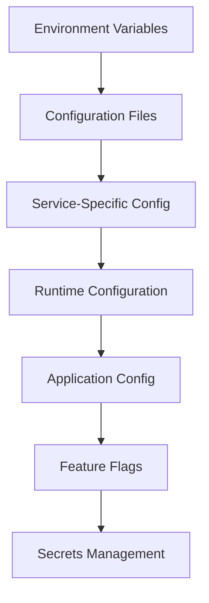

# ⚙️ **CONFIGURATION PATTERNS**

**Version:** 3.0.0  
**Last Updated:** September 6, 2025  
**Status:** ✅ **CONFIGURATION STRATEGY**

---

## 🎯 **CONFIGURATION OVERVIEW**

This document outlines comprehensive configuration patterns for the Data Vault Obsidian system, focusing on environment management, configuration validation, security, and dynamic configuration updates.

### **Configuration Goals**

- **Environment Management** - Seamless configuration across environments
- **Security** - Secure configuration handling and secrets management
- **Validation** - Comprehensive configuration validation and error handling
- **Dynamic Updates** - Runtime configuration updates without restarts
- **Centralized Management** - Unified configuration across all services
- **Type Safety** - Type-safe configuration with validation

---

## 🏗️ **CONFIGURATION ARCHITECTURE**

### **Configuration Hierarchy**


### **Configuration Layers**
1. **Environment Variables** - System-level configuration
2. **Configuration Files** - Application-level configuration
3. **Service-Specific Config** - Service-specific settings
4. **Runtime Configuration** - Dynamic configuration updates
5. **Application Config** - Application-specific settings
6. **Feature Flags** - Feature toggle configuration
7. **Secrets Management** - Secure secrets handling

---

## 🔧 **CORE CONFIGURATION PATTERNS**

### **1. Environment-Based Configuration**

#### **Implementation Strategy**
```python
# Environment Configuration Manager
class EnvironmentConfigManager:
    def __init__(self, environment: str = None):
        self.environment = environment or os.getenv('ENVIRONMENT', 'development')
        self.config_loader = ConfigLoader()
        self.validator = ConfigValidator()
        self.encryption = ConfigEncryption()
    
    async def load_configuration(self) -> dict:
        """Load configuration based on environment"""
        config = {}
        
        # Load base configuration
        base_config = await self.config_loader.load_base_config()
        config.update(base_config)
        
        # Load environment-specific configuration
        env_config = await self.config_loader.load_environment_config(self.environment)
        config.update(env_config)
        
        # Load service-specific configuration
        service_config = await self.config_loader.load_service_config()
        config.update(service_config)
        
        # Validate configuration
        await self.validator.validate_config(config)
        
        # Decrypt sensitive values
        config = await self.encryption.decrypt_config(config)
        
        return config

# Configuration Loader
class ConfigLoader:
    def __init__(self):
        self.file_loaders = {
            'yaml': YAMLConfigLoader(),
            'json': JSONConfigLoader(),
            'toml': TOMLConfigLoader(),
            'ini': INIConfigLoader()
        }
        self.env_loader = EnvironmentLoader()
        self.vault_loader = VaultLoader()
    
    async def load_base_config(self) -> dict:
        """Load base configuration from files"""
        config = {}
        
        # Load from config files
        for config_file in self.get_config_files():
            loader = self.file_loaders[config_file.extension]
            file_config = await loader.load(config_file.path)
            config.update(file_config)
        
        return config
    
    async def load_environment_config(self, environment: str) -> dict:
        """Load environment-specific configuration"""
        env_config = {}
        
        # Load environment variables
        env_vars = await self.env_loader.load_environment_variables()
        env_config.update(env_vars)
        
        # Load environment-specific files
        env_files = self.get_environment_files(environment)
        for env_file in env_files:
            loader = self.file_loaders[env_file.extension]
            file_config = await loader.load(env_file.path)
            env_config.update(file_config)
        
        return env_config

# Configuration Validator
class ConfigValidator:
    def __init__(self):
        self.validators = {
            'required': RequiredValidator(),
            'type': TypeValidator(),
            'range': RangeValidator(),
            'pattern': PatternValidator(),
            'custom': CustomValidator()
        }
        self.schema_validator = SchemaValidator()
    
    async def validate_config(self, config: dict) -> bool:
        """Validate configuration against schema"""
        # Load validation schema
        schema = await self.load_validation_schema()
        
        # Validate against schema
        validation_result = await self.schema_validator.validate(config, schema)
        
        if not validation_result.is_valid:
            raise ConfigurationError(f"Configuration validation failed: {validation_result.errors}")
        
        return True
    
    async def validate_environment(self, environment: str) -> bool:
        """Validate environment-specific configuration"""
        env_schema = await self.load_environment_schema(environment)
        env_config = await self.load_environment_config(environment)
        
        validation_result = await self.schema_validator.validate(env_config, env_schema)
        
        if not validation_result.is_valid:
            raise EnvironmentConfigurationError(f"Environment {environment} validation failed: {validation_result.errors}")
        
        return True
```

#### **Success Metrics**
- Configuration loading time < 100ms
- Validation success rate > 99%
- Environment switching time < 200ms
- Configuration error rate < 0.1%

#### **Deliverables**
- Environment Configuration Manager
- Configuration Loader
- Configuration Validator
- Environment Switching
- Configuration Caching

### **2. Secrets Management**

#### **Implementation Strategy**
```python
# Secrets Management System
class SecretsManager:
    def __init__(self, vault_config: dict):
        self.vault_config = vault_config
        self.vault_client = VaultClient(vault_config)
        self.encryption = EncryptionManager()
        self.cache = SecretsCache()
        self.rotation = SecretRotation()
    
    async def get_secret(self, secret_path: str, secret_key: str = None) -> str:
        """Get secret from vault with caching"""
        cache_key = f"{secret_path}:{secret_key or 'default'}"
        
        # Check cache first
        cached_secret = await self.cache.get(cache_key)
        if cached_secret:
            return cached_secret
        
        # Get from vault
        secret = await self.vault_client.get_secret(secret_path, secret_key)
        
        # Decrypt if needed
        if secret.get('encrypted'):
            secret = await self.encryption.decrypt(secret['value'])
        
        # Cache secret
        await self.cache.set(cache_key, secret, ttl=300)  # 5 minutes TTL
        
        return secret
    
    async def set_secret(self, secret_path: str, secret_value: str, 
                        secret_key: str = None, encrypt: bool = True) -> bool:
        """Set secret in vault"""
        # Encrypt if needed
        if encrypt:
            encrypted_value = await self.encryption.encrypt(secret_value)
            secret_data = {
                'value': encrypted_value,
                'encrypted': True,
                'created_at': datetime.utcnow().isoformat()
            }
        else:
            secret_data = {
                'value': secret_value,
                'encrypted': False,
                'created_at': datetime.utcnow().isoformat()
            }
        
        # Store in vault
        success = await self.vault_client.set_secret(secret_path, secret_data, secret_key)
        
        if success:
            # Invalidate cache
            cache_key = f"{secret_path}:{secret_key or 'default'}"
            await self.cache.delete(cache_key)
        
        return success
    
    async def rotate_secret(self, secret_path: str, secret_key: str = None) -> bool:
        """Rotate secret in vault"""
        # Generate new secret
        new_secret = await self.generate_secret()
        
        # Set new secret
        success = await self.set_secret(secret_path, new_secret, secret_key)
        
        if success:
            # Update rotation schedule
            await self.rotation.schedule_rotation(secret_path, secret_key)
        
        return success

# Vault Client
class VaultClient:
    def __init__(self, vault_config: dict):
        self.vault_url = vault_config['url']
        self.vault_token = vault_config['token']
        self.client = hvac.Client(url=self.vault_url, token=self.vault_token)
        self.retry_handler = RetryHandler()
    
    async def get_secret(self, secret_path: str, secret_key: str = None) -> str:
        """Get secret from vault"""
        try:
            response = await self.retry_handler.execute_with_retry(
                self.client.secrets.kv.v2.read_secret_version,
                path=secret_path
            )
            
            secret_data = response['data']['data']
            
            if secret_key:
                return secret_data.get(secret_key)
            else:
                return secret_data
            
        except Exception as e:
            raise VaultError(f"Failed to get secret from {secret_path}: {e}")
    
    async def set_secret(self, secret_path: str, secret_data: dict, 
                        secret_key: str = None) -> bool:
        """Set secret in vault"""
        try:
            if secret_key:
                # Update specific key in secret
                existing_secret = await self.get_secret(secret_path)
                existing_secret[secret_key] = secret_data
                secret_data = existing_secret
            
            await self.retry_handler.execute_with_retry(
                self.client.secrets.kv.v2.create_or_update_secret,
                path=secret_path,
                secret=secret_data
            )
            
            return True
            
        except Exception as e:
            raise VaultError(f"Failed to set secret in {secret_path}: {e}")
```

#### **Success Metrics**
- Secret retrieval time < 50ms
- Secret rotation success > 99%
- Encryption/decryption time < 10ms
- Cache hit rate > 90%

#### **Deliverables**
- Secrets Manager
- Vault Client
- Encryption Manager
- Secret Rotation
- Secrets Cache

### **3. Dynamic Configuration Updates**

#### **Implementation Strategy**
```python
# Dynamic Configuration Manager
class DynamicConfigManager:
    def __init__(self, config_source: str):
        self.config_source = config_source
        self.config_watcher = ConfigWatcher()
        self.config_updater = ConfigUpdater()
        self.config_validator = ConfigValidator()
        self.subscribers = {}
        self.current_config = {}
    
    async def initialize(self):
        """Initialize dynamic configuration manager"""
        # Load initial configuration
        self.current_config = await self.load_initial_config()
        
        # Setup configuration watcher
        await self.config_watcher.setup_watcher(self.config_source)
        
        # Register update handler
        await self.config_watcher.register_update_handler(self.handle_config_update)
    
    async def handle_config_update(self, new_config: dict):
        """Handle configuration updates"""
        try:
            # Validate new configuration
            await self.config_validator.validate_config(new_config)
            
            # Update current configuration
            old_config = self.current_config.copy()
            self.current_config.update(new_config)
            
            # Notify subscribers
            await self.notify_subscribers(old_config, new_config)
            
            # Log configuration change
            await self.log_config_change(old_config, new_config)
            
        except Exception as e:
            # Rollback on validation failure
            self.current_config = old_config
            raise ConfigurationUpdateError(f"Configuration update failed: {e}")
    
    async def subscribe_to_config(self, subscriber_id: str, 
                                 config_keys: list, callback: callable):
        """Subscribe to configuration changes"""
        self.subscribers[subscriber_id] = {
            'keys': config_keys,
            'callback': callback
        }
    
    async def notify_subscribers(self, old_config: dict, new_config: dict):
        """Notify subscribers of configuration changes"""
        for subscriber_id, subscriber in self.subscribers.items():
            # Check if subscribed keys changed
            changed_keys = self.get_changed_keys(
                old_config, new_config, subscriber['keys']
            )
            
            if changed_keys:
                await subscriber['callback'](changed_keys, old_config, new_config)

# Configuration Watcher
class ConfigWatcher:
    def __init__(self):
        self.watchers = {}
        self.update_handlers = []
        self.file_watcher = FileWatcher()
        self.api_watcher = APIWatcher()
        self.db_watcher = DatabaseWatcher()
    
    async def setup_watcher(self, config_source: str):
        """Setup configuration watcher based on source type"""
        if config_source.startswith('file://'):
            await self.setup_file_watcher(config_source)
        elif config_source.startswith('api://'):
            await self.setup_api_watcher(config_source)
        elif config_source.startswith('db://'):
            await self.setup_db_watcher(config_source)
        else:
            raise UnsupportedConfigSourceError(f"Unsupported config source: {config_source}")
    
    async def setup_file_watcher(self, config_source: str):
        """Setup file-based configuration watcher"""
        file_path = config_source.replace('file://', '')
        
        await self.file_watcher.watch_file(
            file_path, 
            self.handle_file_change
        )
    
    async def handle_file_change(self, file_path: str):
        """Handle file change event"""
        try:
            # Load new configuration
            new_config = await self.load_config_from_file(file_path)
            
            # Notify handlers
            for handler in self.update_handlers:
                await handler(new_config)
                
        except Exception as e:
            logger.error(f"Failed to handle file change for {file_path}: {e}")
```

#### **Success Metrics**
- Configuration update time < 100ms
- Subscriber notification time < 50ms
- Configuration validation time < 20ms
- Update success rate > 99%

#### **Deliverables**
- Dynamic Configuration Manager
- Configuration Watcher
- Configuration Updater
- Subscriber Management
- Change Notification

---

## 🔒 **SECURITY PATTERNS**

### **1. Configuration Encryption**

#### **Implementation Strategy**
```python
# Configuration Encryption
class ConfigEncryption:
    def __init__(self, encryption_key: str):
        self.encryption_key = encryption_key
        self.cipher = Fernet(encryption_key.encode())
        self.key_rotation = KeyRotation()
    
    async def encrypt_config(self, config: dict) -> dict:
        """Encrypt sensitive configuration values"""
        encrypted_config = {}
        
        for key, value in config.items():
            if self.is_sensitive_key(key):
                encrypted_value = await self.encrypt_value(value)
                encrypted_config[key] = {
                    'encrypted': True,
                    'value': encrypted_value
                }
            else:
                encrypted_config[key] = value
        
        return encrypted_config
    
    async def decrypt_config(self, config: dict) -> dict:
        """Decrypt configuration values"""
        decrypted_config = {}
        
        for key, value in config.items():
            if isinstance(value, dict) and value.get('encrypted'):
                decrypted_value = await self.decrypt_value(value['value'])
                decrypted_config[key] = decrypted_value
            else:
                decrypted_config[key] = value
        
        return decrypted_config
    
    def is_sensitive_key(self, key: str) -> bool:
        """Check if key contains sensitive information"""
        sensitive_patterns = [
            'password', 'secret', 'key', 'token', 'credential',
            'api_key', 'private_key', 'certificate'
        ]
        
        return any(pattern in key.lower() for pattern in sensitive_patterns)
```

### **2. Configuration Access Control**

#### **Implementation Strategy**
```python
# Configuration Access Control
class ConfigAccessControl:
    def __init__(self, rbac_config: dict):
        self.rbac = RoleBasedAccessControl(rbac_config)
        self.permission_cache = PermissionCache()
        self.audit_logger = AuditLogger()
    
    async def check_config_access(self, user_id: str, config_key: str, 
                                 operation: str) -> bool:
        """Check if user has access to configuration"""
        # Check permission cache
        cache_key = f"{user_id}:{config_key}:{operation}"
        cached_permission = await self.permission_cache.get(cache_key)
        
        if cached_permission is not None:
            return cached_permission
        
        # Check RBAC permissions
        has_permission = await self.rbac.check_permission(
            user_id, f"config:{operation}", config_key
        )
        
        # Cache permission
        await self.permission_cache.set(cache_key, has_permission, ttl=300)
        
        # Log access attempt
        await self.audit_logger.log_config_access(
            user_id, config_key, operation, has_permission
        )
        
        return has_permission
```

---

## 📊 **CONFIGURATION SUCCESS METRICS**

### **Overall Configuration Metrics**
- **Configuration Loading:** < 100ms
- **Validation Success:** > 99%
- **Environment Switching:** < 200ms
- **Secret Retrieval:** < 50ms
- **Dynamic Updates:** < 100ms
- **Security Compliance:** 100%

### **Environment Management Metrics**
- Environment switching time < 200ms
- Configuration validation success > 99%
- Environment-specific config loading < 100ms
- Configuration error rate < 0.1%

### **Secrets Management Metrics**
- Secret retrieval time < 50ms
- Secret rotation success > 99%
- Encryption/decryption time < 10ms
- Cache hit rate > 90%

### **Dynamic Configuration Metrics**
- Configuration update time < 100ms
- Subscriber notification time < 50ms
- Configuration validation time < 20ms
- Update success rate > 99%

---

## 🚀 **IMPLEMENTATION PRIORITIES**

### **Phase 1: Core Configuration (Weeks 1-2)**
1. **Environment Management** - Multi-environment configuration
2. **Configuration Validation** - Schema-based validation
3. **Configuration Loading** - File and environment-based loading
4. **Type Safety** - Type-safe configuration handling

### **Phase 2: Security Implementation (Weeks 3-4)**
1. **Secrets Management** - Vault integration and encryption
2. **Access Control** - Role-based configuration access
3. **Audit Logging** - Configuration access logging
4. **Key Rotation** - Automatic secret rotation

### **Phase 3: Dynamic Configuration (Weeks 5-6)**
1. **Dynamic Updates** - Runtime configuration updates
2. **Configuration Watching** - File and API-based watching
3. **Subscriber Management** - Configuration change notifications
4. **Rollback Support** - Configuration rollback capabilities

### **Phase 4: Advanced Features (Weeks 7-8)**
1. **Configuration Templates** - Reusable configuration templates
2. **Configuration Migration** - Environment migration tools
3. **Configuration Testing** - Configuration validation testing
4. **Monitoring** - Configuration change monitoring

---

## 🎯 **NEXT IMMEDIATE STEPS**

### **Week 1: Environment Management**
1. Implement environment-based configuration
2. Add configuration validation
3. Setup configuration loading
4. Test environment switching

### **Week 2: Security Implementation**
1. Implement secrets management
2. Add configuration encryption
3. Setup access control
4. Test security features

### **Week 3: Dynamic Configuration**
1. Implement dynamic updates
2. Add configuration watching
3. Setup subscriber management
4. Test dynamic features

### **Week 4: Advanced Features**
1. Add configuration templates
2. Implement migration tools
3. Setup monitoring
4. Complete testing

---

**Last Updated:** September 6, 2025  
**Configuration Patterns Version:** 3.0.0  
**Status:** ✅ **CONFIGURATION STRATEGY**

**CONFIGURATION PATTERNS COMPLETE!**
