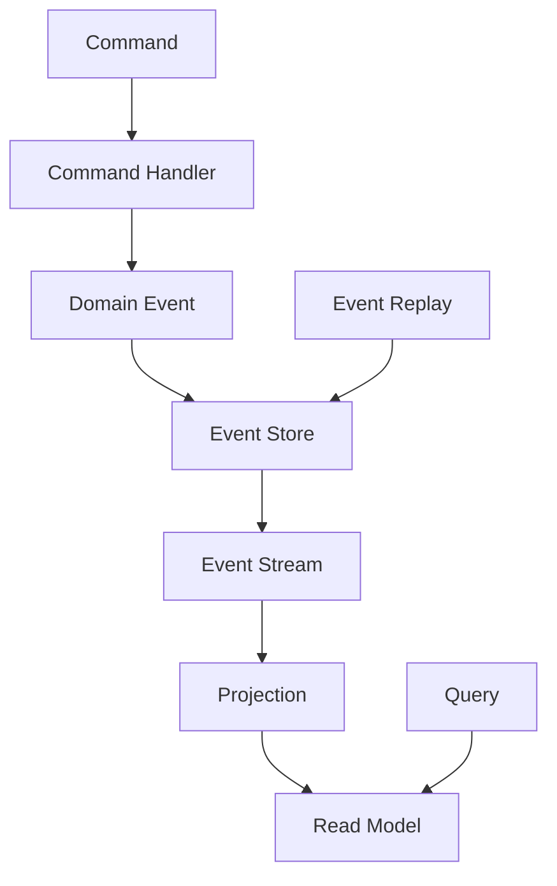
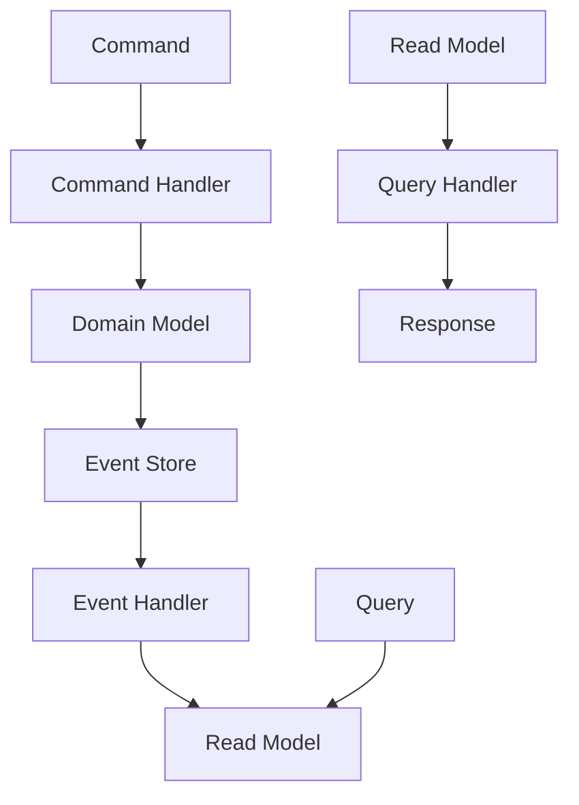
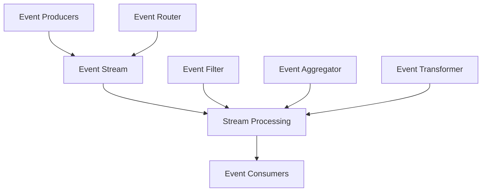
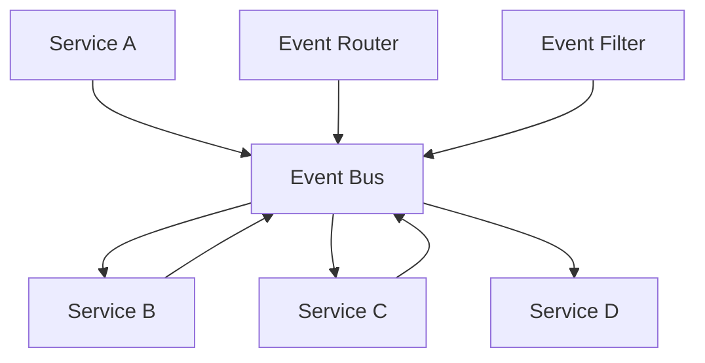

# 🔄 **EVENT-DRIVEN PATTERNS**

**Version:** 3.0.0  
**Last Updated:** September 6, 2025  
**Status:** ✅ **PRODUCTION READY**

---

## 🎯 **OVERVIEW**

Event-driven patterns provide a robust foundation for building loosely coupled, scalable, and responsive systems in the Data Vault Obsidian platform. These patterns enable asynchronous communication, real-time processing, and dynamic system behavior through event-based interactions.

### **Key Benefits**
- **Loose Coupling** - Services communicate through events without direct dependencies
- **Scalability** - Event-driven systems can scale horizontally with demand
- **Responsiveness** - Real-time event processing enables immediate system responses
- **Resilience** - Event-driven systems can handle failures gracefully through retry and compensation patterns
- **Flexibility** - Easy to add new event handlers and modify system behavior

---

## 🏗️ **CORE EVENT-DRIVEN PATTERNS**

### **1. Event Sourcing Pattern**

#### **Pattern Description**
Event Sourcing captures all changes to application state as a sequence of events, storing these events as the primary source of truth rather than storing current state.

#### **Implementation Architecture**


#### **Key Components**

**Event Store**
```python
# event_store.py
from typing import List, Optional
from dataclasses import dataclass
from datetime import datetime
import json

@dataclass
class Event:
    id: str
    aggregate_id: str
    event_type: str
    data: dict
    metadata: dict
    version: int
    timestamp: datetime

class EventStore:
    def __init__(self, storage_backend):
        self.storage = storage_backend
        self.event_handlers = []
    
    async def append_events(self, aggregate_id: str, events: List[Event], expected_version: int):
        """Append events to the event store with optimistic concurrency control"""
        current_version = await self.get_aggregate_version(aggregate_id)
        
        if current_version != expected_version:
            raise ConcurrencyError(f"Expected version {expected_version}, got {current_version}")
        
        for event in events:
            await self.storage.append_event(event)
            await self.publish_event(event)
    
    async def get_events(self, aggregate_id: str, from_version: int = 0) -> List[Event]:
        """Retrieve events for a specific aggregate"""
        return await self.storage.get_events(aggregate_id, from_version)
    
    async def get_events_by_type(self, event_type: str, from_timestamp: datetime = None) -> List[Event]:
        """Retrieve events by type with optional timestamp filtering"""
        return await self.storage.get_events_by_type(event_type, from_timestamp)
    
    async def subscribe(self, event_type: str, handler):
        """Subscribe to events of a specific type"""
        self.event_handlers.append((event_type, handler))
    
    async def publish_event(self, event: Event):
        """Publish event to all registered handlers"""
        for event_type, handler in self.event_handlers:
            if event.event_type == event_type or event_type == "*":
                await handler(event)
```

**Event Handler Example**
```python
# user_event_handlers.py
from typing import Dict, Any
from .event_store import Event, EventStore

class UserEventHandlers:
    def __init__(self, event_store: EventStore, read_model: UserReadModel):
        self.event_store = event_store
        self.read_model = read_model
        self._register_handlers()
    
    def _register_handlers(self):
        self.event_store.subscribe("UserCreated", self.handle_user_created)
        self.event_store.subscribe("UserUpdated", self.handle_user_updated)
        self.event_store.subscribe("UserDeleted", self.handle_user_deleted)
    
    async def handle_user_created(self, event: Event):
        """Handle user creation event"""
        user_data = {
            "id": event.aggregate_id,
            "email": event.data["email"],
            "name": event.data["name"],
            "created_at": event.timestamp,
            "version": event.version
        }
        await self.read_model.create_user(user_data)
    
    async def handle_user_updated(self, event: Event):
        """Handle user update event"""
        updates = event.data
        await self.read_model.update_user(event.aggregate_id, updates, event.version)
    
    async def handle_user_deleted(self, event: Event):
        """Handle user deletion event"""
        await self.read_model.delete_user(event.aggregate_id)
```

#### **Benefits**
- **Complete Audit Trail** - Every change is recorded as an event
- **Temporal Queries** - Can query system state at any point in time
- **Debugging** - Easy to replay events to debug issues
- **Scalability** - Events can be processed asynchronously

#### **Use Cases**
- **User Management** - Track all user account changes
- **Order Processing** - Complete order lifecycle tracking
- **Financial Transactions** - Audit trail for compliance
- **System Configuration** - Track configuration changes

### **2. CQRS (Command Query Responsibility Segregation) Pattern**

#### **Pattern Description**
CQRS separates read and write operations by using different models for commands (writes) and queries (reads), enabling independent optimization of each operation type.

#### **Implementation Architecture**


#### **Key Components**

**Command Side**
```python
# command_handlers.py
from typing import Dict, Any
from dataclasses import dataclass
from .event_store import EventStore
from .domain_models import User, UserCreated, UserUpdated

@dataclass
class CreateUserCommand:
    user_id: str
    email: str
    name: str
    password_hash: str

@dataclass
class UpdateUserCommand:
    user_id: str
    email: str = None
    name: str = None
    password_hash: str = None

class UserCommandHandler:
    def __init__(self, event_store: EventStore):
        self.event_store = event_store
    
    async def handle_create_user(self, command: CreateUserCommand):
        """Handle user creation command"""
        # Validate command
        if not command.email or not command.name:
            raise ValueError("Email and name are required")
        
        # Create domain event
        event = UserCreated(
            id=f"user-{command.user_id}",
            aggregate_id=command.user_id,
            event_type="UserCreated",
            data={
                "email": command.email,
                "name": command.name,
                "password_hash": command.password_hash
            },
            metadata={"source": "command_handler"},
            version=1,
            timestamp=datetime.utcnow()
        )
        
        # Append to event store
        await self.event_store.append_events(command.user_id, [event], 0)
    
    async def handle_update_user(self, command: UpdateUserCommand):
        """Handle user update command"""
        # Get current version
        current_version = await self.event_store.get_aggregate_version(command.user_id)
        
        # Create update event
        event = UserUpdated(
            id=f"user-update-{command.user_id}",
            aggregate_id=command.user_id,
            event_type="UserUpdated",
            data={k: v for k, v in command.__dict__.items() if v is not None},
            metadata={"source": "command_handler"},
            version=current_version + 1,
            timestamp=datetime.utcnow()
        )
        
        # Append to event store
        await self.event_store.append_events(command.user_id, [event], current_version)
```

**Query Side**
```python
# query_handlers.py
from typing import List, Optional, Dict, Any
from dataclasses import dataclass
from .read_models import UserReadModel

@dataclass
class GetUserQuery:
    user_id: str

@dataclass
class ListUsersQuery:
    page: int = 1
    page_size: int = 10
    filters: Dict[str, Any] = None

@dataclass
class SearchUsersQuery:
    search_term: str
    page: int = 1
    page_size: int = 10

class UserQueryHandler:
    def __init__(self, read_model: UserReadModel):
        self.read_model = read_model
    
    async def handle_get_user(self, query: GetUserQuery) -> Optional[Dict[str, Any]]:
        """Handle get user query"""
        return await self.read_model.get_user(query.user_id)
    
    async def handle_list_users(self, query: ListUsersQuery) -> Dict[str, Any]:
        """Handle list users query"""
        users = await self.read_model.list_users(
            page=query.page,
            page_size=query.page_size,
            filters=query.filters or {}
        )
        return {
            "users": users,
            "page": query.page,
            "page_size": query.page_size,
            "total": await self.read_model.count_users(query.filters or {})
        }
    
    async def handle_search_users(self, query: SearchUsersQuery) -> Dict[str, Any]:
        """Handle search users query"""
        users = await self.read_model.search_users(
            search_term=query.search_term,
            page=query.page,
            page_size=query.page_size
        )
        return {
            "users": users,
            "search_term": query.search_term,
            "page": query.page,
            "page_size": query.page_size
        }
```

#### **Benefits**
- **Independent Scaling** - Read and write models can scale independently
- **Optimized Performance** - Each model optimized for its specific use case
- **Simplified Queries** - Read models can be denormalized for complex queries
- **Technology Flexibility** - Different technologies for read and write sides

#### **Use Cases**
- **High-Read Systems** - Systems with many more reads than writes
- **Complex Queries** - Systems requiring complex reporting and analytics
- **Performance Critical** - Systems requiring optimized read performance
- **Microservices** - Independent scaling of read and write operations

### **3. Event Streaming Pattern**

#### **Pattern Description**
Event Streaming enables real-time processing of continuous streams of events, providing low-latency, high-throughput event processing capabilities.

#### **Implementation Architecture**


#### **Key Components**

**Event Stream Processor**
```python
# event_stream_processor.py
import asyncio
from typing import Dict, Any, Callable, List
from dataclasses import dataclass
from datetime import datetime
import json

@dataclass
class StreamEvent:
    id: str
    stream_id: str
    event_type: str
    data: Dict[str, Any]
    metadata: Dict[str, Any]
    timestamp: datetime
    partition_key: str = None

class EventStreamProcessor:
    def __init__(self, stream_backend):
        self.stream_backend = stream_backend
        self.consumers = {}
        self.producers = {}
        self.running = False
    
    async def create_stream(self, stream_name: str, partitions: int = 1):
        """Create a new event stream"""
        await self.stream_backend.create_stream(stream_name, partitions)
    
    async def publish_event(self, stream_name: str, event: StreamEvent):
        """Publish event to stream"""
        await self.stream_backend.publish_event(stream_name, event)
    
    async def subscribe_to_stream(self, stream_name: str, consumer_group: str, handler: Callable):
        """Subscribe to stream events"""
        if stream_name not in self.consumers:
            self.consumers[stream_name] = {}
        
        self.consumers[stream_name][consumer_group] = handler
        await self.stream_backend.subscribe(stream_name, consumer_group, handler)
    
    async def start_processing(self):
        """Start event stream processing"""
        self.running = True
        tasks = []
        
        for stream_name, consumer_groups in self.consumers.items():
            for consumer_group, handler in consumer_groups.items():
                task = asyncio.create_task(
                    self._process_stream(stream_name, consumer_group, handler)
                )
                tasks.append(task)
        
        await asyncio.gather(*tasks)
    
    async def _process_stream(self, stream_name: str, consumer_group: str, handler: Callable):
        """Process events from a specific stream"""
        while self.running:
            try:
                events = await self.stream_backend.consume_events(stream_name, consumer_group)
                for event in events:
                    await handler(event)
            except Exception as e:
                print(f"Error processing stream {stream_name}: {e}")
                await asyncio.sleep(1)  # Backoff on error
    
    async def stop_processing(self):
        """Stop event stream processing"""
        self.running = False
```

**Stream Event Handlers**
```python
# stream_event_handlers.py
from typing import Dict, Any
from .event_stream_processor import StreamEvent, EventStreamProcessor

class UserActivityStreamHandler:
    def __init__(self, stream_processor: EventStreamProcessor, analytics_service):
        self.stream_processor = stream_processor
        self.analytics_service = analytics_service
        self._register_handlers()
    
    def _register_handlers(self):
        self.stream_processor.subscribe_to_stream(
            "user-activity", 
            "analytics-group", 
            self.handle_user_activity
        )
    
    async def handle_user_activity(self, event: StreamEvent):
        """Handle user activity events"""
        if event.event_type == "UserLogin":
            await self._process_login_event(event)
        elif event.event_type == "UserAction":
            await self._process_action_event(event)
        elif event.event_type == "UserLogout":
            await self._process_logout_event(event)
    
    async def _process_login_event(self, event: StreamEvent):
        """Process user login event"""
        user_id = event.data["user_id"]
        login_time = event.timestamp
        
        # Update user session analytics
        await self.analytics_service.record_login(user_id, login_time)
        
        # Check for suspicious activity
        await self.analytics_service.check_suspicious_activity(user_id)
    
    async def _process_action_event(self, event: StreamEvent):
        """Process user action event"""
        user_id = event.data["user_id"]
        action = event.data["action"]
        metadata = event.data.get("metadata", {})
        
        # Record user action
        await self.analytics_service.record_action(user_id, action, metadata)
        
        # Update user behavior patterns
        await self.analytics_service.update_behavior_patterns(user_id, action)
    
    async def _process_logout_event(self, event: StreamEvent):
        """Process user logout event"""
        user_id = event.data["user_id"]
        logout_time = event.timestamp
        
        # Update session analytics
        await self.analytics_service.record_logout(user_id, logout_time)
```

#### **Benefits**
- **Real-time Processing** - Low-latency event processing
- **High Throughput** - Can handle millions of events per second
- **Scalability** - Horizontal scaling through partitioning
- **Fault Tolerance** - Built-in retry and error handling

#### **Use Cases**
- **Real-time Analytics** - Live user behavior analysis
- **IoT Data Processing** - Sensor data stream processing
- **Financial Trading** - Real-time market data processing
- **Log Processing** - Real-time log analysis and monitoring

### **4. Event Choreography Pattern**

#### **Pattern Description**
Event Choreography enables decentralized coordination between services through event exchange, where each service knows what events to listen for and what events to publish.

#### **Implementation Architecture**


#### **Key Components**

**Event Choreography Coordinator**
```python
# event_choreography.py
from typing import Dict, Any, List, Callable
from dataclasses import dataclass
from datetime import datetime
import asyncio

@dataclass
class ChoreographyEvent:
    id: str
    event_type: str
    data: Dict[str, Any]
    metadata: Dict[str, Any]
    timestamp: datetime
    correlation_id: str = None
    causation_id: str = None

class EventChoreographyCoordinator:
    def __init__(self, event_bus):
        self.event_bus = event_bus
        self.event_handlers = {}
        self.event_routes = {}
        self.running = False
    
    def register_service(self, service_name: str, event_types: List[str], handler: Callable):
        """Register a service with its event handlers"""
        self.event_handlers[service_name] = {
            "event_types": event_types,
            "handler": handler
        }
    
    def define_choreography(self, choreography_name: str, steps: List[Dict[str, Any]]):
        """Define a choreography workflow"""
        self.event_routes[choreography_name] = steps
    
    async def start_choreography(self, choreography_name: str, initial_event: ChoreographyEvent):
        """Start a choreography workflow"""
        if choreography_name not in self.event_routes:
            raise ValueError(f"Choreography {choreography_name} not found")
        
        steps = self.event_routes[choreography_name]
        current_event = initial_event
        
        for step in steps:
            service_name = step["service"]
            event_type = step["event_type"]
            
            if service_name in self.event_handlers:
                handler = self.event_handlers[service_name]["handler"]
                result = await handler(current_event)
                
                if result:
                    current_event = ChoreographyEvent(
                        id=f"{choreography_name}-{step['step']}",
                        event_type=event_type,
                        data=result,
                        metadata={"choreography": choreography_name, "step": step["step"]},
                        timestamp=datetime.utcnow(),
                        correlation_id=current_event.correlation_id,
                        causation_id=current_event.id
                    )
                    
                    await self.event_bus.publish(current_event)
    
    async def process_event(self, event: ChoreographyEvent):
        """Process an incoming event"""
        for service_name, service_info in self.event_handlers.items():
            if event.event_type in service_info["event_types"]:
                handler = service_info["handler"]
                await handler(event)
```

**Order Processing Choreography Example**
```python
# order_processing_choreography.py
from typing import Dict, Any
from .event_choreography import EventChoreographyCoordinator, ChoreographyEvent

class OrderProcessingChoreography:
    def __init__(self, coordinator: EventChoreographyCoordinator):
        self.coordinator = coordinator
        self._setup_choreography()
    
    def _setup_choreography(self):
        """Setup order processing choreography"""
        # Define the choreography steps
        choreography_steps = [
            {"step": 1, "service": "inventory", "event_type": "ReserveInventory"},
            {"step": 2, "service": "payment", "event_type": "ProcessPayment"},
            {"step": 3, "service": "shipping", "event_type": "CreateShipment"},
            {"step": 4, "service": "notification", "event_type": "SendConfirmation"}
        ]
        
        self.coordinator.define_choreography("order_processing", choreography_steps)
        
        # Register service handlers
        self.coordinator.register_service("inventory", ["ReserveInventory"], self.handle_inventory_reservation)
        self.coordinator.register_service("payment", ["ProcessPayment"], self.handle_payment_processing)
        self.coordinator.register_service("shipping", ["CreateShipment"], self.handle_shipment_creation)
        self.coordinator.register_service("notification", ["SendConfirmation"], self.handle_confirmation)
    
    async def handle_inventory_reservation(self, event: ChoreographyEvent) -> Dict[str, Any]:
        """Handle inventory reservation"""
        order_id = event.data["order_id"]
        items = event.data["items"]
        
        # Reserve inventory
        reservation_result = await self.reserve_inventory(items)
        
        if reservation_result["success"]:
            return {
                "order_id": order_id,
                "reservation_id": reservation_result["reservation_id"],
                "items_reserved": reservation_result["items_reserved"]
            }
        else:
            # Publish failure event
            await self.coordinator.event_bus.publish(ChoreographyEvent(
                id=f"inventory-failure-{order_id}",
                event_type="InventoryReservationFailed",
                data={"order_id": order_id, "reason": reservation_result["reason"]},
                metadata={"choreography": "order_processing"},
                timestamp=datetime.utcnow(),
                correlation_id=event.correlation_id,
                causation_id=event.id
            ))
            return None
    
    async def handle_payment_processing(self, event: ChoreographyEvent) -> Dict[str, Any]:
        """Handle payment processing"""
        order_id = event.data["order_id"]
        payment_info = event.data["payment_info"]
        
        # Process payment
        payment_result = await self.process_payment(payment_info)
        
        if payment_result["success"]:
            return {
                "order_id": order_id,
                "payment_id": payment_result["payment_id"],
                "amount": payment_result["amount"]
            }
        else:
            # Publish failure event
            await self.coordinator.event_bus.publish(ChoreographyEvent(
                id=f"payment-failure-{order_id}",
                event_type="PaymentProcessingFailed",
                data={"order_id": order_id, "reason": payment_result["reason"]},
                metadata={"choreography": "order_processing"},
                timestamp=datetime.utcnow(),
                correlation_id=event.correlation_id,
                causation_id=event.id
            ))
            return None
    
    async def handle_shipment_creation(self, event: ChoreographyEvent) -> Dict[str, Any]:
        """Handle shipment creation"""
        order_id = event.data["order_id"]
        shipping_address = event.data["shipping_address"]
        
        # Create shipment
        shipment_result = await self.create_shipment(order_id, shipping_address)
        
        return {
            "order_id": order_id,
            "shipment_id": shipment_result["shipment_id"],
            "tracking_number": shipment_result["tracking_number"]
        }
    
    async def handle_confirmation(self, event: ChoreographyEvent) -> Dict[str, Any]:
        """Handle confirmation sending"""
        order_id = event.data["order_id"]
        customer_email = event.data["customer_email"]
        
        # Send confirmation
        await self.send_confirmation(order_id, customer_email)
        
        return {
            "order_id": order_id,
            "confirmation_sent": True
        }
```

#### **Benefits**
- **Decentralized Coordination** - No central orchestrator required
- **Loose Coupling** - Services only know about events, not other services
- **Flexibility** - Easy to add or remove services from choreography
- **Resilience** - Services can fail independently without affecting others

#### **Use Cases**
- **Order Processing** - Multi-step order fulfillment
- **Document Workflow** - Document approval and processing
- **User Onboarding** - Multi-step user registration process
- **Content Publishing** - Content review and publication workflow

---

## 🔧 **IMPLEMENTATION GUIDELINES**

### **Event Design Principles**

#### **1. Event Naming Conventions**
```python
# Good event naming
"UserCreated"           # Past tense, clear action
"OrderProcessed"        # Past tense, clear action
"PaymentFailed"         # Past tense, clear action

# Bad event naming
"CreateUser"            # Present tense
"User"                  # Not descriptive
"ProcessOrder"          # Present tense
```

#### **2. Event Structure Standards**
```python
@dataclass
class StandardEvent:
    id: str                    # Unique event identifier
    event_type: str           # Event type (e.g., "UserCreated")
    aggregate_id: str         # ID of the aggregate that produced the event
    data: Dict[str, Any]      # Event payload
    metadata: Dict[str, Any]  # Event metadata (source, version, etc.)
    timestamp: datetime       # Event timestamp
    version: int             # Event version for schema evolution
    correlation_id: str      # For tracing related events
    causation_id: str        # For tracing event chains
```

#### **3. Event Versioning Strategy**
```python
# Event versioning for schema evolution
class UserCreatedV1:
    user_id: str
    email: str
    name: str

class UserCreatedV2:
    user_id: str
    email: str
    name: str
    phone: str  # New field added

# Event handler with version support
async def handle_user_created(event: Event):
    if event.version == 1:
        data = UserCreatedV1(**event.data)
    elif event.version == 2:
        data = UserCreatedV2(**event.data)
    else:
        raise ValueError(f"Unsupported event version: {event.version}")
```

### **Error Handling and Resilience**

#### **1. Retry Pattern with Exponential Backoff**
```python
import asyncio
from typing import Callable, Any
import random

class EventRetryHandler:
    def __init__(self, max_retries: int = 3, base_delay: float = 1.0):
        self.max_retries = max_retries
        self.base_delay = base_delay
    
    async def execute_with_retry(self, handler: Callable, event: Event) -> Any:
        """Execute event handler with retry logic"""
        last_exception = None
        
        for attempt in range(self.max_retries + 1):
            try:
                return await handler(event)
            except Exception as e:
                last_exception = e
                
                if attempt < self.max_retries:
                    delay = self.base_delay * (2 ** attempt) + random.uniform(0, 1)
                    await asyncio.sleep(delay)
                else:
                    # Log failure and potentially send to dead letter queue
                    await self._handle_final_failure(event, e)
        
        raise last_exception
    
    async def _handle_final_failure(self, event: Event, error: Exception):
        """Handle final failure after all retries"""
        # Log the failure
        print(f"Event {event.id} failed after {self.max_retries} retries: {error}")
        
        # Send to dead letter queue for manual processing
        await self._send_to_dead_letter_queue(event, error)
```

#### **2. Circuit Breaker Pattern**
```python
from enum import Enum
from datetime import datetime, timedelta

class CircuitState(Enum):
    CLOSED = "closed"
    OPEN = "open"
    HALF_OPEN = "half_open"

class CircuitBreaker:
    def __init__(self, failure_threshold: int = 5, timeout: int = 60):
        self.failure_threshold = failure_threshold
        self.timeout = timeout
        self.failure_count = 0
        self.last_failure_time = None
        self.state = CircuitState.CLOSED
    
    async def execute(self, handler: Callable, event: Event) -> Any:
        """Execute handler with circuit breaker protection"""
        if self.state == CircuitState.OPEN:
            if self._should_attempt_reset():
                self.state = CircuitState.HALF_OPEN
            else:
                raise Exception("Circuit breaker is OPEN")
        
        try:
            result = await handler(event)
            self._on_success()
            return result
        except Exception as e:
            self._on_failure()
            raise e
    
    def _should_attempt_reset(self) -> bool:
        """Check if circuit breaker should attempt reset"""
        return (datetime.utcnow() - self.last_failure_time).seconds >= self.timeout
    
    def _on_success(self):
        """Handle successful execution"""
        self.failure_count = 0
        self.state = CircuitState.CLOSED
    
    def _on_failure(self):
        """Handle failed execution"""
        self.failure_count += 1
        self.last_failure_time = datetime.utcnow()
        
        if self.failure_count >= self.failure_threshold:
            self.state = CircuitState.OPEN
```

### **Performance Optimization**

#### **1. Event Batching**
```python
class EventBatcher:
    def __init__(self, batch_size: int = 100, flush_interval: float = 1.0):
        self.batch_size = batch_size
        self.flush_interval = flush_interval
        self.batch = []
        self.last_flush = datetime.utcnow()
    
    async def add_event(self, event: Event):
        """Add event to batch"""
        self.batch.append(event)
        
        if len(self.batch) >= self.batch_size:
            await self.flush()
        elif (datetime.utcnow() - self.last_flush).seconds >= self.flush_interval:
            await self.flush()
    
    async def flush(self):
        """Flush current batch"""
        if self.batch:
            await self._process_batch(self.batch)
            self.batch = []
            self.last_flush = datetime.utcnow()
    
    async def _process_batch(self, events: List[Event]):
        """Process batch of events"""
        # Implement batch processing logic
        pass
```

#### **2. Event Partitioning**
```python
class EventPartitioner:
    def __init__(self, partition_count: int = 4):
        self.partition_count = partition_count
    
    def get_partition(self, event: Event) -> int:
        """Get partition for event based on partition key"""
        if event.partition_key:
            return hash(event.partition_key) % self.partition_count
        else:
            return hash(event.aggregate_id) % self.partition_count
    
    async def route_event(self, event: Event, handlers: List[Callable]):
        """Route event to appropriate partition handler"""
        partition = self.get_partition(event)
        handler = handlers[partition]
        await handler(event)
```

---

## 📊 **MONITORING AND OBSERVABILITY**

### **Event Metrics**
```python
class EventMetrics:
    def __init__(self):
        self.event_counts = {}
        self.processing_times = {}
        self.error_counts = {}
        self.throughput = 0
    
    def record_event(self, event_type: str, processing_time: float, success: bool):
        """Record event processing metrics"""
        # Update event counts
        self.event_counts[event_type] = self.event_counts.get(event_type, 0) + 1
        
        # Update processing times
        if event_type not in self.processing_times:
            self.processing_times[event_type] = []
        self.processing_times[event_type].append(processing_time)
        
        # Update error counts
        if not success:
            self.error_counts[event_type] = self.error_counts.get(event_type, 0) + 1
        
        # Update throughput
        self.throughput += 1
    
    def get_metrics(self) -> Dict[str, Any]:
        """Get current metrics"""
        return {
            "event_counts": self.event_counts,
            "average_processing_times": {
                event_type: sum(times) / len(times)
                for event_type, times in self.processing_times.items()
            },
            "error_counts": self.error_counts,
            "throughput": self.throughput
        }
```

### **Event Tracing**
```python
class EventTracer:
    def __init__(self, tracing_backend):
        self.tracing_backend = tracing_backend
    
    async def trace_event_flow(self, event: Event, handler: Callable):
        """Trace event flow through handlers"""
        with self.tracing_backend.start_span(f"event_{event.event_type}") as span:
            span.set_attribute("event.id", event.id)
            span.set_attribute("event.type", event.event_type)
            span.set_attribute("event.aggregate_id", event.aggregate_id)
            
            try:
                result = await handler(event)
                span.set_attribute("event.success", True)
                return result
            except Exception as e:
                span.set_attribute("event.success", False)
                span.set_attribute("event.error", str(e))
                raise
```

---

## 🚀 **IMPLEMENTATION ROADMAP**

### **Phase 1: Foundation (Weeks 1-2)**
1. **Event Store Setup** - Implement basic event store
2. **Event Sourcing** - Implement event sourcing pattern
3. **Basic Event Handlers** - Create simple event handlers
4. **Event Publishing** - Implement event publishing mechanism

### **Phase 2: Advanced Patterns (Weeks 3-4)**
1. **CQRS Implementation** - Separate command and query models
2. **Event Streaming** - Implement event streaming capabilities
3. **Event Choreography** - Add choreography patterns
4. **Error Handling** - Implement retry and circuit breaker patterns

### **Phase 3: Optimization (Weeks 5-6)**
1. **Performance Tuning** - Optimize event processing performance
2. **Monitoring** - Add comprehensive monitoring and metrics
3. **Testing** - Implement comprehensive testing strategy
4. **Documentation** - Complete documentation and examples

### **Phase 4: Production (Weeks 7-8)**
1. **Production Deployment** - Deploy to production environment
2. **Performance Monitoring** - Monitor production performance
3. **Issue Resolution** - Address any production issues
4. **Continuous Improvement** - Ongoing optimization and enhancement

---

## 🔗 **RELATED PATTERNS**

### **Complementary Patterns**
- **[Communication Patterns](COMMUNICATION_PATTERNS.md)** - Inter-service communication patterns
- **[Coordination Patterns](COORDINATION_PATTERNS.md)** - Service coordination patterns
- **[Orchestration Patterns](ORCHESTRATION_PATTERNS.md)** - Workflow orchestration patterns
- **[Async Patterns](ASYNC_PATTERNS.md)** - Asynchronous programming patterns

### **Architecture Patterns**
- **[API Design Patterns](API_DESIGN_PATTERNS.md)** - API design and implementation
- **[Database Patterns](DATABASE_PATTERNS.md)** - Data persistence patterns
- **[Caching Patterns](CACHING_PATTERNS.md)** - Caching strategies
- **[Logging Patterns](LOGGING_PATTERNS.md)** - Logging and monitoring patterns

---

**Last Updated:** September 6, 2025  
**Event-Driven Patterns Version:** 3.0.0  
**Status:** ✅ **PRODUCTION READY**

**EVENT-DRIVEN PATTERNS COMPLETE!**
