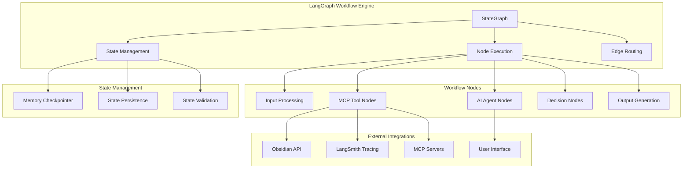

# 🔄 **LANGGRAPH WORKFLOW ARCHITECTURE & PATTERNS**

**Version:** 3.0.0  
**Last Updated:** September 6, 2025  
**Status:** ✅ **PRODUCTION-READY LANGGRAPH INTEGRATION**

---

## 🎯 **LANGGRAPH ARCHITECTURE OVERVIEW**

LangGraph serves as the **Workflow Orchestration Engine** in Data Vault Obsidian, implementing **Stateful Workflow Management** with **Multi-Agent Coordination** and **Human-in-the-Loop** capabilities.

### **Core LangGraph Components**



---

## 🏗️ **LANGGRAPH WORKFLOW PATTERNS**

### **1. Stateful Workflow Pattern**

#### **State Definition**
```python
from typing import TypedDict, Optional, List, Dict, Any
from langgraph import StateGraph, END

class WorkflowState(TypedDict):
    # Input data
    input_data: str
    user_id: str
    session_id: str
    
    # Processing state
    current_step: str
    processing_status: str
    error_message: Optional[str]
    
    # Obsidian integration
    obsidian_note_id: Optional[str]
    obsidian_content: Optional[str]
    obsidian_metadata: Optional[Dict[str, Any]]
    
    # LangSmith tracing
    trace_id: Optional[str]
    langsmith_session_id: Optional[str]
    trace_metadata: Optional[Dict[str, Any]]
    
    # MCP tool results
    mcp_tool_results: Dict[str, Any]
    tool_errors: Dict[str, str]
    
    # Workflow output
    final_result: Optional[Dict[str, Any]]
    success: bool
    completion_timestamp: Optional[str]
```

#### **Workflow Implementation**
```python
def create_obsidian_workflow(mcp_client: MCPClient, langsmith_client: LangSmithClient) -> StateGraph:
    """Create a comprehensive Obsidian workflow with LangGraph"""
    
    # Initialize workflow
    workflow = StateGraph(WorkflowState)
    
    # Add workflow nodes
    workflow.add_node("initialize", initialize_workflow_node)
    workflow.add_node("create_trace", create_trace_node)
    workflow.add_node("process_input", process_input_node)
    workflow.add_node("create_obsidian_note", create_obsidian_note_node)
    workflow.add_node("index_content", index_content_node)
    workflow.add_node("generate_metadata", generate_metadata_node)
    workflow.add_node("finalize_workflow", finalize_workflow_node)
    workflow.add_node("handle_error", handle_error_node)
    
    # Define workflow edges
    workflow.add_edge("initialize", "create_trace")
    workflow.add_edge("create_trace", "process_input")
    workflow.add_edge("process_input", "create_obsidian_note")
    workflow.add_edge("create_obsidian_note", "index_content")
    workflow.add_edge("index_content", "generate_metadata")
    workflow.add_edge("generate_metadata", "finalize_workflow")
    workflow.add_edge("finalize_workflow", END)
    
    # Error handling edges
    workflow.add_edge("create_trace", "handle_error", condition=has_error)
    workflow.add_edge("process_input", "handle_error", condition=has_error)
    workflow.add_edge("create_obsidian_note", "handle_error", condition=has_error)
    workflow.add_edge("index_content", "handle_error", condition=has_error)
    workflow.add_edge("generate_metadata", "handle_error", condition=has_error)
    workflow.add_edge("handle_error", END)
    
    return workflow.compile()
```

---

### **2. Multi-Agent Coordination Pattern**

#### **Agent Definition**
```python
class WorkflowAgent:
    def __init__(self, agent_id: str, capabilities: List[str], mcp_client: MCPClient):
        self.agent_id = agent_id
        self.capabilities = capabilities
        self.mcp_client = mcp_client
        self.state = {}
    
    async def execute(self, task: str, context: Dict[str, Any]) -> Dict[str, Any]:
        """Execute agent-specific task"""
        if "obsidian_operations" in self.capabilities:
            return await self._handle_obsidian_task(task, context)
        elif "content_processing" in self.capabilities:
            return await self._handle_content_task(task, context)
        elif "metadata_generation" in self.capabilities:
            return await self._handle_metadata_task(task, context)
        else:
            raise ValueError(f"Agent {self.agent_id} cannot handle task: {task}")
    
    async def _handle_obsidian_task(self, task: str, context: Dict[str, Any]) -> Dict[str, Any]:
        """Handle Obsidian-related tasks"""
        if task == "create_note":
            result = await self.mcp_client.call_tool(
                server_name="obsidian",
                tool_name="create_note",
                parameters={
                    "title": context.get("title"),
                    "content": context.get("content"),
                    "metadata": context.get("metadata", {})
                }
            )
            return {"agent_id": self.agent_id, "task": task, "result": result}
    
    async def _handle_content_task(self, task: str, context: Dict[str, Any]) -> Dict[str, Any]:
        """Handle content processing tasks"""
        # Implementation for content processing
        pass
    
    async def _handle_metadata_task(self, task: str, context: Dict[str, Any]) -> Dict[str, Any]:
        """Handle metadata generation tasks"""
        # Implementation for metadata generation
        pass
```

#### **Multi-Agent Workflow**
```python
class MultiAgentWorkflow:
    def __init__(self, agents: List[WorkflowAgent], coordinator: WorkflowCoordinator):
        self.agents = {agent.agent_id: agent for agent in agents}
        self.coordinator = coordinator
    
    async def execute_workflow(self, initial_state: WorkflowState) -> WorkflowState:
        """Execute multi-agent workflow"""
        current_state = initial_state.copy()
        
        # Determine which agents should participate
        participating_agents = await self.coordinator.select_agents(current_state)
        
        # Execute agents in parallel or sequence based on dependencies
        agent_results = {}
        for agent_id in participating_agents:
            agent = self.agents[agent_id]
            task = await self.coordinator.assign_task(agent_id, current_state)
            
            try:
                result = await agent.execute(task, current_state)
                agent_results[agent_id] = result
                current_state["mcp_tool_results"][agent_id] = result
            except Exception as e:
                current_state["tool_errors"][agent_id] = str(e)
        
        # Update state with agent results
        current_state = await self.coordinator.merge_results(current_state, agent_results)
        
        return current_state
```

---

### **3. Human-in-the-Loop Pattern**

#### **Human Interaction Node**
```python
class HumanInteractionNode:
    def __init__(self, ui_client: UIClient):
        self.ui_client = ui_client
    
    async def __call__(self, state: WorkflowState) -> WorkflowState:
        """Handle human interaction in workflow"""
        # Determine if human input is needed
        if self._requires_human_input(state):
            # Present options to human
            options = await self._generate_human_options(state)
            human_choice = await self.ui_client.present_choice(options)
            
            # Update state based on human choice
            state = await self._process_human_choice(state, human_choice)
        
        return state
    
    def _requires_human_input(self, state: WorkflowState) -> bool:
        """Determine if human input is required"""
        # Check if workflow is in a state that requires human decision
        return state.get("current_step") in ["review_content", "approve_metadata", "confirm_creation"]
    
    async def _generate_human_options(self, state: WorkflowState) -> List[Dict[str, Any]]:
        """Generate options for human interaction"""
        if state["current_step"] == "review_content":
            return [
                {"id": "approve", "label": "Approve and continue", "action": "approve"},
                {"id": "modify", "label": "Modify content", "action": "modify"},
                {"id": "reject", "label": "Reject and stop", "action": "reject"}
            ]
        elif state["current_step"] == "approve_metadata":
            return [
                {"id": "approve_metadata", "label": "Approve metadata", "action": "approve"},
                {"id": "regenerate_metadata", "label": "Regenerate metadata", "action": "regenerate"}
            ]
        
        return []
    
    async def _process_human_choice(self, state: WorkflowState, choice: Dict[str, Any]) -> WorkflowState:
        """Process human choice and update state"""
        action = choice["action"]
        
        if action == "approve":
            state["processing_status"] = "approved"
        elif action == "modify":
            state["processing_status"] = "needs_modification"
        elif action == "reject":
            state["processing_status"] = "rejected"
            state["error_message"] = "Workflow rejected by human user"
        elif action == "regenerate_metadata":
            state["current_step"] = "generate_metadata"
        
        return state
```

---

## 🔧 **LANGGRAPH NODE IMPLEMENTATION PATTERNS**

### **1. MCP Tool Integration Node**

#### **Implementation**
```python
class MCPToolNode:
    def __init__(self, mcp_client: MCPClient, server_name: str, tool_name: str, 
                 parameter_mapper: Callable = None, result_mapper: Callable = None):
        self.mcp_client = mcp_client
        self.server_name = server_name
        self.tool_name = tool_name
        self.parameter_mapper = parameter_mapper or self._default_parameter_mapper
        self.result_mapper = result_mapper or self._default_result_mapper
    
    async def __call__(self, state: WorkflowState) -> WorkflowState:
        """Execute MCP tool as LangGraph node"""
        try:
            # Map state to tool parameters
            parameters = await self.parameter_mapper(state)
            
            # Execute MCP tool
            result = await self.mcp_client.call_tool(
                server_name=self.server_name,
                tool_name=self.tool_name,
                parameters=parameters
            )
            
            # Map result back to state
            updated_state = await self.result_mapper(state, result)
            
            return updated_state
            
        except Exception as e:
            # Handle tool execution errors
            state["tool_errors"][f"{self.server_name}:{self.tool_name}"] = str(e)
            state["processing_status"] = "error"
            return state
    
    def _default_parameter_mapper(self, state: WorkflowState) -> Dict[str, Any]:
        """Default parameter mapping from state to tool parameters"""
        return {
            "input_data": state.get("input_data", ""),
            "user_id": state.get("user_id", ""),
            "session_id": state.get("session_id", "")
        }
    
    async def _default_result_mapper(self, state: WorkflowState, result: Dict[str, Any]) -> WorkflowState:
        """Default result mapping from tool result to state"""
        state["mcp_tool_results"][f"{self.server_name}:{self.tool_name}"] = result
        return state
```

#### **Specialized MCP Nodes**
```python
class ObsidianCreateNoteNode(MCPToolNode):
    def __init__(self, mcp_client: MCPClient):
        super().__init__(mcp_client, "obsidian", "create_note")
    
    async def _parameter_mapper(self, state: WorkflowState) -> Dict[str, Any]:
        """Map state to Obsidian create_note parameters"""
        return {
            "title": state.get("input_data", "Untitled Note"),
            "content": state.get("processed_content", ""),
            "metadata": state.get("obsidian_metadata", {})
        }
    
    async def _result_mapper(self, state: WorkflowState, result: Dict[str, Any]) -> WorkflowState:
        """Map Obsidian create_note result to state"""
        if result.get("success", False):
            state["obsidian_note_id"] = result.get("note_id")
            state["obsidian_content"] = result.get("content")
            state["processing_status"] = "note_created"
        else:
            state["error_message"] = result.get("error", "Failed to create note")
            state["processing_status"] = "error"
        
        return state

class LangSmithCreateTraceNode(MCPToolNode):
    def __init__(self, mcp_client: MCPClient):
        super().__init__(mcp_client, "observability", "create_trace")
    
    async def _parameter_mapper(self, state: WorkflowState) -> Dict[str, Any]:
        """Map state to LangSmith create_trace parameters"""
        return {
            "trace_id": state.get("trace_id", str(uuid.uuid4())),
            "session_id": state.get("session_id", ""),
            "metadata": {
                "workflow_type": "obsidian_integration",
                "user_id": state.get("user_id"),
                "input_data": state.get("input_data", "")[:100]  # Truncate for metadata
            }
        }
    
    async def _result_mapper(self, state: WorkflowState, result: Dict[str, Any]) -> WorkflowState:
        """Map LangSmith create_trace result to state"""
        if result.get("success", False):
            state["trace_id"] = result.get("trace_id")
            state["langsmith_session_id"] = result.get("session_id")
            state["trace_metadata"] = result.get("metadata", {})
        else:
            state["error_message"] = result.get("error", "Failed to create trace")
        
        return state
```

---

### **2. AI Agent Node Pattern**

#### **Implementation**
```python
class AIAgentNode:
    def __init__(self, llm_client: LLMClient, agent_prompt: str, max_iterations: int = 3):
        self.llm_client = llm_client
        self.agent_prompt = agent_prompt
        self.max_iterations = max_iterations
    
    async def __call__(self, state: WorkflowState) -> WorkflowState:
        """Execute AI agent as LangGraph node"""
        try:
            # Prepare context for AI agent
            context = await self._prepare_context(state)
            
            # Execute AI agent with retry logic
            result = await self._execute_with_retry(context)
            
            # Process AI agent result
            updated_state = await self._process_result(state, result)
            
            return updated_state
            
        except Exception as e:
            state["error_message"] = f"AI Agent error: {str(e)}"
            state["processing_status"] = "error"
            return state
    
    async def _prepare_context(self, state: WorkflowState) -> Dict[str, Any]:
        """Prepare context for AI agent"""
        return {
            "input_data": state.get("input_data", ""),
            "current_step": state.get("current_step", ""),
            "previous_results": state.get("mcp_tool_results", {}),
            "user_id": state.get("user_id", ""),
            "session_id": state.get("session_id", "")
        }
    
    async def _execute_with_retry(self, context: Dict[str, Any]) -> Dict[str, Any]:
        """Execute AI agent with retry logic"""
        for attempt in range(self.max_iterations):
            try:
                result = await self.llm_client.generate(
                    prompt=self.agent_prompt,
                    context=context,
                    temperature=0.7
                )
                return result
            except Exception as e:
                if attempt == self.max_iterations - 1:
                    raise e
                await asyncio.sleep(2 ** attempt)  # Exponential backoff
    
    async def _process_result(self, state: WorkflowState, result: Dict[str, Any]) -> WorkflowState:
        """Process AI agent result and update state"""
        # Update state based on AI agent result
        state["ai_agent_result"] = result
        
        # Determine next step based on result
        if result.get("action") == "continue":
            state["current_step"] = result.get("next_step", "finalize")
        elif result.get("action") == "modify":
            state["current_step"] = "modify_input"
        elif result.get("action") == "stop":
            state["processing_status"] = "stopped"
        
        return state
```

---

### **3. Decision Node Pattern**

#### **Implementation**
```python
class DecisionNode:
    def __init__(self, decision_logic: Callable):
        self.decision_logic = decision_logic
    
    async def __call__(self, state: WorkflowState) -> WorkflowState:
        """Execute decision logic and update state"""
        try:
            # Execute decision logic
            decision = await self.decision_logic(state)
            
            # Update state based on decision
            state["decision_result"] = decision
            state["current_step"] = decision.get("next_step", state["current_step"])
            
            return state
            
        except Exception as e:
            state["error_message"] = f"Decision error: {str(e)}"
            state["processing_status"] = "error"
            return state

# Example decision logic
async def content_quality_decision(state: WorkflowState) -> Dict[str, Any]:
    """Decide if content quality is sufficient"""
    content = state.get("processed_content", "")
    
    # Simple quality checks
    word_count = len(content.split())
    has_links = "[[" in content
    has_tags = "#" in content
    
    quality_score = 0
    if word_count > 50:
        quality_score += 1
    if has_links:
        quality_score += 1
    if has_tags:
        quality_score += 1
    
    if quality_score >= 2:
        return {
            "decision": "approve",
            "next_step": "create_obsidian_note",
            "reason": "Content quality is sufficient"
        }
    else:
        return {
            "decision": "improve",
            "next_step": "enhance_content",
            "reason": "Content quality needs improvement"
        }
```

---

## 🔄 **WORKFLOW STATE MANAGEMENT**

### **1. State Persistence Pattern**

#### **Implementation**
```python
class WorkflowStateManager:
    def __init__(self, checkpointer: Checkpointer):
        self.checkpointer = checkpointer
    
    async def save_state(self, workflow_id: str, state: WorkflowState) -> None:
        """Save workflow state to persistent storage"""
        await self.checkpointer.put(workflow_id, state)
    
    async def load_state(self, workflow_id: str) -> Optional[WorkflowState]:
        """Load workflow state from persistent storage"""
        return await self.checkpointer.get(workflow_id)
    
    async def update_state(self, workflow_id: str, updates: Dict[str, Any]) -> None:
        """Update specific fields in workflow state"""
        current_state = await self.load_state(workflow_id)
        if current_state:
            current_state.update(updates)
            await self.save_state(workflow_id, current_state)
    
    async def delete_state(self, workflow_id: str) -> None:
        """Delete workflow state from persistent storage"""
        await self.checkpointer.delete(workflow_id)
```

### **2. State Validation Pattern**

#### **Implementation**
```python
class WorkflowStateValidator:
    def __init__(self):
        self.validators = {
            "input_data": self._validate_input_data,
            "user_id": self._validate_user_id,
            "session_id": self._validate_session_id,
            "trace_id": self._validate_trace_id
        }
    
    async def validate_state(self, state: WorkflowState) -> ValidationResult:
        """Validate workflow state"""
        errors = []
        
        for field, validator in self.validators.items():
            if field in state:
                try:
                    await validator(state[field])
                except ValidationError as e:
                    errors.append(f"{field}: {str(e)}")
        
        return ValidationResult(valid=len(errors) == 0, errors=errors)
    
    async def _validate_input_data(self, input_data: str) -> None:
        """Validate input data"""
        if not isinstance(input_data, str):
            raise ValidationError("Input data must be a string")
        if len(input_data) == 0:
            raise ValidationError("Input data cannot be empty")
        if len(input_data) > 10000:
            raise ValidationError("Input data too long")
    
    async def _validate_user_id(self, user_id: str) -> None:
        """Validate user ID"""
        if not isinstance(user_id, str):
            raise ValidationError("User ID must be a string")
        if len(user_id) == 0:
            raise ValidationError("User ID cannot be empty")
    
    async def _validate_session_id(self, session_id: str) -> None:
        """Validate session ID"""
        if not isinstance(session_id, str):
            raise ValidationError("Session ID must be a string")
        if len(session_id) == 0:
            raise ValidationError("Session ID cannot be empty")
    
    async def _validate_trace_id(self, trace_id: str) -> None:
        """Validate trace ID"""
        if not isinstance(trace_id, str):
            raise ValidationError("Trace ID must be a string")
        if len(trace_id) == 0:
            raise ValidationError("Trace ID cannot be empty")
```

---

## 📊 **WORKFLOW MONITORING & OBSERVABILITY**

### **1. Workflow Metrics Collection**

#### **Implementation**
```python
class WorkflowMetricsCollector:
    def __init__(self):
        self.metrics = {
            "workflow_executions_total": Counter("workflow_executions_total", ["workflow_type", "status"]),
            "workflow_duration_seconds": Histogram("workflow_duration_seconds", ["workflow_type"]),
            "workflow_errors_total": Counter("workflow_errors_total", ["workflow_type", "error_type"]),
            "node_executions_total": Counter("node_executions_total", ["workflow_type", "node_type"]),
            "node_duration_seconds": Histogram("node_duration_seconds", ["workflow_type", "node_type"])
        }
    
    def record_workflow_execution(self, workflow_type: str, status: str, duration: float):
        """Record workflow execution metrics"""
        self.metrics["workflow_executions_total"].labels(
            workflow_type=workflow_type, 
            status=status
        ).inc()
        
        self.metrics["workflow_duration_seconds"].labels(
            workflow_type=workflow_type
        ).observe(duration)
    
    def record_workflow_error(self, workflow_type: str, error_type: str):
        """Record workflow error metrics"""
        self.metrics["workflow_errors_total"].labels(
            workflow_type=workflow_type,
            error_type=error_type
        ).inc()
    
    def record_node_execution(self, workflow_type: str, node_type: str, duration: float):
        """Record node execution metrics"""
        self.metrics["node_executions_total"].labels(
            workflow_type=workflow_type,
            node_type=node_type
        ).inc()
        
        self.metrics["node_duration_seconds"].labels(
            workflow_type=workflow_type,
            node_type=node_type
        ).observe(duration)
```

### **2. Workflow Tracing Integration**

#### **Implementation**
```python
class WorkflowTracer:
    def __init__(self, langsmith_client: LangSmithClient):
        self.langsmith_client = langsmith_client
        self.active_traces = {}
    
    async def start_workflow_trace(self, workflow_id: str, workflow_type: str, 
                                 initial_state: WorkflowState) -> str:
        """Start tracing a workflow execution"""
        trace_id = str(uuid.uuid4())
        
        await self.langsmith_client.create_trace(
            trace_id=trace_id,
            name=f"workflow_{workflow_type}",
            metadata={
                "workflow_id": workflow_id,
                "workflow_type": workflow_type,
                "initial_state": initial_state
            }
        )
        
        self.active_traces[workflow_id] = trace_id
        return trace_id
    
    async def trace_node_execution(self, workflow_id: str, node_name: str, 
                                 input_data: Dict[str, Any], output_data: Dict[str, Any],
                                 duration: float, success: bool):
        """Trace individual node execution"""
        if workflow_id not in self.active_traces:
            return
        
        trace_id = self.active_traces[workflow_id]
        
        await self.langsmith_client.add_span(
            trace_id=trace_id,
            span_name=f"node_{node_name}",
            input_data=input_data,
            output_data=output_data,
            metadata={
                "duration": duration,
                "success": success,
                "node_name": node_name
            }
        )
    
    async def end_workflow_trace(self, workflow_id: str, final_state: WorkflowState, 
                               success: bool, total_duration: float):
        """End workflow tracing"""
        if workflow_id not in self.active_traces:
            return
        
        trace_id = self.active_traces[workflow_id]
        
        await self.langsmith_client.end_trace(
            trace_id=trace_id,
            final_state=final_state,
            success=success,
            total_duration=total_duration
        )
        
        del self.active_traces[workflow_id]
```

---

**Last Updated:** September 6, 2025  
**LangGraph Workflow Version:** 3.0.0  
**Status:** ✅ **PRODUCTION-READY**

**CENTRALIZED REPORTS & CHANGELOG SYSTEM COMPLETE!**
