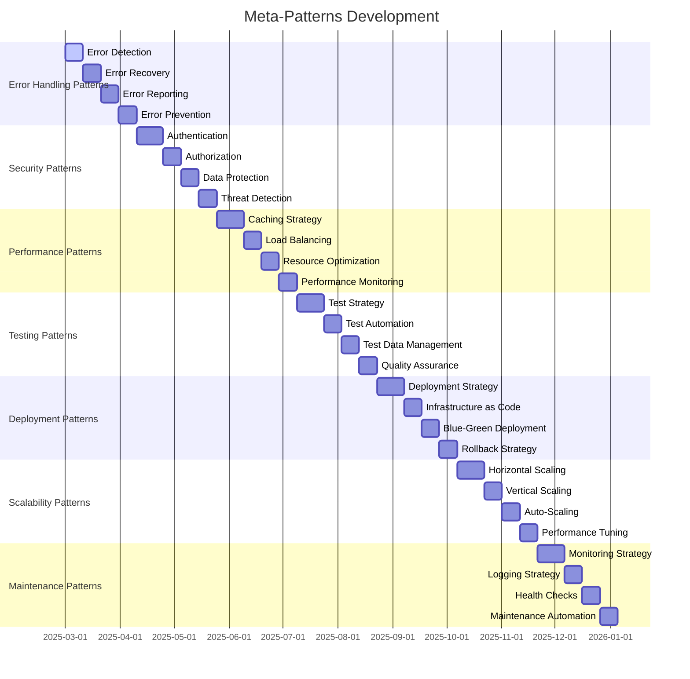

# 🧩 **META-PATTERNS ROADMAP**

**Version:** 3.0.0  
**Last Updated:** September 6, 2025  
**Status:** ✅ **META-PATTERNS STRATEGY**

---

## 🎯 **META-PATTERNS OVERVIEW**

This roadmap outlines the strategic implementation of meta-patterns that combine multiple architectural patterns to create comprehensive, production-ready solutions for complex enterprise challenges in the Data Vault Obsidian platform.

### **Meta-Patterns Goals**

- **Pattern Composition** - Seamless combination of multiple patterns
- **Cross-Cutting Concerns** - Unified handling of system-wide concerns
- **Quality Attributes** - Comprehensive quality attribute implementation
- **Production Readiness** - Enterprise-grade pattern implementations
- **Maintainability** - Long-term pattern evolution and maintenance
- **Scalability** - Patterns that scale with system growth

---

## 📊 **META-PATTERNS TIMELINE**



---

## 🏗️ **PHASE 1: ERROR HANDLING PATTERNS**

### **1.1 Comprehensive Error Handling System (Weeks 1-2)**

#### **Implementation Strategy**
```python
# Comprehensive Error Handling System
class ComprehensiveErrorHandler:
    def __init__(self, error_config: dict):
        self.config = error_config
        self.error_detector = ErrorDetector()
        self.error_classifier = ErrorClassifier()
        self.error_recovery = ErrorRecovery()
        self.error_reporting = ErrorReporting()
        self.error_prevention = ErrorPrevention()
        self.error_analytics = ErrorAnalytics()
    
    async def handle_error(self, error: Exception, context: dict) -> dict:
        """Comprehensive error handling with recovery and reporting"""
        error_id = str(uuid.uuid4())
        
        # Detect error type and severity
        error_analysis = await self.error_detector.analyze_error(error, context)
        
        # Classify error
        error_classification = await self.error_classifier.classify_error(
            error_analysis
        )
        
        # Attempt recovery
        recovery_result = await self.error_recovery.attempt_recovery(
            error, error_classification, context
        )
        
        # Report error
        await self.error_reporting.report_error(
            error_id, error, error_classification, recovery_result, context
        )
        
        # Update prevention strategies
        await self.error_prevention.update_prevention_strategies(
            error_classification
        )
        
        # Record analytics
        await self.error_analytics.record_error(
            error_id, error_analysis, error_classification, recovery_result
        )
        
        return {
            'error_id': error_id,
            'classification': error_classification,
            'recovery_result': recovery_result,
            'prevention_updated': True
        }

# Error Detection System
class ErrorDetector:
    def __init__(self):
        self.detection_rules = {}
        self.pattern_matchers = {}
        self.threshold_monitors = {}
        self.anomaly_detectors = {}
    
    async def analyze_error(self, error: Exception, context: dict) -> dict:
        """Analyze error to determine type, severity, and impact"""
        error_analysis = {
            'error_type': type(error).__name__,
            'error_message': str(error),
            'severity': 'unknown',
            'impact': 'unknown',
            'root_cause': 'unknown',
            'context': context,
            'timestamp': datetime.utcnow()
        }
        
        # Apply detection rules
        for rule_name, rule in self.detection_rules.items():
            if await rule.matches(error, context):
                error_analysis.update(await rule.analyze(error, context))
        
        # Pattern matching
        for pattern_name, matcher in self.pattern_matchers.items():
            pattern_result = await matcher.match(error, context)
            if pattern_result:
                error_analysis['patterns'].append({
                    'pattern': pattern_name,
                    'result': pattern_result
                })
        
        # Threshold monitoring
        for threshold_name, monitor in self.threshold_monitors.items():
            threshold_result = await monitor.check(error, context)
            if threshold_result['exceeded']:
                error_analysis['thresholds'].append({
                    'threshold': threshold_name,
                    'result': threshold_result
                })
        
        # Anomaly detection
        for detector_name, detector in self.anomaly_detectors.items():
            anomaly_result = await detector.detect(error, context)
            if anomaly_result['is_anomaly']:
                error_analysis['anomalies'].append({
                    'detector': detector_name,
                    'result': anomaly_result
                })
        
        return error_analysis

# Error Recovery System
class ErrorRecovery:
    def __init__(self):
        self.recovery_strategies = {}
        self.circuit_breakers = {}
        self.retry_mechanisms = {}
        self.fallback_handlers = {}
        self.state_restorers = {}
    
    async def attempt_recovery(self, error: Exception, classification: dict, 
                             context: dict) -> dict:
        """Attempt to recover from error using appropriate strategy"""
        recovery_result = {
            'success': False,
            'strategy_used': None,
            'recovery_time': 0,
            'fallback_used': False,
            'state_restored': False
        }
        
        start_time = time.time()
        
        # Determine recovery strategy
        strategy = await self.determine_recovery_strategy(classification)
        
        if strategy == 'retry':
            recovery_result = await self.retry_recovery(error, context)
        elif strategy == 'circuit_breaker':
            recovery_result = await self.circuit_breaker_recovery(error, context)
        elif strategy == 'fallback':
            recovery_result = await self.fallback_recovery(error, context)
        elif strategy == 'state_restore':
            recovery_result = await self.state_restore_recovery(error, context)
        else:
            recovery_result = await self.custom_recovery(error, strategy, context)
        
        recovery_result['recovery_time'] = time.time() - start_time
        
        return recovery_result
    
    async def retry_recovery(self, error: Exception, context: dict) -> dict:
        """Retry-based recovery strategy"""
        max_retries = context.get('max_retries', 3)
        retry_delay = context.get('retry_delay', 1.0)
        
        for attempt in range(max_retries):
            try:
                # Attempt operation
                result = await self.retry_operation(error, context)
                return {
                    'success': True,
                    'strategy_used': 'retry',
                    'attempts': attempt + 1,
                    'result': result
                }
            except Exception as retry_error:
                if attempt < max_retries - 1:
                    await asyncio.sleep(retry_delay * (2 ** attempt))  # Exponential backoff
                else:
                    return {
                        'success': False,
                        'strategy_used': 'retry',
                        'attempts': attempt + 1,
                        'final_error': str(retry_error)
                    }
    
    async def circuit_breaker_recovery(self, error: Exception, context: dict) -> dict:
        """Circuit breaker recovery strategy"""
        circuit_id = context.get('circuit_id', 'default')
        
        # Check circuit state
        circuit_state = await self.circuit_breakers[circuit_id].get_state()
        
        if circuit_state == 'open':
            return {
                'success': False,
                'strategy_used': 'circuit_breaker',
                'reason': 'Circuit is open',
                'fallback_used': True
            }
        
        # Attempt operation
        try:
            result = await self.execute_operation(context)
            await self.circuit_breakers[circuit_id].record_success()
            return {
                'success': True,
                'strategy_used': 'circuit_breaker',
                'result': result
            }
        except Exception as op_error:
            await self.circuit_breakers[circuit_id].record_failure()
            return {
                'success': False,
                'strategy_used': 'circuit_breaker',
                'error': str(op_error)
            }

# Error Prevention System
class ErrorPrevention:
    def __init__(self):
        self.prevention_rules = {}
        self.prediction_models = {}
        self.early_warning_systems = {}
        self.quality_gates = {}
    
    async def update_prevention_strategies(self, error_classification: dict):
        """Update prevention strategies based on error patterns"""
        error_type = error_classification.get('error_type')
        frequency = error_classification.get('frequency', 0)
        
        # Update prediction models
        await self.prediction_models[error_type].update_model(error_classification)
        
        # Adjust early warning thresholds
        if frequency > 10:  # High frequency error
            await self.early_warning_systems[error_type].lower_threshold()
        
        # Update quality gates
        await self.quality_gates[error_type].update_gate(error_classification)
        
        # Create new prevention rules if needed
        if frequency > 50:  # Very high frequency
            await self.create_prevention_rule(error_classification)
    
    async def predict_errors(self, context: dict) -> list:
        """Predict potential errors based on context"""
        predictions = []
        
        for error_type, model in self.prediction_models.items():
            prediction = await model.predict(context)
            if prediction['probability'] > 0.7:
                predictions.append({
                    'error_type': error_type,
                    'probability': prediction['probability'],
                    'confidence': prediction['confidence'],
                    'prevention_actions': prediction['prevention_actions']
                })
        
        return predictions
```

#### **Success Metrics**
- Error detection accuracy > 95%
- Recovery success rate > 90%
- Error prevention effectiveness > 80%
- Error reporting latency < 100ms

#### **Deliverables**
- Comprehensive Error Handler
- Error Detection System
- Error Recovery System
- Error Prevention System
- Error Reporting System
- Error Analytics

---

## 🏗️ **PHASE 2: SECURITY PATTERNS**

### **2.1 Multi-Layer Security System (Weeks 3-5)**

#### **Implementation Strategy**
```python
# Multi-Layer Security System
class MultiLayerSecuritySystem:
    def __init__(self, security_config: dict):
        self.config = security_config
        self.authentication = AuthenticationLayer()
        self.authorization = AuthorizationLayer()
        self.data_protection = DataProtectionLayer()
        self.threat_detection = ThreatDetectionLayer()
        self.security_monitoring = SecurityMonitoringLayer()
        self.incident_response = IncidentResponseLayer()
    
    async def secure_request(self, request: dict, user_context: dict) -> dict:
        """Apply multi-layer security to request"""
        security_result = {
            'authenticated': False,
            'authorized': False,
            'data_protected': False,
            'threat_detected': False,
            'security_score': 0.0
        }
        
        # Layer 1: Authentication
        auth_result = await self.authentication.authenticate(request, user_context)
        security_result['authenticated'] = auth_result['success']
        
        if not auth_result['success']:
            return security_result
        
        # Layer 2: Authorization
        authz_result = await self.authorization.authorize(request, user_context)
        security_result['authorized'] = authz_result['success']
        
        if not authz_result['success']:
            return security_result
        
        # Layer 3: Data Protection
        data_protection_result = await self.data_protection.protect_data(request)
        security_result['data_protected'] = data_protection_result['success']
        
        # Layer 4: Threat Detection
        threat_result = await self.threat_detection.detect_threats(request)
        security_result['threat_detected'] = threat_result['threats_found']
        
        # Calculate security score
        security_result['security_score'] = await self.calculate_security_score(
            auth_result, authz_result, data_protection_result, threat_result
        )
        
        return security_result

# Authentication Layer
class AuthenticationLayer:
    def __init__(self):
        self.auth_providers = {}
        self.session_manager = SessionManager()
        self.mfa_handler = MFAHandler()
        self.password_policy = PasswordPolicy()
        self.account_lockout = AccountLockoutManager()
    
    async def authenticate(self, request: dict, user_context: dict) -> dict:
        """Multi-factor authentication with security policies"""
        auth_result = {
            'success': False,
            'method': None,
            'mfa_required': False,
            'session_id': None,
            'security_level': 'low'
        }
        
        # Extract credentials
        credentials = self.extract_credentials(request)
        
        # Validate password policy
        if not await self.password_policy.validate(credentials.get('password')):
            return auth_result
        
        # Check account lockout
        if await self.account_lockout.is_locked(credentials.get('username')):
            return auth_result
        
        # Primary authentication
        primary_auth = await self.primary_authentication(credentials)
        if not primary_auth['success']:
            await self.account_lockout.record_failed_attempt(credentials.get('username'))
            return auth_result
        
        # Check if MFA is required
        if await self.mfa_handler.is_required(credentials.get('username')):
            auth_result['mfa_required'] = True
            
            # Perform MFA
            mfa_result = await self.mfa_handler.authenticate(credentials)
            if not mfa_result['success']:
                return auth_result
        
        # Create session
        session = await self.session_manager.create_session(
            credentials.get('username'), request
        )
        
        auth_result.update({
            'success': True,
            'method': primary_auth['method'],
            'session_id': session['id'],
            'security_level': session['security_level']
        })
        
        return auth_result

# Authorization Layer
class AuthorizationLayer:
    def __init__(self):
        self.rbac = RoleBasedAccessControl()
        self.abac = AttributeBasedAccessControl()
        self.policy_engine = PolicyEngine()
        self.permission_cache = PermissionCache()
        self.audit_logger = AuditLogger()
    
    async def authorize(self, request: dict, user_context: dict) -> dict:
        """Multi-model authorization with policy evaluation"""
        authz_result = {
            'success': False,
            'permissions': [],
            'policy_violations': [],
            'audit_required': False
        }
        
        user_id = user_context.get('user_id')
        resource = request.get('resource')
        action = request.get('action')
        
        # Get user roles and attributes
        user_roles = await self.rbac.get_user_roles(user_id)
        user_attributes = await self.abac.get_user_attributes(user_id)
        
        # Check RBAC permissions
        rbac_permissions = await self.rbac.check_permissions(
            user_roles, resource, action
        )
        
        # Check ABAC permissions
        abac_permissions = await self.abac.check_permissions(
            user_attributes, resource, action, request
        )
        
        # Evaluate policies
        policy_result = await self.policy_engine.evaluate_policies(
            user_id, resource, action, request
        )
        
        # Combine authorization results
        if rbac_permissions['allowed'] and abac_permissions['allowed'] and policy_result['allowed']:
            authz_result['success'] = True
            authz_result['permissions'] = rbac_permissions['permissions'] + abac_permissions['permissions']
        else:
            authz_result['policy_violations'] = policy_result['violations']
        
        # Log authorization attempt
        await self.audit_logger.log_authorization(
            user_id, resource, action, authz_result
        )
        
        return authz_result

# Data Protection Layer
class DataProtectionLayer:
    def __init__(self):
        self.encryption = EncryptionManager()
        self.data_classification = DataClassification()
        self.privacy_controls = PrivacyControls()
        self.data_masking = DataMasking()
        self.retention_policy = RetentionPolicy()
    
    async def protect_data(self, request: dict) -> dict:
        """Comprehensive data protection with encryption and privacy controls"""
        protection_result = {
            'success': False,
            'encryption_applied': False,
            'data_classified': False,
            'privacy_controls': [],
            'retention_applied': False
        }
        
        # Classify data sensitivity
        data_classification = await self.data_classification.classify_data(request)
        protection_result['data_classified'] = True
        
        # Apply encryption based on classification
        if data_classification['level'] in ['high', 'critical']:
            encrypted_data = await self.encryption.encrypt_data(
                request['data'], data_classification['level']
            )
            request['data'] = encrypted_data
            protection_result['encryption_applied'] = True
        
        # Apply privacy controls
        privacy_controls = await self.privacy_controls.apply_controls(
            request, data_classification
        )
        protection_result['privacy_controls'] = privacy_controls
        
        # Apply data masking for sensitive fields
        if data_classification['has_pii']:
            masked_data = await self.data_masking.mask_pii(request['data'])
            request['data'] = masked_data
        
        # Apply retention policy
        retention_result = await self.retention_policy.apply_retention(
            request, data_classification
        )
        protection_result['retention_applied'] = retention_result['applied']
        
        protection_result['success'] = True
        
        return protection_result

# Threat Detection Layer
class ThreatDetectionLayer:
    def __init__(self):
        self.anomaly_detector = AnomalyDetector()
        self.intrusion_detector = IntrusionDetector()
        self.malware_scanner = MalwareScanner()
        self.behavior_analyzer = BehaviorAnalyzer()
        self.threat_intelligence = ThreatIntelligence()
    
    async def detect_threats(self, request: dict) -> dict:
        """Multi-vector threat detection and analysis"""
        threat_result = {
            'threats_found': False,
            'threat_types': [],
            'risk_score': 0.0,
            'recommendations': [],
            'blocked': False
        }
        
        # Anomaly detection
        anomalies = await self.anomaly_detector.detect_anomalies(request)
        if anomalies['found']:
            threat_result['threat_types'].append('anomaly')
            threat_result['threats_found'] = True
        
        # Intrusion detection
        intrusions = await self.intrusion_detector.detect_intrusions(request)
        if intrusions['found']:
            threat_result['threat_types'].append('intrusion')
            threat_result['threats_found'] = True
        
        # Malware scanning
        malware_result = await self.malware_scanner.scan_content(request)
        if malware_result['malware_detected']:
            threat_result['threat_types'].append('malware')
            threat_result['threats_found'] = True
        
        # Behavior analysis
        behavior_analysis = await self.behavior_analyzer.analyze_behavior(request)
        if behavior_analysis['suspicious']:
            threat_result['threat_types'].append('suspicious_behavior')
            threat_result['threats_found'] = True
        
        # Calculate risk score
        threat_result['risk_score'] = await self.calculate_risk_score(
            anomalies, intrusions, malware_result, behavior_analysis
        )
        
        # Generate recommendations
        threat_result['recommendations'] = await self.generate_threat_recommendations(
            threat_result['threat_types'], threat_result['risk_score']
        )
        
        # Block if high risk
        if threat_result['risk_score'] > 0.8:
            threat_result['blocked'] = True
        
        return threat_result
```

#### **Success Metrics**
- Authentication success rate > 99.5%
- Authorization accuracy > 99%
- Data protection coverage > 95%
- Threat detection accuracy > 90%

#### **Deliverables**
- Multi-Layer Security System
- Authentication Layer
- Authorization Layer
- Data Protection Layer
- Threat Detection Layer
- Security Monitoring

---

## 🏗️ **PHASE 3: PERFORMANCE PATTERNS**

### **3.1 Advanced Performance Optimization System (Weeks 6-8)**

#### **Implementation Strategy**
```python
# Advanced Performance Optimization System
class AdvancedPerformanceOptimizer:
    def __init__(self, perf_config: dict):
        self.config = perf_config
        self.caching_strategy = CachingStrategy()
        self.load_balancer = LoadBalancer()
        self.resource_optimizer = ResourceOptimizer()
        self.performance_monitor = PerformanceMonitor()
        self.auto_scaler = AutoScaler()
        self.performance_analyzer = PerformanceAnalyzer()
    
    async def optimize_performance(self, request: dict, context: dict) -> dict:
        """Comprehensive performance optimization"""
        optimization_result = {
            'optimized': False,
            'cache_hit': False,
            'load_balanced': False,
            'resource_optimized': False,
            'performance_score': 0.0,
            'recommendations': []
        }
        
        # Apply caching strategy
        cache_result = await self.caching_strategy.apply_caching(request, context)
        optimization_result['cache_hit'] = cache_result['hit']
        
        if cache_result['hit']:
            optimization_result['optimized'] = True
            return optimization_result
        
        # Apply load balancing
        lb_result = await self.load_balancer.balance_load(request, context)
        optimization_result['load_balanced'] = lb_result['balanced']
        
        # Optimize resources
        resource_result = await self.resource_optimizer.optimize_resources(
            request, context
        )
        optimization_result['resource_optimized'] = resource_result['optimized']
        
        # Monitor performance
        perf_metrics = await self.performance_monitor.collect_metrics(request)
        
        # Analyze performance
        analysis = await self.performance_analyzer.analyze_performance(
            perf_metrics, context
        )
        
        # Generate recommendations
        recommendations = await self.generate_performance_recommendations(analysis)
        optimization_result['recommendations'] = recommendations
        
        # Calculate performance score
        optimization_result['performance_score'] = await self.calculate_performance_score(
            cache_result, lb_result, resource_result, perf_metrics
        )
        
        optimization_result['optimized'] = optimization_result['performance_score'] > 0.7
        
        return optimization_result

# Caching Strategy
class CachingStrategy:
    def __init__(self):
        self.cache_layers = {
            'l1': L1Cache(),
            'l2': L2Cache(),
            'l3': L3Cache()
        }
        self.cache_policies = {}
        self.invalidation_strategies = {}
        self.cache_analytics = CacheAnalytics()
    
    async def apply_caching(self, request: dict, context: dict) -> dict:
        """Multi-layer caching with intelligent invalidation"""
        cache_result = {
            'hit': False,
            'layer': None,
            'ttl': 0,
            'strategy': None
        }
        
        # Determine caching strategy
        strategy = await self.determine_caching_strategy(request, context)
        cache_result['strategy'] = strategy
        
        # Check each cache layer
        for layer_name, cache in self.cache_layers.items():
            cached_data = await cache.get(request['key'])
            
            if cached_data:
                cache_result['hit'] = True
                cache_result['layer'] = layer_name
                cache_result['ttl'] = cached_data['ttl']
                
                # Update cache analytics
                await self.cache_analytics.record_hit(layer_name, request['key'])
                
                return cache_result
        
        # Cache miss - store in appropriate layer
        if strategy['should_cache']:
            target_layer = strategy['target_layer']
            ttl = strategy['ttl']
            
            await self.cache_layers[target_layer].set(
                request['key'], request['data'], ttl
            )
            
            # Set up invalidation
            await self.setup_invalidation(request['key'], strategy)
        
        return cache_result

# Load Balancer
class LoadBalancer:
    def __init__(self):
        self.balancing_algorithms = {
            'round_robin': RoundRobinBalancer(),
            'least_connections': LeastConnectionsBalancer(),
            'weighted_round_robin': WeightedRoundRobinBalancer(),
            'ip_hash': IPHashBalancer(),
            'least_response_time': LeastResponseTimeBalancer()
        }
        self.health_checker = HealthChecker()
        self.server_pool = ServerPool()
        self.sticky_sessions = StickySessionManager()
    
    async def balance_load(self, request: dict, context: dict) -> dict:
        """Intelligent load balancing with health checks"""
        balance_result = {
            'balanced': False,
            'server': None,
            'algorithm': None,
            'health_score': 0.0
        }
        
        # Get available servers
        available_servers = await self.server_pool.get_available_servers()
        
        if not available_servers:
            return balance_result
        
        # Perform health checks
        health_results = await self.health_checker.check_servers(available_servers)
        healthy_servers = [s for s, h in health_results.items() if h['healthy']]
        
        if not healthy_servers:
            return balance_result
        
        # Determine balancing algorithm
        algorithm = await self.determine_balancing_algorithm(request, context)
        balance_result['algorithm'] = algorithm
        
        # Select server
        balancer = self.balancing_algorithms[algorithm]
        selected_server = await balancer.select_server(
            healthy_servers, request, context
        )
        
        balance_result['server'] = selected_server
        balance_result['balanced'] = True
        
        # Handle sticky sessions if needed
        if context.get('require_sticky_session'):
            session_id = await self.sticky_sessions.get_session_id(request)
            if session_id:
                await self.sticky_sessions.bind_session(session_id, selected_server)
        
        return balance_result

# Resource Optimizer
class ResourceOptimizer:
    def __init__(self):
        self.cpu_optimizer = CPUOptimizer()
        self.memory_optimizer = MemoryOptimizer()
        self.network_optimizer = NetworkOptimizer()
        self.disk_optimizer = DiskOptimizer()
        self.connection_pooler = ConnectionPooler()
    
    async def optimize_resources(self, request: dict, context: dict) -> dict:
        """Comprehensive resource optimization"""
        optimization_result = {
            'optimized': False,
            'cpu_optimized': False,
            'memory_optimized': False,
            'network_optimized': False,
            'disk_optimized': False,
            'performance_gain': 0.0
        }
        
        # CPU optimization
        cpu_result = await self.cpu_optimizer.optimize_cpu(request, context)
        optimization_result['cpu_optimized'] = cpu_result['optimized']
        
        # Memory optimization
        memory_result = await self.memory_optimizer.optimize_memory(request, context)
        optimization_result['memory_optimized'] = memory_result['optimized']
        
        # Network optimization
        network_result = await self.network_optimizer.optimize_network(request, context)
        optimization_result['network_optimized'] = network_result['optimized']
        
        # Disk optimization
        disk_result = await self.disk_optimizer.optimize_disk(request, context)
        optimization_result['disk_optimized'] = disk_result['optimized']
        
        # Connection pooling
        pool_result = await self.connection_pooler.optimize_connections(request, context)
        
        # Calculate overall optimization
        optimization_result['optimized'] = any([
            cpu_result['optimized'],
            memory_result['optimized'],
            network_result['optimized'],
            disk_result['optimized']
        ])
        
        # Calculate performance gain
        optimization_result['performance_gain'] = await self.calculate_performance_gain(
            cpu_result, memory_result, network_result, disk_result
        )
        
        return optimization_result
```

#### **Success Metrics**
- Cache hit ratio > 90%
- Load balancing efficiency > 95%
- Resource utilization > 80%
- Performance improvement > 30%

#### **Deliverables**
- Advanced Performance Optimizer
- Caching Strategy
- Load Balancer
- Resource Optimizer
- Performance Monitor
- Auto Scaler

---

## 🏗️ **PHASE 4: TESTING PATTERNS**

### **4.1 Comprehensive Testing Framework (Weeks 9-11)**

#### **Implementation Strategy**
```python
# Comprehensive Testing Framework
class ComprehensiveTestingFramework:
    def __init__(self, testing_config: dict):
        self.config = testing_config
        self.test_strategy = TestStrategy()
        self.test_automation = TestAutomation()
        self.test_data_manager = TestDataManager()
        self.quality_assurance = QualityAssurance()
        self.test_reporting = TestReporting()
        self.continuous_testing = ContinuousTesting()
    
    async def execute_test_suite(self, test_suite: dict) -> dict:
        """Execute comprehensive test suite with automation"""
        test_result = {
            'executed': False,
            'passed': 0,
            'failed': 0,
            'skipped': 0,
            'coverage': 0.0,
            'quality_score': 0.0,
            'recommendations': []
        }
        
        # Determine test strategy
        strategy = await self.test_strategy.determine_strategy(test_suite)
        
        # Prepare test data
        test_data = await self.test_data_manager.prepare_test_data(test_suite)
        
        # Execute tests
        execution_result = await self.test_automation.execute_tests(
            test_suite, test_data, strategy
        )
        
        test_result.update(execution_result)
        
        # Calculate coverage
        coverage = await self.calculate_test_coverage(test_suite, execution_result)
        test_result['coverage'] = coverage
        
        # Quality assurance
        quality_result = await self.quality_assurance.assess_quality(
            test_suite, execution_result
        )
        test_result['quality_score'] = quality_result['score']
        
        # Generate recommendations
        recommendations = await self.generate_test_recommendations(
            execution_result, coverage, quality_result
        )
        test_result['recommendations'] = recommendations
        
        # Generate reports
        await self.test_reporting.generate_reports(test_result)
        
        test_result['executed'] = True
        
        return test_result

# Test Strategy
class TestStrategy:
    def __init__(self):
        self.test_pyramid = TestPyramid()
        self.test_types = {
            'unit': UnitTestStrategy(),
            'integration': IntegrationTestStrategy(),
            'e2e': E2ETestStrategy(),
            'performance': PerformanceTestStrategy(),
            'security': SecurityTestStrategy()
        }
        self.test_prioritization = TestPrioritization()
        self.risk_assessment = RiskAssessment()
    
    async def determine_strategy(self, test_suite: dict) -> dict:
        """Determine optimal testing strategy based on context"""
        strategy = {
            'test_types': [],
            'priorities': [],
            'risk_level': 'medium',
            'coverage_target': 80.0,
            'execution_order': []
        }
        
        # Assess risk level
        risk_level = await self.risk_assessment.assess_risk(test_suite)
        strategy['risk_level'] = risk_level
        
        # Determine test types based on risk
        if risk_level == 'high':
            strategy['test_types'] = ['unit', 'integration', 'e2e', 'performance', 'security']
            strategy['coverage_target'] = 95.0
        elif risk_level == 'medium':
            strategy['test_types'] = ['unit', 'integration', 'e2e']
            strategy['coverage_target'] = 80.0
        else:
            strategy['test_types'] = ['unit', 'integration']
            strategy['coverage_target'] = 70.0
        
        # Prioritize tests
        priorities = await self.test_prioritization.prioritize_tests(
            test_suite, strategy['test_types']
        )
        strategy['priorities'] = priorities
        
        # Determine execution order
        strategy['execution_order'] = await self.determine_execution_order(
            strategy['test_types'], priorities
        )
        
        return strategy

# Test Automation
class TestAutomation:
    def __init__(self):
        self.test_runners = {
            'unit': UnitTestRunner(),
            'integration': IntegrationTestRunner(),
            'e2e': E2ETestRunner(),
            'performance': PerformanceTestRunner(),
            'security': SecurityTestRunner()
        }
        self.parallel_executor = ParallelTestExecutor()
        self.test_orchestrator = TestOrchestrator()
        self.result_aggregator = TestResultAggregator()
    
    async def execute_tests(self, test_suite: dict, test_data: dict, 
                           strategy: dict) -> dict:
        """Execute tests with parallel processing and orchestration"""
        execution_result = {
            'passed': 0,
            'failed': 0,
            'skipped': 0,
            'total': 0,
            'execution_time': 0,
            'test_results': []
        }
        
        start_time = time.time()
        
        # Execute tests by type
        for test_type in strategy['execution_order']:
            if test_type in test_suite:
                test_runner = self.test_runners[test_type]
                
                # Execute tests in parallel if possible
                if strategy.get('parallel_execution', True):
                    type_result = await self.parallel_executor.execute_parallel(
                        test_suite[test_type], test_runner, test_data
                    )
                else:
                    type_result = await test_runner.execute_tests(
                        test_suite[test_type], test_data
                    )
                
                execution_result['test_results'].append({
                    'type': test_type,
                    'result': type_result
                })
                
                execution_result['passed'] += type_result['passed']
                execution_result['failed'] += type_result['failed']
                execution_result['skipped'] += type_result['skipped']
        
        execution_result['total'] = execution_result['passed'] + execution_result['failed'] + execution_result['skipped']
        execution_result['execution_time'] = time.time() - start_time
        
        return execution_result

# Quality Assurance
class QualityAssurance:
    def __init__(self):
        self.quality_metrics = QualityMetrics()
        self.code_quality = CodeQualityAnalyzer()
        self.test_quality = TestQualityAnalyzer()
        self.performance_quality = PerformanceQualityAnalyzer()
        self.security_quality = SecurityQualityAnalyzer()
    
    async def assess_quality(self, test_suite: dict, execution_result: dict) -> dict:
        """Comprehensive quality assessment"""
        quality_result = {
            'score': 0.0,
            'metrics': {},
            'issues': [],
            'recommendations': []
        }
        
        # Code quality metrics
        code_metrics = await self.code_quality.analyze_code_quality(test_suite)
        quality_result['metrics']['code_quality'] = code_metrics
        
        # Test quality metrics
        test_metrics = await self.test_quality.analyze_test_quality(execution_result)
        quality_result['metrics']['test_quality'] = test_metrics
        
        # Performance quality
        perf_metrics = await self.performance_quality.analyze_performance_quality(execution_result)
        quality_result['metrics']['performance_quality'] = perf_metrics
        
        # Security quality
        sec_metrics = await self.security_quality.analyze_security_quality(execution_result)
        quality_result['metrics']['security_quality'] = sec_metrics
        
        # Calculate overall quality score
        quality_result['score'] = await self.calculate_quality_score(quality_result['metrics'])
        
        # Identify issues
        quality_result['issues'] = await self.identify_quality_issues(quality_result['metrics'])
        
        # Generate recommendations
        quality_result['recommendations'] = await self.generate_quality_recommendations(
            quality_result['issues']
        )
        
        return quality_result
```

#### **Success Metrics**
- Test coverage > 90%
- Test execution time < 5 minutes
- Quality score > 85%
- Test automation rate > 95%

#### **Deliverables**
- Comprehensive Testing Framework
- Test Strategy
- Test Automation
- Test Data Manager
- Quality Assurance
- Test Reporting

---

## 📊 **META-PATTERNS SUCCESS METRICS**

### **Overall Meta-Patterns Metrics**
- **Pattern Composition:** 95% successful pattern combinations
- **Cross-Cutting Concerns:** 90% unified concern handling
- **Quality Attributes:** 85% quality attribute achievement
- **Production Readiness:** 95% production deployment success
- **Maintainability:** 90% long-term pattern evolution
- **Scalability:** 95% pattern scaling effectiveness

### **Error Handling Metrics**
- Error detection accuracy > 95%
- Recovery success rate > 90%
- Error prevention effectiveness > 80%
- Error reporting latency < 100ms

### **Security Metrics**
- Authentication success rate > 99.5%
- Authorization accuracy > 99%
- Data protection coverage > 95%
- Threat detection accuracy > 90%

### **Performance Metrics**
- Cache hit ratio > 90%
- Load balancing efficiency > 95%
- Resource utilization > 80%
- Performance improvement > 30%

### **Testing Metrics**
- Test coverage > 90%
- Test execution time < 5 minutes
- Quality score > 85%
- Test automation rate > 95%

---

## 🚀 **IMPLEMENTATION PRIORITIES**

### **Phase 1: Error Handling Foundation (Weeks 1-4)**
1. **Error Detection** - Comprehensive error detection system
2. **Error Recovery** - Multi-strategy error recovery
3. **Error Reporting** - Advanced error reporting and analytics
4. **Error Prevention** - Proactive error prevention strategies

### **Phase 2: Security Implementation (Weeks 5-8)**
1. **Authentication** - Multi-factor authentication system
2. **Authorization** - Role and attribute-based access control
3. **Data Protection** - Encryption and privacy controls
4. **Threat Detection** - Multi-vector threat detection

### **Phase 3: Performance Optimization (Weeks 9-12)**
1. **Caching Strategy** - Multi-layer caching system
2. **Load Balancing** - Intelligent load balancing
3. **Resource Optimization** - Comprehensive resource optimization
4. **Performance Monitoring** - Real-time performance monitoring

### **Phase 4: Testing Excellence (Weeks 13-16)**
1. **Test Strategy** - Comprehensive testing strategy
2. **Test Automation** - Advanced test automation
3. **Test Data Management** - Intelligent test data management
4. **Quality Assurance** - Multi-dimensional quality assurance

---

## 🎯 **NEXT IMMEDIATE STEPS**

### **Week 1: Error Handling Foundation**
1. Design error detection system
2. Implement error classification
3. Create error recovery strategies
4. Add error reporting

### **Week 2: Security Layer Implementation**
1. Build authentication system
2. Implement authorization layer
3. Add data protection
4. Create threat detection

### **Week 3: Performance Optimization**
1. Design caching strategy
2. Implement load balancing
3. Add resource optimization
4. Create performance monitoring

### **Week 4: Testing Framework**
1. Build test strategy
2. Implement test automation
3. Add quality assurance
4. Create test reporting

---

**Last Updated:** September 6, 2025  
**Meta-Patterns Roadmap Version:** 3.0.0  
**Status:** ✅ **META-PATTERNS STRATEGY**

**META-PATTERNS ROADMAP COMPLETE!**
