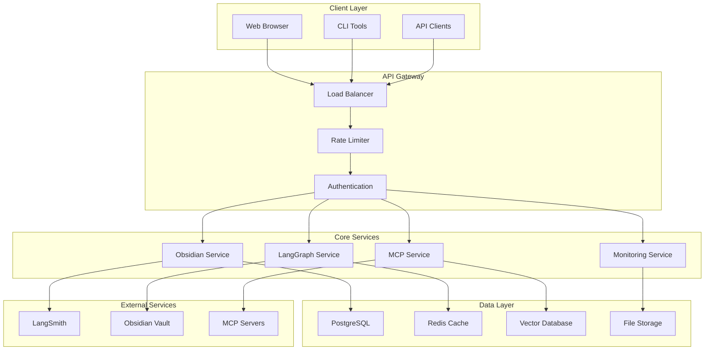

# 🏗️ **ARCHITECTURE DOCUMENTATION**

**Version:** 3.0.0  
**Last Updated:** September 6, 2025  
**Status:** ✅ **PRODUCTION-READY ARCHITECTURE DOCUMENTATION**

---

## 📚 **DOCUMENTATION OVERVIEW**

This directory contains comprehensive technical documentation for the Data Vault Obsidian system, covering all aspects of software architecture, design patterns, code structure, and implementation techniques.

---

## 📖 **DOCUMENTATION STRUCTURE**

### **Core Architecture Documents**

| Document | Description | Key Topics |
|----------|-------------|------------|
| [**ARCHITECTURE_OVERVIEW.md**](ARCHITECTURE_OVERVIEW.md) | High-level system architecture and principles | Clean Architecture, Microservices, DDD, Technology Stack |
| [**DESIGN_PATTERNS.md**](DESIGN_PATTERNS.md) | Comprehensive design patterns and code patterns | Architectural Patterns, Design Patterns, Code Structure Patterns |
| [**CODE_STRUCTURE_DEEP_DIVE.md**](CODE_STRUCTURE_DEEP_DIVE.md) | Detailed code organization and conventions | Directory Structure, Naming Conventions, Testing Patterns |

### **Integration & Technology Documents**

| Document | Description | Key Topics |
|----------|-------------|------------|
| [**MCP_INTEGRATION_PATTERNS.md**](MCP_INTEGRATION_PATTERNS.md) | Model Context Protocol integration patterns | Hub-and-Spoke Pattern, Tool Registry, Service Discovery |
| [**LANGGRAPH_WORKFLOW_ARCHITECTURE.md**](LANGGRAPH_WORKFLOW_ARCHITECTURE.md) | LangGraph workflow orchestration patterns | Stateful Workflows, Multi-Agent Coordination, Human-in-the-Loop |
| [**OBSERVABILITY_MONITORING_PATTERNS.md**](OBSERVABILITY_MONITORING_PATTERNS.md) | Observability and monitoring implementation | Multi-Layer Monitoring, Distributed Tracing, Alerting Patterns |

---

## 🎯 **QUICK START GUIDE**

### **For Developers**
1. Start with [**ARCHITECTURE_OVERVIEW.md**](ARCHITECTURE_OVERVIEW.md) to understand the system architecture
2. Read [**DESIGN_PATTERNS.md**](DESIGN_PATTERNS.md) to learn about implementation patterns
3. Study [**CODE_STRUCTURE_DEEP_DIVE.md**](CODE_STRUCTURE_DEEP_DIVE.md) for code organization guidelines

### **For System Architects**
1. Review [**ARCHITECTURE_OVERVIEW.md**](ARCHITECTURE_OVERVIEW.md) for architectural principles
2. Examine [**MCP_INTEGRATION_PATTERNS.md**](MCP_INTEGRATION_PATTERNS.md) for integration patterns
3. Analyze [**LANGGRAPH_WORKFLOW_ARCHITECTURE.md**](LANGGRAPH_WORKFLOW_ARCHITECTURE.md) for workflow design

### **For DevOps Engineers**
1. Check [**OBSERVABILITY_MONITORING_PATTERNS.md**](OBSERVABILITY_MONITORING_PATTERNS.md) for monitoring setup
2. Review [**ARCHITECTURE_OVERVIEW.md**](ARCHITECTURE_OVERVIEW.md) for deployment architecture
3. Study [**CODE_STRUCTURE_DEEP_DIVE.md**](CODE_STRUCTURE_DEEP_DIVE.md) for configuration patterns

---

## 🏗️ **ARCHITECTURE PRINCIPLES**

### **Core Principles**
- **Clean Architecture** - Layered structure with clear boundaries
- **Domain-Driven Design (DDD)** - Business logic at the center
- **Microservices Architecture** - Independent, scalable services
- **SOLID Principles** - Object-oriented design principles
- **Dependency Inversion** - High-level modules independent of low-level modules

### **Design Patterns**
- **Repository Pattern** - Data access abstraction
- **Service Layer Pattern** - Business logic encapsulation
- **Factory Pattern** - Object creation abstraction
- **Observer Pattern** - Event-driven communication
- **Strategy Pattern** - Algorithm selection at runtime

### **Integration Patterns**
- **API Gateway Pattern** - Central entry point
- **Hub-and-Spoke Pattern** - MCP server coordination
- **Event-Driven Architecture** - Asynchronous communication
- **CQRS Pattern** - Command Query Responsibility Segregation

---

## 🔧 **TECHNOLOGY STACK**

### **Backend Technologies**
- **Python 3.11+** - Primary programming language
- **FastAPI** - Web framework for APIs
- **SQLAlchemy** - ORM for database operations
- **Pydantic** - Data validation and serialization
- **LangGraph** - AI workflow orchestration
- **LangChain** - AI application framework

### **Data Technologies**
- **PostgreSQL** - Primary database
- **Redis** - Caching and session storage
- **Vector Database** - Semantic search and embeddings
- **File System** - Document and media storage

### **Infrastructure Technologies**
- **Docker** - Containerization
- **Docker Compose** - Local development orchestration
- **Kubernetes** - Production orchestration (planned)
- **Terraform** - Infrastructure as Code (planned)

### **Monitoring & Observability**
- **LangSmith** - AI observability platform
- **Prometheus** - Metrics collection
- **Grafana** - Visualization and dashboards
- **Custom Dashboards** - Real-time monitoring

---

## 📊 **SYSTEM ARCHITECTURE DIAGRAM**

---

## 🚀 **IMPLEMENTATION GUIDELINES**

### **Code Organization**
- Follow Clean Architecture principles
- Use Domain-Driven Design patterns
- Implement proper separation of concerns
- Apply SOLID principles consistently

### **Testing Strategy**
- Unit tests for all business logic
- Integration tests for service interactions
- End-to-end tests for complete workflows
- Performance tests for scalability validation

### **Documentation Standards**
- Comprehensive API documentation
- Architecture decision records (ADRs)
- Code comments for complex logic
- README files for each module

### **Monitoring & Observability**
- Implement distributed tracing
- Collect comprehensive metrics
- Set up alerting for critical issues
- Maintain real-time dashboards

---

## 📈 **SCALABILITY CONSIDERATIONS**

### **Horizontal Scaling**
- Stateless service design
- Load balancing implementation
- Database sharding strategies
- Caching layer optimization

### **Vertical Scaling**
- Resource monitoring and optimization
- Auto-scaling configuration
- Performance profiling and tuning
- Memory and CPU optimization

### **Data Scaling**
- Database partitioning strategies
- Index optimization
- Query performance tuning
- Data archiving policies

---

## 🔒 **SECURITY ARCHITECTURE**

### **Authentication & Authorization**
- JWT token-based authentication
- Role-based access control (RBAC)
- API key management
- OAuth 2.0 integration

### **Data Security**
- Encryption at rest and in transit
- Secrets management
- Input validation and sanitization
- Audit logging

### **Network Security**
- API Gateway security enforcement
- Rate limiting and DDoS protection
- CORS configuration
- Firewall rules

---

## 📚 **ADDITIONAL RESOURCES**

### **External Documentation**
- [Clean Architecture by Robert C. Martin](https://blog.cleancoder.com/uncle-bob/2012/08/13/the-clean-architecture.html)
- [Domain-Driven Design by Eric Evans](https://domainlanguage.com/ddd/)
- [Microservices Patterns by Chris Richardson](https://microservices.io/)
- [LangGraph Documentation](https://langchain-ai.github.io/langgraph/)
- [Model Context Protocol Documentation](https://modelcontextprotocol.io/)

### **Internal Resources**
- [Main README](../../README.md) - Project overview and quick start
- [API Documentation](../api/) - API specifications and examples
- [Deployment Guides](../deployment/) - Deployment and infrastructure guides
- [Development Guides](../development/) - Development setup and workflows

---

## 🤝 **CONTRIBUTING TO ARCHITECTURE**

### **Documentation Updates**
1. Follow the established documentation structure
2. Use consistent formatting and style
3. Include code examples and diagrams
4. Update the index when adding new documents

### **Architecture Changes**
1. Create Architecture Decision Records (ADRs)
2. Update relevant documentation
3. Communicate changes to the team
4. Validate changes through testing

### **Code Standards**
1. Follow established patterns and conventions
2. Maintain clean architecture principles
3. Write comprehensive tests
4. Document complex implementations

---

**Last Updated:** September 6, 2025  
**Architecture Documentation Version:** 3.0.0  
**Status:** ✅ **PRODUCTION-READY**

**CENTRALIZED REPORTS & CHANGELOG SYSTEM COMPLETE!**
