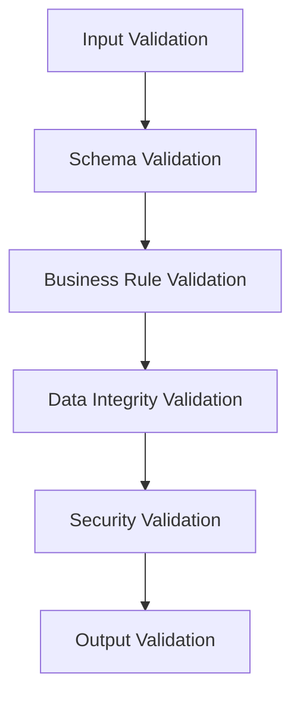

# ✅ **VALIDATION PATTERNS**

**Version:** 3.0.0  
**Last Updated:** September 6, 2025  
**Status:** ✅ **VALIDATION STRATEGY**

---

## 🎯 **VALIDATION OVERVIEW**

This document outlines comprehensive validation patterns for the Data Vault Obsidian system, focusing on data validation, input sanitization, schema validation, and business rule validation.

### **Validation Goals**

- **Data Integrity** - Ensure data consistency and accuracy
- **Security** - Prevent injection attacks and malicious input
- **Performance** - Efficient validation with minimal overhead
- **User Experience** - Clear validation messages and error handling
- **Type Safety** - Strong typing and compile-time validation
- **Business Rules** - Enforce business logic and constraints

---

## 🏗️ **VALIDATION ARCHITECTURE**

### **Validation Layers**


### **Validation Types**
1. **Input Validation** - Validate incoming data
2. **Schema Validation** - Validate data structure
3. **Business Rule Validation** - Validate business logic
4. **Data Integrity Validation** - Validate data consistency
5. **Security Validation** - Validate security constraints
6. **Output Validation** - Validate outgoing data

---

## 🔧 **CORE VALIDATION PATTERNS**

### **1. Input Validation System**

#### **Implementation Strategy**
```python
# Input Validation System
class InputValidationSystem:
    def __init__(self):
        self.validators = {
            'string': StringValidator(),
            'number': NumberValidator(),
            'email': EmailValidator(),
            'url': URLValidator(),
            'date': DateValidator(),
            'json': JSONValidator(),
            'custom': CustomValidator()
        }
        self.sanitizers = {
            'html': HTMLSanitizer(),
            'sql': SQLSanitizer(),
            'xss': XSSSanitizer(),
            'path': PathSanitizer()
        }
        self.error_handler = ValidationErrorHandler()
    
    async def validate_input(self, data: dict, schema: dict) -> ValidationResult:
        """Validate input data against schema"""
        validation_result = ValidationResult()
        
        try:
            # Validate each field
            for field_name, field_schema in schema.items():
                field_value = data.get(field_name)
                field_result = await self.validate_field(
                    field_name, field_value, field_schema
                )
                validation_result.add_field_result(field_name, field_result)
            
            # Check if validation passed
            validation_result.is_valid = all(
                result.is_valid for result in validation_result.field_results.values()
            )
            
        except Exception as e:
            validation_result.add_error(f"Validation error: {e}")
            validation_result.is_valid = False
        
        return validation_result
    
    async def validate_field(self, field_name: str, field_value: Any, 
                           field_schema: dict) -> FieldValidationResult:
        """Validate individual field"""
        field_result = FieldValidationResult(field_name)
        
        # Check required field
        if field_schema.get('required', False) and field_value is None:
            field_result.add_error(f"{field_name} is required")
            return field_result
        
        # Skip validation if field is optional and empty
        if not field_schema.get('required', False) and field_value is None:
            field_result.is_valid = True
            return field_result
        
        # Validate field type
        type_validator = self.validators.get(field_schema.get('type', 'string'))
        if type_validator:
            type_result = await type_validator.validate(field_value, field_schema)
            if not type_result.is_valid:
                field_result.add_errors(type_result.errors)
                return field_result
        
        # Sanitize field value
        if field_schema.get('sanitize', False):
            sanitizer = self.sanitizers.get(field_schema.get('sanitizer', 'html'))
            if sanitizer:
                field_value = await sanitizer.sanitize(field_value)
        
        # Validate field constraints
        constraint_result = await self.validate_constraints(
            field_name, field_value, field_schema
        )
        if not constraint_result.is_valid:
            field_result.add_errors(constraint_result.errors)
            return field_result
        
        field_result.is_valid = True
        field_result.value = field_value
        
        return field_result

# Field Validators
class StringValidator:
    async def validate(self, value: Any, schema: dict) -> ValidationResult:
        """Validate string field"""
        result = ValidationResult()
        
        if not isinstance(value, str):
            result.add_error("Value must be a string")
            return result
        
        # Check minimum length
        min_length = schema.get('min_length')
        if min_length and len(value) < min_length:
            result.add_error(f"String must be at least {min_length} characters")
        
        # Check maximum length
        max_length = schema.get('max_length')
        if max_length and len(value) > max_length:
            result.add_error(f"String must be no more than {max_length} characters")
        
        # Check pattern
        pattern = schema.get('pattern')
        if pattern and not re.match(pattern, value):
            result.add_error(f"String does not match required pattern: {pattern}")
        
        # Check enum values
        enum_values = schema.get('enum')
        if enum_values and value not in enum_values:
            result.add_error(f"Value must be one of: {', '.join(enum_values)}")
        
        result.is_valid = len(result.errors) == 0
        return result

class NumberValidator:
    async def validate(self, value: Any, schema: dict) -> ValidationResult:
        """Validate number field"""
        result = ValidationResult()
        
        # Convert to number if possible
        try:
            if schema.get('type') == 'integer':
                value = int(value)
            else:
                value = float(value)
        except (ValueError, TypeError):
            result.add_error("Value must be a number")
            return result
        
        # Check minimum value
        min_value = schema.get('min')
        if min_value is not None and value < min_value:
            result.add_error(f"Value must be at least {min_value}")
        
        # Check maximum value
        max_value = schema.get('max')
        if max_value is not None and value > max_value:
            result.add_error(f"Value must be no more than {max_value}")
        
        result.is_valid = len(result.errors) == 0
        return result

class EmailValidator:
    async def validate(self, value: Any, schema: dict) -> ValidationResult:
        """Validate email field"""
        result = ValidationResult()
        
        if not isinstance(value, str):
            result.add_error("Value must be a string")
            return result
        
        # Basic email pattern
        email_pattern = r'^[a-zA-Z0-9._%+-]+@[a-zA-Z0-9.-]+\.[a-zA-Z]{2,}$'
        if not re.match(email_pattern, value):
            result.add_error("Invalid email format")
            return result
        
        # Check domain validation if specified
        allowed_domains = schema.get('allowed_domains')
        if allowed_domains:
            domain = value.split('@')[1]
            if domain not in allowed_domains:
                result.add_error(f"Email domain must be one of: {', '.join(allowed_domains)}")
        
        result.is_valid = len(result.errors) == 0
        return result
```

#### **Success Metrics**
- Validation time < 10ms per field
- Validation accuracy > 99%
- Error message clarity > 95%
- Input sanitization success > 99%

#### **Deliverables**
- Input Validation System
- Field Validators
- Input Sanitizers
- Error Handling
- Validation Results

### **2. Schema Validation System**

#### **Implementation Strategy**
```python
# Schema Validation System
class SchemaValidationSystem:
    def __init__(self):
        self.schema_registry = SchemaRegistry()
        self.schema_validator = SchemaValidator()
        self.schema_compiler = SchemaCompiler()
        self.schema_cache = SchemaCache()
    
    async def validate_against_schema(self, data: dict, schema_id: str) -> ValidationResult:
        """Validate data against registered schema"""
        # Get schema from registry
        schema = await self.schema_registry.get_schema(schema_id)
        
        if not schema:
            raise SchemaNotFoundError(f"Schema {schema_id} not found")
        
        # Compile schema if needed
        compiled_schema = await self.schema_compiler.compile(schema)
        
        # Validate data
        validation_result = await self.schema_validator.validate(data, compiled_schema)
        
        return validation_result
    
    async def register_schema(self, schema_id: str, schema: dict) -> bool:
        """Register new schema"""
        # Validate schema structure
        schema_validation = await self.validate_schema_structure(schema)
        if not schema_validation.is_valid:
            raise InvalidSchemaError(f"Invalid schema structure: {schema_validation.errors}")
        
        # Register schema
        success = await self.schema_registry.register(schema_id, schema)
        
        if success:
            # Invalidate cache
            await self.schema_cache.invalidate(schema_id)
        
        return success

# Schema Registry
class SchemaRegistry:
    def __init__(self):
        self.schemas = {}
        self.schema_versions = {}
        self.schema_metadata = {}
    
    async def register(self, schema_id: str, schema: dict, version: str = "1.0") -> bool:
        """Register schema with version"""
        try:
            # Store schema
            self.schemas[schema_id] = schema
            
            # Store version
            if schema_id not in self.schema_versions:
                self.schema_versions[schema_id] = []
            self.schema_versions[schema_id].append(version)
            
            # Store metadata
            self.schema_metadata[schema_id] = {
                'created_at': datetime.utcnow(),
                'version': version,
                'fields': list(schema.keys()),
                'required_fields': [k for k, v in schema.items() if v.get('required', False)]
            }
            
            return True
            
        except Exception as e:
            logger.error(f"Failed to register schema {schema_id}: {e}")
            return False
    
    async def get_schema(self, schema_id: str, version: str = None) -> dict:
        """Get schema by ID and version"""
        if schema_id not in self.schemas:
            return None
        
        schema = self.schemas[schema_id]
        
        if version:
            # Return specific version if available
            if version in self.schema_versions.get(schema_id, []):
                return schema
            else:
                return None
        
        return schema

# Schema Validator
class SchemaValidator:
    def __init__(self):
        self.validators = {
            'object': ObjectValidator(),
            'array': ArrayValidator(),
            'string': StringValidator(),
            'number': NumberValidator(),
            'boolean': BooleanValidator(),
            'null': NullValidator()
        }
    
    async def validate(self, data: Any, schema: dict) -> ValidationResult:
        """Validate data against JSON schema"""
        result = ValidationResult()
        
        # Check schema type
        schema_type = schema.get('type')
        if not schema_type:
            result.add_error("Schema must have a type")
            return result
        
        # Get appropriate validator
        validator = self.validators.get(schema_type)
        if not validator:
            result.add_error(f"Unsupported schema type: {schema_type}")
            return result
        
        # Validate data
        validation_result = await validator.validate(data, schema)
        result.merge(validation_result)
        
        return result
```

#### **Success Metrics**
- Schema validation time < 20ms
- Schema registration success > 99%
- Schema cache hit rate > 90%
- Schema validation accuracy > 99%

#### **Deliverables**
- Schema Validation System
- Schema Registry
- Schema Validator
- Schema Compiler
- Schema Cache

### **3. Business Rule Validation**

#### **Implementation Strategy**
```python
# Business Rule Validation System
class BusinessRuleValidationSystem:
    def __init__(self):
        self.rule_engine = RuleEngine()
        self.rule_registry = RuleRegistry()
        self.rule_executor = RuleExecutor()
        self.rule_cache = RuleCache()
    
    async def validate_business_rules(self, data: dict, context: dict) -> ValidationResult:
        """Validate data against business rules"""
        validation_result = ValidationResult()
        
        # Get applicable rules
        applicable_rules = await self.get_applicable_rules(data, context)
        
        # Execute rules
        for rule in applicable_rules:
            rule_result = await self.execute_rule(rule, data, context)
            if not rule_result.is_valid:
                validation_result.add_errors(rule_result.errors)
        
        validation_result.is_valid = len(validation_result.errors) == 0
        return validation_result
    
    async def get_applicable_rules(self, data: dict, context: dict) -> list:
        """Get rules applicable to the data and context"""
        applicable_rules = []
        
        # Get rules by data type
        data_type = data.get('type')
        if data_type:
            type_rules = await self.rule_registry.get_rules_by_type(data_type)
            applicable_rules.extend(type_rules)
        
        # Get rules by context
        context_rules = await self.rule_registry.get_rules_by_context(context)
        applicable_rules.extend(context_rules)
        
        # Get global rules
        global_rules = await self.rule_registry.get_global_rules()
        applicable_rules.extend(global_rules)
        
        return applicable_rules

# Rule Engine
class RuleEngine:
    def __init__(self):
        self.rule_types = {
            'condition': ConditionRule(),
            'calculation': CalculationRule(),
            'constraint': ConstraintRule(),
            'custom': CustomRule()
        }
        self.rule_compiler = RuleCompiler()
    
    async def execute_rule(self, rule: dict, data: dict, context: dict) -> ValidationResult:
        """Execute a single rule"""
        result = ValidationResult()
        
        try:
            # Get rule type
            rule_type = rule.get('type', 'condition')
            rule_executor = self.rule_types.get(rule_type)
            
            if not rule_executor:
                result.add_error(f"Unknown rule type: {rule_type}")
                return result
            
            # Execute rule
            rule_result = await rule_executor.execute(rule, data, context)
            result.merge(rule_result)
            
        except Exception as e:
            result.add_error(f"Rule execution error: {e}")
        
        return result

# Business Rules
class ConditionRule:
    async def execute(self, rule: dict, data: dict, context: dict) -> ValidationResult:
        """Execute condition-based rule"""
        result = ValidationResult()
        
        condition = rule.get('condition')
        if not condition:
            result.add_error("Rule must have a condition")
            return result
        
        # Evaluate condition
        condition_result = await self.evaluate_condition(condition, data, context)
        
        if not condition_result:
            error_message = rule.get('error_message', 'Business rule validation failed')
            result.add_error(error_message)
        
        result.is_valid = condition_result
        return result
    
    async def evaluate_condition(self, condition: dict, data: dict, context: dict) -> bool:
        """Evaluate condition against data and context"""
        # Simple condition evaluation
        field = condition.get('field')
        operator = condition.get('operator')
        value = condition.get('value')
        
        if not field or not operator:
            return False
        
        # Get field value
        field_value = self.get_field_value(field, data, context)
        
        # Apply operator
        if operator == 'equals':
            return field_value == value
        elif operator == 'not_equals':
            return field_value != value
        elif operator == 'greater_than':
            return field_value > value
        elif operator == 'less_than':
            return field_value < value
        elif operator == 'contains':
            return value in field_value
        elif operator == 'not_contains':
            return value not in field_value
        else:
            return False
```

#### **Success Metrics**
- Rule execution time < 50ms
- Rule accuracy > 99%
- Rule coverage > 95%
- Rule performance > 90%

#### **Deliverables**
- Business Rule Validation System
- Rule Engine
- Rule Registry
- Rule Executor
- Rule Cache

---

## 🔒 **SECURITY VALIDATION PATTERNS**

### **1. Input Sanitization**

#### **Implementation Strategy**
```python
# Input Sanitization System
class InputSanitizationSystem:
    def __init__(self):
        self.sanitizers = {
            'html': HTMLSanitizer(),
            'sql': SQLSanitizer(),
            'xss': XSSSanitizer(),
            'path': PathSanitizer(),
            'json': JSONSanitizer()
        }
        self.validator = SecurityValidator()
    
    async def sanitize_input(self, data: dict, sanitization_rules: dict) -> dict:
        """Sanitize input data based on rules"""
        sanitized_data = {}
        
        for field_name, field_value in data.items():
            sanitization_rule = sanitization_rules.get(field_name, {})
            
            if sanitization_rule.get('sanitize', False):
                sanitizer_type = sanitization_rule.get('sanitizer', 'html')
                sanitizer = self.sanitizers.get(sanitizer_type)
                
                if sanitizer:
                    sanitized_value = await sanitizer.sanitize(field_value)
                    sanitized_data[field_name] = sanitized_value
                else:
                    sanitized_data[field_name] = field_value
            else:
                sanitized_data[field_name] = field_value
        
        return sanitized_data

# HTML Sanitizer
class HTMLSanitizer:
    def __init__(self):
        self.allowed_tags = {
            'p', 'br', 'strong', 'em', 'u', 'h1', 'h2', 'h3', 'h4', 'h5', 'h6'
        }
        self.allowed_attributes = {
            'class', 'id', 'title'
        }
    
    async def sanitize(self, html_content: str) -> str:
        """Sanitize HTML content"""
        if not isinstance(html_content, str):
            return html_content
        
        # Parse HTML
        soup = BeautifulSoup(html_content, 'html.parser')
        
        # Remove script tags
        for script in soup(['script', 'style']):
            script.decompose()
        
        # Remove dangerous attributes
        for tag in soup.find_all():
            # Remove dangerous attributes
            for attr in list(tag.attrs.keys()):
                if attr.startswith('on') or attr in ['href', 'src']:
                    if attr in ['href', 'src']:
                        # Validate URLs
                        if not self.is_safe_url(tag.attrs[attr]):
                            del tag.attrs[attr]
                    else:
                        del tag.attrs[attr]
            
            # Remove disallowed tags
            if tag.name not in self.allowed_tags:
                tag.unwrap()
        
        return str(soup)

# SQL Sanitizer
class SQLSanitizer:
    def __init__(self):
        self.dangerous_patterns = [
            r'(\b(SELECT|INSERT|UPDATE|DELETE|DROP|CREATE|ALTER|EXEC|EXECUTE)\b)',
            r'(\b(UNION|OR|AND)\b)',
            r'(\b(WHERE|HAVING|GROUP BY|ORDER BY)\b)',
            r'(\b(INTO|FROM|JOIN)\b)',
            r'(\b(COUNT|SUM|AVG|MIN|MAX)\b)',
            r'(\b(CHAR|VARCHAR|TEXT|BLOB)\b)',
            r'(\b(INT|FLOAT|DOUBLE|DECIMAL)\b)',
            r'(\b(DATE|TIME|DATETIME|TIMESTAMP)\b)',
            r'(\b(PRIMARY|FOREIGN|KEY|INDEX)\b)',
            r'(\b(ASC|DESC|LIMIT|OFFSET)\b)'
        ]
    
    async def sanitize(self, sql_content: str) -> str:
        """Sanitize SQL content"""
        if not isinstance(sql_content, str):
            return sql_content
        
        # Remove dangerous SQL patterns
        sanitized = sql_content
        for pattern in self.dangerous_patterns:
            sanitized = re.sub(pattern, '', sanitized, flags=re.IGNORECASE)
        
        # Remove SQL comments
        sanitized = re.sub(r'--.*$', '', sanitized, flags=re.MULTILINE)
        sanitized = re.sub(r'/\*.*?\*/', '', sanitized, flags=re.DOTALL)
        
        return sanitized.strip()
```

### **2. Security Validation**

#### **Implementation Strategy**
```python
# Security Validation System
class SecurityValidationSystem:
    def __init__(self):
        self.security_validators = {
            'injection': InjectionValidator(),
            'xss': XSSValidator(),
            'csrf': CSRFValidator(),
            'authentication': AuthenticationValidator(),
            'authorization': AuthorizationValidator()
        }
        self.threat_detector = ThreatDetector()
    
    async def validate_security(self, data: dict, context: dict) -> ValidationResult:
        """Validate data for security threats"""
        validation_result = ValidationResult()
        
        # Check for injection attacks
        injection_result = await self.security_validators['injection'].validate(data)
        if not injection_result.is_valid:
            validation_result.add_errors(injection_result.errors)
        
        # Check for XSS attacks
        xss_result = await self.security_validators['xss'].validate(data)
        if not xss_result.is_valid:
            validation_result.add_errors(xss_result.errors)
        
        # Check for CSRF attacks
        csrf_result = await self.security_validators['csrf'].validate(data, context)
        if not csrf_result.is_valid:
            validation_result.add_errors(csrf_result.errors)
        
        # Check authentication
        auth_result = await self.security_validators['authentication'].validate(context)
        if not auth_result.is_valid:
            validation_result.add_errors(auth_result.errors)
        
        # Check authorization
        authz_result = await self.security_validators['authorization'].validate(data, context)
        if not authz_result.is_valid:
            validation_result.add_errors(authz_result.errors)
        
        validation_result.is_valid = len(validation_result.errors) == 0
        return validation_result
```

---

## 📊 **VALIDATION SUCCESS METRICS**

### **Overall Validation Metrics**
- **Input Validation:** < 10ms per field
- **Schema Validation:** < 20ms per schema
- **Business Rule Validation:** < 50ms per rule
- **Security Validation:** < 30ms per check
- **Validation Accuracy:** > 99%
- **Error Detection:** > 95%

### **Input Validation Metrics**
- Validation time < 10ms per field
- Validation accuracy > 99%
- Error message clarity > 95%
- Input sanitization success > 99%

### **Schema Validation Metrics**
- Schema validation time < 20ms
- Schema registration success > 99%
- Schema cache hit rate > 90%
- Schema validation accuracy > 99%

### **Business Rule Validation Metrics**
- Rule execution time < 50ms
- Rule accuracy > 99%
- Rule coverage > 95%
- Rule performance > 90%

---

## 🚀 **IMPLEMENTATION PRIORITIES**

### **Phase 1: Core Validation (Weeks 1-2)**
1. **Input Validation** - Basic input validation and sanitization
2. **Schema Validation** - JSON schema validation
3. **Type Validation** - Type-safe validation
4. **Error Handling** - Comprehensive error handling

### **Phase 2: Business Rules (Weeks 3-4)**
1. **Business Rule Engine** - Rule-based validation
2. **Rule Registry** - Rule management and storage
3. **Rule Execution** - Efficient rule execution
4. **Rule Testing** - Rule validation testing

### **Phase 3: Security Validation (Weeks 5-6)**
1. **Security Validators** - Security threat detection
2. **Input Sanitization** - Comprehensive input sanitization
3. **Threat Detection** - Advanced threat detection
4. **Security Testing** - Security validation testing

### **Phase 4: Advanced Features (Weeks 7-8)**
1. **Performance Optimization** - Validation performance tuning
2. **Caching** - Validation result caching
3. **Monitoring** - Validation performance monitoring
4. **Documentation** - Comprehensive validation documentation

---

## 🎯 **NEXT IMMEDIATE STEPS**

### **Week 1: Input Validation**
1. Implement input validation system
2. Add field validators
3. Setup input sanitization
4. Test validation features

### **Week 2: Schema Validation**
1. Implement schema validation
2. Add schema registry
3. Setup schema compilation
4. Test schema features

### **Week 3: Business Rules**
1. Implement business rule engine
2. Add rule registry
3. Setup rule execution
4. Test business rules

### **Week 4: Security Validation**
1. Implement security validators
2. Add threat detection
3. Setup security testing
4. Complete validation system

---

**Last Updated:** September 6, 2025  
**Validation Patterns Version:** 3.0.0  
**Status:** ✅ **VALIDATION STRATEGY**

**VALIDATION PATTERNS COMPLETE!**
