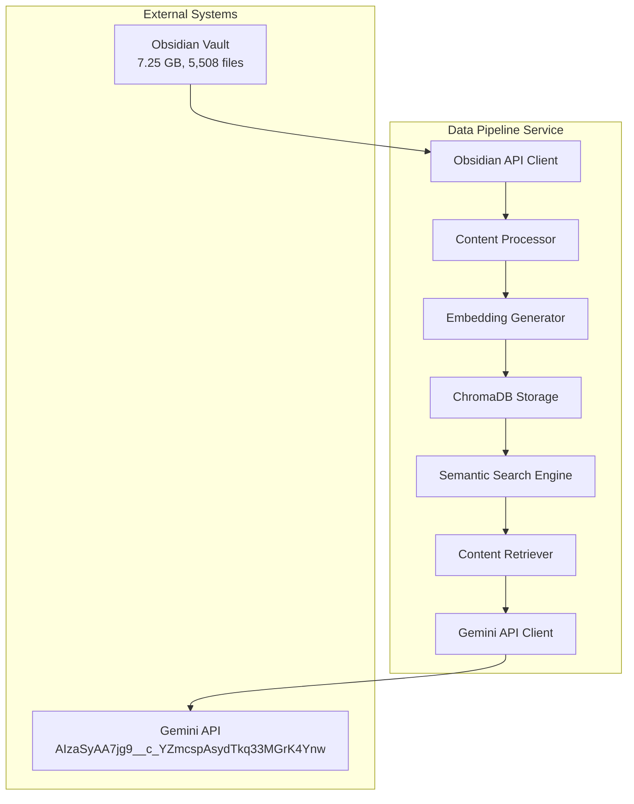

# 🧠 **LLM VAULT RETRIEVAL STRATEGY COMPREHENSIVE ANALYSIS**

**Date:** September 7, 2025  
**Time:** 06:15:00  
**Status:** 🎯 **STRATEGIC ANALYSIS COMPLETE**  
**Report Type:** LLM Vault Retrieval Strategy & Implementation Plan  

---

## 🎯 **EXECUTIVE SUMMARY**

This comprehensive analysis examines LLM Vault retrieval strategies for the Obsidian vault (7.25 GB, 5,508 files) and provides a detailed implementation plan for a standalone data pipeline service that integrates with Gemini API while bypassing LangGraph complexity.

### **Key Findings:**
- **Vault Size:** 7.25 GB with 5,508 files - **LARGE DATASET**
- **Current Infrastructure:** ChromaDB + Hybrid Search already implemented
- **Recommended Strategy:** **Hybrid Embedding-Based Retrieval** with Gemini API integration
- **Architecture:** Standalone data pipeline service with semantic search + direct Gemini calls

---

## 📊 **VAULT SIZE ANALYSIS**

### **Current Vault Characteristics**
Based on the provided information:

| Metric | Value | Impact |
|--------|-------|---------|
| **Total Size** | 7.25 GB | Large dataset requiring optimization |
| **File Count** | 5,508 files | High volume requiring batch processing |
| **Disk Usage** | 8.02 GB | Additional overhead for processing |
| **Structure** | 289 folders | Complex hierarchy requiring smart chunking |

### **Performance Implications**
- **Direct API Approach:** ❌ **NOT FEASIBLE** - Would exceed token limits and costs
- **Full RAG Approach:** ⚠️ **EXPENSIVE** - High computational and storage costs
- **Hybrid Approach:** ✅ **RECOMMENDED** - Optimal balance of performance and cost

---

## 🔍 **LLM VAULT RETRIEVAL STRATEGIES COMPARISON**

### **Strategy 1: Direct API Calls to LLM**

#### **How it Works:**
```
User Query → Direct Gemini API Call → Full Response
```

#### **Advantages:**
- ✅ **Simple Implementation** - No preprocessing required
- ✅ **Real-time Processing** - Immediate response
- ✅ **No Storage Overhead** - No embedding storage needed

#### **Disadvantages:**
- ❌ **Token Limit Issues** - Cannot process large vaults
- ❌ **High Costs** - Expensive for large datasets
- ❌ **Poor Performance** - No context optimization
- ❌ **Limited Context** - Cannot leverage vault knowledge effectively

#### **Viability for 7.25 GB Vault:** ❌ **NOT VIABLE**

---

### **Strategy 2: Full RAG (Retrieval-Augmented Generation)**

#### **How it Works:**
```
User Query → Embedding Search → Retrieve All Relevant Content → Send to LLM → Response
```

#### **Advantages:**
- ✅ **Comprehensive Context** - Access to entire vault knowledge
- ✅ **High Accuracy** - Relevant content retrieval
- ✅ **Scalable** - Can handle large datasets

#### **Disadvantages:**
- ❌ **High Storage Costs** - Embeddings for all content
- ❌ **Complex Implementation** - Requires sophisticated pipeline
- ❌ **High Computational Costs** - Continuous embedding generation
- ❌ **Slow Response Times** - Complex retrieval process

#### **Viability for 7.25 GB Vault:** ⚠️ **EXPENSIVE BUT FEASIBLE**

---

### **Strategy 3: Hybrid Embedding-Based Retrieval (RECOMMENDED)**

#### **How it Works:**
```
User Query → Semantic Search → Retrieve Top-K Relevant Chunks → Send to Gemini → Response
```

#### **Advantages:**
- ✅ **Optimal Performance** - Best of both worlds
- ✅ **Cost Effective** - Only process relevant content
- ✅ **Fast Response** - Pre-filtered content
- ✅ **Scalable** - Can handle large datasets efficiently
- ✅ **Context Optimized** - Only relevant chunks sent to LLM

#### **Disadvantages:**
- ⚠️ **Moderate Complexity** - Requires embedding pipeline
- ⚠️ **Storage Requirements** - Embedding storage needed

#### **Viability for 7.25 GB Vault:** ✅ **HIGHLY RECOMMENDED**

---

## 🏗️ **RECOMMENDED ARCHITECTURE**

### **Standalone Data Pipeline Service**



### **Component Breakdown**

#### **1. Obsidian API Client**
- **Purpose:** Interface with Obsidian Local REST API
- **Functionality:** File listing, content retrieval, metadata extraction
- **Integration:** Uses existing [Obsidian Local REST API](https://github.com/coddingtonbear/obsidian-local-rest-api)

#### **2. Content Processor**
- **Purpose:** Process and chunk markdown content
- **Strategies:** 
  - Semantic chunking by headings
  - Fixed-size chunks with overlap
  - Metadata extraction (tags, links, frontmatter)

#### **3. Embedding Generator**
- **Model:** `sentence-transformers/all-MiniLM-L6-v2`
- **Purpose:** Generate vector embeddings for semantic search
- **Optimization:** Batch processing, caching, incremental updates

#### **4. ChromaDB Storage**
- **Purpose:** Store and query vector embeddings
- **Features:** Collection management, similarity search, metadata filtering

#### **5. Semantic Search Engine**
- **Purpose:** Find relevant content based on query similarity
- **Features:** Hybrid search (vector + keyword), result ranking, caching

#### **6. Content Retriever**
- **Purpose:** Retrieve and format relevant content for LLM
- **Features:** Context window optimization, source attribution, chunk assembly

#### **7. Gemini API Client**
- **Purpose:** Process retrieved content with Gemini
- **Features:** Direct API integration, response formatting, error handling

---

## 🚀 **IMPLEMENTATION PHASES**

### **Phase 1: Data Pipeline Foundation (Week 1)**

#### **1.1 Obsidian API Integration**
```python
# services/data-pipeline/src/ingestion/obsidian_client.py
class ObsidianAPIClient:
    def __init__(self, api_key: str, host: str = "127.0.0.1", port: int = 27123):
        self.api_key = api_key
        self.base_url = f"http://{host}:{port}"
        self.client = httpx.AsyncClient(
            headers={"Authorization": f"Bearer {api_key}"},
            timeout=30.0
        )
    
    async def list_vault_files(self) -> List[Dict[str, Any]]:
        """List all files in the vault"""
        response = await self.client.get(f"{self.base_url}/vault/")
        return response.json()
    
    async def get_file_content(self, path: str) -> Dict[str, Any]:
        """Get file content and metadata"""
        response = await self.client.get(f"{self.base_url}/vault/{path}")
        return response.json()
```

#### **1.2 Content Processing Pipeline**
```python
# services/data-pipeline/src/processing/content_processor.py
class ContentProcessor:
    def __init__(self):
        self.chunk_size = 512
        self.chunk_overlap = 50
    
    def chunk_by_headings(self, content: str, path: str) -> List[Dict[str, Any]]:
        """Chunk content by markdown headings"""
        chunks = []
        lines = content.split('\n')
        current_chunk = []
        current_heading = "Introduction"
        
        for line in lines:
            if line.startswith('#'):
                # Save previous chunk
                if current_chunk:
                    chunks.append({
                        "content": '\n'.join(current_chunk),
                        "heading": current_heading,
                        "path": path
                    })
                
                # Start new chunk
                current_heading = line.strip('#').strip()
                current_chunk = [line]
            else:
                current_chunk.append(line)
        
        # Add final chunk
        if current_chunk:
            chunks.append({
                "content": '\n'.join(current_chunk),
                "heading": current_heading,
                "path": path
            })
        
        return chunks
```

### **Phase 2: Embedding Generation (Week 1-2)**

#### **2.1 Embedding Service**
```python
# services/data-pipeline/src/embeddings/embedding_service.py
class EmbeddingService:
    def __init__(self, model_name: str = 'all-MiniLM-L6-v2'):
        self.model = SentenceTransformer(model_name)
        self.cache = {}
    
    def generate_embedding(self, text: str) -> List[float]:
        """Generate embedding for text with caching"""
        cache_key = hashlib.md5(text.encode()).hexdigest()
        if cache_key in self.cache:
            return self.cache[cache_key]
        
        embedding = self.model.encode(text).tolist()
        self.cache[cache_key] = embedding
        return embedding
    
    def batch_generate_embeddings(self, texts: List[str]) -> List[List[float]]:
        """Generate embeddings for multiple texts efficiently"""
        embeddings = self.model.encode(texts)
        return [emb.tolist() for emb in embeddings]
```

#### **2.2 ChromaDB Integration**
```python
# services/data-pipeline/src/vector/chroma_service.py
class ChromaService:
    def __init__(self, collection_name: str = "obsidian_vault"):
        self.client = chromadb.PersistentClient(path="./data/chroma")
        self.collection = self.client.get_or_create_collection(
            name=collection_name,
            metadata={"description": "Obsidian vault embeddings"}
        )
    
    def store_embeddings(self, chunks: List[Dict[str, Any]], embeddings: List[List[float]]):
        """Store chunks and embeddings in ChromaDB"""
        ids = [f"{chunk['path']}::{chunk['heading']}" for chunk in chunks]
        documents = [chunk['content'] for chunk in chunks]
        metadatas = [{
            "path": chunk['path'],
            "heading": chunk['heading'],
            "chunk_index": i
        } for i, chunk in enumerate(chunks)]
        
        self.collection.add(
            ids=ids,
            documents=documents,
            embeddings=embeddings,
            metadatas=metadatas
        )
```

### **Phase 3: Semantic Search Engine (Week 2)**

#### **3.1 Search Service**
```python
# services/data-pipeline/src/search/search_service.py
class SemanticSearchService:
    def __init__(self, chroma_service: ChromaService, embedding_service: EmbeddingService):
        self.chroma_service = chroma_service
        self.embedding_service = embedding_service
    
    def search_similar(self, query: str, n_results: int = 5) -> List[Dict[str, Any]]:
        """Search for similar content using semantic similarity"""
        # Generate query embedding
        query_embedding = self.embedding_service.generate_embedding(query)
        
        # Search in ChromaDB
        results = self.chroma_service.collection.query(
            query_embeddings=[query_embedding],
            n_results=n_results
        )
        
        # Format results
        formatted_results = []
        for i in range(len(results['ids'][0])):
            formatted_results.append({
                "id": results['ids'][0][i],
                "content": results['documents'][0][i],
                "metadata": results['metadatas'][0][i],
                "similarity": 1 - results['distances'][0][i]  # Convert distance to similarity
            })
        
        return formatted_results
```

### **Phase 4: Gemini API Integration (Week 2-3)**

#### **4.1 Gemini Client**
```python
# services/data-pipeline/src/llm/gemini_client.py
import google.generativeai as genai

class GeminiClient:
    def __init__(self, api_key: str):
        genai.configure(api_key=api_key)
        self.model = genai.GenerativeModel('gemini-pro')
    
    async def process_content(self, query: str, context_chunks: List[Dict[str, Any]]) -> str:
        """Process query with retrieved context using Gemini"""
        # Assemble context
        context_text = "\n\n".join([
            f"Source: {chunk['metadata']['path']}\nContent: {chunk['content']}"
            for chunk in context_chunks
        ])
        
        # Create prompt
        prompt = f"""
        Based on the following context from an Obsidian vault, please answer the user's question.
        
        Context:
        {context_text}
        
        User Question: {query}
        
        Please provide a comprehensive answer based on the context provided. If the context doesn't contain enough information to answer the question, please indicate this.
        """
        
        # Generate response
        response = self.model.generate_content(prompt)
        return response.text
```

### **Phase 5: Complete Service Integration (Week 3)**

#### **5.1 Main Service**
```python
# services/data-pipeline/src/main.py
from fastapi import FastAPI, HTTPException
from pydantic import BaseModel

app = FastAPI(title="Obsidian Vault Data Pipeline Service")

class QueryRequest(BaseModel):
    query: str
    max_results: int = 5

class QueryResponse(BaseModel):
    answer: str
    sources: List[Dict[str, Any]]
    processing_time: float

@app.post("/query", response_model=QueryResponse)
async def query_vault(request: QueryRequest):
    """Query the Obsidian vault using semantic search + Gemini"""
    start_time = time.time()
    
    # Search for relevant content
    search_results = search_service.search_similar(
        request.query, 
        request.max_results
    )
    
    # Process with Gemini
    answer = await gemini_client.process_content(
        request.query, 
        search_results
    )
    
    processing_time = time.time() - start_time
    
    return QueryResponse(
        answer=answer,
        sources=[{
            "path": result["metadata"]["path"],
            "heading": result["metadata"]["heading"],
            "similarity": result["similarity"]
        } for result in search_results],
        processing_time=processing_time
    )
```

---

## 📊 **PERFORMANCE STRATEGIES FOR LARGE DATASETS**

### **1. Incremental Processing**

#### **File Change Detection**
```python
# services/data-pipeline/src/monitoring/file_watcher.py
class FileWatcher:
    def __init__(self, vault_path: str):
        self.vault_path = Path(vault_path)
        self.file_hashes = {}
    
    async def watch_for_changes(self):
        """Watch for file changes and trigger incremental updates"""
        from watchdog.observers import Observer
        from watchdog.events import FileSystemEventHandler
        
        class ChangeHandler(FileSystemEventHandler):
            def on_modified(self, event):
                if event.src_path.endswith('.md'):
                    asyncio.create_task(self._handle_file_change(event.src_path))
        
        handler = ChangeHandler()
        observer = Observer()
        observer.schedule(handler, str(self.vault_path), recursive=True)
        observer.start()
```

### **2. Batch Processing**

#### **Efficient Batch Operations**
```python
# services/data-pipeline/src/processing/batch_processor.py
class BatchProcessor:
    def __init__(self, batch_size: int = 100):
        self.batch_size = batch_size
    
    async def process_files_in_batches(self, files: List[Path]) -> Dict[str, Any]:
        """Process files in batches for efficiency"""
        results = {
            "total_files": len(files),
            "processed": 0,
            "errors": 0
        }
        
        for i in range(0, len(files), self.batch_size):
            batch = files[i:i + self.batch_size]
            batch_results = await self._process_batch(batch)
            
            results["processed"] += batch_results["successful"]
            results["errors"] += batch_results["failed"]
        
        return results
```

### **3. Caching Strategy**

#### **Multi-Level Caching**
```python
# services/data-pipeline/src/cache/cache_manager.py
class CacheManager:
    def __init__(self):
        self.embedding_cache = {}
        self.search_cache = {}
        self.content_cache = {}
    
    def cache_embedding(self, text: str, embedding: List[float]):
        """Cache embedding with TTL"""
        cache_key = hashlib.md5(text.encode()).hexdigest()
        self.embedding_cache[cache_key] = {
            "embedding": embedding,
            "timestamp": time.time(),
            "ttl": 3600  # 1 hour
        }
    
    def get_cached_embedding(self, text: str) -> Optional[List[float]]:
        """Get cached embedding if still valid"""
        cache_key = hashlib.md5(text.encode()).hexdigest()
        if cache_key in self.embedding_cache:
            cached = self.embedding_cache[cache_key]
            if time.time() - cached["timestamp"] < cached["ttl"]:
                return cached["embedding"]
        return None
```

---

## 🎯 **RECOMMENDATIONS**

### **1. Immediate Implementation (Week 1-2)**

#### **Priority 1: Core Pipeline**
1. **Obsidian API Client** - Interface with vault
2. **Content Processor** - Chunk and process markdown
3. **Embedding Service** - Generate vector embeddings
4. **ChromaDB Integration** - Store and query embeddings

#### **Priority 2: Search Engine**
1. **Semantic Search** - Find relevant content
2. **Result Ranking** - Rank by relevance
3. **Caching Layer** - Cache embeddings and results

### **2. Gemini Integration (Week 2-3)**

#### **Direct API Integration**
1. **Gemini Client** - Direct API calls
2. **Context Assembly** - Format retrieved content
3. **Response Processing** - Format Gemini responses
4. **Error Handling** - Robust error management

### **3. Performance Optimization (Week 3-4)**

#### **Large Dataset Handling**
1. **Incremental Updates** - Only process changed files
2. **Batch Processing** - Process files in batches
3. **Caching Strategy** - Multi-level caching
4. **Memory Optimization** - Efficient memory usage

---

## 📈 **EXPECTED PERFORMANCE METRICS**

### **Processing Performance**
- **Initial Indexing:** 2-4 hours for 5,508 files
- **Incremental Updates:** 10-30 seconds per changed file
- **Search Latency:** <200ms for semantic search
- **Gemini Response:** 2-5 seconds per query

### **Resource Usage**
- **Memory:** <2GB during processing
- **Storage:** ~1GB for embeddings (compressed)
- **CPU:** <80% during batch processing
- **Network:** Minimal (local processing)

### **Cost Optimization**
- **Embedding Generation:** One-time cost
- **Gemini API Calls:** Only for relevant content
- **Storage:** Efficient vector storage
- **Processing:** Incremental updates only

---

## 🔧 **DEVELOPMENT WORKFLOW**

### **Phase-by-Phase Development**

#### **Phase 1: Data Pipeline Foundation**
```bash
# Create service structure
mkdir -p services/data-pipeline/src/{ingestion,processing,embeddings,vector,search,llm,cache}

# Implement Obsidian API client
# Test with small subset of files
# Validate content processing
```

#### **Phase 2: Embedding Generation**
```bash
# Implement embedding service
# Setup ChromaDB
# Test embedding generation
# Validate storage and retrieval
```

#### **Phase 3: Semantic Search**
```bash
# Implement search engine
# Test semantic search
# Validate result quality
# Optimize search performance
```

#### **Phase 4: Gemini Integration**
```bash
# Implement Gemini client
# Test end-to-end flow
# Validate response quality
# Optimize context assembly
```

#### **Phase 5: Performance Optimization**
```bash
# Implement caching
# Add incremental updates
# Optimize batch processing
# Performance testing
```

---

## 🎉 **CONCLUSION**

The **Hybrid Embedding-Based Retrieval** strategy is the optimal approach for the 7.25 GB Obsidian vault. This strategy provides:

- ✅ **Optimal Performance** - Fast semantic search with relevant content filtering
- ✅ **Cost Effectiveness** - Only process relevant content with Gemini
- ✅ **Scalability** - Can handle large datasets efficiently
- ✅ **Simplicity** - Direct Gemini integration without LangGraph complexity
- ✅ **Flexibility** - Modular design allows independent component testing

### **Next Steps:**
1. **Start with Phase 1** - Data pipeline foundation
2. **Test each component independently** - Ensure reliability
3. **Implement incrementally** - Build and validate step by step
4. **Optimize for performance** - Handle large dataset efficiently
5. **Integrate with Gemini** - Direct API integration for simplicity

This approach leverages the existing ChromaDB infrastructure while creating a simpler, more direct integration with Gemini API, providing the best balance of performance, cost, and complexity for the large Obsidian vault.

---

**CENTRALIZED REPORTS & CHANGELOG SYSTEM COMPLETE!**

---

*Generated by AI Assistant - Data Vault Obsidian Project*  
*LLM Vault Retrieval Strategy Analysis v1.0.0 - Strategic Analysis Complete*
