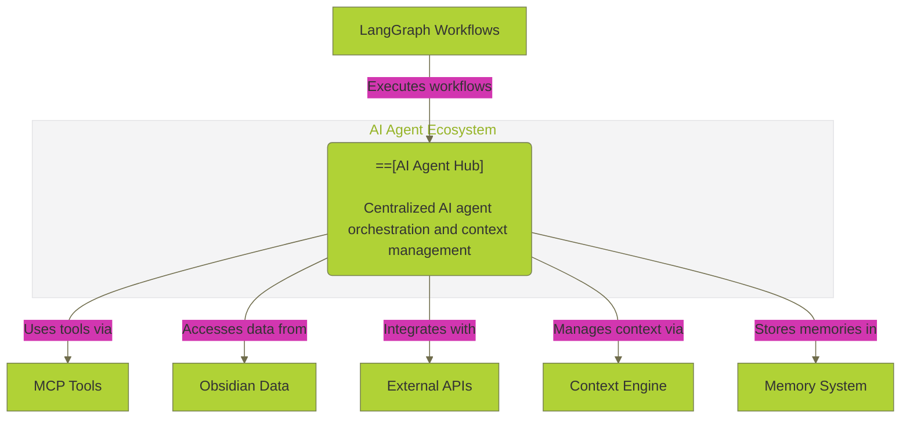
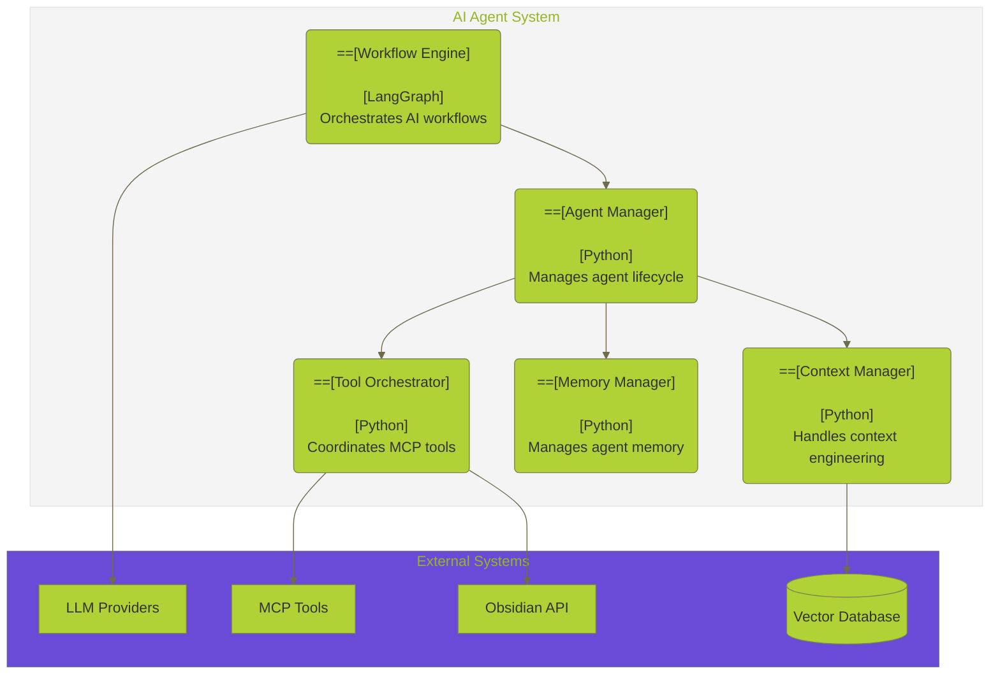
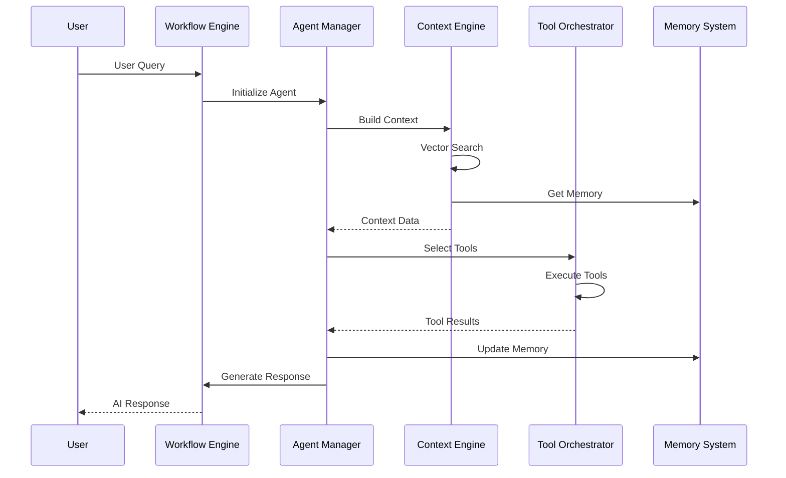
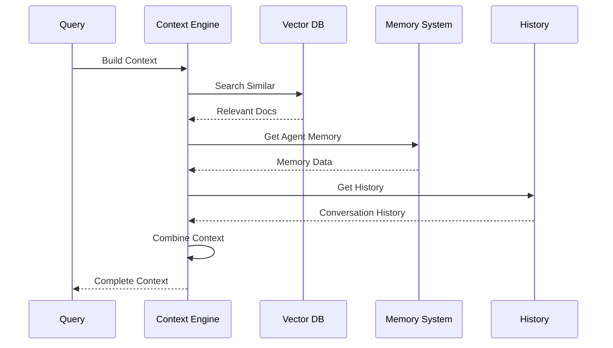
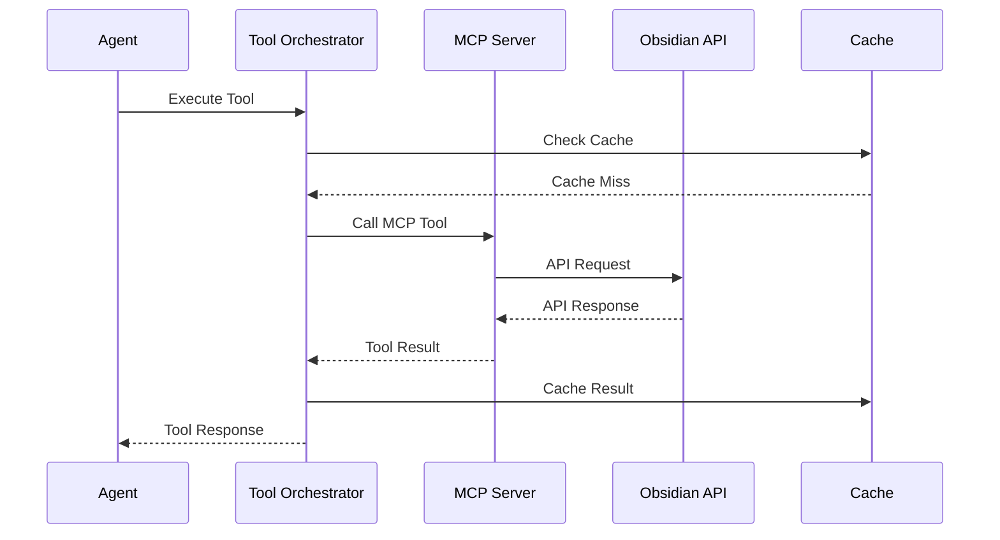

# 🤖 **AI AGENT INTEGRATION COMPREHENSIVE ANALYSIS**

**Version:** 3.0.0  
**Last Updated:** September 6, 2025  
**Status:** ✅ **PRODUCTION-READY AI AGENT ANALYSIS**

---

## 🎯 **OVERVIEW**

This document provides a comprehensive analysis of AI agent integration in the Data Vault Obsidian platform, including LangGraph workflows, MCP tool interactions, and context engineering that enables seamless data flow between vaults and AI agents.

> **🔗 Related Documentation:** [Data Operations Hub](README.md) | [MCP Integration Analysis](MCP_INTEGRATION_ANALYSIS.md) | [Data Pipeline Analysis](DATA_PIPELINE_ANALYSIS.md) | [REST API Analysis](REST_API_ANALYSIS.md) | [Enhanced Toolbox Specification](ENHANCED_TOOLBOX_SPECIFICATION.md)

---

## 🏗️ **AI AGENT ARCHITECTURE**

> **🔗 Agent Integration:** [MCP Integration Analysis](MCP_INTEGRATION_ANALYSIS.md#mcp-architecture-overview) | [Data Pipeline Analysis](DATA_PIPELINE_ANALYSIS.md#data-pipeline-architecture) | [Enhanced Toolbox Specification](ENHANCED_TOOLBOX_SPECIFICATION.md#toolbox-architecture-overview) | [Obsidian MCP Integration Analysis](OBSIDIAN_MCP_INTEGRATION_ANALYSIS.md#current-state-vs-external-capabilities)

### **1. System Context Diagram**



### **2. Container Diagram**



---

## 🔧 **CURRENT AI AGENT IMPLEMENTATIONS**

### **1. LangGraph Workflow Engine**

#### **Workflow Definition**
```python
# LangGraph Workflow Implementation
from langgraph import StateGraph, END
from typing import TypedDict, List, Dict, Any

class AgentState(TypedDict):
    """State definition for AI agents"""
    messages: List[Dict[str, Any]]
    context: Dict[str, Any]
    tools_used: List[str]
    memory: Dict[str, Any]
    current_task: str
    workflow_step: int
    error_count: int
    max_retries: int

class LangGraphWorkflowEngine:
    def __init__(self):
        self.workflow = StateGraph(AgentState)
        self._setup_workflow()
        self.app = self.workflow.compile()
    
    def _setup_workflow(self):
        """Setup the workflow graph"""
        # Add nodes
        self.workflow.add_node("initialize", self._initialize_agent)
        self.workflow.add_node("analyze_context", self._analyze_context)
        self.workflow.add_node("select_tools", self._select_tools)
        self.workflow.add_node("execute_tools", self._execute_tools)
        self.workflow.add_node("process_results", self._process_results)
        self.workflow.add_node("update_memory", self._update_memory)
        self.workflow.add_node("generate_response", self._generate_response)
        self.workflow.add_node("error_handling", self._handle_error)
        
        # Add edges
        self.workflow.add_edge("initialize", "analyze_context")
        self.workflow.add_edge("analyze_context", "select_tools")
        self.workflow.add_edge("select_tools", "execute_tools")
        self.workflow.add_edge("execute_tools", "process_results")
        self.workflow.add_edge("process_results", "update_memory")
        self.workflow.add_edge("update_memory", "generate_response")
        self.workflow.add_edge("generate_response", END)
        
        # Add conditional edges for error handling
        self.workflow.add_conditional_edges(
            "execute_tools",
            self._should_retry,
            {
                "retry": "error_handling",
                "continue": "process_results"
            }
        )
```

#### **Workflow Steps**
```python
async def _initialize_agent(self, state: AgentState) -> AgentState:
    """Initialize agent with context and memory"""
    state["workflow_step"] = 1
    state["error_count"] = 0
    state["tools_used"] = []
    
    # Load context from memory
    if "memory" not in state:
        state["memory"] = await self._load_agent_memory()
    
    return state

async def _analyze_context(self, state: AgentState) -> AgentState:
    """Analyze current context and determine requirements"""
    messages = state["messages"]
    last_message = messages[-1] if messages else {}
    
    # Analyze message content
    context_analysis = await self._analyze_message_context(last_message)
    state["context"] = context_analysis
    
    return state

async def _select_tools(self, state: AgentState) -> AgentState:
    """Select appropriate tools based on context"""
    context = state["context"]
    available_tools = await self._get_available_tools()
    
    # Select tools based on context analysis
    selected_tools = await self._select_tools_for_context(
        context, available_tools
    )
    
    state["selected_tools"] = selected_tools
    return state

async def _execute_tools(self, state: AgentState) -> AgentState:
    """Execute selected tools"""
    selected_tools = state["selected_tools"]
    context = state["context"]
    
    tool_results = []
    for tool in selected_tools:
        try:
            result = await self._execute_tool(tool, context)
            tool_results.append({
                "tool": tool["name"],
                "result": result,
                "success": True
            })
            state["tools_used"].append(tool["name"])
        except Exception as e:
            tool_results.append({
                "tool": tool["name"],
                "error": str(e),
                "success": False
            })
            state["error_count"] += 1
    
    state["tool_results"] = tool_results
    return state
```

### **2. Context Engineering System**

#### **Context Management**
```python
# Context Engineering System
class ContextEngine:
    def __init__(self, vector_db: VectorDatabase, memory_system: MemorySystem):
        self.vector_db = vector_db
        self.memory_system = memory_system
        self.context_cache = {}
        self.context_ttl = 3600  # 1 hour
    
    async def build_context(self, query: str, agent_id: str) -> Dict[str, Any]:
        """Build comprehensive context for AI agent"""
        # Get relevant documents from vector search
        relevant_docs = await self._get_relevant_documents(query)
        
        # Get agent memory
        agent_memory = await self.memory_system.get_agent_memory(agent_id)
        
        # Get conversation history
        conversation_history = await self._get_conversation_history(agent_id)
        
        # Build context object
        context = {
            "query": query,
            "relevant_documents": relevant_docs,
            "agent_memory": agent_memory,
            "conversation_history": conversation_history,
            "timestamp": datetime.utcnow().isoformat(),
            "context_id": str(uuid.uuid4())
        }
        
        # Cache context
        await self._cache_context(context["context_id"], context)
        
        return context
    
    async def _get_relevant_documents(self, query: str, n_results: int = 5) -> List[Dict[str, Any]]:
        """Get relevant documents using vector search"""
        # Search vector database
        search_results = self.vector_db.search_similar(query, n_results)
        
        # Format results
        relevant_docs = []
        for result in search_results:
            relevant_docs.append({
                "content": result["content"],
                "metadata": result["metadata"],
                "relevance_score": result["distance"],
                "source": "vector_search"
            })
        
        return relevant_docs
```

#### **Memory Management**
```python
# Memory Management System
class MemorySystem:
    def __init__(self, redis_client: redis.Redis):
        self.redis = redis_client
        self.memory_ttl = 86400 * 7  # 7 days
    
    async def store_agent_memory(self, agent_id: str, memory: Dict[str, Any]):
        """Store agent memory"""
        memory_key = f"agent_memory:{agent_id}"
        
        # Get existing memory
        existing_memory = await self.get_agent_memory(agent_id)
        
        # Merge with new memory
        merged_memory = {**existing_memory, **memory}
        
        # Store in Redis
        await self.redis.setex(
            memory_key,
            self.memory_ttl,
            json.dumps(merged_memory)
        )
    
    async def get_agent_memory(self, agent_id: str) -> Dict[str, Any]:
        """Get agent memory"""
        memory_key = f"agent_memory:{agent_id}"
        memory_data = await self.redis.get(memory_key)
        
        if memory_data:
            return json.loads(memory_data)
        return {}
    
    async def update_conversation_history(self, agent_id: str, message: Dict[str, Any]):
        """Update conversation history"""
        history_key = f"conversation_history:{agent_id}"
        
        # Get existing history
        existing_history = await self.redis.lrange(history_key, 0, -1)
        history = [json.loads(msg) for msg in existing_history]
        
        # Add new message
        history.append(message)
        
        # Keep only last 50 messages
        if len(history) > 50:
            history = history[-50:]
        
        # Store updated history
        await self.redis.delete(history_key)
        for msg in history:
            await self.redis.lpush(history_key, json.dumps(msg))
        
        await self.redis.expire(history_key, self.memory_ttl)
```

### **3. Tool Orchestration System**

#### **MCP Tool Integration**
```python
# Tool Orchestration System
class ToolOrchestrator:
    def __init__(self, mcp_integration: MCPIntegrationServer):
        self.mcp_integration = mcp_integration
        self.tool_registry = {}
        self.tool_cache = {}
        self._initialize_tools()
    
    def _initialize_tools(self):
        """Initialize available tools"""
        self.tool_registry = {
            "obsidian_list_files": {
                "name": "obsidian_list_files",
                "description": "List files in an Obsidian vault",
                "parameters": {
                    "vault": {"type": "string", "required": True},
                    "recursive": {"type": "boolean", "default": False}
                },
                "category": "vault_operations"
            },
            "obsidian_read_note": {
                "name": "obsidian_read_note",
                "description": "Read a note from an Obsidian vault",
                "parameters": {
                    "vault": {"type": "string", "required": True},
                    "path": {"type": "string", "required": True}
                },
                "category": "vault_operations"
            },
            "obsidian_search": {
                "name": "obsidian_search",
                "description": "Search across Obsidian vault content",
                "parameters": {
                    "vault": {"type": "string", "required": True},
                    "query": {"type": "string", "required": True}
                },
                "category": "search_operations"
            }
        }
    
    async def execute_tool(self, tool_name: str, parameters: Dict[str, Any]) -> Dict[str, Any]:
        """Execute a tool with given parameters"""
        if tool_name not in self.tool_registry:
            raise ValueError(f"Unknown tool: {tool_name}")
        
        # Validate parameters
        self._validate_parameters(tool_name, parameters)
        
        # Check cache
        cache_key = self._generate_cache_key(tool_name, parameters)
        if cache_key in self.tool_cache:
            return self.tool_cache[cache_key]
        
        # Execute tool
        try:
            result = await self.mcp_integration.call_mcp_tool_async(
                "obsidian", tool_name, parameters
            )
            
            # Cache result
            self.tool_cache[cache_key] = result
            
            return result
            
        except Exception as e:
            return {
                "error": str(e),
                "tool": tool_name,
                "parameters": parameters
            }
    
    def _validate_parameters(self, tool_name: str, parameters: Dict[str, Any]):
        """Validate tool parameters"""
        tool_schema = self.tool_registry[tool_name]["parameters"]
        
        for param_name, param_schema in tool_schema.items():
            if param_schema.get("required", False) and param_name not in parameters:
                raise ValueError(f"Required parameter '{param_name}' missing")
            
            if param_name in parameters:
                param_type = param_schema.get("type")
                if param_type == "string" and not isinstance(parameters[param_name], str):
                    raise ValueError(f"Parameter '{param_name}' must be a string")
                elif param_type == "boolean" and not isinstance(parameters[param_name], bool):
                    raise ValueError(f"Parameter '{param_name}' must be a boolean")
```

---

## 🔄 **AI AGENT DATA FLOW**

### **1. Agent Execution Flow**



### **2. Context Building Flow**



### **3. Tool Execution Flow**



---

## 📊 **PERFORMANCE ANALYSIS**

### **1. Agent Performance Metrics**

#### **Execution Time Analysis**
```python
# Agent performance metrics
class AgentPerformanceMetrics:
    def __init__(self):
        self.metrics = {
            "workflow_execution_time": Histogram("agent_workflow_execution_seconds", "Workflow execution time"),
            "context_building_time": Histogram("agent_context_building_seconds", "Context building time"),
            "tool_execution_time": Histogram("agent_tool_execution_seconds", "Tool execution time"),
            "memory_operations": Counter("agent_memory_operations_total", "Memory operations", ["operation_type"]),
            "tool_calls": Counter("agent_tool_calls_total", "Tool calls", ["tool_name", "status"])
        }
    
    def record_workflow_execution(self, workflow_id: str, duration: float, success: bool):
        """Record workflow execution metrics"""
        self.metrics["workflow_execution_time"].observe(duration)
    
    def record_context_building(self, duration: float, context_size: int):
        """Record context building metrics"""
        self.metrics["context_building_time"].observe(duration)
    
    def record_tool_execution(self, tool_name: str, duration: float, success: bool):
        """Record tool execution metrics"""
        self.metrics["tool_execution_time"].observe(duration)
        self.metrics["tool_calls"].labels(
            tool_name=tool_name,
            status="success" if success else "error"
        ).inc()
```

### **2. Context Quality Metrics**

#### **Context Relevance Scoring**
```python
# Context quality assessment
class ContextQualityAssessor:
    def __init__(self):
        self.relevance_threshold = 0.7
        self.context_cache = {}
    
    async def assess_context_quality(self, context: Dict[str, Any]) -> Dict[str, Any]:
        """Assess the quality of built context"""
        # Calculate relevance scores
        relevance_scores = []
        for doc in context.get("relevant_documents", []):
            score = doc.get("relevance_score", 0)
            relevance_scores.append(score)
        
        # Calculate quality metrics
        avg_relevance = sum(relevance_scores) / len(relevance_scores) if relevance_scores else 0
        high_relevance_count = len([s for s in relevance_scores if s > self.relevance_threshold])
        
        # Assess memory completeness
        memory_completeness = self._assess_memory_completeness(context.get("agent_memory", {}))
        
        # Assess conversation context
        conversation_context = self._assess_conversation_context(
            context.get("conversation_history", [])
        )
        
        return {
            "avg_relevance_score": avg_relevance,
            "high_relevance_docs": high_relevance_count,
            "total_docs": len(relevance_scores),
            "memory_completeness": memory_completeness,
            "conversation_context": conversation_context,
            "overall_quality": self._calculate_overall_quality(
                avg_relevance, memory_completeness, conversation_context
            )
        }
    
    def _calculate_overall_quality(self, relevance: float, memory: float, conversation: float) -> float:
        """Calculate overall context quality score"""
        weights = {"relevance": 0.5, "memory": 0.3, "conversation": 0.2}
        return (
            relevance * weights["relevance"] +
            memory * weights["memory"] +
            conversation * weights["conversation"]
        )
```

---

## 🚀 **ENHANCEMENT OPPORTUNITIES**

### **1. Advanced Agent Capabilities**

#### **Multi-Agent Collaboration**
```python
# Multi-agent collaboration system
class MultiAgentCollaborator:
    def __init__(self):
        self.agents = {}
        self.communication_bus = CommunicationBus()
        self.task_distributor = TaskDistributor()
    
    async def create_agent_team(self, team_config: Dict[str, Any]) -> str:
        """Create a team of collaborating agents"""
        team_id = str(uuid.uuid4())
        team_agents = []
        
        for agent_config in team_config["agents"]:
            agent = await self._create_agent(agent_config)
            team_agents.append(agent)
            self.agents[agent.id] = agent
        
        # Setup communication between agents
        await self._setup_agent_communication(team_agents)
        
        return team_id
    
    async def execute_collaborative_task(self, team_id: str, task: Dict[str, Any]) -> Dict[str, Any]:
        """Execute a task using multiple agents"""
        # Distribute subtasks
        subtasks = await self.task_distributor.distribute_task(task)
        
        # Execute subtasks in parallel
        results = []
        for subtask in subtasks:
            agent_id = subtask["assigned_agent"]
            agent = self.agents[agent_id]
            result = await agent.execute_task(subtask)
            results.append(result)
        
        # Combine results
        combined_result = await self._combine_agent_results(results)
        
        return combined_result
```

#### **Agent Learning System**
```python
# Agent learning and adaptation system
class AgentLearningSystem:
    def __init__(self, vector_db: VectorDatabase):
        self.vector_db = vector_db
        self.learning_data = []
        self.model_updater = ModelUpdater()
    
    async def learn_from_interaction(self, interaction: Dict[str, Any]):
        """Learn from agent interaction"""
        # Extract learning features
        features = self._extract_learning_features(interaction)
        
        # Store learning data
        self.learning_data.append(features)
        
        # Update agent models if enough data
        if len(self.learning_data) >= 100:
            await self._update_agent_models()
    
    async def _update_agent_models(self):
        """Update agent models based on learning data"""
        # Analyze learning patterns
        patterns = self._analyze_learning_patterns(self.learning_data)
        
        # Update context selection model
        await self.model_updater.update_context_model(patterns)
        
        # Update tool selection model
        await self.model_updater.update_tool_model(patterns)
        
        # Clear learning data
        self.learning_data = []
```

### **2. Advanced Context Engineering**

#### **Dynamic Context Adaptation**
```python
# Dynamic context adaptation
class DynamicContextAdapter:
    def __init__(self, context_engine: ContextEngine):
        self.context_engine = context_engine
        self.adaptation_rules = {}
        self.context_history = []
    
    async def adapt_context(self, base_context: Dict[str, Any], 
                           adaptation_requirements: Dict[str, Any]) -> Dict[str, Any]:
        """Adapt context based on specific requirements"""
        adapted_context = base_context.copy()
        
        # Apply adaptation rules
        for rule_name, rule_func in self.adaptation_rules.items():
            if self._should_apply_rule(rule_name, adaptation_requirements):
                adapted_context = await rule_func(adapted_context, adaptation_requirements)
        
        # Store adaptation history
        self.context_history.append({
            "original_context": base_context,
            "adapted_context": adapted_context,
            "requirements": adaptation_requirements,
            "timestamp": datetime.utcnow().isoformat()
        })
        
        return adapted_context
    
    def add_adaptation_rule(self, rule_name: str, rule_func: callable, conditions: Dict[str, Any]):
        """Add a new context adaptation rule"""
        self.adaptation_rules[rule_name] = {
            "function": rule_func,
            "conditions": conditions
        }
```

#### **Context Compression**
```python
# Context compression for large contexts
class ContextCompressor:
    def __init__(self, compression_ratio: float = 0.7):
        self.compression_ratio = compression_ratio
        self.compression_algorithms = {
            "summarization": self._summarize_context,
            "extraction": self._extract_key_points,
            "clustering": self._cluster_similar_content
        }
    
    async def compress_context(self, context: Dict[str, Any], 
                              method: str = "summarization") -> Dict[str, Any]:
        """Compress context while maintaining relevance"""
        if method not in self.compression_algorithms:
            raise ValueError(f"Unknown compression method: {method}")
        
        # Apply compression algorithm
        compressed_context = await self.compression_algorithms[method](context)
        
        # Calculate compression metrics
        original_size = self._calculate_context_size(context)
        compressed_size = self._calculate_context_size(compressed_context)
        compression_ratio = compressed_size / original_size
        
        return {
            "compressed_context": compressed_context,
            "compression_ratio": compression_ratio,
            "original_size": original_size,
            "compressed_size": compressed_size
        }
    
    async def _summarize_context(self, context: Dict[str, Any]) -> Dict[str, Any]:
        """Summarize context using AI summarization"""
        # Extract key documents
        documents = context.get("relevant_documents", [])
        
        # Summarize each document
        summarized_docs = []
        for doc in documents:
            summary = await self._summarize_document(doc["content"])
            summarized_docs.append({
                "summary": summary,
                "metadata": doc["metadata"],
                "relevance_score": doc["relevance_score"]
            })
        
        # Create compressed context
        compressed_context = context.copy()
        compressed_context["relevant_documents"] = summarized_docs
        
        return compressed_context
```

---

## 🔒 **SECURITY & PRIVACY**

### **1. Agent Security**

#### **Agent Authentication**
```python
# Agent authentication and authorization
class AgentSecurityManager:
    def __init__(self, jwt_secret: str):
        self.jwt_secret = jwt_secret
        self.agent_permissions = {}
        self.session_manager = SessionManager()
    
    async def authenticate_agent(self, agent_id: str, token: str) -> bool:
        """Authenticate agent using JWT token"""
        try:
            payload = jwt.decode(token, self.jwt_secret, algorithms=["HS256"])
            
            # Verify agent ID
            if payload.get("agent_id") != agent_id:
                return False
            
            # Check token expiration
            if payload.get("exp") < datetime.utcnow().timestamp():
                return False
            
            return True
            
        except jwt.ExpiredSignatureError:
            return False
        except jwt.InvalidTokenError:
            return False
    
    async def authorize_agent_action(self, agent_id: str, action: str, resource: str) -> bool:
        """Authorize agent to perform specific action"""
        permissions = self.agent_permissions.get(agent_id, [])
        
        # Check if agent has permission for action
        for permission in permissions:
            if permission["action"] == action and permission["resource"] == resource:
                return True
        
        return False
```

### **2. Data Privacy**

#### **Privacy-Preserving Context**
```python
# Privacy-preserving context management
class PrivacyPreservingContext:
    def __init__(self, privacy_config: Dict[str, Any]):
        self.privacy_config = privacy_config
        self.anonymizer = DataAnonymizer()
        self.encryption_manager = EncryptionManager()
    
    async def build_private_context(self, query: str, user_id: str) -> Dict[str, Any]:
        """Build context while preserving privacy"""
        # Build base context
        base_context = await self._build_base_context(query)
        
        # Apply privacy filters
        filtered_context = await self._apply_privacy_filters(base_context, user_id)
        
        # Anonymize sensitive data
        anonymized_context = await self._anonymize_context(filtered_context)
        
        # Encrypt sensitive fields
        encrypted_context = await self._encrypt_sensitive_fields(anonymized_context)
        
        return encrypted_context
    
    async def _apply_privacy_filters(self, context: Dict[str, Any], user_id: str) -> Dict[str, Any]:
        """Apply privacy filters based on user permissions"""
        # Get user privacy settings
        privacy_settings = await self._get_user_privacy_settings(user_id)
        
        # Filter documents based on privacy settings
        filtered_docs = []
        for doc in context.get("relevant_documents", []):
            if self._is_document_accessible(doc, privacy_settings):
                filtered_docs.append(doc)
        
        context["relevant_documents"] = filtered_docs
        return context
```

---

## 📈 **MONITORING & OBSERVABILITY**

### **1. Agent Monitoring**

#### **Real-time Agent Monitoring**
```python
# Real-time agent monitoring
class AgentMonitor:
    def __init__(self):
        self.agent_metrics = {}
        self.alert_manager = AlertManager()
        self.dashboard = MonitoringDashboard()
    
    async def monitor_agent_health(self, agent_id: str) -> Dict[str, Any]:
        """Monitor agent health and performance"""
        # Get agent metrics
        metrics = await self._get_agent_metrics(agent_id)
        
        # Check health indicators
        health_status = self._assess_agent_health(metrics)
        
        # Update dashboard
        await self.dashboard.update_agent_status(agent_id, health_status)
        
        # Send alerts if needed
        if health_status["status"] == "unhealthy":
            await self.alert_manager.send_alert(
                f"Agent {agent_id} is unhealthy: {health_status['issues']}"
            )
        
        return health_status
    
    def _assess_agent_health(self, metrics: Dict[str, Any]) -> Dict[str, Any]:
        """Assess agent health based on metrics"""
        issues = []
        
        # Check response time
        if metrics.get("avg_response_time", 0) > 5.0:  # 5 seconds
            issues.append("High response time")
        
        # Check error rate
        if metrics.get("error_rate", 0) > 0.1:  # 10%
            issues.append("High error rate")
        
        # Check memory usage
        if metrics.get("memory_usage", 0) > 0.8:  # 80%
            issues.append("High memory usage")
        
        return {
            "status": "healthy" if not issues else "unhealthy",
            "issues": issues,
            "metrics": metrics
        }
```

---

## 🎯 **RECOMMENDATIONS**

### **1. Immediate Improvements (Week 1-2)**
- [ ] **Agent Performance Monitoring** - Implement comprehensive agent metrics
- [ ] **Context Quality Assessment** - Add context relevance scoring
- [ ] **Memory Management** - Enhance agent memory persistence
- [ ] **Error Handling** - Improve agent error recovery

### **2. Advanced Features (Week 3-4)**
- [ ] **Multi-Agent Collaboration** - Enable agent team coordination
- [ ] **Agent Learning** - Implement adaptive learning capabilities
- [ ] **Dynamic Context Adaptation** - Context adaptation based on requirements
- [ ] **Privacy-Preserving Context** - Enhanced data privacy protection

### **3. Production Readiness (Week 5-6)**
- [ ] **Security Hardening** - Complete agent security audit
- [ ] **Performance Optimization** - Optimize for production load
- [ ] **Monitoring Dashboard** - Real-time agent monitoring
- [ ] **Documentation** - Complete agent integration documentation

---

**Last Updated:** September 6, 2025  
**AI Agent Integration Analysis Version:** 3.0.0  
**Status:** ✅ **PRODUCTION-READY AI AGENT ANALYSIS**

**🤖 AI AGENT INTEGRATION ANALYSIS COMPLETE! 🤖**
