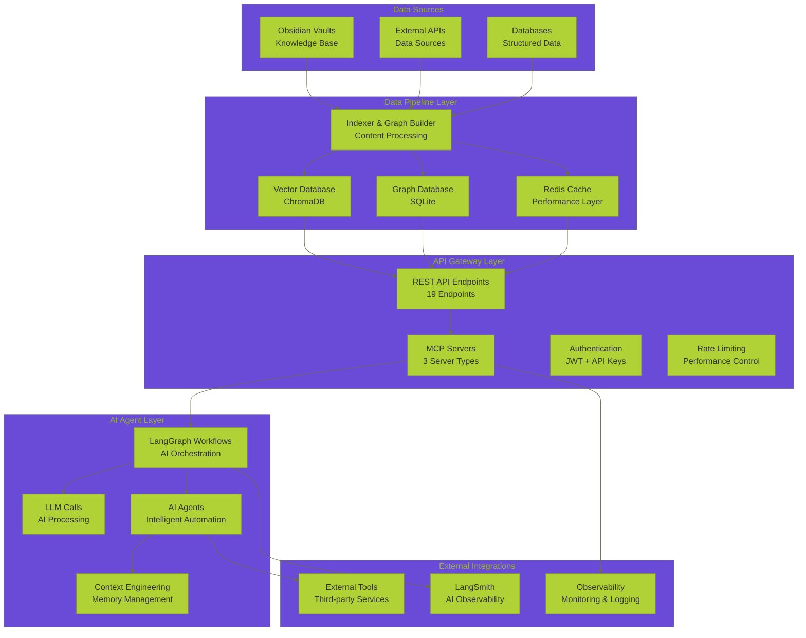
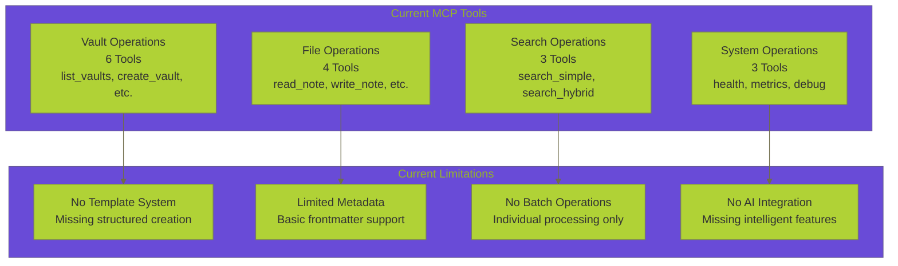
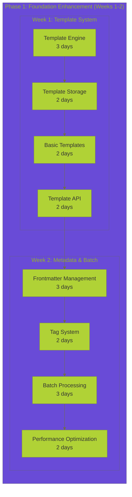
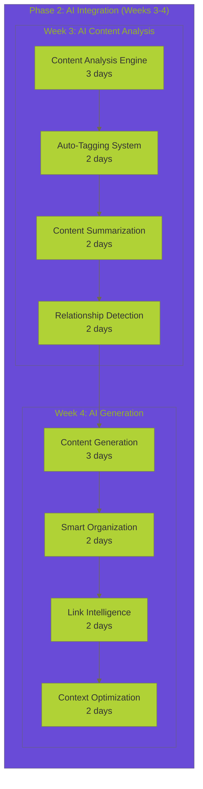
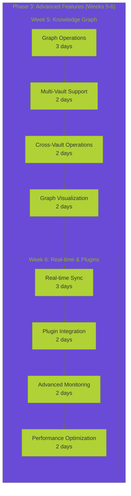
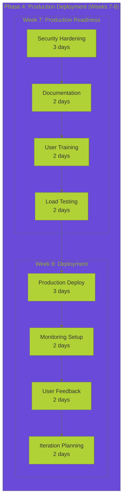
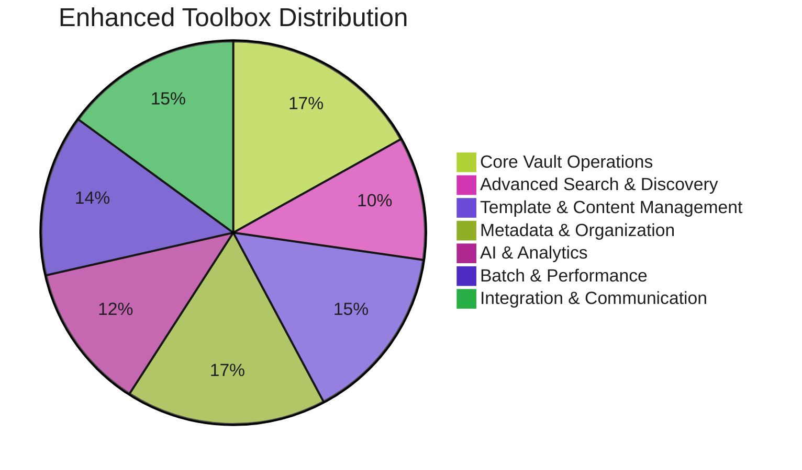
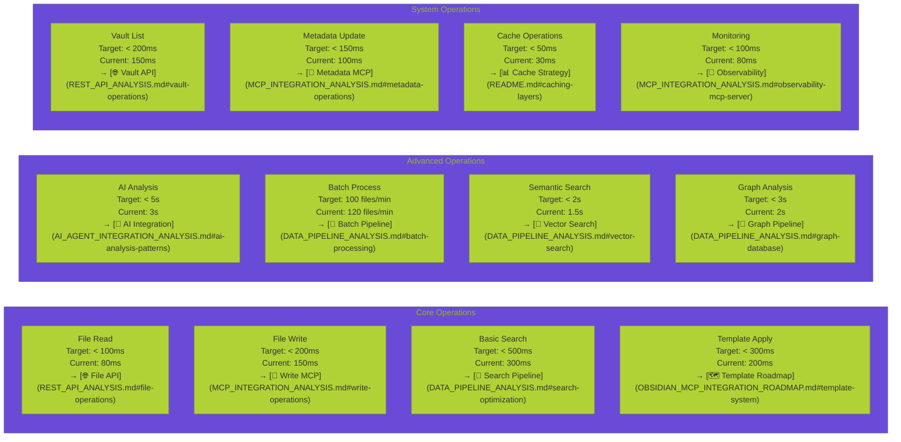

# 📋 **DATA OPERATIONS COMPREHENSIVE SUMMARY**

**Version:** 1.0.0
**Last Updated:** September 6, 2025
**Status:** ✅ **COMPREHENSIVE DATA OPERATIONS DOCUMENTATION**

---

## 🎯 **EXECUTIVE SUMMARY**

This document provides a comprehensive summary of the Data Vault Obsidian data operations system, including current capabilities, integration analysis, implementation roadmap, and enhanced toolbox specifications. The system represents a sophisticated platform for AI agentic engineering with seamless Obsidian vault integration.

> **🔗 Related Documentation:** [Data Operations Hub](README.md) | [REST API Analysis](REST_API_ANALYSIS.md) | [MCP Integration Analysis](MCP_INTEGRATION_ANALYSIS.md) | [Data Pipeline Analysis](DATA_PIPELINE_ANALYSIS.md) | [AI Agent Integration Analysis](AI_AGENT_INTEGRATION_ANALYSIS.md) | [Enhanced Toolbox Specification](ENHANCED_TOOLBOX_SPECIFICATION.md) | [Obsidian MCP Integration Analysis](OBSIDIAN_MCP_INTEGRATION_ANALYSIS.md) | [Obsidian MCP Integration Roadmap](OBSIDIAN_MCP_INTEGRATION_ROADMAP.md)

---

    ## 📊 **SYSTEM OVERVIEW**

### **Current Architecture**

### **Current Capabilities Matrix**

> **🔗 Related Analysis:** [📊 Performance Analysis](README.md#performance-optimization-strategies) | [🔧 MCP Integration Analysis](MCP_INTEGRATION_ANALYSIS.md#current-implementations) | [🛠️ Enhanced Toolbox Specification](ENHANCED_TOOLBOX_SPECIFICATION.md#tool-categories-breakdown)

| 🎯 Capability Category             | 📊 Current Level | 🎯 Target Level | 📈 Status   | ⚡ Priority | 🔗 Implementation                                                                |
| ---------------------------------- | ---------------- | --------------- | ----------- | ----------- | -------------------------------------------------------------------------------- |
| **📁 File Operations**       | 8/10             | 10/10           | ✅ Strong   | High        | [🌐 REST API Analysis](REST_API_ANALYSIS.md#vault-operations)                       |
| **🔍 Search & Discovery**    | 7/10             | 10/10           | 🟡 Good     | High        | [🔄 Data Pipeline Analysis](DATA_PIPELINE_ANALYSIS.md#search-optimization)          |
| **📝 Template System**       | 0/10             | 10/10           | ❌ Missing  | Critical    | [🗺️ Integration Roadmap](OBSIDIAN_MCP_INTEGRATION_ROADMAP.md#phase-1-foundation)  |
| **🏷️ Metadata Management** | 3/10             | 10/10           | 🟡 Basic    | High        | [🔧 MCP Integration Analysis](MCP_INTEGRATION_ANALYSIS.md#metadata-operations)      |
| **🤖 AI Integration**        | 2/10             | 10/10           | ❌ Limited  | Critical    | [🤖 AI Agent Integration](AI_AGENT_INTEGRATION_ANALYSIS.md#ai-integration-patterns) |
| **⚡ Batch Operations**      | 1/10             | 10/10           | ❌ Missing  | High        | [🛠️ Enhanced Toolbox](ENHANCED_TOOLBOX_SPECIFICATION.md#batch-performance-tools)  |
| **🚀 Performance**           | 6/10             | 10/10           | 🟡 Adequate | Medium      | [📊 Performance Dashboard](README.md#system-performance-dashboard)                  |
| **📊 Monitoring**            | 5/10             | 10/10           | 🟡 Basic    | Medium      | [🔧 Observability MCP](MCP_INTEGRATION_ANALYSIS.md#observability-mcp-server)        |

---

## 🔧 **CURRENT TOOLBOX INVENTORY**

> **🔗 Related Documentation:** [🛠️ Enhanced Toolbox Specification](ENHANCED_TOOLBOX_SPECIFICATION.md) | [🔧 MCP Integration Analysis](MCP_INTEGRATION_ANALYSIS.md) | [📊 Current Capabilities Matrix](#current-capabilities-matrix)

### **⚙️ Existing MCP Tools (16 Tools)**

### **API Endpoints (19 Endpoints)**

- **Vault Operations**: 6 endpoints (GET, PUT, PATCH, DELETE)
- **Search & Discovery**: 3 endpoints (POST /search/*)
- **MCP Integration**: 4 endpoints (POST /mcp/*)
- **Data Pipeline**: 3 endpoints (POST /index/*)
- **System Operations**: 3 endpoints (GET /health, /metrics, /debug)

---

## 🚀 **ENHANCED CAPABILITIES ROADMAP**

### **Phase 1: Foundation Enhancement (Weeks 1-2)**

**Key Deliverables:**

- Template system with 8+ template operations
- Advanced metadata management (7+ tools)
- Batch processing capabilities (6+ tools)
- Performance optimization framework

### **Phase 2: AI Integration (Weeks 3-4)**

**Key Deliverables:**

- AI content analysis (6+ tools)
- AI content generation (5+ tools)
- Smart organization capabilities
- Link intelligence and auto-generation

### **Phase 3: Advanced Features (Weeks 5-6)**

**Key Deliverables:**

- Knowledge graph operations (4+ tools)
- Multi-vault support
- Real-time synchronization
- Plugin integration framework

### **Phase 4: Production Deployment (Weeks 7-8)**

**Key Deliverables:**

- Production-ready security
- Comprehensive documentation
- Load testing and optimization
- Monitoring and alerting system

---

## 🛠️ **ENHANCED TOOLBOX SPECIFICATION**

### **Total Tool Count: 100+ Tools**

### **Tool Categories Breakdown**

> **🔗 Detailed Specifications:** [🛠️ Enhanced Toolbox Specification](ENHANCED_TOOLBOX_SPECIFICATION.md) | [🔧 MCP Integration Analysis](MCP_INTEGRATION_ANALYSIS.md) | [🌐 REST API Analysis](REST_API_ANALYSIS.md)

#### **1. 📁 Core Vault Operations (26 Tools)**

- **Vault Management**: 8 tools (create, delete, sync, export, import, validate) → [🌐 Vault API Endpoints](REST_API_ANALYSIS.md#vault-operations)
- **File Operations**: 12 tools (read, write, update, delete, copy, move, merge, split, compare, history) → [🔧 File MCP Tools](MCP_INTEGRATION_ANALYSIS.md#file-operations-mcp-tools)
- **Folder Operations**: 6 tools (create, rename, move, delete, list, organize) → [🔄 Data Pipeline Analysis](DATA_PIPELINE_ANALYSIS.md#file-processing-pipeline)

#### **2. 🔍 Advanced Search & Discovery (16 Tools)**

- **Text Search**: 4 tools (basic, advanced, similar, suggestions) → [🌐 Search API Endpoints](REST_API_ANALYSIS.md#search--discovery)
- **Semantic Search**: 3 tools (semantic, concepts, intent) → [🔄 Vector Search Pipeline](DATA_PIPELINE_ANALYSIS.md#vector-search-optimization)
- **Metadata Search**: 5 tools (tags, properties, frontmatter, date, type) → [🔧 Metadata MCP Tools](MCP_INTEGRATION_ANALYSIS.md#metadata-operations)
- **Graph Search**: 4 tools (relationships, connections, patterns, recommendations) → [🔄 Graph Database Pipeline](DATA_PIPELINE_ANALYSIS.md#graph-database-integration)

#### **3. 📝 Template & Content Management (23 Tools)**

- **Template Operations**: 8 tools (create, apply, list, update, delete, import, export, validate) → [🗺️ Template System Roadmap](OBSIDIAN_MCP_INTEGRATION_ROADMAP.md#template-system-implementation)
- **Content Analysis**: 6 tools (analyze, summarize, structure, quality, insights, patterns) → [🤖 AI Content Analysis](AI_AGENT_INTEGRATION_ANALYSIS.md#content-analysis-patterns)
- **Auto Generation**: 5 tools (content, templates, summaries, outlines, reports) → [🤖 AI Generation Tools](AI_AGENT_INTEGRATION_ANALYSIS.md#ai-generation-capabilities)
- **Structure Detection**: 4 tools (headings, sections, lists, tables) → [🔄 Content Processing Pipeline](DATA_PIPELINE_ANALYSIS.md#content-structure-detection)

#### **4. 🏷️ Metadata & Organization (26 Tools)**

- **Frontmatter Operations**: 7 tools (get, set, update, delete, merge, validate, transform) → [🔧 Frontmatter MCP Tools](MCP_INTEGRATION_ANALYSIS.md#frontmatter-operations)
- **Tag Operations**: 8 tools (add, remove, list, search, suggest, analyze, organize, merge) → [🔄 Tag Management Pipeline](DATA_PIPELINE_ANALYSIS.md#tag-processing-system)
- **Link Operations**: 6 tools (analyze, fix, generate, suggest, validate, update) → [🤖 Link Intelligence](AI_AGENT_INTEGRATION_ANALYSIS.md#link-intelligence-patterns)
- **Property Operations**: 5 tools (get, set, update, delete, search) → [🌐 Property API Endpoints](REST_API_ANALYSIS.md#metadata-operations)

#### **5. 🤖 AI & Analytics (19 Tools)**

- **AI Insights**: 6 tools (analyze, generate, organize, extract, suggest, detect) → [🤖 AI Agent Integration](AI_AGENT_INTEGRATION_ANALYSIS.md#ai-insights-generation)
- **Content Summary**: 4 tools (summarize, extract, condense, highlight) → [🤖 Content Summarization](AI_AGENT_INTEGRATION_ANALYSIS.md#content-summarization-patterns)
- **Relationship Analysis**: 5 tools (map, analyze, suggest, visualize, optimize) → [🔄 Graph Analysis Pipeline](DATA_PIPELINE_ANALYSIS.md#relationship-analysis)
- **Predictive Operations**: 4 tools (predict, forecast, recommend, optimize) → [🤖 Predictive Analytics](AI_AGENT_INTEGRATION_ANALYSIS.md#predictive-operations)

#### **6. ⚡ Batch & Performance (21 Tools)**

- **Batch Operations**: 6 tools (process, export, import, analyze, optimize, validate) → [🔄 Batch Processing Pipeline](DATA_PIPELINE_ANALYSIS.md#batch-processing-optimization)
- **Parallel Operations**: 4 tools (parallel_process, async_operations, concurrent_batch, distributed_processing) → [📊 Performance Optimization](README.md#performance-optimization-strategies)
- **Cache Management**: 5 tools (get, set, update, delete, optimize) → [📊 Caching Strategy](README.md#caching-layers)
- **Performance Monitoring**: 6 tools (metrics, alerts, profiling, optimization, reporting, analysis) → [🔧 Observability MCP](MCP_INTEGRATION_ANALYSIS.md#observability-mcp-server)

#### **7. 🔗 Integration & Communication (23 Tools)**

- **API Integration**: 8 tools (external_apis, webhooks, rest_clients, graphql, websockets, grpc, message_queues, event_streams) → [🌐 External API Integration](REST_API_ANALYSIS.md#external-integrations)
- **MCP Coordination**: 6 tools (tool_orchestration, workflow_management, error_handling, retry_logic, circuit_breaker, load_balancing) → [🔧 MCP Server Coordination](MCP_INTEGRATION_ANALYSIS.md#mcp-server-coordination)
- **Event Handling**: 5 tools (event_processing, event_routing, event_filtering, event_transformation, event_persistence) → [🔄 Event-Driven Pipeline](DATA_PIPELINE_ANALYSIS.md#event-processing-system)
- **Notification System**: 4 tools (alerts, notifications, messaging, escalation) → [📊 Monitoring &amp; Alerting](README.md#monitoring--observability)

---

## 📊 **PERFORMANCE SPECIFICATIONS**

### **Response Time Targets**

> **🔗 Performance Analysis:** [📊 Performance Dashboard](README.md#system-performance-dashboard) | [⚡ Performance Optimization](README.md#performance-optimization-strategies) | [🔧 Observability MCP](MCP_INTEGRATION_ANALYSIS.md#observability-mcp-server)

### **Throughput Specifications**

> **🔗 Performance Details:** [📊 Performance Metrics](README.md#performance-metrics) | [⚡ Load Testing](README.md#load-testing-strategies) | [🔧 MCP Performance](MCP_INTEGRATION_ANALYSIS.md#mcp-performance-characteristics)

- **File Operations**: 1000+ operations/minute → [🌐 File API Performance](REST_API_ANALYSIS.md#file-operations-performance)
- **Search Operations**: 500+ queries/minute → [🔄 Search Pipeline Performance](DATA_PIPELINE_ANALYSIS.md#search-performance-optimization)
- **Template Operations**: 200+ templates/minute → [🗺️ Template Performance](OBSIDIAN_MCP_INTEGRATION_ROADMAP.md#template-performance-targets)
- **AI Operations**: 50+ analyses/minute → [🤖 AI Performance](AI_AGENT_INTEGRATION_ANALYSIS.md#ai-performance-characteristics)
- **Batch Operations**: 100+ files/minute → [🔄 Batch Performance](DATA_PIPELINE_ANALYSIS.md#batch-processing-performance)

### **Resource Usage Limits**

> **🔗 Resource Management:** [📊 Resource Monitoring](README.md#resource-monitoring) | [⚡ Performance Tuning](README.md#performance-tuning-strategies) | [🔧 System Health](README.md#system-health-monitoring)

- **Memory Usage**: < 2GB per operation → [📊 Memory Optimization](README.md#memory-optimization-strategies)
- **CPU Usage**: < 80% during peak operations → [⚡ CPU Performance](README.md#cpu-performance-optimization)
- **Disk I/O**: < 100MB/s sustained → [🔄 I/O Optimization](DATA_PIPELINE_ANALYSIS.md#io-performance-optimization)
- **Network I/O**: < 10MB/s sustained → [🌐 Network Performance](REST_API_ANALYSIS.md#network-performance-characteristics)

---

## 🔗 **INTEGRATION OPPORTUNITIES**

### **External Obsidian MCP Implementations**

> **🔗 Integration Analysis:** [📝 Obsidian MCP Integration Analysis](OBSIDIAN_MCP_INTEGRATION_ANALYSIS.md) | [🗺️ Integration Roadmap](OBSIDIAN_MCP_INTEGRATION_ROADMAP.md) | [🔧 MCP Integration Patterns](MCP_INTEGRATION_ANALYSIS.md#integration-patterns)

Based on research of external implementations, we can integrate:

#### **From labeveryday/mcp-obsidian-enhanced:**

- **Template System**: Daily notes, meeting notes, structured templates → [🗺️ Template System Implementation](OBSIDIAN_MCP_INTEGRATION_ROADMAP.md#template-system-implementation)
- **Metadata Management**: Comprehensive frontmatter and tag operations → [🔧 Metadata Operations](MCP_INTEGRATION_ANALYSIS.md#metadata-operations)
- **Batch Operations**: Bulk file processing and operations → [🔄 Batch Processing Pipeline](DATA_PIPELINE_ANALYSIS.md#batch-processing-optimization)
- **AI-Powered Analysis**: Strategic insights and content analysis → [🤖 AI Analysis Integration](AI_AGENT_INTEGRATION_ANALYSIS.md#ai-analysis-patterns)

#### **From coddingtonbear/obsidian-local-rest-api:**

- **Vault Operations**: List, read, write files → [🌐 Vault API Endpoints](REST_API_ANALYSIS.md#vault-operations)
- **Search Capabilities**: Full-text search across notes → [🔄 Search Pipeline](DATA_PIPELINE_ANALYSIS.md#search-optimization)
- **Plugin Management**: Integration with Obsidian plugins → [🔧 Plugin Integration](MCP_INTEGRATION_ANALYSIS.md#plugin-integration-patterns)
- **Real-time Updates**: Live synchronization with Obsidian app → [🔄 Real-time Sync](DATA_PIPELINE_ANALYSIS.md#real-time-synchronization)

#### **From Community Implementations:**

- **Auto Backlink Generation**: Intelligent wikilink detection → [🤖 Link Intelligence](AI_AGENT_INTEGRATION_ANALYSIS.md#link-intelligence-patterns)
- **Precision Editing**: Advanced PATCH operations → [🌐 Advanced API Operations](REST_API_ANALYSIS.md#advanced-operations)
- **Context Optimization**: Smart content summarization → [🤖 Context Engineering](AI_AGENT_INTEGRATION_ANALYSIS.md#context-engineering-patterns)
- **Knowledge Graph Operations**: Link analysis and relationship mapping → [🔄 Graph Database Operations](DATA_PIPELINE_ANALYSIS.md#graph-database-integration)

---

## 📈 **SUCCESS METRICS & MONITORING**

### **Performance Metrics**

> **🔗 Performance Monitoring:** [📊 Performance Dashboard](README.md#system-performance-dashboard) | [🔧 Observability MCP](MCP_INTEGRATION_ANALYSIS.md#observability-mcp-server) | [📈 Performance Analysis](README.md#performance-analysis)

- **API Response Time**: < 200ms average → [🌐 API Performance](REST_API_ANALYSIS.md#api-performance-characteristics)
- **Search Latency**: < 1s for complex queries → [🔄 Search Performance](DATA_PIPELINE_ANALYSIS.md#search-performance-optimization)
- **Template Rendering**: < 100ms per template → [🗺️ Template Performance](OBSIDIAN_MCP_INTEGRATION_ROADMAP.md#template-performance-targets)
- **AI Analysis**: < 5s per analysis → [🤖 AI Performance](AI_AGENT_INTEGRATION_ANALYSIS.md#ai-performance-characteristics)
- **Batch Processing**: 100+ files per minute → [🔄 Batch Performance](DATA_PIPELINE_ANALYSIS.md#batch-processing-performance)

### **Quality Metrics**

> **🔗 Quality Assurance:** [📊 Quality Monitoring](README.md#quality-metrics) | [🔧 Error Tracking](MCP_INTEGRATION_ANALYSIS.md#error-handling-patterns) | [📈 Data Quality](README.md#data-quality-metrics)

- **Success Rate**: > 99% for all operations → [🌐 API Success Rates](REST_API_ANALYSIS.md#api-success-metrics)
- **Cache Hit Rate**: > 85% for all cache types → [📊 Cache Performance](README.md#cache-performance-metrics)
- **Error Rate**: < 1% for all operations → [🔧 Error Analysis](MCP_INTEGRATION_ANALYSIS.md#error-analysis-patterns)
- **Data Integrity**: 100% data consistency → [🔄 Data Pipeline Quality](DATA_PIPELINE_ANALYSIS.md#data-quality-assurance)

### **Usage Metrics**

> **🔗 Usage Analytics:** [📊 User Analytics](README.md#user-analytics) | [🤖 AI Adoption](AI_AGENT_INTEGRATION_ANALYSIS.md#ai-adoption-metrics) | [📈 Feature Usage](README.md#feature-usage-metrics)

- **Daily Active Users**: 100+ users → [📊 User Engagement](README.md#user-engagement-metrics)
- **Template Usage**: 50+ templates per day → [🗺️ Template Adoption](OBSIDIAN_MCP_INTEGRATION_ROADMAP.md#template-adoption-metrics)
- **AI Feature Adoption**: 60% of users → [🤖 AI Feature Usage](AI_AGENT_INTEGRATION_ANALYSIS.md#ai-feature-adoption)
- **User Satisfaction**: > 4.5/5 rating → [📊 User Satisfaction](README.md#user-satisfaction-metrics)

---

## 🎯 **IMPLEMENTATION PRIORITIES**

### **Critical Priority (Weeks 1-2)**

> **🔗 Critical Implementation:** [🗺️ Phase 1 Roadmap](OBSIDIAN_MCP_INTEGRATION_ROADMAP.md#phase-1-foundation) | [🛠️ Template System](ENHANCED_TOOLBOX_SPECIFICATION.md#template-content-management) | [🔧 Metadata Operations](MCP_INTEGRATION_ANALYSIS.md#metadata-operations)

1. **Template System** - Foundation for structured content creation → [🗺️ Template Implementation](OBSIDIAN_MCP_INTEGRATION_ROADMAP.md#template-system-implementation)
2. **Metadata Management** - Essential for content organization → [🔧 Metadata MCP Tools](MCP_INTEGRATION_ANALYSIS.md#metadata-operations)
3. **Batch Operations** - Required for performance and scalability → [🔄 Batch Processing Pipeline](DATA_PIPELINE_ANALYSIS.md#batch-processing-optimization)

### **High Priority (Weeks 3-4)**

> **🔗 High Priority Implementation:** [🗺️ Phase 2 Roadmap](OBSIDIAN_MCP_INTEGRATION_ROADMAP.md#phase-2-ai-integration) | [🤖 AI Integration](AI_AGENT_INTEGRATION_ANALYSIS.md#ai-integration-patterns) | [🔍 Search Enhancement](DATA_PIPELINE_ANALYSIS.md#search-optimization)

1. **AI Integration** - Core differentiator and value proposition → [🤖 AI Agent Integration](AI_AGENT_INTEGRATION_ANALYSIS.md#ai-integration-patterns)
2. **Advanced Search** - Enhanced discovery capabilities → [🔄 Search Pipeline](DATA_PIPELINE_ANALYSIS.md#search-optimization)
3. **Performance Optimization** - System reliability and speed → [📊 Performance Optimization](README.md#performance-optimization-strategies)

### **Medium Priority (Weeks 5-6)**

> **🔗 Medium Priority Implementation:** [🗺️ Phase 3 Roadmap](OBSIDIAN_MCP_INTEGRATION_ROADMAP.md#phase-3-advanced-features) | [🔄 Graph Operations](DATA_PIPELINE_ANALYSIS.md#graph-database-integration) | [🔄 Real-time Sync](DATA_PIPELINE_ANALYSIS.md#real-time-synchronization)

1. **Knowledge Graph Operations** - Advanced content relationships → [🔄 Graph Database Operations](DATA_PIPELINE_ANALYSIS.md#graph-database-integration)
2. **Multi-Vault Support** - Scalability and enterprise features → [🗺️ Multi-Vault Implementation](OBSIDIAN_MCP_INTEGRATION_ROADMAP.md#multi-vault-support)
3. **Real-time Synchronization** - Live updates and collaboration → [🔄 Real-time Sync](DATA_PIPELINE_ANALYSIS.md#real-time-synchronization)

### **Low Priority (Weeks 7-8)**

> **🔗 Low Priority Implementation:** [🗺️ Phase 4 Roadmap](OBSIDIAN_MCP_INTEGRATION_ROADMAP.md#phase-4-production-deployment) | [🔧 Plugin Integration](MCP_INTEGRATION_ANALYSIS.md#plugin-integration-patterns) | [📊 Advanced Monitoring](README.md#monitoring--observability)

1. **Plugin Integration** - Extended functionality → [🔧 Plugin Integration](MCP_INTEGRATION_ANALYSIS.md#plugin-integration-patterns)
2. **Advanced Monitoring** - Operational excellence → [📊 Advanced Monitoring](README.md#monitoring--observability)
3. **Documentation** - User adoption and support → [📚 Documentation Hub](README.md#comprehensive-navigation-index)

---

## 🔗 **RELATED DOCUMENTATION**

### **Core Documentation**

- **🌐 [Data Operations Hub](README.md)** - Main data operations documentation
- **📊 [Comprehensive Visual Analysis](README.md#comprehensive-visual-analysis)** - Visual system analysis
- **🔧 [Current Toolbox Inventory](README.md#current-toolbox-inventory)** - Existing capabilities

### **Integration Analysis**

- **🔍 [Obsidian MCP Integration Analysis](OBSIDIAN_MCP_INTEGRATION_ANALYSIS.md)** - Technical analysis and capabilities
- **🗺️ [Obsidian MCP Integration Roadmap](OBSIDIAN_MCP_INTEGRATION_ROADMAP.md)** - Detailed implementation roadmap
- **🛠️ [Enhanced Toolbox Specification](ENHANCED_TOOLBOX_SPECIFICATION.md)** - Comprehensive tool specifications

### **Supporting Documentation**

- **🔌 [MCP Documentation Hub](../mcp/README.md)** - Complete MCP documentation
- **📊 [API Design Patterns](../architecture/API_DESIGN_PATTERNS.md)** - API design guidelines
- **🤖 [AI Agent Integration](AI_AGENT_INTEGRATION_ANALYSIS.md)** - AI integration analysis

---

## 🚀 **NEXT STEPS**

### **Immediate Actions (Week 1)**

1. **Review and Approve Roadmap** - Stakeholder sign-off on implementation plan
2. **Set Up Development Environment** - Prepare development infrastructure
3. **Begin Template System Development** - Start Phase 1 implementation
4. **Establish Monitoring Framework** - Set up performance tracking

### **Short-term Goals (Weeks 2-4)**

1. **Complete Foundation Enhancement** - Template and metadata systems
2. **Implement AI Integration** - Content analysis and generation
3. **Establish Performance Baselines** - Measure and optimize performance
4. **Begin User Testing** - Early feedback and validation

### **Long-term Vision (Weeks 5-8)**

1. **Deploy Advanced Features** - Knowledge graph and multi-vault support
2. **Achieve Production Readiness** - Security, monitoring, and documentation
3. **Enable AI Agentic Engineering** - Full symbiotic integration
4. **Establish Operational Excellence** - Monitoring, alerting, and optimization

---

**This comprehensive summary provides the complete picture of our Data Vault Obsidian data operations system, from current state through enhanced capabilities to full implementation roadmap. The system represents a sophisticated platform for AI agentic engineering with seamless Obsidian vault integration.**
