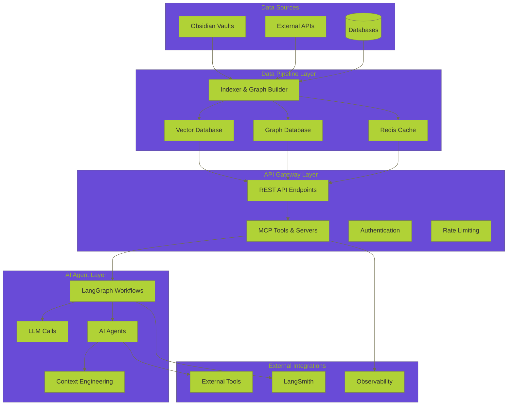
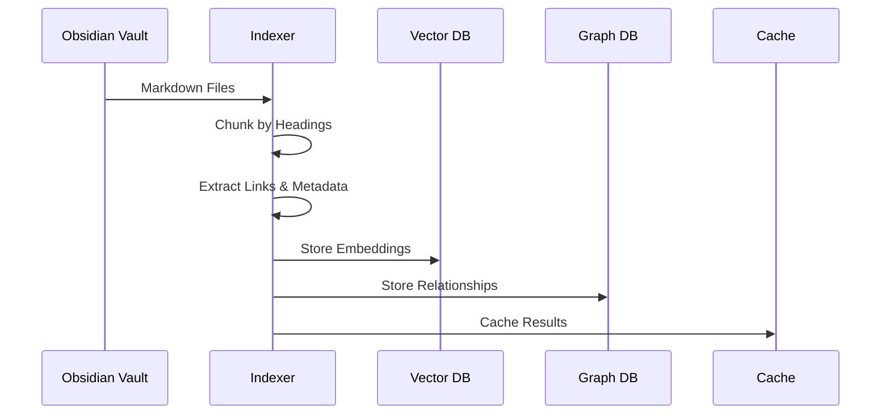
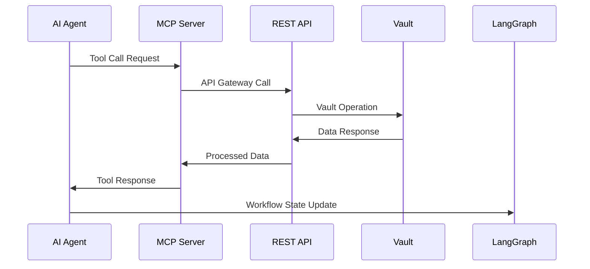
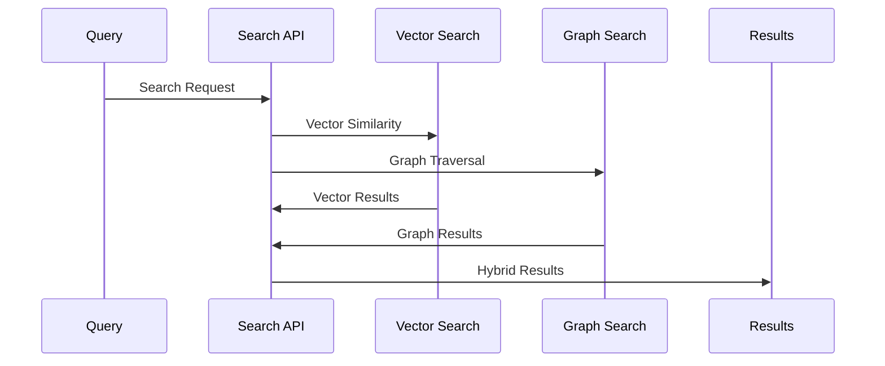

# 🗄️ **DATA OPERATIONS COMPREHENSIVE INDEX**

**Version:** 3.0.0  
**Last Updated:** September 6, 2025  
**Status:** ✅ **PRODUCTION-READY DATA OPERATIONS INDEX**

---

## 🎯 **OVERVIEW**

This comprehensive index provides a complete overview of all data operations documentation in the Data Vault Obsidian platform, including REST APIs, MCP integrations, data pipelines, and AI agent workflows.

> **🔗 Quick Navigation:** [Data Operations Hub](README.md) | [REST API Analysis](REST_API_ANALYSIS.md) | [MCP Integration Analysis](MCP_INTEGRATION_ANALYSIS.md) | [Data Pipeline Analysis](DATA_PIPELINE_ANALYSIS.md) | [AI Agent Integration Analysis](AI_AGENT_INTEGRATION_ANALYSIS.md) | [Enhanced Toolbox Specification](ENHANCED_TOOLBOX_SPECIFICATION.md)

---

## 📚 **DOCUMENTATION STRUCTURE**

### **1. Core Data Operations Hub**
- **📋 [Data Operations README](README.md)** - Main hub for all data operations documentation
- **📊 [REST API Analysis](REST_API_ANALYSIS.md)** - Comprehensive REST API analysis and optimization
- **🔌 [MCP Integration Analysis](MCP_INTEGRATION_ANALYSIS.md)** - MCP tools and server integration analysis
- **🔄 [Data Pipeline Analysis](DATA_PIPELINE_ANALYSIS.md)** - Data processing and indexing pipeline analysis
- **🤖 [AI Agent Integration Analysis](AI_AGENT_INTEGRATION_ANALYSIS.md)** - AI agent workflows and context engineering

---

## 🏗️ **SYSTEM ARCHITECTURE OVERVIEW**

### **1. Data Flow Architecture**



---

## 🔧 **CURRENT TOOLBOX INVENTORY**

### **1. Obsidian Vault Data Operations**

#### **Read Operations**
- **`list_vaults()`** - List all available Obsidian vaults
- **`list_files(vault, recursive, filter)`** - List files in vault with filtering
- **`read_note(vault, path)`** - Read specific note content with hash validation
- **`get_daily_note(vault, date)`** - Get or create daily notes
- **`search_simple(query)`** - Simple text search across notes
- **`search_hybrid(query, k, filters)`** - Hybrid vector + graph search

#### **Write Operations**
- **`upsert_note(vault, path, content, dry_run, if_match, mode)`** - Create/update notes
- **`patch_note(vault, path, patch_ops)`** - Patch note content with operations
- **`delete_note(vault, path)`** - Delete notes from vault
- **`approve_operation(tool_call_id, approved_by)`** - Human approval workflow

#### **Data Pipeline Operations**
- **`index_vault()`** - Index entire vault for search
- **`chunk_markdown(content, path)`** - Chunk content by headings
- **`compute_embedding(text)`** - Generate vector embeddings
- **`update_graph_links(source_node_id, links)`** - Update graph relationships

---

## 🔌 **MCP TOOLS & SERVERS**

### **1. Obsidian MCP Server**
- **`obsidian_list_files`** - List files via MCP protocol
- **`obsidian_read_note`** - Read notes via MCP protocol
- **`obsidian_put_file`** - Create/update files via MCP protocol
- **`obsidian_patch_file`** - Patch files via MCP protocol

### **2. Observability MCP Server**
- **`create_trace_event`** - Create trace events for debugging
- **`create_checkpoint`** - Create state checkpoints
- **`get_traces`** - Retrieve trace data
- **`get_checkpoints`** - Retrieve checkpoint data
- **`time_travel_debug`** - Time-travel debugging capabilities
- **`get_performance_metrics`** - Performance monitoring
- **`export_traces_to_langsmith`** - LangSmith integration
- **`analyze_error_patterns`** - Error analysis
- **`get_agent_communication_log`** - Agent communication logs

### **3. Enhanced MCP Server**
- **Advanced caching** - Multi-level caching strategies
- **Batch operations** - Bulk data operations
- **Multi-agent communication** - Agent coordination
- **Performance optimization** - Optimized data access

---

## 🌐 **REST API ENDPOINTS**

### **Core Vault Operations**
```
GET    /vaults                           # List all vaults
GET    /vault/{vault}/files              # List files in vault
GET    /vault/{vault}/file/{path}        # Read specific note
PUT    /vault/{vault}/file/{path}        # Create/update note
PATCH  /vault/{vault}/file/{path}        # Patch note content
DELETE /vault/{vault}/file/{path}        # Delete note
```

### **Search & Discovery**
```
POST   /search/simple                    # Simple text search
POST   /search/hybrid                    # Hybrid vector + graph search
GET    /periodic/daily/{vault}           # Daily notes
```

### **MCP Integration**
```
GET    /mcp/tools                        # List MCP tools
POST   /mcp/tools/execute                # Execute MCP tool
POST   /mcp/batch                        # Batch MCP operations
GET    /mcp/debug                        # Debug MCP servers
```

### **Data Pipeline**
```
POST   /index/vault                      # Index vault for search
GET    /index/status                     # Indexing status
POST   /index/rebuild                    # Rebuild indexes
```

### **System Operations**
```
GET    /health                           # Health check
GET    /metrics                          # System metrics
GET    /debug                            # Debug information
```

---

## 🔄 **DATA FLOW PATTERNS**

### **1. Data Ingestion Flow**


### **2. AI Agent Data Flow**


### **3. Search & Retrieval Flow**


---

## 📊 **PERFORMANCE CHARACTERISTICS**

### **1. API Performance**
- **Response Time**: 50-200ms for simple operations
- **Throughput**: ~100 requests/second
- **Memory Usage**: Low (stateless operations)
- **Error Rate**: <1% for valid requests

### **2. MCP Tool Performance**
- **Tool Execution Time**: 100-500ms per tool call
- **Concurrent Requests**: Up to 50 simultaneous requests
- **Error Rate**: <2% for valid operations
- **Memory Usage**: ~50MB per server instance

### **3. Data Pipeline Performance**
- **Full Vault Indexing**: 5-30 minutes depending on size
- **Incremental Updates**: 10-60 seconds
- **Search Latency**: 100-2000ms depending on complexity
- **Memory Usage**: High during indexing

### **4. AI Agent Performance**
- **Workflow Execution**: 1-10 seconds per workflow
- **Context Building**: 200-1000ms
- **Tool Execution**: 100-500ms per tool
- **Memory Persistence**: 7 days TTL

---

## 🚀 **OPTIMIZATION STRATEGIES**

### **1. Caching Layers**
- **Redis Cache** - Fast data access
- **Vector Cache** - Embedding caching
- **Graph Cache** - Relationship caching
- **API Response Cache** - Endpoint caching

### **2. Data Pipeline Optimization**
- **Async Processing** - Non-blocking operations
- **Batch Operations** - Bulk data processing
- **Incremental Indexing** - Only update changed files
- **Parallel Processing** - Multi-threaded operations

### **3. API Performance**
- **Connection Pooling** - Reuse HTTP connections
- **Rate Limiting** - Prevent overload
- **Response Compression** - Reduce bandwidth
- **Pagination** - Handle large datasets

---

## 🔒 **SECURITY & PRIVACY**

### **1. Authentication & Authorization**
- **JWT Authentication** - Token-based authentication
- **API Key Authentication** - External service authentication
- **Role-Based Access Control** - Permission management
- **Tool-Level Security** - MCP tool authentication

### **2. Data Privacy**
- **Input Validation** - Comprehensive validation
- **SQL Injection Prevention** - Parameterized queries
- **Data Anonymization** - PII protection
- **Encryption** - Data encryption at rest and in transit

---

## 📈 **MONITORING & OBSERVABILITY**

### **1. Performance Metrics**
- **API Response Times** - Endpoint performance
- **Cache Hit Rates** - Caching effectiveness
- **Indexing Performance** - Data pipeline speed
- **Search Latency** - Query response times

### **2. Error Tracking**
- **API Errors** - Failed requests
- **MCP Tool Errors** - Tool execution failures
- **Data Pipeline Errors** - Indexing issues
- **Agent Communication Errors** - Workflow failures

### **3. LangSmith Integration**
- **Trace Export** - Send traces to LangSmith
- **Performance Analysis** - Detailed metrics
- **Error Pattern Analysis** - Identify issues
- **Agent Communication Logs** - Track interactions

---

## 🔗 **RELATED DOCUMENTATION**

### **Core Architecture Patterns**
- **🌐 [API Design Patterns](../architecture/API_DESIGN_PATTERNS.md)** - RESTful APIs, authentication, rate limiting
- **🗄️ [Database Patterns](../architecture/DATABASE_PATTERNS.md)** - Data persistence, transactions, migrations
- **🚀 [Caching Patterns](../architecture/CACHING_PATTERNS.md)** - Multi-level caching, invalidation strategies
- **⚡ [Async Patterns](../architecture/ASYNC_PATTERNS.md)** - Asynchronous programming, concurrency

### **Integration & Communication**
- **🔗 [Integration Patterns](../architecture/INTEGRATION_PATTERNS.md)** - Data pipeline, vector database, graph database, API gateway integration
- **📡 [Communication Patterns](../architecture/COMMUNICATION_PATTERNS.md)** - Request-response, pub-sub, message queues, API gateway
- **🔄 [Event-Driven Patterns](../architecture/EVENT_DRIVEN_PATTERNS.md)** - Event sourcing, CQRS, event streaming, choreography

### **AI/ML Integration**
- **🕸️ [LangGraph Workflow Patterns](../architecture/LANGGRAPH_WORKFLOW_PATTERNS.md)** - AI workflow orchestration, agent management, state handling
- **🔗 [Obsidian Integration Patterns](../architecture/OBSIDIAN_INTEGRATION_PATTERNS.md)** - Knowledge management, content automation, plugin integration
- **📊 [Monitoring Observability Patterns](../architecture/MONITORING_OBSERVABILITY_PATTERNS.md)** - Metrics collection, logging, tracing, alerting

### **MCP Documentation**
- **🔌 [MCP Documentation Hub](../mcp/README.md)** - Complete MCP documentation and integration guides
- **🔧 [MCP Integration Patterns](../mcp/patterns/MCP_INTEGRATION_PATTERNS.md)** - MCP server patterns and best practices
- **📈 [MCP Development Roadmap](../mcp/roadmaps/MCP_DEVELOPMENT_ROADMAP.md)** - Future MCP enhancements

---

## 🎯 **IMPLEMENTATION ROADMAP**

### **Phase 1: Current State Optimization (Weeks 1-2)**
- [ ] **Performance Analysis** - Complete performance audit
- [ ] **Cache Optimization** - Improve caching strategies
- [ ] **API Rate Limiting** - Implement proper rate limiting
- [ ] **Error Handling** - Enhance error handling

### **Phase 2: Enhanced Integrations (Weeks 3-4)**
- [ ] **External LLM APIs** - Add OpenAI, Anthropic integration
- [ ] **Advanced MCP Tools** - Weather, dataset analysis tools
- [ ] **Real-time Sync** - Live vault updates
- [ ] **Conflict Resolution** - Handle concurrent edits

### **Phase 3: AI Agent Enhancement (Weeks 5-6)**
- [ ] **Context Engineering** - Advanced context management
- [ ] **Agent Coordination** - Multi-agent workflows
- [ ] **Workflow Optimization** - LangGraph performance
- [ ] **Memory Management** - Persistent agent memory

### **Phase 4: Production Deployment (Weeks 7-8)**
- [ ] **Production Monitoring** - Comprehensive observability
- [ ] **Performance Tuning** - Optimize for production load
- [ ] **Security Hardening** - Production security measures
- [ ] **Documentation** - Complete operational documentation

---

## 📊 **SUCCESS METRICS**

### **1. Performance Metrics**
- **API Response Time**: <200ms average
- **Search Latency**: <1s for complex queries
- **Indexing Speed**: <30 minutes for full vault
- **Cache Hit Rate**: >80% for frequently accessed data

### **2. Reliability Metrics**
- **API Uptime**: >99.9%
- **Error Rate**: <1% for valid requests
- **Data Consistency**: 100% for critical operations
- **Recovery Time**: <5 minutes for failures

### **3. User Experience Metrics**
- **Query Success Rate**: >95%
- **Tool Execution Success**: >98%
- **Agent Response Time**: <5 seconds
- **Context Quality Score**: >0.8

---

## 🔧 **TROUBLESHOOTING GUIDE**

### **1. Common Issues**

#### **API Performance Issues**
- **High Response Times**: Check cache hit rates, database performance
- **Rate Limiting**: Implement proper rate limiting, increase limits
- **Memory Usage**: Optimize queries, implement pagination

#### **MCP Tool Issues**
- **Tool Execution Failures**: Check tool configuration, validate parameters
- **Connection Timeouts**: Increase timeout values, check network connectivity
- **Authentication Errors**: Verify API keys, check permissions

#### **Data Pipeline Issues**
- **Indexing Failures**: Check file permissions, validate markdown content
- **Search Quality**: Tune embedding models, adjust search parameters
- **Memory Usage**: Implement incremental indexing, optimize chunking

### **2. Debugging Tools**
- **API Debug Endpoint**: `/debug` - System debug information
- **MCP Debug Endpoint**: `/mcp/debug` - MCP server status
- **Health Check**: `/health` - System health status
- **Metrics Endpoint**: `/metrics` - Performance metrics

---

## 📞 **SUPPORT & MAINTENANCE**

### **1. Monitoring Tools**
- **Prometheus** - Metrics collection
- **Grafana** - Monitoring dashboards
- **LangSmith** - AI workflow tracing
- **Redis** - Cache monitoring

### **2. Maintenance Procedures**
- **Daily**: Check system health, review error logs
- **Weekly**: Performance analysis, cache optimization
- **Monthly**: Security audit, capacity planning
- **Quarterly**: Architecture review, technology updates

---

**Last Updated:** September 6, 2025  
**Data Operations Index Version:** 3.0.0  
**Status:** ✅ **PRODUCTION-READY DATA OPERATIONS INDEX**

**🗄️ DATA OPERATIONS COMPREHENSIVE INDEX COMPLETE! 🗄️**
