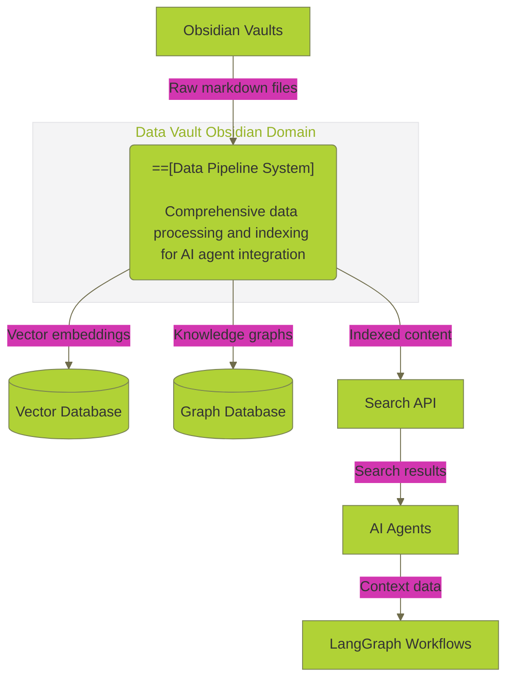
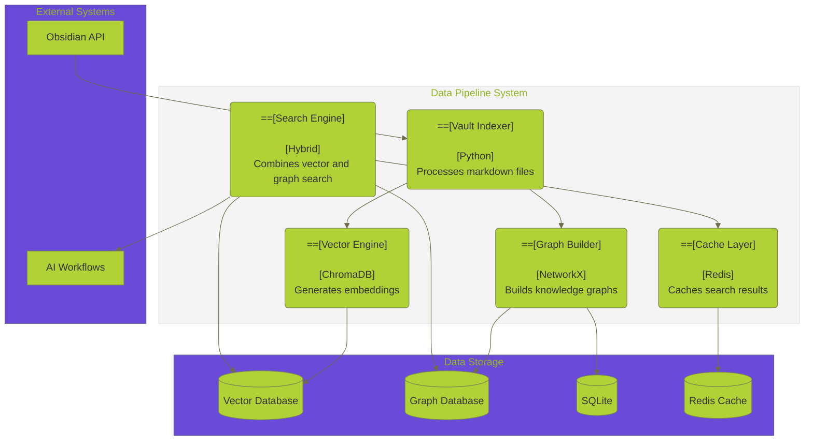
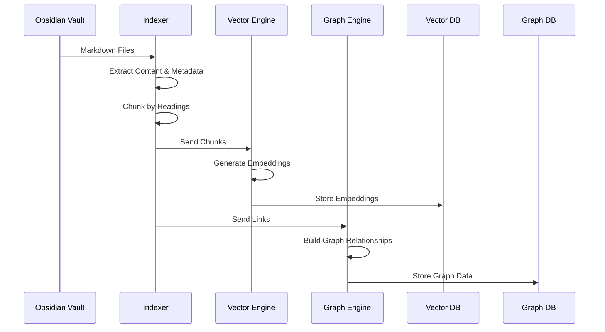
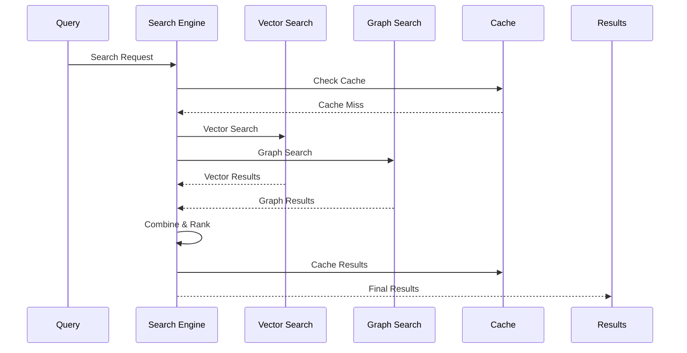
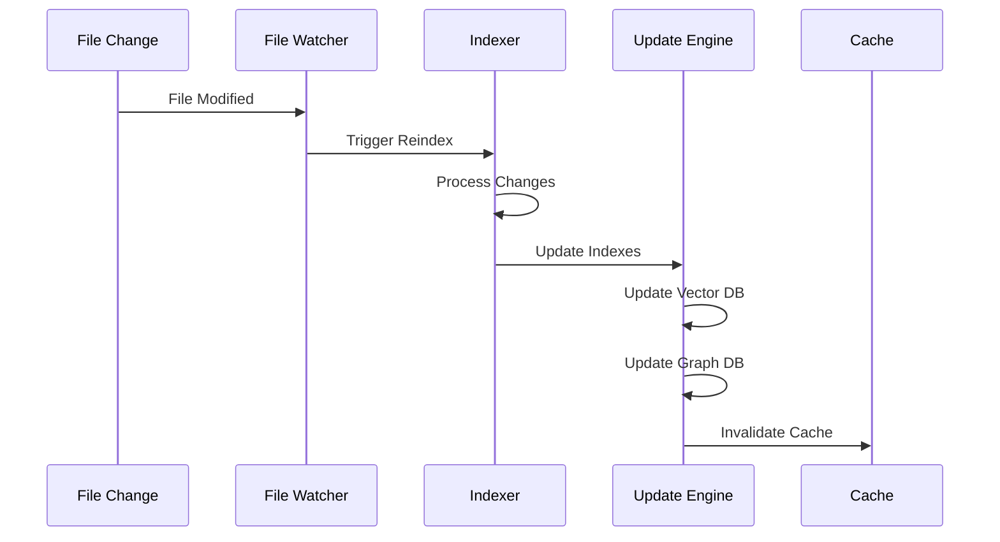

# 🔄 **DATA PIPELINE COMPREHENSIVE ANALYSIS**

**Version:** 3.0.0  
**Last Updated:** September 6, 2025  
**Status:** ✅ **PRODUCTION-READY PIPELINE ANALYSIS**

---

## 🎯 **OVERVIEW**

This document provides a comprehensive analysis of the data pipeline operations in the Data Vault Obsidian platform, including indexing, search, and data flow patterns that enable seamless integration between Obsidian vaults and AI agents.

> **🔗 Related Documentation:** [Data Operations Hub](README.md) | [REST API Analysis](REST_API_ANALYSIS.md) | [MCP Integration Analysis](MCP_INTEGRATION_ANALYSIS.md) | [AI Agent Integration Analysis](AI_AGENT_INTEGRATION_ANALYSIS.md) | [Enhanced Toolbox Specification](ENHANCED_TOOLBOX_SPECIFICATION.md)

---

## 🏗️ **DATA PIPELINE ARCHITECTURE**

> **🔗 Pipeline Integration:** [MCP Integration Analysis](MCP_INTEGRATION_ANALYSIS.md#mcp-architecture-overview) | [AI Agent Integration Analysis](AI_AGENT_INTEGRATION_ANALYSIS.md#ai-agent-architecture) | [Enhanced Toolbox Specification](ENHANCED_TOOLBOX_SPECIFICATION.md#toolbox-architecture-overview)

### **1. System Context Diagram**



### **2. Container Diagram**



---

## 🔧 **CURRENT PIPELINE IMPLEMENTATIONS**

### **1. Vault Indexer**

#### **Core Functionality**
```python
# Vault Indexer Implementation
class ObsidianVaultIndexer:
    def __init__(self, vault_path: str, vector_db_path: str, graph_db_path: str):
        self.vault_path = Path(vault_path)
        self.vector_db_path = vector_db_path
        self.graph_db_path = graph_db_path
        
        # Initialize vector database
        self.chroma_client = chromadb.PersistentClient(
            path=vector_db_path,
            settings=Settings(anonymized_telemetry=False, allow_reset=True)
        )
        self.collection = self.chroma_client.get_or_create_collection(
            name="obsidian_notes",
            metadata={"description": "Obsidian vault notes and chunks"}
        )
        
        # Initialize embedding model
        self.embedding_model = SentenceTransformer('all-MiniLM-L6-v2')
        
        # Initialize graph database
        self.graph = nx.DiGraph()
        self.init_graph_db()
```

#### **Indexing Process**
```python
async def index_vault(self) -> Dict[str, Any]:
    """Index entire vault"""
    logger.info("starting_vault_indexing", vault_path=str(self.vault_path))
    
    # Find all markdown files
    md_files = list(self.vault_path.rglob("*.md"))
    
    results = {
        "total_files": len(md_files),
        "indexed_files": 0,
        "errors": 0,
        "total_chunks": 0,
        "total_links": 0
    }
    
    for file_path in md_files:
        result = await self.index_file(file_path)
        
        if "error" in result:
            results["errors"] += 1
        else:
            results["indexed_files"] += 1
            results["total_chunks"] += result.get("chunks", 0)
            results["total_links"] += result.get("links", 0)
    
    return results
```

#### **File Processing**
```python
async def index_file(self, file_path: Path) -> Dict[str, Any]:
    """Index a single markdown file"""
    try:
        # Read file content
        with open(file_path, 'r', encoding='utf-8') as f:
            content = f.read()
        
        # Get relative path
        rel_path = file_path.relative_to(self.vault_path)
        
        # Extract metadata
        metadata = self._extract_metadata(content, rel_path)
        
        # Chunk content by headings
        chunks = self._chunk_by_headings(content, str(rel_path))
        
        # Process each chunk
        chunk_ids = []
        for i, chunk in enumerate(chunks):
            chunk_id = f"{rel_path}::{chunk['heading']}"
            chunk_ids.append(chunk_id)
            
            # Generate embedding
            embedding = self.embedding_model.encode(chunk['content'])
            
            # Store in vector database
            self.collection.add(
                ids=[chunk_id],
                documents=[chunk['content']],
                embeddings=[embedding.tolist()],
                metadatas=[{
                    "path": str(rel_path),
                    "heading": chunk['heading'],
                    "chunk_index": i,
                    "file_size": len(content)
                }]
            )
        
        # Extract and store links
        links = self._extract_links(content)
        self._update_graph_links(str(rel_path), links)
        
        return {
            "chunks": len(chunks),
            "links": len(links),
            "file_size": len(content)
        }
        
    except Exception as e:
        logger.error("file_indexing_error", file_path=str(file_path), error=str(e))
        return {"error": str(e)}
```

### **2. Vector Database Engine**

#### **ChromaDB Integration**
```python
# Vector Database Engine
class VectorDatabaseEngine:
    def __init__(self, collection_name: str = "obsidian_notes"):
        self.chroma_client = chromadb.PersistentClient()
        self.collection = self.chroma_client.get_or_create_collection(
            name=collection_name,
            metadata={"description": "Obsidian vault vector embeddings"}
        )
        self.embedding_model = SentenceTransformer('all-MiniLM-L6-v2')
    
    def search_similar(self, query: str, n_results: int = 10, 
                      filters: Dict[str, Any] = None) -> List[Dict[str, Any]]:
        """Search for similar content using vector similarity"""
        # Generate query embedding
        query_embedding = self.embedding_model.encode(query)
        
        # Search in vector database
        results = self.collection.query(
            query_embeddings=[query_embedding.tolist()],
            n_results=n_results,
            where=filters
        )
        
        # Format results
        formatted_results = []
        for i in range(len(results['ids'][0])):
            formatted_results.append({
                "id": results['ids'][0][i],
                "content": results['documents'][0][i],
                "metadata": results['metadatas'][0][i],
                "distance": results['distances'][0][i]
            })
        
        return formatted_results
```

#### **Embedding Management**
```python
# Embedding Management
class EmbeddingManager:
    def __init__(self, model_name: str = 'all-MiniLM-L6-v2'):
        self.model = SentenceTransformer(model_name)
        self.embedding_cache = {}
        self.cache_ttl = 3600  # 1 hour
    
    def generate_embedding(self, text: str, use_cache: bool = True) -> List[float]:
        """Generate embedding for text with optional caching"""
        if use_cache:
            cache_key = hashlib.md5(text.encode()).hexdigest()
            if cache_key in self.embedding_cache:
                return self.embedding_cache[cache_key]
        
        # Generate embedding
        embedding = self.model.encode(text).tolist()
        
        # Cache if enabled
        if use_cache:
            self.embedding_cache[cache_key] = embedding
        
        return embedding
    
    def batch_generate_embeddings(self, texts: List[str]) -> List[List[float]]:
        """Generate embeddings for multiple texts efficiently"""
        embeddings = self.model.encode(texts)
        return [emb.tolist() for emb in embeddings]
```

### **3. Graph Database Builder**

#### **Knowledge Graph Construction**
```python
# Graph Database Builder
class GraphDatabaseBuilder:
    def __init__(self, graph_db_path: str):
        self.graph_db_path = graph_db_path
        self.graph = nx.DiGraph()
        self.init_graph_db()
    
    def init_graph_db(self):
        """Initialize SQLite graph database"""
        conn = sqlite3.connect(self.graph_db_path)
        cursor = conn.cursor()
        
        # Create tables
        cursor.execute('''
            CREATE TABLE IF NOT EXISTS nodes (
                id TEXT PRIMARY KEY,
                type TEXT,
                metadata TEXT,
                created_at TIMESTAMP DEFAULT CURRENT_TIMESTAMP
            )
        ''')
        
        cursor.execute('''
            CREATE TABLE IF NOT EXISTS edges (
                source TEXT,
                target TEXT,
                relationship TEXT,
                weight REAL,
                created_at TIMESTAMP DEFAULT CURRENT_TIMESTAMP,
                PRIMARY KEY (source, target, relationship),
                FOREIGN KEY (source) REFERENCES nodes (id),
                FOREIGN KEY (target) REFERENCES nodes (id)
            )
        ''')
        
        conn.commit()
        conn.close()
    
    def add_node(self, node_id: str, node_type: str, metadata: Dict[str, Any]):
        """Add node to graph"""
        self.graph.add_node(node_id, type=node_type, metadata=metadata)
        
        # Store in SQLite
        conn = sqlite3.connect(self.graph_db_path)
        cursor = conn.cursor()
        
        cursor.execute('''
            INSERT OR REPLACE INTO nodes (id, type, metadata)
            VALUES (?, ?, ?)
        ''', (node_id, node_type, json.dumps(metadata)))
        
        conn.commit()
        conn.close()
    
    def add_edge(self, source: str, target: str, relationship: str, weight: float = 1.0):
        """Add edge to graph"""
        self.graph.add_edge(source, target, relationship=relationship, weight=weight)
        
        # Store in SQLite
        conn = sqlite3.connect(self.graph_db_path)
        cursor = conn.cursor()
        
        cursor.execute('''
            INSERT OR REPLACE INTO edges (source, target, relationship, weight)
            VALUES (?, ?, ?, ?)
        ''', (source, target, relationship, weight))
        
        conn.commit()
        conn.close()
```

#### **Link Extraction and Graph Building**
```python
def extract_links(self, content: str) -> List[str]:
    """Extract Obsidian-style links from content"""
    import re
    
    # Extract [[link]] patterns
    wiki_links = re.findall(r'\[\[([^\]]+)\]\]', content)
    
    # Extract [text](link) patterns
    markdown_links = re.findall(r'\[([^\]]+)\]\(([^)]+)\)', content)
    
    # Extract #tag patterns
    tags = re.findall(r'#([a-zA-Z0-9_-]+)', content)
    
    # Combine all links
    all_links = wiki_links + [link[1] for link in markdown_links] + tags
    
    return list(set(all_links))

def update_graph_links(self, source_node_id: str, links: List[str]):
    """Update graph with extracted links"""
    for link in links:
        # Create target node if it doesn't exist
        if not self.graph.has_node(link):
            self.add_node(link, "note", {"title": link})
        
        # Add edge
        self.add_edge(source_node_id, link, "references", weight=1.0)
```

### **4. Hybrid Search Engine**

#### **Search Implementation**
```python
# Hybrid Search Engine
class HybridSearchEngine:
    def __init__(self, vector_db: VectorDatabaseEngine, graph_db: GraphDatabaseBuilder):
        self.vector_db = vector_db
        self.graph_db = graph_db
        self.search_cache = {}
    
    def hybrid_search(self, query: str, n_results: int = 10, 
                     graph_depth: int = 2) -> Dict[str, Any]:
        """Perform hybrid search combining vector and graph search"""
        # Vector search
        vector_results = self.vector_db.search_similar(query, n_results)
        
        # Graph search
        graph_results = self._graph_search(query, n_results, graph_depth)
        
        # Combine and rank results
        combined_results = self._combine_search_results(
            vector_results, graph_results, n_results
        )
        
        return {
            "query": query,
            "results": combined_results,
            "vector_results": vector_results,
            "graph_results": graph_results,
            "total_found": len(combined_results)
        }
    
    def _graph_search(self, query: str, n_results: int, depth: int) -> List[Dict[str, Any]]:
        """Perform graph-based search"""
        # Find nodes matching query
        matching_nodes = []
        for node in self.graph_db.graph.nodes():
            if query.lower() in node.lower():
                matching_nodes.append(node)
        
        # Expand graph around matching nodes
        expanded_nodes = set(matching_nodes)
        for _ in range(depth):
            new_nodes = set()
            for node in expanded_nodes:
                neighbors = list(self.graph_db.graph.neighbors(node))
                new_nodes.update(neighbors)
            expanded_nodes.update(new_nodes)
        
        # Get content for expanded nodes
        results = []
        for node in list(expanded_nodes)[:n_results]:
            # Get content from vector database
            node_results = self.vector_db.collection.get(
                where={"path": node}
            )
            
            if node_results['ids']:
                results.append({
                    "id": node,
                    "content": node_results['documents'][0],
                    "metadata": node_results['metadatas'][0],
                    "graph_score": 1.0
                })
        
        return results
```

---

## 📊 **DATA FLOW PATTERNS**

### **1. Data Ingestion Flow**



### **2. Search Query Flow**



### **3. Real-time Update Flow**



---

## 🚀 **PERFORMANCE OPTIMIZATION**

### **1. Async Processing**

#### **Async Batch Processing**
```python
# Async batch processing for indexing
class AsyncVaultIndexer:
    def __init__(self, max_concurrent: int = 10):
        self.semaphore = asyncio.Semaphore(max_concurrent)
        self.vector_db = VectorDatabaseEngine()
        self.graph_db = GraphDatabaseBuilder()
        self.embedding_manager = EmbeddingManager()
    
    async def index_file_batch(self, files: List[Path]) -> Dict[str, Any]:
        """Index multiple files concurrently"""
        tasks = [self._index_single_file(file) for file in files]
        results = await asyncio.gather(*tasks, return_exceptions=True)
        
        successful = len([r for r in results if not isinstance(r, Exception)])
        failed = len(results) - successful
        
        return {
            "total_files": len(files),
            "successful": successful,
            "failed": failed,
            "success_rate": successful / len(files) if files else 0
        }
    
    async def _index_single_file(self, file_path: Path) -> Dict[str, Any]:
        """Index a single file asynchronously"""
        async with self.semaphore:
            return await self._process_file(file_path)
```

### **2. Caching Strategies**

#### **Multi-level Caching**
```python
# Multi-level caching system
class PipelineCache:
    def __init__(self, redis_client: redis.Redis):
        self.redis = redis_client
        self.local_cache = {}
        self.cache_ttl = {
            "search_results": 3600,  # 1 hour
            "embeddings": 86400,     # 24 hours
            "graph_data": 1800,      # 30 minutes
            "file_metadata": 7200    # 2 hours
        }
    
    async def get_cached_embedding(self, text: str) -> Optional[List[float]]:
        """Get cached embedding"""
        cache_key = f"embedding:{hashlib.md5(text.encode()).hexdigest()}"
        
        # Check local cache first
        if cache_key in self.local_cache:
            return self.local_cache[cache_key]
        
        # Check Redis cache
        cached = await self.redis.get(cache_key)
        if cached:
            embedding = json.loads(cached)
            self.local_cache[cache_key] = embedding
            return embedding
        
        return None
    
    async def cache_embedding(self, text: str, embedding: List[float]):
        """Cache embedding"""
        cache_key = f"embedding:{hashlib.md5(text.encode()).hexdigest()}"
        
        # Store in local cache
        self.local_cache[cache_key] = embedding
        
        # Store in Redis
        await self.redis.setex(
            cache_key,
            self.cache_ttl["embeddings"],
            json.dumps(embedding)
        )
```

### **3. Incremental Indexing**

#### **File Change Detection**
```python
# Incremental indexing with file watching
class IncrementalIndexer:
    def __init__(self, vault_path: str):
        self.vault_path = Path(vault_path)
        self.file_hashes = {}
        self.indexer = ObsidianVaultIndexer(vault_path, "", "")
    
    async def start_watching(self):
        """Start watching for file changes"""
        from watchdog.observers import Observer
        from watchdog.events import FileSystemEventHandler
        
        class FileChangeHandler(FileSystemEventHandler):
            def __init__(self, indexer):
                self.indexer = indexer
            
            def on_modified(self, event):
                if event.is_directory:
                    return
                
                if event.src_path.endswith('.md'):
                    asyncio.create_task(
                        self.indexer._handle_file_change(event.src_path)
                    )
        
        handler = FileChangeHandler(self)
        observer = Observer()
        observer.schedule(handler, str(self.vault_path), recursive=True)
        observer.start()
        
        try:
            while True:
                await asyncio.sleep(1)
        except KeyboardInterrupt:
            observer.stop()
        observer.join()
    
    async def _handle_file_change(self, file_path: str):
        """Handle file change event"""
        file_path = Path(file_path)
        
        # Calculate file hash
        current_hash = self._calculate_file_hash(file_path)
        
        # Check if file has changed
        if file_path in self.file_hashes:
            if self.file_hashes[file_path] == current_hash:
                return  # No change
        
        # Update hash
        self.file_hashes[file_path] = current_hash
        
        # Reindex file
        await self.indexer.index_file(file_path)
```

---

## 📈 **MONITORING & OBSERVABILITY**

### **1. Pipeline Metrics**

#### **Performance Metrics Collection**
```python
# Pipeline metrics collection
class PipelineMetrics:
    def __init__(self):
        self.metrics = {
            "files_processed": Counter("pipeline_files_processed_total", "Total files processed"),
            "processing_duration": Histogram("pipeline_processing_duration_seconds", "Processing duration"),
            "embedding_generation_time": Histogram("pipeline_embedding_generation_seconds", "Embedding generation time"),
            "graph_building_time": Histogram("pipeline_graph_building_seconds", "Graph building time"),
            "search_queries": Counter("pipeline_search_queries_total", "Total search queries"),
            "cache_hits": Counter("pipeline_cache_hits_total", "Cache hits"),
            "cache_misses": Counter("pipeline_cache_misses_total", "Cache misses")
        }
    
    def record_file_processing(self, file_path: str, duration: float, success: bool):
        """Record file processing metrics"""
        self.metrics["files_processed"].labels(
            file_path=file_path,
            success=success
        ).inc()
        
        self.metrics["processing_duration"].observe(duration)
    
    def record_embedding_generation(self, duration: float, text_length: int):
        """Record embedding generation metrics"""
        self.metrics["embedding_generation_time"].observe(duration)
    
    def record_search_query(self, query: str, result_count: int, duration: float):
        """Record search query metrics"""
        self.metrics["search_queries"].labels(
            query_length=len(query),
            result_count=result_count
        ).inc()
```

### **2. Data Quality Monitoring**

#### **Data Quality Checks**
```python
# Data quality monitoring
class DataQualityMonitor:
    def __init__(self):
        self.quality_checks = {
            "embedding_quality": self._check_embedding_quality,
            "graph_connectivity": self._check_graph_connectivity,
            "content_completeness": self._check_content_completeness,
            "index_freshness": self._check_index_freshness
        }
    
    async def run_quality_checks(self) -> Dict[str, Any]:
        """Run all data quality checks"""
        results = {}
        
        for check_name, check_func in self.quality_checks.items():
            try:
                result = await check_func()
                results[check_name] = {
                    "status": "pass" if result["passed"] else "fail",
                    "score": result["score"],
                    "details": result["details"]
                }
            except Exception as e:
                results[check_name] = {
                    "status": "error",
                    "error": str(e)
                }
        
        return results
    
    async def _check_embedding_quality(self) -> Dict[str, Any]:
        """Check embedding quality"""
        # Sample embeddings and check for anomalies
        sample_embeddings = self._get_sample_embeddings(100)
        
        # Calculate embedding statistics
        mean_norm = np.mean([np.linalg.norm(emb) for emb in sample_embeddings])
        std_norm = np.std([np.linalg.norm(emb) for emb in sample_embeddings])
        
        # Check for outliers
        outliers = [emb for emb in sample_embeddings 
                   if abs(np.linalg.norm(emb) - mean_norm) > 3 * std_norm]
        
        outlier_rate = len(outliers) / len(sample_embeddings)
        
        return {
            "passed": outlier_rate < 0.05,  # Less than 5% outliers
            "score": 1.0 - outlier_rate,
            "details": {
                "mean_norm": mean_norm,
                "std_norm": std_norm,
                "outlier_rate": outlier_rate,
                "outlier_count": len(outliers)
            }
        }
```

---

## 🔧 **ENHANCEMENT OPPORTUNITIES**

### **1. Advanced Search Features**

#### **Semantic Search Enhancement**
```python
# Enhanced semantic search
class SemanticSearchEngine:
    def __init__(self, vector_db: VectorDatabaseEngine):
        self.vector_db = vector_db
        self.query_expander = QueryExpander()
        self.result_ranker = ResultRanker()
    
    async def semantic_search(self, query: str, n_results: int = 10) -> Dict[str, Any]:
        """Enhanced semantic search with query expansion"""
        # Expand query
        expanded_queries = await self.query_expander.expand_query(query)
        
        # Search with each expanded query
        all_results = []
        for expanded_query in expanded_queries:
            results = self.vector_db.search_similar(expanded_query, n_results)
            all_results.extend(results)
        
        # Remove duplicates and rank
        unique_results = self._remove_duplicates(all_results)
        ranked_results = self.result_ranker.rank_results(query, unique_results)
        
        return {
            "query": query,
            "expanded_queries": expanded_queries,
            "results": ranked_results[:n_results],
            "total_found": len(ranked_results)
        }
```

#### **Multi-modal Search**
```python
# Multi-modal search capabilities
class MultiModalSearch:
    def __init__(self):
        self.text_encoder = SentenceTransformer('all-MiniLM-L6-v2')
        self.image_encoder = CLIPModel.from_pretrained("openai/clip-vit-base-patch32")
        self.audio_encoder = Wav2Vec2Model.from_pretrained("facebook/wav2vec2-base")
    
    async def search_multimodal(self, query: str, modalities: List[str], 
                               n_results: int = 10) -> Dict[str, Any]:
        """Search across multiple modalities"""
        results = {}
        
        for modality in modalities:
            if modality == "text":
                results["text"] = await self._search_text(query, n_results)
            elif modality == "image":
                results["image"] = await self._search_image(query, n_results)
            elif modality == "audio":
                results["audio"] = await self._search_audio(query, n_results)
        
        # Combine results across modalities
        combined_results = self._combine_multimodal_results(results)
        
        return {
            "query": query,
            "modalities": modalities,
            "results": combined_results,
            "total_found": len(combined_results)
        }
```

### **2. Real-time Processing**

#### **Stream Processing**
```python
# Stream processing for real-time updates
class StreamProcessor:
    def __init__(self, kafka_config: Dict[str, Any]):
        self.kafka_config = kafka_config
        self.producer = KafkaProducer(**kafka_config)
        self.consumer = KafkaConsumer(**kafka_config)
        self.processors = {
            "file_created": self._process_file_created,
            "file_updated": self._process_file_updated,
            "file_deleted": self._process_file_deleted
        }
    
    async def start_processing(self):
        """Start stream processing"""
        for message in self.consumer:
            event_type = message.value.get("event_type")
            event_data = message.value.get("data")
            
            if event_type in self.processors:
                await self.processors[event_type](event_data)
    
    async def _process_file_created(self, data: Dict[str, Any]):
        """Process file created event"""
        file_path = data["file_path"]
        
        # Index new file
        indexer = ObsidianVaultIndexer("", "", "")
        await indexer.index_file(Path(file_path))
        
        # Publish indexing complete event
        await self.producer.send("indexing_complete", {
            "file_path": file_path,
            "status": "indexed",
            "timestamp": datetime.utcnow().isoformat()
        })
```

---

## 🎯 **RECOMMENDATIONS**

### **1. Immediate Improvements (Week 1-2)**
- [ ] **Async Processing** - Implement async batch processing for indexing
- [ ] **Caching Layer** - Add Redis-based caching for search results
- [ ] **Incremental Updates** - Implement file watching for real-time updates
- [ ] **Performance Monitoring** - Add comprehensive metrics collection

### **2. Advanced Features (Week 3-4)**
- [ ] **Semantic Search** - Enhanced query expansion and ranking
- [ ] **Multi-modal Search** - Support for text, image, and audio search
- [ ] **Stream Processing** - Real-time data processing with Kafka
- [ ] **Data Quality Monitoring** - Automated quality checks and alerts

### **3. Production Readiness (Week 5-6)**
- [ ] **Scalability Testing** - Load testing and performance optimization
- [ ] **Error Recovery** - Robust error handling and recovery mechanisms
- [ ] **Monitoring Dashboard** - Real-time monitoring and alerting
- [ ] **Documentation** - Complete pipeline documentation and runbooks

---

**Last Updated:** September 6, 2025  
**Data Pipeline Analysis Version:** 3.0.0  
**Status:** ✅ **PRODUCTION-READY PIPELINE ANALYSIS**

**🔄 DATA PIPELINE ANALYSIS COMPLETE! 🔄**
