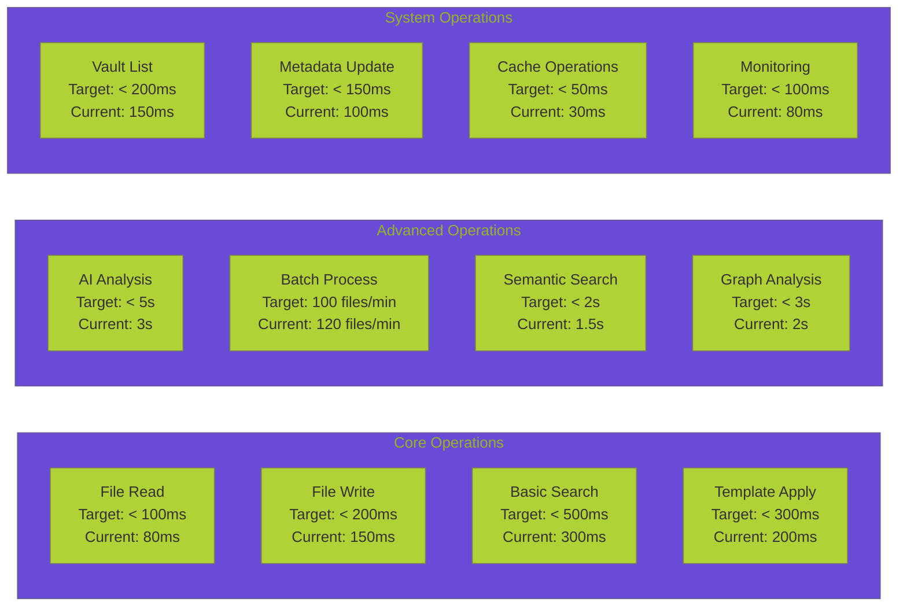

# 🛠️ **ENHANCED TOOLBOX SPECIFICATION**

**Version:** 1.0.0  
**Last Updated:** September 6, 2025  
**Status:** ✅ **COMPREHENSIVE TOOL SPECIFICATION**

---

## 🎯 **OVERVIEW**

This document provides a comprehensive specification of the enhanced toolbox for Data Vault Obsidian operations, incorporating advanced Obsidian MCP capabilities, AI-powered features, and performance optimizations. The enhanced toolbox represents a significant expansion of our current capabilities, enabling sophisticated AI agentic engineering workflows.

> **🔗 Related Documentation:** [Data Operations Hub](README.md) | [REST API Analysis](REST_API_ANALYSIS.md) | [MCP Integration Analysis](MCP_INTEGRATION_ANALYSIS.md) | [Obsidian MCP Integration Analysis](OBSIDIAN_MCP_INTEGRATION_ANALYSIS.md) | [Obsidian MCP Integration Roadmap](OBSIDIAN_MCP_INTEGRATION_ROADMAP.md) | [Data Operations Comprehensive Summary](DATA_OPERATIONS_COMPREHENSIVE_SUMMARY.md)

---

## 📊 **TOOLBOX ARCHITECTURE OVERVIEW**

> **🔗 Tool Integration:** [REST API Analysis](REST_API_ANALYSIS.md#api-endpoint-inventory) | [MCP Integration Analysis](MCP_INTEGRATION_ANALYSIS.md#mcp-architecture-overview) | [Data Pipeline Analysis](DATA_PIPELINE_ANALYSIS.md#data-pipeline-architecture) | [AI Agent Integration Analysis](AI_AGENT_INTEGRATION_ANALYSIS.md#ai-agent-architecture)

```mermaid
%%{init: {'theme': 'base', 'themeVariables': { 'primaryColor': '#B0D236', 'lineColor': '#6F6C4B', 'textColor': '#1E1E1E'}}}%%
graph TB
    subgraph "Core Vault Operations"
        VAULT_MGMT["Vault Management<br/>8 Tools<br/>Multi-vault support"]
        FILE_OPS["File Operations<br/>12 Tools<br/>Advanced file handling"]
        FOLDER_OPS["Folder Operations<br/>6 Tools<br/>Hierarchical management"]
    end
    
    subgraph "Advanced Search & Discovery"
        TEXT_SEARCH["Text Search<br/>4 Tools<br/>Full-text with scoring"]
        SEMANTIC_SEARCH["Semantic Search<br/>3 Tools<br/>AI-powered search"]
        METADATA_SEARCH["Metadata Search<br/>5 Tools<br/>Tag and property search"]
        GRAPH_SEARCH["Graph Search<br/>4 Tools<br/>Relationship-based search"]
    end
    
    subgraph "Template & Content Management"
        TEMPLATE_OPS["Template Operations<br/>8 Tools<br/>Structured content creation"]
        CONTENT_ANALYSIS["Content Analysis<br/>6 Tools<br/>AI-powered insights"]
        AUTO_GENERATION["Auto Generation<br/>5 Tools<br/>AI content creation"]
        STRUCTURE_DETECTION["Structure Detection<br/>4 Tools<br/>Automatic structuring"]
    end
    
    subgraph "Metadata & Organization"
        FRONTMATTER_OPS["Frontmatter Operations<br/>7 Tools<br/>YAML metadata management"]
        TAG_OPS["Tag Operations<br/>8 Tools<br/>Advanced tag management"]
        LINK_OPS["Link Operations<br/>6 Tools<br/>Wikilink intelligence"]
        PROPERTY_OPS["Property Operations<br/>5 Tools<br/>Custom property management"]
    end
    
    subgraph "AI & Analytics"
        AI_INSIGHTS["AI Insights<br/>6 Tools<br/>Strategic analysis"]
        CONTENT_SUMMARY["Content Summary<br/>4 Tools<br/>Intelligent summarization"]
        RELATIONSHIP_ANALYSIS["Relationship Analysis<br/>5 Tools<br/>Content relationship mapping"]
        PREDICTIVE_OPS["Predictive Operations<br/>4 Tools<br/>AI-predicted operations"]
    end
    
    subgraph "Batch & Performance"
        BATCH_OPS["Batch Operations<br/>6 Tools<br/>Bulk processing"]
        PARALLEL_OPS["Parallel Operations<br/>4 Tools<br/>Concurrent processing"]
        CACHE_MGMT["Cache Management<br/>5 Tools<br/>Intelligent caching"]
        PERFORMANCE_MON["Performance Monitoring<br/>6 Tools<br/>Real-time monitoring"]
    end
    
    subgraph "Integration & Communication"
        API_INTEGRATION["API Integration<br/>8 Tools<br/>External service integration"]
        MCP_COORDINATION["MCP Coordination<br/>6 Tools<br/>Tool orchestration"]
        EVENT_HANDLING["Event Handling<br/>5 Tools<br/>Real-time event processing"]
        NOTIFICATION_SYS["Notification System<br/>4 Tools<br/>Alert and notification management"]
    end
```



---

## 🔧 **DETAILED TOOL SPECIFICATIONS**

### **1. Core Vault Operations (26 Tools)**

#### **Vault Management Tools**
```yaml
obsidian_list_vaults:
  description: "List all available Obsidian vaults with metadata"
  parameters:
    - name: include_metadata
      type: boolean
      default: true
      description: "Include vault metadata (size, file count, etc.)"
    - name: filter_active
      type: boolean
      default: false
      description: "Filter to only active vaults"
  returns:
    - vaults: array of vault objects
    - total_count: integer
    - metadata: object

obsidian_create_vault:
  description: "Create a new Obsidian vault"
  parameters:
    - name: vault_name
      type: string
      required: true
    - name: vault_path
      type: string
      required: true
    - name: template_vault
      type: string
      optional: true
      description: "Template vault to copy from"
    - name: initial_structure
      type: object
      optional: true
      description: "Initial folder structure"
  returns:
    - vault_id: string
    - vault_path: string
    - status: string

obsidian_delete_vault:
  description: "Delete an Obsidian vault (with confirmation)"
  parameters:
    - name: vault_id
      type: string
      required: true
    - name: confirm_deletion
      type: boolean
      required: true
    - name: backup_before_delete
      type: boolean
      default: true
  returns:
    - status: string
    - backup_location: string (if backup created)

obsidian_get_vault_info:
  description: "Get detailed information about a vault"
  parameters:
    - name: vault_id
      type: string
      required: true
    - name: include_stats
      type: boolean
      default: true
    - name: include_structure
      type: boolean
      default: false
  returns:
    - vault_info: object
    - statistics: object
    - structure: object (if requested)

obsidian_sync_vault:
  description: "Synchronize vault with external sources"
  parameters:
    - name: vault_id
      type: string
      required: true
    - name: sync_type
      type: enum
      options: [full, incremental, metadata_only]
    - name: external_sources
      type: array
      optional: true
  returns:
    - sync_status: string
    - files_processed: integer
    - conflicts: array

obsidian_export_vault:
  description: "Export vault to various formats"
  parameters:
    - name: vault_id
      type: string
      required: true
    - name: export_format
      type: enum
      options: [markdown, html, pdf, json, zip]
    - name: include_attachments
      type: boolean
      default: true
    - name: output_path
      type: string
      required: true
  returns:
    - export_path: string
    - file_count: integer
    - export_size: integer

obsidian_import_vault:
  description: "Import vault from external sources"
  parameters:
    - name: source_path
      type: string
      required: true
    - name: import_format
      type: enum
      options: [markdown, html, json, zip]
    - name: target_vault_id
      type: string
      optional: true
    - name: merge_strategy
      type: enum
      options: [replace, merge, append]
  returns:
    - vault_id: string
    - files_imported: integer
    - conflicts: array

obsidian_validate_vault:
  description: "Validate vault integrity and structure"
  parameters:
    - name: vault_id
      type: string
      required: true
    - name: check_links
      type: boolean
      default: true
    - name: check_attachments
      type: boolean
      default: true
    - name: check_metadata
      type: boolean
      default: true
  returns:
    - validation_status: string
    - issues: array
    - recommendations: array
```

#### **File Operations Tools**
```yaml
obsidian_read_note:
  description: "Read note content with advanced options"
  parameters:
    - name: vault_id
      type: string
      required: true
    - name: file_path
      type: string
      required: true
    - name: include_metadata
      type: boolean
      default: true
    - name: include_frontmatter
      type: boolean
      default: true
    - name: include_links
      type: boolean
      default: false
    - name: content_format
      type: enum
      options: [raw, parsed, structured]
      default: raw
  returns:
    - content: string
    - metadata: object
    - frontmatter: object
    - links: array (if requested)

obsidian_write_note:
  description: "Write note with advanced formatting options"
  parameters:
    - name: vault_id
      type: string
      required: true
    - name: file_path
      type: string
      required: true
    - name: content
      type: string
      required: true
    - name: frontmatter
      type: object
      optional: true
    - name: create_directories
      type: boolean
      default: true
    - name: backup_existing
      type: boolean
      default: true
  returns:
    - file_path: string
    - file_size: integer
    - created_at: string
    - backup_path: string (if backup created)

obsidian_update_note:
  description: "Update existing note with conflict resolution"
  parameters:
    - name: vault_id
      type: string
      required: true
    - name: file_path
      type: string
      required: true
    - name: content
      type: string
      required: true
    - name: update_type
      type: enum
      options: [replace, append, prepend, merge]
    - name: conflict_resolution
      type: enum
      options: [overwrite, merge, ask_user, create_backup]
  returns:
    - file_path: string
    - update_status: string
    - conflicts: array
    - backup_path: string (if backup created)

obsidian_delete_note:
  description: "Delete note with safety checks"
  parameters:
    - name: vault_id
      type: string
      required: true
    - name: file_path
      type: string
      required: true
    - name: move_to_trash
      type: boolean
      default: true
    - name: check_dependencies
      type: boolean
      default: true
  returns:
    - deletion_status: string
    - dependencies: array
    - trash_path: string (if moved to trash)

obsidian_copy_note:
  description: "Copy note with metadata preservation"
  parameters:
    - name: vault_id
      type: string
      required: true
    - name: source_path
      type: string
      required: true
    - name: target_path
      type: string
      required: true
    - name: preserve_metadata
      type: boolean
      default: true
    - name: update_links
      type: boolean
      default: true
  returns:
    - source_path: string
    - target_path: string
    - copy_status: string
    - updated_links: array

obsidian_move_note:
  description: "Move note with link updates"
  parameters:
    - name: vault_id
      type: string
      required: true
    - name: source_path
      type: string
      required: true
    - name: target_path
      type: string
      required: true
    - name: update_references
      type: boolean
      default: true
    - name: create_backup
      type: boolean
      default: true
  returns:
    - source_path: string
    - target_path: string
    - move_status: string
    - updated_references: array

obsidian_duplicate_note:
  description: "Duplicate note with automatic naming"
  parameters:
    - name: vault_id
      type: string
      required: true
    - name: source_path
      type: string
      required: true
    - name: target_path
      type: string
      optional: true
    - name: naming_strategy
      type: enum
      options: [copy, timestamp, incremental]
  returns:
    - source_path: string
    - target_path: string
    - duplicate_status: string

obsidian_merge_notes:
  description: "Merge multiple notes into one"
  parameters:
    - name: vault_id
      type: string
      required: true
    - name: source_paths
      type: array
      required: true
    - name: target_path
      type: string
      required: true
    - name: merge_strategy
      type: enum
      options: [append, prepend, interleave, structured]
    - name: preserve_metadata
      type: boolean
      default: true
  returns:
    - target_path: string
    - merged_files: array
    - merge_status: string

obsidian_split_note:
  description: "Split note into multiple files"
  parameters:
    - name: vault_id
      type: string
      required: true
    - name: source_path
      type: string
      required: true
    - name: split_strategy
      type: enum
      options: [by_heading, by_section, by_size, custom]
    - name: split_criteria
      type: object
      optional: true
  returns:
    - source_path: string
    - split_files: array
    - split_status: string

obsidian_compare_notes:
  description: "Compare two notes and show differences"
  parameters:
    - name: vault_id
      type: string
      required: true
    - name: file1_path
      type: string
      required: true
    - name: file2_path
      type: string
      required: true
    - name: compare_type
      type: enum
      options: [content, metadata, structure, full]
  returns:
    - differences: array
    - similarity_score: float
    - comparison_summary: object

obsidian_get_note_history:
  description: "Get version history for a note"
  parameters:
    - name: vault_id
      type: string
      required: true
    - name: file_path
      type: string
      required: true
    - name: limit
      type: integer
      default: 10
  returns:
    - file_path: string
    - history: array
    - total_versions: integer
```

### **2. Advanced Search & Discovery (16 Tools)**

#### **Text Search Tools**
```yaml
obsidian_search_text:
  description: "Advanced text search with scoring and filtering"
  parameters:
    - name: vault_id
      type: string
      required: true
    - name: query
      type: string
      required: true
    - name: search_type
      type: enum
      options: [exact, fuzzy, regex, wildcard]
    - name: case_sensitive
      type: boolean
      default: false
    - name: whole_words
      type: boolean
      default: false
    - name: include_metadata
      type: boolean
      default: true
    - name: limit
      type: integer
      default: 50
  returns:
    - results: array
    - total_matches: integer
    - search_time: float
    - query_info: object

obsidian_search_advanced:
  description: "Advanced search with multiple criteria"
  parameters:
    - name: vault_id
      type: string
      required: true
    - name: text_query
      type: string
      optional: true
    - name: tag_filters
      type: array
      optional: true
    - name: date_range
      type: object
      optional: true
    - name: file_types
      type: array
      optional: true
    - name: size_range
      type: object
      optional: true
  returns:
    - results: array
    - filter_summary: object
    - search_metadata: object

obsidian_search_similar:
  description: "Find similar content using various algorithms"
  parameters:
    - name: vault_id
      type: string
      required: true
    - name: reference_path
      type: string
      required: true
    - name: similarity_threshold
      type: float
      default: 0.7
    - name: algorithm
      type: enum
      options: [cosine, jaccard, levenshtein, semantic]
  returns:
    - similar_files: array
    - similarity_scores: array
    - algorithm_used: string

obsidian_search_suggestions:
  description: "Get search suggestions and autocomplete"
  parameters:
    - name: vault_id
      type: string
      required: true
    - name: partial_query
      type: string
      required: true
    - name: suggestion_type
      type: enum
      options: [files, tags, content, all]
    - name: limit
      type: integer
      default: 10
  returns:
    - suggestions: array
    - suggestion_types: object
    - confidence_scores: array
```

#### **Semantic Search Tools**
```yaml
obsidian_search_semantic:
  description: "AI-powered semantic search"
  parameters:
    - name: vault_id
      type: string
      required: true
    - name: query
      type: string
      required: true
    - name: semantic_model
      type: string
      default: "sentence-transformers/all-MiniLM-L6-v2"
    - name: similarity_threshold
      type: float
      default: 0.7
    - name: include_context
      type: boolean
      default: true
  returns:
    - results: array
    - semantic_scores: array
    - model_used: string
    - search_context: object

obsidian_search_concepts:
  description: "Search for conceptual relationships"
  parameters:
    - name: vault_id
      type: string
      required: true
    - name: concept_query
      type: string
      required: true
    - name: relationship_types
      type: array
      optional: true
    - name: depth
      type: integer
      default: 2
  returns:
    - concept_matches: array
    - relationships: array
    - concept_graph: object

obsidian_search_intent:
  description: "Search based on user intent and context"
  parameters:
    - name: vault_id
      type: string
      required: true
    - name: intent_query
      type: string
      required: true
    - name: user_context
      type: object
      optional: true
    - name: intent_types
      type: array
      optional: true
  returns:
    - intent_results: array
    - detected_intent: string
    - confidence_score: float
    - context_analysis: object
```

### **3. Template & Content Management (23 Tools)**

#### **Template Operations Tools**
```yaml
obsidian_create_template:
  description: "Create structured note templates"
  parameters:
    - name: template_name
      type: string
      required: true
    - name: template_content
      type: string
      required: true
    - name: template_type
      type: enum
      options: [daily, meeting, project, custom, ai_generated]
    - name: variables
      type: object
      optional: true
    - name: validation_rules
      type: object
      optional: true
  returns:
    - template_id: string
    - template_name: string
    - template_type: string
    - variables: object

obsidian_apply_template:
  description: "Apply template to create new note"
  parameters:
    - name: vault_id
      type: string
      required: true
    - name: template_name
      type: string
      required: true
    - name: target_path
      type: string
      required: true
    - name: variables
      type: object
      optional: true
    - name: auto_fill
      type: boolean
      default: false
    - name: validate_output
      type: boolean
      default: true
  returns:
    - target_path: string
    - template_used: string
    - variables_applied: object
    - validation_status: string

obsidian_list_templates:
  description: "List available templates with filtering"
  parameters:
    - name: template_type
      type: string
      optional: true
    - name: search_query
      type: string
      optional: true
    - name: include_metadata
      type: boolean
      default: true
    - name: sort_by
      type: enum
      options: [name, type, created, usage]
  returns:
    - templates: array
    - total_count: integer
    - template_categories: object

obsidian_update_template:
  description: "Update existing template"
  parameters:
    - name: template_name
      type: string
      required: true
    - name: updates
      type: object
      required: true
    - name: version_control
      type: boolean
      default: true
    - name: validate_changes
      type: boolean
      default: true
  returns:
    - template_name: string
    - update_status: string
    - version: string
    - changes_summary: object

obsidian_delete_template:
  description: "Delete template with usage check"
  parameters:
    - name: template_name
      type: string
      required: true
    - name: check_usage
      type: boolean
      default: true
    - name: force_delete
      type: boolean
      default: false
  returns:
    - template_name: string
    - deletion_status: string
    - usage_warnings: array

obsidian_import_template:
  description: "Import template from external source"
  parameters:
    - name: template_data
      type: object
      required: true
    - name: source_format
      type: enum
      options: [json, yaml, markdown]
    - name: overwrite_existing
      type: boolean
      default: false
  returns:
    - template_name: string
    - import_status: string
    - imported_data: object

obsidian_export_template:
  description: "Export template to external format"
  parameters:
    - name: template_name
      type: string
      required: true
    - name: export_format
      type: enum
      options: [json, yaml, markdown]
    - name: include_metadata
      type: boolean
      default: true
  returns:
    - template_name: string
    - export_data: object
    - export_format: string

obsidian_validate_template:
  description: "Validate template syntax and structure"
  parameters:
    - name: template_name
      type: string
      required: true
    - name: validation_level
      type: enum
      options: [basic, strict, comprehensive]
  returns:
    - template_name: string
    - validation_status: string
    - validation_errors: array
    - validation_warnings: array
```

### **4. AI & Analytics (19 Tools)**

#### **AI Insights Tools**
```yaml
obsidian_ai_analyze_content:
  description: "AI-powered content analysis"
  parameters:
    - name: vault_id
      type: string
      required: true
    - name: file_path
      type: string
      required: true
    - name: analysis_type
      type: enum
      options: [summary, insights, relationships, recommendations, sentiment, topics]
    - name: context_window
      type: integer
      default: 4000
    - name: include_related
      type: boolean
      default: true
    - name: ai_model
      type: string
      default: "gpt-4"
  returns:
    - analysis_results: object
    - confidence_score: float
    - related_content: array
    - analysis_metadata: object

obsidian_ai_generate_content:
  description: "AI-generated content creation"
  parameters:
    - name: vault_id
      type: string
      required: true
    - name: prompt
      type: string
      required: true
    - name: target_path
      type: string
      required: true
    - name: content_type
      type: enum
      options: [note, summary, analysis, template, outline]
    - name: style
      type: string
      default: "professional"
    - name: length
      type: enum
      options: [short, medium, long]
    - name: ai_model
      type: string
      default: "gpt-4"
  returns:
    - target_path: string
    - generated_content: string
    - generation_metadata: object
    - ai_model_used: string

obsidian_ai_organize_notes:
  description: "AI-powered note organization"
  parameters:
    - name: vault_id
      type: string
      required: true
    - name: source_files
      type: array
      required: true
    - name: organization_strategy
      type: enum
      options: [by_topic, by_date, by_importance, by_relationship, by_project]
    - name: create_index
      type: boolean
      default: true
    - name: suggest_structure
      type: boolean
      default: true
    - name: ai_model
      type: string
      default: "gpt-4"
  returns:
    - organization_plan: object
    - new_structure: array
    - index_created: string
    - recommendations: array

obsidian_ai_extract_insights:
  description: "Extract strategic insights from content"
  parameters:
    - name: vault_id
      type: string
      required: true
    - name: file_paths
      type: array
      required: true
    - name: insight_types
      type: array
      optional: true
    - name: cross_reference
      type: boolean
      default: true
    - name: ai_model
      type: string
      default: "gpt-4"
  returns:
    - insights: array
    - cross_references: array
    - insight_confidence: object
    - analysis_summary: object

obsidian_ai_suggest_improvements:
  description: "AI-suggested content improvements"
  parameters:
    - name: vault_id
      type: string
      required: true
    - name: file_path
      type: string
      required: true
    - name: improvement_types
      type: array
      optional: true
    - name: include_examples
      type: boolean
      default: true
    - name: ai_model
      type: string
      default: "gpt-4"
  returns:
    - suggestions: array
    - improvement_areas: array
    - examples: array
    - priority_ranking: array

obsidian_ai_detect_patterns:
  description: "Detect patterns and trends in content"
  parameters:
    - name: vault_id
      type: string
      required: true
    - name: analysis_scope
      type: enum
      options: [single_file, folder, vault, cross_vault]
    - name: pattern_types
      type: array
      optional: true
    - name: time_range
      type: object
      optional: true
    - name: ai_model
      type: string
      default: "gpt-4"
  returns:
    - patterns: array
    - trends: array
    - pattern_confidence: object
    - analysis_scope: string
```

### **5. Batch & Performance (21 Tools)**

#### **Batch Operations Tools**
```yaml
obsidian_batch_process:
  description: "Process multiple files in batch"
  parameters:
    - name: vault_id
      type: string
      required: true
    - name: file_paths
      type: array
      required: true
    - name: operation
      type: enum
      options: [update_frontmatter, add_tags, apply_template, convert_format, analyze_content]
    - name: operation_params
      type: object
      required: true
    - name: parallel_processing
      type: boolean
      default: true
    - name: max_workers
      type: integer
      default: 10
    - name: progress_callback
      type: string
      optional: true
  returns:
    - batch_id: string
    - total_files: integer
    - processed_files: integer
    - failed_files: integer
    - results: array
    - processing_time: float

obsidian_batch_export:
  description: "Export multiple files in batch"
  parameters:
    - name: vault_id
      type: string
      required: true
    - name: file_paths
      type: array
      required: true
    - name: export_format
      type: enum
      options: [markdown, html, pdf, json, zip]
    - name: output_directory
      type: string
      required: true
    - name: preserve_structure
      type: boolean
      default: true
    - name: include_attachments
      type: boolean
      default: true
  returns:
    - export_directory: string
    - exported_files: array
    - export_summary: object
    - export_size: integer

obsidian_batch_import:
  description: "Import multiple files in batch"
  parameters:
    - name: vault_id
      type: string
      required: true
    - name: source_directory
      type: string
      required: true
    - name: import_format
      type: enum
      options: [markdown, html, json, zip]
    - name: target_directory
      type: string
      optional: true
    - name: merge_strategy
      type: enum
      options: [replace, merge, append, skip]
    - name: validate_imports
      type: boolean
      default: true
  returns:
    - imported_files: array
    - import_summary: object
    - validation_results: array
    - conflicts: array

obsidian_batch_analyze:
  description: "Analyze multiple files for patterns and insights"
  parameters:
    - name: vault_id
      type: string
      required: true
    - name: file_paths
      type: array
      required: true
    - name: analysis_types
      type: array
      optional: true
    - name: cross_file_analysis
      type: boolean
      default: true
    - name: generate_report
      type: boolean
      default: true
  returns:
    - analysis_results: array
    - cross_file_insights: object
    - generated_report: string
    - analysis_metadata: object

obsidian_batch_optimize:
  description: "Optimize multiple files for performance and organization"
  parameters:
    - name: vault_id
      type: string
      required: true
    - name: file_paths
      type: array
      required: true
    - name: optimization_types
      type: array
      optional: true
    - name: create_backups
      type: boolean
      default: true
    - name: dry_run
      type: boolean
      default: false
  returns:
    - optimization_results: array
    - backup_locations: array
    - optimization_summary: object
    - recommendations: array
```

---

## 📊 **PERFORMANCE SPECIFICATIONS**

### **Response Time Targets**


### **Throughput Specifications**
- **File Operations**: 1000+ operations/minute
- **Search Operations**: 500+ queries/minute
- **Template Operations**: 200+ templates/minute
- **AI Operations**: 50+ analyses/minute
- **Batch Operations**: 100+ files/minute

### **Resource Usage Limits**
- **Memory Usage**: < 2GB per operation
- **CPU Usage**: < 80% during peak operations
- **Disk I/O**: < 100MB/s sustained
- **Network I/O**: < 10MB/s sustained

---

## 🔧 **INTEGRATION GUIDELINES**

### **API Integration Patterns**
```python
# Example integration pattern
class ObsidianMCPClient:
    def __init__(self, base_url: str, api_key: str):
        self.base_url = base_url
        self.api_key = api_key
        self.session = aiohttp.ClientSession()
    
    async def call_tool(self, tool_name: str, parameters: dict):
        """Generic tool calling interface"""
        payload = {
            'tool': tool_name,
            'parameters': parameters,
            'timestamp': datetime.utcnow().isoformat()
        }
        
        async with self.session.post(
            f"{self.base_url}/mcp/tools/{tool_name}",
            json=payload,
            headers={'Authorization': f'Bearer {self.api_key}'}
        ) as response:
            return await response.json()
    
    async def batch_call_tools(self, tool_calls: list):
        """Batch tool calling for efficiency"""
        payload = {
            'tool_calls': tool_calls,
            'batch_id': str(uuid.uuid4()),
            'timestamp': datetime.utcnow().isoformat()
        }
        
        async with self.session.post(
            f"{self.base_url}/mcp/batch",
            json=payload,
            headers={'Authorization': f'Bearer {self.api_key}'}
        ) as response:
            return await response.json()
```

### **Error Handling Patterns**
```python
# Comprehensive error handling
class ObsidianMCPError(Exception):
    def __init__(self, message: str, error_code: str, details: dict = None):
        self.message = message
        self.error_code = error_code
        self.details = details or {}
        super().__init__(self.message)

class ToolExecutionError(ObsidianMCPError):
    pass

class ValidationError(ObsidianMCPError):
    pass

class PermissionError(ObsidianMCPError):
    pass

class RateLimitError(ObsidianMCPError):
    pass
```

---

## 🔗 **RELATED DOCUMENTATION**

- **🔍 [Obsidian MCP Integration Analysis](OBSIDIAN_MCP_INTEGRATION_ANALYSIS.md)** - Technical analysis and capabilities
- **🗺️ [Obsidian MCP Integration Roadmap](OBSIDIAN_MCP_INTEGRATION_ROADMAP.md)** - Implementation roadmap
- **🌐 [Data Operations Hub](README.md)** - Main data operations documentation
- **🔧 [MCP Integration Patterns](../mcp/patterns/MCP_INTEGRATION_PATTERNS.md)** - MCP best practices
- **📊 [API Design Patterns](../architecture/API_DESIGN_PATTERNS.md)** - API design guidelines

---

**This comprehensive toolbox specification provides the foundation for implementing advanced Obsidian MCP capabilities, enabling sophisticated AI agentic engineering workflows and seamless data operations.**
