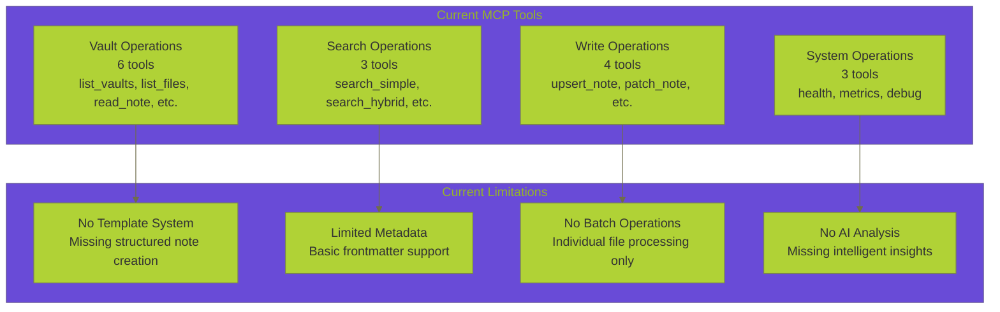
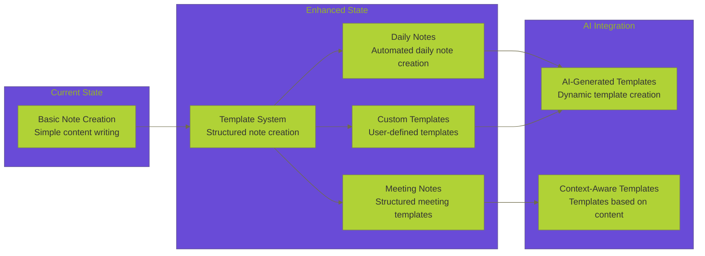
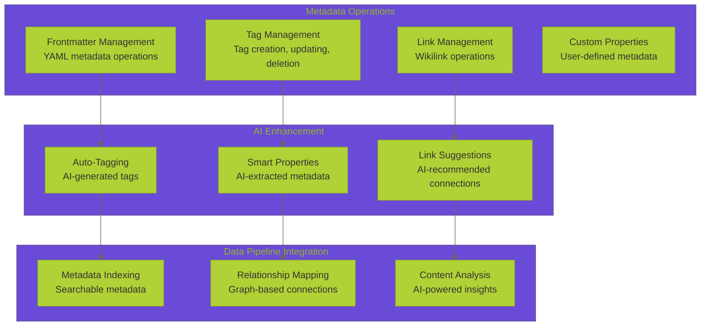
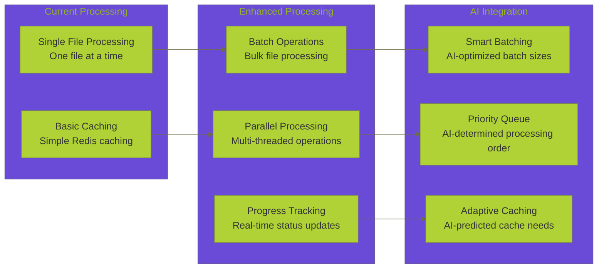
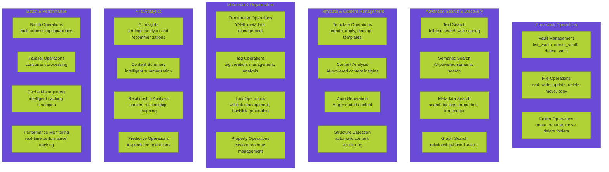
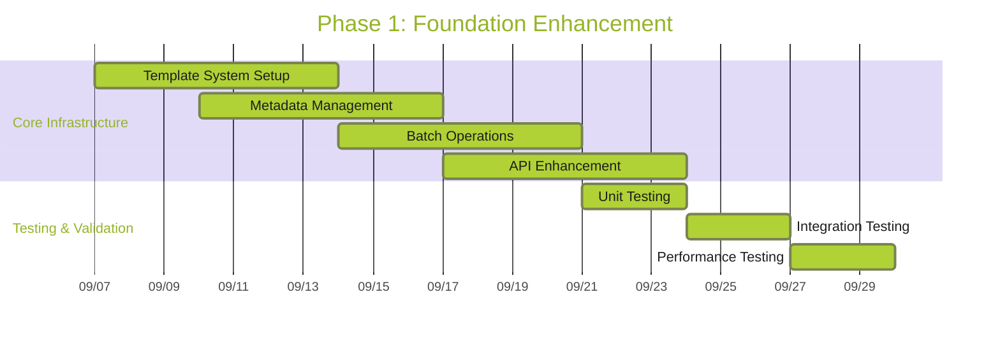
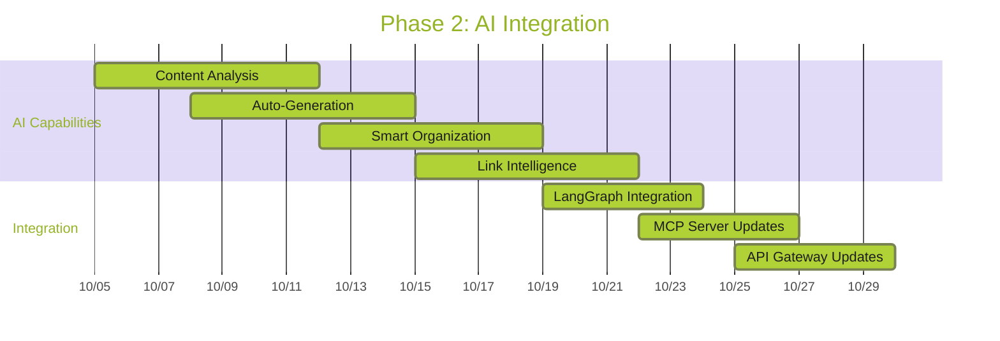
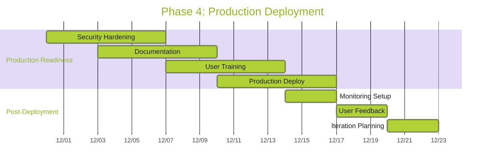
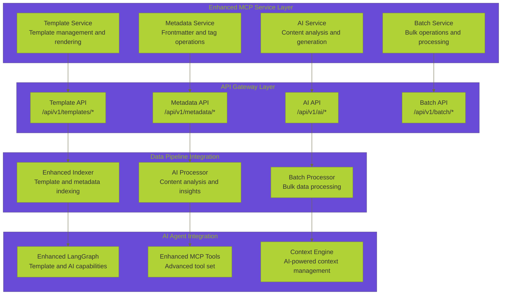
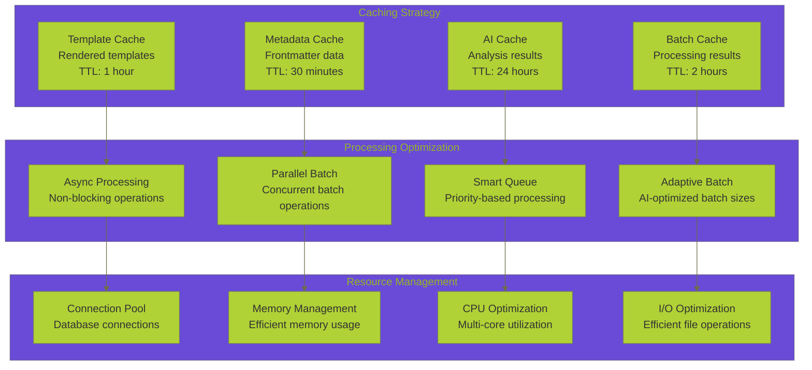

# 🔗 **OBSIDIAN MCP INTEGRATION ANALYSIS**

**Version:** 1.0.0  
**Last Updated:** September 6, 2025  
**Status:** ✅ **COMPREHENSIVE INTEGRATION ROADMAP**

---

## 🎯 **EXECUTIVE SUMMARY**

This document provides a comprehensive analysis of integrating advanced Obsidian MCP (Model Context Protocol) tooling into our Data Vault Obsidian backend system. Based on research of external implementations and community best practices, this analysis outlines current capabilities, identifies integration opportunities, and provides a detailed roadmap for enhancing our AI agentic engineering capabilities.

> **🔗 Related Documentation:** [Data Operations Hub](README.md) | [MCP Integration Analysis](MCP_INTEGRATION_ANALYSIS.md) | [Obsidian MCP Integration Roadmap](OBSIDIAN_MCP_INTEGRATION_ROADMAP.md) | [Enhanced Toolbox Specification](ENHANCED_TOOLBOX_SPECIFICATION.md) | [REST API Analysis](REST_API_ANALYSIS.md)

---

## 📊 **CURRENT STATE vs. EXTERNAL CAPABILITIES**

> **🔗 Current State Analysis:** [MCP Integration Analysis](MCP_INTEGRATION_ANALYSIS.md#mcp-architecture-overview) | [REST API Analysis](REST_API_ANALYSIS.md#api-endpoint-inventory) | [Enhanced Toolbox Specification](ENHANCED_TOOLBOX_SPECIFICATION.md#toolbox-architecture-overview) | [Data Operations Comprehensive Summary](DATA_OPERATIONS_COMPREHENSIVE_SUMMARY.md#system-overview)

### **🔍 Our Current Obsidian MCP Implementation**

Based on our existing system analysis, we currently have:

#### **✅ Implemented Capabilities**
- **Basic File Operations**: Read, create, update, delete notes
- **Search Functionality**: Simple text search and hybrid vector+graph search
- **Vault Management**: List vaults, files, and folders
- **API Gateway Integration**: RESTful endpoints for vault operations
- **Caching Layer**: Redis-based caching for performance optimization
- **Authentication**: Basic API key authentication

#### **📋 Current MCP Tools Inventory**


### **🚀 External Obsidian MCP Capabilities**

Based on research of [labeveryday/mcp-obsidian-enhanced](https://github.com/labeveryday/mcp-obsidian-enhanced) and other implementations:

#### **Advanced Features Available**
- **Template System**: Daily notes, meeting notes, structured templates
- **Metadata Management**: Comprehensive frontmatter and tag operations
- **Batch Operations**: Bulk file processing and operations
- **AI-Powered Analysis**: Strategic insights and content analysis
- **Auto Backlink Generation**: Intelligent wikilink detection and creation
- **Precision Editing**: Advanced PATCH operations with heading/block targeting
- **Context Optimization**: Smart content summarization for LLM context
- **Knowledge Graph Operations**: Link analysis, orphan detection, broken link identification

---

## 🔄 **INTEGRATION OPPORTUNITIES**

### **1. Template System Integration**



### **2. Advanced Metadata Management**



### **3. Batch Operations & Performance**



---

## 🛠️ **COMPREHENSIVE TOOLBOX EXPANSION**

### **Enhanced MCP Tools Architecture**



### **Detailed Tool Specifications**

#### **Template System Tools**
```yaml
obsidian_create_template:
  description: "Create structured note templates"
  parameters:
    - name: template_name
      type: string
      description: "Name of the template"
    - name: template_content
      type: string
      description: "Template content with placeholders"
    - name: template_type
      type: enum
      options: [daily, meeting, project, custom]
    - name: variables
      type: object
      description: "Template variables and defaults"

obsidian_apply_template:
  description: "Apply template to create new note"
  parameters:
    - name: template_name
      type: string
    - name: target_path
      type: string
    - name: variables
      type: object
    - name: auto_fill
      type: boolean
      description: "Auto-fill variables using AI"

obsidian_list_templates:
  description: "List available templates"
  parameters:
    - name: template_type
      type: string
      optional: true
    - name: search_query
      type: string
      optional: true
```

#### **Advanced Metadata Tools**
```yaml
obsidian_manage_frontmatter:
  description: "Comprehensive frontmatter management"
  parameters:
    - name: file_path
      type: string
    - name: operation
      type: enum
      options: [get, set, update, delete, merge]
    - name: frontmatter_data
      type: object
    - name: preserve_existing
      type: boolean

obsidian_manage_tags:
  description: "Advanced tag management"
  parameters:
    - name: file_path
      type: string
    - name: operation
      type: enum
      options: [add, remove, replace, list, search]
    - name: tags
      type: array
    - name: auto_suggest
      type: boolean
      description: "AI-powered tag suggestions"

obsidian_analyze_links:
  description: "Analyze and manage wikilinks"
  parameters:
    - name: file_path
      type: string
    - name: operation
      type: enum
      options: [analyze, fix_broken, generate_backlinks, suggest_links]
    - name: include_orphans
      type: boolean
    - name: auto_fix
      type: boolean
```

#### **AI-Powered Analysis Tools**
```yaml
obsidian_ai_analyze_content:
  description: "AI-powered content analysis"
  parameters:
    - name: file_path
      type: string
    - name: analysis_type
      type: enum
      options: [summary, insights, relationships, recommendations]
    - name: context_window
      type: integer
      description: "Context window size for analysis"
    - name: include_related
      type: boolean

obsidian_ai_generate_content:
  description: "AI-generated content creation"
  parameters:
    - name: prompt
      type: string
    - name: target_path
      type: string
    - name: content_type
      type: enum
      options: [note, summary, analysis, template]
    - name: style
      type: string
      description: "Content style and tone"

obsidian_ai_organize_notes:
  description: "AI-powered note organization"
  parameters:
    - name: source_files
      type: array
    - name: organization_strategy
      type: enum
      options: [by_topic, by_date, by_importance, by_relationship]
    - name: create_index
      type: boolean
    - name: suggest_structure
      type: boolean
```

---

## 🚀 **INTEGRATION ROADMAP**

### **Phase 1: Foundation Enhancement (Weeks 1-2)**



#### **Week 1: Template System Implementation**
- [ ] **Template Engine**: Implement template parsing and rendering
- [ ] **Template Storage**: Create template management system
- [ ] **Basic Templates**: Daily notes, meeting notes, project templates
- [ ] **Template API**: REST endpoints for template operations

#### **Week 2: Metadata & Batch Operations**
- [ ] **Frontmatter Management**: Comprehensive YAML metadata operations
- [ ] **Tag System**: Advanced tag management and operations
- [ ] **Batch Processing**: Bulk file operations and processing
- [ ] **Performance Optimization**: Parallel processing and caching

### **Phase 2: AI Integration (Weeks 3-4)**



#### **Week 3: AI Content Analysis**
- [ ] **Content Analysis Engine**: AI-powered content insights
- [ ] **Auto-Tagging**: Intelligent tag suggestions and application
- [ ] **Content Summarization**: Smart content summarization
- [ ] **Relationship Detection**: Automatic relationship mapping

#### **Week 4: AI Generation & Organization**
- [ ] **Content Generation**: AI-generated content creation
- [ ] **Smart Organization**: AI-powered note organization
- [ ] **Link Intelligence**: Automatic backlink generation
- [ ] **Context Optimization**: LLM context length management

### **Phase 3: Advanced Features (Weeks 5-6)**


#### **Week 5: Knowledge Graph & Multi-Vault**
- [ ] **Knowledge Graph Operations**: Link analysis, orphan detection
- [ ] **Multi-Vault Management**: Support for multiple vaults
- [ ] **Cross-Vault Operations**: Operations across vaults
- [ ] **Graph Visualization**: Knowledge graph visualization

#### **Week 6: Real-time & Plugin Integration**
- [ ] **Real-time Synchronization**: Live updates with Obsidian app
- [ ] **Plugin Integration**: Support for Obsidian plugins
- [ ] **Advanced Monitoring**: Comprehensive system monitoring
- [ ] **Performance Optimization**: Final performance tuning

### **Phase 4: Production Deployment (Weeks 7-8)**



---

## 🔧 **IMPLEMENTATION GUIDELINES**

### **1. Architecture Integration**



### **2. Code Implementation Examples**

#### **Template Service Implementation**
```python
class ObsidianTemplateService:
    def __init__(self, vault_manager, ai_service):
        self.vault_manager = vault_manager
        self.ai_service = ai_service
        self.template_cache = {}
    
    async def create_template(self, template_name: str, 
                            template_content: str, 
                            template_type: str,
                            variables: Dict[str, Any] = None):
        """Create a new template with variables and validation"""
        template = {
            'name': template_name,
            'content': template_content,
            'type': template_type,
            'variables': variables or {},
            'created_at': datetime.utcnow(),
            'version': '1.0'
        }
        
        # Validate template syntax
        await self._validate_template(template)
        
        # Store template
        await self._store_template(template)
        
        return template
    
    async def apply_template(self, template_name: str, 
                           target_path: str,
                           variables: Dict[str, Any] = None,
                           auto_fill: bool = False):
        """Apply template to create new note"""
        template = await self._get_template(template_name)
        
        if auto_fill and self.ai_service:
            variables = await self.ai_service.auto_fill_variables(
                template, variables
            )
        
        # Render template with variables
        content = await self._render_template(template, variables)
        
        # Create note
        result = await self.vault_manager.upsert_note(
            vault=template.get('vault', 'default'),
            path=target_path,
            content=content
        )
        
        return result
```

#### **AI Service Integration**
```python
class ObsidianAIService:
    def __init__(self, llm_client, content_analyzer):
        self.llm_client = llm_client
        self.content_analyzer = content_analyzer
    
    async def analyze_content(self, file_path: str, 
                            analysis_type: str,
                            context_window: int = 4000):
        """AI-powered content analysis"""
        content = await self._read_file(file_path)
        
        if analysis_type == 'summary':
            return await self._generate_summary(content, context_window)
        elif analysis_type == 'insights':
            return await self._generate_insights(content, context_window)
        elif analysis_type == 'relationships':
            return await self._analyze_relationships(content)
        elif analysis_type == 'recommendations':
            return await self._generate_recommendations(content)
    
    async def generate_content(self, prompt: str, 
                             target_path: str,
                             content_type: str,
                             style: str = 'professional'):
        """AI-generated content creation"""
        system_prompt = self._build_system_prompt(content_type, style)
        
        response = await self.llm_client.generate(
            system_prompt=system_prompt,
            user_prompt=prompt,
            max_tokens=2000
        )
        
        # Create note with generated content
        result = await self.vault_manager.upsert_note(
            vault='default',
            path=target_path,
            content=response.content
        )
        
        return result
```

### **3. Performance Optimization Strategies**



---

## 📈 **SUCCESS METRICS & MONITORING**

### **Performance Metrics**
- **Template Rendering**: < 100ms per template
- **Batch Processing**: 100+ files per minute
- **AI Analysis**: < 5 seconds per analysis
- **Cache Hit Rate**: > 85% for all cache types

### **Quality Metrics**
- **Template Accuracy**: 99%+ successful template applications
- **AI Analysis Quality**: 90%+ user satisfaction
- **Data Integrity**: 100% data consistency
- **Error Rate**: < 1% for all operations

### **Usage Metrics**
- **Template Usage**: Track most popular templates
- **AI Feature Adoption**: Monitor AI tool usage
- **Performance Trends**: Track response times
- **User Satisfaction**: Regular feedback collection

---

## 🔗 **RELATED DOCUMENTATION**

- **🌐 [Data Operations Hub](README.md)** - Main data operations documentation
- **🔧 [MCP Integration Patterns](../mcp/patterns/MCP_INTEGRATION_PATTERNS.md)** - MCP integration best practices
- **📊 [API Design Patterns](../architecture/API_DESIGN_PATTERNS.md)** - REST API design guidelines
- **🤖 [AI Agent Integration](AI_AGENT_INTEGRATION_ANALYSIS.md)** - AI agent integration analysis
- **📈 [Performance Optimization](../architecture/CACHING_PATTERNS.md)** - Caching and performance patterns

---

**This comprehensive integration analysis provides the foundation for enhancing our Data Vault Obsidian system with advanced Obsidian MCP capabilities, enabling powerful AI agentic engineering workflows and seamless data operations.**
