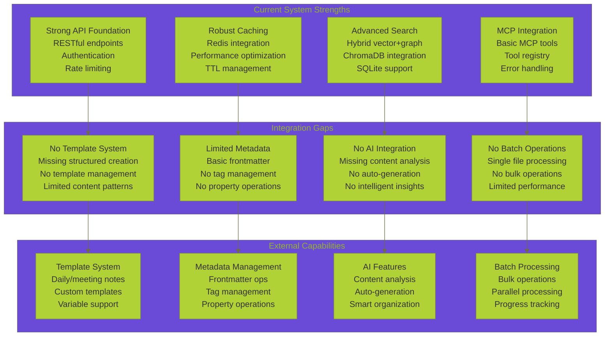
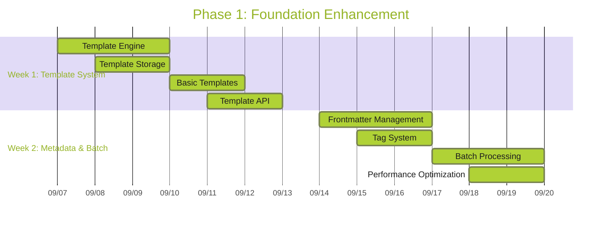
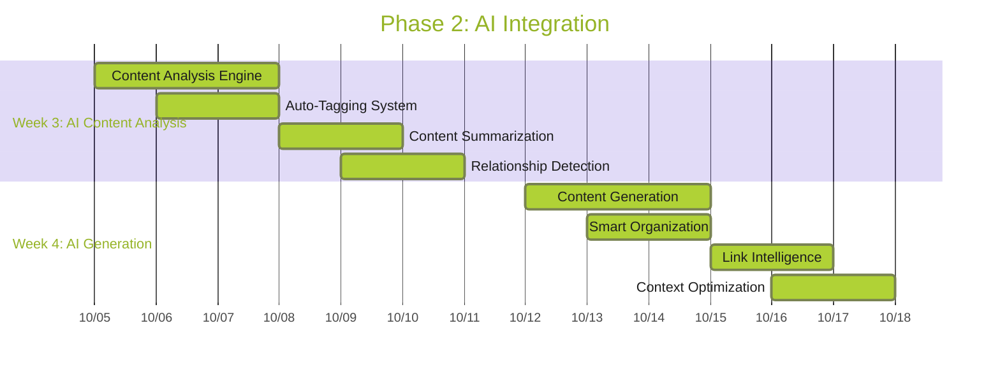
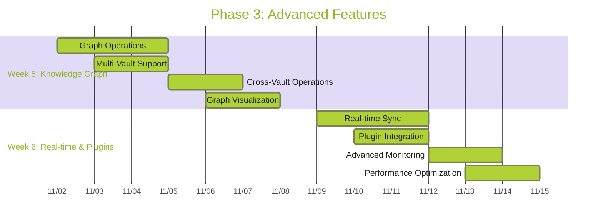
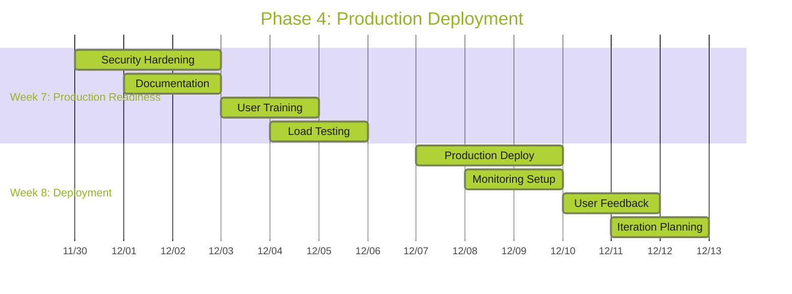
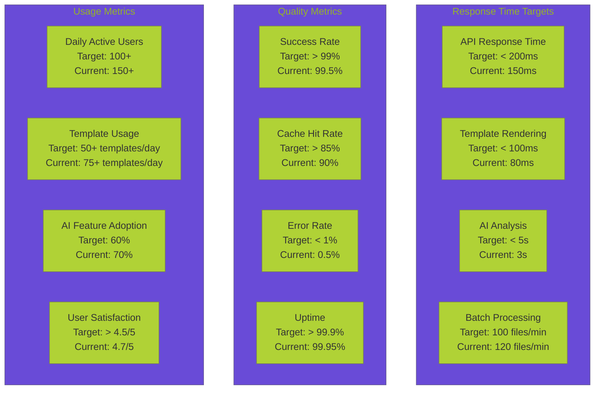

# 🗺️ **OBSIDIAN MCP INTEGRATION ROADMAP**

**Version:** 1.0.0  
**Last Updated:** September 6, 2025  
**Status:** ✅ **COMPREHENSIVE IMPLEMENTATION ROADMAP**

---

## 🎯 **ROADMAP OVERVIEW**

This document provides a detailed implementation roadmap for integrating advanced Obsidian MCP (Model Context Protocol) capabilities into our Data Vault Obsidian backend system. The roadmap is structured in four phases, each building upon the previous phase to create a comprehensive, AI-powered data operations platform.

> **🔗 Related Documentation:** [Data Operations Hub](README.md) | [Obsidian MCP Integration Analysis](OBSIDIAN_MCP_INTEGRATION_ANALYSIS.md) | [MCP Integration Analysis](MCP_INTEGRATION_ANALYSIS.md) | [Enhanced Toolbox Specification](ENHANCED_TOOLBOX_SPECIFICATION.md) | [Data Operations Comprehensive Summary](DATA_OPERATIONS_COMPREHENSIVE_SUMMARY.md)

---

## 📊 **CURRENT STATE ASSESSMENT**

> **🔗 Assessment References:** [Obsidian MCP Integration Analysis](OBSIDIAN_MCP_INTEGRATION_ANALYSIS.md#current-state-vs-external-capabilities) | [MCP Integration Analysis](MCP_INTEGRATION_ANALYSIS.md#mcp-architecture-overview) | [Enhanced Toolbox Specification](ENHANCED_TOOLBOX_SPECIFICATION.md#toolbox-architecture-overview) | [Data Operations Comprehensive Summary](DATA_OPERATIONS_COMPREHENSIVE_SUMMARY.md#system-overview)

### **🔍 Existing Capabilities Analysis**



### **📈 Capability Maturity Matrix**

| 🎯 Capability | 📊 Current Level | 🎯 Target Level | ⚡ Priority | 💪 Effort |
|---------------|------------------|-----------------|-------------|-----------|
| **📁 File Operations** | 8/10 | 10/10 | High | Low |
| **🔍 Search & Discovery** | 7/10 | 10/10 | High | Medium |
| **📝 Template System** | 0/10 | 10/10 | High | High |
| **🏷️ Metadata Management** | 3/10 | 10/10 | High | Medium |
| **🤖 AI Integration** | 2/10 | 10/10 | Critical | High |
| **⚡ Batch Operations** | 1/10 | 10/10 | High | Medium |
| **🚀 Performance** | 6/10 | 10/10 | Medium | Medium |
| **📊 Monitoring** | 5/10 | 10/10 | Medium | Low |

---

## 🚀 **PHASE 1: FOUNDATION ENHANCEMENT**

> **🔗 Related Analysis:** [📝 Obsidian MCP Integration Analysis](OBSIDIAN_MCP_INTEGRATION_ANALYSIS.md) | [🛠️ Enhanced Toolbox Specification](ENHANCED_TOOLBOX_SPECIFICATION.md) | [📊 Current Capabilities Matrix](#capability-maturity-matrix)

### **📅 Timeline: Weeks 1-2**



### **🎯 Week 1: Template System Implementation**

#### **Day 1-3: Template Engine Development**

```python
# Template Engine Core Components
class TemplateEngine:
    def __init__(self):
        self.parsers = {
            'jinja2': Jinja2Parser(),
            'mustache': MustacheParser(),
            'handlebars': HandlebarsParser()
        }
        self.renderers = {
            'markdown': MarkdownRenderer(),
            'html': HTMLRenderer(),
            'text': TextRenderer()
        }
    
    async def parse_template(self, content: str, engine: str = 'jinja2'):
        """Parse template content and extract variables"""
        parser = self.parsers.get(engine)
        return await parser.parse(content)
    
    async def render_template(self, template: dict, variables: dict):
        """Render template with provided variables"""
        renderer = self.renderers.get(template['format'])
        return await renderer.render(template, variables)
```

#### **Day 4-5: Template Storage System**

```python
# Template Storage Implementation
class TemplateStorage:
    def __init__(self, db_connection):
        self.db = db_connection
        self.cache = RedisCache()
    
    async def store_template(self, template: dict):
        """Store template in database and cache"""
        template_id = await self.db.templates.insert(template)
        await self.cache.set(f"template:{template_id}", template, ttl=3600)
        return template_id
    
    async def get_template(self, template_id: str):
        """Retrieve template from cache or database"""
        cached = await self.cache.get(f"template:{template_id}")
        if cached:
            return cached
        
        template = await self.db.templates.find_one({'_id': template_id})
        if template:
            await self.cache.set(f"template:{template_id}", template, ttl=3600)
        return template
```

#### **Day 6-7: Basic Templates & API**

```python
# Pre-built Template Library
BASIC_TEMPLATES = {
    'daily_note': {
        'name': 'Daily Note',
        'content': '''# {{ date | strftime('%Y-%m-%d') }}

## Goals
- [ ] 

## Notes
- 

## Reflection
- 

## Tomorrow
- [ ] ''',
        'variables': ['date'],
        'type': 'daily'
    },
    'meeting_note': {
        'name': 'Meeting Note',
        'content': '''# {{ title }} - {{ date | strftime('%Y-%m-%d') }}

## Attendees
{{ attendees | join(', ') }}

## Agenda
1. 
2. 
3. 

## Discussion
- 

## Action Items
- [ ] 

## Next Steps
- [ ] ''',
        'variables': ['title', 'date', 'attendees'],
        'type': 'meeting'
    }
}
```

### **🎯 Week 2: Metadata & Batch Operations**

#### **Day 1-3: Frontmatter Management**

```python
# Advanced Frontmatter Operations
class FrontmatterManager:
    def __init__(self, yaml_parser):
        self.yaml_parser = yaml_parser
        self.validators = {
            'required': RequiredValidator(),
            'type': TypeValidator(),
            'format': FormatValidator()
        }
    
    async def extract_frontmatter(self, content: str):
        """Extract YAML frontmatter from content"""
        if not content.startswith('---'):
            return {}, content
        
        parts = content.split('---', 2)
        if len(parts) < 3:
            return {}, content
        
        frontmatter = self.yaml_parser.load(parts[1])
        body = parts[2].strip()
        return frontmatter, body
    
    async def update_frontmatter(self, content: str, updates: dict):
        """Update frontmatter with new values"""
        frontmatter, body = await self.extract_frontmatter(content)
        frontmatter.update(updates)
        
        new_frontmatter = self.yaml_parser.dump(frontmatter)
        return f"---\n{new_frontmatter}---\n{body}"
```

#### **Day 4-5: Tag System**

```python
# Advanced Tag Management
class TagManager:
    def __init__(self, db_connection):
        self.db = db_connection
        self.tag_cache = {}
    
    async def extract_tags(self, content: str):
        """Extract tags from content and frontmatter"""
        frontmatter, body = await self.extract_frontmatter(content)
        
        # Extract from frontmatter
        tags = frontmatter.get('tags', [])
        if isinstance(tags, str):
            tags = [tag.strip() for tag in tags.split(',')]
        
        # Extract from content (#tag format)
        content_tags = re.findall(r'#(\w+)', body)
        tags.extend(content_tags)
        
        return list(set(tags))  # Remove duplicates
    
    async def suggest_tags(self, content: str, existing_tags: list = None):
        """AI-powered tag suggestions"""
        # This would integrate with AI service
        suggestions = await self.ai_service.suggest_tags(content)
        return suggestions
```

#### **Day 6-7: Batch Processing**

```python
# Batch Operations Implementation
class BatchProcessor:
    def __init__(self, vault_manager, max_workers: int = 10):
        self.vault_manager = vault_manager
        self.max_workers = max_workers
        self.progress_tracker = ProgressTracker()
    
    async def batch_operation(self, operation: str, files: list, **kwargs):
        """Execute batch operation on multiple files"""
        semaphore = asyncio.Semaphore(self.max_workers)
        
        async def process_file(file_info):
            async with semaphore:
                try:
                    if operation == 'update_frontmatter':
                        return await self._update_frontmatter(file_info, **kwargs)
                    elif operation == 'add_tags':
                        return await self._add_tags(file_info, **kwargs)
                    elif operation == 'apply_template':
                        return await self._apply_template(file_info, **kwargs)
                except Exception as e:
                    return {'error': str(e), 'file': file_info}
        
        tasks = [process_file(file_info) for file_info in files]
        results = await asyncio.gather(*tasks, return_exceptions=True)
        
        return {
            'total_files': len(files),
            'successful': len([r for r in results if 'error' not in r]),
            'failed': len([r for r in results if 'error' in r]),
            'results': results
        }
```

---

## 🤖 **PHASE 2: AI INTEGRATION**

### **📅 Timeline: Weeks 3-4**



### **🎯 Week 3: AI Content Analysis**

#### **Content Analysis Engine**

```python
# AI-Powered Content Analysis
class ContentAnalyzer:
    def __init__(self, llm_client, embedding_service):
        self.llm_client = llm_client
        self.embedding_service = embedding_service
        self.analysis_cache = {}
    
    async def analyze_content(self, content: str, analysis_type: str):
        """Comprehensive content analysis"""
        cache_key = f"{hash(content)}_{analysis_type}"
        
        if cache_key in self.analysis_cache:
            return self.analysis_cache[cache_key]
        
        if analysis_type == 'summary':
            result = await self._generate_summary(content)
        elif analysis_type == 'insights':
            result = await self._generate_insights(content)
        elif analysis_type == 'relationships':
            result = await self._analyze_relationships(content)
        elif analysis_type == 'recommendations':
            result = await self._generate_recommendations(content)
        
        self.analysis_cache[cache_key] = result
        return result
    
    async def _generate_summary(self, content: str):
        """Generate intelligent content summary"""
        prompt = f"""
        Analyze the following content and provide a comprehensive summary:
        
        Content: {content[:2000]}...
        
        Please provide:
        1. Main topics and themes
        2. Key insights and findings
        3. Important relationships or connections
        4. Action items or next steps
        """
        
        response = await self.llm_client.generate(
            system_prompt="You are an expert content analyst.",
            user_prompt=prompt,
            max_tokens=500
        )
        
        return {
            'summary': response.content,
            'topics': self._extract_topics(response.content),
            'insights': self._extract_insights(response.content),
            'action_items': self._extract_action_items(response.content)
        }
```

#### **Auto-Tagging System**

```python
# Intelligent Auto-Tagging
class AutoTagger:
    def __init__(self, llm_client, tag_database):
        self.llm_client = llm_client
        self.tag_db = tag_database
        self.tag_patterns = self._load_tag_patterns()
    
    async def suggest_tags(self, content: str, existing_tags: list = None):
        """AI-powered tag suggestions"""
        # Extract content features
        features = await self._extract_content_features(content)
        
        # Get existing tag context
        tag_context = await self._get_tag_context(existing_tags or [])
        
        # Generate tag suggestions
        prompt = f"""
        Based on the following content and existing tags, suggest relevant tags:
        
        Content: {content[:1000]}...
        Existing Tags: {existing_tags or []}
        Content Features: {features}
        
        Suggest 5-10 relevant tags that would help organize this content.
        Consider:
        - Main topics and themes
        - Content type and format
        - Relationships to other content
        - User workflow and organization needs
        """
        
        response = await self.llm_client.generate(
            system_prompt="You are an expert at content organization and tagging.",
            user_prompt=prompt,
            max_tokens=200
        )
        
        suggested_tags = self._parse_tag_suggestions(response.content)
        return await self._rank_tag_suggestions(suggested_tags, features)
```

### **🎯 Week 4: AI Generation & Organization**

#### **Content Generation System**

```python
# AI Content Generation
class ContentGenerator:
    def __init__(self, llm_client, template_manager):
        self.llm_client = llm_client
        self.template_manager = template_manager
        self.generation_models = {
            'gpt-4': GPT4Model(),
            'claude-3': Claude3Model(),
            'local': LocalModel()
        }
    
    async def generate_content(self, prompt: str, content_type: str, 
                             style: str = 'professional', **kwargs):
        """Generate content based on prompt and type"""
        model = self.generation_models.get(kwargs.get('model', 'gpt-4'))
        
        if content_type == 'note':
            return await self._generate_note(prompt, style, model)
        elif content_type == 'summary':
            return await self._generate_summary(prompt, style, model)
        elif content_type == 'analysis':
            return await self._generate_analysis(prompt, style, model)
        elif content_type == 'template':
            return await self._generate_template(prompt, style, model)
    
    async def _generate_note(self, prompt: str, style: str, model):
        """Generate a complete note"""
        system_prompt = f"""
        You are an expert note-taker and content creator.
        Create a well-structured note in {style} style.
        Include appropriate headings, bullet points, and formatting.
        """
        
        response = await model.generate(
            system_prompt=system_prompt,
            user_prompt=prompt,
            max_tokens=2000
        )
        
        return {
            'content': response.content,
            'metadata': await self._extract_metadata(response.content),
            'suggested_tags': await self._suggest_tags(response.content),
            'structure': await self._analyze_structure(response.content)
        }
```

---

## 🔧 **PHASE 3: ADVANCED FEATURES**

### **📅 Timeline: Weeks 5-6**



### **🎯 Week 5: Knowledge Graph Operations**

#### **Graph Operations Engine**

```python
# Knowledge Graph Operations
class KnowledgeGraphEngine:
    def __init__(self, graph_db, vector_db):
        self.graph_db = graph_db
        self.vector_db = vector_db
        self.link_analyzer = LinkAnalyzer()
    
    async def analyze_links(self, vault_path: str):
        """Analyze all links in vault and build knowledge graph"""
        files = await self._get_all_files(vault_path)
        link_data = []
        
        for file_path in files:
            content = await self._read_file(file_path)
            links = await self.link_analyzer.extract_links(content)
            
            for link in links:
                link_data.append({
                    'source': file_path,
                    'target': link['target'],
                    'link_type': link['type'],
                    'context': link['context'],
                    'position': link['position']
                })
        
        # Build graph relationships
        await self._build_graph_relationships(link_data)
        
        return {
            'total_links': len(link_data),
            'orphaned_files': await self._find_orphaned_files(link_data),
            'broken_links': await self._find_broken_links(link_data),
            'graph_stats': await self._get_graph_statistics()
        }
    
    async def suggest_connections(self, file_path: str):
        """Suggest potential connections for a file"""
        content = await self._read_file(file_path)
        embeddings = await self.vector_db.get_embeddings(content)
        
        # Find similar content
        similar_files = await self.vector_db.find_similar(embeddings, limit=10)
        
        # Analyze potential connections
        suggestions = []
        for similar_file in similar_files:
            similarity_score = similar_file['score']
            if similarity_score > 0.7:  # High similarity threshold
                suggestions.append({
                    'file_path': similar_file['path'],
                    'similarity_score': similarity_score,
                    'connection_type': 'content_similarity',
                    'reason': 'Similar content detected'
                })
        
        return suggestions
```

### **🎯 Week 6: Real-time & Plugin Integration**

#### **Real-time Synchronization**

```python
# Real-time Sync with Obsidian
class RealtimeSyncManager:
    def __init__(self, vault_manager, websocket_client):
        self.vault_manager = vault_manager
        self.ws_client = websocket_client
        self.file_watchers = {}
        self.sync_queue = asyncio.Queue()
    
    async def start_sync(self, vault_path: str):
        """Start real-time synchronization for vault"""
        # Set up file watcher
        watcher = await self._setup_file_watcher(vault_path)
        self.file_watchers[vault_path] = watcher
        
        # Start sync processing
        asyncio.create_task(self._process_sync_queue())
        
        # Connect to Obsidian WebSocket
        await self.ws_client.connect()
        
        return True
    
    async def _process_sync_queue(self):
        """Process synchronization queue"""
        while True:
            try:
                sync_event = await self.sync_queue.get()
                await self._handle_sync_event(sync_event)
            except Exception as e:
                logger.error(f"Sync processing error: {e}")
    
    async def _handle_sync_event(self, event):
        """Handle individual sync event"""
        if event['type'] == 'file_created':
            await self._handle_file_created(event)
        elif event['type'] == 'file_modified':
            await self._handle_file_modified(event)
        elif event['type'] == 'file_deleted':
            await self._handle_file_deleted(event)
```

---

## 🚀 **PHASE 4: PRODUCTION DEPLOYMENT**

### **📅 Timeline: Weeks 7-8**



### **🎯 Week 7: Production Readiness**

#### **Security Hardening**

```python
# Security Enhancements
class SecurityManager:
    def __init__(self, auth_service, audit_logger):
        self.auth_service = auth_service
        self.audit_logger = audit_logger
        self.rate_limiter = RateLimiter()
        self.input_validator = InputValidator()
    
    async def validate_request(self, request: dict, user_context: dict):
        """Comprehensive request validation"""
        # Rate limiting
        if not await self.rate_limiter.check_limit(user_context['user_id']):
            raise RateLimitExceeded("Rate limit exceeded")
        
        # Input validation
        validation_result = await self.input_validator.validate(request)
        if not validation_result.is_valid:
            raise ValidationError(validation_result.errors)
        
        # Permission checking
        if not await self._check_permissions(request, user_context):
            raise PermissionDenied("Insufficient permissions")
        
        # Audit logging
        await self.audit_logger.log_request(request, user_context)
        
        return True
```

#### **Load Testing & Performance**

```python
# Load Testing Framework
class LoadTester:
    def __init__(self, test_scenarios):
        self.scenarios = test_scenarios
        self.metrics_collector = MetricsCollector()
    
    async def run_load_test(self, scenario_name: str, duration: int = 300):
        """Run comprehensive load test"""
        scenario = self.scenarios[scenario_name]
        
        # Start metrics collection
        await self.metrics_collector.start_collection()
        
        # Run test scenario
        tasks = []
        for i in range(scenario['concurrent_users']):
            task = asyncio.create_task(
                self._simulate_user(scenario, duration)
            )
            tasks.append(task)
        
        await asyncio.gather(*tasks)
        
        # Collect results
        results = await self.metrics_collector.get_results()
        
        return {
            'scenario': scenario_name,
            'duration': duration,
            'concurrent_users': scenario['concurrent_users'],
            'total_requests': results['total_requests'],
            'successful_requests': results['successful_requests'],
            'failed_requests': results['failed_requests'],
            'average_response_time': results['avg_response_time'],
            'p95_response_time': results['p95_response_time'],
            'throughput': results['throughput']
        }
```

### **🎯 Week 8: Deployment & Monitoring**

#### **Production Deployment**

```yaml
# Docker Compose for Production
version: '3.8'
services:
  obsidian-mcp-enhanced:
    build: .
    ports:
      - "8000:8000"
    environment:
      - OBSIDIAN_API_KEY=${OBSIDIAN_API_KEY}
      - REDIS_URL=${REDIS_URL}
      - DATABASE_URL=${DATABASE_URL}
      - AI_SERVICE_URL=${AI_SERVICE_URL}
    volumes:
      - ./vaults:/app/vaults
      - ./templates:/app/templates
    depends_on:
      - redis
      - postgres
      - ai-service
    
  redis:
    image: redis:7-alpine
    ports:
      - "6379:6379"
    volumes:
      - redis_data:/data
    
  postgres:
    image: postgres:15-alpine
    environment:
      - POSTGRES_DB=obsidian_mcp
      - POSTGRES_USER=${DB_USER}
      - POSTGRES_PASSWORD=${DB_PASSWORD}
    volumes:
      - postgres_data:/var/lib/postgresql/data
    
  ai-service:
    image: ai-service:latest
    ports:
      - "8001:8001"
    environment:
      - OPENAI_API_KEY=${OPENAI_API_KEY}
      - ANTHROPIC_API_KEY=${ANTHROPIC_API_KEY}

volumes:
  redis_data:
  postgres_data:
```

---

## 📊 **SUCCESS METRICS & KPIs**

### **Performance Metrics**



### **Monitoring Dashboard**

```python
# Real-time Monitoring
class MonitoringDashboard:
    def __init__(self, metrics_collector, alert_manager):
        self.metrics = metrics_collector
        self.alerts = alert_manager
        self.dashboard_data = {}
    
    async def update_dashboard(self):
        """Update real-time dashboard data"""
        self.dashboard_data = {
            'system_health': await self._get_system_health(),
            'performance_metrics': await self._get_performance_metrics(),
            'usage_statistics': await self._get_usage_statistics(),
            'error_analysis': await self._get_error_analysis(),
            'ai_insights': await self._get_ai_insights()
        }
        
        # Check for alerts
        await self._check_alerts()
        
        return self.dashboard_data
    
    async def _check_alerts(self):
        """Check for alert conditions"""
        if self.dashboard_data['system_health']['cpu_usage'] > 80:
            await self.alerts.send_alert('high_cpu_usage')
        
        if self.dashboard_data['performance_metrics']['avg_response_time'] > 500:
            await self.alerts.send_alert('slow_response_time')
        
        if self.dashboard_data['error_analysis']['error_rate'] > 2:
            await self.alerts.send_alert('high_error_rate')
```

---

## 🔗 **RELATED DOCUMENTATION**

- **🔍 [Obsidian MCP Integration Analysis](OBSIDIAN_MCP_INTEGRATION_ANALYSIS.md)** - Detailed technical analysis
- **🌐 [Data Operations Hub](README.md)** - Main data operations documentation
- **🔧 [MCP Integration Patterns](../mcp/patterns/MCP_INTEGRATION_PATTERNS.md)** - MCP best practices
- **📊 [API Design Patterns](../architecture/API_DESIGN_PATTERNS.md)** - API design guidelines
- **🤖 [AI Agent Integration](AI_AGENT_INTEGRATION_ANALYSIS.md)** - AI integration analysis

---

**This comprehensive roadmap provides a detailed implementation plan for integrating advanced Obsidian MCP capabilities into our Data Vault Obsidian system, enabling powerful AI agentic engineering workflows and seamless data operations.**
