****# 🗄️ **DATA OPERATIONS (DATA-OPS) HUB**

**Version:** 3.0.0
**Last Updated:** September 6, 2025
**Status:** ✅ **PRODUCTION-READY DATA OPERATIONS**

---

## 🎯 **OVERVIEW**

The Data Operations Hub provides comprehensive analysis and documentation of all data-driven operations in the Data Vault Obsidian platform. This includes REST API endpoints, MCP integrations, data pipelines, and AI agent workflows that enable seamless data flow between Obsidian vaults, AI agents, and external tooling.

### **Core Mission**

- **Data Flow Analysis** - Complete mapping of data operations from vault to AI agents
- **API Integration** - Comprehensive REST API and MCP tool documentation
- **Performance Optimization** - Analysis and improvement strategies for data operations
- **AI Agent Integration** - Seamless data flow to LangGraph workflows and LLM calls
- **External Tooling** - Integration with external services and MCPs

---

## 📊 **CURRENT STATE ANALYSIS**

### **🔍 System Architecture Overview**

> **📋 Quick Navigation:** [🌐 REST API Analysis](REST_API_ANALYSIS.md) | [🔧 MCP Integration Analysis](MCP_INTEGRATION_ANALYSIS.md) | [🔄 Data Pipeline Analysis](DATA_PIPELINE_ANALYSIS.md) | [🤖 AI Agent Integration](AI_AGENT_INTEGRATION_ANALYSIS.md)

> **🔗 Detailed Analysis:** [🛠️ Enhanced Toolbox Specification](ENHANCED_TOOLBOX_SPECIFICATION.md) | [📝 Obsidian MCP Integration Analysis](OBSIDIAN_MCP_INTEGRATION_ANALYSIS.md) | [📊 Data Operations Comprehensive Summary](DATA_OPERATIONS_COMPREHENSIVE_SUMMARY.md)

> **🗺️ Implementation Roadmap:** [📅 Obsidian MCP Integration Roadmap](OBSIDIAN_MCP_INTEGRATION_ROADMAP.md) | [📈 Success Metrics & KPIs](#success-metrics--kpis) | [🚀 Future Enhancements](#future-enhancements)


---

## 🛠️ **CURRENT TOOLBOX INVENTORY**

> **🔗 Related Documentation:** [🛠️ Enhanced Toolbox Specification](ENHANCED_TOOLBOX_SPECIFICATION.md) | [🔧 MCP Integration Analysis](MCP_INTEGRATION_ANALYSIS.md) | [📊 Current Capabilities Matrix](#current-capabilities-matrix)

### **1. 📁 Obsidian Vault Data Operations**

> **📋 API Reference:** [🌐 REST API Analysis](REST_API_ANALYSIS.md#vault-operations) | **🔧 Implementation:** [🔧 MCP Integration Analysis](MCP_INTEGRATION_ANALYSIS.md#vault-operations-mcp-tools)

#### **📖 Read Operations**

- **`list_vaults()`** - List all available Obsidian vaults
- **`list_files(vault, recursive, filter)`** - List files in vault with filtering
- **`read_note(vault, path)`** - Read specific note content with hash validation
- **`get_daily_note(vault, date)`** - Get or create daily notes
- **`search_simple(query)`** - Simple text search across notes
- **`search_hybrid(query, k, filters)`** - Hybrid vector + graph search

#### **Write Operations**

- **`upsert_note(vault, path, content, dry_run, if_match, mode)`** - Create/update notes
- **`patch_note(vault, path, patch_ops)`** - Patch note content with operations
- **`delete_note(vault, path)`** - Delete notes from vault
- **`approve_operation(tool_call_id, approved_by)`** - Human approval workflow

#### **Data Pipeline Operations**

- **`index_vault()`** - Index entire vault for search
- **`chunk_markdown(content, path)`** - Chunk content by headings
- **`compute_embedding(text)`** - Generate vector embeddings
- **`update_graph_links(source_node_id, links)`** - Update graph relationships

---

## 🔌 **MCP TOOLS & SERVERS**

### **1. Obsidian MCP Server**

- **`obsidian_list_files`** - List files via MCP protocol
- **`obsidian_read_note`** - Read notes via MCP protocol
- **`obsidian_put_file`** - Create/update files via MCP protocol
- **`obsidian_patch_file`** - Patch files via MCP protocol

### **2. Observability MCP Server**

- **`create_trace_event`** - Create trace events for debugging
- **`create_checkpoint`** - Create state checkpoints
- **`get_traces`** - Retrieve trace data
- **`get_checkpoints`** - Retrieve checkpoint data
- **`time_travel_debug`** - Time-travel debugging capabilities
- **`get_performance_metrics`** - Performance monitoring
- **`export_traces_to_langsmith`** - LangSmith integration
- **`analyze_error_patterns`** - Error analysis
- **`get_agent_communication_log`** - Agent communication logs

### **3. Enhanced Obsidian MCP Server**

- **Advanced caching** - Multi-level caching strategies
- **Batch operations** - Bulk data operations
- **Multi-agent communication** - Agent coordination
- **Performance optimization** - Optimized data access

---

## 🌐 **REST API ENDPOINTS**

### **Core Vault Operations**

```
GET    /vaults                           # List all vaults
GET    /vault/{vault}/files              # List files in vault
GET    /vault/{vault}/file/{path}        # Read specific note
PUT    /vault/{vault}/file/{path}        # Create/update note
PATCH  /vault/{vault}/file/{path}        # Patch note content
DELETE /vault/{vault}/file/{path}        # Delete note
```

### **Search & Discovery**

```
POST   /search/simple                    # Simple text search
POST   /search/hybrid                    # Hybrid vector + graph search
GET    /periodic/daily/{vault}           # Daily notes
```

### **MCP Integration**

```
GET    /mcp/tools                        # List MCP tools
POST   /mcp/tools/execute                # Execute MCP tool
POST   /mcp/batch                        # Batch MCP operations
GET    /mcp/debug                        # Debug MCP servers
```

### **Data Pipeline**

```
POST   /index/vault                      # Index vault for search
GET    /index/status                     # Indexing status
POST   /index/rebuild                    # Rebuild indexes
```

### **System Operations**

```
GET    /health                           # Health check
GET    /metrics                          # System metrics
GET    /debug                            # Debug information
```

---

## 🔄 **DATA FLOW ARCHITECTURE**

### **1. Data Ingestion Flow**


### **2. AI Agent Data Flow**


### **3. Search & Retrieval Flow**


---

## 🚀 **PERFORMANCE OPTIMIZATION STRATEGIES**

> **📊 Performance Analysis:** [📈 Performance Metrics](#performance-metrics) | **🔧 Implementation:** [🔄 Data Pipeline Analysis](DATA_PIPELINE_ANALYSIS.md#optimization-strategies) | **📋 API Performance:** [🌐 REST API Analysis](REST_API_ANALYSIS.md#performance-characteristics)

### **1. 🗄️ Caching Layers**

- **Redis Cache** - Fast data access
- **Vector Cache** - Embedding caching
- **Graph Cache** - Relationship caching
- **API Response Cache** - Endpoint caching

### **2. Data Pipeline Optimization**

- **Async Processing** - Non-blocking operations
- **Batch Operations** - Bulk data processing
- **Incremental Indexing** - Only update changed files
- **Parallel Processing** - Multi-threaded operations

### **3. API Performance**

- **Connection Pooling** - Reuse HTTP connections
- **Rate Limiting** - Prevent overload
- **Response Compression** - Reduce bandwidth
- **Pagination** - Handle large datasets

---

## 🔧 **INTEGRATION IMPROVEMENTS**

### **1. External LLM APIs**

- **OpenAI Integration** - GPT models for content generation
- **Anthropic Integration** - Claude models for analysis
- **Local Models** - Ollama integration for privacy
- **Multi-Model Support** - Model selection based on task

### **2. Enhanced MCP Tools**

- **Weather API** - External data sources
- **Dataset Analysis** - Data processing tools
- **Custom Prompts** - Pre-defined templates
- **Elicitation** - Interactive user input

### **3. Advanced Data Operations**

- **Real-time Sync** - Live vault updates
- **Conflict Resolution** - Handle concurrent edits
- **Version Control** - Track changes over time
- **Backup & Recovery** - Data protection

---

## 📈 **MONITORING & OBSERVABILITY**

> **🔧 Observability Implementation:** [🔧 MCP Integration Analysis](MCP_INTEGRATION_ANALYSIS.md#observability-mcp-server) | **📊 Performance Dashboard:** [📊 System Performance Dashboard](#system-performance-dashboard) | **🤖 AI Agent Monitoring:** [🤖 AI Agent Integration Analysis](AI_AGENT_INTEGRATION_ANALYSIS.md#monitoring--observability)

### **1. 📊 Performance Metrics**

- **API Response Times** - Endpoint performance
- **Cache Hit Rates** - Caching effectiveness
- **Indexing Performance** - Data pipeline speed
- **Search Latency** - Query response times

### **2. Error Tracking**

- **API Errors** - Failed requests
- **MCP Tool Errors** - Tool execution failures
- **Data Pipeline Errors** - Indexing issues
- **Agent Communication Errors** - Workflow failures

### **3. LangSmith Integration**

- **Trace Export** - Send traces to LangSmith
- **Performance Analysis** - Detailed metrics
- **Error Pattern Analysis** - Identify issues
- **Agent Communication Logs** - Track interactions

---

## 📊 **COMPREHENSIVE VISUAL ANALYSIS**

### **1. System Performance Dashboard**

```mermaid
%%{init: {'theme': 'base', 'themeVariables': { 'primaryColor': '#B0D236', 'lineColor': '#6F6C4B', 'textColor': '#1E1E1E'}}}%%
graph LR
    subgraph "Performance Metrics"
        API_PERF["API Performance<br/>Response: 50-200ms<br/>Throughput: 100 req/s<br/>Error Rate: <1%"]
        MCP_PERF["MCP Performance<br/>Execution: 100-500ms<br/>Concurrent: 50 req<br/>Error Rate: <2%"]
        PIPELINE_PERF["Pipeline Performance<br/>Indexing: 5-30 min<br/>Search: 100-2000ms<br/>Memory: High"]
        AGENT_PERF["Agent Performance<br/>Workflow: 1-10s<br/>Context: 200-1000ms<br/>Memory: 7 days TTL"]
    end
  
    subgraph "Health Status"
        API_HEALTH["🟢 API Gateway<br/>Healthy"]
        MCP_HEALTH["🟢 MCP Servers<br/>Healthy"]
        PIPELINE_HEALTH["🟡 Data Pipeline<br/>Degraded"]
        AGENT_HEALTH["🟢 AI Agents<br/>Healthy"]
    end
  
    API_PERF --> API_HEALTH
    MCP_PERF --> MCP_HEALTH
    PIPELINE_PERF --> PIPELINE_HEALTH
    AGENT_PERF --> AGENT_HEALTH
```



### **2. Data Volume Distribution**


### **3. API Endpoint Distribution**


### **4. MCP Tools Architecture**


### **5. Data Pipeline Flow Visualization**


### **6. AI Agent Workflow Visualization**


### **7. Performance Optimization Strategies**


### **8. Security & Privacy Framework**


### **9. Monitoring & Observability Stack**


### **10. Data Quality Metrics Dashboard**

```mermaid
%%{init: {'theme': 'base', 'themeVariables': { 'primaryColor': '#B0D236', 'lineColor': '#6F6C4B', 'textColor': '#1E1E1E'}}}%%
graph LR
    subgraph "Data Quality Dimensions"
        FRESHNESS["Freshness<br/>Data Age < 26 hours<br/>Update Frequency"]
        COMPLETENESS["Completeness<br/>Required Fields > 99.9%<br/>Data Coverage"]
        VALIDITY["Validity<br/>Schema Compliance<br/>Data Format"]
        CONSISTENCY["Consistency<br/>Cross-source Validation<br/>Data Integrity"]
    end
  
    subgraph "Quality Scores"
        HIGH["🟢 High Quality<br/>Score > 0.9"]
        MEDIUM["🟡 Medium Quality<br/>Score 0.7-0.9"]
        LOW["🔴 Low Quality<br/>Score < 0.7"]
    end
  
    FRESHNESS --> HIGH
    COMPLETENESS --> HIGH
    VALIDITY --> MEDIUM
    CONSISTENCY --> LOW
```



### **11. Integration Ecosystem Map**


### **12. Future Enhancement Roadmap**


### **13. Error Rate Analysis**


### **14. Memory Usage Patterns**


### **15. Scalability Analysis**


### **16. Security Threat Model**


### **17. Data Lifecycle Management**

```mermaid
%%{init: {'theme': 'base', 'themeVariables': { 'primaryColor': '#B0D236', 'lineColor': '#6F6C4B', 'textColor': '#1E1E1E'}}}%%
graph LR
    subgraph "Data Lifecycle Stages"
        CREATION["Creation<br/>Data Ingestion<br/>Initial Processing"]
        ACTIVE["Active Use<br/>Frequent Access<br/>Real-time Processing"]
        ARCHIVE["Archive<br/>Infrequent Access<br/>Long-term Storage"]
        DESTRUCTION["Destruction<br/>Data Deletion<br/>Secure Erasure"]
    end
  
    subgraph "Storage Tiers"
        HOT_STORAGE["Hot Storage<br/>SSD, Memory<br/>Fast Access"]
        WARM_STORAGE["Warm Storage<br/>HDD, Cache<br/>Medium Access"]
        COLD_STORAGE["Cold Storage<br/>Tape, Glacier<br/>Slow Access"]
    end
  
    subgraph "Retention Policies"
        SHORT_TERM["Short-term<br/>30 days<br/>Active Data"]
        MEDIUM_TERM["Medium-term<br/>1 year<br/>Archived Data"]
        LONG_TERM["Long-term<br/>7 years<br/>Compliance Data"]
    end
  
    CREATION --> HOT_STORAGE
    ACTIVE --> WARM_STORAGE
    ARCHIVE --> COLD_STORAGE
  
    HOT_STORAGE --> SHORT_TERM
    WARM_STORAGE --> MEDIUM_TERM
    COLD_STORAGE --> LONG_TERM
```

### **18. Integration Testing Matrix**

```mermaid
%%{init: {'theme': 'base', 'themeVariables': { 'primaryColor': '#B0D236', 'lineColor': '#6F6C4B', 'textColor': '#1E1E1E'}}}%%
graph TB
    subgraph "Test Categories"
        UNIT_TESTS["Unit Tests<br/>Component Testing<br/>Isolated Functions"]
        INTEGRATION_TESTS["Integration Tests<br/>Service Integration<br/>API Testing"]
        E2E_TESTS["End-to-End Tests<br/>Full Workflow<br/>User Scenarios"]
        PERFORMANCE_TESTS["Performance Tests<br/>Load Testing<br/>Stress Testing"]
    end
  
    subgraph "Test Coverage"
        API_COVERAGE["API Coverage<br/>95% Endpoints<br/>All Methods"]
        MCP_COVERAGE["MCP Coverage<br/>90% Tools<br/>Error Scenarios"]
        PIPELINE_COVERAGE["Pipeline Coverage<br/>85% Flows<br/>Edge Cases"]
        AGENT_COVERAGE["Agent Coverage<br/>80% Workflows<br/>Context Scenarios"]
    end
  
    subgraph "Test Automation"
        CI_CD["CI/CD Pipeline<br/>Automated Testing<br/>Continuous Integration"]
        REGRESSION["Regression Testing<br/>Change Validation<br/>Quality Gates"]
        MONITORING["Test Monitoring<br/>Test Metrics<br/>Quality Trends"]
    end
  
    UNIT_TESTS --> API_COVERAGE
    INTEGRATION_TESTS --> MCP_COVERAGE
    E2E_TESTS --> PIPELINE_COVERAGE
    PERFORMANCE_TESTS --> AGENT_COVERAGE
  
    API_COVERAGE --> CI_CD
    MCP_COVERAGE --> REGRESSION
    PIPELINE_COVERAGE --> MONITORING
    AGENT_COVERAGE --> CI_CD
```

### **19. Enhanced Testing Infrastructure**

#### **🚀 Quick Start Commands**

```powershell
# Comprehensive test suite
.\scripts\testing\enhanced_test_launcher.ps1

# Individual test runners
.\scripts\testing\unit\test_runner.ps1
.\scripts\testing\integration\test_runner.ps1
.\scripts\testing\e2e\test_runner.ps1
.\scripts\testing\playwright\test_runner.ps1
.\scripts\testing\performance\test_runner.ps1
.\scripts\testing\mcp_analyzer.ps1
```

#### **📊 Test Reports & URLs**

```powershell
# Open test reports in browser
start test-reports\unit\unit_test_report.html
start test-reports\integration\integration_test_report.html
start test-reports\e2e\e2e_test_report.html
start test-reports\playwright\playwright_test_report.html
start test-reports\performance\performance_test_report.html
start test-reports\mcp-analysis\mcp_analysis_report.html
start test-reports\coverage\index.html
```

#### **🎯 Test Categories**

| 🧪 Category | 🎯 Purpose | ⚡ Command | 📊 Reports |
|-------------|------------|------------|------------|
| **🧩 Unit Tests** | Component testing in isolation | `.\scripts\testing\unit\test_runner.ps1` | `test-reports/unit/` |
| **🔗 Integration Tests** | Service interaction and API testing | `.\scripts\testing\integration\test_runner.ps1` | `test-reports/integration/` |
| **🔄 E2E Tests** | Full system integration and workflow validation | `.\scripts\testing\e2e\test_runner.ps1` | `test-reports/e2e/` |
| **🎭 Playwright Tests** | Web UI testing and browser automation | `.\scripts\testing\playwright\test_runner.ps1` | `test-reports/playwright/` |
| **⚡ Performance Tests** | Load testing and performance analysis | `.\scripts\testing\performance\test_runner.ps1` | `test-reports/performance/` |
| **🔍 MCP Analysis** | MCP server functionality and refactoring analysis | `.\scripts\testing\mcp_analyzer.ps1` | `test-reports/mcp-analysis/` |

#### **🔧 Advanced Test Options**

```powershell
# Run with specific patterns
.\scripts\testing\unit\test_runner.ps1 -TestPattern "test_mcp*" -Coverage -Verbose

# Performance tests with custom load
.\scripts\testing\performance\test_runner.ps1 -ConcurrentUsers 20 -TestDuration 120 -LoadPattern "burst"

# Playwright tests with browser options
.\scripts\testing\playwright\test_runner.ps1 -Browser "chromium" -Headless -Screenshot -Video

# Integration tests without service management
.\scripts\testing\integration\test_runner.ps1 -StartServices:$false -StopServices:$false
```

### **20. Data Flow Performance Analysis**

```mermaid
%%{init: {'theme': 'base', 'themeVariables': { 'primaryColor': '#B0D236', 'lineColor': '#6F6C4B', 'textColor': '#1E1E1E'}}}%%
graph LR
    subgraph "Request Flow Performance"
        API_ENTRY["API Entry<br/>0-10ms"]
        AUTH_CHECK["Auth Check<br/>5-15ms"]
        CACHE_CHECK["Cache Check<br/>1-5ms"]
        DB_QUERY["DB Query<br/>10-100ms"]
        PROCESSING["Processing<br/>50-200ms"]
        RESPONSE["Response<br/>5-20ms"]
    end
  
    subgraph "Performance Bottlenecks"
        DB_BOTTLENECK["Database<br/>Primary Bottleneck"]
        PROCESSING_BOTTLENECK["Processing<br/>Secondary Bottleneck"]
        CACHE_MISS["Cache Miss<br/>Occasional Issue"]
    end
  
    API_ENTRY --> AUTH_CHECK
    AUTH_CHECK --> CACHE_CHECK
    CACHE_CHECK --> DB_QUERY
    DB_QUERY --> PROCESSING
    PROCESSING --> RESPONSE
  
    DB_QUERY --> DB_BOTTLENECK
    PROCESSING --> PROCESSING_BOTTLENECK
    CACHE_CHECK --> CACHE_MISS
```

### **20. Comprehensive System Health Dashboard**

```mermaid
%%{init: {'theme': 'base', 'themeVariables': { 'primaryColor': '#B0D236', 'lineColor': '#6F6C4B', 'textColor': '#1E1E1E'}}}%%
graph TB
    subgraph "System Health Overview"
        OVERALL_HEALTH["🟢 Overall System Health<br/>95% Operational<br/>5% Degraded"]
    end
  
    subgraph "Component Status"
        API_STATUS["🟢 API Gateway<br/>99.9% Uptime<br/>Response: 150ms avg"]
        MCP_STATUS["🟢 MCP Servers<br/>99.8% Uptime<br/>Tools: 20/20 Active"]
        PIPELINE_STATUS["🟡 Data Pipeline<br/>98.5% Uptime<br/>Indexing: 15min avg"]
        AGENT_STATUS["🟢 AI Agents<br/>99.7% Uptime<br/>Workflows: 95% Success"]
    end
  
    subgraph "Key Metrics"
        THROUGHPUT["Throughput<br/>1000 req/min<br/>Peak: 2000 req/min"]
        LATENCY["Latency<br/>150ms avg<br/>P95: 500ms"]
        ERROR_RATE["Error Rate<br/>0.5% overall<br/>Critical: 0.1%"]
        AVAILABILITY["Availability<br/>99.8% SLA<br/>MTTR: 5min"]
    end
  
    OVERALL_HEALTH --> API_STATUS
    OVERALL_HEALTH --> MCP_STATUS
    OVERALL_HEALTH --> PIPELINE_STATUS
    OVERALL_HEALTH --> AGENT_STATUS
  
    API_STATUS --> THROUGHPUT
    MCP_STATUS --> LATENCY
    PIPELINE_STATUS --> ERROR_RATE
    AGENT_STATUS --> AVAILABILITY
```

---

## 🔗 **RELATED DOCUMENTATION**

### **Core Architecture Patterns**

- **🌐 [API Design Patterns](../architecture/API_DESIGN_PATTERNS.md)** - RESTful APIs, authentication, rate limiting
- **🗄️ [Database Patterns](../architecture/DATABASE_PATTERNS.md)** - Data persistence, transactions, migrations
- **🚀 [Caching Patterns](../architecture/CACHING_PATTERNS.md)** - Multi-level caching, invalidation strategies
- **⚡ [Async Patterns](../architecture/ASYNC_PATTERNS.md)** - Asynchronous programming, concurrency

### **Integration & Communication**

- **🔗 [Integration Patterns](../architecture/INTEGRATION_PATTERNS.md)** - Data pipeline, vector database, graph database, API gateway integration
- **📡 [Communication Patterns](../architecture/COMMUNICATION_PATTERNS.md)** - Request-response, pub-sub, message queues, API gateway
- **🔄 [Event-Driven Patterns](../architecture/EVENT_DRIVEN_PATTERNS.md)** - Event sourcing, CQRS, event streaming, choreography

### **AI/ML Integration**

- **🕸️ [LangGraph Workflow Patterns](../architecture/LANGGRAPH_WORKFLOW_PATTERNS.md)** - AI workflow orchestration, agent management, state handling
- **🔗 [Obsidian Integration Patterns](../architecture/OBSIDIAN_INTEGRATION_PATTERNS.md)** - Knowledge management, content automation, plugin integration
- **📊 [Monitoring Observability Patterns](../architecture/MONITORING_OBSERVABILITY_PATTERNS.md)** - Metrics collection, logging, tracing, alerting

### **MCP Documentation**

- **🔌 [MCP Documentation Hub](../mcp/README.md)** - Complete MCP documentation and integration guides
- **🔧 [MCP Integration Patterns](../mcp/patterns/MCP_INTEGRATION_PATTERNS.md)** - MCP server patterns and best practices
- **📈 [MCP Development Roadmap](../mcp/roadmaps/MCP_DEVELOPMENT_ROADMAP.md)** - Future MCP enhancements
- **🔗 [Obsidian MCP Integration Analysis](OBSIDIAN_MCP_INTEGRATION_ANALYSIS.md)** - Comprehensive Obsidian MCP integration analysis
- **🗺️ [Obsidian MCP Integration Roadmap](OBSIDIAN_MCP_INTEGRATION_ROADMAP.md)** - Detailed implementation roadmap
- **🛠️ [Enhanced Toolbox Specification](ENHANCED_TOOLBOX_SPECIFICATION.md)** - Comprehensive tool specifications and capabilities
- **📋 [Data Operations Comprehensive Summary](DATA_OPERATIONS_COMPREHENSIVE_SUMMARY.md)** - Complete system overview and implementation summary

### **📚 Data Operations Documentation Index**

- **📊 [Data Operations Index](DATA_OPERATIONS_INDEX.md)** - Complete index of all data operations documentation
- **🔍 [REST API Analysis](REST_API_ANALYSIS.md)** - Comprehensive REST API endpoint analysis and capabilities
- **🔌 [MCP Integration Analysis](MCP_INTEGRATION_ANALYSIS.md)** - Deep dive into MCP server integration patterns
- **⚡ [Data Pipeline Analysis](DATA_PIPELINE_ANALYSIS.md)** - Data processing and pipeline architecture analysis
- **🤖 [AI Agent Integration Analysis](AI_AGENT_INTEGRATION_ANALYSIS.md)** - AI agent workflow and context engineering analysis
- **📋 [Data Operations Complete Summary](DATA_OPERATIONS_COMPLETE_SUMMARY.md)** - Executive summary of all data operations

---

## 🗺️ **COMPREHENSIVE NAVIGATION INDEX**

> **🗺️ Complete Navigation Hub:** [📋 Navigation Index](NAVIGATION_INDEX.md) | **📊 Document Matrix:** [📋 Data Operations Index](DATA_OPERATIONS_INDEX.md) | **🎨 Enhancement Summary:** [📋 Emoji Enhancement Summary](EMOJI_ENHANCEMENT_SUMMARY.md)

### **📋 Quick Access Links**

| 📄 Document | 🎯 Purpose | 🔗 Key Sections |
|-------------|------------|-----------------|
| **[🏠 Data Operations Hub](README.md)** | Main documentation hub | [🏗️ System Architecture](#system-architecture-overview) \| [📊 Performance Analysis](#performance-analysis) \| [🔗 Integration Patterns](#integration-patterns) |
| **[🌐 REST API Analysis](REST_API_ANALYSIS.md)** | API endpoint analysis | [📋 API Endpoint Inventory](#api-endpoint-inventory) \| [⚡ Performance Characteristics](#performance-characteristics) \| [🔒 Security Analysis](#security-analysis) |
| **[🔧 MCP Integration Analysis](MCP_INTEGRATION_ANALYSIS.md)** | MCP server integration | [🏛️ MCP Architecture Overview](#mcp-architecture-overview) \| [⚙️ Current Implementations](#current-implementations) \| [🚀 Enhancement Opportunities](#enhancement-opportunities) |
| **[🔄 Data Pipeline Analysis](DATA_PIPELINE_ANALYSIS.md)** | Data processing pipeline | [🏗️ Data Pipeline Architecture](#data-pipeline-architecture) \| [⚙️ Processing Stages](#processing-stages) \| [🚀 Optimization Strategies](#optimization-strategies) |
| **[🤖 AI Agent Integration Analysis](AI_AGENT_INTEGRATION_ANALYSIS.md)** | AI agent workflows | [🏛️ AI Agent Architecture](#ai-agent-architecture) \| [🧠 Context Engineering](#context-engineering) \| [🔄 Workflow Patterns](#workflow-patterns) |
| **[🛠️ Enhanced Toolbox Specification](ENHANCED_TOOLBOX_SPECIFICATION.md)** | Tool specifications | [🏗️ Toolbox Architecture](#toolbox-architecture-overview) \| [📂 Tool Categories](#tool-categories) \| [📖 Implementation Guide](#implementation-guide) |
| **[📝 Obsidian MCP Integration Analysis](OBSIDIAN_MCP_INTEGRATION_ANALYSIS.md)** | Obsidian MCP analysis | [⚖️ Current State vs External](#current-state-vs-external-capabilities) \| [🔗 Integration Opportunities](#integration-opportunities) \| [⭐ Best Practices](#best-practices) |
| **[🗺️ Obsidian MCP Integration Roadmap](OBSIDIAN_MCP_INTEGRATION_ROADMAP.md)** | Implementation roadmap | [📊 Current State Assessment](#current-state-assessment) \| [📅 Phase Implementation](#phase-implementation) \| [📈 Success Metrics](#success-metrics) |
| **[📊 Data Operations Comprehensive Summary](DATA_OPERATIONS_COMPREHENSIVE_SUMMARY.md)** | Executive summary | [🏗️ System Overview](#system-overview) \| [🏆 Key Achievements](#key-achievements) \| [🚀 Future Roadmap](#future-roadmap) |
| **[📅 Changelog Index](../changelogs/CHANGELOG_INDEX.md)** | Development history | [📅 2025-09-06 Changelogs](../changelogs/2025-09-06/) \| [📅 2025-09-07 Changelogs](../changelogs/2025-09-07/) \| [📊 Changelog Statistics](../changelogs/CHANGELOG_INDEX.md#changelog-statistics) |

### **🔗 Cross-Reference Matrix**

> **🗺️ Navigation Hub:** [📋 Navigation Index](NAVIGATION_INDEX.md) | [📊 Document Matrix](DATA_OPERATIONS_INDEX.md) | [🎨 Enhancement Summary](EMOJI_ENHANCEMENT_SUMMARY.md)

| 📄 From Document | 🎯 To Document | 🔗 Relationship | 📍 Key Sections |
|------------------|----------------|-----------------|-----------------|
| **🏠 README.md** | All documents | Central hub with links to all analyses | [📊 System Overview](#system-architecture-overview) \| [🛠️ Toolbox Inventory](#current-toolbox-inventory) \| [📈 Performance Analysis](#performance-optimization-strategies) |
| **🌐 REST_API_ANALYSIS.md** | MCP_INTEGRATION_ANALYSIS.md | API endpoints used by MCP tools | [🔌 API Endpoints](REST_API_ANALYSIS.md#api-endpoint-inventory) → [🔧 MCP Tools](MCP_INTEGRATION_ANALYSIS.md#current-implementations) |
| **🔧 MCP_INTEGRATION_ANALYSIS.md** | AI_AGENT_INTEGRATION_ANALYSIS.md | MCP tools used by AI agents | [⚙️ MCP Servers](MCP_INTEGRATION_ANALYSIS.md#mcp-server-architecture) → [🤖 AI Workflows](AI_AGENT_INTEGRATION_ANALYSIS.md#ai-workflow-patterns) |
| **🔄 DATA_PIPELINE_ANALYSIS.md** | MCP_INTEGRATION_ANALYSIS.md | Data pipeline feeds MCP tools | [🏗️ Pipeline Architecture](DATA_PIPELINE_ANALYSIS.md#data-pipeline-architecture) → [🔧 MCP Integration](MCP_INTEGRATION_ANALYSIS.md#integration-patterns) |
| **🤖 AI_AGENT_INTEGRATION_ANALYSIS.md** | ENHANCED_TOOLBOX_SPECIFICATION.md | AI agents use enhanced tools | [🧠 AI Patterns](AI_AGENT_INTEGRATION_ANALYSIS.md#ai-integration-patterns) → [🛠️ Tool Specifications](ENHANCED_TOOLBOX_SPECIFICATION.md#tool-categories-breakdown) |
| **📝 OBSIDIAN_MCP_INTEGRATION_ANALYSIS.md** | OBSIDIAN_MCP_INTEGRATION_ROADMAP.md | Analysis informs roadmap | [⚖️ Current State](OBSIDIAN_MCP_INTEGRATION_ANALYSIS.md#current-state-vs-external-capabilities) → [📅 Implementation Plan](OBSIDIAN_MCP_INTEGRATION_ROADMAP.md#phase-implementation) |
| **🛠️ ENHANCED_TOOLBOX_SPECIFICATION.md** | All documents | Tool specifications support all operations | [📂 Tool Categories](ENHANCED_TOOLBOX_SPECIFICATION.md#tool-categories-breakdown) → [🔗 Cross-References](#cross-reference-matrix) |
| **📊 DATA_OPERATIONS_COMPREHENSIVE_SUMMARY.md** | All documents | Executive summary with comprehensive overview | [🏗️ System Overview](DATA_OPERATIONS_COMPREHENSIVE_SUMMARY.md#system-overview) → [🚀 Implementation Roadmap](DATA_OPERATIONS_COMPREHENSIVE_SUMMARY.md#enhanced-capabilities-roadmap) |

---

## 🎯 **NEXT STEPS & ROADMAP**

> **🗺️ Detailed Implementation:** [📅 Obsidian MCP Integration Roadmap](OBSIDIAN_MCP_INTEGRATION_ROADMAP.md) | **📊 Success Metrics:** [📈 Success Metrics & KPIs](#success-metrics--kpis) | **🔧 Implementation Guide:** [🛠️ Enhanced Toolbox Specification](ENHANCED_TOOLBOX_SPECIFICATION.md)

### **⚡ Phase 1: Current State Optimization (Weeks 1-2)**

> **🔗 Phase 1 Details:** [🗺️ Phase 1 Roadmap](OBSIDIAN_MCP_INTEGRATION_ROADMAP.md#phase-1-foundation) | [📊 Performance Analysis](README.md#performance-optimization-strategies) | [🔧 Current State Analysis](README.md#current-state-analysis)

- [ ] **📊 Performance Analysis** - Complete performance audit → [📊 Performance Dashboard](README.md#system-performance-dashboard) | [🔧 Observability MCP](MCP_INTEGRATION_ANALYSIS.md#observability-mcp-server)
- [ ] **🗄️ Cache Optimization** - Improve caching strategies → [📊 Caching Strategy](README.md#caching-layers) | [🔄 Cache Pipeline](DATA_PIPELINE_ANALYSIS.md#cache-optimization)
- [ ] **🚦 API Rate Limiting** - Implement proper rate limiting → [🌐 API Rate Limiting](REST_API_ANALYSIS.md#rate-limiting-implementation) | [🔧 MCP Rate Control](MCP_INTEGRATION_ANALYSIS.md#rate-limiting-patterns)
- [ ] **⚠️ Error Handling** - Enhance error handling → [🔧 Error Handling](MCP_INTEGRATION_ANALYSIS.md#error-handling-patterns) | [📊 Error Monitoring](README.md#error-tracking)

### **🔗 Phase 2: Enhanced Integrations (Weeks 3-4)**

> **🔗 Phase 2 Details:** [🗺️ Phase 2 Roadmap](OBSIDIAN_MCP_INTEGRATION_ROADMAP.md#phase-2-ai-integration) | [🤖 AI Integration](AI_AGENT_INTEGRATION_ANALYSIS.md#ai-integration-patterns) | [🔧 MCP Enhancement](MCP_INTEGRATION_ANALYSIS.md#enhancement-opportunities)

- [ ] **🤖 External LLM APIs** - Add OpenAI, Anthropic integration → [🤖 LLM Integration](AI_AGENT_INTEGRATION_ANALYSIS.md#llm-integration-patterns) | [🔧 External APIs](MCP_INTEGRATION_ANALYSIS.md#external-api-integration)
- [ ] **🛠️ Advanced MCP Tools** - Weather, dataset analysis tools → [🛠️ Enhanced Toolbox](ENHANCED_TOOLBOX_SPECIFICATION.md#tool-categories-breakdown) | [🔧 MCP Tools](MCP_INTEGRATION_ANALYSIS.md#advanced-mcp-tools)
- [ ] **🔄 Real-time Sync** - Live vault updates → [🔄 Real-time Pipeline](DATA_PIPELINE_ANALYSIS.md#real-time-synchronization) | [🔧 Sync MCP](MCP_INTEGRATION_ANALYSIS.md#real-time-sync-patterns)
- [ ] **⚖️ Conflict Resolution** - Handle concurrent edits → [🔄 Conflict Resolution](DATA_PIPELINE_ANALYSIS.md#conflict-resolution) | [🔧 Edit Management](MCP_INTEGRATION_ANALYSIS.md#edit-conflict-handling)

### **🧠 Phase 3: AI Agent Enhancement (Weeks 5-6)**

> **🔗 Phase 3 Details:** [🗺️ Phase 3 Roadmap](OBSIDIAN_MCP_INTEGRATION_ROADMAP.md#phase-3-advanced-features) | [🤖 AI Agent Patterns](AI_AGENT_INTEGRATION_ANALYSIS.md#ai-agent-architecture) | [🧠 Context Engineering](AI_AGENT_INTEGRATION_ANALYSIS.md#context-engineering-patterns)

- [ ] **🧠 Context Engineering** - Advanced context management → [🧠 Context Patterns](AI_AGENT_INTEGRATION_ANALYSIS.md#context-engineering-patterns) | [🔧 Context MCP](MCP_INTEGRATION_ANALYSIS.md#context-management)
- [ ] **🤝 Agent Coordination** - Multi-agent workflows → [🤝 Multi-Agent](AI_AGENT_INTEGRATION_ANALYSIS.md#multi-agent-coordination) | [🔧 Agent MCP](MCP_INTEGRATION_ANALYSIS.md#agent-coordination-patterns)
- [ ] **⚡ Workflow Optimization** - LangGraph performance → [⚡ LangGraph Optimization](AI_AGENT_INTEGRATION_ANALYSIS.md#langgraph-optimization) | [🔧 Workflow MCP](MCP_INTEGRATION_ANALYSIS.md#workflow-management)
- [ ] **🧠 Memory Management** - Persistent agent memory → [🧠 Memory Patterns](AI_AGENT_INTEGRATION_ANALYSIS.md#memory-management-patterns) | [🔧 Memory MCP](MCP_INTEGRATION_ANALYSIS.md#memory-management)

### **🚀 Phase 4: Production Deployment (Weeks 7-8)**

> **🔗 Phase 4 Details:** [🗺️ Phase 4 Roadmap](OBSIDIAN_MCP_INTEGRATION_ROADMAP.md#phase-4-production-deployment) | [📊 Production Monitoring](README.md#monitoring--observability) | [🔒 Security Hardening](README.md#security--privacy-framework)

- [ ] **📊 Production Monitoring** - Comprehensive observability → [📊 Monitoring Dashboard](README.md#monitoring--observability) | [🔧 Observability MCP](MCP_INTEGRATION_ANALYSIS.md#observability-mcp-server)
- [ ] **⚡ Performance Tuning** - Optimize for production load → [⚡ Performance Optimization](README.md#performance-optimization-strategies) | [📊 Load Testing](README.md#load-testing-strategies)
- [ ] **🔒 Security Hardening** - Production security measures → [🔒 Security Framework](README.md#security--privacy-framework) | [🔧 Security MCP](MCP_INTEGRATION_ANALYSIS.md#security-patterns)
- [ ] **📚 Documentation** - Complete operational documentation → [📚 Documentation Hub](README.md#comprehensive-navigation-index) | [📋 Documentation Index](NAVIGATION_INDEX.md)

---

**Last Updated:** September 6, 2025
**Data Operations Version:** 3.0.0
**Status:** ✅ **PRODUCTION-READY DATA OPERATIONS**

**🗄️ DATA OPERATIONS HUB COMPLETE! 🗄️**
