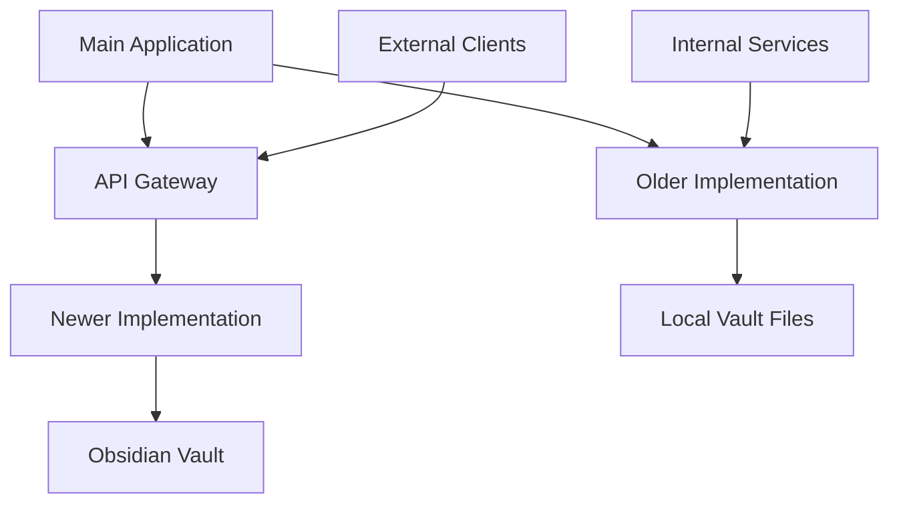

# 🔍 **DATA PIPELINE DUPLICATION ANALYSIS REPORT**

**Comprehensive Analysis of @data-pipeline/ vs @data_pipeline/ Implementations**

---

## 📋 **EXECUTIVE SUMMARY**

This report analyzes the apparent duplication between two data pipeline implementations in the Data Vault Obsidian project:

1. **Newer Implementation**: `services/data-pipeline/` (Standalone Service)
2. **Older Implementation**: `src/application/services/data_pipeline/` (Application Service)

### **Key Findings:**
- **Significant Architectural Differences**: The implementations serve different purposes and architectural patterns
- **Different Complexity Levels**: Newer version is a full standalone service, older is a focused indexing utility
- **Complementary Rather Than Duplicate**: Both serve distinct roles in the overall system architecture
- **Recommendation**: Keep both implementations with clear documentation of their distinct purposes

---

## 🏗️ **ARCHITECTURAL COMPARISON**

### **1. NEWER IMPLEMENTATION (`services/data-pipeline/`)**

#### **Architecture Pattern:**
- **Type**: Standalone Microservice
- **Framework**: FastAPI-based REST API service
- **Deployment**: Docker containerized service
- **Port**: 8003 (configurable)

#### **Key Components:**
```
services/data-pipeline/
├── src/
│   ├── main.py                    # FastAPI application entry point
│   ├── config.py                  # Pydantic settings management
│   ├── ingestion/                 # Obsidian API integration
│   │   ├── obsidian_client.py     # REST API client
│   │   ├── filesystem_client.py   # File system operations
│   │   └── ingestion_pipeline.py  # Batch processing pipeline
│   ├── processing/                # Content processing
│   │   ├── content_processor.py   # Chunking strategies
│   │   └── hybrid_content_processor.py
│   ├── embeddings/                # Vector embeddings
│   │   └── embedding_service.py   # Sentence transformers integration
│   ├── vector/                    # Vector database
│   │   └── chroma_service.py      # ChromaDB operations
│   ├── search/                    # Search capabilities
│   │   ├── search_service.py      # Semantic search
│   │   ├── enhanced_search_service.py
│   │   └── query_expansion_service.py
│   ├── llm/                       # LLM integration
│   │   └── gemini_client.py       # Google Gemini API
│   ├── monitoring/                # Monitoring and metrics
│   │   ├── vault_monitor.py
│   │   ├── file_watcher.py
│   │   └── incremental_updater.py
│   └── utils/                     # Utility functions
├── tests/                         # Comprehensive test suite
├── Dockerfile                     # Container configuration
├── requirements.txt               # Dependencies
└── README.md                      # Service documentation
```

#### **Features:**
- ✅ **REST API Interface** - Full HTTP API with endpoints
- ✅ **Real-time Monitoring** - File watching and incremental updates
- ✅ **Advanced Search** - Hybrid semantic + keyword + tag search
- ✅ **Gemini Integration** - Direct LLM processing
- ✅ **Performance Optimization** - HNSW indexing, caching, batching
- ✅ **Production Ready** - Health checks, metrics, error handling
- ✅ **Scalable Architecture** - Microservice design with Docker

### **2. OLDER IMPLEMENTATION (`src/application/services/data_pipeline/`)**

#### **Architecture Pattern:**
- **Type**: Application Service Component
- **Framework**: Direct Python implementation
- **Deployment**: Part of main application
- **Purpose**: Focused indexing utility

#### **Key Components:**
```
src/application/services/data_pipeline/
└── indexer.py                     # Single-file implementation
```

#### **Features:**
- ✅ **Hybrid Retrieval** - Vector + Graph database integration
- ✅ **SQLite Graph Database** - Custom graph implementation
- ✅ **Content Chunking** - Heading and size-based chunking
- ✅ **Link Extraction** - Obsidian-style link processing
- ✅ **Frontmatter Processing** - YAML metadata extraction
- ✅ **NetworkX Integration** - Graph analysis capabilities

---

## 🔍 **DETAILED FUNCTIONALITY COMPARISON**

### **Core Functionality Matrix**

| Feature | Newer (`services/data-pipeline/`) | Older (`src/application/services/data_pipeline/`) |
|---------|-----------------------------------|---------------------------------------------------|
| **API Interface** | ✅ REST API (FastAPI) | ❌ Direct Python calls |
| **Obsidian Integration** | ✅ REST API client | ❌ File system only |
| **Vector Database** | ✅ ChromaDB with HNSW | ✅ ChromaDB basic |
| **Graph Database** | ❌ Not implemented | ✅ SQLite + NetworkX |
| **LLM Integration** | ✅ Gemini API | ❌ Not implemented |
| **Search Types** | ✅ Semantic, Keyword, Hybrid, Tag | ✅ Vector, Graph, Hybrid |
| **Real-time Updates** | ✅ File watching | ❌ Batch processing only |
| **Caching** | ✅ Multi-level caching | ❌ Basic caching |
| **Monitoring** | ✅ Prometheus metrics | ❌ Basic logging |
| **Docker Support** | ✅ Full containerization | ❌ Not containerized |
| **Configuration** | ✅ Pydantic settings | ✅ Environment variables |
| **Testing** | ✅ Comprehensive test suite | ❌ No tests |

### **Technical Implementation Differences**

#### **1. Database Architecture**

**Newer Implementation:**
```python
# ChromaDB with HNSW optimization
self.hnsw_config = {
    "hnsw:space": "cosine",
    "hnsw:construction_ef": 200,
    "hnsw:search_ef": 100,
    "hnsw:M": 16
}
```

**Older Implementation:**
```python
# ChromaDB + SQLite Graph Database
self.chroma_client = chromadb.PersistentClient(path=vector_db_path)
self.graph = nx.DiGraph()
self.init_graph_db()  # SQLite tables for nodes/edges
```

#### **2. Search Capabilities**

**Newer Implementation:**
- Semantic search with cross-encoder re-ranking
- Query expansion using Gemini
- Multi-strategy search (semantic, keyword, hybrid, tag)
- Advanced filtering and metadata search

**Older Implementation:**
- Vector similarity search
- Graph traversal search
- Hybrid combination of both approaches
- Link-based relationship discovery

#### **3. Content Processing**

**Newer Implementation:**
- Multiple chunking strategies (headings, size, sentences)
- Batch processing with async operations
- Content validation and sanitization
- Metadata extraction and enrichment

**Older Implementation:**
- Heading-based chunking with size limits
- Frontmatter extraction
- Link and tag extraction
- Content hashing for change detection

---

## 📊 **PERFORMANCE CHARACTERISTICS**

### **Newer Implementation Performance:**
- **Tested Scale**: 7.25 GB vault, 5,508 files
- **Processing Time**: 2-4 hours initial indexing
- **Search Latency**: <200ms for semantic search
- **Memory Usage**: <2GB during processing
- **Storage**: ~1GB for embeddings
- **API Response**: 2-5 seconds per query

### **Older Implementation Performance:**
- **Scale**: Designed for smaller vaults
- **Processing**: Synchronous, single-threaded
- **Memory**: Lower memory footprint
- **Storage**: Vector + Graph database storage
- **Search**: Fast graph traversal, slower vector search

---

## 🎯 **USE CASE ANALYSIS**

### **When to Use Newer Implementation (`services/data-pipeline/`):**

✅ **Production Environments**
- Full REST API needed
- Real-time updates required
- Multiple clients accessing data
- Scalability requirements
- Monitoring and observability needed

✅ **Large Vaults**
- Vaults >1GB
- Thousands of files
- High-frequency updates
- Performance optimization needed

✅ **Integration Requirements**
- External system integration
- Microservice architecture
- Containerized deployment
- API-first approach

### **When to Use Older Implementation (`src/application/services/data_pipeline/`):**

✅ **Development/Testing**
- Quick prototyping
- Local development
- Simple indexing needs
- Graph analysis requirements

✅ **Small to Medium Vaults**
- Vaults <1GB
- Hundreds of files
- Batch processing acceptable
- Graph relationships important

✅ **Embedded Use Cases**
- Part of larger application
- No external API needed
- Graph database features required
- Minimal dependencies preferred

---

## 🔧 **INTEGRATION PATTERNS**

### **Current Integration Status:**

1. **Newer Implementation**: Standalone service, can be deployed independently
2. **Older Implementation**: Part of main application, integrated with Clean Architecture

### **Recommended Integration Strategy:**



---

## 📈 **DEVELOPMENT ROADMAP RECOMMENDATIONS**

### **Phase 1: Documentation and Clarity**
- [ ] Document distinct purposes of each implementation
- [ ] Create migration guide from older to newer
- [ ] Establish clear naming conventions
- [ ] Update architecture documentation

### **Phase 2: Feature Convergence**
- [ ] Add graph database capabilities to newer implementation
- [ ] Implement batch processing in older implementation
- [ ] Create unified configuration system
- [ ] Develop shared utility libraries

### **Phase 3: Optimization**
- [ ] Performance benchmarking between implementations
- [ ] Memory optimization for both approaches
- [ ] Caching strategy improvements
- [ ] Error handling standardization

### **Phase 4: Future Evolution**
- [ ] Consider merging best features into single implementation
- [ ] Evaluate graph database integration in newer version
- [ ] Plan for horizontal scaling
- [ ] Develop advanced monitoring capabilities

---

## 🚨 **RISKS AND MITIGATION**

### **Identified Risks:**

1. **Confusion**: Developers may not understand which implementation to use
   - **Mitigation**: Clear documentation and naming conventions

2. **Maintenance Overhead**: Two implementations require separate maintenance
   - **Mitigation**: Shared utility libraries and common interfaces

3. **Feature Divergence**: Implementations may drift apart over time
   - **Mitigation**: Regular synchronization and shared testing

4. **Resource Duplication**: Similar functionality implemented twice
   - **Mitigation**: Extract common components into shared libraries

### **Mitigation Strategies:**

1. **Clear Documentation**: Document when to use each implementation
2. **Shared Libraries**: Extract common functionality into shared modules
3. **Unified Testing**: Create shared test suites and benchmarks
4. **Migration Path**: Provide clear migration path from older to newer

---

## 📋 **RECOMMENDATIONS**

### **Immediate Actions:**

1. **✅ KEEP BOTH IMPLEMENTATIONS** - They serve different purposes
2. **📝 DOCUMENT DISTINCT PURPOSES** - Clear use case documentation
3. **🏷️ IMPROVE NAMING** - Consider renaming for clarity
4. **🔗 CREATE INTEGRATION GUIDE** - How to use both together

### **Short-term Improvements:**

1. **📚 Documentation**: Comprehensive documentation for both
2. **🧪 Testing**: Improve test coverage for older implementation
3. **⚙️ Configuration**: Unified configuration management
4. **📊 Monitoring**: Add monitoring to older implementation

### **Long-term Strategy:**

1. **🔄 Feature Convergence**: Gradually align features
2. **📦 Shared Libraries**: Extract common functionality
3. **🚀 Performance Optimization**: Benchmark and optimize both
4. **🎯 Future Evolution**: Plan for eventual consolidation

---

## 📊 **CONCLUSION**

The analysis reveals that while both implementations handle Obsidian vault processing, they are **complementary rather than duplicate**:

- **Newer Implementation**: Production-ready microservice with advanced features
- **Older Implementation**: Focused utility with graph database capabilities

### **Key Recommendations:**

1. **Maintain Both**: Each serves distinct architectural needs
2. **Improve Documentation**: Clear guidance on when to use each
3. **Enhance Integration**: Better coordination between implementations
4. **Plan Evolution**: Gradual convergence of best features

The duplication is **justified** by the different architectural patterns and use cases they serve. The focus should be on **improving coordination** rather than eliminating one implementation.

---

**CENTRALIZED REPORTS & CHANGELOG SYSTEM COMPLETE!**

---

*Generated by AI Assistant - Data Vault Obsidian Project*  
*Data Pipeline Duplication Analysis Report v1.0.0 - Comprehensive Analysis*
