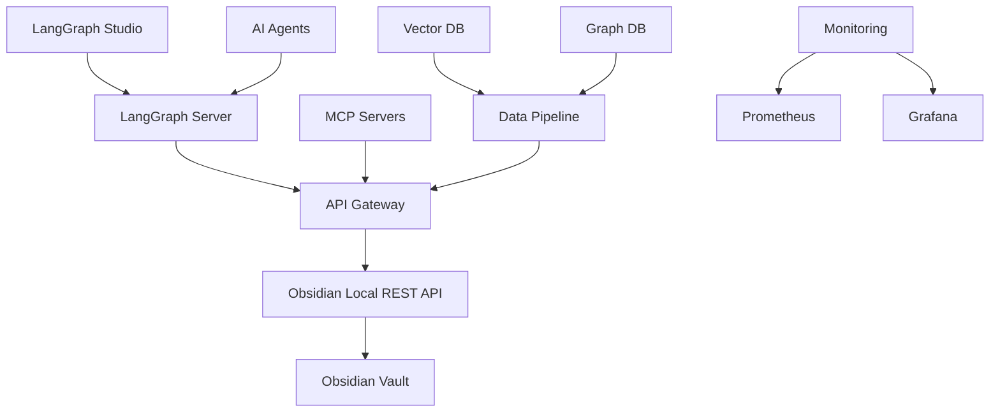

# LangGraph + Obsidian Vault Integration System

A comprehensive hybrid backend architecture that integrates AI pipelines, agentic automations, and local file-based workflows using **LangGraph + MCP (Model Context Protocol) + Obsidian Vault**.

## 🚀 Features

- **Local-First Development**: Fast iteration on local server with single-container architecture
- **Enhanced MCP Integration**: 2025-ready MCP tools with multi-server interoperability and agent-to-agent communication
- **Advanced LangGraph Workflows**: Multi-agent subgraphs with stateful workflows, checkpointing, and human-in-the-loop logic
- **Hybrid Data Pipeline**: Vector and graph database integration for optimal retrieval
- **Comprehensive Observability**: LangSmith tracing, metrics, and monitoring
- **Safety Mechanisms**: Dry-run operations, conflict detection, and human approval workflows
- **Multi-Server Architecture**: Support for distributed agent systems with communication protocols
- **Enhanced Testing**: Comprehensive test suite with automated system validation

## 🏗️ Architecture



## 📋 Prerequisites

- **Obsidian** with Local REST API plugin installed
- **Docker** and **Docker Compose**
- **Python 3.11+**
- **UV** package manager (optional but recommended)

## 🛠️ Quick Start

### 1. Environment Setup

The system comes with a pre-configured `.env` file. If you need to customize it:

```bash
# Obsidian Local REST API
OBSIDIAN_API_KEY=b26efa44ceb0bd4e1fae338cede5384237bbab8624c61927986aa3f06c2f5a70
OBSIDIAN_HOST=127.0.0.1
OBSIDIAN_PORT=27123

# LangSmith
LANGCHAIN_TRACING_V2=true
LANGCHAIN_API_KEY=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
LANGCHAIN_PROJECT=obsidian-agents

# OpenAI
OPENAI_API_KEY=$env:OPENAI_API_KEY

# Gemini (optional)
GEMINI_API_KEY=$env:GOOGLE_API_KEY

# Vault Configuration
OBSIDIAN_VAULT_PATH=./vault
VAULT_NAME=Main
```

### 2. Install Dependencies

```bash
# Using UV (recommended)
uv pip install -r requirements.txt

# Or using pip
pip install -r requirements.txt
```

### 3. Start the System

```bash
# Start all services
docker-compose up -d

# Or start individual services
docker-compose up api-gateway langgraph-server langgraph-studio
```

### 4. Access the Services

- **API Gateway**: http://localhost:8000
- **LangGraph Studio**: http://localhost:2025
- **LangGraph Server**: http://localhost:2024
- **MCP Server**: http://localhost:8002
- **Grafana Dashboard**: http://localhost:3000 (admin/admin)

### 5. Run Comprehensive Tests

```bash
# Run the comprehensive system test
python scripts/start_system.py

# Or run individual test suites
pytest tests/test_enhanced_mcp_integration.py -v
pytest tests/test_api_gateway.py -v
pytest tests/test_langgraph_workflow.py -v
```

## 🔧 Configuration

### API Gateway Configuration

The API Gateway provides REST endpoints for Obsidian vault operations:

```python
# Example API calls
GET /vaults                           # List all vaults
GET /vault/{vault}/files              # List files with pagination
GET /vault/{vault}/file/{path}        # Read specific file
PUT /vault/{vault}/file/{path}        # Create/update file
POST /vault/{vault}/search            # Search notes
GET /pending_operations               # List pending approvals
POST /approve/{tool_call_id}          # Approve operation
```

### MCP Tools

The system provides standardized MCP tools for LangGraph agents:

- `obsidian_list_files` - List files with pagination
- `obsidian_read_note` - Read note content
- `obsidian_put_file` - Create/update files
- `obsidian_search_notes` - Search functionality
- `obsidian_patch_file` - Patch file content
- `obsidian_delete_file` - Delete files
- `obsidian_approve_operation` - Approve pending operations

### LangGraph Workflows

The system includes pre-built workflows for common tasks:

- **Read Workflow**: Information retrieval and file listing
- **Write Workflow**: Content creation with HITL approval
- **Search Workflow**: Advanced search and filtering
- **Organize Workflow**: File categorization and management
- **Analyze Workflow**: Vault statistics and insights

## 🧪 Testing

### Run Tests

```bash
# Run all tests
pytest

# Run specific test suites
pytest tests/test_api_gateway.py
pytest tests/test_langgraph_workflow.py

# Run with coverage
pytest --cov=api_gateway --cov=langgraph_workflows --cov=mcp_tools
```

### Test Types

- **Unit Tests**: Individual component testing
- **Integration Tests**: API endpoint testing
- **End-to-End Tests**: Complete workflow testing
- **Performance Tests**: Load and stress testing

## 📊 Monitoring and Observability

### LangSmith Integration

The system is fully integrated with LangSmith for tracing:

```python
# Enable tracing
os.environ["LANGCHAIN_TRACING_V2"] = "true"
os.environ["LANGCHAIN_API_KEY"] = "your_key"
os.environ["LANGCHAIN_PROJECT"] = "obsidian-agents"
```

### Prometheus Metrics

Key metrics are exposed for monitoring:

- Request count and latency
- Tool call success rates
- Vault operation statistics
- Agent session metrics
- Error rates and types

### Grafana Dashboards

Pre-configured dashboards for:

- System overview
- API performance
- Agent activity
- Error tracking
- Vault statistics

## 🔒 Security

### API Key Management

- Secure environment variable handling
- API key rotation support
- Access control for vault operations

### Write Protection

- Directory whitelisting
- Dry-run by default
- Human-in-the-loop approvals
- Conflict detection

### Network Security

- Localhost binding for Obsidian API
- Container network isolation
- Firewall configuration support

## 🚀 Deployment

### Local Development

```bash
# Start development environment
docker-compose -f docker-compose.dev.yml up

# Run with hot reload
uvicorn api_gateway.main:app --reload --host 0.0.0.0 --port 8000
```

### Production Deployment

```bash
# Build production images
docker-compose -f docker-compose.prod.yml build

# Deploy to production
docker-compose -f docker-compose.prod.yml up -d
```

### Cloud Migration

The system is designed for easy cloud migration:

1. **Container Orchestration**: Kubernetes-ready
2. **Database Migration**: PostgreSQL/Redis support
3. **Load Balancing**: Multi-instance support
4. **Scaling**: Horizontal scaling capabilities

## 📚 API Documentation

### Interactive API Docs

- **Swagger UI**: http://localhost:8000/docs
- **ReDoc**: http://localhost:8000/redoc

### MCP Tool Documentation

Each MCP tool includes comprehensive documentation:

```python
@mcp.tool()
async def obsidian_read_note(input: ReadNoteInput) -> Dict[str, Any]:
    """
    Read the content of a specific note from an Obsidian vault.
    
    This tool retrieves the full content of a note, including metadata
    and a hash for conflict detection.
    """
```

## 🔄 Workflow Examples

### Daily Note Creation

```python
# Create a daily note with template
result = await create_daily_note_prompt(
    vault="Main",
    date="2024-01-15",
    template="detailed"
)
```

### Inbox Organization

```python
# Organize inbox files
result = await organize_inbox_prompt(
    vault="Main",
    inbox_path="inbox",
    organization_rules={
        "meeting": "meetings",
        "project": "projects",
        "idea": "ideas"
    }
)
```

### Agent Execution

```python
# Run agent with user input
result = await run_agent(
    user_input="Summarize today's daily note",
    session_id="session_123"
)
```

## 🐛 Troubleshooting

### Common Issues

1. **Obsidian API Connection**: Ensure Local REST API plugin is enabled
2. **Port Conflicts**: Check that ports 8000, 2024, 2025 are available
3. **Vault Access**: Verify vault path permissions
4. **API Keys**: Ensure all required API keys are set

### Debug Mode

```bash
# Enable debug logging
export DEBUG=true
export LOG_LEVEL=DEBUG

# Run with verbose output
docker-compose up --build
```

### Logs

```bash
# View service logs
docker-compose logs api-gateway
docker-compose logs langgraph-server
docker-compose logs mcp-server

# Follow logs in real-time
docker-compose logs -f api-gateway
```

## 🤝 Contributing

1. Fork the repository
2. Create a feature branch
3. Make your changes
4. Add tests
5. Submit a pull request

### Development Setup

```bash
# Install development dependencies
pip install -r requirements-dev.txt

# Install pre-commit hooks
pre-commit install

# Run linting
black .
isort .
mypy .
```

## 📄 License

This project is licensed under the MIT License - see the [LICENSE](LICENSE) file for details.

## 🙏 Acknowledgments

- [LangGraph](https://github.com/langchain-ai/langgraph) for the workflow framework
- [Model Context Protocol](https://modelcontextprotocol.io/) for the MCP standard
- [Obsidian Local REST API](https://github.com/coddingtonbear/obsidian-local-rest-api) for vault integration
- [FastMCP](https://github.com/jlowin/fastmcp) for MCP server implementation

## 📞 Support

- **Documentation**: [Project Wiki](https://github.com/your-repo/wiki)
- **Issues**: [GitHub Issues](https://github.com/your-repo/issues)
- **Discussions**: [GitHub Discussions](https://github.com/your-repo/discussions)

---

**Built with ❤️ for the AI and Obsidian communities**