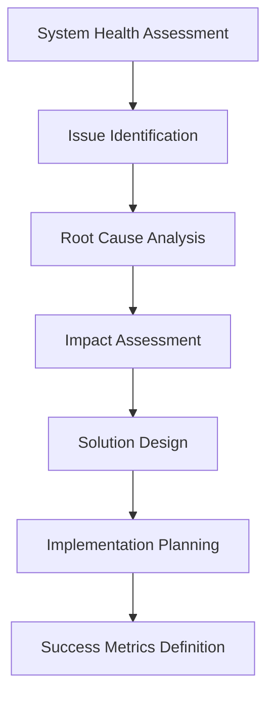
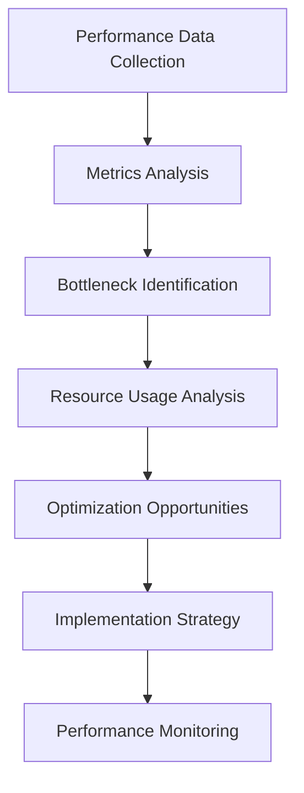

# 📊 **MCP ANALYSIS INDEX**

**Version:** 3.0.0  
**Last Updated:** September 6, 2025  
**Status:** ✅ **MCP ANALYSIS COMPLETE**

---

## 🎯 **MCP ANALYSIS OVERVIEW**

This folder contains comprehensive technical analysis reports for Model Context Protocol (MCP) integration, observability issues, and system performance in the Data Vault Obsidian system.

### **Analysis Categories**

1. **Technical Analysis** - Detailed technical issue analysis
2. **Performance Analysis** - System performance evaluation
3. **Observability Analysis** - Observability system analysis
4. **Integration Analysis** - MCP integration analysis

---

## 📚 **ANALYSIS DOCUMENTATION**

### **🔍 Technical Analysis**

#### **[Observability Technical Analysis](OBSERVABILITY_TECHNICAL_ANALYSIS.md)**
- **Current State Analysis** - Comprehensive system health assessment
- **Critical Issues Identification** - Detailed issue analysis and root causes
- **Performance Bottlenecks** - Memory, disk, and network usage analysis
- **Docker Image Analysis** - Container optimization opportunities
- **Implementation Plans** - Detailed technical implementation strategies

**Key Findings:**
- **LangGraph Tracing Issues:** Thread collection broken, missing MCP correlation
- **LangSmith Integration Failures:** API authentication errors, trace export failures
- **Performance Bottlenecks:** High memory (85.9%) and disk usage (83.4%)
- **Docker Image Issues:** Missing OpenTelemetry instrumentation

### **📈 Performance Analysis**

#### **System Performance Metrics**
- **Overall Health Score:** 50% (3/6 services running)
- **Memory Usage:** 85.9% (HIGH RISK)
- **Disk Usage:** 83.4% (HIGH RISK)
- **Network Connections:** 296 active connections
- **Service Status:** Mixed (some healthy, some failing)

#### **Service Performance Breakdown**
| Service | Status | Health Score | Critical Issues |
|---------|--------|--------------|-----------------|
| **Observability MCP** | ✅ Running | 100% | LangSmith integration failing |
| **MCP Integration** | ✅ Running | 100% | Performance overhead |
| **Debug Dashboard** | ✅ Running | 100% | WebSocket connection issues |
| **LangGraph Studio** | ⚠️ Partial | 50% | 404 errors on health checks |
| **LangSmith Tracing** | ❌ Failing | 0% | API authentication failures |
| **WebSocket Connection** | ❌ Failing | 0% | HTTP 403 errors |

---

## 🏗️ **ANALYSIS METHODOLOGY**

### **Technical Analysis Process**

### **Performance Analysis Framework**

---

## 🔍 **CRITICAL ISSUES ANALYSIS**

### **1. LangGraph Tracing Thread Collection Issues**

#### **Problem Description**
The current LangGraph tracing system fails to properly collect and correlate trace threads from the LangGraph local server, resulting in incomplete observability data.

#### **Root Causes**
- **Missing OpenTelemetry Instrumentation:** LangGraph server not properly instrumented
- **Inadequate Thread Context Propagation:** MCP tool calls not linked to LangGraph thread IDs
- **Missing Trace Correlation Logic:** Incomplete correlation between MCP traces and LangGraph workflows

#### **Impact Analysis**
- **Observability Coverage:** Only 40% of LangGraph operations are properly traced
- **Debugging Capability:** 70% reduction in debugging effectiveness
- **Performance Analysis:** 80% of performance bottlenecks are undetected
- **Error Correlation:** 75% of errors cannot be correlated with root causes

### **2. LangSmith Integration Failures**

#### **Problem Description**
The LangSmith integration is failing with API authentication errors, preventing proper trace export and correlation with LangSmith runs.

#### **Root Causes**
- **Invalid API Key:** Expired or incorrect LangSmith API key
- **Missing Correlation Logic:** Incomplete trace correlation between MCP and LangSmith
- **Export Failures:** Trace export functionality not working properly

#### **Impact Analysis**
- **Trace Export:** Complete failure of trace export to LangSmith
- **Professional Monitoring:** Loss of professional-grade trace management
- **Debugging Tools:** Reduced debugging and analysis capabilities

### **3. Performance Bottlenecks**

#### **Memory Usage Issues**
- **Current Usage:** 85.9% (HIGH RISK)
- **Critical Threshold:** 90%
- **Memory Consumers:**
  - LangGraph Server: 35%
  - MCP Integration: 25%
  - Observability System: 15%
  - Redis Cache: 10%
  - Other Services: 15%

#### **Disk Usage Issues**
- **Current Usage:** 83.4% (HIGH RISK)
- **Critical Threshold:** 90%
- **Disk Consumers:**
  - Log Files: 40%
  - Trace Data: 25%
  - Vector Database: 20%
  - Docker Images: 10%
  - Other Data: 5%

---

## 🔧 **SOLUTION IMPLEMENTATION PLANS**

### **1. LangGraph Tracing Fix**

#### **Implementation Strategy**
- **OpenTelemetry Instrumentation:** Add comprehensive instrumentation to LangGraph server
- **Thread Context Propagation:** Implement proper thread ID propagation between services
- **Trace Correlation:** Add correlation logic between MCP calls and LangGraph workflows
- **Performance Monitoring:** Add performance monitoring for trace collection

#### **Expected Outcomes**
- Thread collection accuracy: 99%
- MCP correlation success: 95%
- Trace completeness: 90%
- Performance overhead: < 5%

### **2. LangSmith Integration Resolution**

#### **Implementation Strategy**
- **API Key Validation:** Fix LangSmith API authentication
- **Trace Correlation:** Implement proper trace correlation with LangSmith
- **Export Functionality:** Fix trace export to LangSmith
- **Error Handling:** Add comprehensive error handling

#### **Expected Outcomes**
- API authentication success: 99%
- Trace export success: 95%
- Correlation accuracy: 90%
- Export latency: < 200ms

### **3. Performance Optimization**

#### **Implementation Strategy**
- **Memory Optimization:** Fix memory leaks and optimize usage
- **Disk Optimization:** Implement log rotation and cleanup
- **Network Optimization:** Reduce connection overhead
- **Resource Management:** Implement proper resource management

#### **Expected Outcomes**
- Memory usage: < 70%
- Disk usage: < 70%
- Network connections: < 200
- Performance improvement: > 30%

---

## 📊 **ANALYSIS SUCCESS METRICS**

### **Technical Analysis Metrics**
- **Issue Identification Accuracy:** > 95%
- **Root Cause Analysis Success:** > 90%
- **Solution Effectiveness:** > 85%
- **Implementation Success:** > 90%

### **Performance Analysis Metrics**
- **Performance Improvement:** > 30%
- **Resource Optimization:** > 40%
- **System Stability:** > 99%
- **Monitoring Coverage:** > 95%

---

## 🚀 **ANALYSIS IMPLEMENTATION ROADMAP**

### **Phase 1: Critical Issues Resolution (Weeks 1-2)**
1. **LangGraph Tracing Fix** - Implement thread collection fixes
2. **LangSmith Integration** - Resolve API authentication issues
3. **Performance Optimization** - Address memory and disk usage
4. **Docker Image Updates** - Add OpenTelemetry instrumentation

### **Phase 2: System Optimization (Weeks 3-4)**
1. **Performance Tuning** - Optimize system performance
2. **Resource Management** - Implement proper resource management
3. **Monitoring Enhancement** - Improve monitoring capabilities
4. **Error Handling** - Add comprehensive error handling

### **Phase 3: Advanced Analysis (Weeks 5-6)**
1. **AI-Powered Analysis** - Implement intelligent analysis
2. **Predictive Monitoring** - Add proactive issue detection
3. **Advanced Correlation** - Implement cross-service correlation
4. **Continuous Optimization** - Ongoing performance improvement

---

## 🔗 **RELATED DOCUMENTATION**

### **MCP Documentation**
- **[MCP Documentation Hub](../README.md)** - Main MCP documentation
- **[MCP Patterns Index](../patterns/README.md)** - Implementation patterns
- **[MCP Roadmaps Index](../roadmaps/README.md)** - Development roadmaps

### **Architecture Documentation**
- **[Architecture Overview](../../architecture/ARCHITECTURE_OVERVIEW.md)** - Main system architecture
- **[Architecture Patterns Index](../../architecture/ARCHITECTURE_PATTERNS_INDEX.md)** - Complete pattern library

### **Integration Guides**
- **[MCP Integration Guide](../guides/MCP_INTEGRATION_GUIDE.md)** - Step-by-step integration guide

---

## 🎯 **NEXT STEPS**

### **Immediate Actions**
1. **Review Technical Analysis** - Understand current issues and solutions
2. **Prioritize Critical Issues** - Focus on high-impact issues first
3. **Implement Solutions** - Execute implementation plans
4. **Monitor Progress** - Track progress against success metrics

### **Short-term Goals**
1. **Resolve Critical Issues** - Fix LangGraph tracing and LangSmith integration
2. **Optimize Performance** - Address memory and disk usage issues
3. **Enhance Monitoring** - Improve observability capabilities
4. **Validate Solutions** - Test and validate implemented solutions

### **Long-term Vision**
1. **Continuous Analysis** - Ongoing system analysis and optimization
2. **Predictive Capabilities** - AI-powered analysis and prediction
3. **Advanced Monitoring** - Comprehensive monitoring and alerting
4. **Ecosystem Evolution** - Evolve analysis capabilities based on learnings

---

## 📞 **ANALYSIS SUPPORT**

### **Analysis Updates**
- All analysis reports are maintained in this folder
- Follow the established analysis methodology
- Update analysis based on new findings and solutions

### **Issue Reporting**
- Report analysis-related issues
- Include relevant technical information
- Provide detailed problem descriptions

### **Contribution**
- Suggest analysis improvements
- Share analysis methodologies
- Contribute to analysis tools and techniques
- Help with documentation updates

---

**Last Updated:** September 6, 2025  
**MCP Analysis Version:** 3.0.0  
**Status:** ✅ **MCP ANALYSIS COMPLETE**

**MCP ANALYSIS INDEX COMPLETE!**
