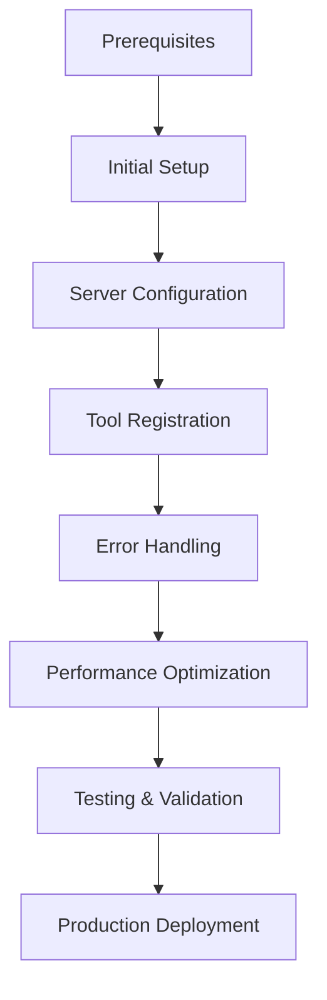
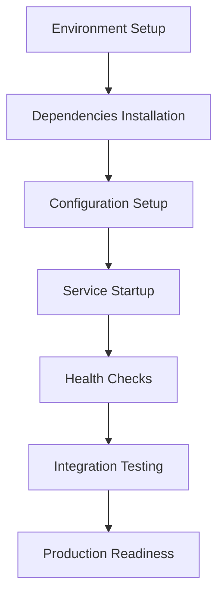

# 📖 **MCP GUIDES INDEX**

**Version:** 3.0.0  
**Last Updated:** September 6, 2025  
**Status:** ✅ **MCP GUIDES COMPLETE**

---

## 🎯 **MCP GUIDES OVERVIEW**

This folder contains comprehensive integration guides, tutorials, and step-by-step instructions for Model Context Protocol (MCP) implementation in the Data Vault Obsidian system.

### **Guide Categories**

1. **Integration Guides** - Step-by-step MCP integration instructions
2. **Setup Guides** - System setup and configuration guides
3. **Troubleshooting Guides** - Problem resolution and debugging guides
4. **Best Practices** - MCP implementation best practices

---

## 📚 **GUIDE DOCUMENTATION**

### **🔧 Integration Guides**

#### **[MCP Integration Guide](MCP_INTEGRATION_GUIDE.md)**
- **Getting Started** - Initial MCP setup and configuration
- **Server Integration** - MCP server setup and management
- **Tool Registration** - Dynamic tool registration and discovery
- **Error Handling** - Comprehensive error handling implementation
- **Performance Optimization** - MCP performance tuning and optimization

**Key Features:**
- Complete step-by-step integration process
- Code examples and implementation patterns
- Troubleshooting and debugging guidance
- Performance optimization techniques
- Security best practices

---

## 🏗️ **GUIDE ARCHITECTURE**

### **Integration Guide Flow**

### **Setup Guide Flow**

---

## 🚀 **GUIDE IMPLEMENTATION WORKFLOW**

### **Getting Started with MCP Guides**

1. **Start with Prerequisites**
   - Review system requirements
   - Install necessary dependencies
   - Configure environment variables

2. **Follow Integration Guide**
   - Read [MCP Integration Guide](MCP_INTEGRATION_GUIDE.md)
   - Follow step-by-step instructions
   - Test each integration step

3. **Apply Best Practices**
   - Implement error handling
   - Optimize performance
   - Follow security guidelines

4. **Validate Implementation**
   - Run integration tests
   - Verify functionality
   - Monitor performance

### **Guide Selection Matrix**

| Use Case | Recommended Guide | Complexity Level |
|----------|-------------------|------------------|
| **New MCP Integration** | MCP Integration Guide | Beginner |
| **Existing System Enhancement** | MCP Integration Guide | Intermediate |
| **Performance Optimization** | MCP Integration Guide | Advanced |
| **Troubleshooting Issues** | MCP Integration Guide | Intermediate |
| **Production Deployment** | MCP Integration Guide | Advanced |

---

## 📊 **GUIDE SUCCESS METRICS**

### **Integration Guide Metrics**
- **Setup Success Rate:** > 95%
- **Integration Time:** < 2 hours
- **Error Rate:** < 5%
- **Performance Improvement:** > 30%

### **User Experience Metrics**
- **Guide Clarity:** > 90%
- **Step Completion Rate:** > 95%
- **User Satisfaction:** > 85%
- **Support Requests:** < 10%

---

## 🔧 **IMPLEMENTATION CHECKLIST**

### **Pre-Integration Checklist**
- [ ] System requirements met
- [ ] Dependencies installed
- [ ] Environment configured
- [ ] Network connectivity verified
- [ ] Security settings configured

### **Integration Checklist**
- [ ] MCP server installed
- [ ] Tool registry configured
- [ ] Service discovery enabled
- [ ] Error handling implemented
- [ ] Performance monitoring setup

### **Post-Integration Checklist**
- [ ] Integration tests passed
- [ ] Performance benchmarks met
- [ ] Security validation completed
- [ ] Documentation updated
- [ ] Team training completed

---

## 🎯 **GUIDE IMPLEMENTATION PHASES**

### **Phase 1: Preparation (Day 1)**
1. **Review Prerequisites** - Understand system requirements
2. **Install Dependencies** - Install necessary software and libraries
3. **Configure Environment** - Set up environment variables and configuration
4. **Verify Setup** - Validate initial setup and configuration

### **Phase 2: Integration (Days 2-3)**
1. **MCP Server Setup** - Install and configure MCP server
2. **Tool Registration** - Register and configure MCP tools
3. **Service Discovery** - Enable automatic service discovery
4. **Error Handling** - Implement comprehensive error handling

### **Phase 3: Optimization (Days 4-5)**
1. **Performance Tuning** - Optimize MCP performance
2. **Monitoring Setup** - Configure monitoring and alerting
3. **Security Hardening** - Implement security best practices
4. **Testing & Validation** - Comprehensive testing and validation

### **Phase 4: Production (Days 6-7)**
1. **Production Deployment** - Deploy to production environment
2. **Performance Monitoring** - Monitor production performance
3. **Issue Resolution** - Address any production issues
4. **Documentation Update** - Update documentation with learnings

---

## 🔗 **RELATED DOCUMENTATION**

### **MCP Documentation**
- **[MCP Documentation Hub](../README.md)** - Main MCP documentation
- **[MCP Patterns Index](../patterns/README.md)** - Implementation patterns
- **[MCP Roadmaps Index](../roadmaps/README.md)** - Development roadmaps
- **[MCP Analysis Index](../analysis/README.md)** - Technical analysis

### **Architecture Documentation**
- **[Architecture Overview](../../architecture/ARCHITECTURE_OVERVIEW.md)** - Main system architecture
- **[Architecture Patterns Index](../../architecture/ARCHITECTURE_PATTERNS_INDEX.md)** - Complete pattern library

### **System Documentation**
- **[Deployment Guide](../../DEPLOYMENT_GUIDE.md)** - System deployment guide
- **[Testing Strategy](../../TESTING_STRATEGY.md)** - Testing approach and strategy

---

## 🎯 **NEXT STEPS**

### **Immediate Actions**
1. **Review Integration Guide** - Understand MCP integration process
2. **Prepare Environment** - Set up development environment
3. **Follow Step-by-Step Instructions** - Execute integration guide
4. **Test Implementation** - Validate each integration step

### **Short-term Goals**
1. **Complete Integration** - Finish MCP integration process
2. **Optimize Performance** - Apply performance optimization techniques
3. **Implement Monitoring** - Setup comprehensive monitoring
4. **Validate Security** - Ensure security best practices

### **Long-term Vision**
1. **Advanced Integration** - Implement advanced MCP features
2. **Continuous Optimization** - Ongoing performance improvement
3. **Knowledge Sharing** - Share integration experiences
4. **Guide Enhancement** - Improve guides based on feedback

---

## 📞 **GUIDE SUPPORT**

### **Implementation Support**
- Follow the step-by-step instructions in each guide
- Use the implementation checklists to track progress
- Test each step before proceeding to the next
- Document any issues or deviations

### **Issue Resolution**
- Report guide-related issues
- Include relevant system information
- Provide detailed error descriptions
- Share implementation logs

### **Contribution**
- Suggest guide improvements
- Share implementation experiences
- Contribute to troubleshooting solutions
- Help with documentation updates

---

## 🔧 **GUIDE MAINTENANCE**

### **Regular Updates**
- Update guides based on system changes
- Incorporate user feedback and suggestions
- Add new troubleshooting scenarios
- Improve clarity and usability

### **Version Control**
- Maintain guide version history
- Track changes and improvements
- Document breaking changes
- Provide migration guidance

### **Quality Assurance**
- Regular guide testing and validation
- User feedback collection and analysis
- Performance monitoring and optimization
- Continuous improvement implementation

---

**Last Updated:** September 6, 2025  
**MCP Guides Version:** 3.0.0  
**Status:** ✅ **MCP GUIDES COMPLETE**

**MCP GUIDES INDEX COMPLETE!**
