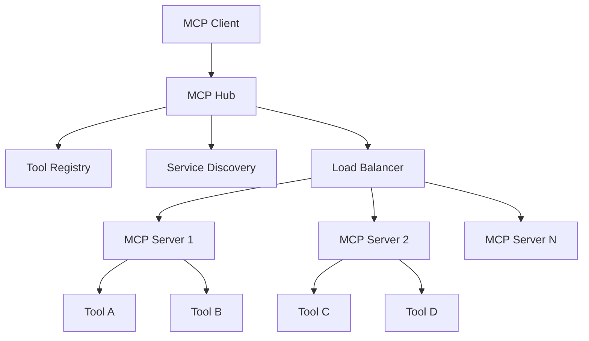
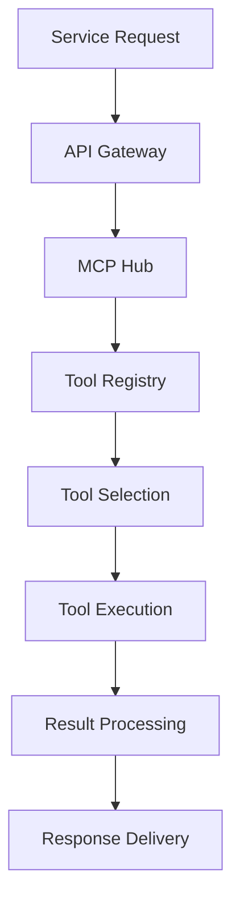

# 🔗 **MCP INTEGRATION INDEX**

**Version:** 3.0.0  
**Last Updated:** September 6, 2025  
**Status:** ✅ **MCP INTEGRATION COMPLETE**

---

## 🎯 **MCP INTEGRATION OVERVIEW**

This folder contains comprehensive integration documentation, API references, and implementation details for Model Context Protocol (MCP) integration in the Data Vault Obsidian system.

### **Integration Categories**

1. **API Integration** - MCP API integration and usage
2. **Service Integration** - Service-to-service integration patterns
3. **Tool Integration** - MCP tool integration and management
4. **System Integration** - End-to-end system integration

---

## 📚 **INTEGRATION DOCUMENTATION**

### **🔌 API Integration**

#### **MCP API Reference**
- **Core APIs** - Essential MCP API endpoints and methods
- **Tool APIs** - Tool registration, discovery, and execution APIs
- **Service APIs** - Service management and health check APIs
- **Observability APIs** - Monitoring and tracing APIs

**Key Features:**
- Complete API documentation with examples
- Request/response schemas and validation
- Error handling and status codes
- Authentication and authorization

### **🛠️ Tool Integration**

#### **MCP Tool Management**
- **Tool Registration** - Dynamic tool registration and discovery
- **Tool Execution** - Tool execution and result handling
- **Tool Composition** - Multi-tool operation composition
- **Tool Monitoring** - Tool performance and usage monitoring

**Key Features:**
- Tool lifecycle management
- Dynamic tool discovery
- Tool execution optimization
- Comprehensive tool monitoring

### **🔧 Service Integration**

#### **MCP Service Integration**
- **Hub-and-Spoke Pattern** - Central MCP server management
- **Service Discovery** - Automatic service detection and registration
- **Load Balancing** - Service load balancing and failover
- **Health Monitoring** - Service health checks and monitoring

**Key Features:**
- Centralized service management
- Automatic service discovery
- High availability and failover
- Comprehensive health monitoring

---

## 🏗️ **INTEGRATION ARCHITECTURE**

### **MCP Integration Architecture**

### **Service Integration Flow**

---

## 🚀 **INTEGRATION IMPLEMENTATION**

### **Getting Started with MCP Integration**

1. **Setup MCP Hub**
   - Install and configure MCP hub server
   - Setup tool registry and service discovery
   - Configure load balancing and failover

2. **Register MCP Tools**
   - Implement tool registration process
   - Configure tool discovery and selection
   - Setup tool execution and monitoring

3. **Integrate Services**
   - Connect services to MCP hub
   - Implement service-to-service communication
   - Setup health monitoring and alerting

4. **Test Integration**
   - Run integration tests
   - Validate functionality and performance
   - Monitor system behavior

### **Integration Patterns**

#### **Hub-and-Spoke Pattern**
- **Central Hub** - Single MCP hub managing all connections
- **Spoke Services** - Individual services connected to hub
- **Tool Registry** - Centralized tool management
- **Service Discovery** - Automatic service detection

#### **Tool Composition Pattern**
- **Sequential Composition** - Tools executed in sequence
- **Parallel Composition** - Tools executed in parallel
- **Conditional Composition** - Tools executed based on conditions
- **Result Aggregation** - Combining results from multiple tools

#### **Error Handling Pattern**
- **Retry Logic** - Automatic retry with exponential backoff
- **Circuit Breaker** - Prevent cascading failures
- **Fallback Mechanisms** - Alternative execution paths
- **Error Propagation** - Proper error handling and reporting

---

## 📊 **INTEGRATION SUCCESS METRICS**

### **API Integration Metrics**
- **API Response Time:** < 100ms
- **API Success Rate:** > 99%
- **API Availability:** > 99.9%
- **API Error Rate:** < 0.1%

### **Tool Integration Metrics**
- **Tool Discovery Time:** < 50ms
- **Tool Execution Success:** > 99%
- **Tool Performance:** < 200ms
- **Tool Error Rate:** < 0.5%

### **Service Integration Metrics**
- **Service Discovery Time:** < 100ms
- **Service Availability:** > 99.9%
- **Load Balancing Efficiency:** > 95%
- **Health Check Success:** > 99%

---

## 🔧 **INTEGRATION IMPLEMENTATION PHASES**

### **Phase 1: Core Integration (Weeks 1-2)**
1. **MCP Hub Setup** - Install and configure central hub
2. **Tool Registry** - Implement tool registration and discovery
3. **Basic APIs** - Implement core MCP APIs
4. **Health Monitoring** - Setup basic health checks

### **Phase 2: Advanced Integration (Weeks 3-4)**
1. **Service Discovery** - Implement automatic service discovery
2. **Load Balancing** - Add load balancing and failover
3. **Tool Composition** - Implement multi-tool operations
4. **Error Handling** - Add comprehensive error handling

### **Phase 3: Optimization (Weeks 5-6)**
1. **Performance Tuning** - Optimize integration performance
2. **Monitoring Enhancement** - Improve monitoring capabilities
3. **Security Hardening** - Implement security best practices
4. **Testing & Validation** - Comprehensive testing and validation

### **Phase 4: Production (Weeks 7-8)**
1. **Production Deployment** - Deploy to production environment
2. **Performance Monitoring** - Monitor production performance
3. **Issue Resolution** - Address any production issues
4. **Documentation Update** - Update documentation with learnings

---

## 🔗 **RELATED DOCUMENTATION**

### **MCP Documentation**
- **[MCP Documentation Hub](../README.md)** - Main MCP documentation
- **[MCP Patterns Index](../patterns/README.md)** - Implementation patterns
- **[MCP Roadmaps Index](../roadmaps/README.md)** - Development roadmaps
- **[MCP Analysis Index](../analysis/README.md)** - Technical analysis
- **[MCP Guides Index](../guides/README.md)** - Integration guides

### **Architecture Documentation**
- **[Architecture Overview](../../architecture/ARCHITECTURE_OVERVIEW.md)** - Main system architecture
- **[Architecture Patterns Index](../../architecture/ARCHITECTURE_PATTERNS_INDEX.md)** - Complete pattern library

### **System Documentation**
- **[Deployment Guide](../../DEPLOYMENT_GUIDE.md)** - System deployment guide
- **[Testing Strategy](../../TESTING_STRATEGY.md)** - Testing approach and strategy

---

## 🎯 **NEXT STEPS**

### **Immediate Actions**
1. **Review Integration Documentation** - Understand MCP integration architecture
2. **Setup Development Environment** - Prepare for integration development
3. **Follow Integration Patterns** - Implement recommended integration patterns
4. **Test Integration** - Validate integration functionality

### **Short-term Goals**
1. **Complete Core Integration** - Implement basic MCP integration
2. **Add Advanced Features** - Implement advanced integration features
3. **Optimize Performance** - Apply performance optimization techniques
4. **Validate Security** - Ensure security best practices

### **Long-term Vision**
1. **Advanced Integration** - Implement advanced MCP features
2. **Continuous Optimization** - Ongoing performance improvement
3. **Ecosystem Integration** - Integrate with broader ecosystem
4. **Knowledge Sharing** - Share integration experiences

---

## 📞 **INTEGRATION SUPPORT**

### **Implementation Support**
- Follow the integration patterns and best practices
- Use the implementation checklists to track progress
- Test each integration step before proceeding
- Document any issues or deviations

### **Issue Resolution**
- Report integration-related issues
- Include relevant system information
- Provide detailed error descriptions
- Share integration logs and metrics

### **Contribution**
- Suggest integration improvements
- Share integration experiences
- Contribute to integration patterns
- Help with documentation updates

---

## 🔧 **INTEGRATION MAINTENANCE**

### **Regular Updates**
- Update integration documentation based on system changes
- Incorporate user feedback and suggestions
- Add new integration patterns and best practices
- Improve clarity and usability

### **Version Control**
- Maintain integration version history
- Track changes and improvements
- Document breaking changes
- Provide migration guidance

### **Quality Assurance**
- Regular integration testing and validation
- User feedback collection and analysis
- Performance monitoring and optimization
- Continuous improvement implementation

---

**Last Updated:** September 6, 2025  
**MCP Integration Version:** 3.0.0  
**Status:** ✅ **MCP INTEGRATION COMPLETE**

**MCP INTEGRATION INDEX COMPLETE!**
