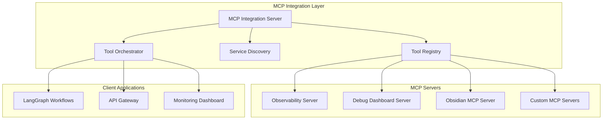

# 🔌 **MCP INTEGRATION PATTERNS & TECHNIQUES**

**Version:** 3.0.0  
**Last Updated:** September 6, 2025  
**Status:** ✅ **PRODUCTION-READY MCP INTEGRATION**

---

## 🎯 **MCP ARCHITECTURE OVERVIEW**

The Model Context Protocol (MCP) integration in Data Vault Obsidian follows a **Hub-and-Spoke** pattern with **Service Discovery** and **Tool Orchestration** capabilities.

### **Core MCP Components**



---

## 🏗️ **MCP INTEGRATION PATTERNS**

### **1. Hub-and-Spoke Pattern**

#### **Implementation**
```python
class MCPIntegrationServer:
    def __init__(self):
        self.tool_registry = ToolRegistry()
        self.service_discovery = ServiceDiscovery()
        self.tool_orchestrator = ToolOrchestrator()
        self.connected_servers = {}
    
    async def register_server(self, server_config: MCPServerConfig):
        """Register a new MCP server"""
        server = await self._connect_to_server(server_config)
        self.connected_servers[server_config.name] = server
        
        # Discover and register tools
        tools = await server.list_tools()
        for tool in tools:
            self.tool_registry.register_tool(server_config.name, tool)
    
    async def execute_tool(self, server_name: str, tool_name: str, parameters: dict):
        """Execute a tool on a specific server"""
        if server_name not in self.connected_servers:
            raise MCPServerNotFoundError(f"Server {server_name} not found")
        
        server = self.connected_servers[server_name]
        return await server.call_tool(tool_name, parameters)
```

#### **Benefits**
- **Centralized Management** - Single point of control
- **Service Discovery** - Automatic tool discovery
- **Load Balancing** - Distribute requests across servers
- **Fault Tolerance** - Handle server failures gracefully

---

### **2. Tool Registry Pattern**

#### **Implementation**
```python
class ToolRegistry:
    def __init__(self):
        self.tools: Dict[str, Dict[str, MCPTool]] = {}
        self.tool_metadata: Dict[str, ToolMetadata] = {}
    
    def register_tool(self, server_name: str, tool: MCPTool):
        """Register a tool from a specific server"""
        if server_name not in self.tools:
            self.tools[server_name] = {}
        
        self.tools[server_name][tool.name] = tool
        self.tool_metadata[f"{server_name}:{tool.name}"] = ToolMetadata(
            server_name=server_name,
            tool_name=tool.name,
            description=tool.description,
            parameters=tool.parameters,
            capabilities=tool.capabilities
        )
    
    def find_tool(self, tool_name: str) -> List[ToolMetadata]:
        """Find tools by name across all servers"""
        matching_tools = []
        for key, metadata in self.tool_metadata.items():
            if metadata.tool_name == tool_name:
                matching_tools.append(metadata)
        return matching_tools
    
    def get_tool_by_server(self, server_name: str, tool_name: str) -> Optional[MCPTool]:
        """Get a specific tool from a specific server"""
        if server_name in self.tools and tool_name in self.tools[server_name]:
            return self.tools[server_name][tool_name]
        return None
```

---

### **3. Service Discovery Pattern**

#### **Implementation**
```python
class ServiceDiscovery:
    def __init__(self):
        self.discovered_services: Dict[str, ServiceInfo] = {}
        self.health_checker = HealthChecker()
    
    async def discover_services(self, discovery_config: DiscoveryConfig):
        """Discover MCP services using various methods"""
        # DNS-based discovery
        if discovery_config.dns_enabled:
            await self._discover_via_dns(discovery_config.dns_config)
        
        # Service registry discovery
        if discovery_config.registry_enabled:
            await self._discover_via_registry(discovery_config.registry_config)
        
        # Manual configuration
        if discovery_config.manual_services:
            await self._discover_manual_services(discovery_config.manual_services)
    
    async def _discover_via_dns(self, dns_config: DNSConfig):
        """Discover services via DNS SRV records"""
        # Implementation for DNS-based service discovery
        pass
    
    async def _discover_via_registry(self, registry_config: RegistryConfig):
        """Discover services via service registry"""
        # Implementation for registry-based discovery
        pass
    
    async def health_check_services(self):
        """Perform health checks on discovered services"""
        for service_name, service_info in self.discovered_services.items():
            is_healthy = await self.health_checker.check_health(service_info)
            service_info.is_healthy = is_healthy
```

---

## 🔧 **MCP SERVER IMPLEMENTATION PATTERNS**

### **1. FastMCP Server Pattern**

#### **Base Server Implementation**
```python
from fastmcp import FastMCP

class BaseMCPServer(FastMCP):
    def __init__(self, name: str, version: str = "1.0.0"):
        super().__init__(name, version)
        self.tools = {}
        self.resources = {}
        self.prompts = {}
        self._setup_health_check()
    
    def _setup_health_check(self):
        """Setup health check endpoint"""
        @self.tool()
        async def health_check() -> dict:
            """Check server health status"""
            return {
                "status": "healthy",
                "timestamp": datetime.utcnow().isoformat(),
                "server": self.name,
                "version": self.version
            }
    
    def register_tool(self, name: str, description: str, parameters: dict = None):
        """Decorator for registering tools"""
        def decorator(func):
            self.tools[name] = {
                "function": func,
                "description": description,
                "parameters": parameters or {}
            }
            return func
        return decorator
```

#### **Observability Server Implementation**
```python
class ObservabilityMCPServer(BaseMCPServer):
    def __init__(self):
        super().__init__("observability", "1.0.0")
        self.langsmith_client = LangSmithClient()
        self.trace_storage = TraceStorage()
    
    @self.tool()
    async def create_trace(self, 
                          trace_id: str, 
                          session_id: str, 
                          metadata: dict = None) -> dict:
        """Create a new trace session"""
        try:
            trace = await self.langsmith_client.create_trace(
                trace_id=trace_id,
                session_id=session_id,
                metadata=metadata or {}
            )
            await self.trace_storage.store_trace(trace)
            return {"success": True, "trace_id": trace_id}
        except Exception as e:
            return {"success": False, "error": str(e)}
    
    @self.tool()
    async def get_trace(self, trace_id: str) -> dict:
        """Retrieve trace information"""
        try:
            trace = await self.trace_storage.get_trace(trace_id)
            if trace:
                return {"success": True, "trace": trace}
            else:
                return {"success": False, "error": "Trace not found"}
        except Exception as e:
            return {"success": False, "error": str(e)}
    
    @self.tool()
    async def list_traces(self, limit: int = 10, offset: int = 0) -> dict:
        """List recent traces"""
        try:
            traces = await self.trace_storage.list_traces(limit, offset)
            return {"success": True, "traces": traces}
        except Exception as e:
            return {"success": False, "error": str(e)}
```

---

### **2. Tool Composition Pattern**

#### **Implementation**
```python
class CompositeMCPTool:
    def __init__(self, name: str, description: str):
        self.name = name
        self.description = description
        self.sub_tools = []
        self.execution_strategy = "sequential"  # or "parallel"
    
    def add_sub_tool(self, tool: MCPTool, condition: Callable = None):
        """Add a sub-tool with optional condition"""
        self.sub_tools.append({
            "tool": tool,
            "condition": condition
        })
    
    async def execute(self, parameters: dict) -> dict:
        """Execute the composite tool"""
        results = []
        
        if self.execution_strategy == "sequential":
            for sub_tool_info in self.sub_tools:
                if self._should_execute(sub_tool_info, parameters):
                    result = await sub_tool_info["tool"].execute(parameters)
                    results.append(result)
        else:  # parallel
            tasks = []
            for sub_tool_info in self.sub_tools:
                if self._should_execute(sub_tool_info, parameters):
                    task = sub_tool_info["tool"].execute(parameters)
                    tasks.append(task)
            
            results = await asyncio.gather(*tasks, return_exceptions=True)
        
        return self._combine_results(results)
    
    def _should_execute(self, sub_tool_info: dict, parameters: dict) -> bool:
        """Check if sub-tool should be executed"""
        if sub_tool_info["condition"]:
            return sub_tool_info["condition"](parameters)
        return True
    
    def _combine_results(self, results: List[dict]) -> dict:
        """Combine results from sub-tools"""
        return {
            "composite_result": True,
            "sub_results": results,
            "summary": self._generate_summary(results)
        }
```

---

## 🔄 **MCP WORKFLOW INTEGRATION**

### **1. LangGraph MCP Integration**

#### **MCP Tool Node Implementation**
```python
class MCPToolNode:
    def __init__(self, mcp_client: MCPClient, tool_name: str, server_name: str):
        self.mcp_client = mcp_client
        self.tool_name = tool_name
        self.server_name = server_name
    
    async def __call__(self, state: dict) -> dict:
        """Execute MCP tool as LangGraph node"""
        try:
            # Extract parameters from state
            parameters = self._extract_parameters(state)
            
            # Execute MCP tool
            result = await self.mcp_client.call_tool(
                server_name=self.server_name,
                tool_name=self.tool_name,
                parameters=parameters
            )
            
            # Update state with result
            return self._update_state(state, result)
            
        except Exception as e:
            return self._handle_error(state, e)
    
    def _extract_parameters(self, state: dict) -> dict:
        """Extract tool parameters from LangGraph state"""
        # Implementation for parameter extraction
        pass
    
    def _update_state(self, state: dict, result: dict) -> dict:
        """Update LangGraph state with tool result"""
        state[f"{self.server_name}_{self.tool_name}_result"] = result
        return state
    
    def _handle_error(self, state: dict, error: Exception) -> dict:
        """Handle tool execution errors"""
        state[f"{self.server_name}_{self.tool_name}_error"] = str(error)
        return state
```

#### **Workflow Integration**
```python
from langgraph import StateGraph, END

def create_mcp_integrated_workflow(mcp_client: MCPClient) -> StateGraph:
    """Create a LangGraph workflow with MCP tool integration"""
    
    # Define workflow state
    class WorkflowState(TypedDict):
        input_data: str
        obsidian_result: dict
        langsmith_result: dict
        final_result: dict
        error: Optional[str]
    
    # Create workflow
    workflow = StateGraph(WorkflowState)
    
    # Add MCP tool nodes
    obsidian_tool = MCPToolNode(mcp_client, "create_note", "obsidian")
    langsmith_tool = MCPToolNode(mcp_client, "create_trace", "observability")
    
    # Add nodes to workflow
    workflow.add_node("process_input", process_input_node)
    workflow.add_node("obsidian_tool", obsidian_tool)
    workflow.add_node("langsmith_tool", langsmith_tool)
    workflow.add_node("combine_results", combine_results_node)
    
    # Define workflow edges
    workflow.add_edge("process_input", "obsidian_tool")
    workflow.add_edge("obsidian_tool", "langsmith_tool")
    workflow.add_edge("langsmith_tool", "combine_results")
    workflow.add_edge("combine_results", END)
    
    return workflow.compile()
```

---

## 📊 **MCP MONITORING & OBSERVABILITY**

### **1. MCP Server Health Monitoring**

#### **Health Check Implementation**
```python
class MCPHealthMonitor:
    def __init__(self, mcp_servers: Dict[str, MCPClient]):
        self.mcp_servers = mcp_servers
        self.health_status = {}
        self.metrics_collector = MetricsCollector()
    
    async def check_all_servers(self) -> Dict[str, HealthStatus]:
        """Check health of all MCP servers"""
        tasks = []
        for server_name, client in self.mcp_servers.items():
            task = self._check_server_health(server_name, client)
            tasks.append(task)
        
        results = await asyncio.gather(*tasks, return_exceptions=True)
        
        for i, (server_name, _) in enumerate(self.mcp_servers.items()):
            result = results[i]
            if isinstance(result, Exception):
                self.health_status[server_name] = HealthStatus(
                    status="unhealthy",
                    error=str(result),
                    timestamp=datetime.utcnow()
                )
            else:
                self.health_status[server_name] = result
        
        return self.health_status
    
    async def _check_server_health(self, server_name: str, client: MCPClient) -> HealthStatus:
        """Check health of a specific MCP server"""
        try:
            start_time = time.time()
            result = await client.call_tool(server_name, "health_check", {})
            response_time = time.time() - start_time
            
            if result.get("success", False):
                return HealthStatus(
                    status="healthy",
                    response_time=response_time,
                    timestamp=datetime.utcnow()
                )
            else:
                return HealthStatus(
                    status="unhealthy",
                    error=result.get("error", "Unknown error"),
                    timestamp=datetime.utcnow()
                )
        except Exception as e:
            return HealthStatus(
                status="unhealthy",
                error=str(e),
                timestamp=datetime.utcnow()
            )
```

### **2. MCP Metrics Collection**

#### **Metrics Implementation**
```python
class MCPMetricsCollector:
    def __init__(self):
        self.metrics = {
            "tool_calls_total": Counter("mcp_tool_calls_total", ["server", "tool"]),
            "tool_call_duration": Histogram("mcp_tool_call_duration_seconds", ["server", "tool"]),
            "tool_call_errors": Counter("mcp_tool_call_errors_total", ["server", "tool", "error_type"]),
            "server_health": Gauge("mcp_server_health", ["server"])
        }
    
    def record_tool_call(self, server_name: str, tool_name: str, duration: float, success: bool):
        """Record tool call metrics"""
        self.metrics["tool_calls_total"].labels(server=server_name, tool=tool_name).inc()
        self.metrics["tool_call_duration"].labels(server=server_name, tool=tool_name).observe(duration)
        
        if not success:
            self.metrics["tool_call_errors"].labels(
                server=server_name, 
                tool=tool_name, 
                error_type="execution_error"
            ).inc()
    
    def update_server_health(self, server_name: str, is_healthy: bool):
        """Update server health metric"""
        self.metrics["server_health"].labels(server=server_name).set(1 if is_healthy else 0)
```

---

## 🔒 **MCP SECURITY PATTERNS**

### **1. Tool Access Control**

#### **Implementation**
```python
class MCPAccessController:
    def __init__(self):
        self.permissions = {
            "admin": ["*"],  # All tools
            "user": ["obsidian:read", "obsidian:write", "observability:read"],
            "guest": ["observability:read"]
        }
        self.tool_permissions = {
            "obsidian:create_note": ["user", "admin"],
            "obsidian:delete_note": ["admin"],
            "observability:create_trace": ["user", "admin"],
            "observability:get_trace": ["user", "admin", "guest"]
        }
    
    def can_access_tool(self, user_roles: List[str], tool_name: str) -> bool:
        """Check if user can access a specific tool"""
        # Check if user has admin role
        if "admin" in user_roles:
            return True
        
        # Check specific tool permissions
        if tool_name in self.tool_permissions:
            required_roles = self.tool_permissions[tool_name]
            return any(role in user_roles for role in required_roles)
        
        return False
    
    def filter_available_tools(self, user_roles: List[str], all_tools: List[str]) -> List[str]:
        """Filter available tools based on user roles"""
        available_tools = []
        for tool in all_tools:
            if self.can_access_tool(user_roles, tool):
                available_tools.append(tool)
        return available_tools
```

### **2. Tool Input Validation**

#### **Implementation**
```python
class MCPToolValidator:
    def __init__(self):
        self.validators = {}
    
    def register_validator(self, tool_name: str, validator: Callable):
        """Register a validator for a specific tool"""
        self.validators[tool_name] = validator
    
    async def validate_tool_input(self, tool_name: str, parameters: dict) -> ValidationResult:
        """Validate tool input parameters"""
        if tool_name not in self.validators:
            return ValidationResult(valid=True, errors=[])
        
        validator = self.validators[tool_name]
        try:
            await validator(parameters)
            return ValidationResult(valid=True, errors=[])
        except ValidationError as e:
            return ValidationResult(valid=False, errors=[str(e)])

# Example validator for Obsidian note creation
async def validate_create_note(parameters: dict):
    """Validate parameters for create_note tool"""
    required_fields = ["title", "content"]
    for field in required_fields:
        if field not in parameters:
            raise ValidationError(f"Missing required field: {field}")
    
    if not isinstance(parameters["title"], str) or len(parameters["title"]) == 0:
        raise ValidationError("Title must be a non-empty string")
    
    if not isinstance(parameters["content"], str):
        raise ValidationError("Content must be a string")
```

---

## 🚀 **MCP PERFORMANCE OPTIMIZATION**

### **1. Connection Pooling**

#### **Implementation**
```python
class MCPConnectionPool:
    def __init__(self, max_connections: int = 10):
        self.max_connections = max_connections
        self.connections = {}
        self.connection_semaphore = asyncio.Semaphore(max_connections)
    
    async def get_connection(self, server_name: str) -> MCPClient:
        """Get a connection from the pool"""
        async with self.connection_semaphore:
            if server_name not in self.connections:
                self.connections[server_name] = []
            
            if self.connections[server_name]:
                return self.connections[server_name].pop()
            else:
                return await self._create_connection(server_name)
    
    async def return_connection(self, server_name: str, connection: MCPClient):
        """Return a connection to the pool"""
        if len(self.connections[server_name]) < self.max_connections:
            self.connections[server_name].append(connection)
        else:
            await connection.close()
    
    async def _create_connection(self, server_name: str) -> MCPClient:
        """Create a new connection to an MCP server"""
        # Implementation for creating MCP client connection
        pass
```

### **2. Tool Caching**

#### **Implementation**
```python
class MCPToolCache:
    def __init__(self, ttl: int = 300):  # 5 minutes default TTL
        self.cache = {}
        self.ttl = ttl
    
    def _generate_cache_key(self, server_name: str, tool_name: str, parameters: dict) -> str:
        """Generate cache key for tool call"""
        import hashlib
        key_data = f"{server_name}:{tool_name}:{json.dumps(parameters, sort_keys=True)}"
        return hashlib.md5(key_data.encode()).hexdigest()
    
    async def get_cached_result(self, server_name: str, tool_name: str, parameters: dict) -> Optional[dict]:
        """Get cached result for tool call"""
        cache_key = self._generate_cache_key(server_name, tool_name, parameters)
        
        if cache_key in self.cache:
            cached_item = self.cache[cache_key]
            if time.time() - cached_item["timestamp"] < self.ttl:
                return cached_item["result"]
            else:
                del self.cache[cache_key]
        
        return None
    
    async def cache_result(self, server_name: str, tool_name: str, parameters: dict, result: dict):
        """Cache tool call result"""
        cache_key = self._generate_cache_key(server_name, tool_name, parameters)
        self.cache[cache_key] = {
            "result": result,
            "timestamp": time.time()
        }
```

---

**Last Updated:** September 6, 2025  
**MCP Integration Version:** 3.0.0  
**Status:** ✅ **PRODUCTION-READY**

**CENTRALIZED REPORTS & CHANGELOG SYSTEM COMPLETE!**
