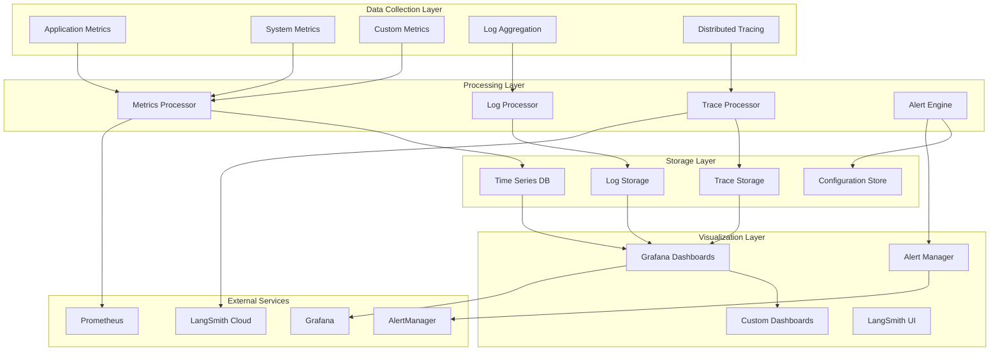

# 📊 **OBSERVABILITY & MONITORING PATTERNS**

**Version:** 3.0.0  
**Last Updated:** September 6, 2025  
**Status:** ✅ **PRODUCTION-READY OBSERVABILITY SYSTEM**

---

## 🎯 **OBSERVABILITY ARCHITECTURE OVERVIEW**

The Data Vault Obsidian system implements a **Comprehensive Observability Stack** with **Multi-Layer Monitoring**, **Distributed Tracing**, and **Real-time Analytics** capabilities.

### **Observability Stack Components**



---

## 🔍 **MONITORING PATTERNS**

### **1. Multi-Layer Monitoring Pattern**

#### **Application Layer Monitoring**
```python
class ApplicationMonitor:
    def __init__(self, metrics_collector: MetricsCollector):
        self.metrics_collector = metrics_collector
        self.request_counter = Counter('http_requests_total', ['method', 'endpoint', 'status'])
        self.request_duration = Histogram('http_request_duration_seconds', ['method', 'endpoint'])
        self.active_connections = Gauge('active_connections')
        self.error_counter = Counter('application_errors_total', ['error_type', 'component'])
    
    def record_request(self, method: str, endpoint: str, status_code: int, duration: float):
        """Record HTTP request metrics"""
        self.request_counter.labels(
            method=method,
            endpoint=endpoint,
            status=status_code
        ).inc()
        
        self.request_duration.labels(
            method=method,
            endpoint=endpoint
        ).observe(duration)
    
    def record_error(self, error_type: str, component: str):
        """Record application error"""
        self.error_counter.labels(
            error_type=error_type,
            component=component
        ).inc()
    
    def update_active_connections(self, count: int):
        """Update active connections count"""
        self.active_connections.set(count)
```

#### **Service Layer Monitoring**
```python
class ServiceMonitor:
    def __init__(self, service_name: str, metrics_collector: MetricsCollector):
        self.service_name = service_name
        self.metrics_collector = metrics_collector
        self.operation_counter = Counter(f'{service_name}_operations_total', ['operation', 'status'])
        self.operation_duration = Histogram(f'{service_name}_operation_duration_seconds', ['operation'])
        self.queue_size = Gauge(f'{service_name}_queue_size')
        self.health_status = Gauge(f'{service_name}_health_status')
    
    def record_operation(self, operation: str, status: str, duration: float):
        """Record service operation metrics"""
        self.operation_counter.labels(
            operation=operation,
            status=status
        ).inc()
        
        self.operation_duration.labels(
            operation=operation
        ).observe(duration)
    
    def update_queue_size(self, size: int):
        """Update service queue size"""
        self.queue_size.set(size)
    
    def update_health_status(self, is_healthy: bool):
        """Update service health status"""
        self.health_status.set(1 if is_healthy else 0)
```

#### **Infrastructure Layer Monitoring**
```python
class InfrastructureMonitor:
    def __init__(self, metrics_collector: MetricsCollector):
        self.metrics_collector = metrics_collector
        self.cpu_usage = Gauge('system_cpu_usage_percent')
        self.memory_usage = Gauge('system_memory_usage_bytes')
        self.disk_usage = Gauge('system_disk_usage_bytes', ['device'])
        self.network_io = Counter('system_network_io_bytes', ['interface', 'direction'])
        self.process_count = Gauge('system_process_count')
    
    def update_system_metrics(self, metrics: SystemMetrics):
        """Update system-level metrics"""
        self.cpu_usage.set(metrics.cpu_usage)
        self.memory_usage.set(metrics.memory_usage)
        
        for device, usage in metrics.disk_usage.items():
            self.disk_usage.labels(device=device).set(usage)
        
        for interface, io in metrics.network_io.items():
            self.network_io.labels(interface=interface, direction='in').inc(io.bytes_in)
            self.network_io.labels(interface=interface, direction='out').inc(io.bytes_out)
        
        self.process_count.set(metrics.process_count)
```

---

### **2. Distributed Tracing Pattern**

#### **Trace Context Propagation**
```python
class TraceContext:
    def __init__(self, trace_id: str, span_id: str, parent_span_id: str = None):
        self.trace_id = trace_id
        self.span_id = span_id
        self.parent_span_id = parent_span_id
        self.baggage = {}
    
    def to_headers(self) -> Dict[str, str]:
        """Convert trace context to HTTP headers"""
        return {
            'X-Trace-Id': self.trace_id,
            'X-Span-Id': self.span_id,
            'X-Parent-Span-Id': self.parent_span_id or '',
            'X-Baggage': json.dumps(self.baggage)
        }
    
    @classmethod
    def from_headers(cls, headers: Dict[str, str]) -> 'TraceContext':
        """Create trace context from HTTP headers"""
        return cls(
            trace_id=headers.get('X-Trace-Id', ''),
            span_id=headers.get('X-Span-Id', ''),
            parent_span_id=headers.get('X-Parent-Span-Id') or None,
            baggage=json.loads(headers.get('X-Baggage', '{}'))
        )

class DistributedTracer:
    def __init__(self, langsmith_client: LangSmithClient):
        self.langsmith_client = langsmith_client
        self.active_spans = {}
    
    async def start_span(self, name: str, parent_context: TraceContext = None) -> Span:
        """Start a new span"""
        span_id = str(uuid.uuid4())
        trace_id = parent_context.trace_id if parent_context else str(uuid.uuid4())
        
        span = Span(
            trace_id=trace_id,
            span_id=span_id,
            parent_span_id=parent_context.span_id if parent_context else None,
            name=name,
            start_time=time.time()
        )
        
        self.active_spans[span_id] = span
        return span
    
    async def finish_span(self, span: Span, status: str = 'ok', error: Exception = None):
        """Finish a span"""
        span.end_time = time.time()
        span.duration = span.end_time - span.start_time
        span.status = status
        
        if error:
            span.error = str(error)
            span.status = 'error'
        
        # Send span to LangSmith
        await self.langsmith_client.add_span(span)
        
        # Remove from active spans
        if span.span_id in self.active_spans:
            del self.active_spans[span.span_id]
```

#### **Automatic Instrumentation**
```python
class TracingMiddleware:
    def __init__(self, tracer: DistributedTracer):
        self.tracer = tracer
    
    async def __call__(self, request: Request, call_next):
        """FastAPI middleware for automatic tracing"""
        # Extract trace context from headers
        trace_context = TraceContext.from_headers(dict(request.headers))
        
        # Start span for this request
        span = await self.tracer.start_span(
            name=f"{request.method} {request.url.path}",
            parent_context=trace_context
        )
        
        # Add trace context to request state
        request.state.trace_context = TraceContext(
            trace_id=span.trace_id,
            span_id=span.span_id,
            parent_span_id=span.parent_span_id
        )
        
        try:
            # Process request
            response = await call_next(request)
            
            # Finish span with success
            await self.tracer.finish_span(span, status='ok')
            
            # Add trace headers to response
            response.headers.update(trace_context.to_headers())
            
            return response
            
        except Exception as e:
            # Finish span with error
            await self.tracer.finish_span(span, status='error', error=e)
            raise
```

---

### **3. Log Aggregation Pattern**

#### **Structured Logging**
```python
import structlog
import logging

class StructuredLogger:
    def __init__(self, service_name: str, log_level: str = 'INFO'):
        self.service_name = service_name
        self.logger = structlog.get_logger()
        
        # Configure structured logging
        structlog.configure(
            processors=[
                structlog.stdlib.filter_by_level,
                structlog.stdlib.add_logger_name,
                structlog.stdlib.add_log_level,
                structlog.stdlib.PositionalArgumentsFormatter(),
                structlog.processors.TimeStamper(fmt="iso"),
                structlog.processors.StackInfoRenderer(),
                structlog.processors.format_exc_info,
                structlog.processors.UnicodeDecoder(),
                structlog.processors.JSONRenderer()
            ],
            context_class=dict,
            logger_factory=structlog.stdlib.LoggerFactory(),
            wrapper_class=structlog.stdlib.BoundLogger,
            cache_logger_on_first_use=True,
        )
    
    def log_request(self, method: str, endpoint: str, status_code: int, 
                   duration: float, user_id: str = None, trace_id: str = None):
        """Log HTTP request with structured data"""
        self.logger.info(
            "HTTP request processed",
            method=method,
            endpoint=endpoint,
            status_code=status_code,
            duration=duration,
            user_id=user_id,
            trace_id=trace_id,
            service=self.service_name
        )
    
    def log_error(self, error: Exception, context: Dict[str, Any] = None, 
                 trace_id: str = None):
        """Log error with structured data"""
        self.logger.error(
            "Application error occurred",
            error=str(error),
            error_type=type(error).__name__,
            context=context or {},
            trace_id=trace_id,
            service=self.service_name,
            exc_info=True
        )
    
    def log_business_event(self, event_type: str, data: Dict[str, Any], 
                          user_id: str = None, trace_id: str = None):
        """Log business event with structured data"""
        self.logger.info(
            "Business event occurred",
            event_type=event_type,
            data=data,
            user_id=user_id,
            trace_id=trace_id,
            service=self.service_name
        )
```

#### **Log Aggregation Service**
```python
class LogAggregationService:
    def __init__(self, log_storage: LogStorage, log_processor: LogProcessor):
        self.log_storage = log_storage
        self.log_processor = log_processor
        self.log_buffer = []
        self.buffer_size = 1000
        self.flush_interval = 30  # seconds
    
    async def start(self):
        """Start log aggregation service"""
        # Start background task for log processing
        asyncio.create_task(self._process_logs_periodically())
    
    async def add_log(self, log_entry: LogEntry):
        """Add log entry to buffer"""
        self.log_buffer.append(log_entry)
        
        # Flush buffer if it's full
        if len(self.log_buffer) >= self.buffer_size:
            await self._flush_logs()
    
    async def _process_logs_periodically(self):
        """Process logs periodically"""
        while True:
            await asyncio.sleep(self.flush_interval)
            if self.log_buffer:
                await self._flush_logs()
    
    async def _flush_logs(self):
        """Flush log buffer to storage"""
        if not self.log_buffer:
            return
        
        # Process logs
        processed_logs = await self.log_processor.process_logs(self.log_buffer)
        
        # Store processed logs
        await self.log_storage.store_logs(processed_logs)
        
        # Clear buffer
        self.log_buffer.clear()
```

---

## 📈 **METRICS COLLECTION PATTERNS**

### **1. Custom Metrics Pattern**

#### **Business Metrics**
```python
class BusinessMetricsCollector:
    def __init__(self, metrics_collector: MetricsCollector):
        self.metrics_collector = metrics_collector
        self.notes_created = Counter('obsidian_notes_created_total', ['user_id', 'note_type'])
        self.workflows_executed = Counter('workflows_executed_total', ['workflow_type', 'status'])
        self.mcp_tool_calls = Counter('mcp_tool_calls_total', ['server', 'tool', 'status'])
        self.user_sessions = Gauge('active_user_sessions')
        self.data_processed = Counter('data_processed_bytes_total', ['data_type'])
    
    def record_note_creation(self, user_id: str, note_type: str):
        """Record note creation metric"""
        self.notes_created.labels(
            user_id=user_id,
            note_type=note_type
        ).inc()
    
    def record_workflow_execution(self, workflow_type: str, status: str):
        """Record workflow execution metric"""
        self.workflows_executed.labels(
            workflow_type=workflow_type,
            status=status
        ).inc()
    
    def record_mcp_tool_call(self, server: str, tool: str, status: str):
        """Record MCP tool call metric"""
        self.mcp_tool_calls.labels(
            server=server,
            tool=tool,
            status=status
        ).inc()
    
    def update_user_sessions(self, count: int):
        """Update active user sessions count"""
        self.user_sessions.set(count)
    
    def record_data_processed(self, data_type: str, bytes_processed: int):
        """Record data processing metric"""
        self.data_processed.labels(data_type=data_type).inc(bytes_processed)
```

#### **Performance Metrics**
```python
class PerformanceMetricsCollector:
    def __init__(self, metrics_collector: MetricsCollector):
        self.metrics_collector = metrics_collector
        self.response_times = Histogram('response_times_seconds', ['endpoint', 'method'])
        self.throughput = Counter('requests_per_second', ['endpoint'])
        self.error_rates = Counter('error_rates_total', ['endpoint', 'error_type'])
        self.queue_processing_times = Histogram('queue_processing_times_seconds', ['queue_name'])
        self.cache_hit_rates = Counter('cache_hits_total', ['cache_name', 'hit'])
    
    def record_response_time(self, endpoint: str, method: str, duration: float):
        """Record response time metric"""
        self.response_times.labels(
            endpoint=endpoint,
            method=method
        ).observe(duration)
    
    def record_throughput(self, endpoint: str):
        """Record throughput metric"""
        self.throughput.labels(endpoint=endpoint).inc()
    
    def record_error_rate(self, endpoint: str, error_type: str):
        """Record error rate metric"""
        self.error_rates.labels(
            endpoint=endpoint,
            error_type=error_type
        ).inc()
    
    def record_queue_processing_time(self, queue_name: str, duration: float):
        """Record queue processing time"""
        self.queue_processing_times.labels(queue_name=queue_name).observe(duration)
    
    def record_cache_hit(self, cache_name: str, hit: bool):
        """Record cache hit/miss"""
        self.cache_hit_rates.labels(
            cache_name=cache_name,
            hit='hit' if hit else 'miss'
        ).inc()
```

---

### **2. Real-time Metrics Pattern**

#### **Real-time Metrics Service**
```python
class RealTimeMetricsService:
    def __init__(self, websocket_manager: WebSocketManager):
        self.websocket_manager = websocket_manager
        self.metrics_cache = {}
        self.subscribers = set()
        self.update_interval = 1  # seconds
    
    async def start(self):
        """Start real-time metrics service"""
        asyncio.create_task(self._update_metrics_periodically())
    
    async def subscribe(self, websocket: WebSocket):
        """Subscribe to real-time metrics updates"""
        await websocket.accept()
        self.subscribers.add(websocket)
    
    async def unsubscribe(self, websocket: WebSocket):
        """Unsubscribe from real-time metrics updates"""
        self.subscribers.discard(websocket)
    
    async def _update_metrics_periodically(self):
        """Update metrics periodically and broadcast to subscribers"""
        while True:
            try:
                # Collect current metrics
                metrics = await self._collect_metrics()
                
                # Update cache
                self.metrics_cache = metrics
                
                # Broadcast to subscribers
                await self._broadcast_metrics(metrics)
                
            except Exception as e:
                logger.error(f"Error updating metrics: {e}")
            
            await asyncio.sleep(self.update_interval)
    
    async def _collect_metrics(self) -> Dict[str, Any]:
        """Collect current system metrics"""
        return {
            "timestamp": time.time(),
            "system": {
                "cpu_usage": psutil.cpu_percent(),
                "memory_usage": psutil.virtual_memory().percent,
                "disk_usage": psutil.disk_usage('/').percent
            },
            "application": {
                "active_connections": len(self.websocket_manager.active_connections),
                "requests_per_second": self._calculate_rps(),
                "error_rate": self._calculate_error_rate()
            },
            "services": {
                "obsidian_service": await self._get_service_health("obsidian"),
                "langgraph_service": await self._get_service_health("langgraph"),
                "mcp_service": await self._get_service_health("mcp")
            }
        }
    
    async def _broadcast_metrics(self, metrics: Dict[str, Any]):
        """Broadcast metrics to all subscribers"""
        if not self.subscribers:
            return
        
        message = json.dumps(metrics)
        disconnected = set()
        
        for websocket in self.subscribers:
            try:
                await websocket.send_text(message)
            except Exception:
                disconnected.add(websocket)
        
        # Remove disconnected websockets
        self.subscribers -= disconnected
```

---

## 🚨 **ALERTING PATTERNS**

### **1. Alert Rule Engine**

#### **Implementation**
```python
class AlertRuleEngine:
    def __init__(self, alert_manager: AlertManager):
        self.alert_manager = alert_manager
        self.rules = []
        self.alert_states = {}
    
    def add_rule(self, rule: AlertRule):
        """Add alert rule"""
        self.rules.append(rule)
    
    async def evaluate_metrics(self, metrics: Dict[str, Any]):
        """Evaluate metrics against alert rules"""
        for rule in self.rules:
            if await self._evaluate_rule(rule, metrics):
                await self._trigger_alert(rule, metrics)
    
    async def _evaluate_rule(self, rule: AlertRule, metrics: Dict[str, Any]) -> bool:
        """Evaluate a single alert rule"""
        try:
            # Get metric value
            value = self._get_metric_value(metrics, rule.metric_path)
            
            # Check condition
            if rule.condition == 'gt' and value > rule.threshold:
                return True
            elif rule.condition == 'lt' and value < rule.threshold:
                return True
            elif rule.condition == 'eq' and value == rule.threshold:
                return True
            
            return False
            
        except Exception as e:
            logger.error(f"Error evaluating rule {rule.name}: {e}")
            return False
    
    async def _trigger_alert(self, rule: AlertRule, metrics: Dict[str, Any]):
        """Trigger alert for rule"""
        alert_id = f"{rule.name}_{int(time.time())}"
        
        # Check if alert is already active
        if rule.name in self.alert_states and self.alert_states[rule.name].is_active:
            return
        
        # Create alert
        alert = Alert(
            id=alert_id,
            rule_name=rule.name,
            severity=rule.severity,
            message=rule.message,
            metrics=metrics,
            timestamp=time.time()
        )
        
        # Send alert
        await self.alert_manager.send_alert(alert)
        
        # Update alert state
        self.alert_states[rule.name] = AlertState(
            is_active=True,
            last_triggered=time.time(),
            alert_count=1
        )
    
    def _get_metric_value(self, metrics: Dict[str, Any], path: str) -> float:
        """Get metric value from nested dictionary"""
        keys = path.split('.')
        value = metrics
        
        for key in keys:
            value = value[key]
        
        return float(value)
```

#### **Alert Rules Configuration**
```python
# Define alert rules
alert_rules = [
    AlertRule(
        name="high_cpu_usage",
        metric_path="system.cpu_usage",
        condition="gt",
        threshold=80.0,
        severity="warning",
        message="CPU usage is above 80%"
    ),
    AlertRule(
        name="high_memory_usage",
        metric_path="system.memory_usage",
        condition="gt",
        threshold=90.0,
        severity="critical",
        message="Memory usage is above 90%"
    ),
    AlertRule(
        name="high_error_rate",
        metric_path="application.error_rate",
        condition="gt",
        threshold=5.0,
        severity="warning",
        message="Error rate is above 5%"
    ),
    AlertRule(
        name="service_down",
        metric_path="services.obsidian_service.health",
        condition="eq",
        threshold=0,
        severity="critical",
        message="Obsidian service is down"
    )
]
```

---

### **2. Alert Notification System**

#### **Implementation**
```python
class AlertNotificationSystem:
    def __init__(self):
        self.notification_channels = {
            'email': EmailNotificationChannel(),
            'slack': SlackNotificationChannel(),
            'webhook': WebhookNotificationChannel()
        }
        self.alert_routing = AlertRouting()
    
    async def send_alert(self, alert: Alert):
        """Send alert through appropriate channels"""
        # Determine notification channels based on severity
        channels = self.alert_routing.get_channels(alert.severity)
        
        # Send notifications
        for channel_name in channels:
            if channel_name in self.notification_channels:
                try:
                    await self.notification_channels[channel_name].send(alert)
                except Exception as e:
                    logger.error(f"Failed to send alert via {channel_name}: {e}")
    
    def add_notification_channel(self, name: str, channel: NotificationChannel):
        """Add notification channel"""
        self.notification_channels[name] = channel

class EmailNotificationChannel:
    def __init__(self, smtp_config: SMTPConfig):
        self.smtp_config = smtp_config
    
    async def send(self, alert: Alert):
        """Send email notification"""
        # Implementation for email sending
        pass

class SlackNotificationChannel:
    def __init__(self, webhook_url: str):
        self.webhook_url = webhook_url
    
    async def send(self, alert: Alert):
        """Send Slack notification"""
        # Implementation for Slack webhook
        pass
```

---

## 📊 **DASHBOARD PATTERNS**

### **1. Real-time Dashboard**

#### **Implementation**
```python
class RealTimeDashboard:
    def __init__(self, websocket_manager: WebSocketManager, 
                 metrics_service: RealTimeMetricsService):
        self.websocket_manager = websocket_manager
        self.metrics_service = metrics_service
        self.dashboard_data = {}
    
    async def get_dashboard_data(self) -> Dict[str, Any]:
        """Get current dashboard data"""
        return {
            "timestamp": time.time(),
            "system_health": await self._get_system_health(),
            "service_status": await self._get_service_status(),
            "performance_metrics": await self._get_performance_metrics(),
            "business_metrics": await self._get_business_metrics(),
            "alerts": await self._get_active_alerts()
        }
    
    async def _get_system_health(self) -> Dict[str, Any]:
        """Get system health metrics"""
        return {
            "cpu_usage": psutil.cpu_percent(),
            "memory_usage": psutil.virtual_memory().percent,
            "disk_usage": psutil.disk_usage('/').percent,
            "network_io": psutil.net_io_counters()._asdict()
        }
    
    async def _get_service_status(self) -> Dict[str, Any]:
        """Get service status"""
        return {
            "obsidian_service": await self._check_service_health("obsidian"),
            "langgraph_service": await self._check_service_health("langgraph"),
            "mcp_service": await self._check_service_health("mcp"),
            "monitoring_service": await self._check_service_health("monitoring")
        }
    
    async def _get_performance_metrics(self) -> Dict[str, Any]:
        """Get performance metrics"""
        return {
            "response_times": await self._get_response_times(),
            "throughput": await self._get_throughput(),
            "error_rates": await self._get_error_rates()
        }
    
    async def _get_business_metrics(self) -> Dict[str, Any]:
        """Get business metrics"""
        return {
            "notes_created_today": await self._get_notes_created_today(),
            "workflows_executed_today": await self._get_workflows_executed_today(),
            "active_users": await self._get_active_users()
        }
    
    async def _get_active_alerts(self) -> List[Dict[str, Any]]:
        """Get active alerts"""
        return await self._get_alerts_by_status("active")
```

---

**Last Updated:** September 6, 2025  
**Observability & Monitoring Version:** 3.0.0  
**Status:** ✅ **PRODUCTION-READY**

**CENTRALIZED REPORTS & CHANGELOG SYSTEM COMPLETE!**
