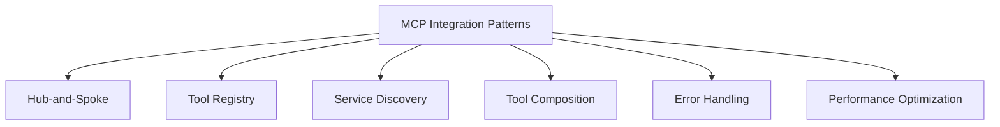
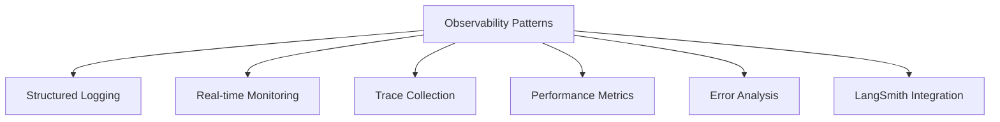

# 🔧 **MCP PATTERNS INDEX**

**Version:** 3.0.0  
**Last Updated:** September 6, 2025  
**Status:** ✅ **MCP PATTERNS COMPLETE**

---

## 🎯 **MCP PATTERNS OVERVIEW**

This folder contains comprehensive patterns for Model Context Protocol (MCP) integration, observability, and monitoring in the Data Vault Obsidian system.

### **Pattern Categories**

1. **Integration Patterns** - Core MCP integration techniques
2. **Observability Patterns** - Monitoring and observability patterns
3. **Performance Patterns** - Performance optimization patterns
4. **Security Patterns** - Security and access control patterns

---

## 📚 **PATTERN DOCUMENTATION**

### **🔌 Integration Patterns**

#### **[MCP Integration Patterns](MCP_INTEGRATION_PATTERNS.md)**
- **Hub-and-Spoke Pattern** - Central MCP server management
- **Tool Registry Pattern** - Dynamic tool discovery and registration
- **Service Discovery Pattern** - Automatic MCP server detection
- **Tool Composition Pattern** - Complex operation composition
- **Error Handling Pattern** - Comprehensive error management
- **Performance Optimization** - MCP performance tuning

**Key Features:**
- Complete MCP server implementation patterns
- FastMCP framework integration
- Tool composition and orchestration
- Error handling and recovery
- Performance monitoring and optimization

### **📊 Observability Patterns**

#### **[Observability Monitoring Patterns](OBSERVABILITY_MONITORING_PATTERNS.md)**
- **Structured Logging** - Centralized logging with thread tracking
- **Real-time Monitoring** - Live system monitoring and alerting
- **Trace Collection** - Comprehensive trace collection and correlation
- **Performance Metrics** - Detailed performance monitoring
- **Error Analysis** - Advanced error detection and analysis

**Key Features:**
- LangSmith integration for professional trace management
- OpenTelemetry instrumentation
- Distributed tracing across services
- Real-time monitoring dashboards
- Intelligent error analysis and correlation

---

## 🏗️ **PATTERN ARCHITECTURE**

### **Integration Pattern Hierarchy**

### **Observability Pattern Hierarchy**

---

## 🔧 **IMPLEMENTATION GUIDES**

### **Getting Started with MCP Patterns**

1. **Start with Integration Patterns**
   - Read [MCP Integration Patterns](MCP_INTEGRATION_PATTERNS.md)
   - Understand the Hub-and-Spoke architecture
   - Implement Tool Registry pattern

2. **Add Observability**
   - Read [Observability Monitoring Patterns](OBSERVABILITY_MONITORING_PATTERNS.md)
   - Setup structured logging
   - Implement trace collection

3. **Optimize Performance**
   - Apply performance optimization patterns
   - Monitor system metrics
   - Tune based on observability data

### **Pattern Selection Guide**

| Use Case | Recommended Pattern | Documentation |
|----------|-------------------|---------------|
| **New MCP Service** | Hub-and-Spoke + Tool Registry | [MCP Integration Patterns](MCP_INTEGRATION_PATTERNS.md) |
| **Tool Composition** | Tool Composition Pattern | [MCP Integration Patterns](MCP_INTEGRATION_PATTERNS.md) |
| **Error Handling** | Error Handling Pattern | [MCP Integration Patterns](MCP_INTEGRATION_PATTERNS.md) |
| **Monitoring Setup** | Structured Logging + Real-time Monitoring | [Observability Monitoring Patterns](OBSERVABILITY_MONITORING_PATTERNS.md) |
| **Trace Collection** | Trace Collection + LangSmith Integration | [Observability Monitoring Patterns](OBSERVABILITY_MONITORING_PATTERNS.md) |
| **Performance Tuning** | Performance Optimization | [MCP Integration Patterns](MCP_INTEGRATION_PATTERNS.md) |

---

## 📊 **PATTERN SUCCESS METRICS**

### **Integration Pattern Metrics**
- **Tool Discovery Time:** < 100ms
- **Tool Execution Success:** > 99%
- **Error Recovery Time:** < 200ms
- **Performance Overhead:** < 5%

### **Observability Pattern Metrics**
- **Trace Collection Success:** > 99%
- **Log Processing Time:** < 10ms
- **Monitoring Latency:** < 50ms
- **Error Detection Accuracy:** > 95%

---

## 🚀 **IMPLEMENTATION ROADMAP**

### **Phase 1: Core Integration (Weeks 1-2)**
1. **Hub-and-Spoke Pattern** - Central MCP server setup
2. **Tool Registry Pattern** - Dynamic tool management
3. **Service Discovery Pattern** - Automatic server detection
4. **Error Handling Pattern** - Comprehensive error management

### **Phase 2: Observability (Weeks 3-4)**
1. **Structured Logging** - Centralized logging system
2. **Trace Collection** - Comprehensive trace collection
3. **Performance Metrics** - Real-time performance monitoring
4. **LangSmith Integration** - Professional trace management

### **Phase 3: Optimization (Weeks 5-6)**
1. **Performance Optimization** - System performance tuning
2. **Error Analysis** - Advanced error detection
3. **Monitoring Dashboards** - Visual monitoring interface
4. **Alerting System** - Proactive issue detection

### **Phase 4: Advanced Features (Weeks 7-8)**
1. **Tool Composition** - Complex operation composition
2. **Distributed Tracing** - Cross-service trace correlation
3. **AI-Powered Analysis** - Intelligent error analysis
4. **Predictive Monitoring** - Proactive issue prevention

---

## 🔗 **RELATED DOCUMENTATION**

### **MCP Documentation**
- **[MCP Documentation Hub](../README.md)** - Main MCP documentation
- **[MCP Development Roadmap](../roadmaps/MCP_DEVELOPMENT_ROADMAP.md)** - Development strategy
- **[Observability MCP Roadmap](../roadmaps/OBSERVABILITY_MCP_ROADMAP.md)** - Observability roadmap

### **Architecture Documentation**
- **[Architecture Overview](../../architecture/ARCHITECTURE_OVERVIEW.md)** - Main system architecture
- **[Architecture Patterns Index](../../architecture/ARCHITECTURE_PATTERNS_INDEX.md)** - Complete pattern library

### **Integration Guides**
- **[MCP Integration Guide](../guides/MCP_INTEGRATION_GUIDE.md)** - Step-by-step integration guide

---

## 🎯 **NEXT STEPS**

### **Immediate Actions**
1. **Review Integration Patterns** - Understand MCP integration techniques
2. **Setup Observability** - Implement monitoring and logging
3. **Apply Performance Patterns** - Optimize system performance
4. **Test Patterns** - Validate pattern implementations

### **Short-term Goals**
1. **Implement All Patterns** - Deploy comprehensive pattern library
2. **Monitor Performance** - Track pattern effectiveness
3. **Optimize Based on Data** - Improve patterns based on metrics
4. **Document Lessons Learned** - Update patterns with real-world experience

### **Long-term Vision**
1. **Advanced Pattern Development** - Create new patterns for emerging needs
2. **Pattern Automation** - Automate pattern implementation
3. **Pattern Intelligence** - AI-powered pattern selection and optimization
4. **Pattern Ecosystem** - Build comprehensive pattern ecosystem

---

**Last Updated:** September 6, 2025  
**MCP Patterns Version:** 3.0.0  
**Status:** ✅ **MCP PATTERNS COMPLETE**

**MCP PATTERNS INDEX COMPLETE!**
